# UnoCSS 配置与使用

<cite>
**本文引用的文件**
- [uno.config.ts](file://yudao-ui/yudao-ui-admin-vue3/uno.config.ts)
- [main.ts](file://yudao-ui/yudao-ui-admin-vue3/src/main.ts)
- [index.ts](file://yudao-ui/yudao-ui-admin-vue3/build/vite/index.ts)
- [RtcCallRunning.vue](file://yudao-ui/yudao-ui-admin-vue3/src/views/im/home/components/rtc/RtcCallRunning.vue)
- [unocss 插件入口](file://yudao-ui/yudao-ui-admin-vue3/src/plugins/unocss/index.ts)
- [全局样式入口](file://yudao-ui/yudao-ui-admin-vue3/src/styles/index.scss)
- [主题变量定义](file://yudao-ui/yudao-ui-admin-vue3/src/styles/theme.scss)
- [变量定义文件](file://yudao-ui/yudao-ui-admin-vue3/src/styles/var.css)
- [variables.scss](file://yudao-ui/yudao-ui-admin-vue3/src/styles/variables.scss)
- [App.vue](file://yudao-ui/yudao-ui-admin-vue3/src/App.vue)
- [Layout.vue](file://yudao-ui/yudao-ui-admin-vue3/src/layout/Layout.vue)
- [DvCheckPlanSelect.vue](file://yudao-ui/yudao-ui-admin-vue3/src/views/mes/dv/checkplan/components/DvCheckPlanSelect.vue)
- [DvMachinerySelect.vue](file://yudao-ui/yudao-ui-admin-vue3/src/views/mes/dv/machinery/components/DvMachinerySelect.vue)
- [MdItemSelect.vue](file://yudao-ui/yudao-ui-admin-vue3/src/views/mes/md/item/components/MdItemSelect.vue)
- [WmMaterialStockSelect.vue](file://yudao-ui/yudao-ui-admin-vue3/src/views/mes/wm/materialstock/components/WmMaterialStockSelect.vue)
</cite>

## 目录
1. [简介](#简介)
2. [项目结构](#项目结构)
3. [核心组件](#核心组件)
4. [架构概览](#架构概览)
5. [详细组件分析](#详细组件分析)
6. [依赖关系分析](#依赖关系分析)
7. [性能考虑](#性能考虑)
8. [故障排除指南](#故障排除指南)
9. [结论](#结论)
10. [附录](#附录)

## 简介

UnoCSS 是一个即时按需的原子化 CSS 引擎，它通过解析代码中的类名来动态生成所需的 CSS 规则。在本项目中，UnoCSS 被集成到 Vite 构建流程中，实现了高效的样式开发体验。

### 核心理念

- **原子化设计**：将 CSS 属性拆分为独立的原子类，如 `text-center`、`p-4`、`bg-blue-500`
- **按需生成**：只生成实际使用的样式规则，避免无用 CSS
- **高性能**：利用 JIT（Just-In-Time）编译器实现快速构建
- **可扩展性**：支持自定义规则、预设和转换器

### 主要特性

- 实时热更新支持
- 支持多种预设（基础、图标、工具提示等）
- 自定义规则和变量系统
- 与 Vite 生态系统的无缝集成
- 组件级样式隔离

## 项目结构

本项目采用模块化的前端架构，UnoCSS 集成在以下关键位置：

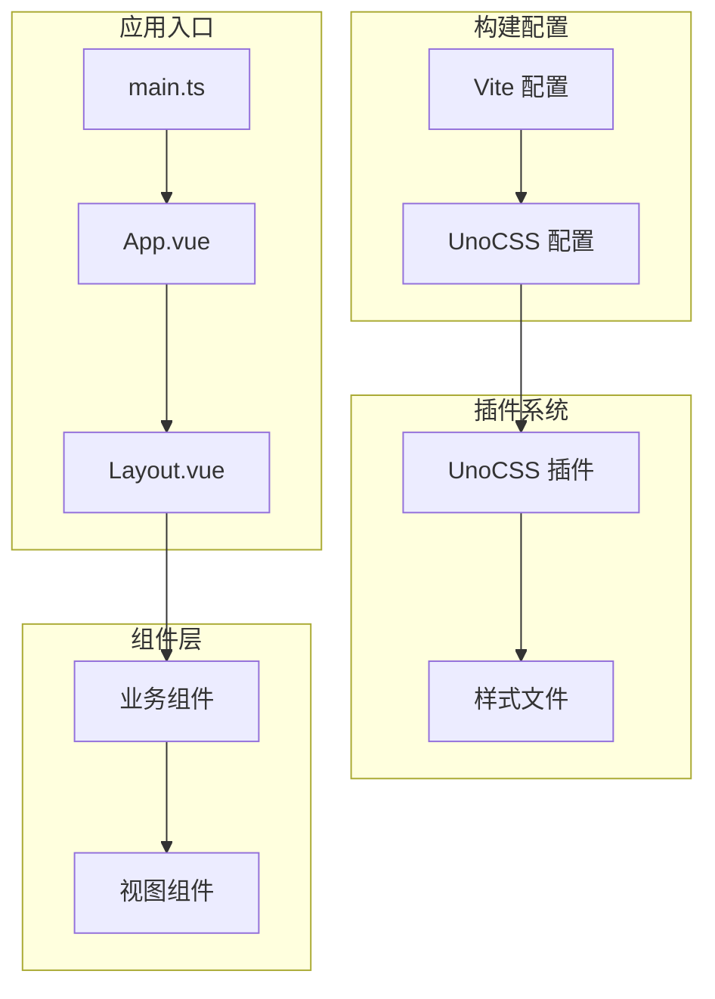

**图表来源**
- [uno.config.ts:1-20](file://yudao-ui/yudao-ui-admin-vue3/uno.config.ts#L1-L20)
- [main.ts:1-5](file://yudao-ui/yudao-ui-admin-vue3/src/main.ts#L1-L5)
- [index.ts:1-30](file://yudao-ui/yudao-ui-admin-vue3/build/vite/index.ts#L1-L30)

**章节来源**
- [uno.config.ts:1-20](file://yudao-ui/yudao-ui-admin-vue3/uno.config.ts#L1-L20)
- [main.ts:1-5](file://yudao-ui/yudao-ui-admin-vue3/src/main.ts#L1-L5)
- [index.ts:1-30](file://yudao-ui/yudao-ui-admin-vue3/build/vite/index.ts#L1-L30)

## 核心组件

### UnoCSS 配置系统

项目的核心配置位于 `uno.config.ts` 文件中，定义了 UnoCSS 的基本设置和扩展功能。

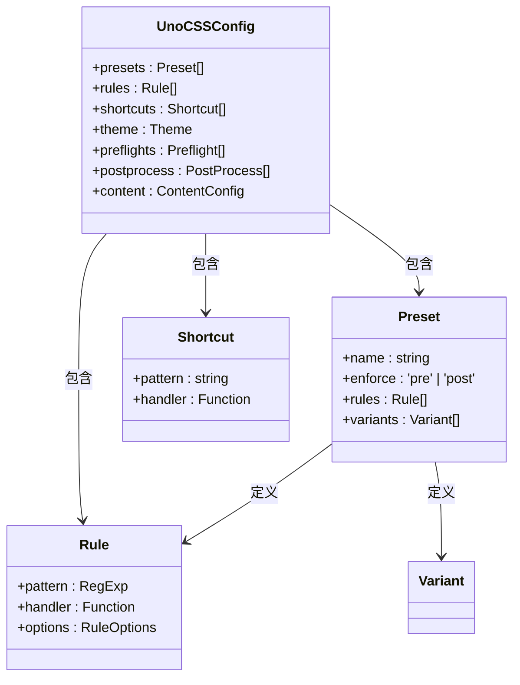

**图表来源**
- [uno.config.ts:1-20](file://yudao-ui/yudao-ui-admin-vue3/uno.config.ts#L1-L20)

### 应用初始化流程

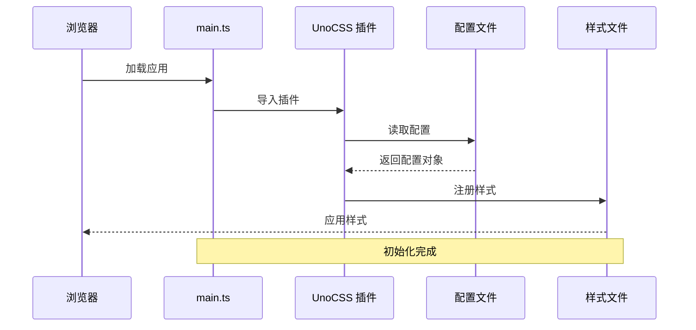

**图表来源**
- [main.ts:1-5](file://yudao-ui/yudao-ui-admin-vue3/src/main.ts#L1-L5)
- [unocss 插件入口](file://yudao-ui/yudao-ui-admin-vue3/src/plugins/unocss/index.ts)

**章节来源**
- [uno.config.ts:1-20](file://yudao-ui/yudao-ui-admin-vue3/uno.config.ts#L1-L20)
- [main.ts:1-5](file://yudao-ui/yudao-ui-admin-vue3/src/main.ts#L1-L5)

## 架构概览

### 整体架构设计

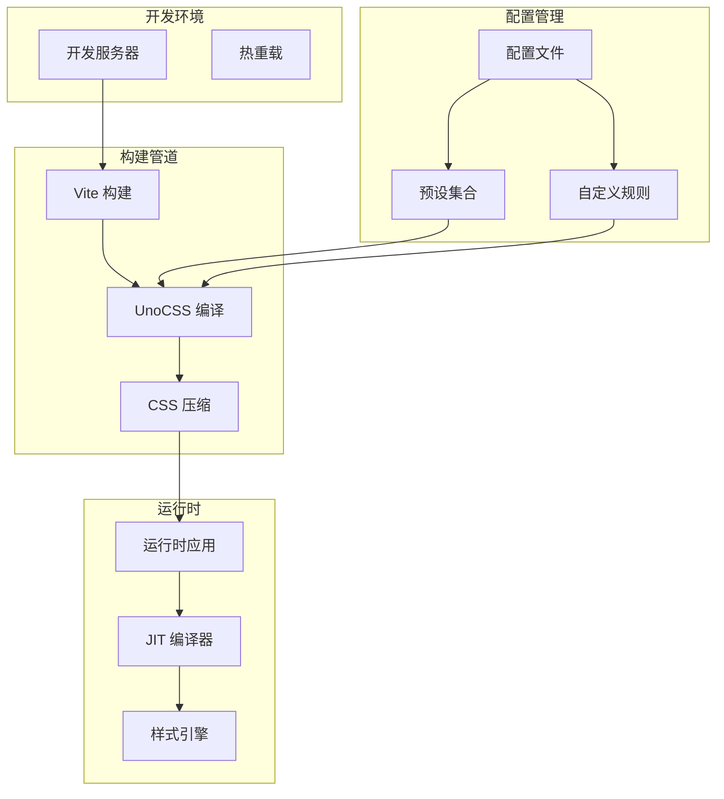

**图表来源**
- [uno.config.ts:1-20](file://yudao-ui/yudao-ui-admin-vue3/uno.config.ts#L1-L20)
- [index.ts:1-30](file://yudao-ui/yudao-ui-admin-vue3/build/vite/index.ts#L1-L30)

### 样式生成流程

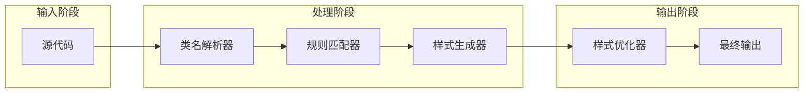

**图表来源**
- [uno.config.ts:1-20](file://yudao-ui/yudao-ui-admin-vue3/uno.config.ts#L1-L20)

## 详细组件分析

### 快捷类名系统

项目实现了丰富的快捷类名体系，覆盖了常用的 CSS 属性：

#### 颜色系统

| 类型 | 示例 | 用途 |
|------|------|------|
| 文字颜色 | `text-red-500` | 设置文本颜色 |
| 背景颜色 | `bg-blue-600` | 设置背景颜色 |
| 边框颜色 | `border-green-400` | 设置边框颜色 |
| 悬停效果 | `hover:bg-yellow-300` | 鼠标悬停状态 |

#### 间距系统

| 类型 | 示例 | 用途 |
|------|------|------|
| 内边距 | `p-4` | 四周内边距 |
| 上内边距 | `pt-2` | 上方内边距 |
| 外边距 | `m-3` | 四周外边距 |
| 左外边距 | `ml-1` | 左侧外边距 |

#### 布局系统

| 类型 | 示例 | 用途 |
|------|------|------|
| 显示模式 | `flex` | 弹性布局 |
| 对齐方式 | `items-center` | 垂直居中对齐 |
| 内容分布 | `justify-between` | 两端对齐分布 |
| 方向控制 | `flex-row` | 水平排列 |

#### 字体系统

| 类型 | 示例 | 用途 |
|------|------|------|
| 字体大小 | `text-lg` | 大号字体 |
| 字体粗细 | `font-bold` | 粗体字 |
| 行高 | `leading-relaxed` | 松散行高 |
| 字符间距 | `tracking-wide` | 宽字符间距 |

**章节来源**
- [RtcCallRunning.vue:220-235](file://yudao-ui/yudao-ui-admin-vue3/src/views/im/home/components/rtc/RtcCallRunning.vue#L220-L235)

### 自定义规则实现

项目通过多种方式实现自定义规则：

#### 动态类名生成

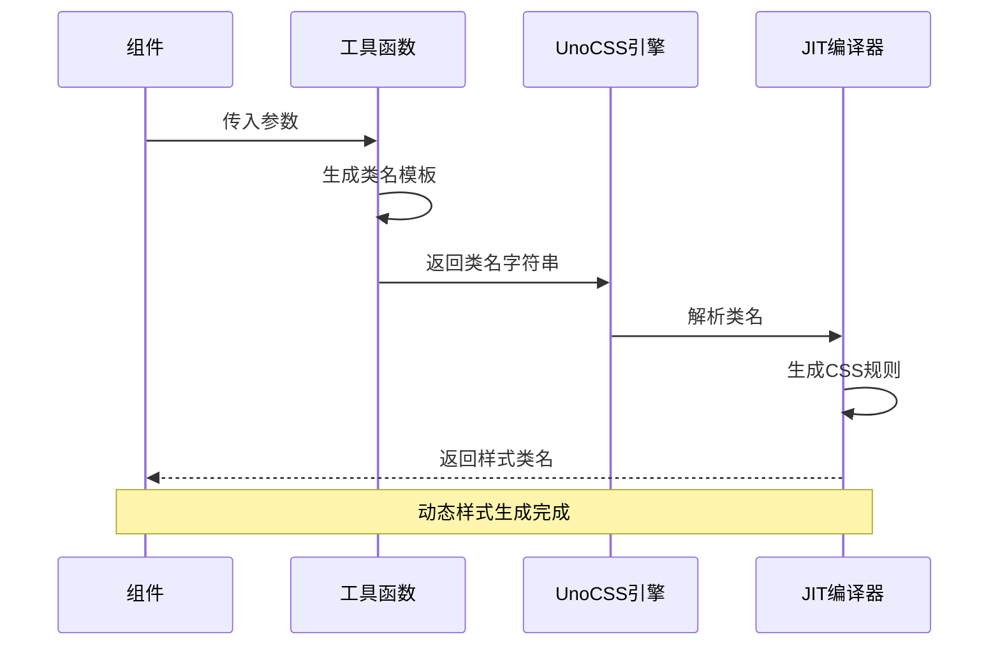

**图表来源**
- [RtcCallRunning.vue:220-235](file://yudao-ui/yudao-ui-admin-vue3/src/views/im/home/components/rtc/RtcCallRunning.vue#L220-L235)

#### 变量系统集成

项目使用多层变量系统来管理样式变量：

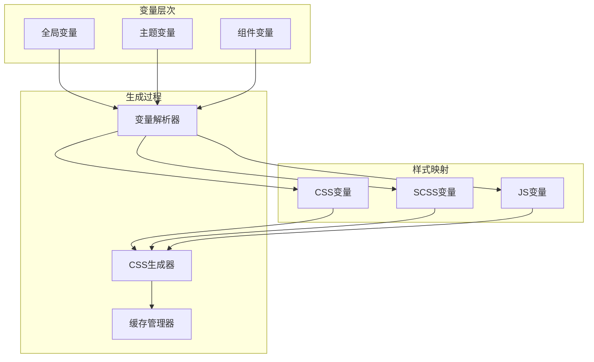

**图表来源**
- [theme.scss](file://yudao-ui/yudao-ui-admin-vue3/src/styles/theme.scss)
- [var.css](file://yudao-ui/yudao-ui-admin-vue3/src/styles/var.css)
- [variables.scss](file://yudao-ui/yudao-ui-admin-vue3/src/styles/variables.scss)

**章节来源**
- [theme.scss](file://yudao-ui/yudao-ui-admin-vue3/src/styles/theme.scss)
- [var.css](file://yudao-ui/yudao-ui-admin-vue3/src/styles/var.css)
- [variables.scss](file://yudao-ui/yudao-ui-admin-vue3/src/styles/variables.scss)

### 组件集成模式

#### 布局组件集成

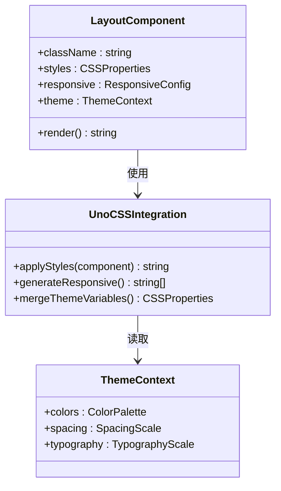

**图表来源**
- [Layout.vue](file://yudao-ui/yudao-ui-admin-vue3/src/layout/Layout.vue)
- [App.vue](file://yudao-ui/yudao-ui-admin-vue3/src/App.vue)

#### 业务组件集成

项目中的业务组件广泛使用 UnoCSS 类名：

| 组件类型 | 使用场景 | UnoCSS 类名示例 |
|----------|----------|-----------------|
| 输入组件 | 表单输入框 | `border rounded p-2` |
| 按钮组件 | 操作按钮 | `btn bg-blue-500 text-white` |
| 卡片组件 | 内容卡片 | `card shadow-lg rounded` |
| 列表组件 | 数据列表 | `list divide-y` |

**章节来源**
- [DvCheckPlanSelect.vue:170-175](file://yudao-ui/yudao-ui-admin-vue3/src/views/mes/dv/checkplan/components/DvCheckPlanSelect.vue#L170-L175)
- [DvMachinerySelect.vue:150-160](file://yudao-ui/yudao-ui-admin-vue3/src/views/mes/dv/machinery/components/DvMachinerySelect.vue#L150-L160)
- [MdItemSelect.vue:150-160](file://yudao-ui/yudao-ui-admin-vue3/src/views/mes/md/item/components/MdItemSelect.vue#L150-L160)
- [WmMaterialStockSelect.vue:170-185](file://yudao-ui/yudao-ui-admin-vue3/src/views/mes/wm/materialstock/components/WmMaterialStockSelect.vue#L170-L185)

## 依赖关系分析

### 核心依赖关系

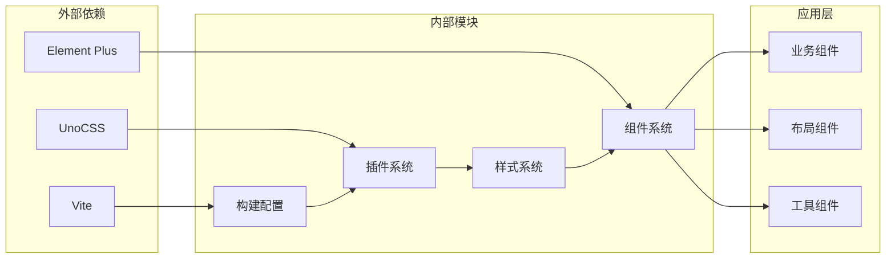

**图表来源**
- [index.ts:1-30](file://yudao-ui/yudao-ui-admin-vue3/build/vite/index.ts#L1-L30)
- [main.ts:1-5](file://yudao-ui/yudao-ui-admin-vue3/src/main.ts#L1-L5)

### 样式依赖链

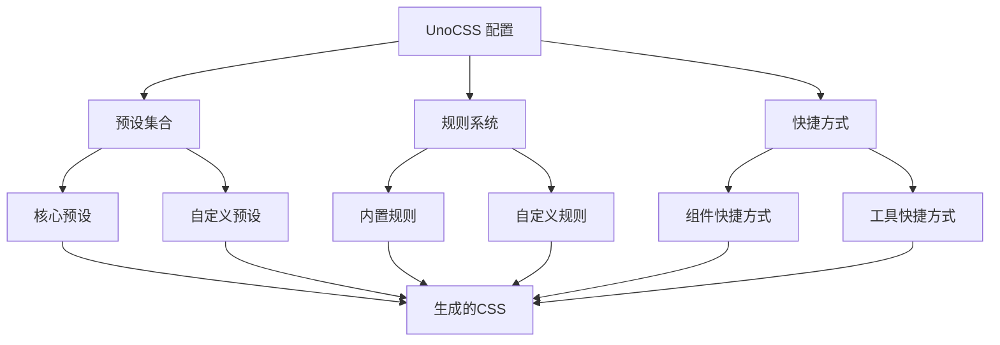

**图表来源**
- [uno.config.ts:1-20](file://yudao-ui/yudao-ui-admin-vue3/uno.config.ts#L1-L20)

**章节来源**
- [uno.config.ts:1-20](file://yudao-ui/yudao-ui-admin-vue3/uno.config.ts#L1-L20)
- [index.ts:1-30](file://yudao-ui/yudao-ui-admin-vue3/build/vite/index.ts#L1-L30)

## 性能考虑

### 按需生成机制

UnoCSS 的按需生成机制是其性能优势的核心：

#### 编译时优化

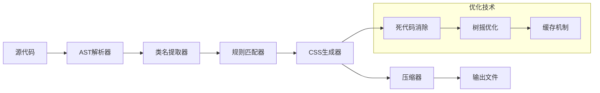

#### 运行时性能

- **增量编译**：只重新编译变更的文件
- **缓存策略**：利用文件系统缓存避免重复计算
- **内存管理**：智能内存回收机制
- **并发处理**：多线程并行编译优化

### 内存使用优化

| 优化策略 | 实现方式 | 性能收益 |
|----------|----------|----------|
| 文件缓存 | 基于文件哈希的缓存 | 减少重复编译时间 |
| 规则缓存 | 编译后规则缓存 | 提升后续构建速度 |
| 内存池 | 对象复用机制 | 降低内存分配开销 |
| 增量更新 | 只处理变更文件 | 最小化编译范围 |

## 故障排除指南

### 常见问题及解决方案

#### 类名不生效

**问题描述**：某些 UnoCSS 类名在组件中不生效

**可能原因**：
1. 类名拼写错误
2. 作用域冲突
3. 样式优先级问题
4. 组件内部样式覆盖

**解决方案**：
```javascript
// 检查类名拼写
// 正确：text-center
// 错误：text-centre

// 使用 !important 提升优先级
// 在需要的地方添加 !important
```

#### 样式覆盖问题

**问题描述**：UnoCSS 样式被其他样式覆盖

**解决方案**：
```vue
<template>
  <!-- 使用 :deep 选择器穿透组件样式 -->
  <el-input class="!cursor-pointer">
    <template #prepend>
      <div class="text-red-500">内容</div>
    </template>
  </el-input>
</template>

<style scoped>
/* 使用 :deep 穿透样式 */
.el-input :deep(.el-input__inner) {
  @apply cursor-pointer;
}
</style>
```

#### 构建错误

**问题描述**：构建过程中出现 UnoCSS 相关错误

**排查步骤**：
1. 检查配置文件语法
2. 验证依赖版本兼容性
3. 清理缓存后重试

**章节来源**
- [DvCheckPlanSelect.vue:170-175](file://yudao-ui/yudao-ui-admin-vue3/src/views/mes/dv/checkplan/components/DvCheckPlanSelect.vue#L170-L175)
- [DvMachinerySelect.vue:150-160](file://yudao-ui/yudao-ui-admin-vue3/src/views/mes/dv/machinery/components/DvMachinerySelect.vue#L150-L160)
- [MdItemSelect.vue:150-160](file://yudao-ui/yudao-ui-admin-vue3/src/views/mes/md/item/components/MdItemSelect.vue#L150-L160)
- [WmMaterialStockSelect.vue:170-185](file://yudao-ui/yudao-ui-admin-vue3/src/views/mes/wm/materialstock/components/WmMaterialStockSelect.vue#L170-L185)

### 调试技巧

#### 开发者工具使用

1. **检查生成的 CSS**：在浏览器开发者工具中查看实际生成的样式
2. **验证类名解析**：确认类名是否正确解析为 CSS 规则
3. **监控性能**：使用性能面板分析构建时间

#### 日志调试

```typescript
// 启用详细日志
const unoConfig = defineConfig({
  verbose: true,
  debug: true
})
```

## 结论

UnoCSS 在本项目中的成功集成展示了现代前端开发的最佳实践。通过合理的配置和架构设计，项目实现了：

### 主要成就

- **开发效率提升**：原子化类名大幅减少了样式编写时间
- **维护成本降低**：统一的样式系统便于团队协作
- **性能表现优异**：按需生成机制确保了最佳的加载性能
- **可扩展性强**：灵活的配置系统支持未来功能扩展

### 技术优势

1. **即时反馈**：开发时的热重载和实时编译
2. **智能优化**：自动的死代码消除和样式压缩
3. **生态兼容**：与现有组件库的良好集成
4. **团队协作**：统一的样式约定减少沟通成本

### 未来展望

随着项目的发展，建议继续优化：
- 完善自定义规则库
- 增强主题系统的灵活性
- 优化大型组件的样式管理
- 探索更多 UnoCSS 高级特性

## 附录

### 快速开始指南

#### 基础配置

```typescript
// uno.config.ts
import { defineConfig } from 'unocss'

export default defineConfig({
  // 预设配置
  presets: [
    // 添加必要的预设
  ],
  
  // 自定义规则
  rules: [
    // 定义项目特定的规则
  ],
  
  // 快捷方式
  shortcuts: [
    // 定义常用的样式组合
  ]
})
```

#### 在组件中使用

```vue
<template>
  <div class="bg-blue-500 text-white p-4 rounded">
    <h1 class="text-xl font-bold mb-2">标题</h1>
    <p class="text-sm opacity-75">内容</p>
  </div>
</template>
```

### 最佳实践

1. **命名规范**：遵循一致的类名命名约定
2. **样式组织**：合理组织和分组相关的样式类
3. **性能监控**：定期检查生成的 CSS 大小和性能
4. **团队培训**：确保团队成员熟悉 UnoCSS 的使用方法