# 响应式设计实现

<cite>
**本文档引用的文件**
- [Layout.vue](file://yudao-ui/yudao-ui-admin-vue3/src/layout/Layout.vue)
- [index.scss](file://yudao-ui/yudao-ui-admin-vue3/src/styles/index.scss)
- [variables.scss](file://yudao-ui/yudao-ui-admin-vue3/src/styles/variables.scss)
- [global.module.scss](file://yudao-ui/yudao-ui-admin-vue3/src/styles/global.module.scss)
- [simple-process-designer.scss](file://yudao-ui/yudao-ui-admin-vue3/src/components/SimpleProcessDesignerV2/theme/simple-process-designer.scss)
- [process-designer.scss](file://yudao-ui/yudao-ui-admin-vue3/src/components/bpmnProcessDesigner/package/theme/process-designer.scss)
- [process-panel.scss](file://yudao-ui/yudao-ui-admin-vue3/src/components/bpmnProcessDesigner/package/theme/process-panel.scss)
- [useRenderLayout.ts](file://yudao-ui/yudao-ui-admin-vue3/src/layout/components/useRenderLayout.ts)
- [useDesign.ts](file://yudao-ui/yudao-ui-admin-vue3/src/hooks/web/useDesign.ts)
- [layout.ts](file://yudao-ui/yudao-ui-admin-vue3/src/utils/layout.ts)
- [app.store.ts](file://yudao-ui/yudao-ui-admin-vue3/src/store/modules/app.ts)
- [vite.config.ts](file://yudao-ui/yudao-ui-admin-vue3/vite.config.ts)
- [uno.config.ts](file://yudao-ui/yudao-ui-admin-vue3/uno.config.ts)
</cite>

## 目录
1. [引言](#引言)
2. [项目结构](#项目结构)
3. [核心组件](#核心组件)
4. [架构概览](#架构概览)
5. [详细组件分析](#详细组件分析)
6. [依赖关系分析](#依赖关系分析)
7. [性能考虑](#性能考虑)
8. [故障排除指南](#故障排除指南)
9. [结论](#结论)

## 引言

本项目采用现代化的前端技术栈实现响应式设计，基于 Vue 3 + TypeScript + Element Plus + UnoCSS 构建。响应式设计通过灵活的布局系统、媒体查询和现代 CSS 技术实现跨设备适配，确保在桌面端、平板和移动端都能提供优秀的用户体验。

## 项目结构

项目采用模块化组织方式，响应式设计相关的代码主要分布在以下目录：

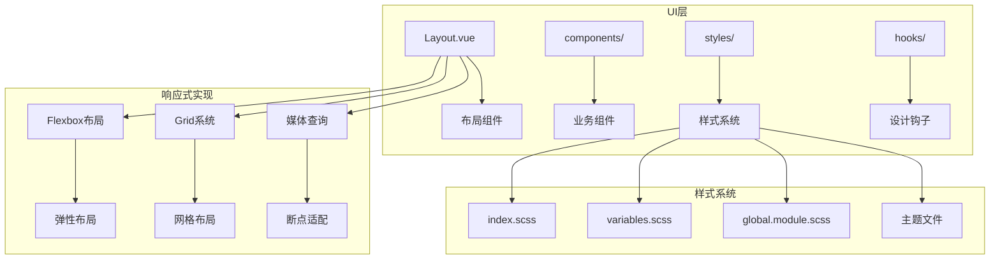

**图表来源**
- [Layout.vue:1-84](file://yudao-ui/yudao-ui-admin-vue3/src/layout/Layout.vue#L1-L84)
- [index.scss:1-38](file://yudao-ui/yudao-ui-admin-vue3/src/styles/index.scss#L1-L38)

**章节来源**
- [Layout.vue:1-84](file://yudao-ui/yudao-ui-admin-vue3/src/layout/Layout.vue#L1-L84)
- [index.scss:1-38](file://yudao-ui/yudao-ui-admin-vue3/src/styles/index.scss#L1-L38)

## 核心组件

### 布局系统架构

项目的核心响应式布局由以下关键组件构成：

#### 主布局容器
主布局组件负责整体页面结构和响应式行为控制：

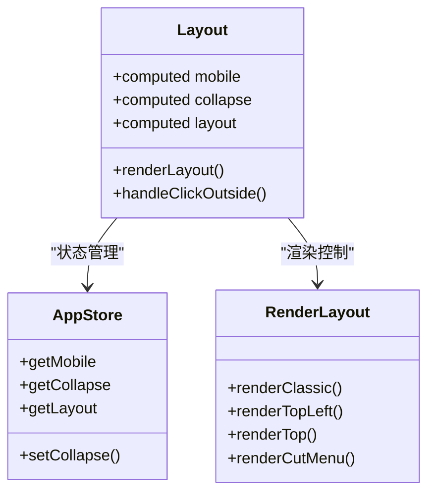

**图表来源**
- [Layout.vue:16-45](file://yudao-ui/yudao-ui-admin-vue3/src/layout/Layout.vue#L16-L45)
- [useRenderLayout.ts](file://yudao-ui/yudao-ui-admin-vue3/src/layout/components/useRenderLayout.ts)

#### 设计系统钩子
统一的设计系统提供命名空间和样式变量管理：

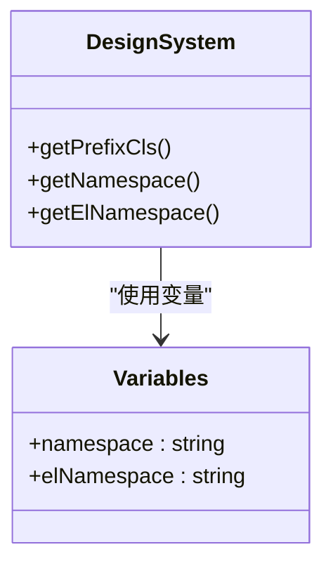

**图表来源**
- [useDesign.ts](file://yudao-ui/yudao-ui-admin-vue3/src/hooks/web/useDesign.ts)
- [variables.scss:1-5](file://yudao-ui/yudao-ui-admin-vue3/src/styles/variables.scss#L1-L5)

**章节来源**
- [Layout.vue:1-84](file://yudao-ui/yudao-ui-admin-vue3/src/layout/Layout.vue#L1-L84)
- [useDesign.ts](file://yudao-ui/yudao-ui-admin-vue3/src/hooks/web/useDesign.ts)
- [variables.scss:1-5](file://yudao-ui/yudao-ui-admin-vue3/src/styles/variables.scss#L1-L5)

## 架构概览

### 响应式设计架构图

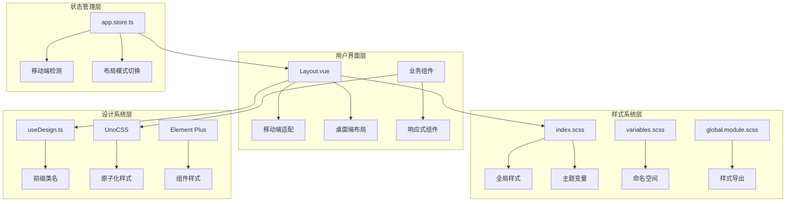

**图表来源**
- [Layout.vue:1-84](file://yudao-ui/yudao-ui-admin-vue3/src/layout/Layout.vue#L1-L84)
- [index.scss:1-38](file://yudao-ui/yudao-ui-admin-vue3/src/styles/index.scss#L1-L38)
- [variables.scss:1-5](file://yudao-ui/yudao-ui-admin-vue3/src/styles/variables.scss#L1-L5)

## 详细组件分析

### 弹性布局系统

#### Flexbox 应用场景

项目广泛使用 Flexbox 实现响应式布局，特别是在复杂组件中：

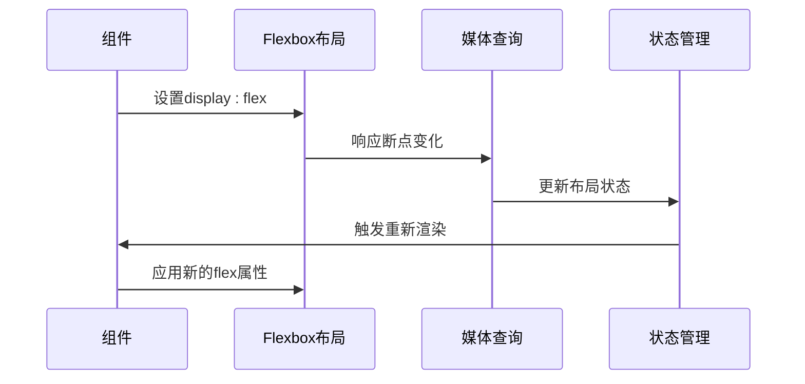

**图表来源**
- [simple-process-designer.scss:2-462](file://yudao-ui/yudao-ui-admin-vue3/src/components/SimpleProcessDesignerV2/theme/simple-process-designer.scss#L2-L462)

#### 布局模式实现

系统支持多种布局模式，每种模式都有特定的响应式策略：

| 布局模式 | 特点 | 响应式策略 |
|---------|------|-----------|
| classic | 经典侧边栏布局 | 固定侧边栏 + 弹性内容区域 |
| topLeft | 顶部+左侧布局 | 顶部导航 + 左侧菜单 |
| top | 顶部导航布局 | 全宽顶部导航 + 内容区域 |
| cutMenu | 分割菜单布局 | 动态菜单分割 |

**章节来源**
- [Layout.vue:28-45](file://yudao-ui/yudao-ui-admin-vue3/src/layout/Layout.vue#L28-L45)
- [useRenderLayout.ts](file://yudao-ui/yudao-ui-admin-vue3/src/layout/components/useRenderLayout.ts)

### 网格系统实现

#### CSS Grid 应用

虽然项目主要使用 Flexbox，但在某些场景下也采用 CSS Grid 实现复杂的二维布局：

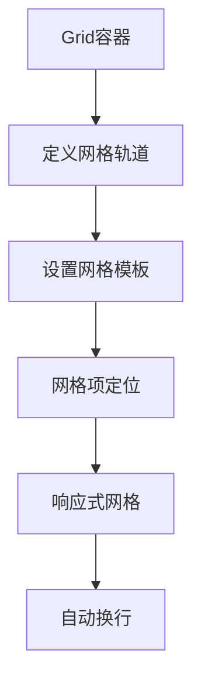

**图表来源**
- [process-designer.scss](file://yudao-ui/yudao-ui-admin-vue3/src/components/bpmnProcessDesigner/package/theme/process-designer.scss)
- [process-panel.scss](file://yudao-ui/yudao-ui-admin-vue3/src/components/bpmnProcessDesigner/package/theme/process-panel.scss)

### 移动端适配方案

#### 视口配置

项目通过多种方式实现移动端适配：

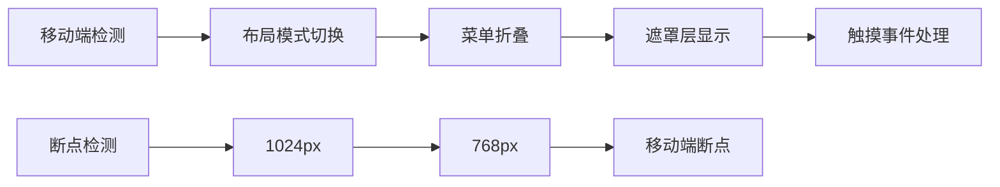

**图表来源**
- [Layout.vue:16-64](file://yudao-ui/yudao-ui-admin-vue3/src/layout/Layout.vue#L16-L64)
- [app.store.ts](file://yudao-ui/yudao-ui-admin-vue3/src/store/modules/app.ts)

#### 触摸事件处理

移动端特有事件处理机制：

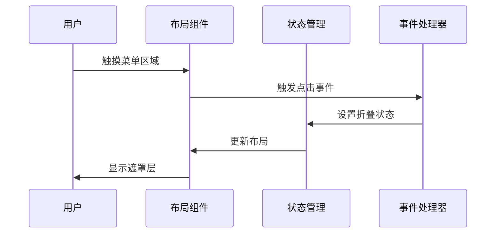

**图表来源**
- [Layout.vue:24-26](file://yudao-ui/yudao-ui-admin-vue3/src/layout/Layout.vue#L24-L26)

**章节来源**
- [Layout.vue:16-64](file://yudao-ui/yudao-ui-admin-vue3/src/layout/Layout.vue#L16-L64)
- [app.store.ts](file://yudao-ui/yudao-ui-admin-vue3/src/store/modules/app.ts)

### 媒体查询策略

#### 断点设置标准

项目采用以下断点标准实现响应式设计：

| 断点类型 | 尺寸范围 | 使用场景 |
|---------|---------|---------|
| 移动端大屏 | 576px以下 | 手机横屏/小屏设备 |
| 平板 | 576px-992px | 平板设备 |
| 桌面端小屏 | 992px-1200px | 笔记本电脑 |
| 桌面端大屏 | 1200px以上 | 台式机显示器 |

#### 条件样式的应用

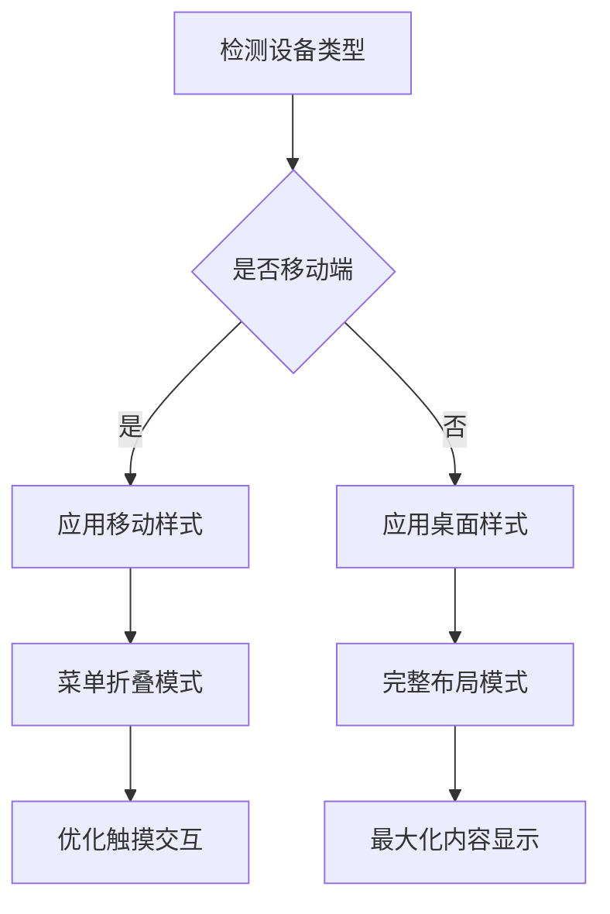

**图表来源**
- [index.scss:10-19](file://yudao-ui/yudao-ui-admin-vue3/src/styles/index.scss#L10-L19)
- [layout.ts](file://yudao-ui/yudao-ui-admin-vue3/src/utils/layout.ts)

**章节来源**
- [index.scss:10-19](file://yudao-ui/yudao-ui-admin-vue3/src/styles/index.scss#L10-L19)
- [layout.ts](file://yudao-ui/yudao-ui-admin-vue3/src/utils/layout.ts)

### 性能优化策略

#### 样式优化

项目采用多种性能优化技术：

1. **原子化样式**: 使用 UnoCSS 减少样式体积
2. **按需加载**: 组件样式按需引入
3. **缓存策略**: 利用浏览器缓存机制

#### 渲染优化

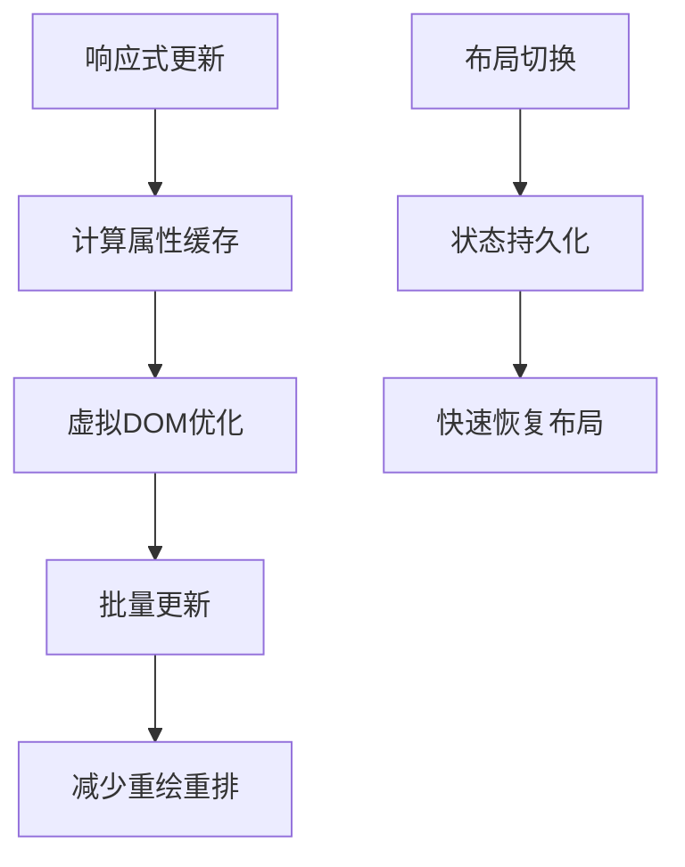

**图表来源**
- [Layout.vue:16-22](file://yudao-ui/yudao-ui-admin-vue3/src/layout/Layout.vue#L16-L22)
- [vite.config.ts](file://yudao-ui/yudao-ui-admin-vue3/vite.config.ts)

## 依赖关系分析

### 核心依赖关系

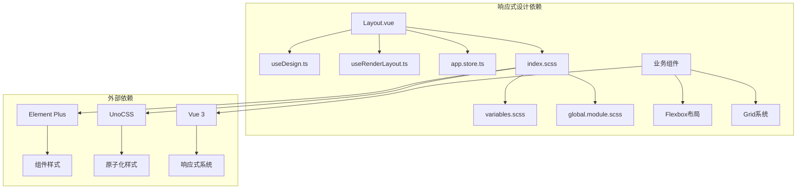

**图表来源**
- [Layout.vue:1-84](file://yudao-ui/yudao-ui-admin-vue3/src/layout/Layout.vue#L1-L84)
- [index.scss:1-38](file://yudao-ui/yudao-ui-admin-vue3/src/styles/index.scss#L1-L38)

**章节来源**
- [Layout.vue:1-84](file://yudao-ui/yudao-ui-admin-vue3/src/layout/Layout.vue#L1-L84)
- [index.scss:1-38](file://yudao-ui/yudao-ui-admin-vue3/src/styles/index.scss#L1-L38)

## 性能考虑

### 样式性能优化

1. **CSS变量使用**: 通过 CSS 变量实现主题切换，避免重复样式定义
2. **Flexbox优化**: 合理使用 flex 属性，避免复杂的嵌套层级
3. **媒体查询优化**: 使用 min-width 和 max-width 组合，减少匹配复杂度

### JavaScript性能优化

1. **计算属性缓存**: 利用 Vue 的计算属性缓存机制
2. **事件防抖**: 对频繁触发的窗口大小变化事件进行防抖处理
3. **懒加载**: 布局组件按需加载，减少初始包体积

## 故障排除指南

### 常见问题及解决方案

#### 布局错乱问题

**问题描述**: 在移动端切换时布局出现错乱

**解决方案**:
1. 检查 `el-popup-parent--hidden` 类的使用
2. 验证菜单折叠状态的正确切换
3. 确认遮罩层的显示逻辑

#### 样式冲突问题

**问题描述**: 自定义样式与 Element Plus 样式发生冲突

**解决方案**:
1. 使用命名空间隔离样式
2. 检查 CSS 优先级设置
3. 避免使用 !important

#### 性能问题

**问题描述**: 页面在低端设备上运行缓慢

**解决方案**:
1. 减少不必要的 reflow 和 repaint
2. 优化 Flexbox 和 Grid 的使用
3. 实施适当的缓存策略

**章节来源**
- [index.scss:10-19](file://yudao-ui/yudao-ui-admin-vue3/src/styles/index.scss#L10-L19)
- [Layout.vue:59-64](file://yudao-ui/yudao-ui-admin-vue3/src/layout/Layout.vue#L59-L64)

## 结论

本项目实现了完整的响应式设计体系，通过灵活的布局系统、现代的 CSS 技术和优化的性能策略，为多设备环境提供了优秀的用户体验。核心优势包括：

1. **模块化架构**: 清晰的组件分离和职责划分
2. **灵活的布局系统**: 支持多种布局模式的动态切换
3. **性能优化**: 采用多种技术手段确保在各种设备上的流畅运行
4. **可维护性**: 良好的代码结构和文档规范

未来可以进一步优化的方向包括：引入更精细的断点控制、增强动画性能、完善无障碍访问支持等。