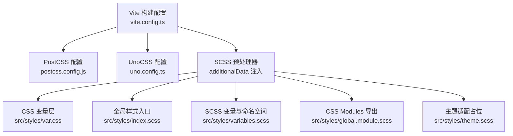
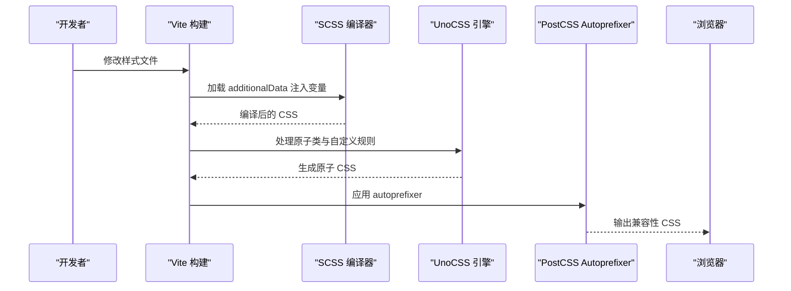
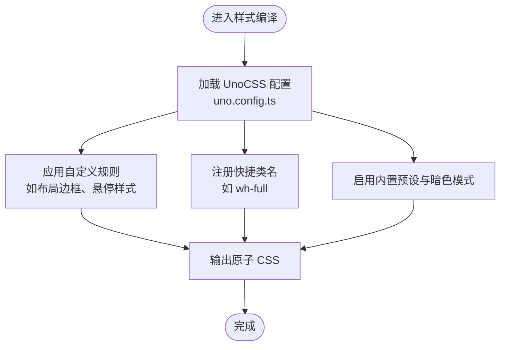
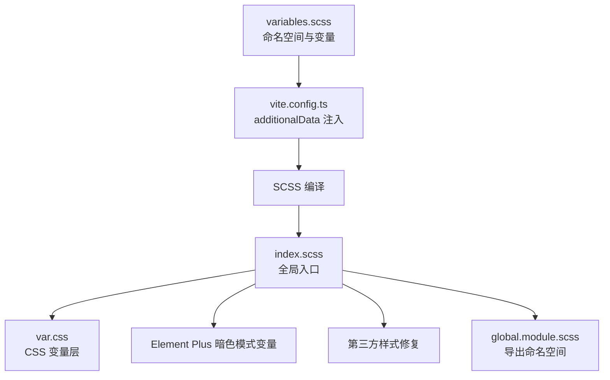
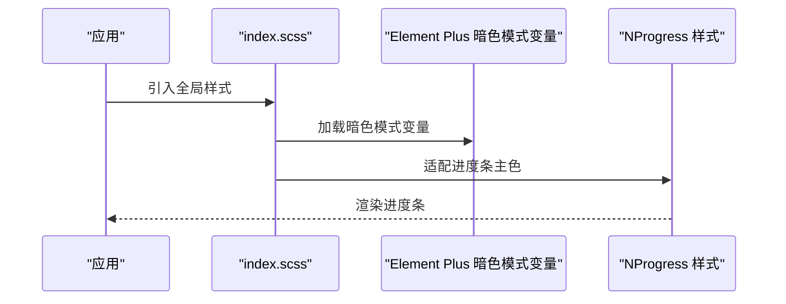
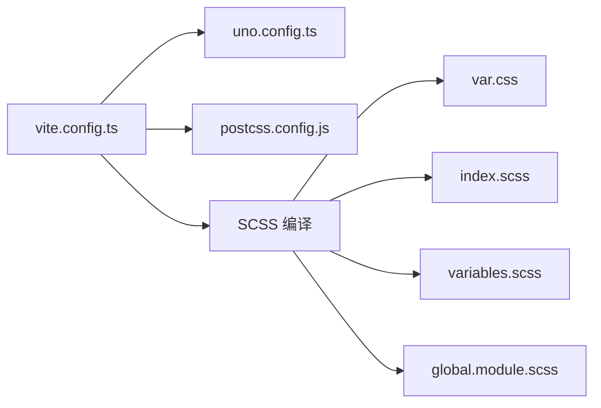

# 样式与主题

<cite>
**本文引用的文件**
- [uno.config.ts](file://yudao-ui/yudao-ui-admin-vue3/uno.config.ts)
- [vite.config.ts](file://yudao-ui/yudao-ui-admin-vue3/vite.config.ts)
- [postcss.config.js](file://yudao-ui/yudao-ui-admin-vue3/postcss.config.js)
- [index.scss](file://yudao-ui/yudao-ui-admin-vue3/src/styles/index.scss)
- [var.css](file://yudao-ui/yudao-ui-admin-vue3/src/styles/var.css)
- [variables.scss](file://yudao-ui/yudao-ui-admin-vue3/src/styles/variables.scss)
- [global.module.scss](file://yudao-ui/yudao-ui-admin-vue3/src/styles/global.module.scss)
- [theme.scss](file://yudao-ui/yudao-ui-admin-vue3/src/styles/theme.scss)
</cite>

## 目录
1. [简介](#简介)
2. [项目结构](#项目结构)
3. [核心组件](#核心组件)
4. [架构总览](#架构总览)
5. [详细组件分析](#详细组件分析)
6. [依赖关系分析](#依赖关系分析)
7. [性能考虑](#性能考虑)
8. [故障排查指南](#故障排查指南)
9. [结论](#结论)
10. [附录](#附录)

## 简介
本文件面向“芋道 ruoyi-vue-pro”前端工程，系统化梳理样式与主题体系，涵盖以下方面：
- UnoCSS 的配置与使用：原子化 CSS 理念、快捷类名、自定义规则与暗色模式支持
- SCSS 使用规范：变量定义、命名空间、模块化组织与构建期注入
- Element Plus 主题定制：CSS 变量覆盖、暗色模式、进度条适配
- 组件样式隔离：CSS Modules、作用域样式与 BEM 命名建议
- 全局样式管理：基础重置、字体图标间距、动画与第三方库样式适配
- 响应式设计：断点与弹性布局实践
- 性能优化：压缩、按需加载与渲染优化
- 调试与兼容：浏览器兼容与问题定位

## 项目结构
样式与主题相关的关键位置如下：
- UnoCSS 配置：yudao-ui/yudao-ui-admin-vue3/uno.config.ts
- 构建与预处理器：yudao-ui/yudao-ui-admin-vue3/vite.config.ts、postcss.config.js
- 全局样式入口与变量：yudao-ui/yudao-ui-admin-vue3/src/styles/index.scss、var.css、variables.scss、global.module.scss、theme.scss

图表来源
- [vite.config.ts:44-66](file://yudao-ui/yudao-ui-admin-vue3/vite.config.ts#L44-L66)
- [postcss.config.js:1-6](file://yudao-ui/yudao-ui-admin-vue3/postcss.config.js#L1-L6)
- [uno.config.ts:4-108](file://yudao-ui/yudao-ui-admin-vue3/uno.config.ts#L4-L108)
- [index.scss:1-38](file://yudao-ui/yudao-ui-admin-vue3/src/styles/index.scss#L1-L38)
- [var.css:1-75](file://yudao-ui/yudao-ui-admin-vue3/src/styles/var.css#L1-L75)
- [variables.scss:1-5](file://yudao-ui/yudao-ui-admin-vue3/src/styles/variables.scss#L1-L5)
- [global.module.scss:1-7](file://yudao-ui/yudao-ui-admin-vue3/src/styles/global.module.scss#L1-L7)
- [theme.scss:1-7](file://yudao-ui/yudao-ui-admin-vue3/src/styles/theme.scss#L1-L7)

章节来源
- [vite.config.ts:44-66](file://yudao-ui/yudao-ui-admin-vue3/vite.config.ts#L44-L66)
- [postcss.config.js:1-6](file://yudao-ui/yudao-ui-admin-vue3/postcss.config.js#L1-L6)
- [uno.config.ts:4-108](file://yudao-ui/yudao-ui-admin-vue3/uno.config.ts#L4-L108)
- [index.scss:1-38](file://yudao-ui/yudao-ui-admin-vue3/src/styles/index.scss#L1-L38)
- [var.css:1-75](file://yudao-ui/yudao-ui-admin-vue3/src/styles/var.css#L1-L75)
- [variables.scss:1-5](file://yudao-ui/yudao-ui-admin-vue3/src/styles/variables.scss#L1-L5)
- [global.module.scss:1-7](file://yudao-ui/yudao-ui-admin-vue3/src/styles/global.module.scss#L1-L7)
- [theme.scss:1-7](file://yudao-ui/yudao-ui-admin-vue3/src/styles/theme.scss#L1-L7)

## 核心组件
- UnoCSS 原子化引擎：提供类名即样式的开发体验，内置规则、自定义规则与快捷类名；支持暗色模式选择器
- SCSS 变量与命名空间：统一变量与命名空间，通过构建期注入避免重复导入
- CSS 变量层：以 CSS 自定义属性承载主题与布局参数，便于运行时与暗色模式切换
- 全局样式入口：集中引入第三方暗色模式变量、修复第三方组件样式问题、适配进度条等
- PostCSS 自动前缀：保证浏览器兼容性

章节来源
- [uno.config.ts:4-108](file://yudao-ui/yudao-ui-admin-vue3/uno.config.ts#L4-L108)
- [vite.config.ts:44-66](file://yudao-ui/yudao-ui-admin-vue3/vite.config.ts#L44-L66)
- [index.scss:1-38](file://yudao-ui/yudao-ui-admin-vue3/src/styles/index.scss#L1-L38)
- [var.css:1-75](file://yudao-ui/yudao-ui-admin-vue3/src/styles/var.css#L1-L75)
- [postcss.config.js:1-6](file://yudao-ui/yudao-ui-admin-vue3/postcss.config.js#L1-L6)

## 架构总览
样式系统在构建阶段由 Vite 驱动，SCSS 通过 additionalData 注入变量，UnoCSS 提供原子类，PostCSS 进行自动前缀。全局样式入口统一引入 Element Plus 暗色模式变量并做兼容性修复。

图表来源
- [vite.config.ts:44-66](file://yudao-ui/yudao-ui-admin-vue3/vite.config.ts#L44-L66)
- [uno.config.ts:4-108](file://yudao-ui/yudao-ui-admin-vue3/uno.config.ts#L4-L108)
- [postcss.config.js:1-6](file://yudao-ui/yudao-ui-admin-vue3/postcss.config.js#L1-L6)

## 详细组件分析

### UnoCSS 配置与使用
- 类名即样式：通过原子化类快速组合样式，减少手写 CSS
- 自定义规则：支持基于选择器的动态生成，如布局边框伪元素、悬停背景等
- 快捷类名：提供常用组合的别名，提升开发效率
- 暗色模式：内置暗色模式选择器，配合 CSS 变量实现主题切换
- 变体分组：可选启用变体分组转换器，简化复杂类名组合

图表来源
- [uno.config.ts:4-108](file://yudao-ui/yudao-ui-admin-vue3/uno.config.ts#L4-L108)

章节来源
- [uno.config.ts:4-108](file://yudao-ui/yudao-ui-admin-vue3/uno.config.ts#L4-L108)

### SCSS 使用规范与模块化
- 变量与命名空间：通过 variables.scss 定义命名空间与 Element Plus 命名空间，避免样式冲突
- 构建期注入：在 vite.config.ts 中通过 additionalData 注入变量，避免重复 @use
- CSS Modules：global.module.scss 导出命名空间常量，供 TSX 使用
- 全局样式入口：index.scss 统一引入 CSS 变量层、第三方暗色模式变量与兼容性修复

图表来源
- [variables.scss:1-5](file://yudao-ui/yudao-ui-admin-vue3/src/styles/variables.scss#L1-L5)
- [vite.config.ts:49-62](file://yudao-ui/yudao-ui-admin-vue3/vite.config.ts#L49-L62)
- [global.module.scss:1-7](file://yudao-ui/yudao-ui-admin-vue3/src/styles/global.module.scss#L1-L7)
- [index.scss:1-38](file://yudao-ui/yudao-ui-admin-vue3/src/styles/index.scss#L1-L38)
- [var.css:1-75](file://yudao-ui/yudao-ui-admin-vue3/src/styles/var.css#L1-L75)

章节来源
- [variables.scss:1-5](file://yudao-ui/yudao-ui-admin-vue3/src/styles/variables.scss#L1-L5)
- [vite.config.ts:49-62](file://yudao-ui/yudao-ui-admin-vue3/vite.config.ts#L49-L62)
- [global.module.scss:1-7](file://yudao-ui/yudao-ui-admin-vue3/src/styles/global.module.scss#L1-L7)
- [index.scss:1-38](file://yudao-ui/yudao-ui-admin-vue3/src/styles/index.scss#L1-L38)
- [var.css:1-75](file://yudao-ui/yudao-ui-admin-vue3/src/styles/var.css#L1-L75)

### Element Plus 主题定制
- CSS 变量覆盖：通过引入 Element Plus 暗色模式变量实现暗色模式
- 进度条适配：根据 Element Plus 主题色动态适配 NProgress 的颜色
- 第三方组件修复：针对抽屉与表格滚动条等场景进行样式修复

图表来源
- [index.scss:1-38](file://yudao-ui/yudao-ui-admin-vue3/src/styles/index.scss#L1-L38)

章节来源
- [index.scss:1-38](file://yudao-ui/yudao-ui-admin-vue3/src/styles/index.scss#L1-L38)

### 组件样式隔离
- CSS Modules：通过 global.module.scss 导出命名空间，TSX 中以模块方式引用，避免全局污染
- 作用域样式：推荐在组件内使用作用域样式，结合命名空间与 BEM 规范
- BEM 建议：块-元素-修饰符风格，配合命名空间与 CSS 变量，确保可维护性与一致性

章节来源
- [global.module.scss:1-7](file://yudao-ui/yudao-ui-admin-vue3/src/styles/global.module.scss#L1-L7)
- [variables.scss:1-5](file://yudao-ui/yudao-ui-admin-vue3/src/styles/variables.scss#L1-L5)

### 全局样式管理
- 基础重置：var.css 中对 html/body 进行盒模型与字体平滑处理，并提供全局 margin/padding 重置
- 字体图标间距：针对 Element Plus 图标与文本的间距问题进行修正
- 动画与第三方库：引入 animate.css 并在需要时按需使用；对第三方滚动条进行对齐优化

章节来源
- [var.css:62-75](file://yudao-ui/yudao-ui-admin-vue3/src/styles/var.css#L62-L75)
- [index.scss:6-19](file://yudao-ui/yudao-ui-admin-vue3/src/styles/index.scss#L6-L19)

### 响应式设计
- 断点与弹性布局：建议在业务组件中使用 Flex/Grid 实现弹性布局，结合 CSS 变量控制间距与尺寸
- 移动端适配：优先采用相对单位与媒体查询，配合 UnoCSS 的响应式前缀类名进行快速适配

[本节为通用实践指导，不直接分析具体文件]

### 主题切换与动态主题生成
- CSS 变量驱动：var.css 中的主题参数通过 CSS 自定义属性实现，可在 :root 与 .dark 中切换
- UnoCSS 暗色模式：内置暗色模式选择器，配合类名切换实现主题切换
- Element Plus 暗色模式：通过引入暗色模式变量实现组件级主题切换

章节来源
- [var.css:1-75](file://yudao-ui/yudao-ui-admin-vue3/src/styles/var.css#L1-L75)
- [uno.config.ts:102](file://yudao-ui/yudao-ui-admin-vue3/uno.config.ts#L102)
- [index.scss:4](file://yudao-ui/yudao-ui-admin-vue3/src/styles/index.scss#L4)

## 依赖关系分析
- Vite 作为构建核心，负责加载 UnoCSS 与 SCSS 编译
- PostCSS 在构建链末端进行浏览器兼容处理
- SCSS 通过 additionalData 注入变量，减少重复导入
- 全局样式入口集中管理第三方变量与修复

图表来源
- [vite.config.ts:44-66](file://yudao-ui/yudao-ui-admin-vue3/vite.config.ts#L44-L66)
- [postcss.config.js:1-6](file://yudao-ui/yudao-ui-admin-vue3/postcss.config.js#L1-L6)
- [uno.config.ts:4-108](file://yudao-ui/yudao-ui-admin-vue3/uno.config.ts#L4-L108)
- [index.scss:1-38](file://yudao-ui/yudao-ui-admin-vue3/src/styles/index.scss#L1-L38)
- [var.css:1-75](file://yudao-ui/yudao-ui-admin-vue3/src/styles/var.css#L1-L75)
- [variables.scss:1-5](file://yudao-ui/yudao-ui-admin-vue3/src/styles/variables.scss#L1-L5)
- [global.module.scss:1-7](file://yudao-ui/yudao-ui-admin-vue3/src/styles/global.module.scss#L1-L7)

章节来源
- [vite.config.ts:44-66](file://yudao-ui/yudao-ui-admin-vue3/vite.config.ts#L44-L66)
- [postcss.config.js:1-6](file://yudao-ui/yudao-ui-admin-vue3/postcss.config.js#L1-L6)
- [uno.config.ts:4-108](file://yudao-ui/yudao-ui-admin-vue3/uno.config.ts#L4-L108)
- [index.scss:1-38](file://yudao-ui/yudao-ui-admin-vue3/src/styles/index.scss#L1-L38)
- [var.css:1-75](file://yudao-ui/yudao-ui-admin-vue3/src/styles/var.css#L1-L75)
- [variables.scss:1-5](file://yudao-ui/yudao-ui-admin-vue3/src/styles/variables.scss#L1-L5)
- [global.module.scss:1-7](file://yudao-ui/yudao-ui-admin-vue3/src/styles/global.module.scss#L1-L7)

## 性能考虑
- 压缩与最小化：Vite 构建阶段启用 Terser 压缩与 console/debugger 移除
- 代码分割：Rollup 分包策略将大体积依赖单独打包，降低首屏体积
- LightningCSS：开启错误恢复能力，避免无效语法导致构建失败
- 原子化 CSS：通过 UnoCSS 仅产出实际使用的类，减少冗余样式

章节来源
- [vite.config.ts:76-97](file://yudao-ui/yudao-ui-admin-vue3/vite.config.ts#L76-L97)
- [vite.config.ts:44-48](file://yudao-ui/yudao-ui-admin-vue3/vite.config.ts#L44-L48)

## 故障排查指南
- UnoCSS 类名未生效
  - 检查是否正确书写原子类与变体组合
  - 确认暗色模式选择器是否与页面类名一致
- SCSS 变量未生效
  - 确认 additionalData 是否正确注入变量路径
  - 避免重复 @use 同一模块导致的变量重复定义
- 第三方组件样式异常
  - 查看 index.scss 中的修复项，确认是否覆盖了对应选择器
  - 对于 Element Plus 图标与文本间距问题，检查 reset-margin 规则
- 浏览器兼容问题
  - 确认 PostCSS Autoprefixer 已启用
  - 针对旧版浏览器，必要时补充 polyfill 或降级方案

章节来源
- [uno.config.ts:102](file://yudao-ui/yudao-ui-admin-vue3/uno.config.ts#L102)
- [vite.config.ts:49-62](file://yudao-ui/yudao-ui-admin-vue3/vite.config.ts#L49-L62)
- [index.scss:6-19](file://yudao-ui/yudao-ui-admin-vue3/src/styles/index.scss#L6-L19)
- [postcss.config.js:1-6](file://yudao-ui/yudao-ui-admin-vue3/postcss.config.js#L1-L6)

## 结论
本项目采用“UnoCSS + SCSS + CSS 变量”的样式架构，结合 Vite 与 PostCSS 实现高效构建与良好兼容性。通过统一的变量与命名空间、全局入口与第三方修复，以及暗色模式与进度条适配，形成可扩展、可维护的主题体系。建议在后续迭代中持续沉淀组件级样式规范与隔离策略，进一步提升可复用性与性能表现。

## 附录
- 快速清单
  - 使用 UnoCSS 原子类替代重复样式
  - 通过 CSS 变量统一主题参数，配合 :root/.dark 切换
  - 在 SCSS 中使用命名空间与 additionalData 注入变量
  - 在 index.scss 中集中处理第三方组件样式修复
  - 启用 PostCSS Autoprefixer 保障兼容性