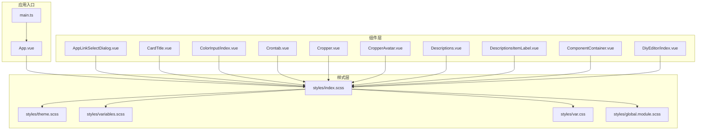
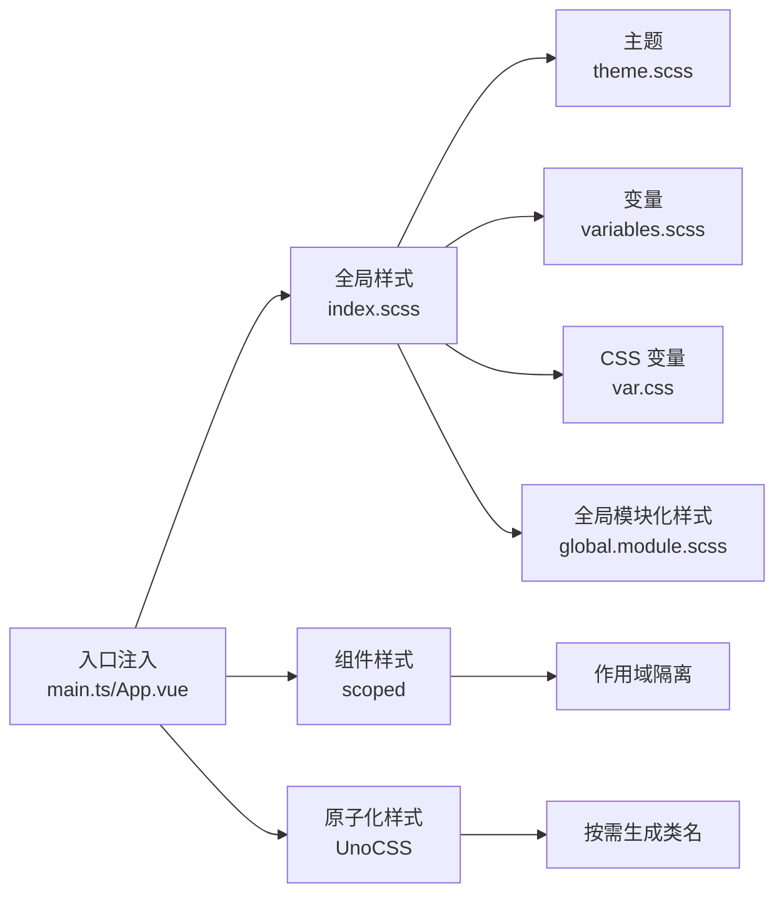
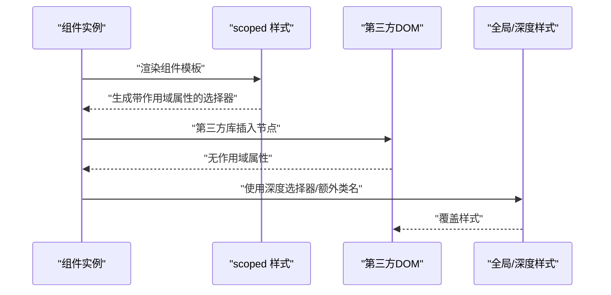
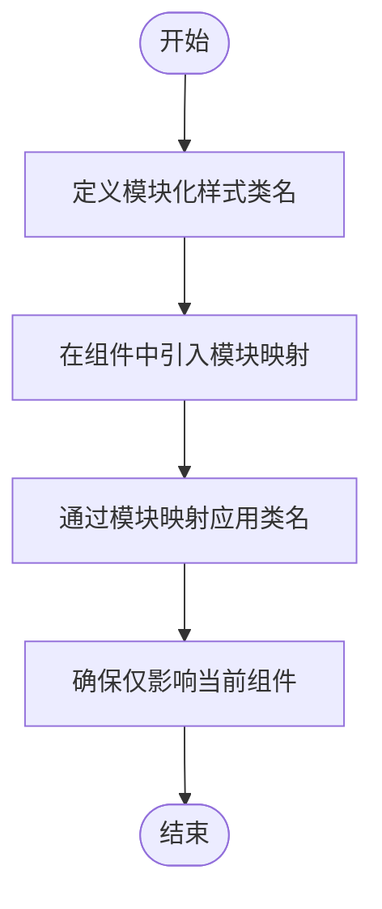
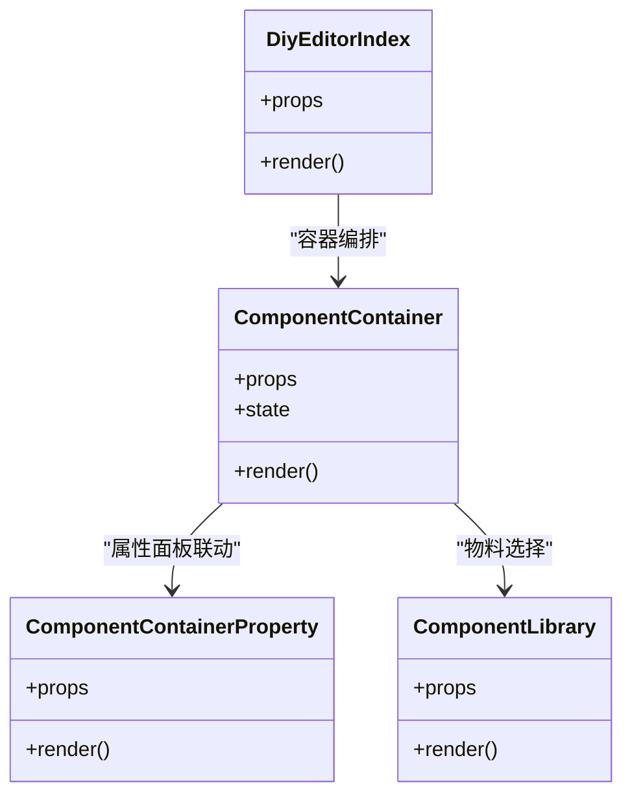
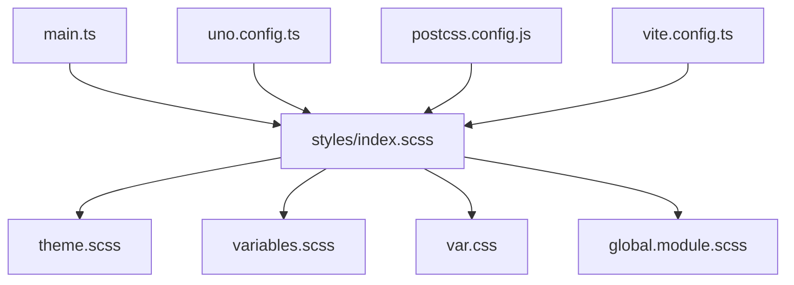

# 组件样式隔离

<cite>
**本文引用的文件**
- [App.vue](file://yudao-ui/yudao-ui-admin-vue3/src/App.vue)
- [index.scss](file://yudao-ui/yudao-ui-admin-vue3/src/styles/index.scss)
- [theme.scss](file://yudao-ui/yudao-ui-admin-vue3/src/styles/theme.scss)
- [variables.scss](file://yudao-ui/yudao-ui-admin-vue3/src/styles/variables.scss)
- [var.css](file://yudao-ui/yudao-ui-admin-vue3/src/styles/var.css)
- [global.module.scss](file://yudao-ui/yudao-ui-admin-vue3/src/styles/global.module.scss)
- [uno.config.ts](file://yudao-ui/yudao-ui-admin-vue3/uno.config.ts)
- [vite.config.ts](file://yudao-ui/yudao-ui-admin-vue3/vite.config.ts)
- [postcss.config.js](file://yudao-ui/yudao-ui-admin-vue3/postcss.config.js)
- [AppLinkSelectDialog.vue](file://yudao-ui/yudao-ui-admin-vue3/src/components/AppLinkInput/AppLinkSelectDialog.vue)
- [CardTitle.vue](file://yudao-ui/yudao-ui-admin-vue3/src/components/Card/src/CardTitle.vue)
- [ColorInput/index.vue](file://yudao-ui/yudao-ui-admin-vue3/src/components/ColorInput/index.vue)
- [Crontab.vue](file://yudao-ui/yudao-ui-admin-vue3/src/components/Crontab/src/Crontab.vue)
- [Cropper.vue](file://yudao-ui/yudao-ui-admin-vue3/src/components/Cropper/src/Cropper.vue)
- [CropperAvatar.vue](file://yudao-ui/yudao-ui-admin-vue3/src/components/Cropper/src/CropperAvatar.vue)
- [Descriptions.vue](file://yudao-ui/yudao-ui-admin-vue3/src/components/Descriptions/src/Descriptions.vue)
- [DescriptionsItemLabel.vue](file://yudao-ui/yudao-ui-admin-vue3/src/components/Descriptions/src/DescriptionsItemLabel.vue)
- [ComponentContainer.vue](file://yudao-ui/yudao-ui-admin-vue3/src/components/DiyEditor/components/ComponentContainer.vue)
- [ComponentContainerProperty.vue](file://yudao-ui/yudao-ui-admin-vue3/src/components/DiyEditor/components/ComponentContainerProperty.vue)
- [ComponentLibrary.vue](file://yudao-ui/yudao-ui-admin-vue3/src/components/DiyEditor/components/ComponentLibrary.vue)
- [DiyEditor/index.vue](file://yudao-ui/yudao-ui-admin-vue3/src/components/DiyEditor/index.vue)
- [Layout.vue](file://yudao-ui/yudao-ui-admin-vue3/src/layout/Layout.vue)
- [main.ts](file://yudao-ui/yudao-ui-admin-vue3/src/main.ts)
- [index.ts](file://yudao-ui/yudao-ui-admin-vue3/src/components/index.ts)
</cite>

## 目录
1. [引言](#引言)
2. [项目结构](#项目结构)
3. [核心组件](#核心组件)
4. [架构总览](#架构总览)
5. [详细组件分析](#详细组件分析)
6. [依赖分析](#依赖分析)
7. [性能考虑](#性能考虑)
8. [故障排查指南](#故障排查指南)
9. [结论](#结论)
10. [附录](#附录)

## 引言
本文件围绕 Vue 组件样式隔离进行系统化梳理与实践指导，结合项目现有实现，重点覆盖以下主题：
- 样式隔离方法：CSS Modules、作用域样式（scoped）、BEM 命名规范
- 不同隔离方案的适用场景与优缺点
- 样式组织原则：文件命名、结构拆分、复用机制
- 实战案例：复杂组件中的样式隔离与管理
- 冲突预防与解决：!important 使用限制与优先级管理
- 性能优化与调试技巧

## 项目结构
该项目采用 Vue 3 + Vite + UnoCSS 技术栈，样式体系以 SCSS 为主，配合 UnoCSS 提供原子化样式能力；全局样式通过入口统一注入，组件内样式多采用 scoped 限定作用域。

图表来源
- [App.vue](file://yudao-ui/yudao-ui-admin-vue3/src/App.vue)
- [main.ts](file://yudao-ui/yudao-ui-admin-vue3/src/main.ts)
- [index.scss](file://yudao-ui/yudao-ui-admin-vue3/src/styles/index.scss)
- [theme.scss](file://yudao-ui/yudao-ui-admin-vue3/src/styles/theme.scss)
- [variables.scss](file://yudao-ui/yudao-ui-admin-vue3/src/styles/variables.scss)
- [var.css](file://yudao-ui/yudao-ui-admin-vue3/src/styles/var.css)
- [global.module.scss](file://yudao-ui/yudao-ui-admin-vue3/src/styles/global.module.scss)
- [AppLinkSelectDialog.vue](file://yudao-ui/yudao-ui-admin-vue3/src/components/AppLinkInput/AppLinkSelectDialog.vue)
- [CardTitle.vue](file://yudao-ui/yudao-ui-admin-vue3/src/components/Card/src/CardTitle.vue)
- [ColorInput/index.vue](file://yudao-ui/yudao-ui-admin-vue3/src/components/ColorInput/index.vue)
- [Crontab.vue](file://yudao-ui/yudao-ui-admin-vue3/src/components/Crontab/src/Crontab.vue)
- [Cropper.vue](file://yudao-ui/yudao-ui-admin-vue3/src/components/Cropper/src/Cropper.vue)
- [CropperAvatar.vue](file://yudao-ui/yudao-ui-admin-vue3/src/components/Cropper/src/CropperAvatar.vue)
- [Descriptions.vue](file://yudao-ui/yudao-ui-admin-vue3/src/components/Descriptions/src/Descriptions.vue)
- [DescriptionsItemLabel.vue](file://yudao-ui/yudao-ui-admin-vue3/src/components/Descriptions/src/DescriptionsItemLabel.vue)
- [ComponentContainer.vue](file://yudao-ui/yudao-ui-admin-vue3/src/components/DiyEditor/components/ComponentContainer.vue)
- [DiyEditor/index.vue](file://yudao-ui/yudao-ui-admin-vue3/src/components/DiyEditor/index.vue)

章节来源
- [App.vue](file://yudao-ui/yudao-ui-admin-vue3/src/App.vue)
- [main.ts](file://yudao-ui/yudao-ui-admin-vue3/src/main.ts)
- [index.scss](file://yudao-ui/yudao-ui-admin-vue3/src/styles/index.scss)

## 核心组件
- 应用入口与样式注入
  - 应用根组件负责挂载与全局样式引入，确保样式在应用启动阶段完成初始化。
  - 入口脚本负责加载全局样式与插件，保证组件渲染前样式可用。
- 样式主入口
  - 主样式文件集中导入主题、变量与通用模块，形成统一的样式基线。
- 组件样式
  - 大多数组件采用 scoped 限定作用域，避免样式泄漏到其他组件。
  - 少数组件使用原生 CSS 或外部库样式，需注意与 scoped 的交互与穿透策略。

章节来源
- [App.vue](file://yudao-ui/yudao-ui-admin-vue3/src/App.vue)
- [main.ts](file://yudao-ui/yudao-ui-admin-vue3/src/main.ts)
- [index.scss](file://yudao-ui/yudao-ui-admin-vue3/src/styles/index.scss)

## 架构总览
整体架构强调“全局样式统一管理 + 组件作用域隔离”的组合策略。全局样式提供基础变量与主题，组件内部通过 scoped 限定样式边界，必要时使用深度选择器或 CSS Modules 进行更细粒度控制。

图表来源
- [index.scss](file://yudao-ui/yudao-ui-admin-vue3/src/styles/index.scss)
- [theme.scss](file://yudao-ui/yudao-ui-admin-vue3/src/styles/theme.scss)
- [variables.scss](file://yudao-ui/yudao-ui-admin-vue3/src/styles/variables.scss)
- [var.css](file://yudao-ui/yudao-ui-admin-vue3/src/styles/var.css)
- [global.module.scss](file://yudao-ui/yudao-ui-admin-vue3/src/styles/global.module.scss)
- [main.ts](file://yudao-ui/yudao-ui-admin-vue3/src/main.ts)
- [App.vue](file://yudao-ui/yudao-ui-admin-vue3/src/App.vue)

## 详细组件分析

### 作用域样式（scoped）实践
- 典型用法
  - 多数组件在模板中使用 scoped 属性限定样式作用域，避免跨组件污染。
  - 对于第三方库或动态插入的 DOM（如裁剪器），可能需要穿透策略处理。
- 穿透与兼容性
  - 当第三方库生成的节点不受 scoped 影响时，可通过深度选择器或额外样式类进行覆盖。
  - 注意与 UnoCSS 类名的组合使用，避免优先级冲突。

图表来源
- [Cropper.vue](file://yudao-ui/yudao-ui-admin-vue3/src/components/Cropper/src/Cropper.vue)
- [CropperAvatar.vue](file://yudao-ui/yudao-ui-admin-vue3/src/components/Cropper/src/CropperAvatar.vue)

章节来源
- [AppLinkSelectDialog.vue](file://yudao-ui/yudao-ui-admin-vue3/src/components/AppLinkInput/AppLinkSelectDialog.vue)
- [CardTitle.vue](file://yudao-ui/yudao-ui-admin-vue3/src/components/Card/src/CardTitle.vue)
- [ColorInput/index.vue](file://yudao-ui/yudao-ui-admin-vue3/src/components/ColorInput/index.vue)
- [Crontab.vue](file://yudao-ui/yudao-ui-admin-vue3/src/components/Crontab/src/Crontab.vue)
- [Cropper.vue](file://yudao-ui/yudao-ui-admin-vue3/src/components/Cropper/src/Cropper.vue)
- [CropperAvatar.vue](file://yudao-ui/yudao-ui-admin-vue3/src/components/Cropper/src/CropperAvatar.vue)
- [Descriptions.vue](file://yudao-ui/yudao-ui-admin-vue3/src/components/Descriptions/src/Descriptions.vue)
- [DescriptionsItemLabel.vue](file://yudao-ui/yudao-ui-admin-vue3/src/components/Descriptions/src/DescriptionsItemLabel.vue)

### CSS Modules 实践
- 适用场景
  - 组件内部复杂状态样式或需要强隔离的局部样式块。
  - 需要与构建工具链（如 Vite）良好集成的场景。
- 在本项目中的落地
  - 项目提供全局模块化样式文件，可作为 CSS Modules 的参考实现。
  - 建议在需要强隔离的子组件中引入模块化样式，避免与全局样式耦合。

图表来源
- [global.module.scss](file://yudao-ui/yudao-ui-admin-vue3/src/styles/global.module.scss)

章节来源
- [global.module.scss](file://yudao-ui/yudao-ui-admin-vue3/src/styles/global.module.scss)

### BEM 命名规范
- 原则
  - Block（块）：独立功能单元，如卡片、描述列表等。
  - Element（元素）：块内的组成部分，如标题、标签等。
  - Modifier（修饰符）：状态或变体，如禁用、选中、尺寸等。
- 在本项目中的体现
  - 组件内部类名遵循 BEM 结构，提升可读性与可维护性。
  - 与 scoped 结合使用，进一步降低冲突概率。

章节来源
- [ComponentContainer.vue](file://yudao-ui/yudao-ui-admin-vue3/src/components/DiyEditor/components/ComponentContainer.vue)
- [ComponentContainerProperty.vue](file://yudao-ui/yudao-ui-admin-vue3/src/components/DiyEditor/components/ComponentContainerProperty.vue)
- [ComponentLibrary.vue](file://yudao-ui/yudao-ui-admin-vue3/src/components/DiyEditor/components/ComponentLibrary.vue)

### 复杂组件实战：DIY 编辑器
- 组件职责
  - 容器组件负责布局与状态管理，属性面板负责配置项渲染。
  - 组件库提供可拖拽的物料，移动端组件适配不同设备。
- 样式策略
  - 使用 scoped 限定各子组件样式边界。
  - 通过 BEM 规范组织类名，便于维护与扩展。
  - 必要时使用深度选择器或模块化样式覆盖第三方库样式。

图表来源
- [ComponentContainer.vue](file://yudao-ui/yudao-ui-admin-vue3/src/components/DiyEditor/components/ComponentContainer.vue)
- [ComponentContainerProperty.vue](file://yudao-ui/yudao-ui-admin-vue3/src/components/DiyEditor/components/ComponentContainerProperty.vue)
- [ComponentLibrary.vue](file://yudao-ui/yudao-ui-admin-vue3/src/components/DiyEditor/components/ComponentLibrary.vue)
- [DiyEditor/index.vue](file://yudao-ui/yudao-ui-admin-vue3/src/components/DiyEditor/index.vue)

章节来源
- [ComponentContainer.vue](file://yudao-ui/yudao-ui-admin-vue3/src/components/DiyEditor/components/ComponentContainer.vue)
- [ComponentContainerProperty.vue](file://yudao-ui/yudao-ui-admin-vue3/src/components/DiyEditor/components/ComponentContainerProperty.vue)
- [ComponentLibrary.vue](file://yudao-ui/yudao-ui-admin-vue3/src/components/DiyEditor/components/ComponentLibrary.vue)
- [DiyEditor/index.vue](file://yudao-ui/yudao-ui-admin-vue3/src/components/DiyEditor/index.vue)

## 依赖分析
- 样式依赖关系
  - 全局样式文件被应用入口统一引入，组件样式通过 scoped 与全局样式解耦。
  - UnoCSS 作为原子化样式补充，减少重复定义。
- 工具链支持
  - Vite 负责构建与热更新，PostCSS 用于后处理器链。
  - UnoCSS 配置文件提供按需生成与自定义规则。

图表来源
- [main.ts](file://yudao-ui/yudao-ui-admin-vue3/src/main.ts)
- [index.scss](file://yudao-ui/yudao-ui-admin-vue3/src/styles/index.scss)
- [theme.scss](file://yudao-ui/yudao-ui-admin-vue3/src/styles/theme.scss)
- [variables.scss](file://yudao-ui/yudao-ui-admin-vue3/src/styles/variables.scss)
- [var.css](file://yudao-ui/yudao-ui-admin-vue3/src/styles/var.css)
- [global.module.scss](file://yudao-ui/yudao-ui-admin-vue3/src/styles/global.module.scss)
- [uno.config.ts](file://yudao-ui/yudao-ui-admin-vue3/uno.config.ts)
- [vite.config.ts](file://yudao-ui/yudao-ui-admin-vue3/vite.config.ts)
- [postcss.config.js](file://yudao-ui/yudao-ui-admin-vue3/postcss.config.js)

章节来源
- [uno.config.ts](file://yudao-ui/yudao-ui-admin-vue3/uno.config.ts)
- [vite.config.ts](file://yudao-ui/yudao-ui-admin-vue3/vite.config.ts)
- [postcss.config.js](file://yudao-ui/yudao-ui-admin-vue3/postcss.config.js)

## 性能考虑
- 作用域样式性能
  - scoped 会为选择器添加唯一属性，增加选择器权重与匹配成本，建议在复杂组件中谨慎使用深层嵌套。
- 原子化样式
  - UnoCSS 按需生成类名，减少无效样式体积，提升运行时性能。
- 全局样式拆分
  - 将主题、变量与通用模块拆分，避免不必要的重绘与回流。
- 构建优化
  - 利用 Vite 的模块解析与 Tree Shaking，剔除未使用的样式资源。

## 故障排查指南
- 样式不生效
  - 检查组件是否正确使用 scoped，确认选择器优先级。
  - 若涉及第三方库，使用深度选择器或额外类名进行覆盖。
- 样式冲突
  - 避免滥用 !important，优先通过选择器权重与作用域控制解决。
  - 使用 BEM 规范明确层级关系，减少类名歧义。
- 与 UnoCSS 冲突
  - 确认类名拼接顺序与原子类优先级，必要时调整作用域选择器或模块化类名。
- 调试技巧
  - 使用浏览器开发者工具检查最终渲染的类名与权重来源。
  - 在复杂组件中拆分样式文件，逐步定位问题范围。

章节来源
- [Cropper.vue](file://yudao-ui/yudao-ui-admin-vue3/src/components/Cropper/src/Cropper.vue)
- [CropperAvatar.vue](file://yudao-ui/yudao-ui-admin-vue3/src/components/Cropper/src/CropperAvatar.vue)

## 结论
本项目通过“全局样式统一 + 组件作用域隔离 + 原子化样式补充”的策略，实现了良好的样式管理与隔离效果。建议在后续开发中：
- 优先采用 scoped 与 BEM 规范，减少样式泄漏与冲突。
- 在复杂组件中引入 CSS Modules，强化局部样式隔离。
- 合理使用 UnoCSS，平衡原子化与语义化类名。
- 严格限制 !important 的使用，通过选择器权重与作用域控制优先级。

## 附录
- 样式组织最佳实践
  - 文件命名：按功能模块拆分，如 index.scss、theme.scss、variables.scss、var.css、global.module.scss。
  - 结构拆分：全局样式集中管理，组件样式局部隔离，第三方样式通过穿透或模块化覆盖。
  - 复用机制：抽象公共样式块，通过 mixins 或变量复用，避免重复定义。
- 选择策略建议
  - 小型、稳定组件：使用 scoped 即可满足隔离需求。
  - 复杂组件或强隔离需求：结合 CSS Modules 与 scoped，确保边界清晰。
  - 高频复用的原子化样式：优先使用 UnoCSS，减少冗余定义。