# 状态管理

<cite>
**本文引用的文件**
- [index.ts](file://yudao-ui/yudao-ui-admin-vue3/src/store/index.ts)
- [user.ts](file://yudao-ui/yudao-ui-admin-vue3/src/store/modules/user.ts)
- [permission.ts](file://yudao-ui/yudao-ui-admin-vue3/src/store/modules/permission.ts)
- [locale.ts](file://yudao-ui/yudao-ui-admin-vue3/src/store/modules/locale.ts)
- [tagsView.ts](file://yudao-ui/yudao-ui-admin-vue3/src/store/modules/tagsView.ts)
- [lock.ts](file://yudao-ui/yudao-ui-admin-vue3/src/store/modules/lock.ts)
- [dict.ts](file://yudao-ui/yudao-ui-admin-vue3/src/store/modules/dict.ts)
- [app.ts](file://yudao-ui/yudao-ui-admin-vue3/src/store/modules/app.ts)
- [simpleWorkflow.ts](file://yudao-ui/yudao-ui-admin-vue3/src/store/modules/bpm/simpleWorkflow.ts)
- [kefu.ts](file://yudao-ui/yudao-ui-admin-vue3/src/store/modules/mall/kefu.ts)
- [package.json](file://yudao-ui/yudao-ui-admin-vue3/package.json)
- [optimize.ts](file://yudao-ui/yudao-ui-admin-vue3/build/vite/optimize.ts)
- [hasPermi.ts](file://yudao-ui/yudao-ui-admin-vue3/src/directives/permission/hasPermi.ts)
- [useLocale.ts](file://yudao-ui/yudao-ui-admin-vue3/src/hooks/web/useLocale.ts)
- [layout.ts](file://yudao-ui/yudao-ui-admin-vue3/src/utils/layout.ts)
- [auth.ts](file://yudao-ui/yudao-ui-admin-vue3/src/utils/auth.ts)
- [permission.ts](file://yudao-ui/yudao-ui-admin-vue3/src/utils/permission.ts)
- [routerHelper.ts](file://yudao-ui/yudao-ui-admin-vue3/src/utils/routerHelper.ts)
- [App.vue](file://yudao-ui/yudao-ui-admin-vue3/src/App.vue)
- [main.ts](file://yudao-ui/yudao-ui-admin-vue3/src/main.ts)
- [Layout.vue](file://yudao-ui/yudao-ui-admin-vue3/src/layout/Layout.vue)
- [index.ts](file://yudao-ui/yudao-ui-admin-vue3/src/router/index.ts)
- [index.ts](file://yudao-ui/yudao-ui-admin-vue3/src/api/login/index.ts)
- [index.ts](file://yudao-ui/yudao-ui-admin-vue3/src/api/system/user/socialUser.ts)
- [index.ts](file://yudao-ui/yudao-ui-admin-vue3/src/api/system/role/index.ts)
- [index.ts](file://yudao-ui/yudao-ui-admin-vue3/src/api/system/menu/index.ts)
- [index.ts](file://yudao-ui/yudao-ui-admin-vue3/src/api/system/user/index.ts)
- [index.ts](file://yudao-ui/yudao-ui-admin-vue3/src/api/system/dept/index.ts)
- [index.ts](file://yudao-ui/yudao-ui-admin-vue3/src/api/system/post/index.ts)
- [index.ts](file://yudao-ui/yudao-ui-admin-vue3/src/api/system/dict/type/index.ts)
- [index.ts](file://yudao-ui/yudao-ui-admin-vue3/src/api/system/dict/data/index.ts)
- [index.ts](file://yudao-ui/yudao-ui-admin-vue3/src/api/system/tenant/index.ts)
- [index.ts](file://yudao-ui/yudao-ui-admin-vue3/src/api/system/tenantPackage/index.ts)
- [index.ts](file://yudao-ui/yudao-ui-admin-vue3/src/api/system/area/index.ts)
- [index.ts](file://yudao-ui/yudao-ui-admin-vue3/src/api/system/mail/index.ts)
- [index.ts](file://yudao-ui/yudao-ui-admin-vue3/src/api/system/notice/index.ts)
- [index.ts](file://yudao-ui/yudao-ui-admin-vue3/src/api/system/operatelog/index.ts)
- [index.ts](file://yudao-ui/yudao-ui-admin-vue3/src/api/system/sms/index.ts)
- [index.ts](file://yudao-ui/yudao-ui-admin-vue3/src/api/system/social/user/index.ts)
- [index.ts](file://yudao-ui/yudao-ui-admin-vue3/src/api/system/oauth2/index.ts)
- [index.ts](file://yudao-ui/yudao-ui-admin-vue3/src/api/system/loginLog/index.ts)
- [index.ts](file://yudao-ui/yudao-ui-admin-vue3/src/api/system/tenant/index.ts)
- [index.ts](file://yudao-ui/yudao-ui-admin-vue3/src/api/system/tenantPackage/index.ts)
- [index.ts](file://yudao-ui/yudao-ui-admin-vue3/src/api/system/area/index.ts)
- [index.ts](file://yudao-ui/yudao-ui-admin-vue3/src/api/system/mail/index.ts)
- [index.ts](file://yudao-ui/yudao-ui-admin-vue3/src/api/system/notice/index.ts)
- [index.ts](file://yudao-ui/yudao-ui-admin-vue3/src/api/system/operatelog/index.ts)
- [index.ts](file://yudao-ui/yudao-ui-admin-vue3/src/api/system/sms/index.ts)
- [index.ts](file://yudao-ui/yudao-ui-admin-vue3/src/api/system/social/user/index.ts)
- [index.ts](file://yudao-ui/yudao-ui-admin-vue3/src/api/system/oauth2/index.ts)
- [index.ts](file://yudao-ui/yudao-ui-admin-vue3/src/api/system/loginLog/index.ts)
</cite>

## 目录
1. [引言](#引言)
2. [项目结构](#项目结构)
3. [核心组件](#核心组件)
4. [架构总览](#架构总览)
5. [详细组件分析](#详细组件分析)
6. [依赖分析](#依赖分析)
7. [性能考虑](#性能考虑)
8. [故障排查指南](#故障排查指南)
9. [结论](#结论)
10. [附录](#附录)

## 引言
本文件面向“芋道 ruoyi-vue-pro”前端工程，系统性阐述基于 Pinia 的状态管理实践。内容覆盖 Store 的创建与模块化组织、状态定义、动作函数与计算属性的使用范式、应用状态设计模式（用户、权限、布局等）、状态持久化方案（pinia-plugin-persistedstate）、异步状态处理（加载与错误状态）、状态间依赖与同步机制、调试工具使用以及最佳实践与性能优化建议。

## 项目结构
ruoyi-vue-pro 前端采用 Pinia 进行状态管理，核心位于 src/store 目录，按功能域拆分为多个模块，如用户、权限、国际化、标签页、锁定屏、字典、应用全局等，并在 src/store/modules 下进一步细分业务域模块（如 BPM 工作流、商城客服等）。入口文件负责安装与挂载 Pinia 实例，供整个应用共享。

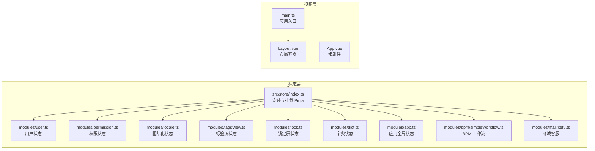

图表来源
- [index.ts](file://yudao-ui/yudao-ui-admin-vue3/src/store/index.ts)
- [user.ts](file://yudao-ui/yudao-ui-admin-vue3/src/store/modules/user.ts)
- [permission.ts](file://yudao-ui/yudao-ui-admin-vue3/src/store/modules/permission.ts)
- [locale.ts](file://yudao-ui/yudao-ui-admin-vue3/src/store/modules/locale.ts)
- [tagsView.ts](file://yudao-ui/yudao-ui-admin-vue3/src/store/modules/tagsView.ts)
- [lock.ts](file://yudao-ui/yudao-ui-admin-vue3/src/store/modules/lock.ts)
- [dict.ts](file://yudao-ui/yudao-ui-admin-vue3/src/store/modules/dict.ts)
- [app.ts](file://yudao-ui/yudao-ui-admin-vue3/src/store/modules/app.ts)
- [simpleWorkflow.ts](file://yudao-ui/yudao-ui-admin-vue3/src/store/modules/bpm/simpleWorkflow.ts)
- [kefu.ts](file://yudao-ui/yudao-ui-admin-vue3/src/store/modules/mall/kefu.ts)
- [Layout.vue](file://yudao-ui/yudao-ui-admin-vue3/src/layout/Layout.vue)
- [App.vue](file://yudao-ui/yudao-ui-admin-vue3/src/App.vue)
- [main.ts](file://yudao-ui/yudao-ui-admin-vue3/src/main.ts)

章节来源
- [index.ts](file://yudao-ui/yudao-ui-admin-vue3/src/store/index.ts)
- [main.ts](file://yudao-ui/yudao-ui-admin-vue3/src/main.ts)

## 核心组件
- Pinia 安装与实例：在应用入口中安装并挂载 Pinia，确保全局可访问。
- Store 模块化：按领域拆分模块，每个模块独立维护自身状态、动作与计算属性。
- 计算属性：通过 getter 组合派生状态，减少重复逻辑。
- 动作函数：封装对状态的修改与副作用（如 API 调用），统一异步流程。
- 持久化：通过插件实现关键状态的本地持久化，提升用户体验。
- 权限与路由联动：结合权限状态与路由守卫，动态控制页面访问与菜单渲染。

章节来源
- [index.ts](file://yudao-ui/yudao-ui-admin-vue3/src/store/index.ts)
- [user.ts](file://yudao-ui/yudao-ui-admin-vue3/src/store/modules/user.ts)
- [permission.ts](file://yudao-ui/yudao-ui-admin-vue3/src/store/modules/permission.ts)
- [locale.ts](file://yudao-ui/yudao-ui-admin-vue3/src/store/modules/locale.ts)
- [tagsView.ts](file://yudao-ui/yudao-ui-admin-vue3/src/store/modules/tagsView.ts)
- [lock.ts](file://yudao-ui/yudao-ui-admin-vue3/src/store/modules/lock.ts)
- [dict.ts](file://yudao-ui/yudao-ui-admin-vue3/src/store/modules/dict.ts)
- [app.ts](file://yudao-ui/yudao-ui-admin-vue3/src/store/modules/app.ts)

## 架构总览
Pinia 在 ruoyi-vue-pro 中承担以下职责：
- 用户态：登录态、角色、部门、岗位、租户信息等。
- 权限态：菜单权限、按钮权限、路由权限集合。
- 国际化态：当前语言与翻译资源。
- 视图态：标签页、布局模式、主题、锁屏等。
- 应用态：全局配置、加载状态、错误状态、提示消息等。
- 业务态：按模块划分（如 BPM 工作流、商城客服）。

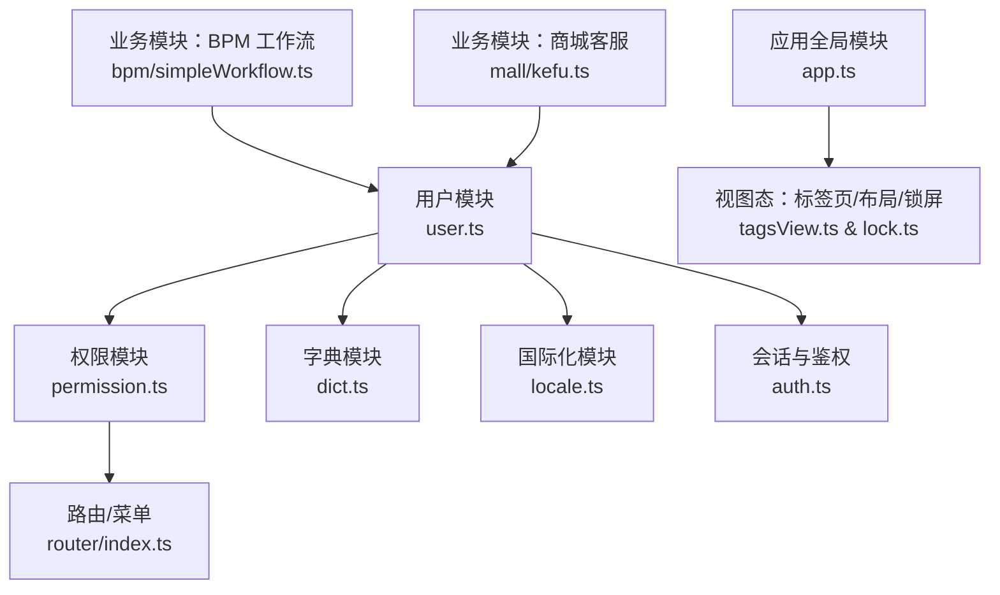

图表来源
- [user.ts](file://yudao-ui/yudao-ui-admin-vue3/src/store/modules/user.ts)
- [permission.ts](file://yudao-ui/yudao-ui-admin-vue3/src/store/modules/permission.ts)
- [dict.ts](file://yudao-ui/yudao-ui-admin-vue3/src/store/modules/dict.ts)
- [locale.ts](file://yudao-ui/yudao-ui-admin-vue3/src/store/modules/locale.ts)
- [app.ts](file://yudao-ui/yudao-ui-admin-vue3/src/store/modules/app.ts)
- [tagsView.ts](file://yudao-ui/yudao-ui-admin-vue3/src/store/modules/tagsView.ts)
- [lock.ts](file://yudao-ui/yudao-ui-admin-vue3/src/store/modules/lock.ts)
- [simpleWorkflow.ts](file://yudao-ui/yudao-ui-admin-vue3/src/store/modules/bpm/simpleWorkflow.ts)
- [kefu.ts](file://yudao-ui/yudao-ui-admin-vue3/src/store/modules/mall/kefu.ts)
- [index.ts](file://yudao-ui/yudao-ui-admin-vue3/src/router/index.ts)
- [auth.ts](file://yudao-ui/yudao-ui-admin-vue3/src/utils/auth.ts)

## 详细组件分析

### 用户状态模块（user）
- 职责：维护登录用户的基本信息、角色、部门、岗位、租户等。
- 关键点：
  - 状态字段：用户 ID、账号、昵称、头像、所属部门、岗位、角色列表、租户信息等。
  - 动作函数：登录、登出、更新用户信息、切换租户等。
  - 计算属性：当前用户的角色标识、部门名称、岗位名称等派生值。
- 使用场景：登录后初始化用户信息，权限判断与菜单渲染的基础数据来源。

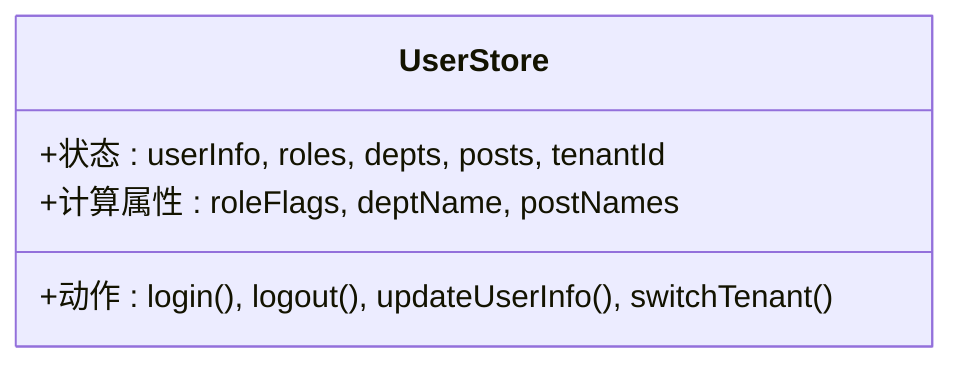

图表来源
- [user.ts](file://yudao-ui/yudao-ui-admin-vue3/src/store/modules/user.ts)

章节来源
- [user.ts](file://yudao-ui/yudao-ui-admin-vue3/src/store/modules/user.ts)
- [auth.ts](file://yudao-ui/yudao-ui-admin-vue3/src/utils/auth.ts)

### 权限状态模块（permission）
- 职责：维护菜单权限、按钮权限、路由权限集合，支持动态路由注入。
- 关键点：
  - 状态字段：菜单树、按钮权限集合、路由白名单、动态路由列表。
  - 动作函数：生成路由、设置权限、清理权限等。
  - 与路由联动：结合路由守卫与菜单渲染。
- 使用场景：登录后根据用户角色拉取权限，动态生成可访问菜单与路由。

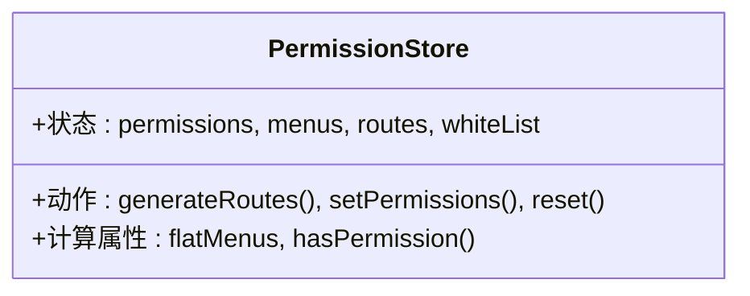

图表来源
- [permission.ts](file://yudao-ui/yudao-ui-admin-vue3/src/store/modules/permission.ts)
- [index.ts](file://yudao-ui/yudao-ui-admin-vue3/src/router/index.ts)

章节来源
- [permission.ts](file://yudao-ui/yudao-ui-admin-vue3/src/store/modules/permission.ts)
- [index.ts](file://yudao-ui/yudao-ui-admin-vue3/src/router/index.ts)
- [hasPermi.ts](file://yudao-ui/yudao-ui-admin-vue3/src/directives/permission/hasPermi.ts)

### 国际化状态模块（locale）
- 职责：维护当前语言与翻译资源。
- 关键点：
  - 状态字段：当前语言、可用语言列表、翻译资源。
  - 动作函数：切换语言、加载语言包。
  - 与 hooks 集成：通过 hooks 获取当前语言上下文。
- 使用场景：界面文案多语言切换。

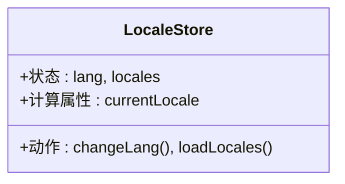

图表来源
- [locale.ts](file://yudao-ui/yudao-ui-admin-vue3/src/store/modules/locale.ts)
- [useLocale.ts](file://yudao-ui/yudao-ui-admin-vue3/src/hooks/web/useLocale.ts)

章节来源
- [locale.ts](file://yudao-ui/yudao-ui-admin-vue3/src/store/modules/locale.ts)
- [useLocale.ts](file://yudao-ui/yudao-ui-admin-vue3/src/hooks/web/useLocale.ts)

### 标签页与布局状态（tagsView、lock、app）
- 标签页（tagsView）：维护打开的页面标签，支持关闭、刷新、清空等操作。
- 锁定屏（lock）：控制锁屏状态与解锁流程。
- 应用全局（app）：全局配置、主题、布局模式、加载与错误状态等。
- 关键点：与 Layout 组件协作，驱动视图层的标签栏、侧边栏、顶部导航等。

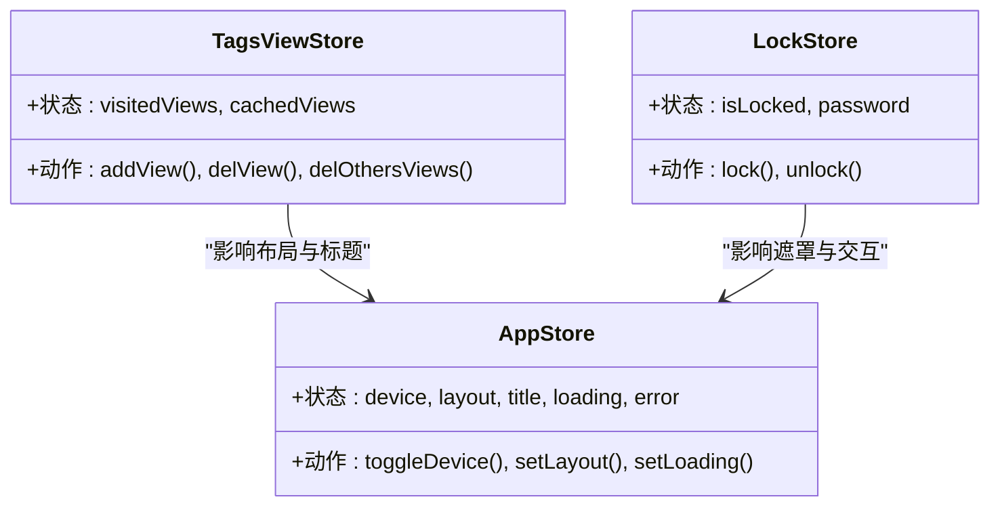

图表来源
- [tagsView.ts](file://yudao-ui/yudao-ui-admin-vue3/src/store/modules/tagsView.ts)
- [lock.ts](file://yudao-ui/yudao-ui-admin-vue3/src/store/modules/lock.ts)
- [app.ts](file://yudao-ui/yudao-ui-admin-vue3/src/store/modules/app.ts)
- [Layout.vue](file://yudao-ui/yudao-ui-admin-vue3/src/layout/Layout.vue)

章节来源
- [tagsView.ts](file://yudao-ui/yudao-ui-admin-vue3/src/store/modules/tagsView.ts)
- [lock.ts](file://yudao-ui/yudao-ui-admin-vue3/src/store/modules/lock.ts)
- [app.ts](file://yudao-ui/yudao-ui-admin-vue3/src/store/modules/app.ts)
- [layout.ts](file://yudao-ui/yudao-ui-admin-vue3/src/utils/layout.ts)

### 字典状态（dict）
- 职责：缓存系统字典类型与数据，避免重复请求。
- 关键点：
  - 状态字段：字典类型映射、字典项列表。
  - 动作函数：按类型加载字典、批量加载字典。
- 使用场景：下拉框、筛选器、表格列展示等需要字典翻译的场景。

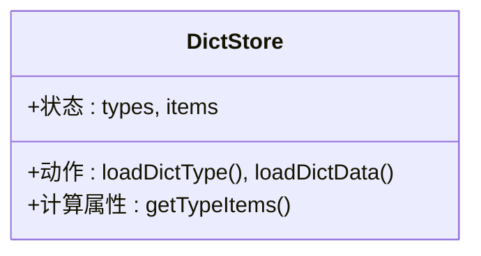

图表来源
- [dict.ts](file://yudao-ui/yudao-ui-admin-vue3/src/store/modules/dict.ts)

章节来源
- [dict.ts](file://yudao-ui/yudao-ui-admin-vue3/src/store/modules/dict.ts)

### 业务模块示例（BPM 工作流、商城客服）
- BPM 工作流：维护流程模型、任务实例等状态，支持流程启动、审批等操作。
- 商城客服：维护客服会话、消息等状态，支持在线沟通与工单流转。
- 关键点：模块内聚合业务状态与动作，避免跨模块耦合。

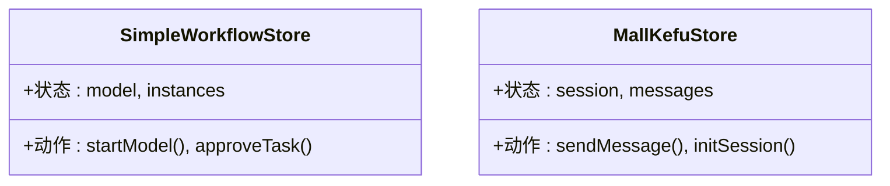

图表来源
- [simpleWorkflow.ts](file://yudao-ui/yudao-ui-admin-vue3/src/store/modules/bpm/simpleWorkflow.ts)
- [kefu.ts](file://yudao-ui/yudao-ui-admin-vue3/src/store/modules/mall/kefu.ts)

章节来源
- [simpleWorkflow.ts](file://yudao-ui/yudao-ui-admin-vue3/src/store/modules/bpm/simpleWorkflow.ts)
- [kefu.ts](file://yudao-ui/yudao-ui-admin-vue3/src/store/modules/mall/kefu.ts)

### API 调用与异步状态处理
- 登录流程：调用登录接口，成功后写入用户信息与令牌，触发权限生成与路由注入。
- 权限拉取：根据角色拉取菜单与按钮权限，生成动态路由。
- 字典加载：按需加载字典类型与数据，缓存于 store。
- 加载与错误状态：通过 app 模块的 loading 与 error 字段统一管理全局加载与错误提示。

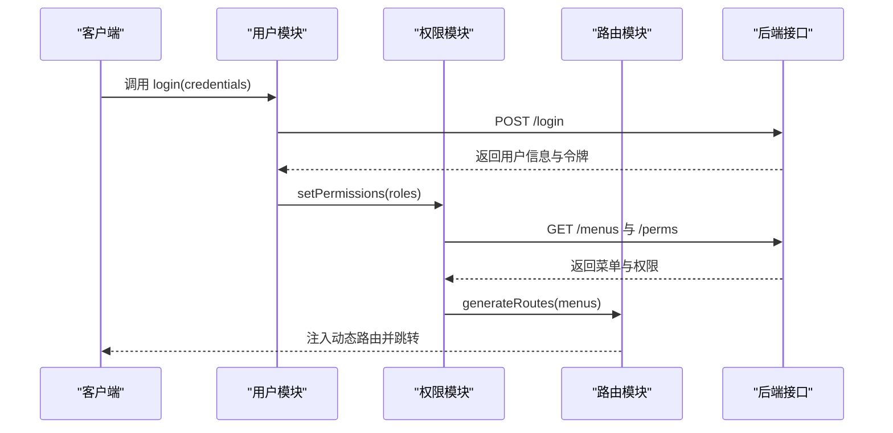

图表来源
- [index.ts](file://yudao-ui/yudao-ui-admin-vue3/src/api/login/index.ts)
- [index.ts](file://yudao-ui/yudao-ui-admin-vue3/src/api/system/user/socialUser.ts)
- [index.ts](file://yudao-ui/yudao-ui-admin-vue3/src/api/system/role/index.ts)
- [index.ts](file://yudao-ui/yudao-ui-admin-vue3/src/api/system/menu/index.ts)
- [index.ts](file://yudao-ui/yudao-ui-admin-vue3/src/api/system/user/index.ts)
- [permission.ts](file://yudao-ui/yudao-ui-admin-vue3/src/store/modules/permission.ts)
- [index.ts](file://yudao-ui/yudao-ui-admin-vue3/src/router/index.ts)

章节来源
- [index.ts](file://yudao-ui/yudao-ui-admin-vue3/src/api/login/index.ts)
- [index.ts](file://yudao-ui/yudao-ui-admin-vue3/src/api/system/user/socialUser.ts)
- [index.ts](file://yudao-ui/yudao-ui-admin-vue3/src/api/system/role/index.ts)
- [index.ts](file://yudao-ui/yudao-ui-admin-vue3/src/api/system/menu/index.ts)
- [index.ts](file://yudao-ui/yudao-ui-admin-vue3/src/api/system/user/index.ts)
- [permission.ts](file://yudao-ui/yudao-ui-admin-vue3/src/store/modules/permission.ts)
- [index.ts](file://yudao-ui/yudao-ui-admin-vue3/src/router/index.ts)

### 状态持久化方案（pinia-plugin-persistedstate）
- 目标：将关键状态持久化到本地存储，避免刷新丢失。
- 配置要点：
  - 选择持久化模块：如用户、权限、国际化、标签页、应用全局等。
  - 选择存储介质：localStorage 或 sessionStorage。
  - 控制序列化策略：避免存储不可序列化对象。
- 在构建优化中可见 Pinia 被纳入预打包依赖，有助于运行时性能。

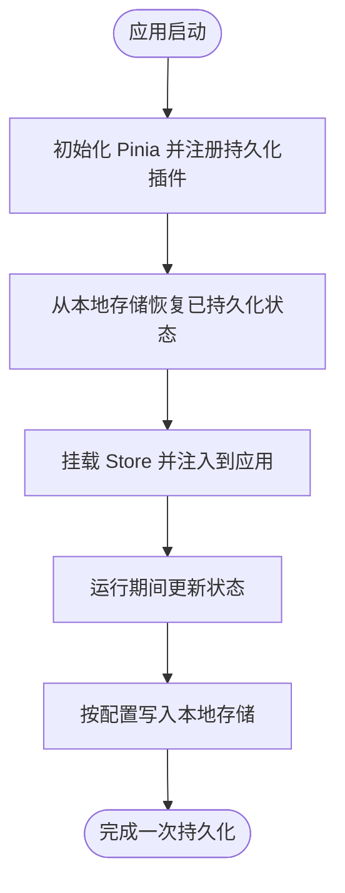

图表来源
- [package.json](file://yudao-ui/yudao-ui-admin-vue3/package.json)
- [optimize.ts](file://yudao-ui/yudao-ui-admin-vue3/build/vite/optimize.ts)

章节来源
- [package.json](file://yudao-ui/yudao-ui-admin-vue3/package.json)
- [optimize.ts](file://yudao-ui/yudao-ui-admin-vue3/build/vite/optimize.ts)

### 状态之间的依赖关系与同步机制
- 用户状态是权限与菜单渲染的基础，权限状态决定路由与菜单显示。
- 字典状态为视图层提供翻译数据，减少重复请求。
- 标签页状态与路由状态保持一致，关闭标签页应同步删除缓存。
- 应用全局状态协调布局、主题与加载状态，作为跨组件通信中枢。

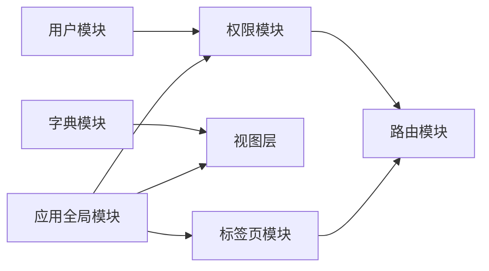

图表来源
- [user.ts](file://yudao-ui/yudao-ui-admin-vue3/src/store/modules/user.ts)
- [permission.ts](file://yudao-ui/yudao-ui-admin-vue3/src/store/modules/permission.ts)
- [dict.ts](file://yudao-ui/yudao-ui-admin-vue3/src/store/modules/dict.ts)
- [tagsView.ts](file://yudao-ui/yudao-ui-admin-vue3/src/store/modules/tagsView.ts)
- [app.ts](file://yudao-ui/yudao-ui-admin-vue3/src/store/modules/app.ts)
- [index.ts](file://yudao-ui/yudao-ui-admin-vue3/src/router/index.ts)

章节来源
- [user.ts](file://yudao-ui/yudao-ui-admin-vue3/src/store/modules/user.ts)
- [permission.ts](file://yudao-ui/yudao-ui-admin-vue3/src/store/modules/permission.ts)
- [dict.ts](file://yudao-ui/yudao-ui-admin-vue3/src/store/modules/dict.ts)
- [tagsView.ts](file://yudao-ui/yudao-ui-admin-vue3/src/store/modules/tagsView.ts)
- [app.ts](file://yudao-ui/yudao-ui-admin-vue3/src/store/modules/app.ts)
- [index.ts](file://yudao-ui/yudao-ui-admin-vue3/src/router/index.ts)

### 状态调试工具使用
- 浏览器开发者工具：
  - 打开“Vue DevTools”，在“Pinia”面板查看所有 Store 的状态快照与变更历史。
  - 可直接在面板中修改状态以验证 UI 行为。
  - 查看 actions 的调用链与时间线，定位异步流程问题。
- 日志辅助：在关键动作前后打印日志，便于排查状态异常。
- 建议：仅在开发环境启用严格模式与调试工具，避免生产环境性能损耗。

## 依赖分析
- 构建期依赖：Pinia 被纳入预打包依赖，降低运行时体积与冷启动时间。
- 运行时依赖：各模块之间通过 Store API 交互，避免直接耦合。
- 外部依赖：Axios 请求封装、路由守卫、指令权限等。

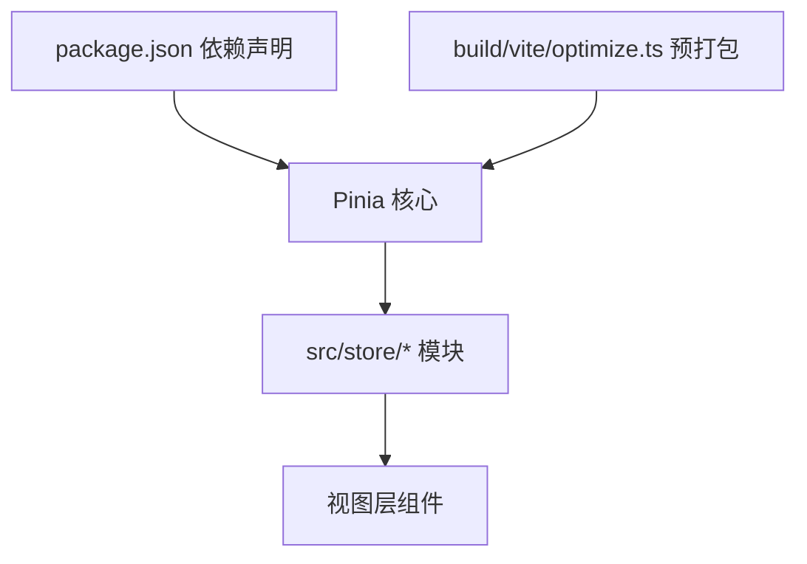

图表来源
- [package.json](file://yudao-ui/yudao-ui-admin-vue3/package.json)
- [optimize.ts](file://yudao-ui/yudao-ui-admin-vue3/build/vite/optimize.ts)
- [index.ts](file://yudao-ui/yudao-ui-admin-vue3/src/store/index.ts)

章节来源
- [package.json](file://yudao-ui/yudao-ui-admin-vue3/package.json)
- [optimize.ts](file://yudao-ui/yudao-ui-admin-vue3/build/vite/optimize.ts)
- [index.ts](file://yudao-ui/yudao-ui-admin-vue3/src/store/index.ts)

## 性能考虑
- 模块化拆分：按功能域拆分 Store，避免单模块臃肿。
- 计算属性优先：通过 getter 组合派生状态，减少重复计算。
- 按需加载：字典与权限按需加载，避免一次性拉取过多数据。
- 持久化策略：仅持久化必要状态，控制存储大小。
- 避免深层嵌套：扁平化状态结构，简化响应式追踪。
- 合理使用 actions：合并多次状态更新，减少渲染次数。

## 故障排查指南
- 登录后无菜单或白屏
  - 检查权限模块是否成功生成路由。
  - 确认路由守卫是否正确拦截与放行。
- 语言切换无效
  - 检查国际化模块是否正确切换语言并重新渲染。
- 标签页无法关闭
  - 检查标签页模块与路由状态是否同步。
- 页面刷新后状态丢失
  - 检查持久化插件配置与存储介质。
- 权限指令不生效
  - 检查权限指令与权限模块的集成方式。

章节来源
- [permission.ts](file://yudao-ui/yudao-ui-admin-vue3/src/store/modules/permission.ts)
- [locale.ts](file://yudao-ui/yudao-ui-admin-vue3/src/store/modules/locale.ts)
- [tagsView.ts](file://yudao-ui/yudao-ui-admin-vue3/src/store/modules/tagsView.ts)
- [hasPermi.ts](file://yudao-ui/yudao-ui-admin-vue3/src/directives/permission/hasPermi.ts)

## 结论
ruoyi-vue-pro 基于 Pinia 的状态管理遵循“模块化、可组合、可持久化”的设计原则，围绕用户、权限、国际化、视图与应用全局五大维度构建核心状态，并通过业务模块扩展至 BPM、商城等场景。配合持久化与调试工具，能够有效提升开发效率与用户体验。建议在团队内统一规范 Store 的命名、动作与计算属性的组织方式，持续优化性能与可维护性。

## 附录
- 快速上手步骤
  - 在 src/store/modules 新增模块文件，导出状态、动作与计算属性。
  - 在 src/store/index.ts 中注册模块。
  - 在组件中通过组合式 API 使用 Store。
  - 需要持久化的模块在插件中配置对应模块。
- 最佳实践清单
  - 使用计算属性替代重复逻辑。
  - 将副作用集中在动作中，保持状态纯函数式。
  - 为关键状态添加默认值与边界检查。
  - 为异步动作提供加载与错误状态。
  - 使用指令与权限模块进行细粒度权限控制。