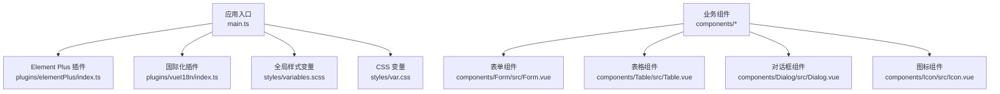
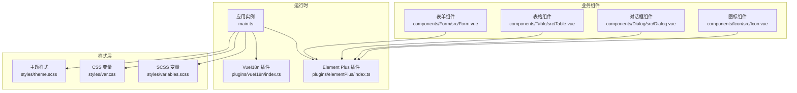
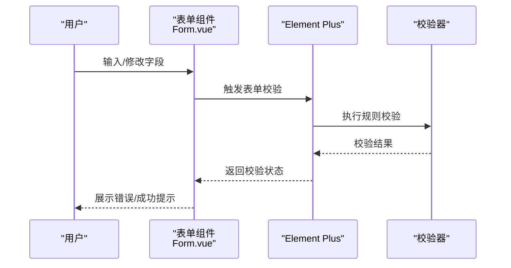
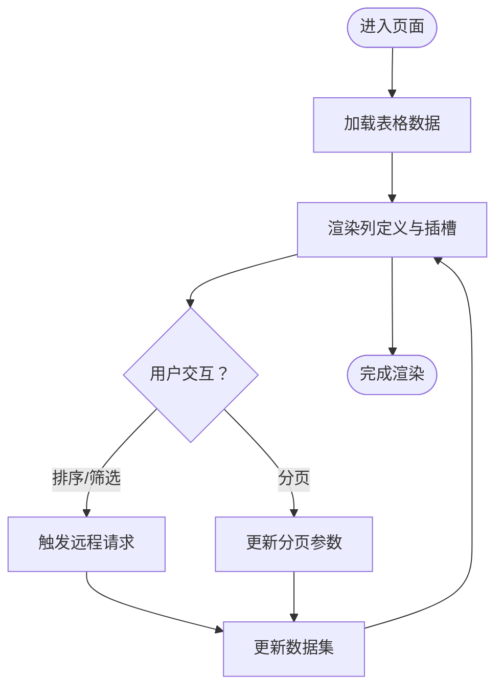
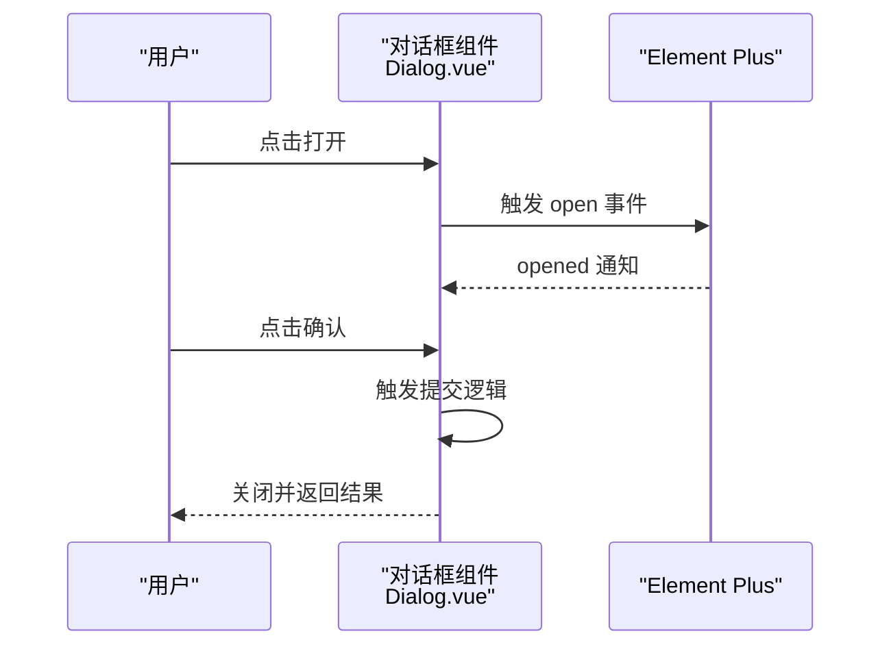
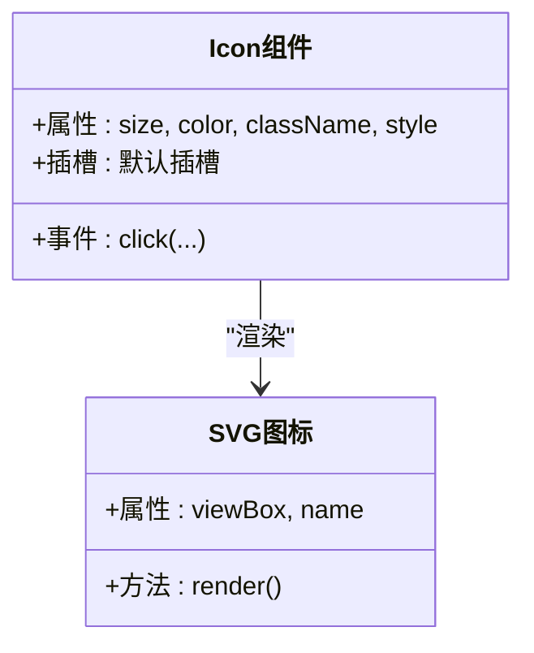
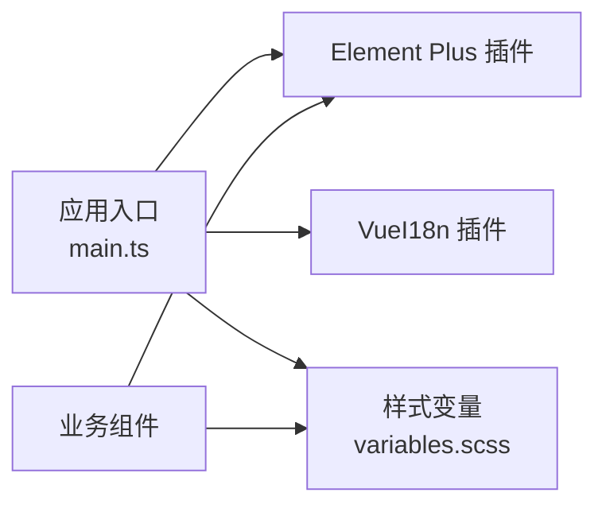

# Element Plus 组件使用

<cite>
**本文档引用的文件**
- [App.vue](file://yudao-ui/yudao-ui-admin-vue3/src/App.vue)
- [main.ts](file://yudao-ui/yudao-ui-admin-vue3/src/main.ts)
- [elementPlus 插件](file://yudao-ui/yudao-ui-admin-vue3/src/plugins/elementPlus/index.ts)
- [Form.vue](file://yudao-ui/yudao-ui-admin-vue3/src/components/Form/src/Form.vue)
- [Table.vue](file://yudao-ui/yudao-ui-admin-vue3/src/components/Table/src/Table.vue)
- [Dialog.vue](file://yudao-ui/yudao-ui-admin-vue3/src/components/Dialog/src/Dialog.vue)
- [Icon.vue](file://yudao-ui/yudao-ui-admin-vue3/src/components/Icon/src/Icon.vue)
- [theme.scss](file://yudao-ui/yudao-ui-admin-vue3/src/styles/theme.scss)
- [variables.scss](file://yudao-ui/yudao-ui-admin-vue3/src/styles/variables.scss)
- [var.css](file://yudao-ui/yudao-ui-admin-vue3/src/styles/var.css)
- [zh-CN.ts](file://yudao-ui/yudao-ui-admin-vue3/src/locales/zh-CN.ts)
- [en.ts](file://yudao-ui/yudao-ui-admin-vue3/src/locales/en.ts)
- [vueI18n 插件](file://yudao-ui/yudao-ui-admin-vue3/src/plugins/vueI18n/index.ts)
- [index.ts](file://yudao-ui/yudao-ui-admin-vue3/src/components/index.ts)
</cite>

## 目录
1. [简介](#简介)
2. [项目结构](#项目结构)
3. [核心组件](#核心组件)
4. [架构总览](#架构总览)
5. [详细组件分析](#详细组件分析)
6. [依赖关系分析](#依赖关系分析)
7. [性能考虑](#性能考虑)
8. [故障排除指南](#故障排除指南)
9. [结论](#结论)
10. [附录](#附录)

## 简介
本指南面向在项目中使用 Element Plus 组件的开发者，系统讲解表单组件（ElForm、ElFormItem）、表格组件（ElTable、ElTableColumn）、对话框组件（ElDialog）、图标组件（ElIcon）等的使用方法与配置要点，涵盖属性、事件、插槽、响应式设计、主题定制、国际化与可访问性配置，并提供常见问题与性能优化建议。

## 项目结构
项目采用 Vue 3 + Vite 前端工程，Element Plus 通过插件方式全局注册，组件以功能模块化组织，样式通过 SCSS 变量与 CSS 变量统一管理，国际化通过 vue-i18n 实现。

**图表来源**
- [main.ts:1-200](file://yudao-ui/yudao-ui-admin-vue3/src/main.ts#L1-L200)
- [elementPlus 插件:1-200](file://yudao-ui/yudao-ui-admin-vue3/src/plugins/elementPlus/index.ts#L1-L200)
- [vueI18n 插件:1-200](file://yudao-ui/yudao-ui-admin-vue3/src/plugins/vueI18n/index.ts#L1-L200)
- [variables.scss:1-200](file://yudao-ui/yudao-ui-admin-vue3/src/styles/variables.scss#L1-L200)
- [var.css:1-200](file://yudao-ui/yudao-ui-admin-vue3/src/styles/var.css#L1-L200)
- [Form.vue:1-200](file://yudao-ui/yudao-ui-admin-vue3/src/components/Form/src/Form.vue#L1-L200)
- [Table.vue:1-200](file://yudao-ui/yudao-ui-admin-vue3/src/components/Table/src/Table.vue#L1-L200)
- [Dialog.vue:1-200](file://yudao-ui/yudao-ui-admin-vue3/src/components/Dialog/src/Dialog.vue#L1-L200)
- [Icon.vue:1-200](file://yudao-ui/yudao-ui-admin-vue3/src/components/Icon/src/Icon.vue#L1-L200)

**章节来源**
- [main.ts:1-200](file://yudao-ui/yudao-ui-admin-vue3/src/main.ts#L1-L200)
- [elementPlus 插件:1-200](file://yudao-ui/yudao-ui-admin-vue3/src/plugins/elementPlus/index.ts#L1-L200)

## 核心组件
本节聚焦于 Element Plus 在项目中的核心使用：表单、表格、对话框、图标。

- 表单组件（ElForm、ElFormItem）
  - 使用场景：数据录入、校验与提交
  - 关键点：表单项布局、校验规则、动态字段、清空与重置
  - 参考实现位置：[Form.vue:1-200](file://yudao-ui/yudao-ui-admin-vue3/src/components/Form/src/Form.vue#L1-L200)

- 表格组件（ElTable、ElTableColumn）
  - 使用场景：数据展示、排序、筛选、分页
  - 关键点：列定义、渲染插槽、固定列、懒加载、合计行
  - 参考实现位置：[Table.vue:1-200](file://yudao-ui/yudao-ui-admin-vue3/src/components/Table/src/Table.vue#L1-L200)

- 对话框组件（ElDialog）
  - 使用场景：弹窗交互、确认取消、异步提交
  - 关键点：显示控制、底部按钮、尺寸适配、遮罩关闭策略
  - 参考实现位置：[Dialog.vue:1-200](file://yudao-ui/yudao-ui-admin-vue3/src/components/Dialog/src/Dialog.vue#L1-L200)

- 图标组件（ElIcon）
  - 使用场景：语义化图标、SVG 图标选择器
  - 关键点：图标切换、尺寸与颜色、与 SVG 图标的集成
  - 参考实现位置：[Icon.vue:1-200](file://yudao-ui/yudao-ui-admin-vue3/src/components/Icon/src/Icon.vue#L1-L200)

**章节来源**
- [Form.vue:1-200](file://yudao-ui/yudao-ui-admin-vue3/src/components/Form/src/Form.vue#L1-L200)
- [Table.vue:1-200](file://yudao-ui/yudao-ui-admin-vue3/src/components/Table/src/Table.vue#L1-L200)
- [Dialog.vue:1-200](file://yudao-ui/yudao-ui-admin-vue3/src/components/Dialog/src/Dialog.vue#L1-L200)
- [Icon.vue:1-200](file://yudao-ui/yudao-ui-admin-vue3/src/components/Icon/src/Icon.vue#L1-L200)

## 架构总览
Element Plus 在应用启动阶段完成全局注册，业务组件通过统一导出入口按需引入。样式体系通过 SCSS 变量与 CSS 变量双轨制进行主题定制，国际化通过 vue-i18n 提供多语言支持。

**图表来源**
- [main.ts:1-200](file://yudao-ui/yudao-ui-admin-vue3/src/main.ts#L1-L200)
- [elementPlus 插件:1-200](file://yudao-ui/yudao-ui-admin-vue3/src/plugins/elementPlus/index.ts#L1-L200)
- [vueI18n 插件:1-200](file://yudao-ui/yudao-ui-admin-vue3/src/plugins/vueI18n/index.ts#L1-L200)
- [variables.scss:1-200](file://yudao-ui/yudao-ui-admin-vue3/src/styles/variables.scss#L1-L200)
- [var.css:1-200](file://yudao-ui/yudao-ui-admin-vue3/src/styles/var.css#L1-L200)
- [theme.scss:1-200](file://yudao-ui/yudao-ui-admin-vue3/src/styles/theme.scss#L1-L200)
- [Form.vue:1-200](file://yudao-ui/yudao-ui-admin-vue3/src/components/Form/src/Form.vue#L1-L200)
- [Table.vue:1-200](file://yudao-ui/yudao-ui-admin-vue3/src/components/Table/src/Table.vue#L1-L200)
- [Dialog.vue:1-200](file://yudao-ui/yudao-ui-admin-vue3/src/components/Dialog/src/Dialog.vue#L1-L200)
- [Icon.vue:1-200](file://yudao-ui/yudao-ui-admin-vue3/src/components/Icon/src/Icon.vue#L1-L200)

## 详细组件分析

### 表单组件（ElForm、ElFormItem）
- 功能要点
  - 表单布局：栅格、标签宽度、对齐方式
  - 校验策略：必填、正则、自定义校验、异步校验
  - 动态表单：新增/删除字段、条件渲染
  - 行为控制：禁用、只读、清空与重置
- 常用属性与事件
  - ElForm：model、rules、label-width、label-position、disabled、hide-required-asterisk
  - ElFormItem：prop、required、label、rules、error、show-message、validate-event
- 插槽
  - 默认插槽：放置输入控件
  - label 插槽：自定义标签内容
- 最佳实践
  - 将校验规则集中管理，避免分散在模板中
  - 使用表单重置时同步清空外部状态
  - 对复杂表单采用分步或分组展示
- 参考实现位置
  - [Form.vue:1-200](file://yudao-ui/yudao-ui-admin-vue3/src/components/Form/src/Form.vue#L1-L200)

**图表来源**
- [Form.vue:1-200](file://yudao-ui/yudao-ui-admin-vue3/src/components/Form/src/Form.vue#L1-L200)

**章节来源**
- [Form.vue:1-200](file://yudao-ui/yudao-ui-admin-vue3/src/components/Form/src/Form.vue#L1-L200)

### 表格组件（ElTable、ElTableColumn）
- 功能要点
  - 列定义：type、width、align、fixed、formatter
  - 渲染插槽：默认插槽、编辑/操作列
  - 排序与筛选：header 插槽、filter-method、sort-method
  - 分页与懒加载：虚拟滚动、远程分页
  - 合计行：footer 方法、合计列
- 常用属性与事件
  - ElTable：data、height、max-height、stripe、border、size、fit、loading
  - ElTableColumn：type、prop、label、width、fixed、sortable、filters、filter-method
- 插槽
  - 默认插槽：单元格内容
  - header 插槽：自定义表头
  - append 插槽：表尾追加内容
- 最佳实践
  - 固定列数量不宜过多，避免横向滚动卡顿
  - 使用 footer-format 或计算属性实现合计行
  - 远程排序/筛选时结合 loading 与防抖
- 参考实现位置
  - [Table.vue:1-200](file://yudao-ui/yudao-ui-admin-vue3/src/components/Table/src/Table.vue#L1-L200)

**图表来源**
- [Table.vue:1-200](file://yudao-ui/yudao-ui-admin-vue3/src/components/Table/src/Table.vue#L1-L200)

**章节来源**
- [Table.vue:1-200](file://yudao-ui/yudao-ui-admin-vue3/src/components/Table/src/Table.vue#L1-L200)

### 对话框组件（ElDialog）
- 功能要点
  - 显示控制：visible、before-close
  - 底部按钮：确认/取消、加载状态、禁用
  - 尺寸适配：宽度、高度、流式布局
  - 遮罩关闭：点击遮罩关闭策略
- 常用属性与事件
  - visible、width、fullscreen、top、modal-append-to-body、destroy-on-close
  - open、opened、close、closed、openAutoFocus、closeAutoFocus
- 插槽
  - default 插槽：对话框主体
  - title 插槽：自定义标题
  - footer 插槽：自定义底部按钮
- 最佳实践
  - 异步提交时开启加载态，防止重复提交
  - 使用 destroy-on-close 避免内存泄漏
  - 自定义 before-close 处理未保存数据
- 参考实现位置
  - [Dialog.vue:1-200](file://yudao-ui/yudao-ui-admin-vue3/src/components/Dialog/src/Dialog.vue#L1-L200)

**图表来源**
- [Dialog.vue:1-200](file://yudao-ui/yudao-ui-admin-vue3/src/components/Dialog/src/Dialog.vue#L1-L200)

**章节来源**
- [Dialog.vue:1-200](file://yudao-ui/yudao-ui-admin-vue3/src/components/Dialog/src/Dialog.vue#L1-L200)

### 图标组件（ElIcon）
- 功能要点
  - 图标切换：根据名称动态渲染
  - 尺寸与颜色：通过类名或内联样式控制
  - 与 SVG 集成：支持自定义 SVG 图标
- 常用属性与事件
  - size、color、class-name、style
- 插槽
  - 默认插槽：放置具体图标元素
- 最佳实践
  - 使用语义化命名，便于维护
  - 通过 CSS 变量统一控制图标主题色
- 参考实现位置
  - [Icon.vue:1-200](file://yudao-ui/yudao-ui-admin-vue3/src/components/Icon/src/Icon.vue#L1-L200)

**图表来源**
- [Icon.vue:1-200](file://yudao-ui/yudao-ui-admin-vue3/src/components/Icon/src/Icon.vue#L1-L200)

**章节来源**
- [Icon.vue:1-200](file://yudao-ui/yudao-ui-admin-vue3/src/components/Icon/src/Icon.vue#L1-L200)

## 依赖关系分析
- 插件注册
  - Element Plus 通过插件方式全局安装，业务组件无需单独导入
  - 国际化通过 vue-i18n 注入，支持中英文切换
- 样式依赖
  - SCSS 变量用于主题色、字号、间距等基础维度
  - CSS 变量用于运行时主题切换与组件级覆盖
- 组件依赖
  - 业务组件按需引入 Element Plus 组件，减少打包体积
  - 统一导出入口便于复用与版本管理

**图表来源**
- [main.ts:1-200](file://yudao-ui/yudao-ui-admin-vue3/src/main.ts#L1-L200)
- [elementPlus 插件:1-200](file://yudao-ui/yudao-ui-admin-vue3/src/plugins/elementPlus/index.ts#L1-L200)
- [variables.scss:1-200](file://yudao-ui/yudao-ui-admin-vue3/src/styles/variables.scss#L1-L200)

**章节来源**
- [main.ts:1-200](file://yudao-ui/yudao-ui-admin-vue3/src/main.ts#L1-L200)
- [elementPlus 插件:1-200](file://yudao-ui/yudao-ui-admin-vue3/src/plugins/elementPlus/index.ts#L1-L200)
- [variables.scss:1-200](file://yudao-ui/yudao-ui-admin-vue3/src/styles/variables.scss#L1-L200)

## 性能考虑
- 懒加载与虚拟滚动
  - 大列表使用虚拟滚动减少 DOM 节点数量
  - 表格分页与远程排序降低前端压力
- 样式优化
  - 使用 CSS 变量替代硬编码颜色，便于批量替换
  - 避免深层作用域选择器，减少样式计算开销
- 组件复用
  - 将通用表单/表格封装为可复用组件，减少重复渲染
  - 对频繁切换的状态使用 v-memo（如适用）

## 故障排除指南
- 表单校验不生效
  - 检查 ElFormItem 的 prop 是否与 model 字段一致
  - 确认 rules 中规则书写正确且未被覆盖
- 表格渲染异常
  - 检查 data 是否响应式更新
  - 固定列与宽度设置是否冲突
- 对话框无法关闭
  - 检查 visible 绑定与 before-close 逻辑
  - 确认未阻止默认关闭行为
- 图标不显示
  - 检查图标名称是否正确
  - 确认 SVG 注册与类名样式是否生效

## 结论
通过统一的插件注册、样式变量与国际化配置，项目实现了 Element Plus 组件的高效使用与扩展。遵循本文的最佳实践，可在保证开发效率的同时提升用户体验与可维护性。

## 附录
- 主题定制
  - SCSS 变量：用于构建期主题生成与静态样式覆盖
  - CSS 变量：用于运行时主题切换与组件级覆盖
  - 参考文件：[variables.scss:1-200](file://yudao-ui/yudao-ui-admin-vue3/src/styles/variables.scss#L1-L200)、[var.css:1-200](file://yudao-ui/yudao-ui-admin-vue3/src/styles/var.css#L1-L200)、[theme.scss:1-200](file://yudao-ui/yudao-ui-admin-vue3/src/styles/theme.scss#L1-L200)
- 国际化
  - 语言包：[zh-CN.ts:1-200](file://yudao-ui/yudao-ui-admin-vue3/src/locales/zh-CN.ts#L1-L200)、[en.ts:1-200](file://yudao-ui/yudao-ui-admin-vue3/src/locales/en.ts#L1-L200)
  - 插件：[vueI18n 插件:1-200](file://yudao-ui/yudao-ui-admin-vue3/src/plugins/vueI18n/index.ts#L1-L200)
- 组件导出
  - 统一导出入口：[index.ts:1-200](file://yudao-ui/yudao-ui-admin-vue3/src/components/index.ts#L1-L200)