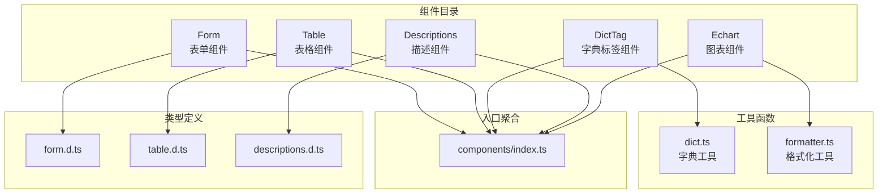
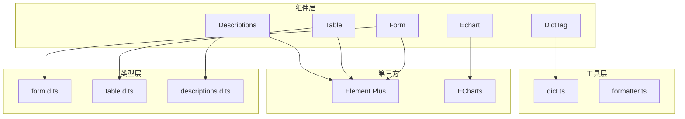
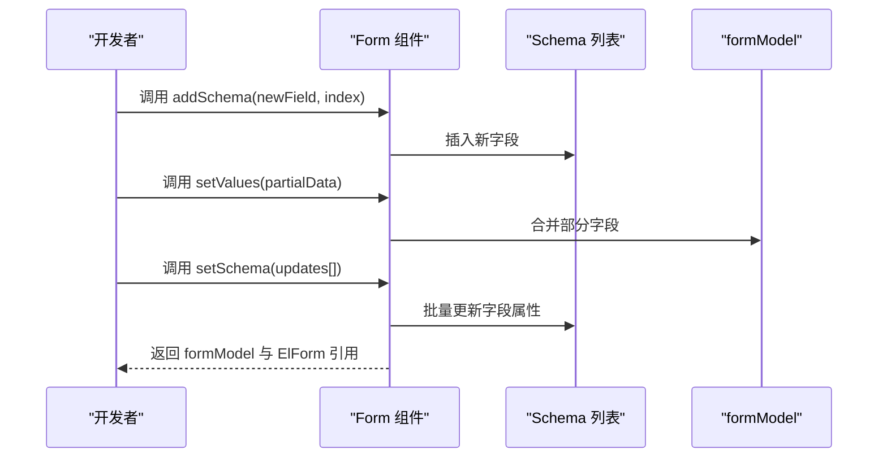
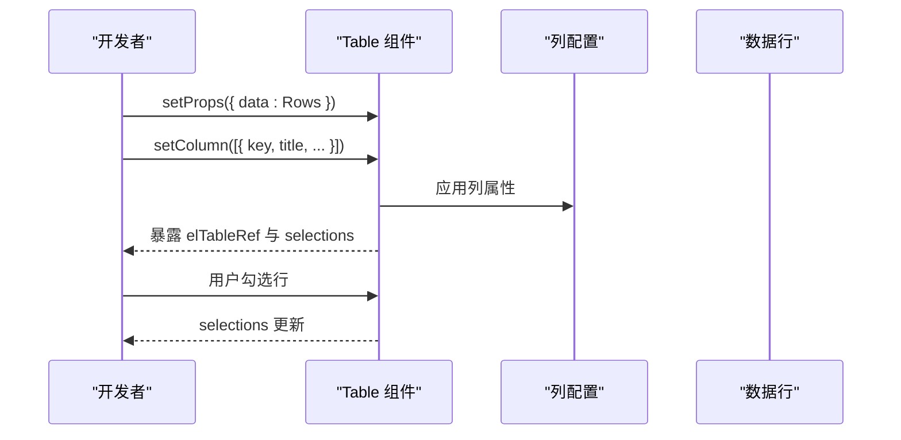
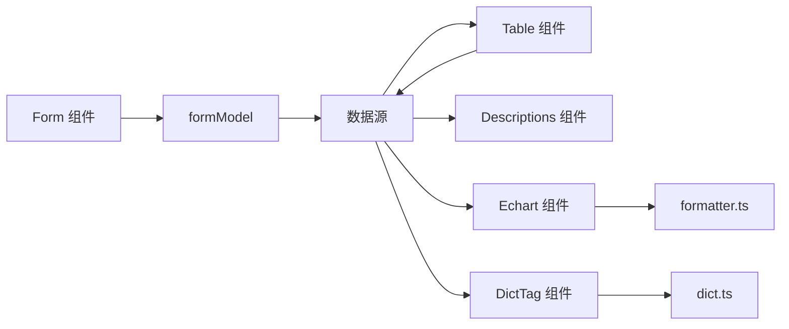

# 业务组件库

<cite>
**本文引用的文件**
- [Form/index.ts](file://yudao-ui/yudao-ui-admin-vue3/src/components/Form/index.ts)
- [Table/index.ts](file://yudao-ui/yudao-ui-admin-vue3/src/components/Table/index.ts)
- [DictTag/index.ts](file://yudao-ui/yudao-ui-admin-vue3/src/components/DictTag/index.ts)
- [Descriptions/index.ts](file://yudao-ui/yudao-ui-admin-vue3/src/components/Descriptions/index.ts)
- [Echart/index.ts](file://yudao-ui/yudao-ui-admin-vue3/src/components/Echart/index.ts)
- [form.d.ts](file://yudao-ui/yudao-ui-admin-vue3/src/types/form.d.ts)
- [table.d.ts](file://yudao-ui/yudao-ui-admin-vue3/src/types/table.d.ts)
- [descriptions.d.ts](file://yudao-ui/yudao-ui-admin-vue3/src/types/descriptions.d.ts)
- [dict.ts](file://yudao-ui/yudao-ui-admin-vue3/src/utils/dict.ts)
- [formatter.ts](file://yudao-ui/yudao-ui-admin-vue3/src/utils/formatter.ts)
- [index.ts](file://yudao-ui/yudao-ui-admin-vue3/src/components/index.ts)
</cite>

## 目录
1. [简介](#简介)
2. [项目结构](#项目结构)
3. [核心组件](#核心组件)
4. [架构总览](#架构总览)
5. [详细组件分析](#详细组件分析)
6. [依赖关系分析](#依赖关系分析)
7. [性能考虑](#性能考虑)
8. [故障排查指南](#故障排查指南)
9. [结论](#结论)
10. [附录](#附录)

## 简介
本指南面向业务组件库的使用者与维护者，系统性介绍前端业务组件的使用方法、配置项、API 接口、使用场景、高级配置与定制化方法（数据绑定、事件处理、样式定制）、组件间协作与数据流转、性能优化与内存管理，以及在实际业务场景中的最佳实践。重点覆盖以下组件：Form 表单组件、Table 表格组件、DictTag 字典标签组件、Descriptions 描述组件、Echart 图表组件。

## 项目结构
业务组件集中在 yudao-ui/yudao-ui-admin-vue3/src/components 下，采用按功能模块划分的组织方式，每个组件通过 index.ts 统一导出，便于全局或按需引入。类型定义位于 src/types 目录，工具函数位于 src/utils 目录，组件入口聚合于 src/components/index.ts。

**图示来源**
- [Form/index.ts:1-16](file://yudao-ui/yudao-ui-admin-vue3/src/components/Form/index.ts#L1-L16)
- [Table/index.ts:1-14](file://yudao-ui/yudao-ui-admin-vue3/src/components/Table/index.ts#L1-L14)
- [DictTag/index.ts:1-4](file://yudao-ui/yudao-ui-admin-vue3/src/components/DictTag/index.ts#L1-L4)
- [Descriptions/index.ts:1-5](file://yudao-ui/yudao-ui-admin-vue3/src/components/Descriptions/index.ts#L1-L5)
- [Echart/index.ts:1-4](file://yudao-ui/yudao-ui-admin-vue3/src/components/Echart/index.ts#L1-L4)
- [form.d.ts](file://yudao-ui/yudao-ui-admin-vue3/src/types/form.d.ts)
- [table.d.ts](file://yudao-ui/yudao-ui-admin-vue3/src/types/table.d.ts)
- [descriptions.d.ts](file://yudao-ui/yudao-ui-admin-vue3/src/types/descriptions.d.ts)
- [dict.ts](file://yudao-ui/yudao-ui-admin-vue3/src/utils/dict.ts)
- [formatter.ts](file://yudao-ui/yudao-ui-admin-vue3/src/utils/formatter.ts)
- [index.ts](file://yudao-ui/yudao-ui-admin-vue3/src/components/index.ts)

**章节来源**
- [Form/index.ts:1-16](file://yudao-ui/yudao-ui-admin-vue3/src/components/Form/index.ts#L1-L16)
- [Table/index.ts:1-14](file://yudao-ui/yudao-ui-admin-vue3/src/components/Table/index.ts#L1-L14)
- [DictTag/index.ts:1-4](file://yudao-ui/yudao-ui-admin-vue3/src/components/DictTag/index.ts#L1-L4)
- [Descriptions/index.ts:1-5](file://yudao-ui/yudao-ui-admin-vue3/src/components/Descriptions/index.ts#L1-L5)
- [Echart/index.ts:1-4](file://yudao-ui/yudao-ui-admin-vue3/src/components/Echart/index.ts#L1-L4)

## 核心组件
本节概述各组件的职责与典型应用场景：
- Form 表单组件：基于 Element Plus ElForm 封装，提供动态表单构建、字段增删改、值设置与获取、Schema 管理等能力，适用于复杂查询条件、新增/编辑表单等场景。
- Table 表格组件：基于 Element Plus ElTable 封装，提供列配置、选中数据管理、原生 ElTable 引用暴露等能力，适用于列表展示、批量操作、分页筛选等场景。
- DictTag 字典标签组件：根据字典类型与字典值渲染带样式的标签，支持颜色、文案映射，适用于状态显示、分类标识等场景。
- Descriptions 描述组件：基于 Element Plus Descriptions 封装，提供键值对式信息展示，适用于详情页、卡片信息展示等场景。
- Echart 图表组件：封装 ECharts 图表渲染，提供数据驱动的可视化展示，适用于统计报表、趋势分析、仪表盘等场景。

**章节来源**
- [Form/index.ts:5-13](file://yudao-ui/yudao-ui-admin-vue3/src/components/Form/index.ts#L5-L13)
- [Table/index.ts:6-11](file://yudao-ui/yudao-ui-admin-vue3/src/components/Table/index.ts#L6-L11)
- [DictTag/index.ts:1-4](file://yudao-ui/yudao-ui-admin-vue3/src/components/DictTag/index.ts#L1-L4)
- [Descriptions/index.ts:1-5](file://yudao-ui/yudao-ui-admin-vue3/src/components/Descriptions/index.ts#L1-L5)
- [Echart/index.ts:1-4](file://yudao-ui/yudao-ui-admin-vue3/src/components/Echart/index.ts#L1-L4)

## 架构总览
组件层以“统一导出 + 类型约束 + 工具函数”为核心设计原则，确保可扩展性与可维护性。组件对外暴露受控的 API，内部依赖 Element Plus 原子组件与自研工具函数，形成清晰的职责边界。

**图示来源**
- [Form/index.ts:1-16](file://yudao-ui/yudao-ui-admin-vue3/src/components/Form/index.ts#L1-L16)
- [Table/index.ts:1-14](file://yudao-ui/yudao-ui-admin-vue3/src/components/Table/index.ts#L1-L14)
- [DictTag/index.ts:1-4](file://yudao-ui/yudao-ui-admin-vue3/src/components/DictTag/index.ts#L1-L4)
- [Descriptions/index.ts:1-5](file://yudao-ui/yudao-ui-admin-vue3/src/components/Descriptions/index.ts#L1-L5)
- [Echart/index.ts:1-4](file://yudao-ui/yudao-ui-admin-vue3/src/components/Echart/index.ts#L1-L4)
- [form.d.ts](file://yudao-ui/yudao-ui-admin-vue3/src/types/form.d.ts)
- [table.d.ts](file://yudao-ui/yudao-ui-admin-vue3/src/types/table.d.ts)
- [descriptions.d.ts](file://yudao-ui/yudao-ui-admin-vue3/src/types/descriptions.d.ts)
- [dict.ts](file://yudao-ui/yudao-ui-admin-vue3/src/utils/dict.ts)
- [formatter.ts](file://yudao-ui/yudao-ui-admin-vue3/src/utils/formatter.ts)

## 详细组件分析

### Form 表单组件
- 组件定位：提供动态 Schema 驱动的表单能力，支持字段增删改、值设置、属性更新、Schema 同步与原生 ElForm 引用暴露。
- 关键 API（FormExpose）：
  - setValues(data)：批量设置表单值
  - setProps(props)：设置表单属性
  - delSchema(field)：删除指定字段 Schema
  - addSchema(formSchema, index?)：在指定位置插入字段 Schema
  - setSchema(schemaProps[])：批量更新 Schema 属性
  - formModel：表单数据模型
  - getElFormRef()：获取原生 ElForm 实例
- 使用场景：
  - 动态查询表单：根据权限或业务规则动态增减字段
  - 新增/编辑表单：通过 Schema 控制字段渲染与校验
  - 表单联动：结合 setProps/setSchema 实现字段显隐与只读切换
- 高级配置与定制：
  - 数据绑定：通过 formModel 双向绑定；setValues 支持部分字段更新
  - 事件处理：通过 getElFormRef 获取原生 ElForm，注册校验、提交等事件
  - 样式定制：通过 setProps 设置类名、尺寸等外观属性
- 性能与内存：
  - 避免频繁 setSchema 导致的整表重渲染，建议合并多次 Schema 更新
  - 大字段集合建议延迟初始化或懒加载
- 典型流程（Schema 管理）：

**图示来源**
- [Form/index.ts:5-13](file://yudao-ui/yudao-ui-admin-vue3/src/components/Form/index.ts#L5-L13)

**章节来源**
- [Form/index.ts:1-16](file://yudao-ui/yudao-ui-admin-vue3/src/components/Form/index.ts#L1-L16)

### Table 表格组件
- 组件定位：提供列配置、选中数据管理与原生 ElTable 引用暴露，简化列表页开发。
- 关键 API（TableExpose）：
  - setProps(props)：设置表格属性
  - setColumn(columnProps[])：批量更新列属性
  - selections：当前选中行数组
  - elTableRef：原生 ElTable 实例
- 使用场景：
  - 列表展示：结合分页、排序、筛选
  - 批量操作：利用 selections 进行批量删除、导出等
  - 动态列：根据权限或业务需求动态增删列
- 高级配置与定制：
  - 数据绑定：通过 setProps 传入数据源；列模板通过 setColumn 自定义
  - 事件处理：通过 elTableRef 注册 selection-change、row-click 等事件
  - 样式定制：通过 setProps 设置尺寸、边框、斑马纹等外观
- 性能与内存：
  - 大数据量建议开启虚拟滚动（如可用）
  - 避免频繁 setColumn 导致的整表重渲染，建议按列粒度更新
- 典型流程（列配置与选择）：

**图示来源**
- [Table/index.ts:6-11](file://yudao-ui/yudao-ui-admin-vue3/src/components/Table/index.ts#L6-L11)

**章节来源**
- [Table/index.ts:1-14](file://yudao-ui/yudao-ui-admin-vue3/src/components/Table/index.ts#L1-L14)

### DictTag 字典标签组件
- 组件定位：根据字典类型与字典值渲染带样式的标签，支持颜色与文案映射。
- 关键能力：
  - 通过字典工具解析字典值，自动匹配颜色与显示文本
  - 支持多种字典类型，统一标签风格
- 使用场景：
  - 状态展示：如启用/禁用、审核状态
  - 分类标识：如产品类别、用户等级
- 高级配置与定制：
  - 数据绑定：传入字典类型与字典值
  - 样式定制：通过外部容器或主题变量控制颜色与字号
- 性能与内存：
  - 字典数据建议缓存，避免重复请求
  - 大量标签渲染时注意虚拟化或分页

**章节来源**
- [DictTag/index.ts:1-4](file://yudao-ui/yudao-ui-admin-vue3/src/components/DictTag/index.ts#L1-L4)
- [dict.ts](file://yudao-ui/yudao-ui-admin-vue3/src/utils/dict.ts)

### Descriptions 描述组件
- 组件定位：基于 Element Plus Descriptions 的封装，提供键值对式信息展示。
- 关键能力：
  - 支持多列布局与响应式换行
  - 提供 DescriptionsItemLabel 子组件用于自定义标签渲染
- 使用场景：
  - 详情页信息展示
  - 卡片式信息汇总
- 高级配置与定制：
  - 数据绑定：传入键值对数据
  - 样式定制：通过属性控制间距、对齐、边框等
- 性能与内存：
  - 内容较多时建议分段加载或懒渲染

**章节来源**
- [Descriptions/index.ts:1-5](file://yudao-ui/yudao-ui-admin-vue3/src/components/Descriptions/index.ts#L1-L5)
- [descriptions.d.ts](file://yudao-ui/yudao-ui-admin-vue3/src/types/descriptions.d.ts)

### Echart 图表组件
- 组件定位：封装 ECharts 图表渲染，提供数据驱动的可视化展示。
- 关键能力：
  - 通过数据与配置驱动图表更新
  - 支持多种图表类型与交互
- 使用场景：
  - 统计报表
  - 趋势分析
  - 仪表盘
- 高级配置与定制：
  - 数据绑定：传入 series 与 xAxis 等配置
  - 样式定制：通过主题与配置项控制颜色、字体、网格等
- 性能与内存：
  - 大数据量建议降采样或分批渲染
  - 图表销毁时释放内存，避免内存泄漏

**章节来源**
- [Echart/index.ts:1-4](file://yudao-ui/yudao-ui-admin-vue3/src/components/Echart/index.ts#L1-L4)
- [formatter.ts](file://yudao-ui/yudao-ui-admin-vue3/src/utils/formatter.ts)

## 依赖关系分析
组件间协作与数据流转遵循“组件暴露 API → 上层调用 → 工具函数处理 → 视图渲染”的链路。Form 与 Table 作为数据入口，DictTag、Descriptions、Echart 作为展示层，共同构成完整的业务页面。

**图示来源**
- [Form/index.ts:1-16](file://yudao-ui/yudao-ui-admin-vue3/src/components/Form/index.ts#L1-L16)
- [Table/index.ts:1-14](file://yudao-ui/yudao-ui-admin-vue3/src/components/Table/index.ts#L1-L14)
- [DictTag/index.ts:1-4](file://yudao-ui/yudao-ui-admin-vue3/src/components/DictTag/index.ts#L1-L4)
- [Descriptions/index.ts:1-5](file://yudao-ui/yudao-ui-admin-vue3/src/components/Descriptions/index.ts#L1-L5)
- [Echart/index.ts:1-4](file://yudao-ui/yudao-ui-admin-vue3/src/components/Echart/index.ts#L1-L4)
- [dict.ts](file://yudao-ui/yudao-ui-admin-vue3/src/utils/dict.ts)
- [formatter.ts](file://yudao-ui/yudao-ui-admin-vue3/src/utils/formatter.ts)

**章节来源**
- [index.ts](file://yudao-ui/yudao-ui-admin-vue3/src/components/index.ts)

## 性能考虑
- 渲染优化
  - 大列表：优先使用虚拟滚动或分页，减少 DOM 数量
  - 动态 Schema/列：合并更新批次，避免频繁整表重渲染
- 内存管理
  - 图表组件在组件卸载时应清理实例与事件监听
  - 字典数据建议本地缓存，避免重复请求
- 计算与格式化
  - 复杂格式化逻辑建议缓存结果或使用计算属性
- 事件与引用
  - 通过暴露的 ref 或回调及时解绑事件，防止内存泄漏

## 故障排查指南
- 表单不生效
  - 检查是否正确调用 setValues/setProps/setSchema
  - 确认字段 Schema 是否存在且 key 正确
- 表格无数据
  - 检查 setProps 中 data 是否正确传入
  - 确认列配置是否与数据结构一致
- 字典标签不显示
  - 检查字典类型与字典值是否正确
  - 确认字典数据是否已加载
- 图表不渲染
  - 检查数据结构与配置项是否符合 ECharts 要求
  - 确认容器尺寸与初始化时机

## 结论
业务组件库通过统一的 API 设计与类型约束，提供了高内聚、低耦合的组件体系。Form 与 Table 作为数据入口，DictTag、Descriptions、Echart 作为展示层，配合工具函数与类型定义，能够高效支撑各类业务场景。遵循本文的使用规范、性能优化与故障排查建议，可显著提升开发效率与系统稳定性。

## 附录
- 组件导出入口：src/components/index.ts
- 类型定义：src/types/form.d.ts、src/types/table.d.ts、src/types/descriptions.d.ts
- 工具函数：src/utils/dict.ts、src/utils/formatter.ts