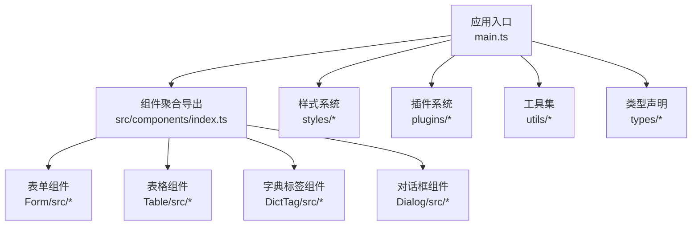
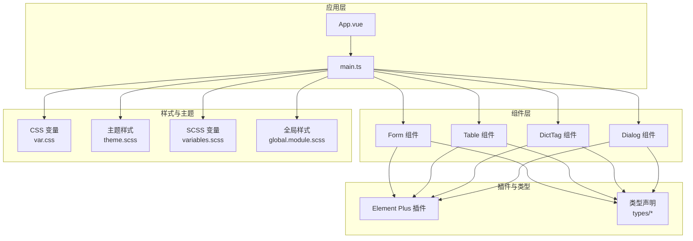
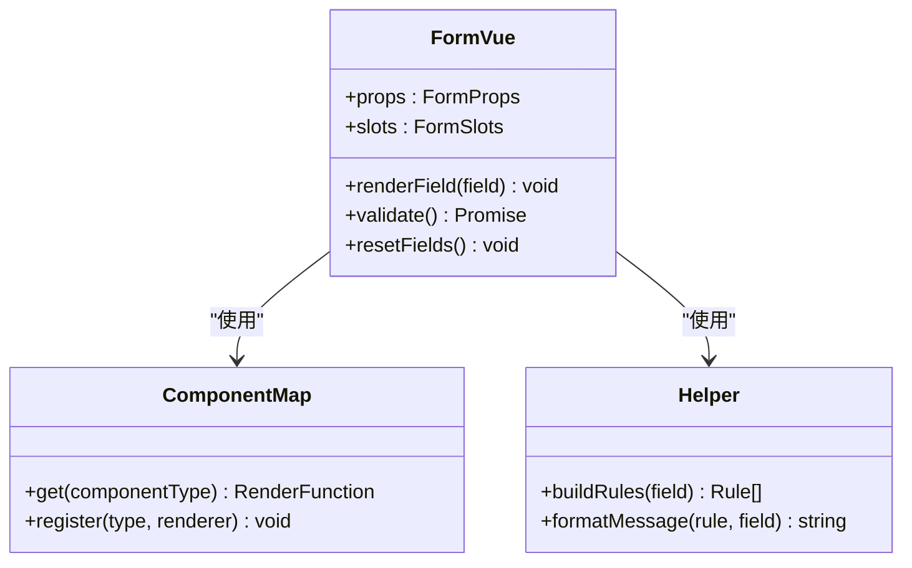
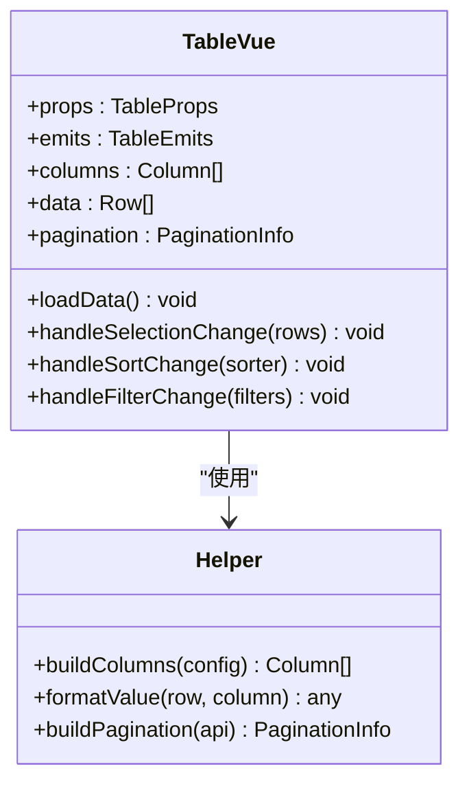
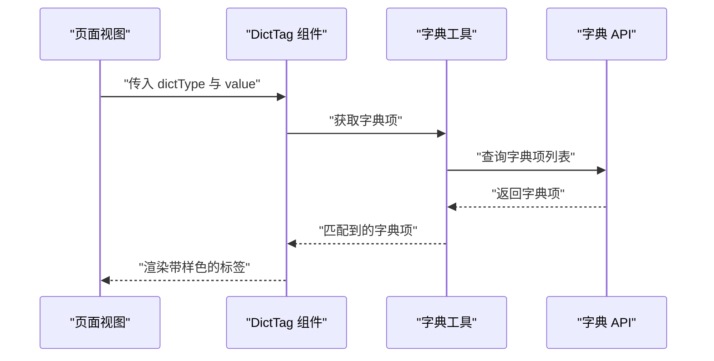
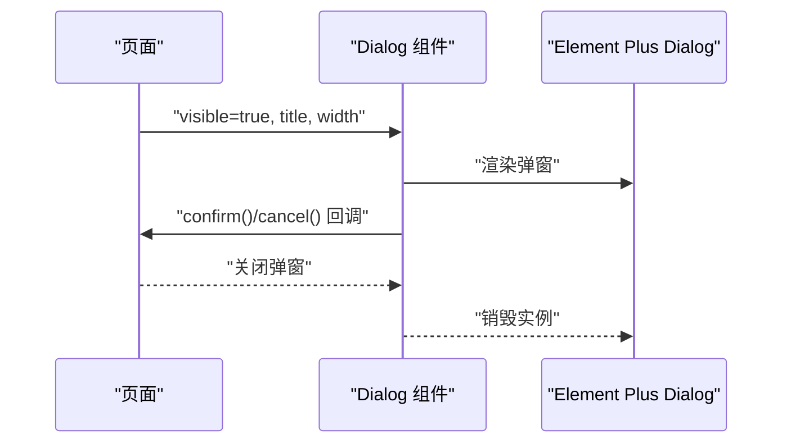
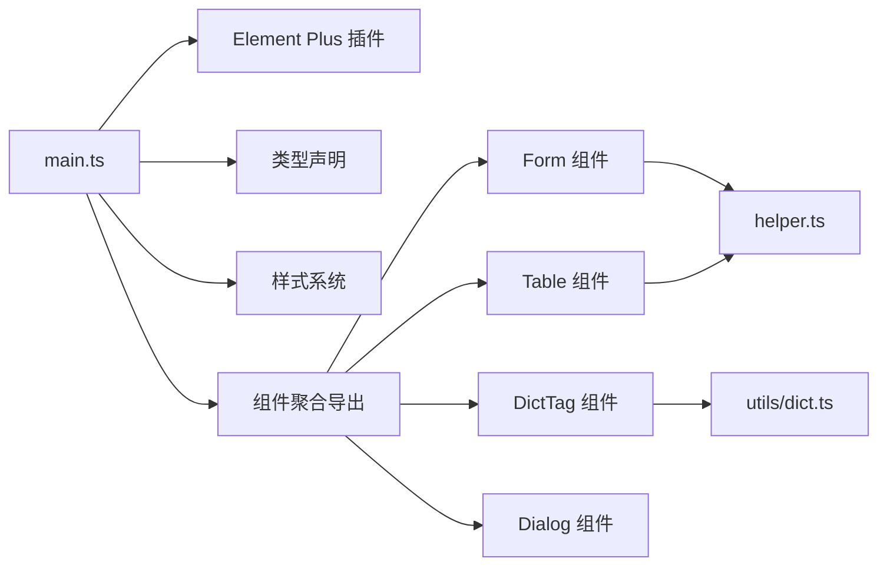

# 组件开发

<cite>
**本文引用的文件**
- [App.vue](file://yudao-ui/yudao-ui-admin-vue3/src/App.vue)
- [main.ts](file://yudao-ui/yudao-ui-admin-vue3/src/main.ts)
- [index.ts](file://yudao-ui/yudao-ui-admin-vue3/src/components/index.ts)
- [Form.vue](file://yudao-ui/yudao-ui-admin-vue3/src/components/Form/src/Form.vue)
- [componentMap.ts](file://yudao-ui/yudao-ui-admin-vue3/src/components/Form/src/componentMap.ts)
- [helper.ts](file://yudao-ui/yudao-ui-admin-vue3/src/components/Form/src/helper.ts)
- [types.ts](file://yudao-ui/yudao-ui-admin-vue3/src/components/Form/src/types.ts)
- [useRenderCheckbox.tsx](file://yudao-ui/yudao-ui-admin-vue3/src/components/Form/src/components/useRenderCheckbox.tsx)
- [useRenderRadio.tsx](file://yudao-ui/yudao-ui-admin-vue3/src/components/Form/src/components/useRenderRadio.tsx)
- [useRenderSelect.tsx](file://yudao-ui/yudao-ui-admin-vue3/src/components/Form/src/components/useRenderSelect.tsx)
- [Table.vue](file://yudao-ui/yudao-ui-admin-vue3/src/components/Table/src/Table.vue)
- [TableSelectForm.vue](file://yudao-ui/yudao-ui-admin-vue3/src/components/Table/src/TableSelectForm.vue)
- [helper.ts](file://yudao-ui/yudao-ui-admin-vue3/src/components/Table/src/helper.ts)
- [types.ts](file://yudao-ui/yudao-ui-admin-vue3/src/components/Table/src/types.ts)
- [DictTag.vue](file://yudao-ui/yudao-ui-admin-vue3/src/components/DictTag/src/DictTag.vue)
- [index.ts](file://yudao-ui/yudao-ui-admin-vue3/src/components/DictTag/index.ts)
- [Dialog.vue](file://yudao-ui/yudao-ui-admin-vue3/src/components/Dialog/src/Dialog.vue)
- [index.ts](file://yudao-ui/yudao-ui-admin-vue3/src/components/Dialog/index.ts)
- [variables.scss](file://yudao-ui/yudao-ui-admin-vue3/src/styles/variables.scss)
- [theme.scss](file://yudao-ui/yudao-ui-admin-vue3/src/styles/theme.scss)
- [var.css](file://yudao-ui/yudao-ui-admin-vue3/src/styles/var.css)
- [index.scss](file://yudao-ui/yudao-ui-admin-vue3/src/styles/index.scss)
- [global.module.scss](file://yudao-ui/yudao-ui-admin-vue3/src/styles/global.module.scss)
- [elementPlus 插件](file://yudao-ui/yudao-ui-admin-vue3/src/plugins/elementPlus/)
- [elementPlus 类型声明](file://yudao-ui/yudao-ui-admin-vue3/src/types/elementPlus.d.ts)
- [组件类型声明](file://yudao-ui/yudao-ui-admin-vue3/src/types/components.d.ts)
- [组合式 API 示例](file://yudao-ui/yudao-ui-admin-vue3/src/hooks/web/)
- [权限指令示例](file://yudao-ui/yudao-ui-admin-vue3/src/directives/permission/)
- [utils 工具集](file://yudao-ui/yudao-ui-admin-vue3/src/utils/)
- [dict 工具](file://yudao-ui/yudao-ui-admin-vue3/src/utils/dict.ts)
- [formRules 工具](file://yudao-ui/yudao-ui-admin-vue3/src/utils/formRules.ts)
- [formatter 工具](file://yudao-ui/yudao-ui-admin-vue3/src/utils/formatter.ts)
- [vite.config.ts](file://yudao-ui/yudao-ui-admin-vue3/vite.config.ts)
- [uno.config.ts](file://yudao-ui/yudao-ui-admin-vue3/uno.config.ts)
</cite>

## 目录
1. [简介](#简介)
2. [项目结构](#项目结构)
3. [核心组件](#核心组件)
4. [架构总览](#架构总览)
5. [详细组件分析](#详细组件分析)
6. [依赖关系分析](#依赖关系分析)
7. [性能考虑](#性能考虑)
8. [故障排查指南](#故障排查指南)
9. [结论](#结论)
10. [附录](#附录)

## 简介
本指南面向芋道 ruoyi-vue-pro 前端团队，系统化讲解基于 Element Plus 的组件开发方法与最佳实践。内容覆盖常用组件（ElTable、ElForm、ElDialog 等）的配置与使用、业务组件（Form、Table、DictTag 等）的功能与配置、组件通信模式（父子、兄弟、跨层级）、组件复用策略（高阶组件、混入、组合式 API）、样式定制（CSS 变量、主题定制、样式隔离）、以及组件测试与调试技巧。目标是帮助开发者在保证一致性的同时提升开发效率与可维护性。

## 项目结构
ruoyi-vue-pro 前端采用 Vue 3 + TypeScript + Vite 架构，组件统一放置于 src/components 下，按功能模块拆分并提供统一入口导出。Element Plus 通过插件方式全局注册，并结合 UnoCSS 实现原子化样式与主题变量管理。

图示来源
- [main.ts:1-200](file://yudao-ui/yudao-ui-admin-vue3/src/main.ts#L1-L200)
- [index.ts:1-200](file://yudao-ui/yudao-ui-admin-vue3/src/components/index.ts#L1-L200)
- [variables.scss:1-200](file://yudao-ui/yudao-ui-admin-vue3/src/styles/variables.scss#L1-L200)
- [theme.scss:1-200](file://yudao-ui/yudao-ui-admin-vue3/src/styles/theme.scss#L1-L200)
- [elementPlus 插件:1-200](file://yudao-ui/yudao-ui-admin-vue3/src/plugins/elementPlus/#L1-L200)

章节来源
- [main.ts:1-200](file://yudao-ui/yudao-ui-admin-vue3/src/main.ts#L1-L200)
- [index.ts:1-200](file://yudao-ui/yudao-ui-admin-vue3/src/components/index.ts#L1-L200)

## 核心组件
本节聚焦于高频使用的业务组件：Form、Table、DictTag、Dialog，以及 Element Plus 常用组件的集成与封装。

- Form 组件族：支持动态渲染多种输入控件，统一表单规则与校验，提供便捷的表单布局与交互能力。
- Table 组件族：封装分页、排序、筛选、选择等通用能力，提供灵活的数据展示与操作接口。
- DictTag 组件：根据字典类型与值渲染带样式的标签，统一业务状态/枚举展示风格。
- Dialog 组件：提供统一的弹窗容器与交互规范，便于业务弹窗的一致化实现。

章节来源
- [Form.vue:1-200](file://yudao-ui/yudao-ui-admin-vue3/src/components/Form/src/Form.vue#L1-L200)
- [Table.vue:1-200](file://yudao-ui/yudao-ui-admin-vue3/src/components/Table/src/Table.vue#L1-L200)
- [DictTag.vue:1-200](file://yudao-ui/yudao-ui-admin-vue3/src/components/DictTag/src/DictTag.vue#L1-L200)
- [Dialog.vue:1-200](file://yudao-ui/yudao-ui-admin-vue3/src/components/Dialog/src/Dialog.vue#L1-L200)

## 架构总览
下图展示了组件层与应用层的交互关系，以及样式与插件系统的支撑作用。

图示来源
- [App.vue:1-200](file://yudao-ui/yudao-ui-admin-vue3/src/App.vue#L1-L200)
- [main.ts:1-200](file://yudao-ui/yudao-ui-admin-vue3/src/main.ts#L1-L200)
- [elementPlus 插件:1-200](file://yudao-ui/yudao-ui-admin-vue3/src/plugins/elementPlus/#L1-L200)
- [elementPlus 类型声明:1-200](file://yudao-ui/yudao-ui-admin-vue3/src/types/elementPlus.d.ts#L1-L200)
- [组件类型声明:1-200](file://yudao-ui/yudao-ui-admin-vue3/src/types/components.d.ts#L1-L200)
- [var.css:1-200](file://yudao-ui/yudao-ui-admin-vue3/src/styles/var.css#L1-L200)
- [theme.scss:1-200](file://yudao-ui/yudao-ui-admin-vue3/src/styles/theme.scss#L1-L200)
- [variables.scss:1-200](file://yudao-ui/yudao-ui-admin-vue3/src/styles/variables.scss#L1-L200)
- [global.module.scss:1-200](file://yudao-ui/yudao-ui-admin-vue3/src/styles/global.module.scss#L1-L200)

## 详细组件分析

### Form 表单组件
Form 组件通过统一的组件映射表与渲染逻辑，实现对多种输入控件的动态渲染与校验。其核心要点包括：
- 组件映射：根据字段类型自动选择对应渲染器（如输入框、选择器、日期等）。
- 渲染器扩展：新增控件类型时，只需在映射表中注册并在渲染器中实现相应逻辑。
- 校验规则：集中管理表单规则与提示文案，支持异步校验与联动校验。
- 布局控制：提供栅格化布局与响应式适配，满足不同页面需求。

图示来源
- [Form.vue:1-200](file://yudao-ui/yudao-ui-admin-vue3/src/components/Form/src/Form.vue#L1-L200)
- [componentMap.ts:1-200](file://yudao-ui/yudao-ui-admin-vue3/src/components/Form/src/componentMap.ts#L1-L200)
- [helper.ts:1-200](file://yudao-ui/yudao-ui-admin-vue3/src/components/Form/src/helper.ts#L1-L200)

章节来源
- [Form.vue:1-200](file://yudao-ui/yudao-ui-admin-vue3/src/components/Form/src/Form.vue#L1-L200)
- [componentMap.ts:1-200](file://yudao-ui/yudao-ui-admin-vue3/src/components/Form/src/componentMap.ts#L1-L200)
- [helper.ts:1-200](file://yudao-ui/yudao-ui-admin-vue3/src/components/Form/src/helper.ts#L1-L200)
- [types.ts:1-200](file://yudao-ui/yudao-ui-admin-vue3/src/components/Form/src/types.ts#L1-L200)
- [useRenderCheckbox.tsx:1-200](file://yudao-ui/yudao-ui-admin-vue3/src/components/Form/src/components/useRenderCheckbox.tsx#L1-L200)
- [useRenderRadio.tsx:1-200](file://yudao-ui/yudao-ui-admin-vue3/src/components/Form/src/components/useRenderRadio.tsx#L1-L200)
- [useRenderSelect.tsx:1-200](file://yudao-ui/yudao-ui-admin-vue3/src/components/Form/src/components/useRenderSelect.tsx#L1-L200)

### Table 表格组件
Table 组件在 Element Plus ElTable 基础上封装了分页、排序、筛选、多选等常用能力，并提供统一的列配置与数据格式化接口。

图示来源
- [Table.vue:1-200](file://yudao-ui/yudao-ui-admin-vue3/src/components/Table/src/Table.vue#L1-L200)
- [helper.ts:1-200](file://yudao-ui/yudao-ui-admin-vue3/src/components/Table/src/helper.ts#L1-L200)
- [types.ts:1-200](file://yudao-ui/yudao-ui-admin-vue3/src/components/Table/src/types.ts#L1-L200)

章节来源
- [Table.vue:1-200](file://yudao-ui/yudao-ui-admin-vue3/src/components/Table/src/Table.vue#L1-L200)
- [TableSelectForm.vue:1-200](file://yudao-ui/yudao-ui-admin-vue3/src/components/Table/src/TableSelectForm.vue#L1-L200)
- [helper.ts:1-200](file://yudao-ui/yudao-ui-admin-vue3/src/components/Table/src/helper.ts#L1-L200)
- [types.ts:1-200](file://yudao-ui/yudao-ui-admin-vue3/src/components/Table/src/types.ts#L1-L200)

### DictTag 字典标签组件
DictTag 组件用于将字典类型与字典值渲染为带样式的标签，统一业务状态/枚举的视觉表现。

图示来源
- [DictTag.vue:1-200](file://yudao-ui/yudao-ui-admin-vue3/src/components/DictTag/src/DictTag.vue#L1-L200)
- [dict 工具:1-200](file://yudao-ui/yudao-ui-admin-vue3/src/utils/dict.ts#L1-L200)

章节来源
- [DictTag.vue:1-200](file://yudao-ui/yudao-ui-admin-vue3/src/components/DictTag/src/DictTag.vue#L1-L200)
- [index.ts:1-200](file://yudao-ui/yudao-ui-admin-vue3/src/components/DictTag/index.ts#L1-L200)
- [dict 工具:1-200](file://yudao-ui/yudao-ui-admin-vue3/src/utils/dict.ts#L1-L200)

### Dialog 对话框组件
Dialog 组件提供统一的弹窗容器，支持标题、尺寸、按钮、确认取消回调等通用能力，确保业务弹窗的一致体验。

图示来源
- [Dialog.vue:1-200](file://yudao-ui/yudao-ui-admin-vue3/src/components/Dialog/src/Dialog.vue#L1-L200)
- [index.ts:1-200](file://yudao-ui/yudao-ui-admin-vue3/src/components/Dialog/index.ts#L1-L200)

章节来源
- [Dialog.vue:1-200](file://yudao-ui/yudao-ui-admin-vue3/src/components/Dialog/src/Dialog.vue#L1-L200)
- [index.ts:1-200](file://yudao-ui/yudao-ui-admin-vue3/src/components/Dialog/index.ts#L1-L200)

### 自定义组件开发流程
- 设计原则：单一职责、可复用、可配置、可测试；遵循 Element Plus 设计语言与交互规范。
- Props 定义：使用 TypeScript 明确类型约束，区分必需与可选属性；提供合理的默认值。
- 事件处理：以语义化事件名向外暴露行为，避免直接修改父组件状态；必要时提供受控与非受控两种模式。
- 插槽使用：提供具名插槽以增强可定制性，同时保持默认插槽的可用性。
- 样式隔离：优先使用 CSS Modules 或作用域样式；必要时通过类名前缀或命名空间隔离。
- 测试与调试：编写单元测试与快照测试；提供调试开关与日志输出；利用浏览器 DevTools 进行断点与性能分析。

## 依赖关系分析
组件开发涉及多个层面的依赖：应用入口、组件聚合导出、Element Plus 插件、样式系统与工具集。

图示来源
- [main.ts:1-200](file://yudao-ui/yudao-ui-admin-vue3/src/main.ts#L1-L200)
- [index.ts:1-200](file://yudao-ui/yudao-ui-admin-vue3/src/components/index.ts#L1-L200)
- [elementPlus 插件:1-200](file://yudao-ui/yudao-ui-admin-vue3/src/plugins/elementPlus/#L1-L200)
- [elementPlus 类型声明:1-200](file://yudao-ui/yudao-ui-admin-vue3/src/types/elementPlus.d.ts#L1-L200)
- [组件类型声明:1-200](file://yudao-ui/yudao-ui-admin-vue3/src/types/components.d.ts#L1-L200)
- [helper.ts:1-200](file://yudao-ui/yudao-ui-admin-vue3/src/components/Table/src/helper.ts#L1-L200)
- [dict 工具:1-200](file://yudao-ui/yudao-ui-admin-vue3/src/utils/dict.ts#L1-L200)

章节来源
- [main.ts:1-200](file://yudao-ui/yudao-ui-admin-vue3/src/main.ts#L1-L200)
- [index.ts:1-200](file://yudao-ui/yudao-ui-admin-vue3/src/components/index.ts#L1-L200)

## 性能考虑
- 组件懒加载：对重型组件（如图表、编辑器）采用动态导入与条件渲染，减少首屏体积。
- 列表虚拟化：大数据表格启用虚拟滚动，降低 DOM 节点数量。
- 渲染优化：合理使用 v-memo、计算属性缓存与防抖节流，避免重复渲染。
- 样式按需：通过 UnoCSS 的扫描与 Tree Shaking，移除未使用样式。
- 资源压缩：构建阶段开启代码分割与资源压缩，配合 CDN 加速静态资源。

## 故障排查指南
- 表单校验不生效
  - 检查字段是否正确注册到组件映射表与规则生成器。
  - 确认校验触发时机与异步规则是否正确处理。
  - 参考路径：[helper.ts:1-200](file://yudao-ui/yudao-ui-admin-vue3/src/components/Form/src/helper.ts#L1-L200)
- 表格数据不更新
  - 确认数据源变更后是否触发重新加载与分页信息重建。
  - 检查列配置与值格式化函数是否正确。
  - 参考路径：[Table.vue:1-200](file://yudao-ui/yudao-ui-admin-vue3/src/components/Table/src/Table.vue#L1-L200)
- 字典标签显示异常
  - 核对字典类型与值是否匹配，网络请求是否成功。
  - 参考路径：[DictTag.vue:1-200](file://yudao-ui/yudao-ui-admin-vue3/src/components/DictTag/src/DictTag.vue#L1-L200)，[dict 工具:1-200](file://yudao-ui/yudao-ui-admin-vue3/src/utils/dict.ts#L1-L200)
- 弹窗无法关闭或遮罩穿透
  - 检查 visible 控制与事件回调是否正确传递至底层组件。
  - 参考路径：[Dialog.vue:1-200](file://yudao-ui/yudao-ui-admin-vue3/src/components/Dialog/src/Dialog.vue#L1-L200)
- 样式冲突或主题不生效
  - 确认 CSS 变量与主题文件引入顺序，避免 !important 覆盖。
  - 参考路径：[var.css:1-200](file://yudao-ui/yudao-ui-admin-vue3/src/styles/var.css#L1-L200)，[theme.scss:1-200](file://yudao-ui/yudao-ui-admin-vue3/src/styles/theme.scss#L1-L200)

章节来源
- [helper.ts:1-200](file://yudao-ui/yudao-ui-admin-vue3/src/components/Form/src/helper.ts#L1-L200)
- [Table.vue:1-200](file://yudao-ui/yudao-ui-admin-vue3/src/components/Table/src/Table.vue#L1-L200)
- [DictTag.vue:1-200](file://yudao-ui/yudao-ui-admin-vue3/src/components/DictTag/src/DictTag.vue#L1-L200)
- [Dialog.vue:1-200](file://yudao-ui/yudao-ui-admin-vue3/src/components/Dialog/src/Dialog.vue#L1-L200)
- [var.css:1-200](file://yudao-ui/yudao-ui-admin-vue3/src/styles/var.css#L1-L200)
- [theme.scss:1-200](file://yudao-ui/yudao-ui-admin-vue3/src/styles/theme.scss#L1-L200)

## 结论
通过统一的组件体系、完善的类型声明与样式管理，ruoyi-vue-pro 在保证开发效率的同时提升了代码质量与用户体验。建议在后续迭代中持续完善组件文档与测试覆盖率，强化组件间的契约约束与错误边界处理，进一步提升系统的可维护性与可扩展性。

## 附录
- 组件通信模式
  - 父子组件：通过 props 向下传递数据，通过事件向上传递行为。
  - 兄弟组件：通过共同父组件中转或通过全局状态管理共享数据。
  - 跨层级组件：使用 provide/inject 或集中式状态管理（如 Pinia）。
  - 参考路径：[组合式 API 示例:1-200](file://yudao-ui/yudao-ui-admin-vue3/src/hooks/web/#L1-L200)
- 组件复用策略
  - 高阶组件：通过包装现有组件增加通用能力（如权限校验、埋点）。
  - 混入：抽取公共逻辑（如生命周期钩子、工具方法），注意命名冲突与副作用。
  - 组合式 API：将可复用逻辑封装为 Composables，提升测试性与可维护性。
  - 参考路径：[权限指令示例:1-200](file://yudao-ui/yudao-ui-admin-vue3/src/directives/permission/#L1-L200)
- 样式定制方法
  - CSS 变量：在 var.css 中集中管理变量，实现主题切换与品牌定制。
  - 主题定制：通过 theme.scss 与 SCSS 变量覆盖 Element Plus 默认样式。
  - 样式隔离：使用 CSS Modules 或作用域样式，避免全局污染。
  - 参考路径：[var.css:1-200](file://yudao-ui/yudao-ui-admin-vue3/src/styles/var.css#L1-L200)，[theme.scss:1-200](file://yudao-ui/yudao-ui-admin-vue3/src/styles/theme.scss#L1-L200)，[variables.scss:1-200](file://yudao-ui/yudao-ui-admin-vue3/src/styles/variables.scss#L1-L200)，[global.module.scss:1-200](file://yudao-ui/yudao-ui-admin-vue3/src/styles/global.module.scss#L1-L200)
- 组件测试与调试技巧
  - 单元测试：使用 Vitest 与 @vue/test-utils 编写组件测试，覆盖正常与异常分支。
  - 快照测试：对复杂渲染结果进行快照比对，防止回归。
  - 调试技巧：开启浏览器 DevTools 的 Vue 插件，利用断点与性能面板定位问题。
  - 参考路径：[utils 工具集:1-200](file://yudao-ui/yudao-ui-admin-vue3/src/utils/#L1-L200)