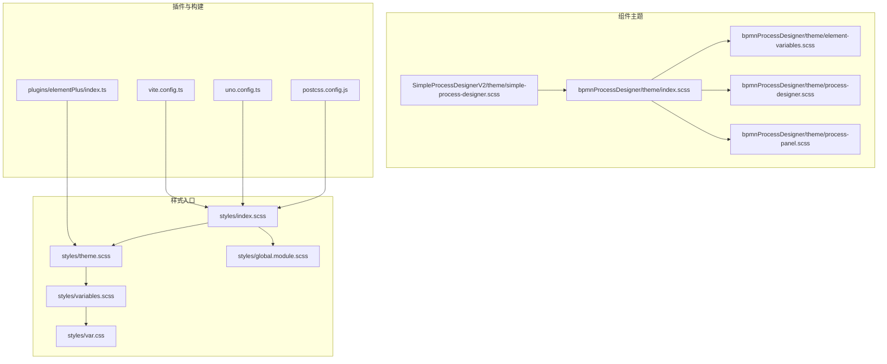
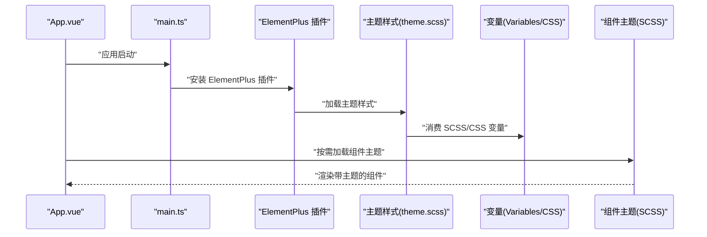
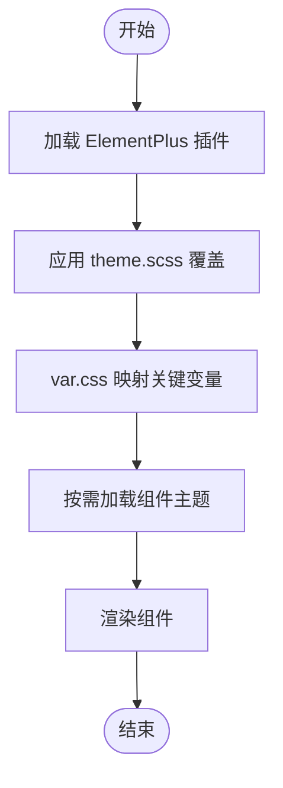
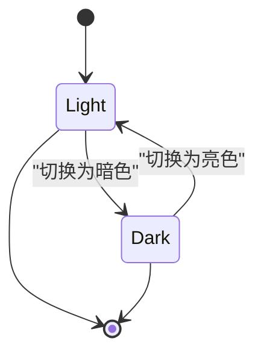
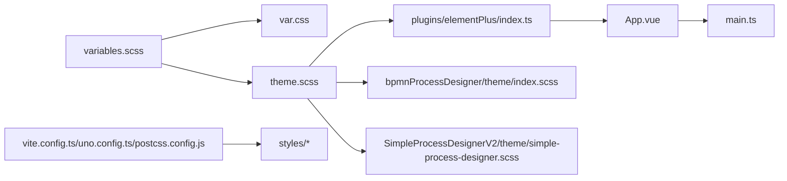

# 组件样式定制

<cite>
**本文引用的文件**
- [styles/index.scss](file://yudao-ui/yudao-ui-admin-vue3/src/styles/index.scss)
- [styles/theme.scss](file://yudao-ui/yudao-ui-admin-vue3/src/styles/theme.scss)
- [styles/variables.scss](file://yudao-ui/yudao-ui-admin-vue3/src/styles/variables.scss)
- [styles/var.css](file://yudao-ui/yudao-ui-admin-vue3/src/styles/var.css)
- [styles/global.module.scss](file://yudao-ui/yudao-ui-admin-vue3/src/styles/global.module.scss)
- [components/bpmnProcessDesigner/package/theme/index.scss](file://yudao-ui/yudao-ui-admin-vue3/src/components/bpmnProcessDesigner/package/theme/index.scss)
- [components/bpmnProcessDesigner/package/theme/element-variables.scss](file://yudao-ui/yudao-ui-admin-vue3/src/components/bpmnProcessDesigner/package/theme/element-variables.scss)
- [components/bpmnProcessDesigner/package/theme/process-designer.scss](file://yudao-ui/yudao-ui-admin-vue3/src/components/bpmnProcessDesigner/package/theme/process-designer.scss)
- [components/bpmnProcessDesigner/package/theme/process-panel.scss](file://yudao-ui/yudao-ui-admin-vue3/src/components/bpmnProcessDesigner/package/theme/process-panel.scss)
- [components/SimpleProcessDesignerV2/theme/simple-process-designer.scss](file://yudao-ui/yudao-ui-admin-vue3/src/components/SimpleProcessDesignerV2/theme/simple-process-designer.scss)
- [plugins/elementPlus/index.ts](file://yudao-ui/yudao-ui-admin-vue3/src/plugins/elementPlus/index.ts)
- [vite.config.ts](file://yudao-ui/yudao-ui-admin-vue3/vite.config.ts)
- [uno.config.ts](file://yudao-ui/yudao-ui-admin-vue3/uno.config.ts)
- [postcss.config.js](file://yudao-ui/yudao-ui-admin-vue3/postcss.config.js)
- [App.vue](file://yudao-ui/yudao-ui-admin-vue3/src/App.vue)
- [main.ts](file://yudao-ui/yudao-ui-admin-vue3/src/main.ts)
- [types/theme.d.ts](file://yudao-ui/yudao-ui-admin-vue3/src/types/theme.d.ts)
- [utils/color.ts](file://yudao-ui/yudao-ui-admin-vue3/src/utils/color.ts)
- [hooks/web/useWeb.ts](file://yudao-ui/yudao-ui-admin-vue3/src/hooks/web/useWeb.ts)
</cite>

## 目录
1. [简介](#简介)
2. [项目结构](#项目结构)
3. [核心组件](#核心组件)
4. [架构总览](#架构总览)
5. [详细组件分析](#详细组件分析)
6. [依赖关系分析](#依赖关系分析)
7. [性能考虑](#性能考虑)
8. [故障排查指南](#故障排查指南)
9. [结论](#结论)
10. [附录](#附录)

## 简介
本指南面向 Vue 3 组件样式定制与主题化需求，结合项目现有实现，系统讲解以下内容：
- 样式作用域与隔离：scoped CSS 的使用边界与注意事项
- 模块化样式：CSS Modules 的组织方式与命名规范
- CSS 变量体系：全局变量与主题变量的声明与消费
- Element Plus 主题定制与样式覆盖：基于变量覆盖与按需引入的策略
- SCSS 预处理：变量、混合器、嵌套与模块化组织
- 响应式设计与断点：统一断点配置与媒体查询实践
- 暗黑模式与主题切换：状态管理与动态注入方案
- 性能优化：打包体积、运行时开销与缓存策略
- 调试工具与最佳实践：开发期定位与生产期验证

## 项目结构
样式相关资源主要集中在以下位置：
- 全局样式入口与主题：src/styles
- 组件级主题与样式：src/components/*/theme/*.scss
- Element Plus 插件与主题注入：src/plugins/elementPlus
- 构建配置：vite.config.ts、uno.config.ts、postcss.config.js
- 应用入口：src/App.vue、src/main.ts
- 类型定义：src/types/theme.d.ts
- 工具函数：src/utils/color.ts、src/hooks/web/useWeb.ts

**图表来源**
- [styles/index.scss:1-200](file://yudao-ui/yudao-ui-admin-vue3/src/styles/index.scss#L1-L200)
- [styles/theme.scss:1-200](file://yudao-ui/yudao-ui-admin-vue3/src/styles/theme.scss#L1-L200)
- [styles/variables.scss:1-200](file://yudao-ui/yudao-ui-admin-vue3/src/styles/variables.scss#L1-L200)
- [styles/var.css:1-200](file://yudao-ui/yudao-ui-admin-vue3/src/styles/var.css#L1-L200)
- [styles/global.module.scss:1-200](file://yudao-ui/yudao-ui-admin-vue3/src/styles/global.module.scss#L1-L200)
- [components/bpmnProcessDesigner/package/theme/index.scss:1-200](file://yudao-ui/yudao-ui-admin-vue3/src/components/bpmnProcessDesigner/package/theme/index.scss#L1-L200)
- [components/bpmnProcessDesigner/package/theme/element-variables.scss:1-200](file://yudao-ui/yudao-ui-admin-vue3/src/components/bpmnProcessDesigner/package/theme/element-variables.scss#L1-L200)
- [components/bpmnProcessDesigner/package/theme/process-designer.scss:1-200](file://yudao-ui/yudao-ui-admin-vue3/src/components/bpmnProcessDesigner/package/theme/process-designer.scss#L1-L200)
- [components/bpmnProcessDesigner/package/theme/process-panel.scss:1-200](file://yudao-ui/yudao-ui-admin-vue3/src/components/bpmnProcessDesigner/package/theme/process-panel.scss#L1-L200)
- [components/SimpleProcessDesignerV2/theme/simple-process-designer.scss:1-200](file://yudao-ui/yudao-ui-admin-vue3/src/components/SimpleProcessDesignerV2/theme/simple-process-designer.scss#L1-L200)
- [plugins/elementPlus/index.ts:1-200](file://yudao-ui/yudao-ui-admin-vue3/src/plugins/elementPlus/index.ts#L1-L200)
- [vite.config.ts:1-200](file://yudao-ui/yudao-ui-admin-vue3/vite.config.ts#L1-L200)
- [uno.config.ts:1-200](file://yudao-ui/yudao-ui-admin-vue3/uno.config.ts#L1-L200)
- [postcss.config.js:1-200](file://yudao-ui/yudao-ui-admin-vue3/postcss.config.js#L1-L200)

**章节来源**
- [styles/index.scss:1-200](file://yudao-ui/yudao-ui-admin-vue3/src/styles/index.scss#L1-L200)
- [styles/theme.scss:1-200](file://yudao-ui/yudao-ui-admin-vue3/src/styles/theme.scss#L1-L200)
- [styles/variables.scss:1-200](file://yudao-ui/yudao-ui-admin-vue3/src/styles/variables.scss#L1-L200)
- [styles/var.css:1-200](file://yudao-ui/yudao-ui-admin-vue3/src/styles/var.css#L1-L200)
- [styles/global.module.scss:1-200](file://yudao-ui/yudao-ui-admin-vue3/src/styles/global.module.scss#L1-L200)
- [components/bpmnProcessDesigner/package/theme/index.scss:1-200](file://yudao-ui/yudao-ui-admin-vue3/src/components/bpmnProcessDesigner/package/theme/index.scss#L1-L200)
- [components/bpmnProcessDesigner/package/theme/element-variables.scss:1-200](file://yudao-ui/yudao-ui-admin-vue3/src/components/bpmnProcessDesigner/package/theme/element-variables.scss#L1-L200)
- [components/bpmnProcessDesigner/package/theme/process-designer.scss:1-200](file://yudao-ui/yudao-ui-admin-vue3/src/components/bpmnProcessDesigner/package/theme/process-designer.scss#L1-L200)
- [components/bpmnProcessDesigner/package/theme/process-panel.scss:1-200](file://yudao-ui/yudao-ui-admin-vue3/src/components/bpmnProcessDesigner/package/theme/process-panel.scss#L1-L200)
- [components/SimpleProcessDesignerV2/theme/simple-process-designer.scss:1-200](file://yudao-ui/yudao-ui-admin-vue3/src/components/SimpleProcessDesignerV2/theme/simple-process-designer.scss#L1-L200)
- [plugins/elementPlus/index.ts:1-200](file://yudao-ui/yudao-ui-admin-vue3/src/plugins/elementPlus/index.ts#L1-L200)
- [vite.config.ts:1-200](file://yudao-ui/yudao-ui-admin-vue3/vite.config.ts#L1-L200)
- [uno.config.ts:1-200](file://yudao-ui/yudao-ui-admin-vue3/uno.config.ts#L1-L200)
- [postcss.config.js:1-200](file://yudao-ui/yudao-ui-admin-vue3/postcss.config.js#L1-L200)

## 核心组件
- 全局样式入口与主题：通过 styles/index.scss 导入全局样式与主题变量，作为应用样式初始化的根入口。
- 主题变量与 CSS 变量：styles/variables.scss 定义 SCSS 变量，styles/var.css 将关键变量映射为 CSS 变量，供运行时动态切换。
- Element Plus 主题：通过 plugins/elementPlus/index.ts 注入主题配置，并在 styles/theme.scss 中进行覆盖。
- 组件主题：如 bpmnProcessDesigner 与 SimpleProcessDesignerV2 提供独立的主题文件，采用 SCSS 模块化组织。
- 构建与工具链：vite.config.ts、uno.config.ts、postcss.config.js 配合完成样式预处理与后处理。

**章节来源**
- [styles/index.scss:1-200](file://yudao-ui/yudao-ui-admin-vue3/src/styles/index.scss#L1-L200)
- [styles/theme.scss:1-200](file://yudao-ui/yudao-ui-admin-vue3/src/styles/theme.scss#L1-L200)
- [styles/variables.scss:1-200](file://yudao-ui/yudao-ui-admin-vue3/src/styles/variables.scss#L1-L200)
- [styles/var.css:1-200](file://yudao-ui/yudao-ui-admin-vue3/src/styles/var.css#L1-L200)
- [plugins/elementPlus/index.ts:1-200](file://yudao-ui/yudao-ui-admin-vue3/src/plugins/elementPlus/index.ts#L1-L200)

## 架构总览
下图展示从应用入口到样式系统的整体流程，包括主题注入、变量映射与组件主题加载：

**图表来源**
- [App.vue:1-200](file://yudao-ui/yudao-ui-admin-vue3/src/App.vue#L1-L200)
- [main.ts:1-200](file://yudao-ui/yudao-ui-admin-vue3/src/main.ts#L1-L200)
- [plugins/elementPlus/index.ts:1-200](file://yudao-ui/yudao-ui-admin-vue3/src/plugins/elementPlus/index.ts#L1-L200)
- [styles/theme.scss:1-200](file://yudao-ui/yudao-ui-admin-vue3/src/styles/theme.scss#L1-L200)
- [styles/variables.scss:1-200](file://yudao-ui/yudao-ui-admin-vue3/src/styles/variables.scss#L1-L200)
- [styles/var.css:1-200](file://yudao-ui/yudao-ui-admin-vue3/src/styles/var.css#L1-L200)
- [components/bpmnProcessDesigner/package/theme/index.scss:1-200](file://yudao-ui/yudao-ui-admin-vue3/src/components/bpmnProcessDesigner/package/theme/index.scss#L1-L200)

## 详细组件分析

### 全局样式与主题入口
- styles/index.scss：集中导入全局样式与主题，确保应用启动时一次性加载。
- styles/theme.scss：定义主题变量覆盖与 Element Plus 组件的样式重置。
- styles/variables.scss：定义 SCSS 变量，用于颜色、尺寸、间距等基础值。
- styles/var.css：将关键变量映射为 CSS 变量，便于运行时切换（如暗黑模式）。
- styles/global.module.scss：提供 CSS Modules 的全局样式模块，避免命名冲突。

建议：
- 将所有主题变量收敛至 variables.scss，var.css 仅做最终映射。
- 在 theme.scss 中使用变量覆盖而非硬编码颜色，保证一致性。

**章节来源**
- [styles/index.scss:1-200](file://yudao-ui/yudao-ui-admin-vue3/src/styles/index.scss#L1-L200)
- [styles/theme.scss:1-200](file://yudao-ui/yudao-ui-admin-vue3/src/styles/theme.scss#L1-L200)
- [styles/variables.scss:1-200](file://yudao-ui/yudao-ui-admin-vue3/src/styles/variables.scss#L1-L200)
- [styles/var.css:1-200](file://yudao-ui/yudao-ui-admin-vue3/src/styles/var.css#L1-L200)
- [styles/global.module.scss:1-200](file://yudao-ui/yudao-ui-admin-vue3/src/styles/global.module.scss#L1-L200)

### Element Plus 主题定制与样式覆盖
- 插件注入：plugins/elementPlus/index.ts 安装 Element Plus 并传入主题配置。
- 主题覆盖：styles/theme.scss 通过变量覆盖实现主题定制。
- 组件主题：bpmnProcessDesigner 与 SimpleProcessDesignerV2 提供独立主题文件，按需加载。

最佳实践：
- 使用 variables.scss 定义主题色板，通过 theme.scss 进行覆盖。
- 避免直接修改第三方组件样式，优先使用官方提供的变量或类名。
- 组件主题文件采用模块化命名，避免全局污染。

**图表来源**
- [plugins/elementPlus/index.ts:1-200](file://yudao-ui/yudao-ui-admin-vue3/src/plugins/elementPlus/index.ts#L1-L200)
- [styles/theme.scss:1-200](file://yudao-ui/yudao-ui-admin-vue3/src/styles/theme.scss#L1-L200)
- [styles/var.css:1-200](file://yudao-ui/yudao-ui-admin-vue3/src/styles/var.css#L1-L200)
- [components/bpmnProcessDesigner/package/theme/index.scss:1-200](file://yudao-ui/yudao-ui-admin-vue3/src/components/bpmnProcessDesigner/package/theme/index.scss#L1-L200)

**章节来源**
- [plugins/elementPlus/index.ts:1-200](file://yudao-ui/yudao-ui-admin-vue3/src/plugins/elementPlus/index.ts#L1-L200)
- [styles/theme.scss:1-200](file://yudao-ui/yudao-ui-admin-vue3/src/styles/theme.scss#L1-L200)
- [styles/var.css:1-200](file://yudao-ui/yudao-ui-admin-vue3/src/styles/var.css#L1-L200)
- [components/bpmnProcessDesigner/package/theme/index.scss:1-200](file://yudao-ui/yudao-ui-admin-vue3/src/components/bpmnProcessDesigner/package/theme/index.scss#L1-L200)

### SCSS 预处理与模块化组织
- 变量：variables.scss 定义颜色、字体、间距、圆角等基础变量。
- 混合器：可在 SCSS 文件中定义通用样式片段，提升复用性。
- 嵌套：合理使用嵌套减少重复选择器，但避免过深嵌套导致权重过高。
- 模块化：每个组件拥有独立的 theme/*.scss 文件，按需导入，降低耦合。

命名规范建议：
- 组件主题文件以组件名命名，如 simple-process-designer.scss。
- 类名采用 BEM 或功能前缀，避免全局冲突。
- 变量命名语义化，如 $color-primary、$spacing-base。

**章节来源**
- [styles/variables.scss:1-200](file://yudao-ui/yudao-ui-admin-vue3/src/styles/variables.scss#L1-L200)
- [components/bpmnProcessDesigner/package/theme/index.scss:1-200](file://yudao-ui/yudao-ui-admin-vue3/src/components/bpmnProcessDesigner/package/theme/index.scss#L1-L200)
- [components/SimpleProcessDesignerV2/theme/simple-process-designer.scss:1-200](file://yudao-ui/yudao-ui-admin-vue3/src/components/SimpleProcessDesignerV2/theme/simple-process-designer.scss#L1-L200)

### 响应式设计与断点设置
- 断点配置：在 variables.scss 中集中定义断点，如移动端、平板、桌面端。
- 媒体查询：在主题与组件主题中使用统一断点，避免散落的像素值。
- 移动优先：优先编写基础样式，再通过媒体查询增强大屏体验。

**章节来源**
- [styles/variables.scss:1-200](file://yudao-ui/yudao-ui-admin-vue3/src/styles/variables.scss#L1-L200)
- [styles/theme.scss:1-200](file://yudao-ui/yudao-ui-admin-vue3/src/styles/theme.scss#L1-L200)

### 暗黑模式与主题切换
- CSS 变量映射：var.css 将主题变量映射为 CSS 变量，便于运行时切换。
- 切换逻辑：hooks/web/useWeb.ts 或 store 中维护当前主题状态，动态更新 CSS 变量。
- 颜色工具：utils/color.ts 提供颜色计算与对比度判断，辅助生成暗色系配色。

**图表来源**
- [styles/var.css:1-200](file://yudao-ui/yudao-ui-admin-vue3/src/styles/var.css#L1-L200)
- [hooks/web/useWeb.ts:1-200](file://yudao-ui/yudao-ui-admin-vue3/src/hooks/web/useWeb.ts#L1-L200)
- [utils/color.ts:1-200](file://yudao-ui/yudao-ui-admin-vue3/src/utils/color.ts#L1-L200)

**章节来源**
- [styles/var.css:1-200](file://yudao-ui/yudao-ui-admin-vue3/src/styles/var.css#L1-L200)
- [hooks/web/useWeb.ts:1-200](file://yudao-ui/yudao-ui-admin-vue3/src/hooks/web/useWeb.ts#L1-L200)
- [utils/color.ts:1-200](file://yudao-ui/yudao-ui-admin-vue3/src/utils/color.ts#L1-L200)

### CSS Modules 与 scoped CSS
- CSS Modules：global.module.scss 提供模块化样式，避免类名冲突，适合全局通用样式。
- scoped CSS：在 Vue SFC 中使用 scoped 属性隔离样式，注意深度选择器与 !important 的使用场景。
- 命名规范：推荐使用功能前缀或 BEM，配合 CSS Modules 提升可维护性。

**章节来源**
- [styles/global.module.scss:1-200](file://yudao-ui/yudao-ui-admin-vue3/src/styles/global.module.scss#L1-L200)
- [App.vue:1-200](file://yudao-ui/yudao-ui-admin-vue3/src/App.vue#L1-L200)

## 依赖关系分析
样式系统的关键依赖关系如下：

**图表来源**
- [styles/variables.scss:1-200](file://yudao-ui/yudao-ui-admin-vue3/src/styles/variables.scss#L1-L200)
- [styles/var.css:1-200](file://yudao-ui/yudao-ui-admin-vue3/src/styles/var.css#L1-L200)
- [styles/theme.scss:1-200](file://yudao-ui/yudao-ui-admin-vue3/src/styles/theme.scss#L1-L200)
- [plugins/elementPlus/index.ts:1-200](file://yudao-ui/yudao-ui-admin-vue3/src/plugins/elementPlus/index.ts#L1-L200)
- [App.vue:1-200](file://yudao-ui/yudao-ui-admin-vue3/src/App.vue#L1-L200)
- [main.ts:1-200](file://yudao-ui/yudao-ui-admin-vue3/src/main.ts#L1-L200)
- [components/bpmnProcessDesigner/package/theme/index.scss:1-200](file://yudao-ui/yudao-ui-admin-vue3/src/components/bpmnProcessDesigner/package/theme/index.scss#L1-L200)
- [components/SimpleProcessDesignerV2/theme/simple-process-designer.scss:1-200](file://yudao-ui/yudao-ui-admin-vue3/src/components/SimpleProcessDesignerV2/theme/simple-process-designer.scss#L1-L200)
- [vite.config.ts:1-200](file://yudao-ui/yudao-ui-admin-vue3/vite.config.ts#L1-L200)
- [uno.config.ts:1-200](file://yudao-ui/yudao-ui-admin-vue3/uno.config.ts#L1-L200)
- [postcss.config.js:1-200](file://yudao-ui/yudao-ui-admin-vue3/postcss.config.js#L1-L200)

**章节来源**
- [styles/variables.scss:1-200](file://yudao-ui/yudao-ui-admin-vue3/src/styles/variables.scss#L1-L200)
- [styles/var.css:1-200](file://yudao-ui/yudao-ui-admin-vue3/src/styles/var.css#L1-L200)
- [styles/theme.scss:1-200](file://yudao-ui/yudao-ui-admin-vue3/src/styles/theme.scss#L1-L200)
- [plugins/elementPlus/index.ts:1-200](file://yudao-ui/yudao-ui-admin-vue3/src/plugins/elementPlus/index.ts#L1-L200)
- [App.vue:1-200](file://yudao-ui/yudao-ui-admin-vue3/src/App.vue#L1-L200)
- [main.ts:1-200](file://yudao-ui/yudao-ui-admin-vue3/src/main.ts#L1-L200)
- [components/bpmnProcessDesigner/package/theme/index.scss:1-200](file://yudao-ui/yudao-ui-admin-vue3/src/components/bpmnProcessDesigner/package/theme/index.scss#L1-L200)
- [components/SimpleProcessDesignerV2/theme/simple-process-designer.scss:1-200](file://yudao-ui/yudao-ui-admin-vue3/src/components/SimpleProcessDesignerV2/theme/simple-process-designer.scss#L1-L200)
- [vite.config.ts:1-200](file://yudao-ui/yudao-ui-admin-vue3/vite.config.ts#L1-L200)
- [uno.config.ts:1-200](file://yudao-ui/yudao-ui-admin-vue3/uno.config.ts#L1-L200)
- [postcss.config.js:1-200](file://yudao-ui/yudao-ui-admin-vue3/postcss.config.js#L1-L200)

## 性能考虑
- 打包体积控制
  - 合理拆分主题文件，按需加载组件主题，避免一次性引入过多样式。
  - 使用 UnoCSS 的原子化能力减少重复样式，降低体积。
- 运行时性能
  - CSS 变量切换比全量替换样式更高效，尽量使用 var.css 的变量映射。
  - 避免深层嵌套与过度使用 !important，减少样式计算复杂度。
- 缓存策略
  - 构建时启用 CSS 分离与压缩，确保缓存命中率。
  - 对第三方组件样式进行按需引入，避免冗余。

[本节为通用指导，无需列出具体文件来源]

## 故障排查指南
- 主题不生效
  - 检查 theme.scss 是否正确导入 variables.scss 与 var.css。
  - 确认 Element Plus 插件是否在 main.ts 中正确安装。
- 变量未生效
  - 确认 var.css 中的 CSS 变量已在 DOM 上生效，检查运行时样式表。
  - 检查 hooks/web/useWeb.ts 或 store 中的主题状态是否正确更新。
- 组件主题冲突
  - 检查组件主题文件是否被正确按需引入。
  - 使用 scoped 或 CSS Modules 隔离样式，避免全局污染。
- 响应式异常
  - 统一使用 variables.scss 中的断点，避免散落的像素值。
  - 检查媒体查询顺序与优先级。

**章节来源**
- [styles/theme.scss:1-200](file://yudao-ui/yudao-ui-admin-vue3/src/styles/theme.scss#L1-L200)
- [styles/var.css:1-200](file://yudao-ui/yudao-ui-admin-vue3/src/styles/var.css#L1-L200)
- [plugins/elementPlus/index.ts:1-200](file://yudao-ui/yudao-ui-admin-vue3/src/plugins/elementPlus/index.ts#L1-L200)
- [hooks/web/useWeb.ts:1-200](file://yudao-ui/yudao-ui-admin-vue3/src/hooks/web/useWeb.ts#L1-L200)

## 结论
本项目通过“变量—主题—插件—组件”的层次化结构实现了灵活且可维护的样式系统。建议在后续迭代中：
- 统一断点与命名规范，强化 SCSS 模块化组织。
- 逐步完善暗黑模式的自动化配色与对比度检测。
- 持续监控打包体积与运行时性能，保持样式系统的轻量化与高可用。

[本节为总结性内容，无需列出具体文件来源]

## 附录
- 类型定义：types/theme.d.ts 提供主题相关类型，便于 TS 开发期约束。
- 工具函数：utils/color.ts 与 hooks/web/useWeb.ts 提供颜色与主题切换的辅助能力。

**章节来源**
- [types/theme.d.ts:1-200](file://yudao-ui/yudao-ui-admin-vue3/src/types/theme.d.ts#L1-L200)
- [utils/color.ts:1-200](file://yudao-ui/yudao-ui-admin-vue3/src/utils/color.ts#L1-L200)
- [hooks/web/useWeb.ts:1-200](file://yudao-ui/yudao-ui-admin-vue3/src/hooks/web/useWeb.ts#L1-L200)