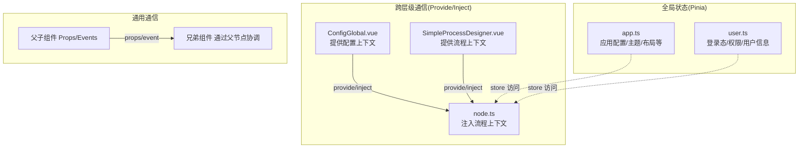
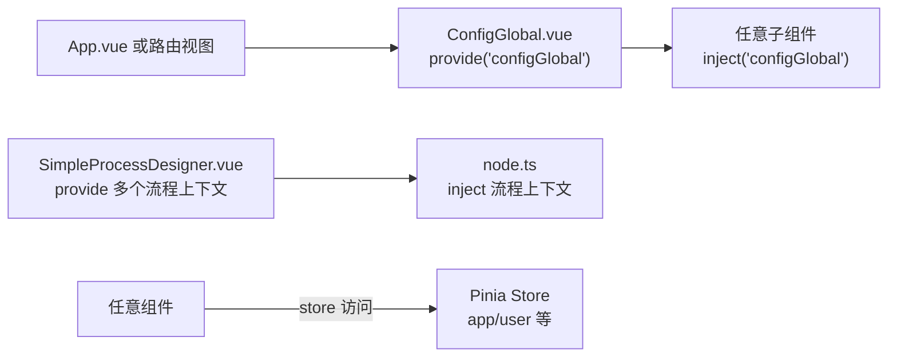
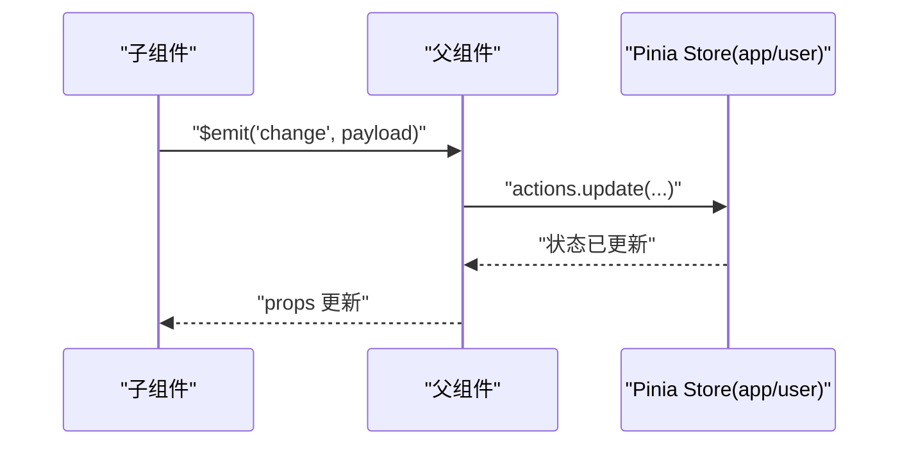
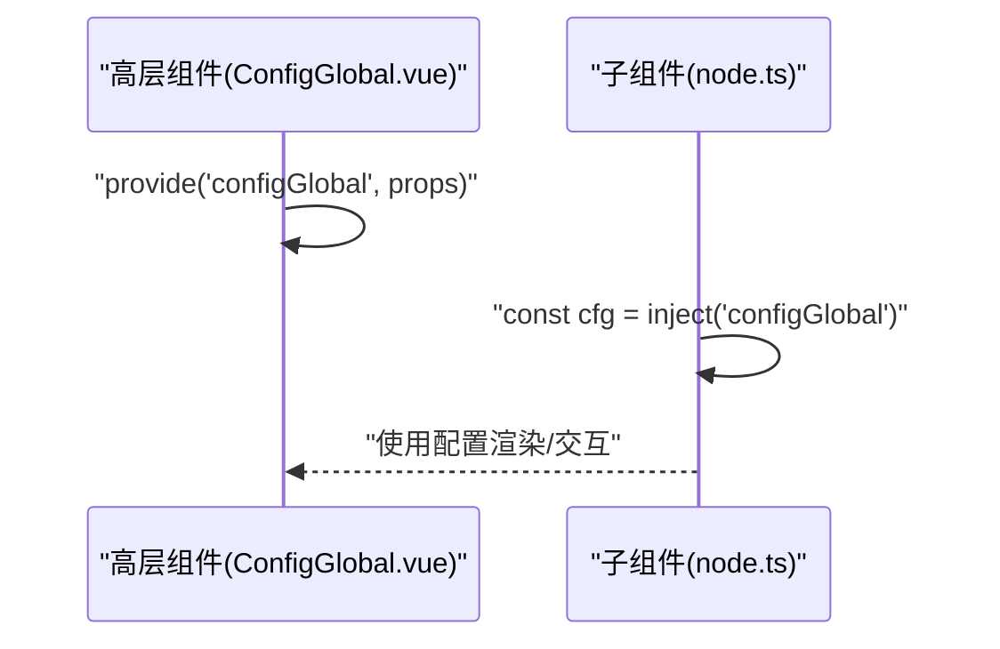
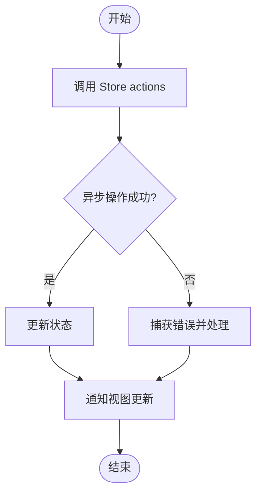
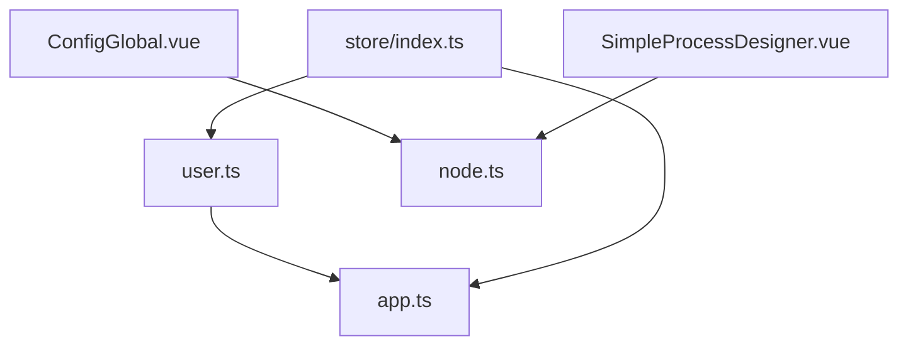

# 组件通信模式

<cite>
**本文引用的文件**
- [src/store/index.ts](file://yudao-ui/yudao-ui-admin-vue3/src/store/index.ts)
- [src/store/modules/app.ts](file://yudao-ui/yudao-ui-admin-vue3/src/store/modules/app.ts)
- [src/store/modules/user.ts](file://yudao-ui/yudao-ui-admin-vue3/src/store/modules/user.ts)
- [src/components/ConfigGlobal/src/ConfigGlobal.vue](file://yudao-ui/yudao-ui-admin-vue3/src/components/ConfigGlobal/src/ConfigGlobal.vue)
- [src/components/SimpleProcessDesignerV2/src/SimpleProcessDesigner.vue](file://yudao-ui/yudao-ui-admin-vue3/src/components/SimpleProcessDesignerV2/src/SimpleProcessDesigner.vue)
- [src/components/SimpleProcessDesignerV2/src/node.ts](file://yudao-ui/yudao-ui-admin-vue3/src/components/SimpleProcessDesignerV2/src/node.ts)
- [src/components/DiyEditor/index.vue](file://yudao-ui/yudao-ui-admin-vue3/src/components/DiyEditor/index.vue)
- [src/hooks/web/useConfigGlobal.ts](file://yudao-ui/yudao-ui-admin-vue3/src/hooks/web/useConfigGlobal.ts)
</cite>

## 目录
1. [引言](#引言)
2. [项目结构](#项目结构)
3. [核心组件](#核心组件)
4. [架构总览](#架构总览)
5. [详细组件分析](#详细组件分析)
6. [依赖分析](#依赖分析)
7. [性能考量](#性能考量)
8. [故障排查指南](#故障排查指南)
9. [结论](#结论)
10. [附录](#附录)

## 引言
本指南聚焦于 Vue 3 在本项目中的组件通信模式与最佳实践，涵盖父子通信（Props/Events）、兄弟通信（EventBus 替代：Provide/Inject）、跨层级通信（Provide/Inject）、以及全局状态（Pinia）。我们将结合仓库中的真实实现，给出选择策略、流程图示、性能与内存注意事项，并提供可复用的调试技巧。

## 项目结构
本项目前端基于 Vue 3 + TypeScript + Vite + Element Plus + Pinia。组件通信主要通过以下路径落地：
- 全局状态：Pinia Store（应用级共享）
- 跨层级通信：Vue Provide/Inject（配置注入、流程设计器上下文）
- 父子通信：Props/Events（通用）
- 兄弟通信：通过最近公共父节点或跨层注入（本仓库未直接使用集中式 EventBus）

图表来源
- [src/store/modules/app.ts:44-320](file://yudao-ui/yudao-ui-admin-vue3/src/store/modules/app.ts#L44-L320)
- [src/store/modules/user.ts:24-104](file://yudao-ui/yudao-ui-admin-vue3/src/store/modules/user.ts#L24-L104)
- [src/components/ConfigGlobal/src/ConfigGlobal.vue:1-66](file://yudao-ui/yudao-ui-admin-vue3/src/components/ConfigGlobal/src/ConfigGlobal.vue#L1-L66)
- [src/components/SimpleProcessDesignerV2/src/SimpleProcessDesigner.vue:100-120](file://yudao-ui/yudao-ui-admin-vue3/src/components/SimpleProcessDesignerV2/src/SimpleProcessDesigner.vue#L100-L120)
- [src/components/SimpleProcessDesignerV2/src/node.ts:50-210](file://yudao-ui/yudao-ui-admin-vue3/src/components/SimpleProcessDesignerV2/src/node.ts#L50-L210)

章节来源
- [src/store/index.ts:1-13](file://yudao-ui/yudao-ui-admin-vue3/src/store/index.ts#L1-L13)
- [src/store/modules/app.ts:44-320](file://yudao-ui/yudao-ui-admin-vue3/src/store/modules/app.ts#L44-L320)
- [src/store/modules/user.ts:24-104](file://yudao-ui/yudao-ui-admin-vue3/src/store/modules/user.ts#L24-L104)
- [src/components/ConfigGlobal/src/ConfigGlobal.vue:1-66](file://yudao-ui/yudao-ui-admin-vue3/src/components/ConfigGlobal/src/ConfigGlobal.vue#L1-L66)
- [src/components/SimpleProcessDesignerV2/src/SimpleProcessDesigner.vue:100-120](file://yudao-ui/yudao-ui-admin-vue3/src/components/SimpleProcessDesignerV2/src/SimpleProcessDesigner.vue#L100-L120)
- [src/components/SimpleProcessDesignerV2/src/node.ts:50-210](file://yudao-ui/yudao-ui-admin-vue3/src/components/SimpleProcessDesignerV2/src/node.ts#L50-L210)

## 核心组件
- Pinia Store 初始化与持久化插件注册
- 应用 Store（主题、布局、尺寸、标签页等）
- 用户 Store（登录态、角色/权限、用户信息）
- 配置全局组件（Provide/Inject 上下文）
- 流程设计器组件（Provide/Inject 流程上下文）
- 注入钩子（useConfigGlobal）

章节来源
- [src/store/index.ts:1-13](file://yudao-ui/yudao-ui-admin-vue3/src/store/index.ts#L1-L13)
- [src/store/modules/app.ts:44-320](file://yudao-ui/yudao-ui-admin-vue3/src/store/modules/app.ts#L44-L320)
- [src/store/modules/user.ts:24-104](file://yudao-ui/yudao-ui-admin-vue3/src/store/modules/user.ts#L24-L104)
- [src/components/ConfigGlobal/src/ConfigGlobal.vue:1-66](file://yudao-ui/yudao-ui-admin-vue3/src/components/ConfigGlobal/src/ConfigGlobal.vue#L1-L66)
- [src/hooks/web/useConfigGlobal.ts:1-10](file://yudao-ui/yudao-ui-admin-vue3/src/hooks/web/useConfigGlobal.ts#L1-L10)

## 架构总览
本项目采用“Pinia 全局状态 + Provide/Inject 跨层级注入”的组合策略：
- 全局状态：统一管理跨页面、跨组件的关键数据（如主题、布局、用户信息）
- 跨层级通信：通过 provide/inject 提供“配置上下文”和“流程上下文”，避免多层 props 下传
- 父子通信：通过 props 向下传递数据，通过事件向上反馈
- 兄弟通信：通过最近公共父节点协调，或在必要时引入更上层的注入

图表来源
- [src/components/ConfigGlobal/src/ConfigGlobal.vue:16-25](file://yudao-ui/yudao-ui-admin-vue3/src/components/ConfigGlobal/src/ConfigGlobal.vue#L16-L25)
- [src/components/SimpleProcessDesignerV2/src/SimpleProcessDesigner.vue:100-120](file://yudao-ui/yudao-ui-admin-vue3/src/components/SimpleProcessDesignerV2/src/SimpleProcessDesigner.vue#L100-L120)
- [src/components/SimpleProcessDesignerV2/src/node.ts:50-210](file://yudao-ui/yudao-ui-admin-vue3/src/components/SimpleProcessDesignerV2/src/node.ts#L50-L210)
- [src/store/modules/app.ts:44-320](file://yudao-ui/yudao-ui-admin-vue3/src/store/modules/app.ts#L44-L320)
- [src/store/modules/user.ts:24-104](file://yudao-ui/yudao-ui-admin-vue3/src/store/modules/user.ts#L24-L104)

## 详细组件分析

### 全局状态（Pinia）与父子通信
- 选择策略
  - 全局状态：当多个无关组件需要共享同一份数据且频繁更新时，优先使用 Pinia
  - 父子通信：当数据仅在父子关系内流转，且层级较浅时，使用 props/events
- 实现要点
  - Store 初始化与持久化插件注册
  - Store 内部定义 state/getters/actions，按模块拆分职责
  - 组件内通过 store 访问状态与触发动作
- 最佳实践
  - 单向数据流：组件仅通过 actions 修改状态，避免跨组件直接修改
  - 事件驱动：子组件通过 $emit 向上传递变更意图，父组件决定是否调用 actions
  - 分层解耦：将复杂逻辑封装在 actions 中，视图层保持简洁

图表来源
- [src/store/modules/app.ts:187-318](file://yudao-ui/yudao-ui-admin-vue3/src/store/modules/app.ts#L187-L318)
- [src/store/modules/user.ts:50-103](file://yudao-ui/yudao-ui-admin-vue3/src/store/modules/user.ts#L50-L103)

章节来源
- [src/store/index.ts:1-13](file://yudao-ui/yudao-ui-admin-vue3/src/store/index.ts#L1-L13)
- [src/store/modules/app.ts:44-320](file://yudao-ui/yudao-ui-admin-vue3/src/store/modules/app.ts#L44-L320)
- [src/store/modules/user.ts:24-104](file://yudao-ui/yudao-ui-admin-vue3/src/store/modules/user.ts#L24-L104)

### 跨层级通信（Provide/Inject）与兄弟通信
- 选择策略
  - 跨层级通信：当数据需要跨越多层组件而不想层层透传 props 时，使用 provide/inject
  - 兄弟通信：通过最近公共父节点协调，或在必要时在父节点注入统一上下文
- 实现要点
  - 在高层组件中 provide 多个上下文键（如配置、流程数据）
  - 子组件通过 inject 获取所需上下文，避免回调地狱
  - 可结合响应式 ref/computed 保证数据一致性
- 最佳实践
  - 明确上下文边界，避免过度注入导致“上帝对象”
  - 为注入值提供默认值与类型约束，提升健壮性
  - 在组件销毁前清理副作用，防止内存泄漏

图表来源
- [src/components/ConfigGlobal/src/ConfigGlobal.vue:16-25](file://yudao-ui/yudao-ui-admin-vue3/src/components/ConfigGlobal/src/ConfigGlobal.vue#L16-L25)
- [src/components/SimpleProcessDesignerV2/src/node.ts:50-70](file://yudao-ui/yudao-ui-admin-vue3/src/components/SimpleProcessDesignerV2/src/node.ts#L50-L70)

章节来源
- [src/components/ConfigGlobal/src/ConfigGlobal.vue:1-66](file://yudao-ui/yudao-ui-admin-vue3/src/components/ConfigGlobal/src/ConfigGlobal.vue#L1-L66)
- [src/components/SimpleProcessDesignerV2/src/SimpleProcessDesigner.vue:100-120](file://yudao-ui/yudao-ui-admin-vue3/src/components/SimpleProcessDesignerV2/src/SimpleProcessDesigner.vue#L100-L120)
- [src/components/SimpleProcessDesignerV2/src/node.ts:50-210](file://yudao-ui/yudao-ui-admin-vue3/src/components/SimpleProcessDesignerV2/src/node.ts#L50-L210)
- [src/hooks/web/useConfigGlobal.ts:1-10](file://yudao-ui/yudao-ui-admin-vue3/src/hooks/web/useConfigGlobal.ts#L1-L10)

### 异步通信与错误处理
- 异步处理
  - Store 中的 actions 可以封装异步请求，统一处理 loading、成功与失败
  - 组件在交互后触发 action，避免直接在视图层处理异步细节
- 错误处理
  - 在 action 内捕获异常，记录日志并反馈给用户
  - 对于可恢复的错误，提供重试或降级策略
  - 对于不可恢复的错误，引导用户回到稳定状态（如清空状态、跳转首页）

图表来源
- [src/store/modules/user.ts:50-103](file://yudao-ui/yudao-ui-admin-vue3/src/store/modules/user.ts#L50-L103)

章节来源
- [src/store/modules/user.ts:50-103](file://yudao-ui/yudao-ui-admin-vue3/src/store/modules/user.ts#L50-L103)

### 实际项目案例与调试技巧
- 案例一：配置全局组件
  - 通过 provide 注入配置上下文，子组件通过 inject 获取并使用
  - 结合窗口尺寸监听，动态调整布局与主题变量
- 案例二：流程设计器
  - 在设计器根组件提供流程上下文（表单字段、用户/部门选项、只读标记等）
  - 子节点通过 inject 获取上下文，减少 props 传递
- 调试技巧
  - 使用浏览器 Vue Devtools 观察组件树与状态变化
  - 在 provide/inject 的键名上添加注释，明确作用域
  - 对复杂异步 action 添加日志与超时保护，便于定位问题

章节来源
- [src/components/ConfigGlobal/src/ConfigGlobal.vue:1-66](file://yudao-ui/yudao-ui-admin-vue3/src/components/ConfigGlobal/src/ConfigGlobal.vue#L1-L66)
- [src/components/SimpleProcessDesignerV2/src/SimpleProcessDesigner.vue:100-120](file://yudao-ui/yudao-ui-admin-vue3/src/components/SimpleProcessDesignerV2/src/SimpleProcessDesigner.vue#L100-L120)
- [src/components/SimpleProcessDesignerV2/src/node.ts:50-210](file://yudao-ui/yudao-ui-admin-vue3/src/components/SimpleProcessDesignerV2/src/node.ts#L50-L210)
- [src/hooks/web/useConfigGlobal.ts:1-10](file://yudao-ui/yudao-ui-admin-vue3/src/hooks/web/useConfigGlobal.ts#L1-L10)

## 依赖分析
- 组件与 Store 的耦合
  - 组件通过 store 访问全局状态，降低跨层级依赖
  - Store 之间尽量保持无环依赖，必要时通过 getter 计算
- Provide/Inject 的边界
  - 注入键应集中在高层组件定义，避免散落各处
  - 子组件仅消费注入，不负责提供，保持单一职责
- 外部依赖
  - Pinia 作为状态容器，配合持久化插件提升体验
  - Element Plus 提供 UI 与配置能力，与 ConfigProvider 协同

图表来源
- [src/store/index.ts:1-13](file://yudao-ui/yudao-ui-admin-vue3/src/store/index.ts#L1-L13)
- [src/store/modules/app.ts:44-320](file://yudao-ui/yudao-ui-admin-vue3/src/store/modules/app.ts#L44-L320)
- [src/store/modules/user.ts:24-104](file://yudao-ui/yudao-ui-admin-vue3/src/store/modules/user.ts#L24-L104)
- [src/components/ConfigGlobal/src/ConfigGlobal.vue:1-66](file://yudao-ui/yudao-ui-admin-vue3/src/components/ConfigGlobal/src/ConfigGlobal.vue#L1-L66)
- [src/components/SimpleProcessDesignerV2/src/SimpleProcessDesigner.vue:100-120](file://yudao-ui/yudao-ui-admin-vue3/src/components/SimpleProcessDesignerV2/src/SimpleProcessDesigner.vue#L100-L120)
- [src/components/SimpleProcessDesignerV2/src/node.ts:50-210](file://yudao-ui/yudao-ui-admin-vue3/src/components/SimpleProcessDesignerV2/src/node.ts#L50-L210)

章节来源
- [src/store/index.ts:1-13](file://yudao-ui/yudao-ui-admin-vue3/src/store/index.ts#L1-L13)
- [src/store/modules/app.ts:44-320](file://yudao-ui/yudao-ui-admin-vue3/src/store/modules/app.ts#L44-L320)
- [src/store/modules/user.ts:24-104](file://yudao-ui/yudao-ui-admin-vue3/src/store/modules/user.ts#L24-L104)
- [src/components/ConfigGlobal/src/ConfigGlobal.vue:1-66](file://yudao-ui/yudao-ui-admin-vue3/src/components/ConfigGlobal/src/ConfigGlobal.vue#L1-L66)
- [src/components/SimpleProcessDesignerV2/src/SimpleProcessDesigner.vue:100-120](file://yudao-ui/yudao-ui-admin-vue3/src/components/SimpleProcessDesignerV2/src/SimpleProcessDesigner.vue#L100-L120)
- [src/components/SimpleProcessDesignerV2/src/node.ts:50-210](file://yudao-ui/yudao-ui-admin-vue3/src/components/SimpleProcessDesignerV2/src/node.ts#L50-L210)

## 性能考量
- 状态粒度
  - 将大对象拆分为细粒度状态，避免不必要的响应式开销
- 计算属性与 getters
  - 复杂计算放入 getters，利用缓存减少重复计算
- 注入范围
  - 仅在需要的层级提供注入，避免全局污染
- 异步优化
  - 对高频异步请求做节流/防抖与缓存
- 渲染优化
  - 合理使用 v-memo（若使用高版本）与 key 策略，减少重渲染

## 故障排查指南
- 症状：Provide/Inject 无法获取到值
  - 检查 provide/inject 的键名是否一致
  - 确认注入位置是否在 provide 的子树内
  - 为注入值设置默认值，避免空值导致的运行时错误
- 症状：状态更新后视图未刷新
  - 确保通过 actions 修改状态，而非直接赋值
  - 检查响应式包装（ref/reactive）是否正确
- 症状：内存泄漏
  - 在 onUnmounted 中清理定时器、订阅与事件监听
  - 避免在注入中持有大型对象的强引用
- 症状：异步错误未被捕获
  - 在 action 中包裹 try/catch 并记录错误
  - 对网络请求设置超时与重试策略

章节来源
- [src/components/ConfigGlobal/src/ConfigGlobal.vue:1-66](file://yudao-ui/yudao-ui-admin-vue3/src/components/ConfigGlobal/src/ConfigGlobal.vue#L1-L66)
- [src/components/SimpleProcessDesignerV2/src/node.ts:50-210](file://yudao-ui/yudao-ui-admin-vue3/src/components/SimpleProcessDesignerV2/src/node.ts#L50-L210)
- [src/store/modules/user.ts:50-103](file://yudao-ui/yudao-ui-admin-vue3/src/store/modules/user.ts#L50-L103)

## 结论
本项目通过 Pinia 与 Provide/Inject 的组合，实现了清晰、可维护的组件通信体系。对于简单父子关系使用 props/events，跨层级使用 provide/inject，全局共享使用 Pinia。配合单向数据流与事件驱动设计，能够有效降低耦合、提升可维护性与性能。实践中应重视注入边界、状态粒度与异步错误处理，确保系统稳定与可调试性。

## 附录
- 术语
  - Props/Events：父子组件之间的数据与事件传递
  - Provide/Inject：跨层级共享数据的机制
  - Pinia：Vue 官方推荐的状态管理库
- 参考实现路径
  - Store 初始化与持久化：[src/store/index.ts:1-13](file://yudao-ui/yudao-ui-admin-vue3/src/store/index.ts#L1-L13)
  - 应用 Store：[src/store/modules/app.ts:44-320](file://yudao-ui/yudao-ui-admin-vue3/src/store/modules/app.ts#L44-L320)
  - 用户 Store：[src/store/modules/user.ts:24-104](file://yudao-ui/yudao-ui-admin-vue3/src/store/modules/user.ts#L24-L104)
  - 配置全局组件（Provide/Inject）：[src/components/ConfigGlobal/src/ConfigGlobal.vue:1-66](file://yudao-ui/yudao-ui-admin-vue3/src/components/ConfigGlobal/src/ConfigGlobal.vue#L1-L66)
  - 流程设计器（Provide/Inject）：[src/components/SimpleProcessDesignerV2/src/SimpleProcessDesigner.vue:100-120](file://yudao-ui/yudao-ui-admin-vue3/src/components/SimpleProcessDesignerV2/src/SimpleProcessDesigner.vue#L100-L120)
  - 注入钩子：[src/hooks/web/useConfigGlobal.ts:1-10](file://yudao-ui/yudao-ui-admin-vue3/src/hooks/web/useConfigGlobal.ts#L1-L10)