# 自定义组件开发

<cite>
**本文引用的文件**
- [src/components/index.ts](file://yudao-ui/yudao-ui-admin-vue3/src/components/index.ts)
- [src/components/Form/src/Form.vue](file://yudao-ui/yudao-ui-admin-vue3/src/components/Form/src/Form.vue)
- [src/components/Dialog/src/Dialog.vue](file://yudao-ui/yudao-ui-admin-vue3/src/components/Dialog/src/Dialog.vue)
- [src/components/Table/src/Table.vue](file://yudao-ui/yudao-ui-admin-vue3/src/components/Table/src/Table.vue)
- [src/components/Backtop/src/Backtop.vue](file://yudao-ui/yudao-ui-admin-vue3/src/components/Backtop/src/Backtop.vue)
- [src/components/Descriptions/src/Descriptions.vue](file://yudao-ui/yudao-ui-admin-vue3/src/components/Descriptions/src/Descriptions.vue)
- [src/components/Descriptions/src/DescriptionsItemLabel.vue](file://yudao-ui/yudao-ui-admin-vue3/src/components/Descriptions/src/DescriptionsItemLabel.vue)
- [src/components/Icon/src/Icon.vue](file://yudao-ui/yudao-ui-admin-vue3/src/components/Icon/src/Icon.vue)
- [src/components/Icon/src/IconSelect.vue](file://yudao-ui/yudao-ui-admin-vue3/src/components/Icon/src/IconSelect.vue)
- [src/components/ConfigGlobal/src/ConfigGlobal.vue](file://yudao-ui/yudao-ui-admin-vue3/src/components/ConfigGlobal/src/ConfigGlobal.vue)
- [src/components/ContentWrap/src/ContentWrap.vue](file://yudao-ui/yudao-ui-admin-vue3/src/components/ContentWrap/src/ContentWrap.vue)
- [src/components/ContentDetailWrap/src/ContentDetailWrap.vue](file://yudao-ui/yudao-ui-admin-vue3/src/components/ContentDetailWrap/src/ContentDetailWrap.vue)
- [src/components/JsonEditor/index.ts](file://yudao-ui/yudao-ui-admin-vue3/src/components/JsonEditor/index.ts)
- [src/components/JsonEditor/src/JsonEditor.vue](file://yudao-ui/yudao-ui-admin-vue3/src/components/JsonEditor/src/JsonEditor.vue)
- [src/components/UploadFile/src/index.ts](file://yudao-ui/yudao-ui-admin-vue3/src/components/UploadFile/src/index.ts)
- [src/components/UploadFile/src/UploadFile.vue](file://yudao-ui/yudao-ui-admin-vue3/src/components/UploadFile/src/UploadFile.vue)
- [src/components/CountTo/src/CountTo.vue](file://yudao-ui/yudao-ui-admin-vue3/src/components/CountTo/src/CountTo.vue)
- [src/components/Cropper/src/Cropper.vue](file://yudao-ui/yudao-ui-admin-vue3/src/components/Cropper/src/Cropper.vue)
- [src/components/Cropper/src/CopperModal.vue](file://yudao-ui/yudao-ui-admin-vue3/src/components/Cropper/src/CopperModal.vue)
- [src/components/Cropper/src/CropperAvatar.vue](file://yudao-ui/yudao-ui-admin-vue3/src/components/Cropper/src/CropperAvatar.vue)
- [src/components/Crontab/src/Crontab.vue](file://yudao-ui/yudao-ui-admin-vue3/src/components/Crontab/src/Crontab.vue)
- [src/components/Echart/src/Echart.vue](file://yudao-ui/yudao-ui-admin-vue3/src/components/Echart/src/Echart.vue)
- [src/components/Editor/src/Editor.vue](file://yudao-ui/yudao-ui-admin-vue3/src/components/Editor/src/Editor.vue)
- [src/components/Error/src/Error.vue](file://yudao-ui/yudao-ui-admin-vue3/src/components/Error/src/Error.vue)
- [src/components/Highlight/src/Highlight.vue](file://yudao-ui/yudao-ui-admin-vue3/src/components/Highlight/src/Highlight.vue)
- [src/components/IFrame/src/IFrame.vue](file://yudao-ui/yudao-ui-admin-vue3/src/components/IFrame/src/IFrame.vue)
- [src/components/ImageViewer/src/ImageViewer.vue](file://yudao-ui/yudao-ui-admin-vue3/src/components/ImageViewer/src/ImageViewer.vue)
- [src/components/Infotip/src/Infotip.vue](file://yudao-ui/yudao-ui-admin-vue3/src/components/Infotip/src/Infotip.vue)
- [src/components/InputPassword/src/InputPassword.vue](file://yudao-ui/yudao-ui-admin-vue3/src/components/InputPassword/src/InputPassword.vue)
- [src/components/InputWithColor/index.vue](file://yudao-ui/yudao-ui-admin-vue3/src/components/InputWithColor/index.vue)
- [src/components/MarkdownView/index.vue](file://yudao-ui/yudao-ui-admin-vue3/src/components/MarkdownView/index.vue)
- [src/components/Pagination/index.vue](file://yudao-ui/yudao-ui-admin-vue3/src/components/Pagination/index.vue)
- [src/components/Qrcode/src/Qrcode.vue](file://yudao-ui/yudao-ui-admin-vue3/src/components/Qrcode/src/Qrcode.vue)
- [src/components/RouterSearch/index.vue](file://yudao-ui/yudao-ui-admin-vue3/src/components/RouterSearch/index.vue)
- [src/components/Search/src/Search.vue](file://yudao-ui/yudao-ui-admin-vue3/src/components/Search/src/Search.vue)
- [src/components/ShortcutDateRangePicker/index.vue](file://yudao-ui/yudao-ui-admin-vue3/src/components/ShortcutDateRangePicker/index.vue)
- [src/components/Sticky/src/Sticky.vue](file://yudao-ui/yudao-ui-admin-vue3/src/components/Sticky/src/Sticky.vue)
- [src/components/SummaryCard/index.vue](file://yudao-ui/yudao-ui-admin-vue3/src/components/SummaryCard/index.vue)
- [src/components/Tooltip/src/Tooltip.vue](file://yudao-ui/yudao-ui-admin-vue3/src/components/Tooltip/src/Tooltip.vue)
- [src/components/UserSelectForm/index.vue](file://yudao-ui/yudao-ui-admin-vue3/src/components/UserSelectForm/index.vue)
- [src/components/Verifition/src/Verifition.vue](file://yudao-ui/yudao-ui-admin-vue3/src/components/Verifition/src/Verifition.vue)
- [src/components/XButton/src/XButton.vue](file://yudao-ui/yudao-ui-admin-vue3/src/components/XButton/src/XButton.vue)
- [src/components/DiyEditor/index.vue](file://yudao-ui/yudao-ui-admin-vue3/src/components/DiyEditor/index.vue)
- [src/components/DiyEditor/components/ComponentContainer.vue](file://yudao-ui/yudao-ui-admin-vue3/src/components/DiyEditor/components/ComponentContainer.vue)
- [src/components/DiyEditor/components/ComponentContainerProperty.vue](file://yudao-ui/yudao-ui-admin-vue3/src/components/DiyEditor/components/ComponentContainerProperty.vue)
- [src/components/DiyEditor/components/ComponentLibrary.vue](file://yudao-ui/yudao-ui-admin-vue3/src/components/DiyEditor/components/ComponentLibrary.vue)
- [src/components/MagicCubeEditor/index.vue](file://yudao-ui/yudao-ui-admin-vue3/src/components/MagicCubeEditor/index.vue)
- [src/components/MagicCubeEditor/util.ts](file://yudao-ui/yudao-ui-admin-vue3/src/components/MagicCubeEditor/util.ts)
- [src/components/SimpleProcessDesignerV2/src/index.ts](file://yudao-ui/yudao-ui-admin-vue3/src/components/SimpleProcessDesignerV2/src/index.ts)
- [src/components/SimpleProcessDesignerV2/src/ProcessCanvas.vue](file://yudao-ui/yudao-ui-admin-vue3/src/components/SimpleProcessDesignerV2/src/ProcessCanvas.vue)
- [src/components/SimpleProcessDesignerV2/src/ProcessNode.vue](file://yudao-ui/yudao-ui-admin-vue3/src/components/SimpleProcessDesignerV2/src/ProcessNode.vue)
- [src/components/SimpleProcessDesignerV2/src/ProcessEdge.vue](file://yudao-ui/yudao-ui-admin-vue3/src/components/SimpleProcessDesignerV2/src/ProcessEdge.vue)
- [src/components/Tinyflow/Tinyflow.vue](file://yudao-ui/yudao-ui-admin-vue3/src/components/Tinyflow/Tinyflow.vue)
- [src/components/Tinyflow/ui/index.ts](file://yudao-ui/yudao-ui-admin-vue3/src/components/Tinyflow/ui/index.ts)
- [src/components/bpmnProcessDesigner/src/index.ts](file://yudao-ui/yudao-ui-admin-vue3/src/components/bpmnProcessDesigner/src/index.ts)
- [src/components/bpmnProcessDesigner/src/BpmnProcessDesigner.vue](file://yudao-ui/yudao-ui-admin-vue3/src/components/bpmnProcessDesigner/src/BpmnProcessDesigner.vue)
- [src/components/bpmnProcessDesigner/package/index.ts](file://yudao-ui/yudao-ui-admin-vue3/src/components/bpmnProcessDesigner/package/index.ts)
- [src/components/bpmnProcessDesigner/package/BpmnProcessDesigner.vue](file://yudao-ui/yudao-ui-admin-vue3/src/components/bpmnProcessDesigner/package/BpmnProcessDesigner.vue)
- [src/main.ts](file://yudao-ui/yudao-ui-admin-vue3/src/main.ts)
- [src/App.vue](file://yudao-ui/yudao-ui-admin-vue3/src/App.vue)
- [package.json](file://yudao-ui/yudao-ui-admin-vue3/package.json)
- [vite.config.ts](file://yudao-ui/yudao-ui-admin-vue3/vite.config.ts)
- [eslint.config.mjs](file://yudao-ui/yudao-ui-admin-vue3/eslint.config.mjs)
- [uno.config.ts](file://yudao-ui/yudao-ui-admin-vue3/uno.config.ts)
- [tsconfig.json](file://yudao-ui/yudao-ui-admin-vue3/tsconfig.json)
- [src/types/components.d.ts](file://yudao-ui/yudao-ui-admin-vue3/src/types/components.d.ts)
- [src/hooks/web/useFullscreen.ts](file://yudao-ui/yudao-ui-admin-vue3/src/hooks/web/useFullscreen.ts)
- [src/hooks/web/useScrollTo.ts](file://yudao-ui/yudao-ui-admin-vue3/src/hooks/web/useScrollTo.ts)
- [src/utils/propTypes.ts](file://yudao-ui/yudao-ui-admin-vue3/src/utils/propTypes.ts)
- [src/utils/tsxHelper.ts](file://yudao-ui/yudao-ui-admin-vue3/src/utils/tsxHelper.ts)
- [src/utils/formRules.ts](file://yudao-ui/yudao-ui-admin-vue3/src/utils/formRules.ts)
- [src/utils/url.ts](file://yudao-ui/yudao-ui-admin-vue3/src/utils/url.ts)
- [src/utils/tree.ts](file://yudao-ui/yudao-ui-admin-vue3/src/utils/tree.ts)
- [src/utils/is.ts](file://yudao-ui/yudao-ui-admin-vue3/src/utils/is.ts)
- [src/router/index.ts](file://yudao-ui/yudao-ui-admin-vue3/src/router/index.ts)
- [src/store/index.ts](file://yudao-ui/yudao-ui-admin-vue3/src/store/index.ts)
- [src/store/modules/app.ts](file://yudao-ui/yudao-ui-admin-vue3/src/store/modules/app.ts)
- [src/plugins/elementPlus/index.ts](file://yudao-ui/yudao-ui-admin-vue3/src/plugins/elementPlus/index.ts)
- [src/plugins/svgIcon/index.ts](file://yudao-ui/yudao-ui-admin-vue3/src/plugins/svgIcon/index.ts)
- [src/plugins/vueI18n/index.ts](file://yudao-ui/yudao-ui-admin-vue3/src/plugins/vueI18n/index.ts)
- [src/directives/permission/index.ts](file://yudao-ui/yudao-ui-admin-vue3/src/directives/permission/index.ts)
- [src/styles/global.module.scss](file://yudao-ui/yudao-ui-admin-vue3/src/styles/global.module.scss)
- [src/styles/theme.scss](file://yudao-ui/yudao-ui-admin-vue3/src/styles/theme.scss)
- [src/styles/var.css](file://yudao-ui/yudao-ui-admin-vue3/src/styles/var.css)
- [src/styles/variables.scss](file://yudao-ui/yudao-ui-admin-vue3/src/styles/variables.scss)
- [src/layout/Layout.vue](file://yudao-ui/yudao-ui-admin-vue3/src/layout/Layout.vue)
- [src/views/Home/Home.vue](file://yudao-ui/yudao-ui-admin-vue3/src/views/Home/Home.vue)
- [src/views/Error/404.vue](file://yudao-ui/yudao-ui-admin-vue3/src/views/Error/404.vue)
- [src/views/Login/Login.vue](file://yudao-ui/yudao-ui-admin-vue3/src/views/Login/Login.vue)
- [src/views/Profile/Profile.vue](file://yudao-ui/yudao-ui-admin-vue3/src/views/Profile/Profile.vue)
- [src/views/Redirect/Redirect.vue](file://yudao-ui/yudao-ui-admin-vue3/src/views/Redirect/Redirect.vue)
- [src/components/Form/src/types.ts](file://yudao-ui/yudao-ui-admin-vue3/src/components/Form/src/types.ts)
- [src/components/Form/src/helper.ts](file://yudao-ui/yudao-ui-admin-vue3/src/components/Form/src/helper.ts)
- [src/components/Form/src/componentMap.ts](file://yudao-ui/yudao-ui-admin-vue3/src/components/Form/src/componentMap.ts)
- [src/components/Icon/src/data.ts](file://yudao-ui/yudao-ui-admin-vue3/src/components/Icon/src/data.ts)
- [src/components/Map/src/MapDialog.vue](file://yudao-ui/yudao-ui-admin-vue3/src/components/Map/src/MapDialog.vue)
- [src/components/Map/src/utils.ts](file://yudao-ui/yudao-ui-admin-vue3/src/components/Map/src/utils.ts)
- [src/components/Cropper/src/types.ts](file://yudao-ui/yudao-ui-admin-vue3/src/components/Cropper/src/types.ts)
- [src/components/ImageViewer/src/types.ts](file://yudao-ui/yudao-ui-admin-vue3/src/components/ImageViewer/src/types.ts)
- [src/components/JsonEditor/types/index.ts](file://yudao-ui/yudao-ui-admin-vue3/src/components/JsonEditor/types/index.ts)
- [src/components/Descriptions/src/DescriptionsItemLabel.vue](file://yudao-ui/yudao-ui-admin-vue3/src/components/Descriptions/src/DescriptionsItemLabel.vue)
- [src/components/Descriptions/src/Descriptions.vue](file://yudao-ui/yudao-ui-admin-vue3/src/components/Descriptions/src/Descriptions.vue)
- [src/components/ConfigGlobal/src/ConfigGlobal.vue](file://yudao-ui/yudao-ui-admin-vue3/src/components/ConfigGlobal/src/ConfigGlobal.vue)
- [src/components/ContentWrap/src/ContentWrap.vue](file://yudao-ui/yudao-ui-admin-vue3/src/components/ContentWrap/src/ContentWrap.vue)
- [src/components/ContentDetailWrap/src/ContentDetailWrap.vue](file://yudao-ui/yudao-ui-admin-vue3/src/components/ContentDetailWrap/src/ContentDetailWrap.vue)
- [src/components/Backtop/src/Backtop.vue](file://yudao-ui/yudao-ui-admin-vue3/src/components/Backtop/src/Backtop.vue)
- [src/components/Dialog/src/Dialog.vue](file://yudao-ui/yudao-ui-admin-vue3/src/components/Dialog/src/Dialog.vue)
- [src/components/Form/src/Form.vue](file://yudao-ui/yudao-ui-admin-vue3/src/components/Form/src/Form.vue)
- [src/components/Table/src/Table.vue](file://yudao-ui/yudao-ui-admin-vue3/src/components/Table/src/Table.vue)
- [src/components/Icon/src/Icon.vue](file://yudao-ui/yudao-ui-admin-vue3/src/components/Icon/src/Icon.vue)
- [src/components/Icon/src/IconSelect.vue](file://yudao-ui/yudao-ui-admin-vue3/src/components/Icon/src/IconSelect.vue)
- [src/components/JsonEditor/src/JsonEditor.vue](file://yudao-ui/yudao-ui-admin-vue3/src/components/JsonEditor/src/JsonEditor.vue)
- [src/components/UploadFile/src/UploadFile.vue](file://yudao-ui/yudao-ui-admin-vue3/src/components/UploadFile/src/UploadFile.vue)
- [src/components/CountTo/src/CountTo.vue](file://yudao-ui/yudao-ui-admin-vue3/src/components/CountTo/src/CountTo.vue)
- [src/components/Cropper/src/Cropper.vue](file://yudao-ui/yudao-ui-admin-vue3/src/components/Cropper/src/Cropper.vue)
- [src/components/Cropper/src/CopperModal.vue](file://yudao-ui/yudao-ui-admin-vue3/src/components/Cropper/src/CopperModal.vue)
- [src/components/Cropper/src/CropperAvatar.vue](file://yudao-ui/yudao-ui-admin-vue3/src/components/Cropper/src/CropperAvatar.vue)
- [src/components/Crontab/src/Crontab.vue](file://yudao-ui/yudao-ui-admin-vue3/src/components/Crontab/src/Crontab.vue)
- [src/components/Echart/src/Echart.vue](file://yudao-ui/yudao-ui-admin-vue3/src/components/Echart/src/Echart.vue)
- [src/components/Editor/src/Editor.vue](file://yudao-ui/yudao-ui-admin-vue3/src/components/Editor/src/Editor.vue)
- [src/components/Error/src/Error.vue](file://yudao-ui/yudao-ui-admin-vue3/src/components/Error/src/Error.vue)
- [src/components/Highlight/src/Highlight.vue](file://yudao-ui/yudao-ui-admin-vue3/src/components/Highlight/src/Highlight.vue)
- [src/components/IFrame/src/IFrame.vue](file://yudao-ui/yudao-ui-admin-vue3/src/components/IFrame/src/IFrame.vue)
- [src/components/ImageViewer/src/ImageViewer.vue](file://yudao-ui/yudao-ui-admin-vue3/src/components/ImageViewer/src/ImageViewer.vue)
- [src/components/Infotip/src/Infotip.vue](file://yudao-ui/yudao-ui-admin-vue3/src/components/Infotip/src/Infotip.vue)
- [src/components/InputPassword/src/InputPassword.vue](file://yudao-ui/yudao-ui-admin-vue3/src/components/InputPassword/src/InputPassword.vue)
- [src/components/InputWithColor/index.vue](file://yudao-ui/yudao-ui-admin-vue3/src/components/InputWithColor/index.vue)
- [src/components/MarkdownView/index.vue](file://yudao-ui/yudao-ui-admin-vue3/src/components/MarkdownView/index.vue)
- [src/components/Pagination/index.vue](file://yudao-ui/yudao-ui-admin-vue3/src/components/Pagination/index.vue)
- [src/components/Qrcode/src/Qrcode.vue](file://yudao-ui/yudao-ui-admin-vue3/src/components/Qrcode/src/Qrcode.vue)
- [src/components/RouterSearch/index.vue](file://yudao-ui/yudao-ui-admin-vue3/src/components/RouterSearch/index.vue)
- [src/components/Search/src/Search.vue](file://yudao-ui/yudao-ui-admin-vue3/src/components/Search/src/Search.vue)
- [src/components/ShortcutDateRangePicker/index.vue](file://yudao-ui/yudao-ui-admin-vue3/src/components/ShortcutDateRangePicker/index.vue)
- [src/components/Sticky/src/Sticky.vue](file://yudao-ui/yudao-ui-admin-vue3/src/components/Sticky/src/Sticky.vue)
- [src/components/SummaryCard/index.vue](file://yudao-ui/yudao-ui-admin-vue3/src/components/SummaryCard/index.vue)
- [src/components/Tooltip/src/Tooltip.vue](file://yudao-ui/yudao-ui-admin-vue3/src/components/Tooltip/src/Tooltip.vue)
- [src/components/UserSelectForm/index.vue](file://yudao-ui/yudao-ui-admin-vue3/src/components/UserSelectForm/index.vue)
- [src/components/Verifition/src/Verifition.vue](file://yudao-ui/yudao-ui-admin-vue3/src/components/Verifition/src/Verifition.vue)
- [src/components/XButton/src/XButton.vue](file://yudao-ui/yudao-ui-admin-vue3/src/components/XButton/src/XButton.vue)
- [src/components/DiyEditor/index.vue](file://yudao-ui/yudao-ui-admin-vue3/src/components/DiyEditor/index.vue)
- [src/components/DiyEditor/components/ComponentContainer.vue](file://yudao-ui/yudao-ui-admin-vue3/src/components/DiyEditor/components/ComponentContainer.vue)
- [src/components/DiyEditor/components/ComponentContainerProperty.vue](file://yudao-ui/yudao-ui-admin-vue3/src/components/DiyEditor/components/ComponentContainerProperty.vue)
- [src/components/DiyEditor/components/ComponentLibrary.vue](file://yudao-ui/yudao-ui-admin-vue3/src/components/DiyEditor/components/ComponentLibrary.vue)
- [src/components/MagicCubeEditor/index.vue](file://yudao-ui/yudao-ui-admin-vue3/src/components/MagicCubeEditor/index.vue)
- [src/components/MagicCubeEditor/util.ts](file://yudao-ui/yudao-ui-admin-vue3/src/components/MagicCubeEditor/util.ts)
- [src/components/SimpleProcessDesignerV2/src/index.ts](file://yudao-ui/yudao-ui-admin-vue3/src/components/SimpleProcessDesignerV2/src/index.ts)
- [src/components/SimpleProcessDesignerV2/src/ProcessCanvas.vue](file://yudao-ui/yudao-ui-admin-vue3/src/components/SimpleProcessDesignerV2/src/ProcessCanvas.vue)
- [src/components/SimpleProcessDesignerV2/src/ProcessNode.vue](file://yudao-ui/yudao-ui-admin-vue3/src/components/SimpleProcessDesignerV2/src/ProcessNode.vue)
- [src/components/SimpleProcessDesignerV2/src/ProcessEdge.vue](file://yudao-ui/yudao-ui-admin-vue3/src/components/SimpleProcessDesignerV2/src/ProcessEdge.vue)
- [src/components/Tinyflow/Tinyflow.vue](file://yudao-ui/yudao-ui-admin-vue3/src/components/Tinyflow/Tinyflow.vue)
- [src/components/Tinyflow/ui/index.ts](file://yudao-ui/yudao-ui-admin-vue3/src/components/Tinyflow/ui/index.ts)
- [src/components/bpmnProcessDesigner/src/index.ts](file://yudao-ui/yudao-ui-admin-vue3/src/components/bpmnProcessDesigner/src/index.ts)
- [src/components/bpmnProcessDesigner/src/BpmnProcessDesigner.vue](file://yudao-ui/yudao-ui-admin-vue3/src/components/bpmnProcessDesigner/src/BpmnProcessDesigner.vue)
- [src/components/bpmnProcessDesigner/package/index.ts](file://yudao-ui/yudao-ui-admin-vue3/src/components/bpmnProcessDesigner/package/index.ts)
- [src/components/bpmnProcessDesigner/package/BpmnProcessDesigner.vue](file://yudao-ui/yudao-ui-admin-vue3/src/components/bpmnProcessDesigner/package/BpmnProcessDesigner.vue)
</cite>

## 目录
1. [引言](#引言)
2. [项目结构](#项目结构)
3. [核心组件](#核心组件)
4. [架构总览](#架构总览)
5. [详细组件分析](#详细组件分析)
6. [依赖关系分析](#依赖关系分析)
7. [性能考量](#性能考量)
8. [故障排查指南](#故障排查指南)
9. [结论](#结论)
10. [附录](#附录)

## 引言
本指南面向在 Vue 3 生态中进行自定义组件开发的工程师与团队，结合仓库中的实际组件实现，系统阐述组件设计原则、命名规范、目录结构、Props 定义、事件处理、插槽使用、生命周期应用、高阶组件与混入模式、组合式 API 使用、状态管理与数据传递、事件冒泡机制、可复用性与模块化组织、组件测试与调试方法，以及组件打包、发布与版本管理流程。目标是帮助读者快速理解并高效构建高质量、可维护、可扩展的业务组件体系。

## 项目结构
该前端工程采用基于功能域的模块化组织方式，组件集中在 src/components 下，每个组件以“功能名/”作为目录，内部按职责拆分入口 index.ts、具体实现文件与类型定义等。典型结构如下：
- 组件入口：index.ts 导出组件与类型，统一对外暴露
- 实现文件：src/xxx.vue 等，承载组件主体逻辑
- 类型定义：types/ 或同级 index.ts 中导出类型
- 工具与辅助：helper.ts、util.ts、data.ts 等
- 插件与样式：plugins、styles、hooks 等

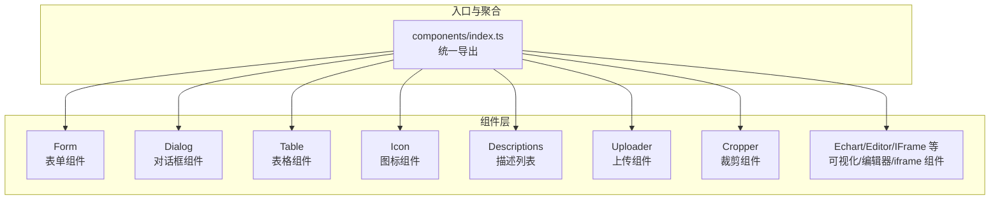

图表来源
- [src/components/index.ts](file://yudao-ui/yudao-ui-admin-vue3/src/components/index.ts)
- [src/components/Form/src/Form.vue](file://yudao-ui/yudao-ui-admin-vue3/src/components/Form/src/Form.vue)
- [src/components/Dialog/src/Dialog.vue](file://yudao-ui/yudao-ui-admin-vue3/src/components/Dialog/src/Dialog.vue)
- [src/components/Table/src/Table.vue](file://yudao-ui/yudao-ui-admin-vue3/src/components/Table/src/Table.vue)
- [src/components/Icon/src/Icon.vue](file://yudao-ui/yudao-ui-admin-vue3/src/components/Icon/src/Icon.vue)
- [src/components/Descriptions/src/Descriptions.vue](file://yudao-ui/yudao-ui-admin-vue3/src/components/Descriptions/src/Descriptions.vue)
- [src/components/UploadFile/src/UploadFile.vue](file://yudao-ui/yudao-ui-admin-vue3/src/components/UploadFile/src/UploadFile.vue)
- [src/components/Cropper/src/Cropper.vue](file://yudao-ui/yudao-ui-admin-vue3/src/components/Cropper/src/Cropper.vue)
- [src/components/Echart/src/Echart.vue](file://yudao-ui/yudao-ui-admin-vue3/src/components/Echart/src/Echart.vue)
- [src/components/Editor/src/Editor.vue](file://yudao-ui/yudao-ui-admin-vue3/src/components/Editor/src/Editor.vue)
- [src/components/IFrame/src/IFrame.vue](file://yudao-ui/yudao-ui-admin-vue3/src/components/IFrame/src/IFrame.vue)

章节来源
- [src/components/index.ts](file://yudao-ui/yudao-ui-admin-vue3/src/components/index.ts)
- [src/main.ts](file://yudao-ui/yudao-ui-admin-vue3/src/main.ts)
- [src/App.vue](file://yudao-ui/yudao-ui-admin-vue3/src/App.vue)

## 核心组件
本节聚焦于具有代表性的组件，展示其职责边界、接口设计与协作关系。

- 表单组件（Form）
  - 职责：统一渲染多种表单项，支持动态布局、校验规则、联动与重置
  - 关键点：通过 componentMap 映射不同控件类型；helper 提供通用行为；types 定义输入输出类型
  - 参考路径：[src/components/Form/src/Form.vue](file://yudao-ui/yudao-ui-admin-vue3/src/components/Form/src/Form.vue)，[src/components/Form/src/componentMap.ts](file://yudao-ui/yudao-ui-admin-vue3/src/components/Form/src/componentMap.ts)，[src/components/Form/src/helper.ts](file://yudao-ui/yudao-ui-admin-vue3/src/components/Form/src/helper.ts)，[src/components/Form/src/types.ts](file://yudao-ui/yudao-ui-admin-vue3/src/components/Form/src/types.ts)

- 对话框组件（Dialog）
  - 职责：封装弹窗容器，控制显隐、尺寸、拖拽、遮罩与按钮区
  - 关键点：通过属性控制行为，通过事件向上抛出确认/取消等动作
  - 参考路径：[src/components/Dialog/src/Dialog.vue](file://yudao-ui/yudao-ui-admin-vue3/src/components/Dialog/src/Dialog.vue)

- 表格组件（Table）
  - 职责：封装列表渲染、排序、筛选、分页与操作列
  - 关键点：抽象列配置、行选择、批量操作与加载态
  - 参考路径：[src/components/Table/src/Table.vue](file://yudao-ui/yudao-ui-admin-vue3/src/components/Table/src/Table.vue)

- 图标组件（Icon）
  - 职责：统一图标渲染与选择器
  - 关键点：Icon.vue 渲染图标，IconSelect.vue 提供选择面板
  - 参考路径：[src/components/Icon/src/Icon.vue](file://yudao-ui/yudao-ui-admin-vue3/src/components/Icon/src/Icon.vue)，[src/components/Icon/src/IconSelect.vue](file://yudao-ui/yudao-ui-admin-vue3/src/components/Icon/src/IconSelect.vue)，[src/components/Icon/src/data.ts](file://yudao-ui/yudao-ui-admin-vue3/src/components/Icon/src/data.ts)

- 描述列表组件（Descriptions）
  - 职责：以键值对形式展示详情信息
  - 关键点：Descriptions.vue 主体，DescriptionsItemLabel.vue 用于自定义标签
  - 参考路径：[src/components/Descriptions/src/Descriptions.vue](file://yudao-ui/yudao-ui-admin-vue3/src/components/Descriptions/src/Descriptions.vue)，[src/components/Descriptions/src/DescriptionsItemLabel.vue](file://yudao-ui/yudao-ui-admin-vue3/src/components/Descriptions/src/DescriptionsItemLabel.vue)

- 上传组件（UploadFile）
  - 职责：封装文件上传流程，支持多文件、预览、删除与进度反馈
  - 关键点：src/index.ts 汇总导出，UploadFile.vue 实现上传逻辑
  - 参考路径：[src/components/UploadFile/src/index.ts](file://yudao-ui/yudao-ui-admin-vue3/src/components/UploadFile/src/index.ts)，[src/components/UploadFile/src/UploadFile.vue](file://yudao-ui/yudao-ui-admin-vue3/src/components/UploadFile/src/UploadFile.vue)

- 裁剪组件（Cropper）
  - 职责：图片裁剪与头像裁剪
  - 关键点：CopperModal.vue、Cropper.vue、CropperAvatar.vue 分别对应不同场景
  - 参考路径：[src/components/Cropper/src/CopperModal.vue](file://yudao-ui/yudao-ui-admin-vue3/src/components/Cropper/src/CopperModal.vue)，[src/components/Cropper/src/Cropper.vue](file://yudao-ui/yudao-ui-admin-vue3/src/components/Cropper/src/Cropper.vue)，[src/components/Cropper/src/CropperAvatar.vue](file://yudao-ui/yudao-ui-admin-vue3/src/components/Cropper/src/CropperAvatar.vue)，[src/components/Cropper/src/types.ts](file://yudao-ui/yudao-ui-admin-vue3/src/components/Cropper/src/types.ts)

- 可视化/编辑器/iframe 组件
  - 职责：封装 Echart、Editor、IFrame 等第三方能力
  - 参考路径：[src/components/Echart/src/Echart.vue](file://yudao-ui/yudao-ui-admin-vue3/src/components/Echart/src/Echart.vue)，[src/components/Editor/src/Editor.vue](file://yudao-ui/yudao-ui-admin-vue3/src/components/Editor/src/Editor.vue)，[src/components/IFrame/src/IFrame.vue](file://yudao-ui/yudao-ui-admin-vue3/src/components/IFrame/src/IFrame.vue)

章节来源
- [src/components/Form/src/Form.vue](file://yudao-ui/yudao-ui-admin-vue3/src/components/Form/src/Form.vue)
- [src/components/Dialog/src/Dialog.vue](file://yudao-ui/yudao-ui-admin-vue3/src/components/Dialog/src/Dialog.vue)
- [src/components/Table/src/Table.vue](file://yudao-ui/yudao-ui-admin-vue3/src/components/Table/src/Table.vue)
- [src/components/Icon/src/Icon.vue](file://yudao-ui/yudao-ui-admin-vue3/src/components/Icon/src/Icon.vue)
- [src/components/Icon/src/IconSelect.vue](file://yudao-ui/yudao-ui-admin-vue3/src/components/Icon/src/IconSelect.vue)
- [src/components/Descriptions/src/Descriptions.vue](file://yudao-ui/yudao-ui-admin-vue3/src/components/Descriptions/src/Descriptions.vue)
- [src/components/Descriptions/src/DescriptionsItemLabel.vue](file://yudao-ui/yudao-ui-admin-vue3/src/components/Descriptions/src/DescriptionsItemLabel.vue)
- [src/components/UploadFile/src/index.ts](file://yudao-ui/yudao-ui-admin-vue3/src/components/UploadFile/src/index.ts)
- [src/components/UploadFile/src/UploadFile.vue](file://yudao-ui/yudao-ui-admin-vue3/src/components/UploadFile/src/UploadFile.vue)
- [src/components/Cropper/src/CopperModal.vue](file://yudao-ui/yudao-ui-admin-vue3/src/components/Cropper/src/CopperModal.vue)
- [src/components/Cropper/src/Cropper.vue](file://yudao-ui/yudao-ui-admin-vue3/src/components/Cropper/src/Cropper.vue)
- [src/components/Cropper/src/CropperAvatar.vue](file://yudao-ui/yudao-ui-admin-vue3/src/components/Cropper/src/CropperAvatar.vue)
- [src/components/Cropper/src/types.ts](file://yudao-ui/yudao-ui-admin-vue3/src/components/Cropper/src/types.ts)
- [src/components/Echart/src/Echart.vue](file://yudao-ui/yudao-ui-admin-vue3/src/components/Echart/src/Echart.vue)
- [src/components/Editor/src/Editor.vue](file://yudao-ui/yudao-ui-admin-vue3/src/components/Editor/src/Editor.vue)
- [src/components/IFrame/src/IFrame.vue](file://yudao-ui/yudao-ui-admin-vue3/src/components/IFrame/src/IFrame.vue)

## 架构总览
组件体系通过统一入口导出，配合路由、状态管理与插件系统协同工作。下图展示了从应用入口到组件使用的典型调用链：

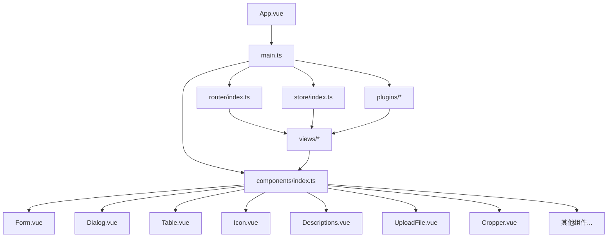

图表来源
- [src/App.vue](file://yudao-ui/yudao-ui-admin-vue3/src/App.vue)
- [src/main.ts](file://yudao-ui/yudao-ui-admin-vue3/src/main.ts)
- [src/router/index.ts](file://yudao-ui/yudao-ui-admin-vue3/src/router/index.ts)
- [src/store/index.ts](file://yudao-ui/yudao-ui-admin-vue3/src/store/index.ts)
- [src/components/index.ts](file://yudao-ui/yudao-ui-admin-vue3/src/components/index.ts)
- [src/components/Form/src/Form.vue](file://yudao-ui/yudao-ui-admin-vue3/src/components/Form/src/Form.vue)
- [src/components/Dialog/src/Dialog.vue](file://yudao-ui/yudao-ui-admin-vue3/src/components/Dialog/src/Dialog.vue)
- [src/components/Table/src/Table.vue](file://yudao-ui/yudao-ui-admin-vue3/src/components/Table/src/Table.vue)
- [src/components/Icon/src/Icon.vue](file://yudao-ui/yudao-ui-admin-vue3/src/components/Icon/src/Icon.vue)
- [src/components/Descriptions/src/Descriptions.vue](file://yudao-ui/yudao-ui-admin-vue3/src/components/Descriptions/src/Descriptions.vue)
- [src/components/UploadFile/src/UploadFile.vue](file://yudao-ui/yudao-ui-admin-vue3/src/components/UploadFile/src/UploadFile.vue)
- [src/components/Cropper/src/Cropper.vue](file://yudao-ui/yudao-ui-admin-vue3/src/components/Cropper/src/Cropper.vue)

章节来源
- [src/App.vue](file://yudao-ui/yudao-ui-admin-vue3/src/App.vue)
- [src/main.ts](file://yudao-ui/yudao-ui-admin-vue3/src/main.ts)
- [src/router/index.ts](file://yudao-ui/yudao-ui-admin-vue3/src/router/index.ts)
- [src/store/index.ts](file://yudao-ui/yudao-ui-admin-vue3/src/store/index.ts)
- [src/components/index.ts](file://yudao-ui/yudao-ui-admin-vue3/src/components/index.ts)

## 详细组件分析

### 表单组件（Form）分析
- 设计要点
  - 动态渲染：根据字段配置与类型映射到具体控件
  - 校验与联动：借助 helper 与 formRules 实现校验与联动逻辑
  - 可复用性：通过 types.ts 定义统一输入输出，便于跨页面复用
- 生命周期与状态
  - 在 mounted 中初始化表单状态与默认值
  - 在 beforeUnmount 中清理定时器或订阅
- 事件与插槽
  - 通过 emit 抛出提交、重置、字段变更等事件
  - 支持自定义插槽覆盖默认渲染
- 组合式 API 与高阶组件
  - 使用 ref/reactive 管理本地状态
  - 可通过 Composables 将校验、联动等逻辑抽离为独立模块

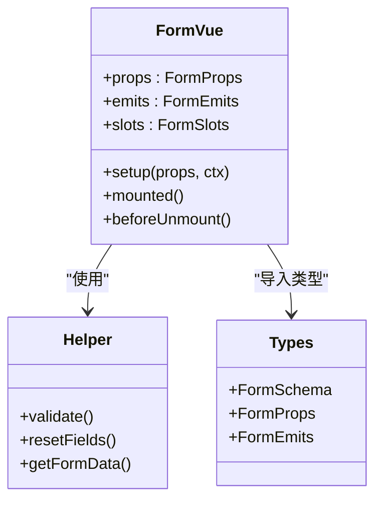

图表来源
- [src/components/Form/src/Form.vue](file://yudao-ui/yudao-ui-admin-vue3/src/components/Form/src/Form.vue)
- [src/components/Form/src/helper.ts](file://yudao-ui/yudao-ui-admin-vue3/src/components/Form/src/helper.ts)
- [src/components/Form/src/types.ts](file://yudao-ui/yudao-ui-admin-vue3/src/components/Form/src/types.ts)

章节来源
- [src/components/Form/src/Form.vue](file://yudao-ui/yudao-ui-admin-vue3/src/components/Form/src/Form.vue)
- [src/components/Form/src/helper.ts](file://yudao-ui/yudao-ui-admin-vue3/src/components/Form/src/helper.ts)
- [src/components/Form/src/types.ts](file://yudao-ui/yudao-ui-admin-vue3/src/components/Form/src/types.ts)

### 对话框组件（Dialog）分析
- 设计要点
  - 通过 visible 控制显隐，支持键盘事件与点击遮罩关闭
  - 提供 confirm/cancel 事件，便于父组件接管确认逻辑
- 生命周期与状态
  - 打开时冻结背景滚动，关闭时恢复
- 事件与插槽
  - 支持自定义头部、底部与内容区域插槽
- 组合式 API 与高阶组件
  - 使用 watchEffect 监听外部状态变化
  - 可封装为高阶组件，注入全局配置

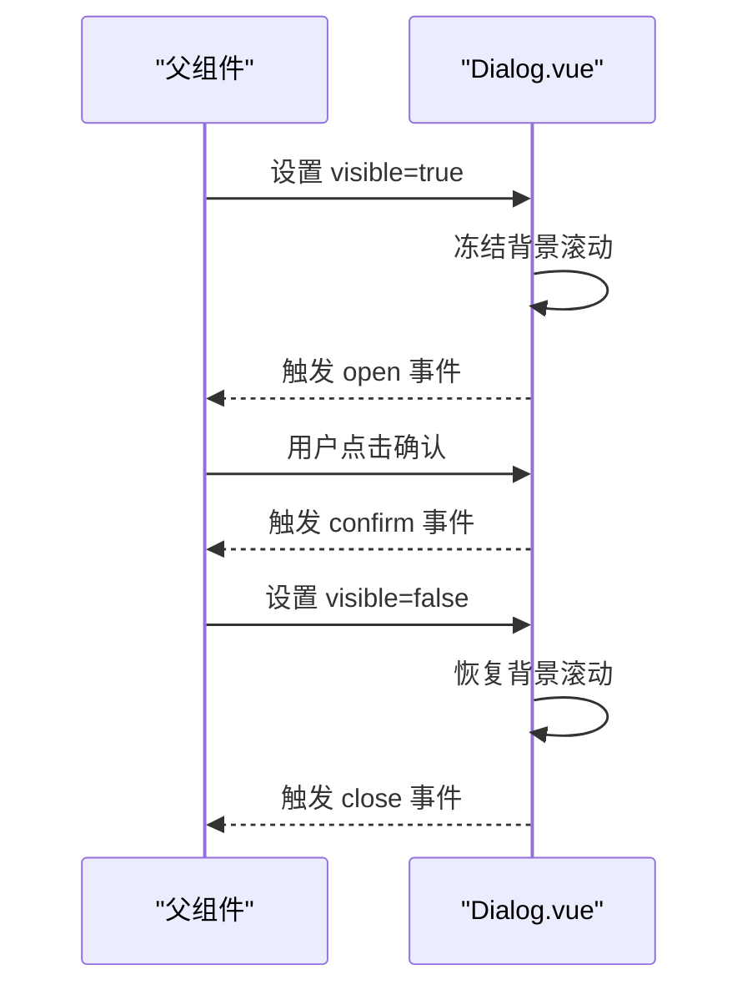

图表来源
- [src/components/Dialog/src/Dialog.vue](file://yudao-ui/yudao-ui-admin-vue3/src/components/Dialog/src/Dialog.vue)

章节来源
- [src/components/Dialog/src/Dialog.vue](file://yudao-ui/yudao-ui-admin-vue3/src/components/Dialog/src/Dialog.vue)

### 表格组件（Table）分析
- 设计要点
  - 列配置化，支持排序、筛选、固定列与自定义渲染
  - 分页与加载态统一处理
- 生命周期与状态
  - 在 mounted 中请求数据并初始化分页参数
- 事件与插槽
  - 通过事件回调处理行操作、分页切换等
  - 支持自定义列模板与空数据插槽
- 组合式 API 与高阶组件
  - 使用 computed/composition API 管理查询条件与结果集
  - 可封装为高阶组件，注入权限与缓存策略

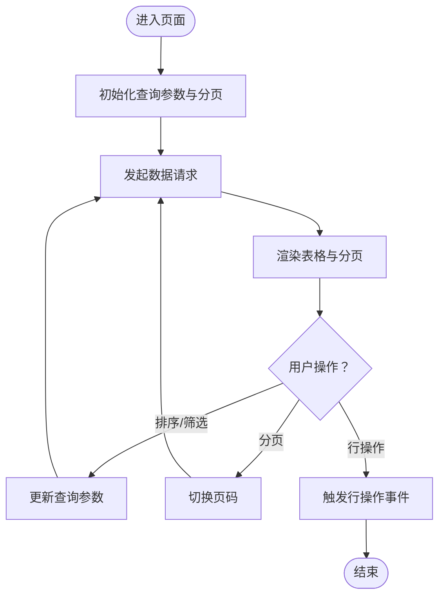

图表来源
- [src/components/Table/src/Table.vue](file://yudao-ui/yudao-ui-admin-vue3/src/components/Table/src/Table.vue)

章节来源
- [src/components/Table/src/Table.vue](file://yudao-ui/yudao-ui-admin-vue3/src/components/Table/src/Table.vue)

### 图标组件（Icon）分析
- 设计要点
  - Icon.vue 负责渲染当前选中图标
  - IconSelect.vue 提供图标选择面板，支持搜索与分类
- 生命周期与状态
  - 通过 props 接收当前图标名称，通过 emits 返回选中结果
- 事件与插槽
  - 支持点击选择与回车确认
- 组合式 API 与高阶组件
  - 使用 ref 管理当前选中项
  - 可封装为高阶组件，注入图标库与主题

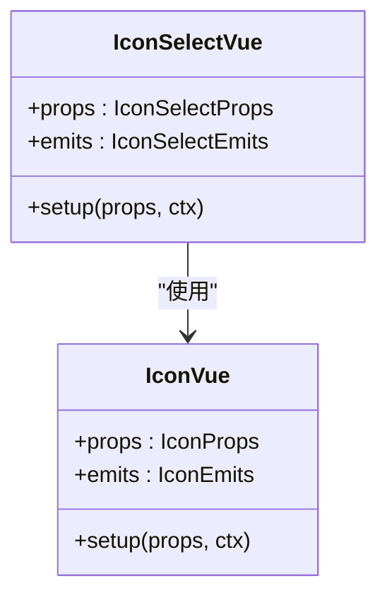

图表来源
- [src/components/Icon/src/Icon.vue](file://yudao-ui/yudao-ui-admin-vue3/src/components/Icon/src/Icon.vue)
- [src/components/Icon/src/IconSelect.vue](file://yudao-ui/yudao-ui-admin-vue3/src/components/Icon/src/IconSelect.vue)
- [src/components/Icon/src/data.ts](file://yudao-ui/yudao-ui-admin-vue3/src/components/Icon/src/data.ts)

章节来源
- [src/components/Icon/src/Icon.vue](file://yudao-ui/yudao-ui-admin-vue3/src/components/Icon/src/Icon.vue)
- [src/components/Icon/src/IconSelect.vue](file://yudao-ui/yudao-ui-admin-vue3/src/components/Icon/src/IconSelect.vue)
- [src/components/Icon/src/data.ts](file://yudao-ui/yudao-ui-admin-vue3/src/components/Icon/src/data.ts)

### 描述列表组件（Descriptions）分析
- 设计要点
  - 通过 Descriptions.vue 统一渲染，DescriptionsItemLabel.vue 支持自定义标签
- 生命周期与状态
  - 通过 props 接收数据与配置，computed 计算最终展示结构
- 事件与插槽
  - 支持自定义标签与值的渲染
- 组合式 API 与高阶组件
  - 使用 reactive 管理列配置
  - 可封装为高阶组件，注入默认样式与主题

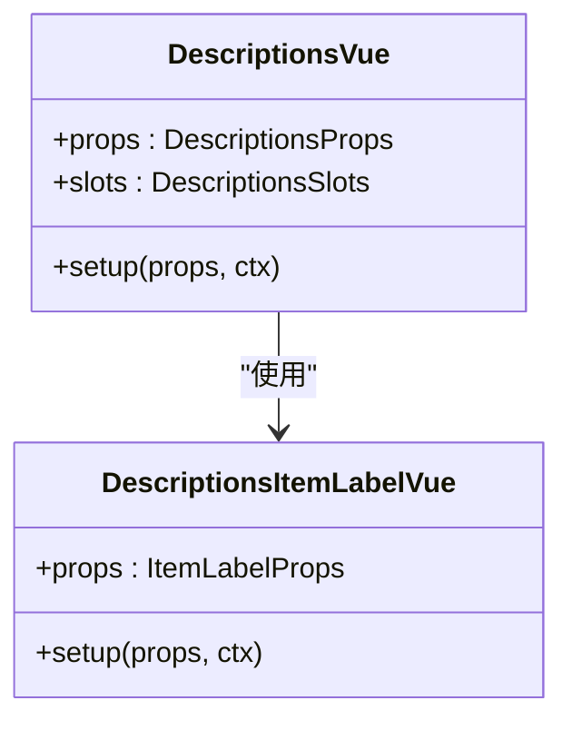

图表来源
- [src/components/Descriptions/src/Descriptions.vue](file://yudao-ui/yudao-ui-admin-vue3/src/components/Descriptions/src/Descriptions.vue)
- [src/components/Descriptions/src/DescriptionsItemLabel.vue](file://yudao-ui/yudao-ui-admin-vue3/src/components/Descriptions/src/DescriptionsItemLabel.vue)

章节来源
- [src/components/Descriptions/src/Descriptions.vue](file://yudao-ui/yudao-ui-admin-vue3/src/components/Descriptions/src/Descriptions.vue)
- [src/components/Descriptions/src/DescriptionsItemLabel.vue](file://yudao-ui/yudao-ui-admin-vue3/src/components/Descriptions/src/DescriptionsItemLabel.vue)

### 上传组件（UploadFile）分析
- 设计要点
  - 封装上传流程，支持多文件、预览、删除与进度反馈
- 生命周期与状态
  - 在 mounted 中初始化上传参数
- 事件与插槽
  - 通过事件返回上传结果与错误信息
- 组合式 API 与高阶组件
  - 使用 ref/reactive 管理文件列表与进度
  - 可封装为高阶组件，注入默认策略与鉴权

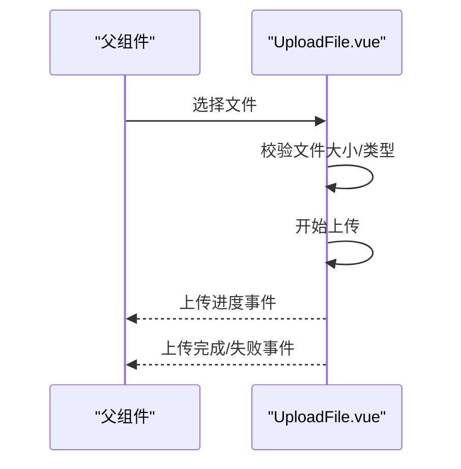

图表来源
- [src/components/UploadFile/src/UploadFile.vue](file://yudao-ui/yudao-ui-admin-vue3/src/components/UploadFile/src/UploadFile.vue)

章节来源
- [src/components/UploadFile/src/UploadFile.vue](file://yudao-ui/yudao-ui-admin-vue3/src/components/UploadFile/src/UploadFile.vue)

### 裁剪组件（Cropper）分析
- 设计要点
  - CopperModal.vue、Cropper.vue、CropperAvatar.vue 分别适配不同场景
- 生命周期与状态
  - 在 mounted 中初始化画布与裁剪参数
- 事件与插槽
  - 通过事件返回裁剪后的图片数据
- 组合式 API 与高阶组件
  - 使用 ref 管理裁剪实例
  - 可封装为高阶组件，注入默认尺寸与比例

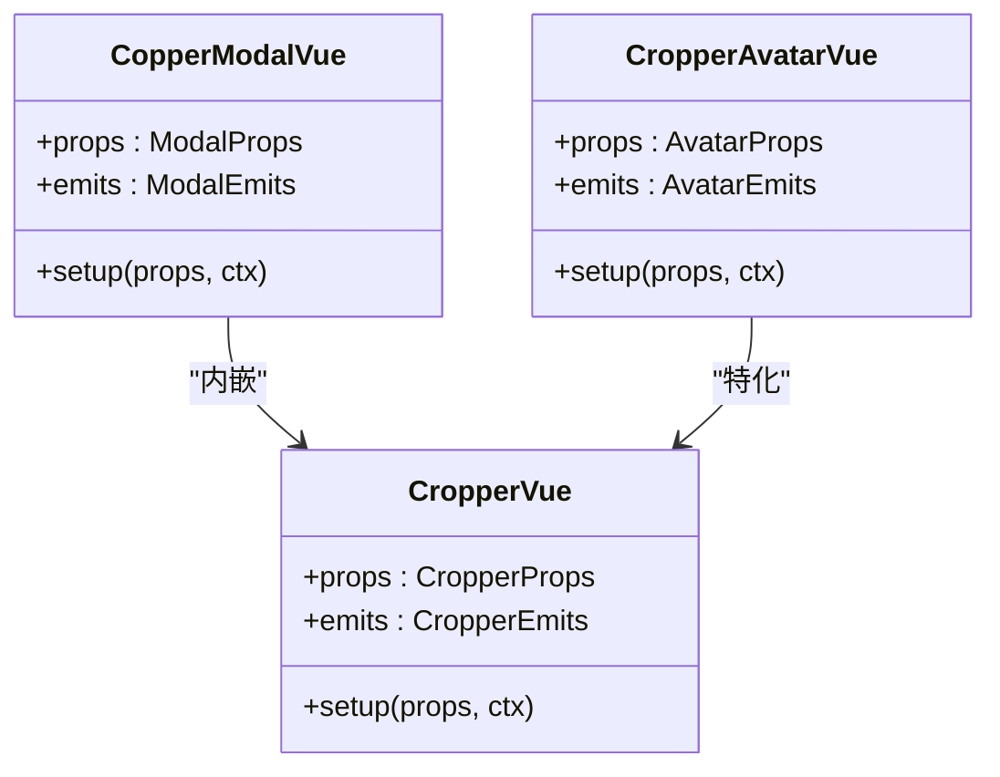

图表来源
- [src/components/Cropper/src/Cropper.vue](file://yudao-ui/yudao-ui-admin-vue3/src/components/Cropper/src/Cropper.vue)
- [src/components/Cropper/src/CopperModal.vue](file://yudao-ui/yudao-ui-admin-vue3/src/components/Cropper/src/CopperModal.vue)
- [src/components/Cropper/src/CropperAvatar.vue](file://yudao-ui/yudao-ui-admin-vue3/src/components/Cropper/src/CropperAvatar.vue)
- [src/components/Cropper/src/types.ts](file://yudao-ui/yudao-ui-admin-vue3/src/components/Cropper/src/types.ts)

章节来源
- [src/components/Cropper/src/Cropper.vue](file://yudao-ui/yudao-ui-admin-vue3/src/components/Cropper/src/Cropper.vue)
- [src/components/Cropper/src/CopperModal.vue](file://yudao-ui/yudao-ui-admin-vue3/src/components/Cropper/src/CopperModal.vue)
- [src/components/Cropper/src/CropperAvatar.vue](file://yudao-ui/yudao-ui-admin-vue3/src/components/Cropper/src/CropperAvatar.vue)
- [src/components/Cropper/src/types.ts](file://yudao-ui/yudao-ui-admin-vue3/src/components/Cropper/src/types.ts)

### 可视化/编辑器/iframe 组件分析
- 设计要点
  - Echart.vue 封装图表渲染与交互
  - Editor.vue 封装富文本编辑器
  - IFrame.vue 封装外部页面嵌入
- 生命周期与状态
  - 在 mounted 中初始化第三方实例
- 事件与插槽
  - 通过事件返回图表交互与编辑器状态
- 组合式 API 与高阶组件
  - 使用 ref 管理实例引用
  - 可封装为高阶组件，注入主题与国际化

章节来源
- [src/components/Echart/src/Echart.vue](file://yudao-ui/yudao-ui-admin-vue3/src/components/Echart/src/Echart.vue)
- [src/components/Editor/src/Editor.vue](file://yudao-ui/yudao-ui-admin-vue3/src/components/Editor/src/Editor.vue)
- [src/components/IFrame/src/IFrame.vue](file://yudao-ui/yudao-ui-admin-vue3/src/components/IFrame/src/IFrame.vue)

### 概念性总览
以下为概念性流程图，展示组件开发的通用工作流（不绑定具体文件）：

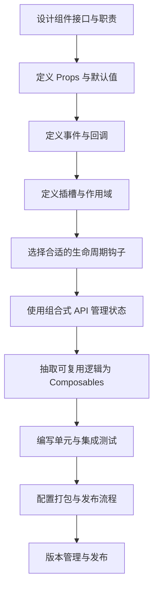

## 依赖关系分析
组件之间的依赖关系主要体现在入口导出与相互引用上。下图展示了组件入口与部分核心组件的关系：

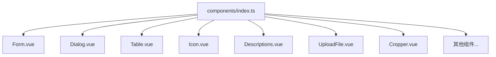

图表来源
- [src/components/index.ts](file://yudao-ui/yudao-ui-admin-vue3/src/components/index.ts)
- [src/components/Form/src/Form.vue](file://yudao-ui/yudao-ui-admin-vue3/src/components/Form/src/Form.vue)
- [src/components/Dialog/src/Dialog.vue](file://yudao-ui/yudao-ui-admin-vue3/src/components/Dialog/src/Dialog.vue)
- [src/components/Table/src/Table.vue](file://yudao-ui/yudao-ui-admin-vue3/src/components/Table/src/Table.vue)
- [src/components/Icon/src/Icon.vue](file://yudao-ui/yudao-ui-admin-vue3/src/components/Icon/src/Icon.vue)
- [src/components/Descriptions/src/Descriptions.vue](file://yudao-ui/yudao-ui-admin-vue3/src/components/Descriptions/src/Descriptions.vue)
- [src/components/UploadFile/src/UploadFile.vue](file://yudao-ui/yudao-ui-admin-vue3/src/components/UploadFile/src/UploadFile.vue)
- [src/components/Cropper/src/Cropper.vue](file://yudao-ui/yudao-ui-admin-vue3/src/components/Cropper/src/Cropper.vue)

章节来源
- [src/components/index.ts](file://yudao-ui/yudao-ui-admin-vue3/src/components/index.ts)

## 性能考量
- 组件懒加载与按需引入
  - 在路由与组件层面采用动态导入，减少首屏体积
  - 通过插件与按需加载策略优化第三方库加载
- 渲染优化
  - 合理使用 v-memo、key 与 v-show/v-if，避免不必要的重渲染
  - 表格与列表组件应启用虚拟滚动与分页
- 状态管理
  - 将跨组件共享的状态放入 store，避免深层传递
- 打包与缓存
  - 配置合理的 chunk 分割与持久化缓存策略
  - 使用 CDN 与压缩策略提升加载速度

## 故障排查指南
- 常见问题定位
  - Props 类型不匹配：检查 types 与组件声明是否一致
  - 事件未触发：确认 emits 是否正确声明与触发
  - 插槽未生效：检查插槽名称与作用域插槽的 slot/slot-scope 使用
  - 生命周期异常：确认在正确的生命周期钩子中执行副作用
- 调试技巧
  - 使用浏览器开发者工具断点调试
  - 在组件中打印关键状态与事件日志
  - 使用 Vue DevTools 观察组件树与状态变化
- 测试建议
  - 单元测试：针对组合式函数与纯函数进行测试
  - 集成测试：模拟用户交互与异步流程
  - 端到端测试：验证真实浏览器环境下的行为

## 结论
本指南基于仓库中的实际组件实现，总结了 Vue 3 自定义组件开发的关键实践：清晰的职责划分、统一的入口导出、完善的 Props/事件/插槽设计、合理的生命周期与状态管理、可复用的组合式逻辑与高阶组件模式，以及配套的测试与发布流程。遵循这些原则与方法，能够显著提升组件的可维护性与可扩展性。

## 附录
- 命名规范
  - 组件目录：功能名/（如 Form、Dialog、Table）
  - 入口文件：index.ts（统一导出）
  - 实现文件：src/xxx.vue（主体实现）
  - 类型文件：types/*.ts 或同级 index.ts
- 目录结构示例
  - Form/
    - src/
      - Form.vue
      - componentMap.ts
      - helper.ts
      - types.ts
    - index.ts
- 版本管理与发布
  - 使用语义化版本号，变更记录在变更日志中维护
  - 发布前确保通过单元测试与集成测试
  - 使用 CI/CD 自动化打包与发布流程