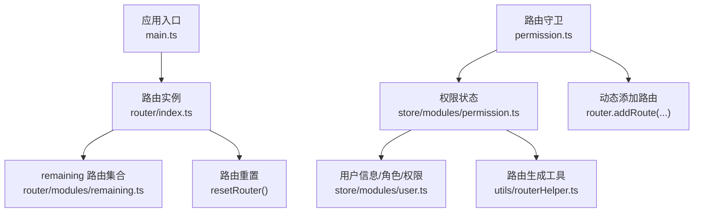
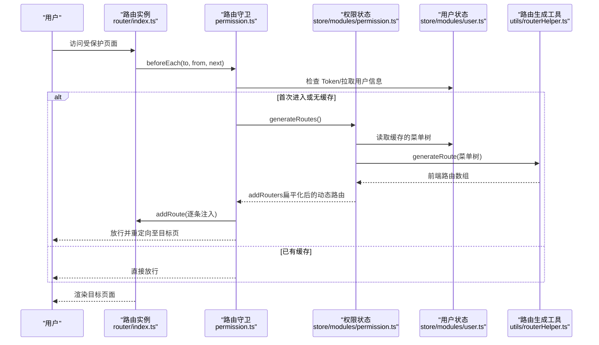
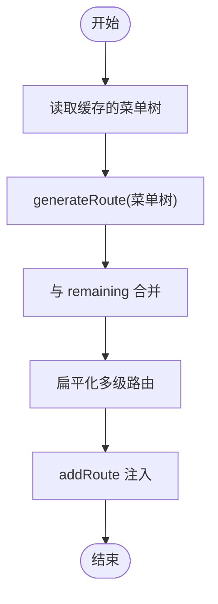
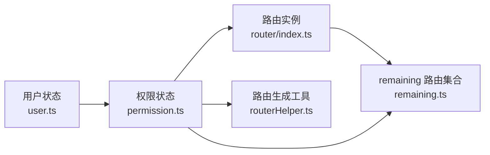

# 动态路由

<cite>
**本文引用的文件**
- [src/router/index.ts](file://yudao-ui/yudao-ui-admin-vue3/src/router/index.ts)
- [src/router/modules/remaining.ts](file://yudao-ui/yudao-ui-admin-vue3/src/router/modules/remaining.ts)
- [src/permission.ts](file://yudao-ui/yudao-ui-admin-vue3/src/permission.ts)
- [src/store/modules/permission.ts](file://yudao-ui/yudao-ui-admin-vue3/src/store/modules/permission.ts)
- [src/store/modules/user.ts](file://yudao-ui/yudao-ui-admin-vue3/src/store/modules/user.ts)
- [src/utils/routerHelper.ts](file://yudao-ui/yudao-ui-admin-vue3/src/utils/routerHelper.ts)
- [src/utils/permission.ts](file://yudao-ui/yudao-ui-admin-vue3/src/utils/permission.ts)
</cite>

## 目录
1. [简介](#简介)
2. [项目结构](#项目结构)
3. [核心组件](#核心组件)
4. [架构总览](#架构总览)
5. [详细组件分析](#详细组件分析)
6. [依赖分析](#依赖分析)
7. [性能考虑](#性能考虑)
8. [故障排查指南](#故障排查指南)
9. [结论](#结论)

## 简介
本章节面向“芋道 ruoyi-vue-pro”的前端动态路由能力，系统性阐述以下主题：
- 动态路由的实现原理与应用场景：基于用户权限动态生成路由、菜单数据与路由的映射关系。
- 路由模块化组织方式：remaining 路由模块的结构与职责，以及如何与动态路由协同工作。
- 动态添加与移除机制：路由重置与白名单管理策略。
- 权限路由实现方案：路由元信息配置、权限判断逻辑与路由守卫使用。
- 动态菜单生成的技术实现与最佳实践。

## 项目结构
动态路由相关代码主要分布在如下位置：
- 路由定义与入口：router/index.ts、router/modules/remaining.ts
- 路由守卫与流程控制：permission.ts
- 权限状态与动态路由装配：store/modules/permission.ts
- 用户信息与角色/权限缓存：store/modules/user.ts
- 路由生成与降级工具：utils/routerHelper.ts
- 权限校验工具：utils/permission.ts

图表来源
- [src/router/index.ts:1-47](file://yudao-ui/yudao-ui-admin-vue3/src/router/index.ts#L1-L47)
- [src/router/modules/remaining.ts:1-830](file://yudao-ui/yudao-ui-admin-vue3/src/router/modules/remaining.ts#L1-L830)
- [src/permission.ts:1-79](file://yudao-ui/yudao-ui-admin-vue3/src/permission.ts#L1-L79)
- [src/store/modules/permission.ts:1-80](file://yudao-ui/yudao-ui-admin-vue3/src/store/modules/permission.ts#L1-L80)
- [src/store/modules/user.ts:1-109](file://yudao-ui/yudao-ui-admin-vue3/src/store/modules/user.ts#L1-L109)
- [src/utils/routerHelper.ts:1-373](file://yudao-ui/yudao-ui-admin-vue3/src/utils/routerHelper.ts#L1-L373)

章节来源
- [src/router/index.ts:1-47](file://yudao-ui/yudao-ui-admin-vue3/src/router/index.ts#L1-L47)
- [src/router/modules/remaining.ts:1-830](file://yudao-ui/yudao-ui-admin-vue3/src/router/modules/remaining.ts#L1-L830)
- [src/permission.ts:1-79](file://yudao-ui/yudao-ui-admin-vue3/src/permission.ts#L1-L79)
- [src/store/modules/permission.ts:1-80](file://yudao-ui/yudao-ui-admin-vue3/src/store/modules/permission.ts#L1-L80)
- [src/store/modules/user.ts:1-109](file://yudao-ui/yudao-ui-admin-vue3/src/store/modules/user.ts#L1-L109)
- [src/utils/routerHelper.ts:1-373](file://yudao-ui/yudao-ui-admin-vue3/src/utils/routerHelper.ts#L1-L373)

## 核心组件
- 路由实例与重置
  - 路由实例在入口创建，初始仅注入 remaining 路由集合；提供 resetRouter() 用于在登出或切换用户时清理动态路由。
- 路由守卫
  - beforeEach 中完成 Token 校验、用户信息拉取、菜单/权限缓存、动态路由生成与注入、白名单放行与重定向。
- 权限状态
  - permission store 负责生成动态路由、合并 remaining 与动态路由、扁平化多级路由以便菜单渲染。
- 用户状态
  - user store 负责拉取并缓存用户信息、角色与权限，同时缓存后端返回的菜单树（即动态路由数据源）。
- 路由生成工具
  - 将后端菜单树转换为前端路由结构，处理外链、参数、iframe、keep-alive 等细节，并进行同名路由折叠与多级降级。
- 权限校验工具
  - 提供字符/角色权限校验方法，配合指令与菜单渲染使用。

章节来源
- [src/router/index.ts:32-40](file://yudao-ui/yudao-ui-admin-vue3/src/router/index.ts#L32-L40)
- [src/permission.ts:28-72](file://yudao-ui/yudao-ui-admin-vue3/src/permission.ts#L28-L72)
- [src/store/modules/permission.ts:39-66](file://yudao-ui/yudao-ui-admin-vue3/src/store/modules/permission.ts#L39-L66)
- [src/store/modules/user.ts:51-71](file://yudao-ui/yudao-ui-admin-vue3/src/store/modules/user.ts#L51-L71)
- [src/utils/routerHelper.ts:74-220](file://yudao-ui/yudao-ui-admin-vue3/src/utils/routerHelper.ts#L74-L220)
- [src/utils/permission.ts:12-36](file://yudao-ui/yudao-ui-admin-vue3/src/utils/permission.ts#L12-L36)

## 架构总览
动态路由的端到端流程如下：

图表来源
- [src/permission.ts:28-72](file://yudao-ui/yudao-ui-admin-vue3/src/permission.ts#L28-L72)
- [src/store/modules/permission.ts:39-66](file://yudao-ui/yudao-ui-admin-vue3/src/store/modules/permission.ts#L39-L66)
- [src/store/modules/user.ts:51-71](file://yudao-ui/yudao-ui-admin-vue3/src/store/modules/user.ts#L51-L71)
- [src/utils/routerHelper.ts:74-220](file://yudao-ui/yudao-ui-admin-vue3/src/utils/routerHelper.ts#L74-L220)
- [src/router/index.ts:42-44](file://yudao-ui/yudao-ui-admin-vue3/src/router/index.ts#L42-L44)

## 详细组件分析

### remaining 路由模块
- 职责
  - 定义系统常驻路由（如首页、登录、错误页、重定向、部分业务内嵌页等），这些路由在应用启动时即存在，不受权限影响。
  - 作为“基座”，与动态路由共同构成最终菜单与路由树。
- 组织方式
  - 采用模块化文件集中管理，便于维护与扩展。
  - 路由元信息包含可见性、缓存、标签页固定、面包屑、图标、国际化标题等，支撑菜单渲染与行为控制。
- 与动态路由的关系
  - permission store 在生成动态路由后，将其与 remaining 合并，形成最终可用的路由集合。

章节来源
- [src/router/modules/remaining.ts:35-245](file://yudao-ui/yudao-ui-admin-vue3/src/router/modules/remaining.ts#L35-L245)
- [src/router/modules/remaining.ts:246-827](file://yudao-ui/yudao-ui-admin-vue3/src/router/modules/remaining.ts#L246-L827)
- [src/store/modules/permission.ts:63](file://yudao-ui/yudao-ui-admin-vue3/src/store/modules/permission.ts#L63)

### 动态路由生成与注入
- 数据来源
  - 后端返回的菜单树（包含 path、component、icon、visible、keepAlive、alwaysShow 等字段）经用户 store 缓存。
- 生成过程
  - permission store 调用 generateRoute，将菜单树转换为前端路由结构，处理外链、参数、iframe、keep-alive、菜单折叠等。
  - 生成完成后，将动态路由与 remaining 合并，得到最终路由集合。
- 注入时机
  - 首次进入受保护页面时，若未生成过动态路由，则在守卫中调用 generateRoutes 并逐条 addRoute 注入。
- 扁平化
  - 为便于菜单渲染，将多级路由降级为二级，避免 keep-alive 与标签页异常。

图表来源
- [src/store/modules/permission.ts:39-66](file://yudao-ui/yudao-ui-admin-vue3/src/store/modules/permission.ts#L39-L66)
- [src/utils/routerHelper.ts:74-220](file://yudao-ui/yudao-ui-admin-vue3/src/utils/routerHelper.ts#L74-L220)

章节来源
- [src/store/modules/permission.ts:39-66](file://yudao-ui/yudao-ui-admin-vue3/src/store/modules/permission.ts#L39-L66)
- [src/utils/routerHelper.ts:74-220](file://yudao-ui/yudao-ui-admin-vue3/src/utils/routerHelper.ts#L74-L220)

### 路由守卫与白名单
- 白名单
  - 登录、社交登录、授权回调、注册等页面直接放行。
- 登录态与用户信息
  - 存在 Token 时，优先拉取用户信息与字典；首次进入时生成并注入动态路由。
- 重定向
  - 放行时根据来源查询参数解析目标路由，确保参数正确传递。
- 未登录
  - 非白名单页面统一重定向至登录页并携带 redirect 参数。

```mermaid
flowchart TD
S(["进入守卫"]) --> HasToken{"是否存在 Token"}
HasToken -- 否 --> White{"是否在白名单"}
White -- 是 --> Allow1["放行"]
White -- 否 --> ToLogin["重定向到登录页"]
HasToken -- 是 --> First{"是否首次进入"}
First -- 是 --> Gen["生成并注入动态路由"]
Gen --> Redirect["计算重定向目标"]
Redirect --> Allow2["放行"]
First -- 否 --> Allow3["放行"]
```

图表来源
- [src/permission.ts:18-25](file://yudao-ui/yudao-ui-admin-vue3/src/permission.ts#L18-L25)
- [src/permission.ts:28-72](file://yudao-ui/yudao-ui-admin-vue3/src/permission.ts#L28-L72)

章节来源
- [src/permission.ts:18-25](file://yudao-ui/yudao-ui-admin-vue3/src/permission.ts#L18-L25)
- [src/permission.ts:28-72](file://yudao-ui/yudao-ui-admin-vue3/src/permission.ts#L28-L72)

### 路由重置与白名单管理
- 路由重置
  - resetRouter() 会移除除白名单外的所有动态路由，为下次登录准备干净环境。
- 白名单
  - 包含登录、社交登录、授权回调、注册等页面名称，避免被重置。
- 应用场景
  - 登出、切换账号、权限变更后重建路由。

章节来源
- [src/router/index.ts:32-40](file://yudao-ui/yudao-ui-admin-vue3/src/router/index.ts#L32-L40)

### 权限路由与菜单映射
- 路由元信息
  - visible -> hidden：控制菜单是否显示
  - keepAlive -> noCache：控制页面是否缓存
  - alwaysShow：控制是否始终显示根菜单
  - icon/title/hash/query/params 等丰富菜单与导航体验
- 菜单与路由映射
  - 后端菜单树通过 generateRoute 转换为前端路由，再与 remaining 合并，形成最终菜单树。
- 路由折叠
  - 当父子路由同名且满足条件时，自动折叠为父级路由，提升菜单简洁度。

章节来源
- [src/utils/routerHelper.ts:88-119](file://yudao-ui/yudao-ui-admin-vue3/src/utils/routerHelper.ts#L88-L119)
- [src/utils/routerHelper.ts:194-214](file://yudao-ui/yudao-ui-admin-vue3/src/utils/routerHelper.ts#L194-L214)
- [src/store/modules/permission.ts:63](file://yudao-ui/yudao-ui-admin-vue3/src/store/modules/permission.ts#L63)

### 动态菜单生成与最佳实践
- 最佳实践
  - 后端统一输出菜单树，前端仅负责渲染与交互。
  - 使用 keep-alive 与 noCache 控制页面缓存，减少内存占用。
  - 使用 alwaysShow 与同名折叠避免菜单冗余。
  - 使用 hash/query/params 保持菜单与路由参数一致性。
  - 外链统一通过 iframe 容器渲染，保证安全与隔离。
- 技术要点
  - 外链识别与 iframe 渲染
  - 参数拆分与合并（路径参数、查询参数、哈希）
  - 多级路由降级，确保菜单与标签页正常工作

章节来源
- [src/utils/routerHelper.ts:160-182](file://yudao-ui/yudao-ui-admin-vue3/src/utils/routerHelper.ts#L160-L182)
- [src/utils/routerHelper.ts:100-118](file://yudao-ui/yudao-ui-admin-vue3/src/utils/routerHelper.ts#L100-L118)
- [src/utils/routerHelper.ts:294-304](file://yudao-ui/yudao-ui-admin-vue3/src/utils/routerHelper.ts#L294-L304)

## 依赖分析
- 组件耦合
  - permission.ts 依赖 user.ts 与 permission.ts 的 generateRoutes 输出。
  - permission.ts 依赖 router.ts 的 addRoute 注入。
  - permission.ts 依赖 utils/routerHelper.ts 的路由生成与降级。
  - router/index.ts 依赖 remaining.ts 作为基础路由集合。
- 关键依赖链
  - 用户信息缓存 -> 动态路由生成 -> 路由注入 -> 菜单渲染
  - remaining 路由集合 -> 合并 -> 最终路由树

图表来源
- [src/store/modules/user.ts:51-71](file://yudao-ui/yudao-ui-admin-vue3/src/store/modules/user.ts#L51-L71)
- [src/store/modules/permission.ts:39-66](file://yudao-ui/yudao-ui-admin-vue3/src/store/modules/permission.ts#L39-L66)
- [src/router/index.ts:42-44](file://yudao-ui/yudao-ui-admin-vue3/src/router/index.ts#L42-L44)
- [src/router/modules/remaining.ts:35-245](file://yudao-ui/yudao-ui-admin-vue3/src/router/modules/remaining.ts#L35-L245)
- [src/utils/routerHelper.ts:74-220](file://yudao-ui/yudao-ui-admin-vue3/src/utils/routerHelper.ts#L74-L220)

章节来源
- [src/store/modules/user.ts:51-71](file://yudao-ui/yudao-ui-admin-vue3/src/store/modules/user.ts#L51-L71)
- [src/store/modules/permission.ts:39-66](file://yudao-ui/yudao-ui-admin-vue3/src/store/modules/permission.ts#L39-L66)
- [src/router/index.ts:42-44](file://yudao-ui/yudao-ui-admin-vue3/src/router/index.ts#L42-L44)
- [src/router/modules/remaining.ts:35-245](file://yudao-ui/yudao-ui-admin-vue3/src/router/modules/remaining.ts#L35-L245)
- [src/utils/routerHelper.ts:74-220](file://yudao-ui/yudao-ui-admin-vue3/src/utils/routerHelper.ts#L74-L220)

## 性能考虑
- 模块懒加载
  - remaining 中的视图组件采用动态导入，结合路由错误处理自动刷新，降低首屏体积与初次渲染压力。
- 路由降级
  - 多级路由降级为二级，减少 keep-alive 与标签页的复杂度，提升渲染性能。
- 缓存策略
  - 用户信息、角色/权限、菜单树均缓存于本地，避免重复请求与重复生成。
- 白名单与重定向
  - 合理的白名单与重定向逻辑，减少无效渲染与重复注入。

章节来源
- [src/router/index.ts:23-30](file://yudao-ui/yudao-ui-admin-vue3/src/router/index.ts#L23-L30)
- [src/utils/routerHelper.ts:294-304](file://yudao-ui/yudao-ui-admin-vue3/src/utils/routerHelper.ts#L294-L304)
- [src/store/modules/user.ts:51-71](file://yudao-ui/yudao-ui-admin-vue3/src/store/modules/user.ts#L51-L71)

## 故障排查指南
- 动态导入失败
  - 现象：运行时报错提示动态导入模块失败。
  - 处理：路由错误监听中自动刷新当前页面以规避 chunk 哈希变化导致的加载失败。
- 登录后无法进入目标页
  - 现象：登录成功后仍停留在登录页或 404。
  - 排查：确认守卫中的 generateRoutes 是否执行、addRoute 是否成功注入、重定向参数是否正确。
- 菜单不显示或显示异常
  - 现象：某些菜单隐藏或重复。
  - 排查：检查后端 visible/alwaysShow 配置、同名折叠逻辑、多级路由降级结果。
- 页面缓存异常
  - 现象：切换标签页后页面状态丢失。
  - 排查：检查 keepAlive 与 noCache 配置是否符合预期。

章节来源
- [src/router/index.ts:23-30](file://yudao-ui/yudao-ui-admin-vue3/src/router/index.ts#L23-L30)
- [src/permission.ts:48-60](file://yudao-ui/yudao-ui-admin-vue3/src/permission.ts#L48-L60)
- [src/utils/routerHelper.ts:88-119](file://yudao-ui/yudao-ui-admin-vue3/src/utils/routerHelper.ts#L88-L119)
- [src/utils/routerHelper.ts:194-214](file://yudao-ui/yudao-ui-admin-vue3/src/utils/routerHelper.ts#L194-L214)

## 结论
本项目通过“remaining 基础路由 + 后端菜单树 + 前端路由生成工具”的组合，实现了灵活、可维护的动态路由体系。配合路由守卫、权限状态与用户状态，形成了从登录到菜单渲染的完整闭环。建议在实际项目中遵循参数对齐、缓存复用、路由降级与白名单管理的最佳实践，持续优化性能与用户体验。