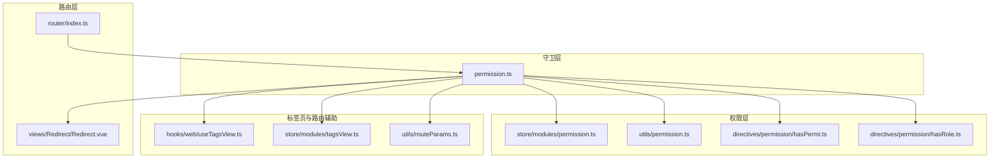
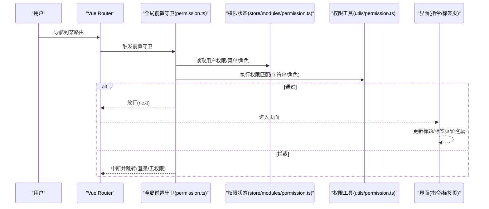
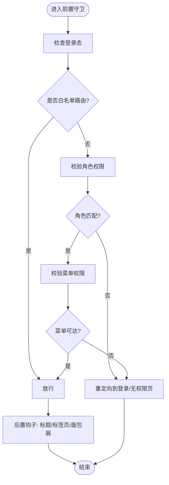
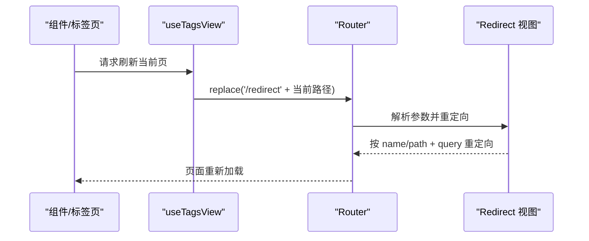
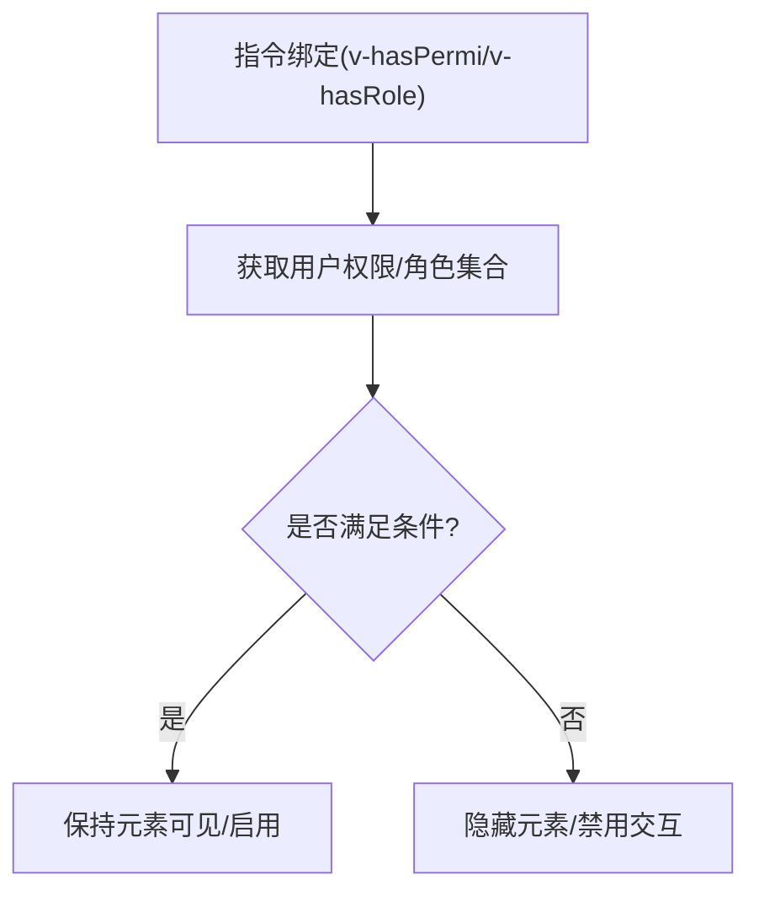
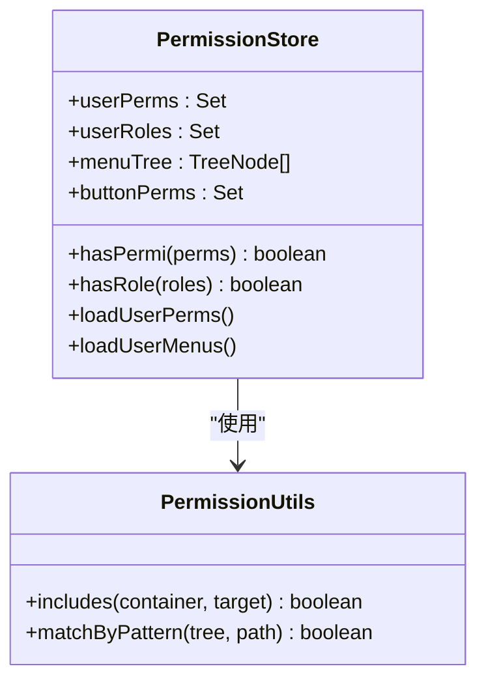
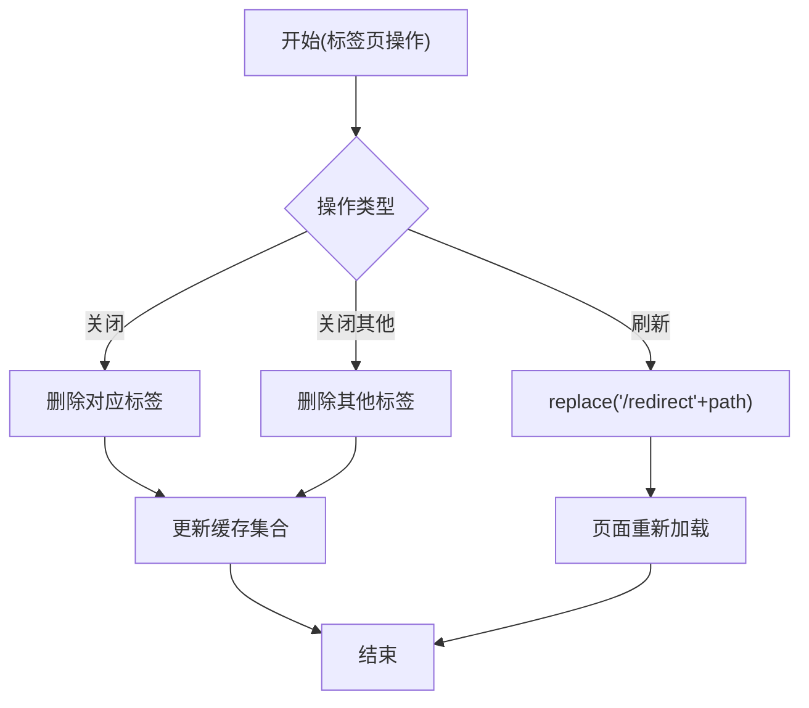
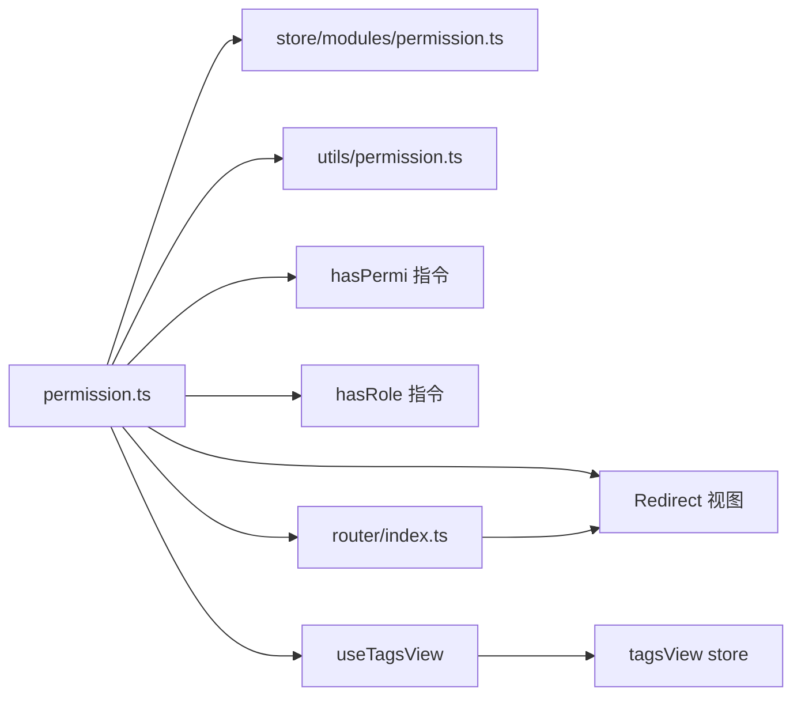

# 导航守卫

<cite>
**本文引用的文件**
- [permission.ts](file://yudao-ui/yudao-ui-admin-vue3/src/permission.ts)
- [router/index.ts](file://yudao-ui/yudao-ui-admin-vue3/src/router/index.ts)
- [directives/permission/hasPermi.ts](file://yudao-ui/yudao-ui-admin-vue3/src/directives/permission/hasPermi.ts)
- [directives/permission/hasRole.ts](file://yudao-ui/yudao-ui-admin-vue3/src/directives/permission/hasRole.ts)
- [store/modules/permission.ts](file://yudao-ui/yudao-ui-admin-vue3/src/store/modules/permission.ts)
- [utils/permission.ts](file://yudao-ui/yudao-ui-admin-vue3/src/utils/permission.ts)
- [views/Redirect/Redirect.vue](file://yudao-ui/yudao-ui-admin-vue3/src/views/Redirect/Redirect.vue)
- [hooks/web/useTagsView.ts](file://yudao-ui/yudao-ui-admin-vue3/src/hooks/web/useTagsView.ts)
- [store/modules/tagsView.ts](file://yudao-ui/yudao-ui-admin-vue3/src/store/modules/tagsView.ts)
- [utils/routeParams.ts](file://yudao-ui/yudao-ui-admin-vue3/src/utils/routeParams.ts)
</cite>

## 目录
1. [引言](#引言)
2. [项目结构](#项目结构)
3. [核心组件](#核心组件)
4. [架构总览](#架构总览)
5. [详细组件分析](#详细组件分析)
6. [依赖关系分析](#依赖关系分析)
7. [性能考虑](#性能考虑)
8. [故障排查指南](#故障排查指南)
9. [结论](#结论)
10. [附录](#附录)

## 引言
本文件面向芋道 ruoyi-vue-pro 的前端工程，系统化梳理 Vue Router 导航守卫在项目中的落地实践，涵盖以下主题：
- 全局前置守卫与后置钩子的实现与职责边界
- 权限验证机制：登录态检查、角色权限判断、菜单权限控制
- 路由拦截与放行的逻辑处理：重定向、错误页面、白名单策略
- 权限指令的使用：hasPermi 与 hasRole 的实现与应用场景
- 导航守卫的调试技巧与性能优化建议

## 项目结构
与导航守卫直接相关的前端代码主要分布在如下模块：
- 路由定义与基础配置：router/index.ts
- 全局导航守卫入口：permission.ts
- 权限指令：directives/permission 下的 hasPermi.ts 与 hasRole.ts
- 权限状态管理：store/modules/permission.ts
- 权限工具函数：utils/permission.ts
- 标签页与路由辅助：hooks/web/useTagsView.ts、store/modules/tagsView.ts、utils/routeParams.ts
- 重定向视图：views/Redirect/Redirect.vue

图表来源
- [router/index.ts:1-46](file://yudao-ui/yudao-ui-admin-vue3/src/router/index.ts#L1-L46)
- [permission.ts:1-200](file://yudao-ui/yudao-ui-admin-vue3/src/permission.ts#L1-L200)
- [store/modules/permission.ts:1-200](file://yudao-ui/yudao-ui-admin-vue3/src/store/modules/permission.ts#L1-L200)
- [utils/permission.ts:1-200](file://yudao-ui/yudao-ui-admin-vue3/src/utils/permission.ts#L1-L200)
- [directives/permission/hasPermi.ts:1-200](file://yudao-ui/yudao-ui-admin-vue3/src/directives/permission/hasPermi.ts#L1-L200)
- [directives/permission/hasRole.ts:1-200](file://yudao-ui/yudao-ui-admin-vue3/src/directives/permission/hasRole.ts#L1-L200)
- [hooks/web/useTagsView.ts:1-63](file://yudao-ui/yudao-ui-admin-vue3/src/hooks/web/useTagsView.ts#L1-L63)
- [store/modules/tagsView.ts:1-113](file://yudao-ui/yudao-ui-admin-vue3/src/store/modules/tagsView.ts#L1-L113)
- [utils/routeParams.ts:1-161](file://yudao-ui/yudao-ui-admin-vue3/src/utils/routeParams.ts#L1-L161)
- [views/Redirect/Redirect.vue:1-28](file://yudao-ui/yudao-ui-admin-vue3/src/views/Redirect/Redirect.vue#L1-L28)

章节来源
- [router/index.ts:1-46](file://yudao-ui/yudao-ui-admin-vue3/src/router/index.ts#L1-L46)
- [permission.ts:1-200](file://yudao-ui/yudao-ui-admin-vue3/src/permission.ts#L1-L200)

## 核心组件
- 全局前置守卫与后置钩子
  - 在 permission.ts 中集中实现，负责登录态校验、角色权限与菜单权限判断，并根据结果决定放行或拦截。
  - 后置钩子用于完成页面标题、标签页、面包屑等 UI 状态的更新。
- 权限指令
  - hasPermi：基于用户权限字符串集合进行按钮级权限控制。
  - hasRole：基于用户角色标识集合进行功能可见性控制。
- 权限状态管理
  - store/modules/permission.ts 维护用户权限树、菜单树、按钮权限集合等，供守卫与指令消费。
- 路由与标签页
  - router/index.ts 提供路由实例、动态导入错误处理与路由重置能力；Redirect 视图支持按名称或路径重定向；useTagsView 与 tagsView store 支持标签页的新增、删除、刷新等操作。

章节来源
- [permission.ts:1-200](file://yudao-ui/yudao-ui-admin-vue3/src/permission.ts#L1-L200)
- [store/modules/permission.ts:1-200](file://yudao-ui/yudao-ui-admin-vue3/src/store/modules/permission.ts#L1-L200)
- [directives/permission/hasPermi.ts:1-200](file://yudao-ui/yudao-ui-admin-vue3/src/directives/permission/hasPermi.ts#L1-L200)
- [directives/permission/hasRole.ts:1-200](file://yudao-ui/yudao-ui-admin-vue3/src/directives/permission/hasRole.ts#L1-L200)
- [router/index.ts:1-46](file://yudao-ui/yudao-ui-admin-vue3/src/router/index.ts#L1-L46)
- [views/Redirect/Redirect.vue:1-28](file://yudao-ui/yudao-ui-admin-vue3/src/views/Redirect/Redirect.vue#L1-L28)
- [hooks/web/useTagsView.ts:1-63](file://yudao-ui/yudao-ui-admin-vue3/src/hooks/web/useTagsView.ts#L1-L63)
- [store/modules/tagsView.ts:1-113](file://yudao-ui/yudao-ui-admin-vue3/src/store/modules/tagsView.ts#L1-L113)

## 架构总览
下图展示了从路由切换到权限校验再到 UI 更新的整体流程，以及与权限指令的协作关系。

图表来源
- [permission.ts:1-200](file://yudao-ui/yudao-ui-admin-vue3/src/permission.ts#L1-L200)
- [store/modules/permission.ts:1-200](file://yudao-ui/yudao-ui-admin-vue3/src/store/modules/permission.ts#L1-L200)
- [utils/permission.ts:1-200](file://yudao-ui/yudao-ui-admin-vue3/src/utils/permission.ts#L1-L200)

## 详细组件分析

### 全局前置守卫与后置钩子
- 实现位置：permission.ts
- 职责边界
  - 登录态检查：若未登录且目标路由非白名单，则重定向至登录页。
  - 角色权限判断：依据用户角色集合与路由元信息的角色要求进行匹配。
  - 菜单权限控制：依据用户可访问的菜单树与当前路由路径进行比对。
  - 白名单策略：Login、Home、Redirect、NoFound 等路由无需权限即可访问。
  - 动态路由重置：支持在用户角色变更后重置并重新注入动态路由。
- 后置钩子
  - 设置页面标题、维护标签页列表、记录访问历史、处理面包屑等。

图表来源
- [permission.ts:1-200](file://yudao-ui/yudao-ui-admin-vue3/src/permission.ts#L1-L200)

章节来源
- [permission.ts:1-200](file://yudao-ui/yudao-ui-admin-vue3/src/permission.ts#L1-L200)

### 路由器与重定向
- 路由器基础：router/index.ts 创建路由实例，设置滚动行为与动态导入错误处理。
- 重定向视图：views/Redirect/Redirect.vue 支持按名称或路径进行重定向，兼容查询参数与路径参数。
- 刷新标签页：hooks/web/useTagsView.ts 通过调用 /redirect 路径触发刷新，避免缓存导致的重复渲染问题。

图表来源
- [router/index.ts:1-46](file://yudao-ui/yudao-ui-admin-vue3/src/router/index.ts#L1-L46)
- [views/Redirect/Redirect.vue:1-28](file://yudao-ui/yudao-ui-admin-vue3/src/views/Redirect/Redirect.vue#L1-L28)
- [hooks/web/useTagsView.ts:1-63](file://yudao-ui/yudao-ui-admin-vue3/src/hooks/web/useTagsView.ts#L1-L63)

章节来源
- [router/index.ts:1-46](file://yudao-ui/yudao-ui-admin-vue3/src/router/index.ts#L1-L46)
- [views/Redirect/Redirect.vue:1-28](file://yudao-ui/yudao-ui-admin-vue3/src/views/Redirect/Redirect.vue#L1-L28)
- [hooks/web/useTagsView.ts:1-63](file://yudao-ui/yudao-ui-admin-vue3/src/hooks/web/useTagsView.ts#L1-L63)

### 权限指令：hasPermi 与 hasRole
- hasPermi：基于用户权限字符串集合，控制元素显示/隐藏或禁用状态，常用于按钮级权限。
- hasRole：基于用户角色标识集合，控制元素可见性，常用于功能模块开关。
- 应用场景：在模板中通过 v-hasPermi 或 v-hasRole 控制按钮、菜单项、卡片等的展示。

图表来源
- [directives/permission/hasPermi.ts:1-200](file://yudao-ui/yudao-ui-admin-vue3/src/directives/permission/hasPermi.ts#L1-L200)
- [directives/permission/hasRole.ts:1-200](file://yudao-ui/yudao-ui-admin-vue3/src/directives/permission/hasRole.ts#L1-L200)

章节来源
- [directives/permission/hasPermi.ts:1-200](file://yudao-ui/yudao-ui-admin-vue3/src/directives/permission/hasPermi.ts#L1-L200)
- [directives/permission/hasRole.ts:1-200](file://yudao-ui/yudao-ui-admin-vue3/src/directives/permission/hasRole.ts#L1-L200)

### 权限状态管理与工具
- store/modules/permission.ts：维护用户权限树、菜单树、按钮权限集合、角色集合等，提供查询接口供守卫与指令使用。
- utils/permission.ts：封装权限判断工具函数，如包含关系、父子节点匹配等，供守卫与指令复用。

图表来源
- [store/modules/permission.ts:1-200](file://yudao-ui/yudao-ui-admin-vue3/src/store/modules/permission.ts#L1-L200)
- [utils/permission.ts:1-200](file://yudao-ui/yudao-ui-admin-vue3/src/utils/permission.ts#L1-L200)

章节来源
- [store/modules/permission.ts:1-200](file://yudao-ui/yudao-ui-admin-vue3/src/store/modules/permission.ts#L1-L200)
- [utils/permission.ts:1-200](file://yudao-ui/yudao-ui-admin-vue3/src/utils/permission.ts#L1-L200)

### 标签页与路由辅助
- useTagsView：封装标签页关闭、刷新、关闭其他等操作，刷新时通过 /redirect 实现。
- tagsView store：维护已访问路由、缓存集合、选中标签等状态，支持计算缓存集合与删除左右侧标签。
- routeParams 工具：解析路径、查询参数、哈希值，支持动态路径替换与命名路由定位。

图表来源
- [hooks/web/useTagsView.ts:1-63](file://yudao-ui/yudao-ui-admin-vue3/src/hooks/web/useTagsView.ts#L1-L63)
- [store/modules/tagsView.ts:1-113](file://yudao-ui/yudao-ui-admin-vue3/src/store/modules/tagsView.ts#L1-L113)
- [utils/routeParams.ts:1-161](file://yudao-ui/yudao-ui-admin-vue3/src/utils/routeParams.ts#L1-L161)

章节来源
- [hooks/web/useTagsView.ts:1-63](file://yudao-ui/yudao-ui-admin-vue3/src/hooks/web/useTagsView.ts#L1-L63)
- [store/modules/tagsView.ts:1-113](file://yudao-ui/yudao-ui-admin-vue3/src/store/modules/tagsView.ts#L1-L113)
- [utils/routeParams.ts:1-161](file://yudao-ui/yudao-ui-admin-vue3/src/utils/routeParams.ts#L1-L161)

## 依赖关系分析
- permission.ts 依赖 store/modules/permission.ts 与 utils/permission.ts 获取权限数据与判断逻辑。
- 权限指令依赖权限工具函数与用户权限集合。
- 路由器与重定向视图配合，实现刷新与重定向。
- 标签页模块与路由模块耦合，通过 currentRoute 与 replace 进行联动。

图表来源
- [permission.ts:1-200](file://yudao-ui/yudao-ui-admin-vue3/src/permission.ts#L1-L200)
- [store/modules/permission.ts:1-200](file://yudao-ui/yudao-ui-admin-vue3/src/store/modules/permission.ts#L1-L200)
- [utils/permission.ts:1-200](file://yudao-ui/yudao-ui-admin-vue3/src/utils/permission.ts#L1-L200)
- [directives/permission/hasPermi.ts:1-200](file://yudao-ui/yudao-ui-admin-vue3/src/directives/permission/hasPermi.ts#L1-L200)
- [directives/permission/hasRole.ts:1-200](file://yudao-ui/yudao-ui-admin-vue3/src/directives/permission/hasRole.ts#L1-L200)
- [router/index.ts:1-46](file://yudao-ui/yudao-ui-admin-vue3/src/router/index.ts#L1-L46)
- [views/Redirect/Redirect.vue:1-28](file://yudao-ui/yudao-ui-admin-vue3/src/views/Redirect/Redirect.vue#L1-L28)
- [hooks/web/useTagsView.ts:1-63](file://yudao-ui/yudao-ui-admin-vue3/src/hooks/web/useTagsView.ts#L1-L63)
- [store/modules/tagsView.ts:1-113](file://yudao-ui/yudao-ui-admin-vue3/src/store/modules/tagsView.ts#L1-L113)

章节来源
- [permission.ts:1-200](file://yudao-ui/yudao-ui-admin-vue3/src/permission.ts#L1-L200)
- [router/index.ts:1-46](file://yudao-ui/yudao-ui-admin-vue3/src/router/index.ts#L1-L46)

## 性能考虑
- 路由懒加载与动态导入
  - 使用动态导入减少首屏体积，结合 onError 自动处理 chunk 变更导致的加载失败，提升稳定性。
- 权限判断缓存
  - 将用户权限集合与菜单树缓存在 store 中，避免重复请求与重复计算。
- 标签页缓存策略
  - 仅对需要缓存的路由加入缓存集合，减少 keep-alive 开销；刷新时精准删除当前缓存再重建。
- 指令级权限
  - 在指令层面做快速判定，避免不必要的组件渲染与副作用。

## 故障排查指南
- 动态导入失败
  - 现象：切换路由时报错提示动态导入模块失败。
  - 处理：router.onError 中检测错误消息并自动以新 URL 重新加载目标页面。
- 刷新后标签页无效
  - 现象：刷新页面后标签页无法正常工作。
  - 处理：useTagsView 在刷新时通过 /redirect 方式重建路由，避免缓存导致的问题。
- 权限不生效
  - 检查：用户权限集合是否正确加载；指令参数是否与后端一致；菜单树是否包含目标路由。
  - 处理：确认 permission.ts 中的白名单与拦截逻辑；核对 hasPermi/hasRole 的使用方式。

章节来源
- [router/index.ts:22-30](file://yudao-ui/yudao-ui-admin-vue3/src/router/index.ts#L22-L30)
- [hooks/web/useTagsView.ts:39-48](file://yudao-ui/yudao-ui-admin-vue3/src/hooks/web/useTagsView.ts#L39-L48)
- [permission.ts:1-200](file://yudao-ui/yudao-ui-admin-vue3/src/permission.ts#L1-L200)

## 结论
本项目通过 permission.ts 集中实现全局导航守卫，结合 store/modules/permission.ts 与 utils/permission.ts 提供的权限数据与判断逻辑，形成完整的登录态、角色与菜单权限体系。配合 hasPermi/hasRole 指令与标签页管理，实现了从路由层到界面层的细粒度权限控制。同时，通过重定向与错误处理机制保障了用户体验与稳定性。

## 附录
- 调试建议
  - 在 permission.ts 中添加日志输出，记录每个路由的放行/拦截原因。
  - 使用浏览器开发者工具的 Network 面板观察动态导入与权限数据请求。
  - 在指令中增加条件断点，定位权限判断异常的节点。
- 最佳实践
  - 明确白名单路由范围，避免过度放行。
  - 将权限判断逻辑下沉至工具函数，便于复用与测试。
  - 对高频路由开启缓存，对敏感路由谨慎缓存。