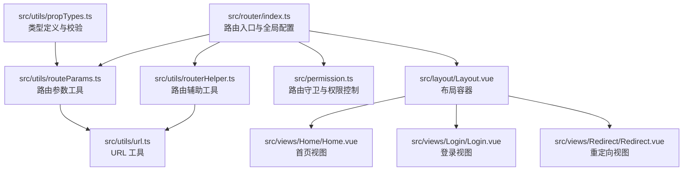
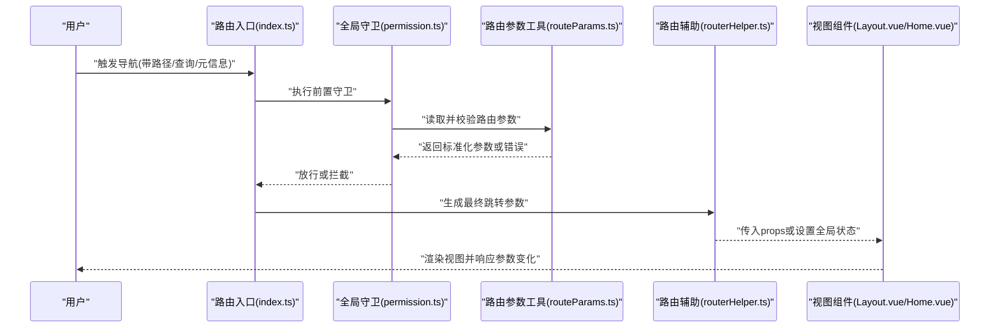
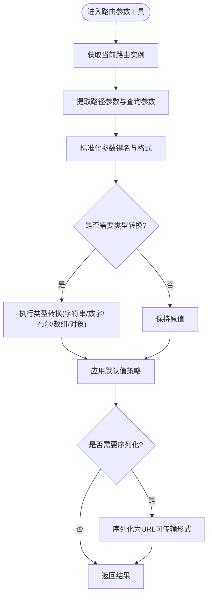
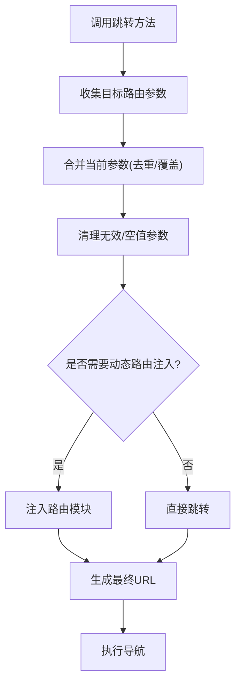
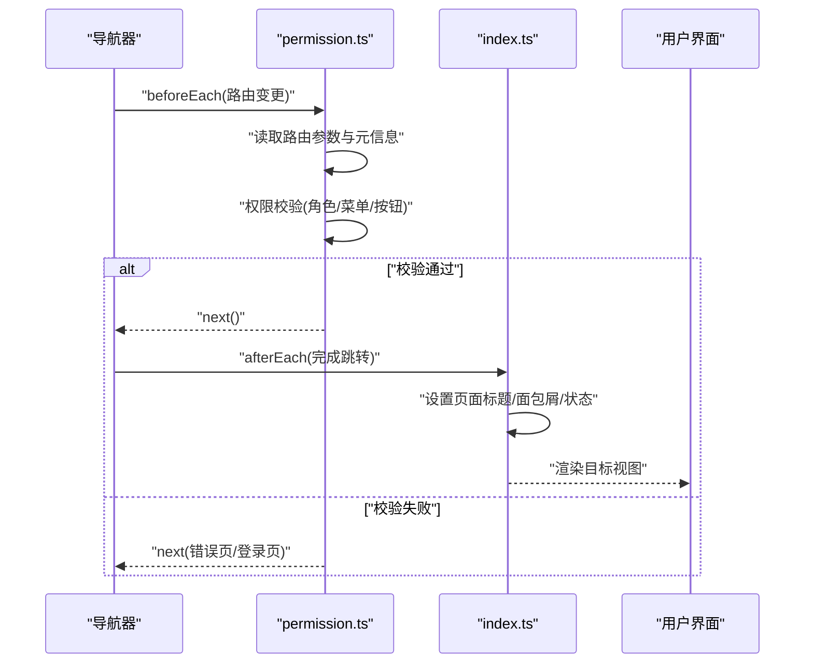
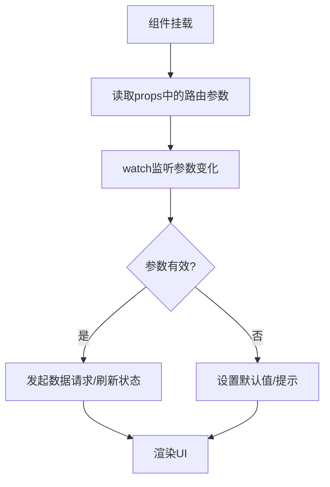
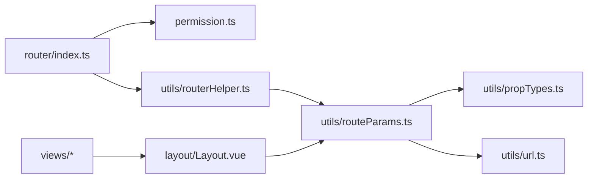

# 路由参数

<cite>
**本文引用的文件**
- [index.ts](file://yudao-ui/yudao-ui-admin-vue3/src/router/index.ts)
- [routeParams.ts](file://yudao-ui/yudao-ui-admin-vue3/src/utils/routeParams.ts)
- [routerHelper.ts](file://yudao-ui/yudao-ui-admin-vue3/src/utils/routerHelper.ts)
- [url.ts](file://yudao-ui/yudao-ui-admin-vue3/src/utils/url.ts)
- [propTypes.ts](file://yudao-ui/yudao-ui-admin-vue3/src/utils/propTypes.ts)
- [permission.ts](file://yudao-ui/yudao-ui-admin-vue3/src/permission.ts)
- [Layout.vue](file://yudao-ui/yudao-ui-admin-vue3/src/layout/Layout.vue)
- [Home.vue](file://yudao-ui/yudao-ui-admin-vue3/src/views/Home/Home.vue)
- [Login.vue](file://yudao-ui/yudao-ui-admin-vue3/src/views/Login/Login.vue)
- [Redirect.vue](file://yudao-ui/yudao-ui-admin-vue3/src/views/Redirect/Redirect.vue)
- [package.json](file://yudao-ui/yudao-ui-admin-vue3/package.json)
</cite>

## 目录
1. [简介](#简介)
2. [项目结构](#项目结构)
3. [核心组件](#核心组件)
4. [架构总览](#架构总览)
5. [详细组件分析](#详细组件分析)
6. [依赖关系分析](#依赖关系分析)
7. [性能考虑](#性能考虑)
8. [故障排查指南](#故障排查指南)
9. [结论](#结论)

## 简介
本文件系统性梳理 ruoyi-vue-pro 前端工程中 Vue Router 的路由参数传递与使用规范，覆盖路径参数、查询参数、路由元信息的定义与访问；参数类型定义与验证机制（含类型转换与默认值处理）；在组件中的 props 传递与响应式更新策略；以及序列化/反序列化处理（数组与对象参数）。同时提供调试技巧与常见问题的解决方案，帮助开发者在复杂业务场景下稳定地使用路由参数。

## 项目结构
ruoyi-vue-pro 的前端路由配置集中在 src/router 目录，配套的路由工具函数位于 src/utils，权限控制逻辑在 src/permission.ts，布局与视图组件在 src/layout 与 src/views 下。整体采用按功能模块拆分的组织方式，便于维护与扩展。

图表来源
- [index.ts:1-200](file://yudao-ui/yudao-ui-admin-vue3/src/router/index.ts#L1-L200)
- [routeParams.ts:1-200](file://yudao-ui/yudao-ui-admin-vue3/src/utils/routeParams.ts#L1-L200)
- [routerHelper.ts:1-200](file://yudao-ui/yudao-ui-admin-vue3/src/utils/routerHelper.ts#L1-L200)
- [url.ts:1-200](file://yudao-ui/yudao-ui-admin-vue3/src/utils/url.ts#L1-L200)
- [propTypes.ts:1-200](file://yudao-ui/yudao-ui-admin-vue3/src/utils/propTypes.ts#L1-L200)
- [permission.ts:1-200](file://yudao-ui/yudao-ui-admin-vue3/src/permission.ts#L1-L200)
- [Layout.vue:1-200](file://yudao-ui/yudao-ui-admin-vue3/src/layout/Layout.vue#L1-L200)
- [Home.vue:1-200](file://yudao-ui/yudao-ui-admin-vue3/src/views/Home/Home.vue#L1-L200)
- [Login.vue:1-200](file://yudao-ui/yudao-ui-admin-vue3/src/views/Login/Login.vue#L1-L200)
- [Redirect.vue:1-200](file://yudao-ui/yudao-ui-admin-vue3/src/views/Redirect/Redirect.vue#L1-L200)

章节来源
- [index.ts:1-200](file://yudao-ui/yudao-ui-admin-vue3/src/router/index.ts#L1-L200)
- [permission.ts:1-200](file://yudao-ui/yudao-ui-admin-vue3/src/permission.ts#L1-L200)

## 核心组件
- 路由入口与配置：集中定义路由表、全局前置守卫、后置钩子等，确保参数解析与权限控制的一致性。
- 路由参数工具：封装路径参数、查询参数的读取、类型转换、默认值处理与序列化/反序列化。
- 路由辅助工具：提供跳转、参数合并、动态路由注入等能力，简化业务层调用。
- 权限控制：基于路由元信息进行权限判断，结合用户角色/菜单/按钮级权限实现细粒度控制。
- 视图与布局：通过 props 或全局状态向组件注入路由参数，支持响应式更新与联动。

章节来源
- [index.ts:1-200](file://yudao-ui/yudao-ui-admin-vue3/src/router/index.ts#L1-L200)
- [routeParams.ts:1-200](file://yudao-ui/yudao-ui-admin-vue3/src/utils/routeParams.ts#L1-L200)
- [routerHelper.ts:1-200](file://yudao-ui/yudao-ui-admin-vue3/src/utils/routerHelper.ts#L1-L200)
- [permission.ts:1-200](file://yudao-ui/yudao-ui-admin-vue3/src/permission.ts#L1-L200)

## 架构总览
下图展示从路由导航到组件渲染过程中，路由参数的流转与处理链路：

图表来源
- [index.ts:1-200](file://yudao-ui/yudao-ui-admin-vue3/src/router/index.ts#L1-L200)
- [permission.ts:1-200](file://yudao-ui/yudao-ui-admin-vue3/src/permission.ts#L1-L200)
- [routeParams.ts:1-200](file://yudao-ui/yudao-ui-admin-vue3/src/utils/routeParams.ts#L1-L200)
- [routerHelper.ts:1-200](file://yudao-ui/yudao-ui-admin-vue3/src/utils/routerHelper.ts#L1-L200)
- [Layout.vue:1-200](file://yudao-ui/yudao-ui-admin-vue3/src/layout/Layout.vue#L1-L200)
- [Home.vue:1-200](file://yudao-ui/yudao-ui-admin-vue3/src/views/Home/Home.vue#L1-L200)

## 详细组件分析

### 路由参数工具（routeParams.ts）
职责与能力
- 读取当前路由的路径参数与查询参数
- 提供类型转换（字符串、数字、布尔、数组、对象）与默认值处理
- 支持序列化/反序列化，适配复杂参数（如数组、对象）
- 与路由元信息配合，实现参数与权限/页面行为的联动

典型流程（读取与转换）

图表来源
- [routeParams.ts:1-200](file://yudao-ui/yudao-ui-admin-vue3/src/utils/routeParams.ts#L1-L200)

章节来源
- [routeParams.ts:1-200](file://yudao-ui/yudao-ui-admin-vue3/src/utils/routeParams.ts#L1-L200)

### 路由辅助工具（routerHelper.ts）
职责与能力
- 封装路由跳转方法，支持保留/替换/追加参数
- 合并与清理无效参数，避免污染 URL
- 动态注入/移除路由模块，支持按需加载
- 统一处理面包屑、标题等与路由相关的 UI 行为

典型流程（参数合并与跳转）

图表来源
- [routerHelper.ts:1-200](file://yudao-ui/yudao-ui-admin-vue3/src/utils/routerHelper.ts#L1-L200)

章节来源
- [routerHelper.ts:1-200](file://yudao-ui/yudao-ui-admin-vue3/src/utils/routerHelper.ts#L1-L200)

### 路由入口与全局守卫（index.ts, permission.ts）
职责与能力
- 在路由入口统一注册路由表与全局守卫
- 在前置守卫中读取并校验路由参数，结合权限系统决定放行
- 在后置钩子中记录日志、设置页面标题、初始化页面状态

典型流程（导航守卫）

图表来源
- [index.ts:1-200](file://yudao-ui/yudao-ui-admin-vue3/src/router/index.ts#L1-L200)
- [permission.ts:1-200](file://yudao-ui/yudao-ui-admin-vue3/src/permission.ts#L1-L200)

章节来源
- [index.ts:1-200](file://yudao-ui/yudao-ui-admin-vue3/src/router/index.ts#L1-L200)
- [permission.ts:1-200](file://yudao-ui/yudao-ui-admin-vue3/src/permission.ts#L1-L200)

### 视图组件中的参数使用（Layout.vue, Home.vue 等）
职责与能力
- 通过 props 接收路由参数，实现组件内响应式更新
- 结合全局状态管理（如 pinia）实现跨组件共享
- 在 watch 中监听参数变化，触发数据刷新或副作用

典型流程（参数驱动的数据刷新）

图表来源
- [Layout.vue:1-200](file://yudao-ui/yudao-ui-admin-vue3/src/layout/Layout.vue#L1-L200)
- [Home.vue:1-200](file://yudao-ui/yudao-ui-admin-vue3/src/views/Home/Home.vue#L1-L200)

章节来源
- [Layout.vue:1-200](file://yudao-ui/yudao-ui-admin-vue3/src/layout/Layout.vue#L1-L200)
- [Home.vue:1-200](file://yudao-ui/yudao-ui-admin-vue3/src/views/Home/Home.vue#L1-L200)

### 类型定义与验证（propTypes.ts, url.ts）
职责与能力
- 定义路由参数的类型约束（如枚举、范围、必填）
- 提供参数校验函数，统一错误处理
- 提供 URL 编解码与安全过滤，防止 XSS 与参数污染

章节来源
- [propTypes.ts:1-200](file://yudao-ui/yudao-ui-admin-vue3/src/utils/propTypes.ts#L1-L200)
- [url.ts:1-200](file://yudao-ui/yudao-ui-admin-vue3/src/utils/url.ts#L1-L200)

## 依赖关系分析
- 路由入口依赖全局守卫与参数工具，确保每次导航都经过统一的参数解析与权限校验。
- 视图组件依赖布局容器与参数工具，通过 props 与状态实现参数驱动的渲染。
- 路由辅助工具作为桥梁，连接路由配置与业务逻辑，降低耦合度。
- 类型定义与 URL 工具为参数处理提供基础保障，提升健壮性与安全性。

图表来源
- [index.ts:1-200](file://yudao-ui/yudao-ui-admin-vue3/src/router/index.ts#L1-L200)
- [permission.ts:1-200](file://yudao-ui/yudao-ui-admin-vue3/src/permission.ts#L1-L200)
- [routerHelper.ts:1-200](file://yudao-ui/yudao-ui-admin-vue3/src/utils/routerHelper.ts#L1-L200)
- [routeParams.ts:1-200](file://yudao-ui/yudao-ui-admin-vue3/src/utils/routeParams.ts#L1-L200)
- [propTypes.ts:1-200](file://yudao-ui/yudao-ui-admin-vue3/src/utils/propTypes.ts#L1-L200)
- [url.ts:1-200](file://yudao-ui/yudao-ui-admin-vue3/src/utils/url.ts#L1-L200)
- [Layout.vue:1-200](file://yudao-ui/yudao-ui-admin-vue3/src/layout/Layout.vue#L1-L200)

章节来源
- [index.ts:1-200](file://yudao-ui/yudao-ui-admin-vue3/src/router/index.ts#L1-L200)
- [permission.ts:1-200](file://yudao-ui/yudao-ui-admin-vue3/src/permission.ts#L1-L200)
- [routerHelper.ts:1-200](file://yudao-ui/yudao-ui-admin-vue3/src/utils/routerHelper.ts#L1-L200)
- [routeParams.ts:1-200](file://yudao-ui/yudao-ui-admin-vue3/src/utils/routeParams.ts#L1-L200)
- [propTypes.ts:1-200](file://yudao-ui/yudao-ui-admin-vue3/src/utils/propTypes.ts#L1-L200)
- [url.ts:1-200](file://yudao-ui/yudao-ui-admin-vue3/src/utils/url.ts#L1-L200)
- [Layout.vue:1-200](file://yudao-ui/yudao-ui-admin-vue3/src/layout/Layout.vue#L1-L200)

## 性能考虑
- 参数解析与校验应尽量在路由守卫阶段完成，减少组件重复计算。
- 对于高频参数变化的场景，建议使用防抖/节流策略，避免频繁刷新。
- 复杂参数（数组/对象）建议采用懒加载或分页策略，降低初始渲染压力。
- 使用路由辅助工具统一处理参数合并，避免冗余参数导致的 URL 过长与缓存失效。

## 故障排查指南
- 参数类型异常
  - 现象：数值/布尔类型显示为字符串或 undefined
  - 处理：在参数工具中增加类型转换与默认值策略，并在类型定义中明确约束
  - 参考：[routeParams.ts:1-200](file://yudao-ui/yudao-ui-admin-vue3/src/utils/routeParams.ts#L1-L200)、[propTypes.ts:1-200](file://yudao-ui/yudao-ui-admin-vue3/src/utils/propTypes.ts#L1-L200)
- 权限拦截导致无法进入页面
  - 现象：导航被拦截至登录页或错误页
  - 处理：检查路由元信息与权限配置，确认用户角色/菜单/按钮权限是否正确
  - 参考：[permission.ts:1-200](file://yudao-ui/yudao-ui-admin-vue3/src/permission.ts#L1-L200)
- 参数未生效或丢失
  - 现象：URL 正确但组件未收到参数
  - 处理：确认组件 props 是否正确接收，或是否通过全局状态共享；检查路由辅助工具的参数合并逻辑
  - 参考：[routerHelper.ts:1-200](file://yudao-ui/yudao-ui-admin-vue3/src/utils/routerHelper.ts#L1-L200)、[Layout.vue:1-200](file://yudao-ui/yudao-ui-admin-vue3/src/layout/Layout.vue#L1-L200)
- 复杂参数序列化问题
  - 现象：数组/对象参数在 URL 中显示异常
  - 处理：使用专用序列化/反序列化函数，确保编码与解码一致
  - 参考：[routeParams.ts:1-200](file://yudao-ui/yudao-ui-admin-vue3/src/utils/routeParams.ts#L1-L200)、[url.ts:1-200](file://yudao-ui/yudao-ui-admin-vue3/src/utils/url.ts#L1-L200)
- 调试技巧
  - 在路由守卫中打印关键参数与元信息，定位问题来源
  - 使用浏览器开发者工具的网络面板与源码断点，跟踪参数传递链路
  - 在组件中添加 watch 监听，观察参数变化与副作用触发时机
  - 参考：[index.ts:1-200](file://yudao-ui/yudao-ui-admin-vue3/src/router/index.ts#L1-L200)、[permission.ts:1-200](file://yudao-ui/yudao-ui-admin-vue3/src/permission.ts#L1-L200)

章节来源
- [routeParams.ts:1-200](file://yudao-ui/yudao-ui-admin-vue3/src/utils/routeParams.ts#L1-L200)
- [routerHelper.ts:1-200](file://yudao-ui/yudao-ui-admin-vue3/src/utils/routerHelper.ts#L1-L200)
- [permission.ts:1-200](file://yudao-ui/yudao-ui-admin-vue3/src/permission.ts#L1-L200)
- [url.ts:1-200](file://yudao-ui/yudao-ui-admin-vue3/src/utils/url.ts#L1-L200)
- [index.ts:1-200](file://yudao-ui/yudao-ui-admin-vue3/src/router/index.ts#L1-L200)
- [Layout.vue:1-200](file://yudao-ui/yudao-ui-admin-vue3/src/layout/Layout.vue#L1-L200)

## 结论
通过将路由参数工具、路由辅助工具、全局守卫与视图组件有机结合，ruoyi-vue-pro 实现了对路径参数、查询参数与路由元信息的统一管理。遵循本文提供的类型定义、验证机制、序列化/反序列化策略与调试方法，可在复杂业务场景中稳定地传递与使用路由参数，提升开发效率与用户体验。