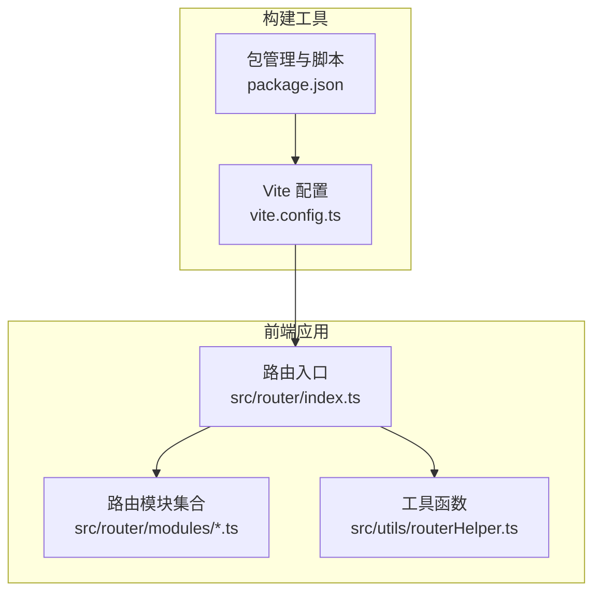
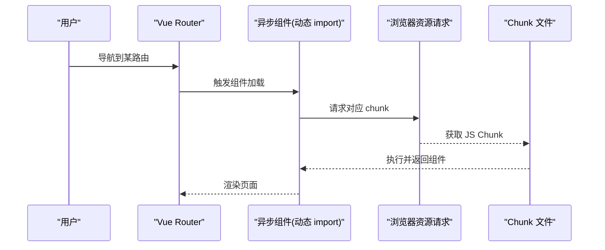
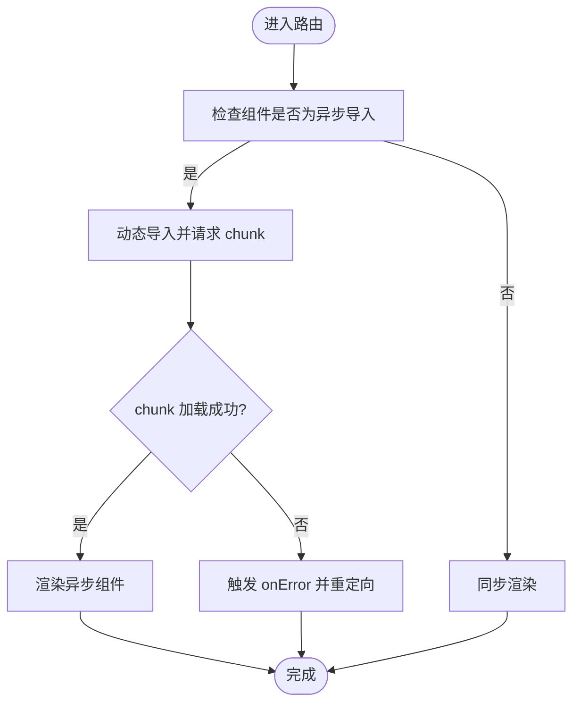
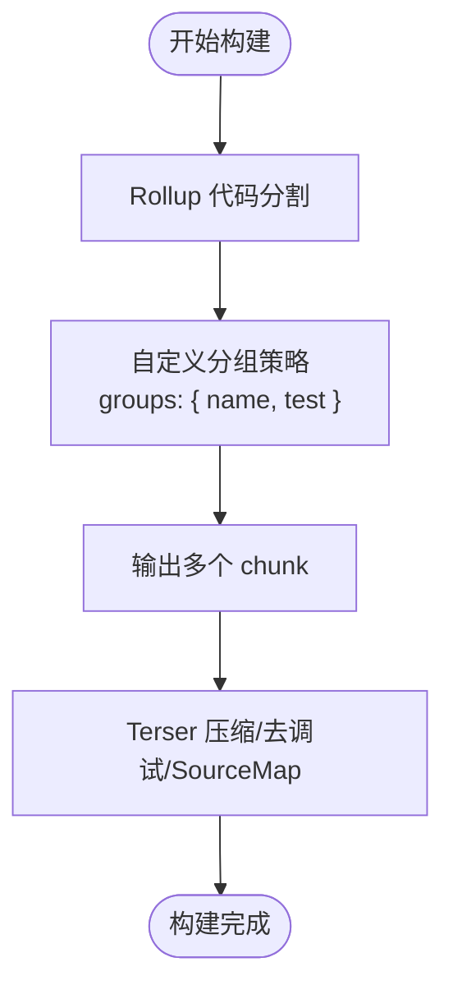
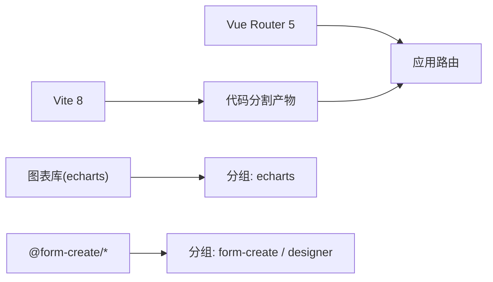

# 路由懒加载

<cite>
**本文引用的文件**
- [src/router/index.ts](file://yudao-ui/yudao-ui-admin-vue3/src/router/index.ts)
- [src/router/modules/remaining.ts](file://yudao-ui/yudao-ui-admin-vue3/src/router/modules/remaining.ts)
- [vite.config.ts](file://yudao-ui/yudao-ui-admin-vue3/vite.config.ts)
- [package.json](file://yudao-ui/yudao-ui-admin-vue3/package.json)
- [src/utils/routerHelper.ts](file://yudao-ui/yudao-ui-admin-vue3/src/utils/routerHelper.ts)
</cite>

## 目录
1. [引言](#引言)
2. [项目结构](#项目结构)
3. [核心组件](#核心组件)
4. [架构总览](#架构总览)
5. [详细组件分析](#详细组件分析)
6. [依赖分析](#依赖分析)
7. [性能考量](#性能考量)
8. [故障排查指南](#故障排查指南)
9. [结论](#结论)
10. [附录](#附录)

## 引言
本文件围绕“路由懒加载”主题，结合芋道 ruoyi-vue-pro 前端工程（Vue 3 + Vite）的实际实现，系统阐述 Vue Router 的懒加载原理、代码分割与异步组件用法、路由级懒加载配置、Vite 的支持与优化策略，并给出最佳实践、性能监控与调试方法及常见问题解决方案。读者无需深入源码即可理解并应用。

## 项目结构
- 路由入口与配置位于前端工程的路由模块，采用“主路由 + 动态导入”的方式组织页面级组件，实现按需加载。
- 构建配置位于 Vite，通过 Rollup 的代码分割能力与自定义分组策略，控制 chunk 的生成与体积。
- 项目使用 TypeScript 与 Vue Router 5，运行时通过动态 import 实现异步组件，构建期由 Vite/Rollup 进行代码分割。

图表来源
- [src/router/index.ts:1-47](file://yudao-ui/yudao-ui-admin-vue3/src/router/index.ts#L1-L47)
- [src/router/modules/remaining.ts:1-830](file://yudao-ui/yudao-ui-admin-vue3/src/router/modules/remaining.ts#L1-L830)
- [vite.config.ts:1-102](file://yudao-ui/yudao-ui-admin-vue3/vite.config.ts#L1-L102)
- [package.json:1-158](file://yudao-ui/yudao-ui-admin-vue3/package.json#L1-L158)

章节来源
- [src/router/index.ts:1-47](file://yudao-ui/yudao-ui-admin-vue3/src/router/index.ts#L1-L47)
- [src/router/modules/remaining.ts:1-830](file://yudao-ui/yudao-ui-admin-vue3/src/router/modules/remaining.ts#L1-L830)
- [vite.config.ts:1-102](file://yudao-ui/yudao-ui-admin-vue3/vite.config.ts#L1-L102)
- [package.json:1-158](file://yudao-ui/yudao-ui-admin-vue3/package.json#L1-L158)

## 核心组件
- 路由实例与错误处理：在路由入口中创建路由实例，配置历史模式、严格模式、滚动行为；并注册动态导入错误监听，自动重定向以修复构建后 chunk 哈希变化导致的加载失败。
- 路由定义与懒加载：在路由模块中，页面级组件通过动态 import 返回 Promise 的方式声明为异步组件，实现按需加载。
- 构建与代码分割：Vite 配置中启用 Rollup 的代码分割，并通过自定义分组策略将第三方依赖拆分为独立 chunk，减少重复打包与体积膨胀。

章节来源
- [src/router/index.ts:1-47](file://yudao-ui/yudao-ui-admin-vue3/src/router/index.ts#L1-L47)
- [src/router/modules/remaining.ts:1-830](file://yudao-ui/yudao-ui-admin-vue3/src/router/modules/remaining.ts#L1-L830)
- [vite.config.ts:76-98](file://yudao-ui/yudao-ui-admin-vue3/vite.config.ts#L76-L98)

## 架构总览
下图展示了从用户访问到页面渲染的关键链路，重点体现“路由 -> 异步组件 -> 代码分割 -> chunk 加载”的过程。

图表来源
- [src/router/index.ts:22-30](file://yudao-ui/yudao-ui-admin-vue3/src/router/index.ts#L22-L30)
- [src/router/modules/remaining.ts:44-44](file://yudao-ui/yudao-ui-admin-vue3/src/router/modules/remaining.ts#L44-L44)

## 详细组件分析

### 组件 A 分析：路由懒加载与动态导入
- 实现要点
  - 页面级组件通过动态 import 声明为异步组件，构建期由 Vite/Rollup 自动进行代码分割。
  - 路由入口中注册 onError 回调，捕获动态导入失败错误并自动重定向，提升健壮性。
  - 使用工具函数统一布局组件，保持路由定义风格一致。

图表来源
- [src/router/index.ts:22-30](file://yudao-ui/yudao-ui-admin-vue3/src/router/index.ts#L22-L30)
- [src/router/modules/remaining.ts:44-44](file://yudao-ui/yudao-ui-admin-vue3/src/router/modules/remaining.ts#L44-L44)

章节来源
- [src/router/index.ts:1-47](file://yudao-ui/yudao-ui-admin-vue3/src/router/index.ts#L1-L47)
- [src/router/modules/remaining.ts:1-830](file://yudao-ui/yudao-ui-admin-vue3/src/router/modules/remaining.ts#L1-L830)
- [src/utils/routerHelper.ts](file://yudao-ui/yudao-ui-admin-vue3/src/utils/routerHelper.ts)

### 组件 B 分析：Vite 代码分割与分组策略
- 实现要点
  - 在构建配置中开启 Rollup 代码分割，并通过 groups 自定义分组，将常用第三方库（如图表、表单设计器等）单独打包，降低重复依赖带来的体积与缓存失效风险。
  - 通过 Terser 压缩与可选 SourceMap 控制产物体积与调试成本。
  - 通过 resolve.alias 与路径解析，保证开发与构建的一致性。

图表来源
- [vite.config.ts:76-98](file://yudao-ui/yudao-ui-admin-vue3/vite.config.ts#L76-L98)

章节来源
- [vite.config.ts:1-102](file://yudao-ui/yudao-ui-admin-vue3/vite.config.ts#L1-L102)
- [package.json:1-158](file://yudao-ui/yudao-ui-admin-vue3/package.json#L1-L158)

### 组件 C 分析：路由级别懒加载配置与 chunk 命名
- 实践建议
  - 使用动态 import 作为异步组件的声明方式，构建工具会根据调用位置与依赖关系自动生成 chunk 名称。
  - 对于大型页面或复杂业务模块，建议在路由层直接使用动态 import，避免一次性引入所有页面组件。
  - 对于高频访问但体量较大的第三方库，通过自定义分组策略单独打包，提升缓存命中率。
  - 在需要时可通过魔法注释（如 Vite 支持的注释语法）为特定 chunk 提供更友好的名称，便于调试与分析。

章节来源
- [src/router/modules/remaining.ts:1-830](file://yudao-ui/yudao-ui-admin-vue3/src/router/modules/remaining.ts#L1-L830)
- [vite.config.ts:76-98](file://yudao-ui/yudao-ui-admin-vue3/vite.config.ts#L76-L98)

## 依赖分析
- 路由与构建依赖
  - Vue Router 5 与 Vite 8 提供了稳定的异步组件与代码分割能力。
  - 项目脚本通过 Vite CLI 启动开发服务器与生产构建，确保开发体验与产物质量。
- 第三方库与分组
  - 通过自定义分组策略将图表与表单设计器类库独立打包，减少主包体积并提升缓存效率。

图表来源
- [package.json:78-87](file://yudao-ui/yudao-ui-admin-vue3/package.json#L78-L87)
- [vite.config.ts:89-95](file://yudao-ui/yudao-ui-admin-vue3/vite.config.ts#L89-L95)

章节来源
- [package.json:1-158](file://yudao-ui/yudao-ui-admin-vue3/package.json#L1-L158)
- [vite.config.ts:1-102](file://yudao-ui/yudao-ui-admin-vue3/vite.config.ts#L1-L102)

## 性能考量
- 代码分割与缓存
  - 利用 Vite/Rollup 的自动分块与自定义分组，将稳定不变的第三方库独立打包，提升浏览器缓存命中率。
- 资源体积控制
  - 开启 Terser 压缩与条件化移除 console/debugger，降低产物体积。
- 路由加载策略
  - 对非首屏路由采用懒加载，减少初始包体积；对高频访问的页面可考虑预加载策略（见“最佳实践”）。
- 调试与监控
  - 结合浏览器网络面板观察 chunk 加载情况；利用路由 onError 机制捕获并记录动态导入异常，辅助定位问题。

章节来源
- [vite.config.ts:76-98](file://yudao-ui/yudao-ui-admin-vue3/vite.config.ts#L76-L98)
- [src/router/index.ts:22-30](file://yudao-ui/yudao-ui-admin-vue3/src/router/index.ts#L22-L30)

## 故障排查指南
- 动态导入失败
  - 现象：控制台提示“Failed to fetch dynamically imported module”或类似错误。
  - 处理：路由入口已注册 onError 回调，自动重定向到目标页面；同时可在浏览器网络面板检查对应 chunk 是否存在且未被缓存污染。
- 构建后 chunk 哈希变化
  - 现象：热更新或版本升级后，chunk 名称变化导致旧缓存失效。
  - 处理：通过 onError 自动刷新页面；或在构建配置中启用长效缓存策略（如 content-hash）并配合 CDN 缓存头。
- 预加载与并发控制
  - 建议：对即将访问的路由使用预加载策略，避免首屏阻塞；同时注意控制并发请求数量，避免网络拥塞。

章节来源
- [src/router/index.ts:22-30](file://yudao-ui/yudao-ui-admin-vue3/src/router/index.ts#L22-L30)

## 结论
ruoyi-vue-pro 的路由懒加载方案以“动态 import + Vite 代码分割 + 自定义分组”为核心，既满足了按需加载的需求，又通过分组策略提升了缓存效率与加载稳定性。结合 onError 错误处理与构建期压缩优化，整体具备良好的性能与可维护性。建议在实际项目中遵循“路由级懒加载 + 路由分组 + 预加载策略”的组合拳，持续优化首屏与交互体验。

## 附录
- 最佳实践清单
  - 路由分组：将稳定第三方库独立打包，减少主包体积。
  - 按需加载：仅对非首屏页面使用懒加载，避免过度拆分。
  - 预加载策略：对即将访问的路由进行预加载，平衡首屏与后续体验。
  - 错误兜底：保留 onError 回调，自动重定向修复动态导入异常。
  - 监控与调试：使用浏览器网络面板与路由错误日志，持续观测 chunk 加载与异常。