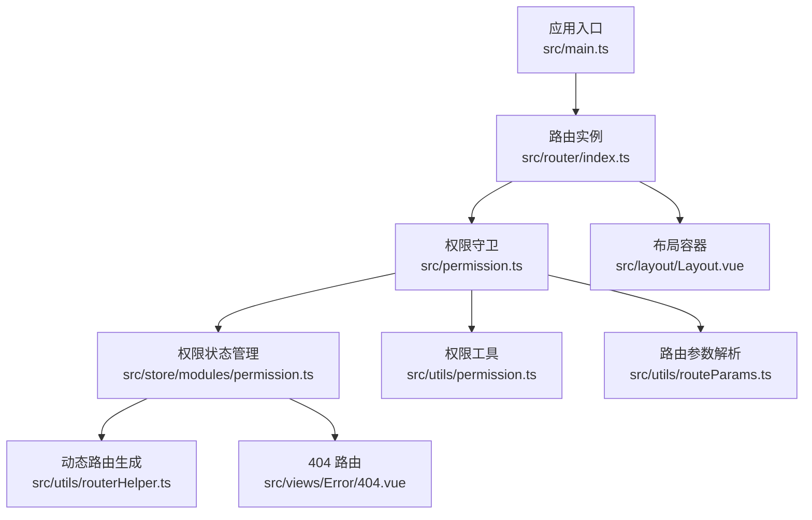
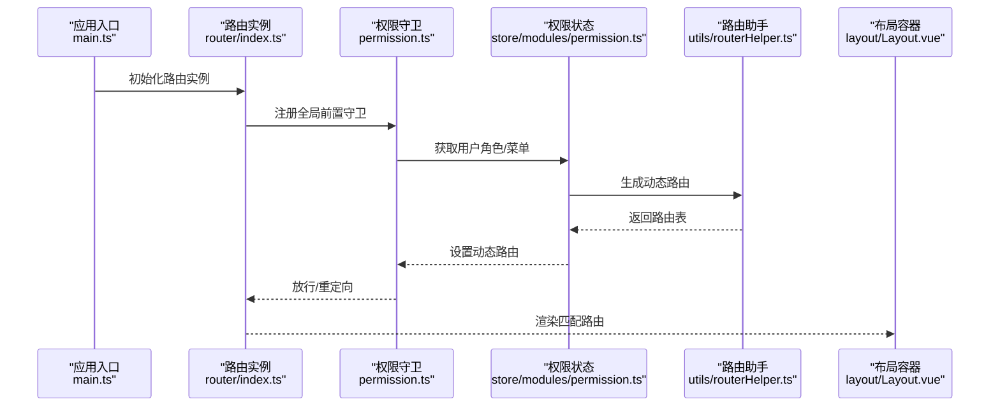
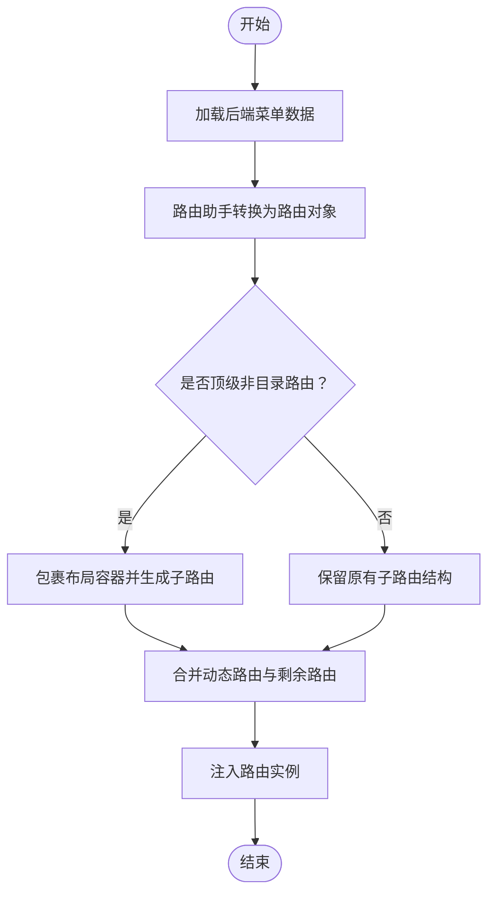
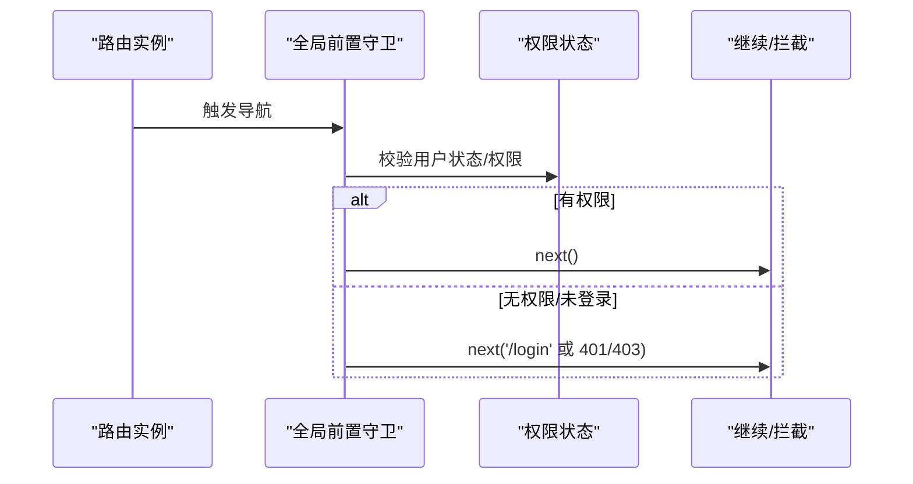
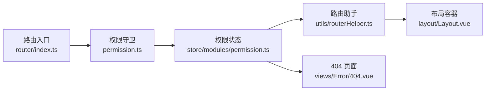

# 路由系统

<cite>
**本文引用的文件**
- [src/router/index.ts](file://yudao-ui/yudao-ui-admin-vue3/src/router/index.ts)
- [src/permission.ts](file://yudao-ui/yudao-ui-admin-vue3/src/permission.ts)
- [src/store/modules/permission.ts](file://yudao-ui/yudao-ui-admin-vue3/src/store/modules/permission.ts)
- [src/utils/routerHelper.ts](file://yudao-ui/yudao-ui-admin-vue3/src/utils/routerHelper.ts)
- [src/utils/permission.ts](file://yudao-ui/yudao-ui-admin-vue3/src/utils/permission.ts)
- [src/utils/routeParams.ts](file://yudao-ui/yudao-ui-admin-vue3/src/utils/routeParams.ts)
- [src/layout/Layout.vue](file://yudao-ui/yudao-ui-admin-vue3/src/layout/Layout.vue)
- [src/views/Error/404.vue](file://yudao-ui/yudao-ui-admin-vue3/src/views/Error/404.vue)
- [src/main.ts](file://yudao-ui/yudao-ui-admin-vue3/src/main.ts)
</cite>

## 目录
1. [简介](#简介)
2. [项目结构](#项目结构)
3. [核心组件](#核心组件)
4. [架构总览](#架构总览)
5. [详细组件分析](#详细组件分析)
6. [依赖关系分析](#依赖关系分析)
7. [性能考虑](#性能考虑)
8. [故障排查指南](#故障排查指南)
9. [结论](#结论)
10. [附录](#附录)

## 简介
本文件面向“芋道 ruoyi-vue-pro”前端工程，系统性梳理其基于 Vue Router 5 的路由体系与权限控制机制。内容涵盖：
- 路由定义、嵌套路由与动态路由的实现方式
- 权限路由的元信息配置、权限判断与路由守卫联动
- 动态菜单生成与后端菜单数据到前端路由的映射
- 导航守卫（全局前置、全局后置、路由独享）的使用
- 路由懒加载（代码分割与异步组件）
- 路由参数与查询参数处理
- 路由缓存与页面状态保持策略
- 调试与性能优化建议

## 项目结构
ruoyi-vue-pro 前端采用模块化组织，路由相关的核心位置如下：
- 路由入口与模块注册：src/router/index.ts
- 权限守卫与导航拦截：src/permission.ts
- 权限状态管理（Pinia）：src/store/modules/permission.ts
- 路由辅助工具：src/utils/routerHelper.ts、src/utils/routeParams.ts
- 权限工具：src/utils/permission.ts
- 布局容器：src/layout/Layout.vue
- 404 页面：src/views/Error/404.vue
- 应用入口：src/main.ts

图表来源
- [src/main.ts](file://yudao-ui/yudao-ui-admin-vue3/src/main.ts)
- [src/router/index.ts](file://yudao-ui/yudao-ui-admin-vue3/src/router/index.ts)
- [src/permission.ts](file://yudao-ui/yudao-ui-admin-vue3/src/permission.ts)
- [src/store/modules/permission.ts](file://yudao-ui/yudao-ui-admin-vue3/src/store/modules/permission.ts)
- [src/utils/routerHelper.ts](file://yudao-ui/yudao-ui-admin-vue3/src/utils/routerHelper.ts)
- [src/views/Error/404.vue](file://yudao-ui/yudao-ui-admin-vue3/src/views/Error/404.vue)
- [src/layout/Layout.vue](file://yudao-ui/yudao-ui-admin-vue3/src/layout/Layout.vue)
- [src/utils/permission.ts](file://yudao-ui/yudao-ui-admin-vue3/src/utils/permission.ts)
- [src/utils/routeParams.ts](file://yudao-ui/yudao-ui-admin-vue3/src/utils/routeParams.ts)

章节来源
- [src/router/index.ts](file://yudao-ui/yudao-ui-admin-vue3/src/router/index.ts)
- [src/permission.ts](file://yudao-ui/yudao-ui-admin-vue3/src/permission.ts)
- [src/store/modules/permission.ts](file://yudao-ui/yudao-ui-admin-vue3/src/store/modules/permission.ts)
- [src/utils/routerHelper.ts](file://yudao-ui/yudao-ui-admin-vue3/src/utils/routerHelper.ts)
- [src/utils/routeParams.ts](file://yudao-ui/yudao-ui-admin-vue3/src/utils/routeParams.ts)
- [src/utils/permission.ts](file://yudao-ui/yudao-ui-admin-vue3/src/utils/permission.ts)
- [src/layout/Layout.vue](file://yudao-ui/yudao-ui-admin-vue3/src/layout/Layout.vue)
- [src/views/Error/404.vue](file://yudao-ui/yudao-ui-admin-vue3/src/views/Error/404.vue)
- [src/main.ts](file://yudao-ui/yudao-ui-admin-vue3/src/main.ts)

## 核心组件
- 路由实例与模块化路由
  - 在路由入口中创建并挂载路由实例，通过模块化方式组织业务路由，便于扩展与维护。
- 权限守卫与导航拦截
  - 在全局前置守卫中执行权限判断与用户状态校验，必要时重定向至登录或 401/403 页面。
- 权限状态管理（Pinia）
  - 维护动态路由集合、菜单路由集合与菜单根路径等状态，提供生成动态路由的能力。
- 路由辅助工具
  - 提供菜单到路由的映射、动态路径解析、参数与查询参数处理等能力。
- 布局与错误页
  - 使用统一布局容器承载页面内容；404 页面作为兜底路由。

章节来源
- [src/router/index.ts](file://yudao-ui/yudao-ui-admin-vue3/src/router/index.ts)
- [src/permission.ts](file://yudao-ui/yudao-ui-admin-vue3/src/permission.ts)
- [src/store/modules/permission.ts](file://yudao-ui/yudao-ui-admin-vue3/src/store/modules/permission.ts)
- [src/utils/routerHelper.ts](file://yudao-ui/yudao-ui-admin-vue3/src/utils/routerHelper.ts)
- [src/layout/Layout.vue](file://yudao-ui/yudao-ui-admin-vue3/src/layout/Layout.vue)
- [src/views/Error/404.vue](file://yudao-ui/yudao-ui-admin-vue3/src/views/Error/404.vue)

## 架构总览
下图展示从应用启动到路由渲染的关键流程，以及权限守卫与动态路由生成之间的协作关系。

图表来源
- [src/main.ts](file://yudao-ui/yudao-ui-admin-vue3/src/main.ts)
- [src/router/index.ts](file://yudao-ui/yudao-ui-admin-vue3/src/router/index.ts)
- [src/permission.ts](file://yudao-ui/yudao-ui-admin-vue3/src/permission.ts)
- [src/store/modules/permission.ts](file://yudao-ui/yudao-ui-admin-vue3/src/store/modules/permission.ts)
- [src/utils/routerHelper.ts](file://yudao-ui/yudao-ui-admin-vue3/src/utils/routerHelper.ts)
- [src/layout/Layout.vue](file://yudao-ui/yudao-ui-admin-vue3/src/layout/Layout.vue)

## 详细组件分析

### 路由定义与模块化
- 路由入口负责创建路由实例，并引入模块化路由文件以组织功能域路由。
- 通过模块化拆分，便于按业务域扩展与维护，同时减少主入口复杂度。

章节来源
- [src/router/index.ts](file://yudao-ui/yudao-ui-admin-vue3/src/router/index.ts)

### 嵌套路由与布局容器
- 布局容器作为父级路由，承载子路由视图，实现统一头部、侧边栏与内容区的布局。
- 顶级非目录路由会自动包裹布局容器，确保页面具备一致的外层结构。

章节来源
- [src/layout/Layout.vue](file://yudao-ui/yudao-ui-admin-vue3/src/layout/Layout.vue)
- [src/utils/routerHelper.ts](file://yudao-ui/yudao-ui-admin-vue3/src/utils/routerHelper.ts)

### 动态路由与菜单映射
- 后端返回菜单树，前端通过路由助手将其转换为路由对象数组。
- 转换过程中会处理路由名称、路径、元信息、重定向、组件引用等字段，并对顶级非目录路由进行特殊包装。
- 动态路由与剩余固定路由合并后注入到路由实例，形成最终可用的路由表。

图表来源
- [src/utils/routerHelper.ts](file://yudao-ui/yudao-ui-admin-vue3/src/utils/routerHelper.ts)
- [src/store/modules/permission.ts](file://yudao-ui/yudao-ui-admin-vue3/src/store/modules/permission.ts)

章节来源
- [src/utils/routerHelper.ts](file://yudao-ui/yudao-ui-admin-vue3/src/utils/routerHelper.ts)
- [src/store/modules/permission.ts](file://yudao-ui/yudao-ui-admin-vue3/src/store/modules/permission.ts)

### 权限路由与导航守卫
- 全局前置守卫：在每次路由切换前执行权限校验，若未登录或无权限则跳转至相应页面。
- 路由独享守卫：针对特定路由设置权限校验逻辑，实现细粒度控制。
- 全局后置钩子：用于统计、埋点或页面标题更新等副作用操作。

图表来源
- [src/permission.ts](file://yudao-ui/yudao-ui-admin-vue3/src/permission.ts)
- [src/store/modules/permission.ts](file://yudao-ui/yudao-ui-admin-vue3/src/store/modules/permission.ts)

章节来源
- [src/permission.ts](file://yudao-ui/yudao-ui-admin-vue3/src/permission.ts)
- [src/store/modules/permission.ts](file://yudao-ui/yudao-ui-admin-vue3/src/store/modules/permission.ts)

### 路由懒加载与代码分割
- 动态导入组件实现懒加载，结合路由级别拆分，降低首屏体积。
- 在动态路由生成时，根据组件路径动态引入对应模块，提升运行时性能。

章节来源
- [src/store/modules/permission.ts](file://yudao-ui/yudao-ui-admin-vue3/src/store/modules/permission.ts)
- [src/utils/routerHelper.ts](file://yudao-ui/yudao-ui-admin-vue3/src/utils/routerHelper.ts)

### 路由参数与查询参数处理
- 支持从字符串解析路由路径、查询参数与哈希片段。
- 支持动态路径参数替换与命名路由定位，便于在菜单点击或外部链接跳转时携带参数。
- 提供统一的路由位置构造器，兼容命名路由与路径两种形式。

章节来源
- [src/utils/routeParams.ts](file://yudao-ui/yudao-ui-admin-vue3/src/utils/routeParams.ts)

### 路由缓存与页面状态保持
- 利用 keep-alive 与路由元信息配合，实现多页签与页面状态持久化。
- 菜单标签路由集合由权限状态管理维护，结合布局容器内的标签页组件实现切换不刷新。

章节来源
- [src/store/modules/permission.ts](file://yudao-ui/yudao-ui-admin-vue3/src/store/modules/permission.ts)
- [src/layout/Layout.vue](file://yudao-ui/yudao-ui-admin-vue3/src/layout/Layout.vue)

### 错误处理与兜底路由
- 动态路由末尾追加 404 页面，确保未知路径被正确捕获。
- 通过 meta.hidden 与 breadcrumb 控制 404 在菜单中的可见性。

章节来源
- [src/store/modules/permission.ts](file://yudao-ui/yudao-ui-admin-vue3/src/store/modules/permission.ts)
- [src/views/Error/404.vue](file://yudao-ui/yudao-ui-admin-vue3/src/views/Error/404.vue)

## 依赖关系分析
- 路由入口依赖于权限守卫与权限状态管理，以保证路由初始化阶段即可完成权限校验与动态路由注入。
- 权限状态管理依赖路由助手进行菜单到路由的映射，并与布局容器协同实现页面渲染。
- 路由助手依赖模块化组件映射，确保动态路由能正确解析到具体视图组件。

图表来源
- [src/router/index.ts](file://yudao-ui/yudao-ui-admin-vue3/src/router/index.ts)
- [src/permission.ts](file://yudao-ui/yudao-ui-admin-vue3/src/permission.ts)
- [src/store/modules/permission.ts](file://yudao-ui/yudao-ui-admin-vue3/src/store/modules/permission.ts)
- [src/utils/routerHelper.ts](file://yudao-ui/yudao-ui-admin-vue3/src/utils/routerHelper.ts)
- [src/layout/Layout.vue](file://yudao-ui/yudao-ui-admin-vue3/src/layout/Layout.vue)
- [src/views/Error/404.vue](file://yudao-ui/yudao-ui-admin-vue3/src/views/Error/404.vue)

章节来源
- [src/router/index.ts](file://yudao-ui/yudao-ui-admin-vue3/src/router/index.ts)
- [src/permission.ts](file://yudao-ui/yudao-ui-admin-vue3/src/permission.ts)
- [src/store/modules/permission.ts](file://yudao-ui/yudao-ui-admin-vue3/src/store/modules/permission.ts)
- [src/utils/routerHelper.ts](file://yudao-ui/yudao-ui-admin-vue3/src/utils/routerHelper.ts)
- [src/layout/Layout.vue](file://yudao-ui/yudao-ui-admin-vue3/src/layout/Layout.vue)
- [src/views/Error/404.vue](file://yudao-ui/yudao-ui-admin-vue3/src/views/Error/404.vue)

## 性能考虑
- 代码分割与懒加载：通过动态导入组件与路由级拆分，降低首屏资源压力。
- 路由扁平化：在生成动态路由后进行多级路由扁平化，减少层级深度带来的匹配开销。
- 缓存策略：利用缓存存储角色路由与菜单数据，避免重复请求与重复计算。
- Keep-alive 优化：仅对需要保持状态的页面启用缓存，避免不必要的内存占用。

## 故障排查指南
- 登录后无法进入受控页面
  - 检查权限守卫是否正确获取用户状态与角色路由缓存。
  - 确认动态路由生成是否成功，404 路由是否正确注入。
- 菜单点击无响应或跳转异常
  - 核对菜单项到路由的映射关系，确认路径、参数与命名路由配置。
  - 使用路由参数解析工具检查传入参数是否正确。
- 页面刷新后状态丢失
  - 检查路由元信息中 keep-alive 与缓存键配置。
  - 确认菜单标签路由集合是否正确维护。

章节来源
- [src/permission.ts](file://yudao-ui/yudao-ui-admin-vue3/src/permission.ts)
- [src/store/modules/permission.ts](file://yudao-ui/yudao-ui-admin-vue3/src/store/modules/permission.ts)
- [src/utils/routeParams.ts](file://yudao-ui/yudao-ui-admin-vue3/src/utils/routeParams.ts)

## 结论
ruoyi-vue-pro 的路由系统以 Vue Router 5 为基础，结合 Pinia 状态管理与自研路由助手，实现了灵活的动态路由与权限控制。通过模块化组织、懒加载与缓存策略，兼顾了可维护性与性能表现。建议在后续迭代中持续完善路由调试工具与性能监控指标，进一步提升用户体验与开发效率。

## 附录
- 路由调试建议
  - 使用浏览器开发者工具的 Vue Devtools 观察路由与状态变化。
  - 在权限守卫中输出关键日志（如用户状态、角色路由、目标路径），便于定位问题。
- 性能优化建议
  - 对高频访问页面启用 keep-alive 并合理设置缓存键。
  - 将大型页面组件拆分为更小的路由级模块，提升按需加载效率。
  - 对动态路由生成过程增加缓存与去重逻辑，避免重复计算。