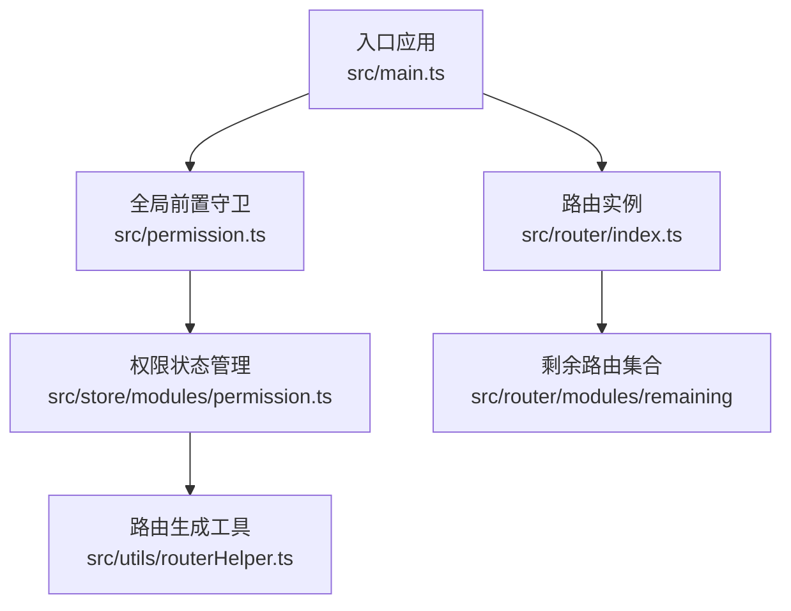
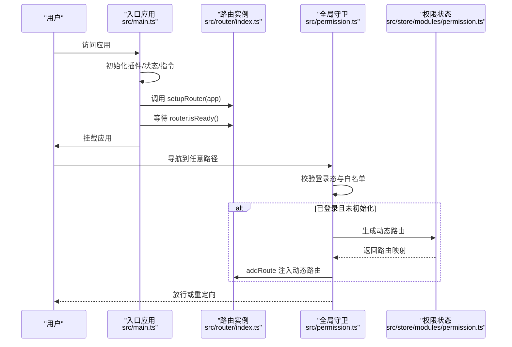
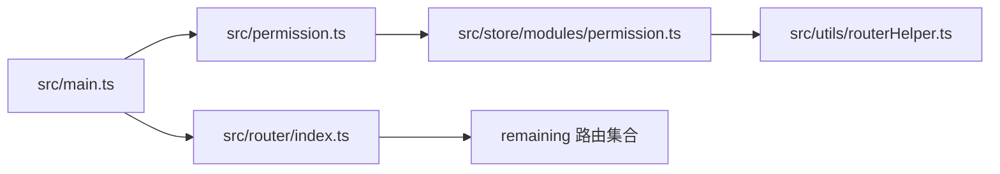

# 路由配置

<cite>
**本文引用的文件**
- [src/router/index.ts](file://yudao-ui/yudao-ui-admin-vue3/src/router/index.ts)
- [src/permission.ts](file://yudao-ui/yudao-ui-admin-vue3/src/permission.ts)
- [src/main.ts](file://yudao-ui/yudao-ui-admin-vue3/src/main.ts)
- [src/utils/routerHelper.ts](file://yudao-ui/yudao-ui-admin-vue3/src/utils/routerHelper.ts)
- [src/store/modules/permission.ts](file://yudao-ui/yudao-ui-admin-vue3/src/store/modules/permission.ts)
</cite>

## 目录
1. [简介](#简介)
2. [项目结构](#项目结构)
3. [核心组件](#核心组件)
4. [架构总览](#架构总览)
5. [详细组件分析](#详细组件分析)
6. [依赖分析](#依赖分析)
7. [性能考虑](#性能考虑)
8. [故障排查指南](#故障排查指南)
9. [结论](#结论)

## 简介
本文件面向“芋道 ruoyi-vue-pro”前端工程，系统化梳理 Vue Router 5 的路由配置与运行机制，覆盖以下主题：
- 路由实例创建与历史模式选择（HTML5 History 与 Hash 模式）
- 严格模式与滚动行为配置
- 路由表结构与 RouteRecordRaw 类型使用
- 路由错误处理（动态导入失败自动重定向）
- 路由重置（白名单管理与清理策略）
- 路由初始化与应用挂载流程

## 项目结构
ruoyi-vue-pro 前端采用模块化组织，路由相关代码集中在 src/router 目录，并通过 src/permission.ts 进行全局守卫与动态路由注入，最终在 src/main.ts 中完成路由实例挂载。

图表来源
- [src/main.ts:28-44](file://yudao-ui/yudao-ui-admin-vue3/src/main.ts#L28-L44)
- [src/router/index.ts:1-47](file://yudao-ui/yudao-ui-admin-vue3/src/router/index.ts#L1-L47)
- [src/permission.ts:1-79](file://yudao-ui/yudao-ui-admin-vue3/src/permission.ts#L1-L79)
- [src/store/modules/permission.ts:17-56](file://yudao-ui/yudao-ui-admin-vue3/src/store/modules/permission.ts#L17-L56)
- [src/utils/routerHelper.ts:73-186](file://yudao-ui/yudao-ui-admin-vue3/src/utils/routerHelper.ts#L73-L186)

章节来源
- [src/router/index.ts:1-47](file://yudao-ui/yudao-ui-admin-vue3/src/router/index.ts#L1-L47)
- [src/permission.ts:1-79](file://yudao-ui/yudao-ui-admin-vue3/src/permission.ts#L1-L79)
- [src/main.ts:28-44](file://yudao-ui/yudao-ui-admin-vue3/src/main.ts#L28-L44)

## 核心组件
- 路由实例与基础配置
  - 历史模式：基于环境变量选择 HTML5 History 模式，支持 Hash 模式的切换注释提示
  - 严格模式：启用 strict 模式以提升路径匹配准确性
  - 滚动行为：统一滚动至顶部，确保新开标签或返回时滚动位置正确
  - 错误处理：捕获动态导入失败错误并自动重定向到目标路径
  - 路由重置：按白名单策略移除动态路由，保留关键页面
- 全局守卫与动态路由
  - 白名单：登录、社交授权等无需鉴权的路径
  - 登录态校验：无令牌则重定向至登录页并携带 redirect 参数
  - 动态注入：首次登录后拉取用户信息与菜单，生成路由并注入
  - 页面标题与进度条：进入/离开路由时更新标题与进度
- 应用挂载
  - 统一初始化流程：按顺序安装 i18n、状态管理、全局组件、UI 插件、指令、路由
  - 路由就绪后再挂载应用，保证导航安全

章节来源
- [src/router/index.ts:1-47](file://yudao-ui/yudao-ui-admin-vue3/src/router/index.ts#L1-L47)
- [src/permission.ts:17-79](file://yudao-ui/yudao-ui-admin-vue3/src/permission.ts#L17-L79)
- [src/main.ts:56-92](file://yudao-ui/yudao-ui-admin-vue3/src/main.ts#L56-L92)

## 架构总览
下图展示从应用启动到路由生效的关键交互：

图表来源
- [src/main.ts:56-92](file://yudao-ui/yudao-ui-admin-vue3/src/main.ts#L56-L92)
- [src/router/index.ts:42-44](file://yudao-ui/yudao-ui-admin-vue3/src/router/index.ts#L42-L44)
- [src/permission.ts:28-72](file://yudao-ui/yudao-ui-admin-vue3/src/permission.ts#L28-L72)
- [src/store/modules/permission.ts:39-56](file://yudao-ui/yudao-ui-admin-vue3/src/store/modules/permission.ts#L39-L56)

## 详细组件分析

### 路由实例与基础配置
- 历史模式选择
  - 使用 createWebHistory 并从环境变量读取基础路径，便于部署在子路径场景
  - 提供 Hash 模式注释提示，便于快速切换
- 严格模式与滚动行为
  - strict: true 提升路径匹配的确定性
  - scrollBehavior 统一滚动至顶部，避免标签页间滚动状态残留
- 动态导入失败处理
  - onError 捕获动态导入失败错误，自动使用当前 fullPath 刷新页面，解决打包产物哈希变化导致的模块加载失败
- 路由重置
  - resetRouter 依据白名单列表移除所有动态路由，保留重定向、登录、首页等关键页面，用于登出或角色切换后的路由清理

章节来源
- [src/router/index.ts:6-40](file://yudao-ui/yudao-ui-admin-vue3/src/router/index.ts#L6-L40)

### 路由表结构与 RouteRecordRaw 类型
- 路由表结构
  - remainingRouter 作为初始路由集合注入路由实例
  - 动态路由通过权限状态管理生成并注入，最终形成完整路由表
- RouteRecordRaw 类型使用
  - 在路由实例创建、动态注入、类型断言等场景广泛使用该类型，确保类型安全与 IDE 支持

章节来源
- [src/router/index.ts:4-10](file://yudao-ui/yudao-ui-admin-vue3/src/router/index.ts#L4-L10)
- [src/permission.ts:49-51](file://yudao-ui/yudao-ui-admin-vue3/src/permission.ts#L49-L51)

### 全局守卫与动态路由注入
- 白名单策略
  - 登录、社交授权、绑定、注册、第三方登录等路径无需鉴权
- 登录态与路由注入
  - 首次登录后异步拉取用户信息与菜单，生成路由映射并逐条 addRoute 注入
  - 修复重定向参数丢失问题，确保跳转后保留查询参数
- 页面标题与进度条
  - beforeEach 开始进度与页面加载，afterEach 设置标题并结束进度与页面加载

章节来源
- [src/permission.ts:17-79](file://yudao-ui/yudao-ui-admin-vue3/src/permission.ts#L17-L79)

### 路由生成工具与后端控制
- 后端路由生成
  - generateRoute 将后端菜单结构转换为前端路由记录，处理组件路径、外链、参数与 hash 等细节
  - 生成 meta 字段（标题、图标、缓存策略、是否始终显示等），并兼容动态参数与查询参数
- 多级路由扁平化
  - 权限状态管理对多级路由进行扁平化处理，便于菜单渲染与导航

章节来源
- [src/utils/routerHelper.ts:73-186](file://yudao-ui/yudao-ui-admin-vue3/src/utils/routerHelper.ts#L73-L186)
- [src/store/modules/permission.ts:28-30](file://yudao-ui/yudao-ui-admin-vue3/src/store/modules/permission.ts#L28-L30)

### 应用初始化与挂载
- 初始化顺序
  - i18n、状态管理、全局组件、UI 插件、表单构造器、指令、路由
- 路由就绪
  - 在 router.isReady() 后再挂载应用，确保导航安全与路由守卫可用

章节来源
- [src/main.ts:56-92](file://yudao-ui/yudao-ui-admin-vue3/src/main.ts#L56-L92)

## 依赖分析
- 组件耦合
  - main.ts 依赖 router/index.ts 与 permission.ts
  - permission.ts 依赖 store/modules/permission.ts 与 utils/routerHelper.ts
  - router/index.ts 依赖 remaining 路由集合
- 关键依赖关系

图表来源
- [src/main.ts:28-39](file://yudao-ui/yudao-ui-admin-vue3/src/main.ts#L28-L39)
- [src/router/index.ts:1-10](file://yudao-ui/yudao-ui-admin-vue3/src/router/index.ts#L1-L10)
- [src/permission.ts:1-11](file://yudao-ui/yudao-ui-admin-vue3/src/permission.ts#L1-L11)
- [src/store/modules/permission.ts:17-56](file://yudao-ui/yudao-ui-admin-vue3/src/store/modules/permission.ts#L17-L56)
- [src/utils/routerHelper.ts:73-186](file://yudao-ui/yudao-ui-admin-vue3/src/utils/routerHelper.ts#L73-L186)

## 性能考虑
- 动态路由注入时机
  - 首次登录后一次性注入，避免重复计算与多次 addRoute 调用
- 路由扁平化
  - 对多级路由进行扁平化处理，降低菜单渲染与导航查找复杂度
- 进度与加载
  - 前置守卫中开启进度与页面加载，结束后及时关闭，减少感知延迟

## 故障排查指南
- 动态导入失败
  - 现象：浏览器控制台出现“动态导入模块失败”或类似提示
  - 处理：路由错误处理器会自动根据当前 fullPath 重定向，若仍失败，检查网络与构建产物
- 路由重置后无法访问
  - 现象：登出或切换角色后部分页面不可达
  - 处理：确认 resetRouter 白名单是否包含必要页面（如重定向、登录、首页），必要时调整白名单
- 路由注入后未生效
  - 现象：登录后页面未更新或菜单未变化
  - 处理：检查权限状态管理 generateRoutes 是否成功返回路由映射，确认 addRoute 注入逻辑执行

章节来源
- [src/router/index.ts:22-30](file://yudao-ui/yudao-ui-admin-vue3/src/router/index.ts#L22-L30)
- [src/router/index.ts:32-40](file://yudao-ui/yudao-ui-admin-vue3/src/router/index.ts#L32-L40)
- [src/permission.ts:48-61](file://yudao-ui/yudao-ui-admin-vue3/src/permission.ts#L48-L61)

## 结论
本项目基于 Vue Router 5 构建了清晰、可维护的路由体系：通过 HTML5 History 模式与严格模式提升导航体验，结合全局守卫与动态路由注入实现灵活的权限控制，配合路由重置与错误处理保障运行稳定性。建议在后续迭代中持续关注路由性能与可维护性，完善路由文档与测试覆盖。