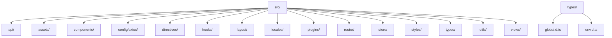
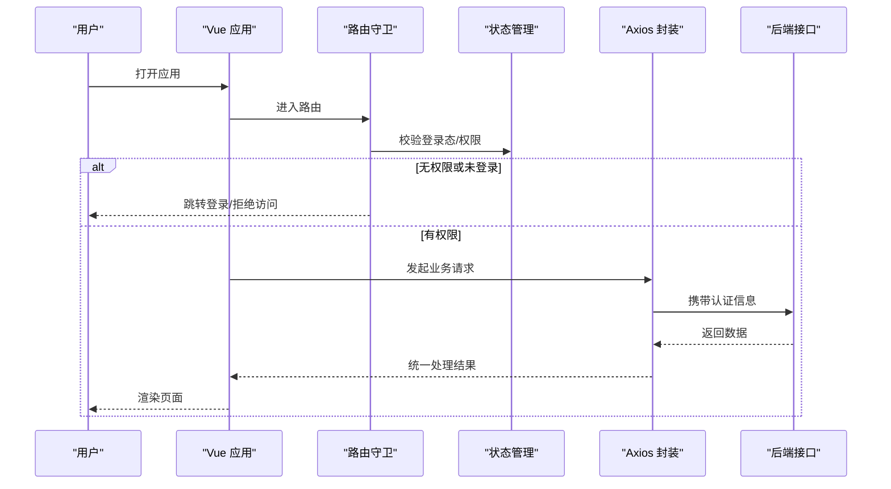
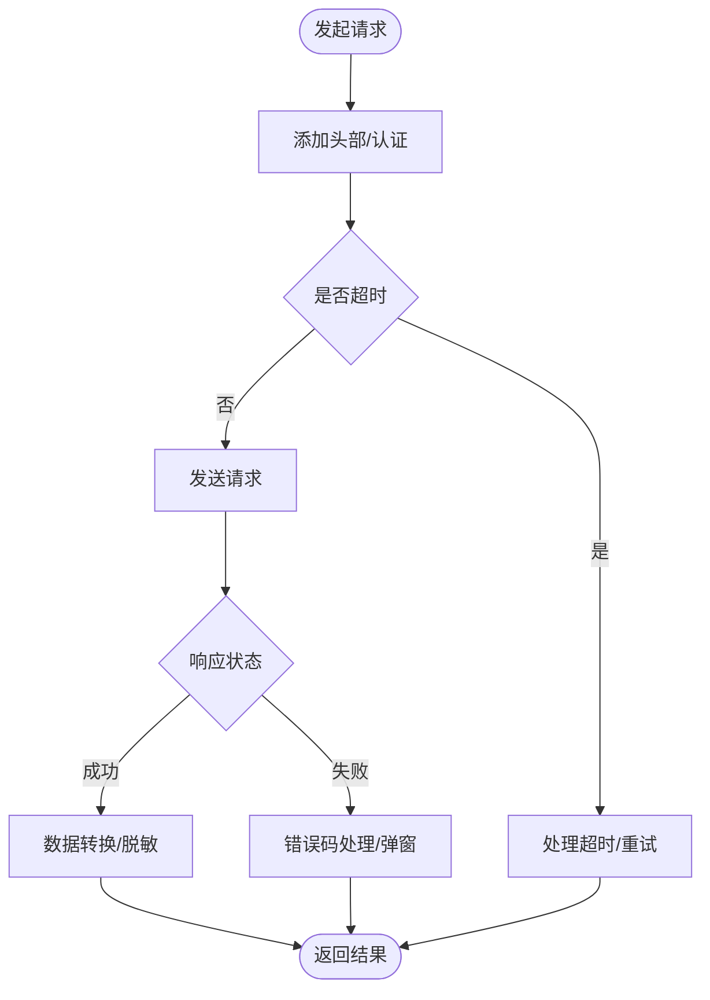
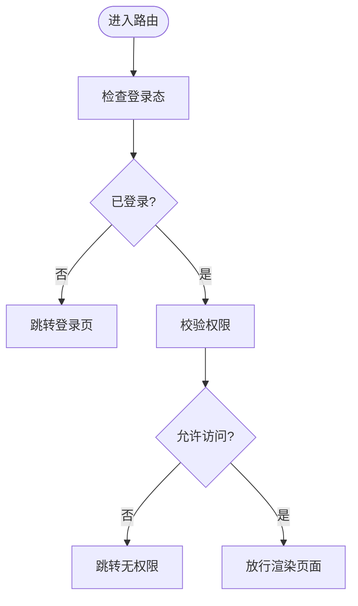
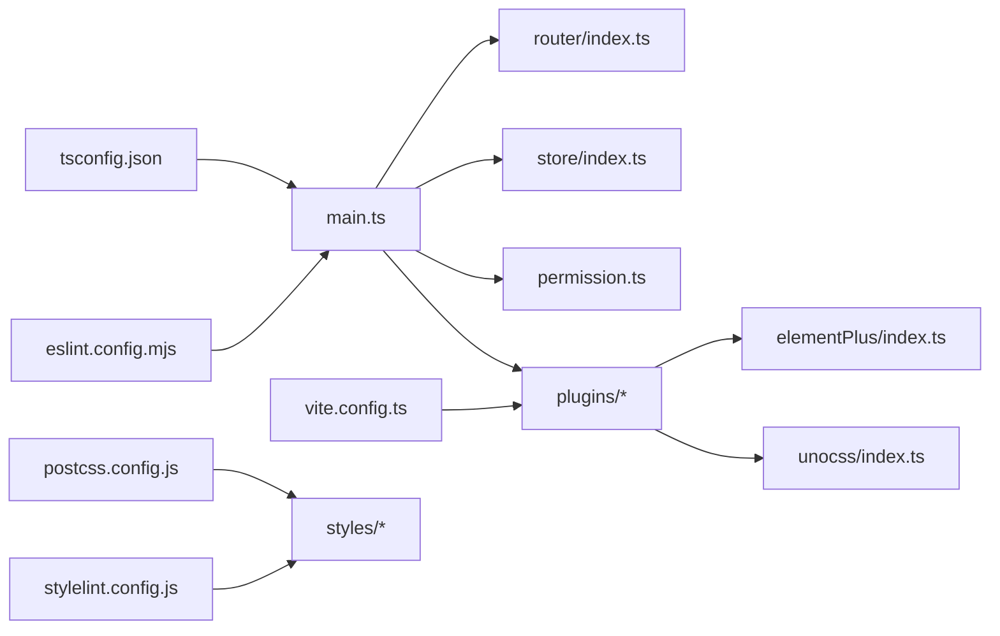

# 项目结构与配置

<cite>
**本文引用的文件**
- [package.json](file://yudao-ui/yudao-ui-admin-vue3/package.json)
- [vite.config.ts](file://yudao-ui/yudao-ui-admin-vue3/vite.config.ts)
- [tsconfig.json](file://yudao-ui/yudao-ui-admin-vue3/tsconfig.json)
- [uno.config.ts](file://yudao-ui/yudao-ui-admin-vue3/uno.config.ts)
- [eslint.config.mjs](file://yudao-ui/yudao-ui-admin-vue3/eslint.config.mjs)
- [prettier.config.js](file://yudao-ui/yudao-ui-admin-vue3/prettier.config.js)
- [postcss.config.js](file://yudao-ui/yudao-ui-admin-vue3/postcss.config.js)
- [stylelint.config.js](file://yudao-ui/yudao-ui-admin-vue3/stylelint.config.js)
- [main.ts](file://yudao-ui/yudao-ui-admin-vue3/src/main.ts)
- [permission.ts](file://yudao-ui/yudao-ui-admin-vue3/src/permission.ts)
- [router/index.ts](file://yudao-ui/yudao-ui-admin-vue3/src/router/index.ts)
- [store/index.ts](file://yudao-ui/yudao-ui-admin-vue3/src/store/index.ts)
- [plugins/elementPlus/index.ts](file://yudao-ui/yudao-ui-admin-vue3/src/plugins/elementPlus/index.ts)
- [plugins/unocss/index.ts](file://yudao-ui/yudao-ui-admin-vue3/src/plugins/unocss/index.ts)
- [config/axios/index.ts](file://yudao-ui/yudao-ui-admin-vue3/src/config/axios/index.ts)
- [types/global.d.ts](file://yudao-ui/yudao-ui-admin-vue3/types/global.d.ts)
- [types/env.d.ts](file://yudao-ui/yudao-ui-admin-vue3/types/env.d.ts)
</cite>

## 目录
1. [引言](#引言)
2. [项目结构](#项目结构)
3. [核心组件](#核心组件)
4. [架构总览](#架构总览)
5. [详细组件分析](#详细组件分析)
6. [依赖关系分析](#依赖关系分析)
7. [性能考虑](#性能考虑)
8. [故障排查指南](#故障排查指南)
9. [结论](#结论)
10. [附录](#附录)

## 引言
本文件面向芋道 ruoyi-vue-pro 前端项目（yudao-ui-admin-vue3），系统性梳理项目目录组织、构建配置、语言与工具链配置、开发脚本及第三方集成方案。目标是帮助开发者快速理解并高效参与前端工程的日常开发、调试与维护。

## 项目结构
前端项目位于 yudao-ui/yudao-ui-admin-vue3 目录，采用“功能域+分层”的组织方式：
- src/api：按业务模块划分的接口层，如 ai、bpm、crm、erp、im、infra、iot、mall、member、mes、mp、pay、system、wms 等
- src/assets：静态资源，包含图片、音频、地图 JSON、SVG 图标等
- src/components：通用组件库，含业务组件与通用 UI 组件
- src/config/axios：Axios 封装与拦截器配置
- src/directives：Vue 自定义指令
- src/hooks：组合式函数（Web/Hook）
- src/layout：布局与导航组件
- src/locales：国际化语言包
- src/plugins：第三方插件注册（Element Plus、UnoCSS、ECharts、svgIcon 等）
- src/router：路由定义与模块化拆分
- src/store：状态管理（Vuex/Pinia 模块化）
- src/styles：全局样式与主题变量
- src/types：全局类型声明
- src/utils：工具函数集合
- src/views：页面级视图组件
- types：全局 TS 类型声明文件
- 根目录配置：Vite、ESLint、Prettier、UnoCSS、PostCSS、Stylelint 等

图表来源
- [main.ts](file://yudao-ui/yudao-ui-admin-vue3/src/main.ts)
- [router/index.ts](file://yudao-ui/yudao-ui-admin-vue3/src/router/index.ts)
- [store/index.ts](file://yudao-ui/yudao-ui-admin-vue3/src/store/index.ts)

章节来源
- [main.ts](file://yudao-ui/yudao-ui-admin-vue3/src/main.ts)
- [router/index.ts](file://yudao-ui/yudao-ui-admin-vue3/src/router/index.ts)
- [store/index.ts](file://yudao-ui/yudao-ui-admin-vue3/src/store/index.ts)

## 核心组件
- 应用入口与权限守卫
  - 应用入口：在应用初始化时挂载路由、状态、插件与权限守卫
  - 权限守卫：基于路由与用户权限进行访问控制
- 路由系统：采用模块化路由，按业务域拆分，支持动态加载
- 状态管理：模块化 store，按领域划分状态与动作
- 插件体系：统一在 plugins 中注册 Element Plus、UnoCSS、ECharts、svgIcon、vueI18n 等
- Axios 封装：统一请求/响应拦截、错误码处理、超时与重试策略
- 国际化：多语言切换与本地化资源管理
- 样式与主题：SCSS 变量、UnoCSS 原子类与主题变量协同

章节来源
- [main.ts](file://yudao-ui/yudao-ui-admin-vue3/src/main.ts)
- [permission.ts](file://yudao-ui/yudao-ui-admin-vue3/src/permission.ts)
- [router/index.ts](file://yudao-ui/yudao-ui-admin-vue3/src/router/index.ts)
- [store/index.ts](file://yudao-ui/yudao-ui-admin-vue3/src/store/index.ts)
- [plugins/elementPlus/index.ts](file://yudao-ui/yudao-ui-admin-vue3/src/plugins/elementPlus/index.ts)
- [plugins/unocss/index.ts](file://yudao-ui/yudao-ui-admin-vue3/src/plugins/unocss/index.ts)
- [config/axios/index.ts](file://yudao-ui/yudao-ui-admin-vue3/src/config/axios/index.ts)

## 架构总览
下图展示从浏览器到后端服务的关键交互流程，涵盖鉴权、路由守卫、API 请求与国际化等环节。

图表来源
- [permission.ts](file://yudao-ui/yudao-ui-admin-vue3/src/permission.ts)
- [config/axios/index.ts](file://yudao-ui/yudao-ui-admin-vue3/src/config/axios/index.ts)

## 详细组件分析

### Vite 构建配置
- 插件生态
  - Vue 生态：@vitejs/plugin-vue、@vitejs/plugin-vue-jsx
  - TypeScript 支持：@rollup/plugin-typescript
  - 构建优化：可选的压缩与分包策略
- 别名与路径映射
  - 使用路径别名简化导入，提升可读性与迁移稳定性
- 开发服务器
  - 代理配置用于跨域访问后端接口
- 构建输出
  - 输出目录、资源路径、产物优化与 sourcemap 控制
- 环境变量
  - 通过 .env 文件注入运行时配置，区分开发/生产环境

章节来源
- [vite.config.ts](file://yudao-ui/yudao-ui-admin-vue3/vite.config.ts)

### TypeScript 配置
- 编译选项
  - 目标版本、模块系统、严格模式、增量编译等
- 路径映射
  - 结合 Vite 别名，确保 TS 能解析相对路径
- 类型检查规则
  - 严格类型约束、未使用变量/函数检查、装饰器支持等
- 声明文件
  - 全局类型与环境变量类型声明

章节来源
- [tsconfig.json](file://yudao-ui/yudao-ui-admin-vue3/tsconfig.json)
- [types/global.d.ts](file://yudao-ui/yudao-ui-admin-vue3/types/global.d.ts)
- [types/env.d.ts](file://yudao-ui/yudao-ui-admin-vue3/types/env.d.ts)

### ESLint 与 Prettier
- ESLint
  - 规则集：基础 JS/TS 规范、Vue 文件特定规则、import 排序、禁用 console 等
  - 自动修复：支持在保存或 CI 中自动修复
  - 与 Vite 集成：在开发时提供即时错误提示
- Prettier
  - 格式化规则：缩进、引号、尾逗号、行宽等
  - 与编辑器集成：VSCode 插件或保存时自动格式化
  - 忽略文件：.prettierignore 与 .gitignore 协同

章节来源
- [eslint.config.mjs](file://yudao-ui/yudao-ui-admin-vue3/eslint.config.mjs)
- [prettier.config.js](file://yudao-ui/yudao-ui-admin-vue3/prettier.config.js)

### UnoCSS 与样式工具链
- UnoCSS
  - 原子类优先的实用工具集，按需生成样式，体积更小
  - 颜色、间距、排版、阴影等常用属性的原子类
- PostCSS 与 Stylelint
  - PostCSS：插件管线（如 autoprefixer）
  - Stylelint：SCSS/CSS 规范检查与自动修复

章节来源
- [uno.config.ts](file://yudao-ui/yudao-ui-admin-vue3/uno.config.ts)
- [postcss.config.js](file://yudao-ui/yudao-ui-admin-vue3/postcss.config.js)
- [stylelint.config.js](file://yudao-ui/yudao-ui-admin-vue3/stylelint.config.js)

### Axios 封装与拦截器
- 请求拦截
  - 注入 Token、设置 Content-Type、超时控制
- 响应拦截
  - 统一错误码处理、业务异常提示、登出逻辑
- 并发与缓存
  - 可扩展并发限制与缓存策略

图表来源
- [config/axios/index.ts](file://yudao-ui/yudao-ui-admin-vue3/src/config/axios/index.ts)

章节来源
- [config/axios/index.ts](file://yudao-ui/yudao-ui-admin-vue3/src/config/axios/index.ts)

### Element Plus 插件集成
- 按需引入与全局配置
  - 主题变量、尺寸、颜色覆盖
- 国际化与日历区域
  - 语言切换与本地化支持

章节来源
- [plugins/elementPlus/index.ts](file://yudao-ui/yudao-ui-admin-vue3/src/plugins/elementPlus/index.ts)

### UnoCSS 插件集成
- 在应用入口中注册，实现原子类与主题变量的无缝衔接
- 支持暗色模式与动态主题切换

章节来源
- [plugins/unocss/index.ts](file://yudao-ui/yudao-ui-admin-vue3/src/plugins/unocss/index.ts)

### 路由与权限守卫
- 路由模块化：按业务域拆分，支持懒加载
- 权限守卫：根据用户角色与菜单权限决定页面访问

图表来源
- [permission.ts](file://yudao-ui/yudao-ui-admin-vue3/src/permission.ts)
- [router/index.ts](file://yudao-ui/yudao-ui-admin-vue3/src/router/index.ts)

章节来源
- [permission.ts](file://yudao-ui/yudao-ui-admin-vue3/src/permission.ts)
- [router/index.ts](file://yudao-ui/yudao-ui-admin-vue3/src/router/index.ts)

### 状态管理（Store）
- 模块化设计：按业务域划分模块，便于维护与测试
- 常见模式：State/Getter/Mutation/Action 分离

章节来源
- [store/index.ts](file://yudao-ui/yudao-ui-admin-vue3/src/store/index.ts)

## 依赖关系分析
- 应用入口依赖：路由、状态、插件、权限守卫
- 插件依赖：Element Plus、UnoCSS、ECharts、svgIcon、vueI18n
- 工具链依赖：Vite、ESLint、Prettier、UnoCSS、PostCSS、Stylelint
- 样式依赖：SCSS 变量、主题与 UnoCSS 原子类

图表来源
- [main.ts](file://yudao-ui/yudao-ui-admin-vue3/src/main.ts)
- [router/index.ts](file://yudao-ui/yudao-ui-admin-vue3/src/router/index.ts)
- [store/index.ts](file://yudao-ui/yudao-ui-admin-vue3/src/store/index.ts)
- [permission.ts](file://yudao-ui/yudao-ui-admin-vue3/src/permission.ts)
- [plugins/elementPlus/index.ts](file://yudao-ui/yudao-ui-admin-vue3/src/plugins/elementPlus/index.ts)
- [plugins/unocss/index.ts](file://yudao-ui/yudao-ui-admin-vue3/src/plugins/unocss/index.ts)
- [vite.config.ts](file://yudao-ui/yudao-ui-admin-vue3/vite.config.ts)
- [tsconfig.json](file://yudao-ui/yudao-ui-admin-vue3/tsconfig.json)
- [eslint.config.mjs](file://yudao-ui/yudao-ui-admin-vue3/eslint.config.mjs)
- [postcss.config.js](file://yudao-ui/yudao-ui-admin-vue3/postcss.config.js)
- [stylelint.config.js](file://yudao-ui/yudao-ui-admin-vue3/stylelint.config.js)

章节来源
- [main.ts](file://yudao-ui/yudao-ui-admin-vue3/src/main.ts)
- [vite.config.ts](file://yudao-ui/yudao-ui-admin-vue3/vite.config.ts)
- [tsconfig.json](file://yudao-ui/yudao-ui-admin-vue3/tsconfig.json)
- [eslint.config.mjs](file://yudao-ui/yudao-ui-admin-vue3/eslint.config.mjs)
- [postcss.config.js](file://yudao-ui/yudao-ui-admin-vue3/postcss.config.js)
- [stylelint.config.js](file://yudao-ui/yudao-ui-admin-vue3/stylelint.config.js)

## 性能考虑
- 代码分割与懒加载：按路由模块拆分，减少首屏体积
- 原子类样式：UnoCSS 按需生成，避免全局样式冗余
- 构建优化：启用压缩、Tree Shaking、资源内联策略
- 缓存策略：静态资源版本化与浏览器缓存配置
- 开发体验：热更新与快速冷启

## 故障排查指南
- 构建失败
  - 检查 Vite 插件与别名配置是否一致
  - 确认 tsconfig 与路径映射匹配
- 类型错误
  - 补充缺失的类型声明或调整 strict 设置
  - 校验全局类型文件是否被正确引用
- ESLint 报错
  - 使用自动修复或调整规则集
  - 检查编辑器保存触发与 CI 配置
- UnoCSS 样式不生效
  - 确认插件注册顺序与主题变量
  - 检查原子类拼写与作用域
- Axios 请求异常
  - 查看拦截器中的错误处理分支
  - 核对后端接口与代理配置

章节来源
- [vite.config.ts](file://yudao-ui/yudao-ui-admin-vue3/vite.config.ts)
- [tsconfig.json](file://yudao-ui/yudao-ui-admin-vue3/tsconfig.json)
- [eslint.config.mjs](file://yudao-ui/yudao-ui-admin-vue3/eslint.config.mjs)
- [uno.config.ts](file://yudao-ui/yudao-ui-admin-vue3/uno.config.ts)
- [config/axios/index.ts](file://yudao-ui/yudao-ui-admin-vue3/src/config/axios/index.ts)

## 结论
本项目以模块化与分层为核心思想，结合 Vite、TypeScript、UnoCSS、ESLint/Prettier 等现代工具链，形成高可维护、高性能且易协作的前端工程体系。建议在新增功能时遵循现有目录规范与命名约定，并充分利用插件与工具链能力，确保代码质量与开发效率。

## 附录

### 开发脚本与命令
- 启动开发服务器：运行本地开发环境，支持热更新与接口代理
- 构建生产包：打包优化、资源压缩与产物输出
- 预览构建产物：本地预览生产包效果
- 代码检查：执行 ESLint 与 Stylelint 检查
- 格式化：使用 Prettier 统一代码风格

章节来源
- [package.json](file://yudao-ui/yudao-ui-admin-vue3/package.json)