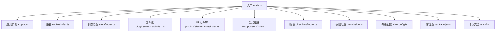
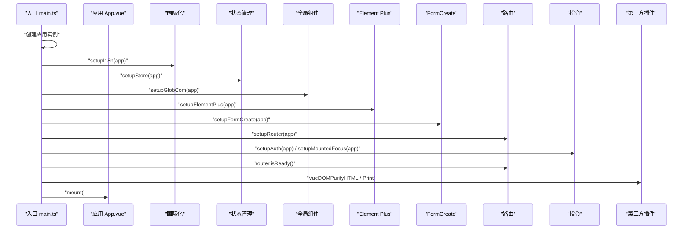
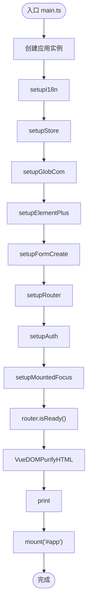
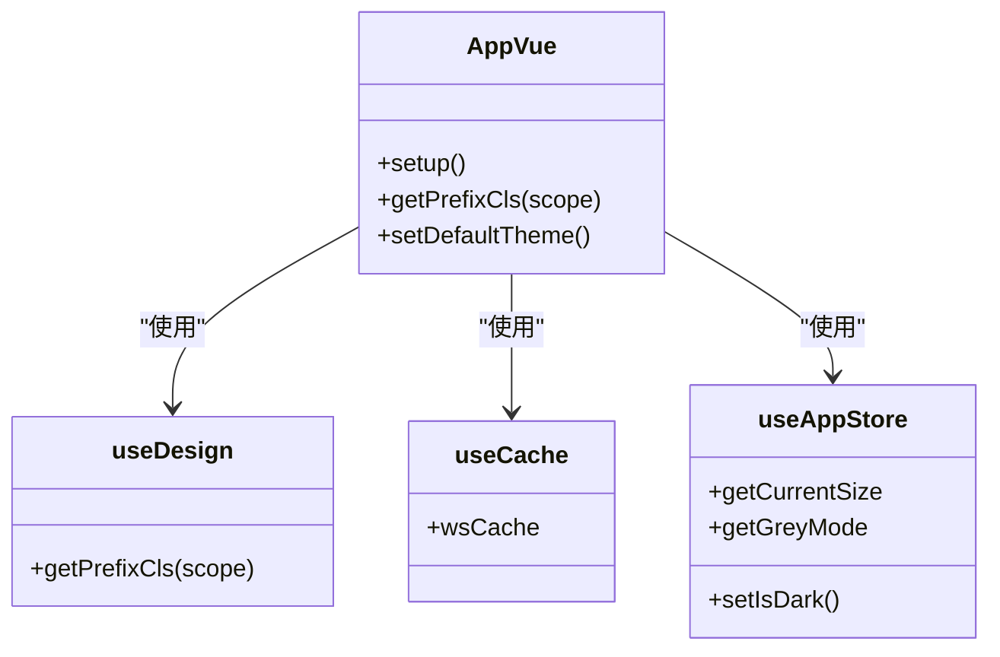
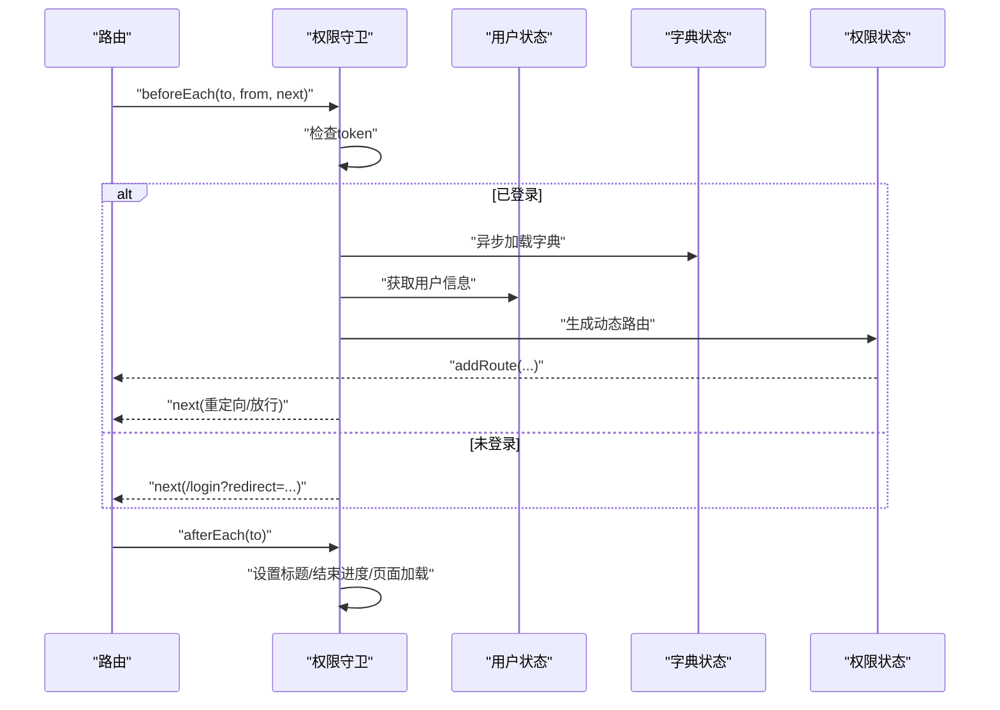
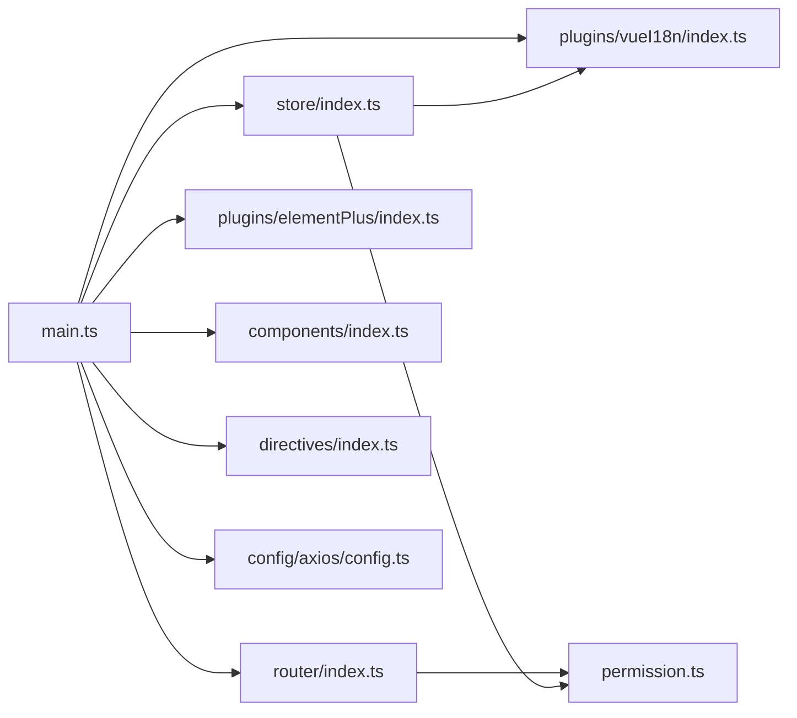

# Vue3应用结构

<cite>
**本文引用的文件**
- [main.ts](file://yudao-ui/yudao-ui-admin-vue3/src/main.ts)
- [App.vue](file://yudao-ui/yudao-ui-admin-vue3/src/App.vue)
- [router/index.ts](file://yudao-ui/yudao-ui-admin-vue3/src/router/index.ts)
- [store/index.ts](file://yudao-ui/yudao-ui-admin-vue3/src/store/index.ts)
- [permission.ts](file://yudao-ui/yudao-ui-admin-vue3/src/permission.ts)
- [plugins/elementPlus/index.ts](file://yudao-ui/yudao-ui-admin-vue3/src/plugins/elementPlus/index.ts)
- [plugins/vueI18n/index.ts](file://yudao-ui/yudao-ui-admin-vue3/src/plugins/vueI18n/index.ts)
- [components/index.ts](file://yudao-ui/yudao-ui-admin-vue3/src/components/index.ts)
- [directives/index.ts](file://yudao-ui/yudao-ui-admin-vue3/src/directives/index.ts)
- [vite.config.ts](file://yudao-ui/yudao-ui-admin-vue3/vite.config.ts)
- [package.json](file://yudao-ui/yudao-ui-admin-vue3/package.json)
- [env.d.ts](file://yudao-ui/yudao-ui-admin-vue3/types/env.d.ts)
- [utils/auth.ts](file://yudao-ui/yudao-ui-admin-vue3/src/utils/auth.ts)
- [config/axios/config.ts](file://yudao-ui/yudao-ui-admin-vue3/src/config/axios/config.ts)
- [hooks/web/useDesign.ts](file://yudao-ui/yudao-ui-admin-vue3/src/hooks/web/useDesign.ts)
</cite>

## 目录
1. [引言](#引言)
2. [项目结构](#项目结构)
3. [核心组件](#核心组件)
4. [架构总览](#架构总览)
5. [详细组件分析](#详细组件分析)
6. [依赖分析](#依赖分析)
7. [性能考虑](#性能考虑)
8. [故障排查指南](#故障排查指南)
9. [结论](#结论)
10. [附录](#附录)

## 引言
本文件面向“芋道Ruoyi-Vue-Pro”前端工程，聚焦于Vue3应用的结构与初始化流程，系统梳理应用入口文件main.ts的初始化步骤、插件注册顺序、应用配置、生命周期管理；阐述Composition API在项目中的使用模式与最佳实践；介绍应用级配置管理（环境变量、全局配置、插件配置）；说明模块化组织结构与命名规范；并提供启动流程的详细说明（异步初始化、错误处理、性能监控等）。

## 项目结构
该前端工程采用以功能域为中心的模块化组织方式，入口位于src/main.ts，围绕路由、状态管理、国际化、UI组件库、指令、插件等进行装配。构建配置集中在vite.config.ts，并通过package.json统一管理依赖与脚本。

图表来源
- [main.ts:1-92](file://yudao-ui/yudao-ui-admin-vue3/src/main.ts#L1-L92)
- [App.vue:1-58](file://yudao-ui/yudao-ui-admin-vue3/src/App.vue#L1-L58)
- [router/index.ts:1-47](file://yudao-ui/yudao-ui-admin-vue3/src/router/index.ts#L1-L47)
- [store/index.ts:1-13](file://yudao-ui/yudao-ui-admin-vue3/src/store/index.ts#L1-L13)
- [plugins/vueI18n/index.ts:1-43](file://yudao-ui/yudao-ui-admin-vue3/src/plugins/vueI18n/index.ts#L1-L43)
- [plugins/elementPlus/index.ts:1-18](file://yudao-ui/yudao-ui-admin-vue3/src/plugins/elementPlus/index.ts#L1-L18)
- [components/index.ts:1-7](file://yudao-ui/yudao-ui-admin-vue3/src/components/index.ts#L1-L7)
- [directives/index.ts:1-25](file://yudao-ui/yudao-ui-admin-vue3/src/directives/index.ts#L1-L25)
- [permission.ts:1-79](file://yudao-ui/yudao-ui-admin-vue3/src/permission.ts#L1-L79)
- [vite.config.ts:1-102](file://yudao-ui/yudao-ui-admin-vue3/vite.config.ts#L1-L102)
- [package.json:1-158](file://yudao-ui/yudao-ui-admin-vue3/package.json#L1-L158)
- [env.d.ts:1-42](file://yudao-ui/yudao-ui-admin-vue3/types/env.d.ts#L1-L42)

章节来源
- [main.ts:1-92](file://yudao-ui/yudao-ui-admin-vue3/src/main.ts#L1-L92)
- [vite.config.ts:1-102](file://yudao-ui/yudao-ui-admin-vue3/vite.config.ts#L1-L102)
- [package.json:1-158](file://yudao-ui/yudao-ui-admin-vue3/package.json#L1-L158)

## 核心组件
- 应用入口与初始化：在main.ts中完成插件注册、状态管理、路由、指令、国际化、UI组件库、全局样式、动画、第三方插件等的装配，并在setupAll异步函数中按序挂载。
- 应用根组件：App.vue通过Composition API获取主题、尺寸、缓存等状态，提供全局ConfigGlobal包裹与RouterView渲染。
- 路由与权限：router/index.ts负责创建路由实例、错误处理与动态重定向；permission.ts在beforeEach中进行登录态、用户信息、权限菜单的异步加载与动态路由注入。
- 状态管理：store/index.ts使用Pinia并启用持久化插件，提供setupStore挂载。
- 国际化：plugins/vueI18n/index.ts动态加载语言包，设置html语言属性，同步语言配置。
- UI组件库：plugins/elementPlus/index.ts全局注册Loading与部分组件，保证样式一致性。
- 全局组件与指令：components/index.ts注册Icon全局组件；directives/index.ts注册权限指令与mounted焦点指令。
- 构建与环境：vite.config.ts集中管理开发服务器、CSS预处理、别名、构建优化与分包策略；env.d.ts声明环境变量类型。

章节来源
- [main.ts:1-92](file://yudao-ui/yudao-ui-admin-vue3/src/main.ts#L1-L92)
- [App.vue:1-58](file://yudao-ui/yudao-ui-admin-vue3/src/App.vue#L1-L58)
- [router/index.ts:1-47](file://yudao-ui/yudao-ui-admin-vue3/src/router/index.ts#L1-L47)
- [store/index.ts:1-13](file://yudao-ui/yudao-ui-admin-vue3/src/store/index.ts#L1-L13)
- [plugins/vueI18n/index.ts:1-43](file://yudao-ui/yudao-ui-admin-vue3/src/plugins/vueI18n/index.ts#L1-L43)
- [plugins/elementPlus/index.ts:1-18](file://yudao-ui/yudao-ui-admin-vue3/src/plugins/elementPlus/index.ts#L1-L18)
- [components/index.ts:1-7](file://yudao-ui/yudao-ui-admin-vue3/src/components/index.ts#L1-L7)
- [directives/index.ts:1-25](file://yudao-ui/yudao-ui-admin-vue3/src/directives/index.ts#L1-L25)
- [permission.ts:1-79](file://yudao-ui/yudao-ui-admin-vue3/src/permission.ts#L1-L79)
- [vite.config.ts:1-102](file://yudao-ui/yudao-ui-admin-vue3/vite.config.ts#L1-L102)
- [env.d.ts:1-42](file://yudao-ui/yudao-ui-admin-vue3/types/env.d.ts#L1-L42)

## 架构总览
下图展示了从入口到各子系统的装配关系与调用顺序，体现“先配置、后挂载”的初始化原则。

图表来源
- [main.ts:56-87](file://yudao-ui/yudao-ui-admin-vue3/src/main.ts#L56-L87)

章节来源
- [main.ts:56-87](file://yudao-ui/yudao-ui-admin-vue3/src/main.ts#L56-L87)

## 详细组件分析

### 应用入口 main.ts 初始化流程
- 异步初始化：通过setupAll函数串行调用各初始化函数，确保国际化、状态、组件、UI库、路由、指令、第三方插件等按序完成。
- 插件注册顺序：国际化 → 状态管理 → 全局组件 → Element Plus → FormCreate → 路由 → 权限指令与mounted焦点指令 → 路由就绪 → DOM净化HTML插件 → 打印插件 → 挂载。
- 生命周期管理：在router.isReady()完成后挂载应用，避免首屏路由未就绪导致的渲染问题；同时监听vite预加载失败事件，自动刷新页面。
- 日志与统计：挂载后输出欢迎日志，引入百度统计插件。

图表来源
- [main.ts:56-87](file://yudao-ui/yudao-ui-admin-vue3/src/main.ts#L56-L87)

章节来源
- [main.ts:1-92](file://yudao-ui/yudao-ui-admin-vue3/src/main.ts#L1-L92)

### Composition API 使用模式与最佳实践
- 在App.vue中使用setup选项与Composition API：通过useAppStore、useDesign、useCache等组合式函数获取状态与工具方法，计算属性currentSize、greyMode用于样式控制。
- 设计系统：useDesign提供命名空间与前缀类名生成，便于全局样式与组件类名规范化。
- 缓存与主题：结合useCache与浏览器主题检测，实现深色/灰阶模式的持久化与默认设置。

图表来源
- [App.vue:1-58](file://yudao-ui/yudao-ui-admin-vue3/src/App.vue#L1-L58)
- [hooks/web/useDesign.ts:1-19](file://yudao-ui/yudao-ui-admin-vue3/src/hooks/web/useDesign.ts#L1-L19)

章节来源
- [App.vue:1-58](file://yudao-ui/yudao-ui-admin-vue3/src/App.vue#L1-L58)
- [hooks/web/useDesign.ts:1-19](file://yudao-ui/yudao-ui-admin-vue3/src/hooks/web/useDesign.ts#L1-L19)

### 路由与权限守卫
- 路由创建：基于createWebHistory与remaining路由集合，统一滚动行为至顶部。
- 错误处理：拦截动态导入失败错误，自动重定向到目标路径。
- 权限守卫：beforeEach中根据token判断登录态，异步加载字典、用户信息与权限菜单，动态注入路由；afterEach设置页面标题与结束进度条与页面加载状态。

图表来源
- [permission.ts:28-78](file://yudao-ui/yudao-ui-admin-vue3/src/permission.ts#L28-L78)
- [router/index.ts:7-30](file://yudao-ui/yudao-ui-admin-vue3/src/router/index.ts#L7-L30)

章节来源
- [router/index.ts:1-47](file://yudao-ui/yudao-ui-admin-vue3/src/router/index.ts#L1-L47)
- [permission.ts:1-79](file://yudao-ui/yudao-ui-admin-vue3/src/permission.ts#L1-L79)

### 状态管理（Pinia）
- 创建Pinia实例并启用持久化插件，提供setupStore挂载到应用。
- 与权限守卫配合，在登录后异步加载用户信息与动态路由。

章节来源
- [store/index.ts:1-13](file://yudao-ui/yudao-ui-admin-vue3/src/store/index.ts#L1-L13)

### 国际化（vue-i18n）
- 动态加载当前语言包，设置html语言属性，同步语言配置。
- 提供可用语言列表与回退策略，关闭静默翻译警告。

章节来源
- [plugins/vueI18n/index.ts:1-43](file://yudao-ui/yudao-ui-admin-vue3/src/plugins/vueI18n/index.ts#L1-L43)

### UI 组件库（Element Plus）
- 全局注册Loading插件与常用组件（如滚动条、按钮），保证下拉等组件样式一致。

章节来源
- [plugins/elementPlus/index.ts:1-18](file://yudao-ui/yudao-ui-admin-vue3/src/plugins/elementPlus/index.ts#L1-L18)

### 全局组件与指令
- 全局组件：注册Icon组件，便于跨页面复用。
- 权限指令：v-hasRole、v-hasPermi用于按钮级权限控制；v-mountedFocus在mounted阶段自动聚焦。

章节来源
- [components/index.ts:1-7](file://yudao-ui/yudao-ui-admin-vue3/src/components/index.ts#L1-L7)
- [directives/index.ts:1-25](file://yudao-ui/yudao-ui-admin-vue3/src/directives/index.ts#L1-L25)

### 第三方插件与工具
- DOM净化HTML：防止v-html安全风险。
- 打印插件：提供打印能力。
- 预加载错误处理：监听vite:preloadError事件，自动刷新页面。

章节来源
- [main.ts:43-54](file://yudao-ui/yudao-ui-admin-vue3/src/main.ts#L43-L54)

### 应用级配置管理
- 环境变量：通过env.d.ts声明VITE_*变量，如应用标题、端口、API基础路径、是否开启调试与控制台清理等。
- 构建配置：vite.config.ts集中管理开发服务器、代理、CSS预处理、路径别名、构建优化与分包策略。
- Axios配置：config/axios/config.ts整合基础URL、超时、默认头等配置，统一API请求参数。

章节来源
- [env.d.ts:10-35](file://yudao-ui/yudao-ui-admin-vue3/types/env.d.ts#L10-L35)
- [vite.config.ts:15-101](file://yudao-ui/yudao-ui-admin-vue3/vite.config.ts#L15-L101)
- [config/axios/config.ts:1-29](file://yudao-ui/yudao-ui-admin-vue3/src/config/axios/config.ts#L1-L29)

### 模块化组织结构与命名规范
- 目录划分：src/api、src/components、src/hooks、src/layout、src/router、src/store、src/utils、src/views等，按职责清晰拆分。
- 文件命名：组件以大驼峰命名，页面视图以模块命名，工具函数以动词短语命名，常量以全大写下划线命名。
- 代码组织：遵循“功能域优先”，每个模块内部再细分子目录，减少跨模块耦合。

章节来源
- [main.ts:1-92](file://yudao-ui/yudao-ui-admin-vue3/src/main.ts#L1-L92)

## 依赖分析
- 运行时依赖：Vue3、Vue Router、Pinia、Element Plus、Axios、vue-i18n、echarts、wangEditor、打印插件等。
- 开发依赖：Vite、UnoCSS、ESLint、Stylelint、TypeScript、自动导入与组件解析插件等。
- 依赖关系：入口main.ts依赖各插件与配置模块；路由与权限守卫相互协作；状态管理贯穿用户、权限、字典等模块。

图表来源
- [main.ts:1-92](file://yudao-ui/yudao-ui-admin-vue3/src/main.ts#L1-L92)
- [router/index.ts:1-47](file://yudao-ui/yudao-ui-admin-vue3/src/router/index.ts#L1-L47)
- [permission.ts:1-79](file://yudao-ui/yudao-ui-admin-vue3/src/permission.ts#L1-L79)
- [store/index.ts:1-13](file://yudao-ui/yudao-ui-admin-vue3/src/store/index.ts#L1-L13)
- [plugins/vueI18n/index.ts:1-43](file://yudao-ui/yudao-ui-admin-vue3/src/plugins/vueI18n/index.ts#L1-L43)
- [plugins/elementPlus/index.ts:1-18](file://yudao-ui/yudao-ui-admin-vue3/src/plugins/elementPlus/index.ts#L1-L18)
- [components/index.ts:1-7](file://yudao-ui/yudao-ui-admin-vue3/src/components/index.ts#L1-L7)
- [directives/index.ts:1-25](file://yudao-ui/yudao-ui-admin-vue3/src/directives/index.ts#L1-L25)
- [config/axios/config.ts:1-29](file://yudao-ui/yudao-ui-admin-vue3/src/config/axios/config.ts#L1-L29)

章节来源
- [package.json:27-88](file://yudao-ui/yudao-ui-admin-vue3/package.json#L27-L88)
- [vite.config.ts:15-101](file://yudao-ui/yudao-ui-admin-vue3/vite.config.ts#L15-L101)

## 性能考虑
- 代码分割：vite.config.ts中对echarts、form-create、form-designer进行独立分包，降低首屏体积与提升缓存命中率。
- 构建优化：Terser压缩、按需移除debugger与console、可选SourceMap、Rollup输出分组策略。
- 依赖预优化：optimizeDeps包含必要依赖，减少冷启动等待。
- 路由懒加载：路由错误处理与动态导入失败自动重定向，避免死循环与长时间白屏。

章节来源
- [vite.config.ts:76-99](file://yudao-ui/yudao-ui-admin-vue3/vite.config.ts#L76-L99)
- [router/index.ts:22-30](file://yudao-ui/yudao-ui-admin-vue3/src/router/index.ts#L22-L30)

## 故障排查指南
- 预加载失败：入口监听vite:preloadError事件并刷新页面，快速恢复。
- 路由动态导入失败：路由层捕获错误并重定向到目标路径，避免因chunk哈希变化导致的404。
- 登录态异常：权限守卫中对token缺失与白名单路径进行分流；用户信息与权限菜单异步加载失败时需检查后端接口与缓存。
- 环境变量未生效：确认.env.*文件与Vite模式匹配，检查env.d.ts类型声明与实际环境变量一致。
- Axios请求异常：核对VITE_BASE_URL与VITE_API_URL拼接，检查超时与默认头配置。

章节来源
- [main.ts:50-54](file://yudao-ui/yudao-ui-admin-vue3/src/main.ts#L50-L54)
- [router/index.ts:22-30](file://yudao-ui/yudao-ui-admin-vue3/src/router/index.ts#L22-L30)
- [permission.ts:28-78](file://yudao-ui/yudao-ui-admin-vue3/src/permission.ts#L28-L78)
- [env.d.ts:10-35](file://yudao-ui/yudao-ui-admin-vue3/types/env.d.ts#L10-L35)
- [config/axios/config.ts:10](file://yudao-ui/yudao-ui-admin-vue3/src/config/axios/config.ts#L10)

## 结论
本项目以main.ts为核心入口，严格遵循“先配置、后挂载”的初始化顺序，结合路由守卫、状态管理、国际化与UI库等模块，形成高内聚、低耦合的应用结构。通过合理的模块划分、命名规范与构建优化策略，兼顾了开发体验与运行性能。建议在扩展新功能时保持现有装配顺序与职责边界，确保初始化流程稳定可靠。

## 附录
- 关键实现路径索引
  - 入口初始化：[main.ts:56-87](file://yudao-ui/yudao-ui-admin-vue3/src/main.ts#L56-L87)
  - 根组件与主题：[App.vue:1-58](file://yudao-ui/yudao-ui-admin-vue3/src/App.vue#L1-L58)
  - 路由与错误处理：[router/index.ts:7-30](file://yudao-ui/yudao-ui-admin-vue3/src/router/index.ts#L7-L30)
  - 权限守卫：[permission.ts:28-78](file://yudao-ui/yudao-ui-admin-vue3/src/permission.ts#L28-L78)
  - 状态管理：[store/index.ts:8-10](file://yudao-ui/yudao-ui-admin-vue3/src/store/index.ts#L8-L10)
  - 国际化：[plugins/vueI18n/index.ts:38-42](file://yudao-ui/yudao-ui-admin-vue3/src/plugins/vueI18n/index.ts#L38-L42)
  - UI组件库：[plugins/elementPlus/index.ts:9-17](file://yudao-ui/yudao-ui-admin-vue3/src/plugins/elementPlus/index.ts#L9-L17)
  - 全局组件与指令：[components/index.ts:4-6](file://yudao-ui/yudao-ui-admin-vue3/src/components/index.ts#L4-L6)、[directives/index.ts:10-24](file://yudao-ui/yudao-ui-admin-vue3/src/directives/index.ts#L10-L24)
  - 构建配置：[vite.config.ts:15-101](file://yudao-ui/yudao-ui-admin-vue3/vite.config.ts#L15-L101)
  - 环境变量类型：[env.d.ts:10-35](file://yudao-ui/yudao-ui-admin-vue3/types/env.d.ts#L10-L35)
  - Axios配置：[config/axios/config.ts:10](file://yudao-ui/yudao-ui-admin-vue3/src/config/axios/config.ts#L10)
  - 登录态工具：[utils/auth.ts:11-32](file://yudao-ui/yudao-ui-admin-vue3/src/utils/auth.ts#L11-L32)