# 前端架构

<cite>
**本文引用的文件**
- [package.json](file://yudao-ui/yudao-ui-admin-vue3/package.json)
- [vite.config.ts](file://yudao-ui/yudao-ui-admin-vue3/vite.config.ts)
- [main.ts](file://yudao-ui/yudao-ui-admin-vue3/src/main.ts)
- [permission.ts](file://yudao-ui/yudao-ui-admin-vue3/src/permission.ts)
- [App.vue](file://yudao-ui/yudao-ui-admin-vue3/src/App.vue)
- [Layout.vue](file://yudao-ui/yudao-ui-admin-vue3/src/layout/Layout.vue)
- [index.ts](file://yudao-ui/yudao-ui-admin-vue3/src/router/index.ts)
- [index.ts](file://yudao-ui/yudao-ui-admin-vue3/src/store/index.ts)
- [index.ts](file://yudao-ui/yudao-ui-admin-vue3/src/config/axios/index.ts)
- [service.ts](file://yudao-ui/yudao-ui-admin-vue3/src/config/axios/service.ts)
- [config.ts](file://yudao-ui/yudao-ui-admin-vue3/src/config/axios/config.ts)
- [errorCode.ts](file://yudao-ui/yudao-ui-admin-vue3/src/config/axios/errorCode.ts)
- [en.ts](file://yudao-ui/yudao-ui-admin-vue3/src/locales/en.ts)
- [zh-CN.ts](file://yudao-ui/yudao-ui-admin-vue3/src/locales/zh-CN.ts)
- [index.ts](file://yudao-ui/yudao-ui-admin-vue3/src/directives/index.ts)
- [index.ts](file://yudao-ui/yudao-ui-admin-vue3/src/components/index.ts)
- [index.ts](file://yudao-ui/yudao-ui-admin-vue3/src/plugins/elementPlus/index.ts)
- [index.ts](file://yudao-ui/yudao-ui-admin-vue3/src/plugins/vueI18n/index.ts)
- [uno.config.ts](file://yudao-ui/yudao-ui-admin-vue3/uno.config.ts)
- [postcss.config.js](file://yudao-ui/yudao-ui-admin-vue3/postcss.config.js)
- [eslint.config.mjs](file://yudao-ui/yudao-ui-admin-vue3/eslint.config.mjs)
- [tsconfig.json](file://yudao-ui/yudao-ui-admin-vue3/tsconfig.json)
- [useCsWebSocket.ts](file://yudao-ui/yudao-ui-admin-vue3/src/hooks/useCsWebSocket.ts)
- [useCsConsult.ts](file://yudao-ui/yudao-ui-admin-vue3/src/hooks/useCsConsult.ts)
- [ChatWindow.vue](file://yudao-ui/yudao-ui-admin-vue3/src/components/CsChatWindow/ChatWindow.vue)
- [ChatMessageList.vue](file://yudao-ui/yudao-ui-admin-vue3/src/components/CsChatWindow/ChatMessageList.vue)
- [ChatInputBar.vue](file://yudao-ui/yudao-ui-admin-vue3/src/components/CsChatWindow/ChatInputBar.vue)
- [ChatHeader.vue](file://yudao-ui/yudao-ui-admin-vue3/src/components/CsChatWindow/ChatHeader.vue)
- [ChatMessageItem.vue](file://yudao-ui/yudao-ui-admin-vue3/src/components/CsChatWindow/ChatMessageItem.vue)
- [ChatFloatingButton.vue](file://yudao-ui/yudao-ui-admin-vue3/src/components/CsChatWindow/ChatFloatingButton.vue)
- [AssignTaskModal.vue](file://yudao-ui/yudao-ui-admin-vue3/src/components/CsChatWindow/AssignTaskModal.vue)
- [DealerSelectDialog.vue](file://yudao-ui/yudao-ui-admin-vue3/src/components/CsChatWindow/DealerSelectDialog.vue)
- [CsExecutorNotifier.vue](file://yudao-ui/yudao-ui-admin-vue3/src/components/CsChatWindow/CsExecutorNotifier.vue)
- [index.ts](file://yudao-ui/yudao-ui-admin-vue3/src/api/opshub/csSession/index.ts)
- [index.ts](file://yudao-ui/yudao-ui-admin-vue3/src/api/opshub/dealerScope/index.ts)
- [ConsultTab.vue](file://yudao-ui/yudao-ui-admin-vue3/src/views/opshub/customerservice/components/ConsultTab.vue)
- [index.vue](file://yudao-ui/yudao-ui-admin-vue3/src/views/crm/customer/index.vue)
- [index.vue](file://yudao-ui/yudao-ui-admin-vue3/src/views/crm/clue/index.vue)
- [index.vue](file://yudao-ui/yudao-ui-admin-vue3/src/views/crm/business/index.vue)
- [index.vue](file://yudao-ui/yudao-ui-admin-vue3/src/views/crm/contact/index.vue)
- [index.vue](file://yudao-ui/yudao-ui-admin-vue3/src/views/crm/contract/index.vue)
- [index.vue](file://yudao-ui/yudao-ui-admin-vue3/src/views/crm/product/index.vue)
- [index.vue](file://yudao-ui/yudao-ui-admin-vue3/src/views/crm/receivable/index.vue)
- [index.vue](file://yudao-ui/yudao-ui-admin-vue3/src/views/opshub/policy/index.vue)
- [index.vue](file://yudao-ui/yudao-ui-admin-vue3/src/views/crm/statistics/customer/index.vue)
- [index.vue](file://yudao-ui/yudao-ui-admin-vue3/src/views/crm/statistics/funnel/index.vue)
- [index.vue](file://yudao-ui/yudao-ui-admin-vue3/src/views/crm/statistics/performance/index.vue)
- [index.vue](file://yudao-ui/yudao-ui-admin-vue3/src/views/crm/statistics/portrait/index.vue)
- [index.vue](file://yudao-ui/yudao-ui-admin-vue3/src/views/crm/statistics/rank/index.vue)
</cite>

## 更新摘要
**变更内容**
- 新增 CRM 模块前端组件，包括客户管理、线索管理、联系人管理、商机管理、合同管理、产品管理、应收账款管理等核心功能
- 新增政策看板模块前端组件，提供指标分析、目标分布、政策详情等可视化功能
- 新增统计分析模块，涵盖客户分析、销售漏斗、业绩分析、客户画像、BI排行等多个维度
- 完善 CRM 业务流程，支持客户公海管理、数据权限控制、批量导入导出等功能
- 增强政策看板的交互体验，提供多层级钻取和筛选功能

## 目录
1. [引言](#引言)
2. [项目结构](#项目结构)
3. [核心组件](#核心组件)
4. [架构总览](#架构总览)
5. [详细组件分析](#详细组件分析)
6. [依赖关系分析](#依赖关系分析)
7. [性能考虑](#性能考虑)
8. [故障排查指南](#故障排查指南)
9. [结论](#结论)
10. [附录](#附录)

## 引言
本文件面向芋道 Ruoyi-Vue-Pro 的前端团队与贡献者，系统性梳理基于 Vue 3 + TypeScript 的前端架构设计，涵盖 Composition API 使用模式、组件化理念、Pinia 状态管理、Vue Router 路由体系、Element Plus 组件库集成与定制、Axios 网络层封装、国际化与本地化、构建配置与性能优化，以及组件开发规范与 UI 设计指南。本次更新特别增加了全新的 CRM 模块和政策看板模块，包括客户管理、线索管理、联系人管理、商机管理、合同管理、产品管理、应收账款管理、统计分析等丰富的企业客户关系管理功能。

## 项目结构
前端工程位于 yudao-ui/yudao-ui-admin-vue3 目录，采用"按功能域分层 + 类型声明 + 插件扩展"的组织方式：
- 应用入口与权限：main.ts、permission.ts、App.vue
- 路由系统：router/index.ts 及其 modules 子模块
- 状态管理：store/index.ts 及 modules 子模块
- 网络层：config/axios 下的 index.ts、service.ts、config.ts、errorCode.ts
- 国际化：locales 下的 en.ts、zh-CN.ts
- 权限指令：directives/permission
- 组件库与插件：plugins/elementPlus、plugins/vueI18n 等
- 样式与主题：styles 下的全局样式与主题变量
- 工具与类型：utils、types
- **新增**：CRM 模块：views/crm 下的完整客户关系管理功能
- **新增**：政策看板模块：views/opshub/policy 下的政策分析功能
- **新增**：统计分析模块：views/crm/statistics 下的多维度数据分析功能
- **新增**：聊天组件系统：components/CsChatWindow 下的完整聊天组件族
- **新增**：WebSocket 钩子：hooks/useCsWebSocket.ts 实现实时通信
- **新增**：咨询组合式函数：hooks/useCsConsult.ts 统一管理咨询流程
- **新增**：客服 API：api/opshub/csSession 提供聊天相关接口
- **新增**：经销商授权 API：api/opshub/dealerScope 提供经销商授权管理
- 构建与质量：vite.config.ts、eslint.config.mjs、tsconfig.json、uno.config.ts、postcss.config.js

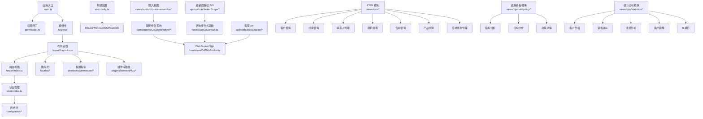

**图表来源**
- [main.ts](file://yudao-ui/yudao-ui-admin-vue3/src/main.ts)
- [permission.ts](file://yudao-ui/yudao-ui-admin-vue3/src/permission.ts)
- [App.vue](file://yudao-ui/yudao-ui-admin-vue3/src/App.vue)
- [Layout.vue](file://yudao-ui/yudao-ui-admin-vue3/src/layout/Layout.vue)
- [index.ts](file://yudao-ui/yudao-ui-admin-vue3/src/router/index.ts)
- [index.ts](file://yudao-ui/yudao-ui-admin-vue3/src/store/index.ts)
- [index.ts](file://yudao-ui/yudao-ui-admin-vue3/src/config/axios/index.ts)
- [en.ts](file://yudao-ui/yudao-ui-admin-vue3/src/locales/en.ts)
- [zh-CN.ts](file://yudao-ui/yudao-ui-admin-vue3/src/locales/zh-CN.ts)
- [index.ts](file://yudao-ui/yudao-ui-admin-vue3/src/directives/index.ts)
- [index.ts](file://yudao-ui/yudao-ui-admin-vue3/src/plugins/elementPlus/index.ts)
- [vite.config.ts](file://yudao-ui/yudao-ui-admin-vue3/vite.config.ts)
- [eslint.config.mjs](file://yudao-ui/yudao-ui-admin-vue3/eslint.config.mjs)
- [tsconfig.json](file://yudao-ui/yudao-ui-admin-vue3/tsconfig.json)
- [uno.config.ts](file://yudao-ui/yudao-ui-admin-vue3/uno.config.ts)
- [postcss.config.js](file://yudao-ui/yudao-ui-admin-vue3/postcss.config.js)
- [useCsWebSocket.ts](file://yudao-ui/yudao-ui-admin-vue3/src/hooks/useCsWebSocket.ts)
- [useCsConsult.ts](file://yudao-ui/yudao-ui-admin-vue3/src/hooks/useCsConsult.ts)
- [ChatWindow.vue](file://yudao-ui/yudao-ui-admin-vue3/src/components/CsChatWindow/ChatWindow.vue)
- [index.ts](file://yudao-ui/yudao-ui-admin-vue3/src/api/opshub/csSession/index.ts)
- [index.ts](file://yudao-ui/yudao-ui-admin-vue3/src/api/opshub/dealerScope/index.ts)
- [ConsultTab.vue](file://yudao-ui/yudao-ui-admin-vue3/src/views/opshub/customerservice/components/ConsultTab.vue)

**章节来源**
- [package.json](file://yudao-ui/yudao-ui-admin-vue3/package.json)
- [vite.config.ts](file://yudao-ui/yudao-ui-admin-vue3/vite.config.ts)
- [main.ts](file://yudao-ui/yudao-ui-admin-vue3/src/main.ts)
- [permission.ts](file://yudao-ui/yudao-ui-admin-vue3/src/permission.ts)
- [App.vue](file://yudao-ui/yudao-ui-admin-vue3/src/App.vue)
- [Layout.vue](file://yudao-ui/yudao-ui-admin-vue3/src/layout/Layout.vue)
- [index.ts](file://yudao-ui/yudao-ui-admin-vue3/src/router/index.ts)
- [index.ts](file://yudao-ui/yudao-ui-admin-vue3/src/store/index.ts)
- [index.ts](file://yudao-ui/yudao-ui-admin-vue3/src/config/axios/index.ts)
- [service.ts](file://yudao-ui/yudao-ui-admin-vue3/src/config/axios/service.ts)
- [config.ts](file://yudao-ui/yudao-ui-admin-vue3/src/config/axios/config.ts)
- [errorCode.ts](file://yudao-ui/yudao-ui-admin-vue3/src/config/axios/errorCode.ts)
- [en.ts](file://yudao-ui/yudao-ui-admin-vue3/src/locales/en.ts)
- [zh-CN.ts](file://yudao-ui/yudao-ui-admin-vue3/src/locales/zh-CN.ts)
- [index.ts](file://yudao-ui/yudao-ui-admin-vue3/src/directives/index.ts)
- [index.ts](file://yudao-ui/yudao-ui-admin-vue3/src/components/index.ts)
- [index.ts](file://yudao-ui/yudao-ui-admin-vue3/src/plugins/elementPlus/index.ts)
- [index.ts](file://yudao-ui/yudao-ui-admin-vue3/src/plugins/vueI18n/index.ts)
- [uno.config.ts](file://yudao-ui/yudao-ui-admin-vue3/uno.config.ts)
- [postcss.config.js](file://yudao-ui/yudao-ui-admin-vue3/postcss.config.js)
- [useCsWebSocket.ts](file://yudao-ui/yudao-ui-admin-vue3/src/hooks/useCsWebSocket.ts)
- [useCsConsult.ts](file://yudao-ui/yudao-ui-admin-vue3/src/hooks/useCsConsult.ts)
- [ChatWindow.vue](file://yudao-ui/yudao-ui-admin-vue3/src/components/CsChatWindow/ChatWindow.vue)
- [ChatMessageList.vue](file://yudao-ui/yudao-ui-admin-vue3/src/components/CsChatWindow/ChatMessageList.vue)
- [ChatInputBar.vue](file://yudao-ui/yudao-ui-admin-vue3/src/components/CsChatWindow/ChatInputBar.vue)
- [ChatHeader.vue](file://yudao-ui/yudao-ui-admin-vue3/src/components/CsChatWindow/ChatHeader.vue)
- [ChatMessageItem.vue](file://yudao-ui/yudao-ui-admin-vue3/src/components/CsChatWindow/ChatMessageItem.vue)
- [ChatFloatingButton.vue](file://yudao-ui/yudao-ui-admin-vue3/src/components/CsChatWindow/ChatFloatingButton.vue)
- [AssignTaskModal.vue](file://yudao-ui/yudao-ui-admin-vue3/src/components/CsChatWindow/AssignTaskModal.vue)
- [DealerSelectDialog.vue](file://yudao-ui/yudao-ui-admin-vue3/src/components/CsChatWindow/DealerSelectDialog.vue)
- [CsExecutorNotifier.vue](file://yudao-ui/yudao-ui-admin-vue3/src/components/CsChatWindow/CsExecutorNotifier.vue)
- [index.ts](file://yudao-ui/yudao-ui-admin-vue3/src/api/opshub/csSession/index.ts)
- [index.ts](file://yudao-ui/yudao-ui-admin-vue3/src/api/opshub/dealerScope/index.ts)
- [ConsultTab.vue](file://yudao-ui/yudao-ui-admin-vue3/src/views/opshub/customerservice/components/ConsultTab.vue)

## 核心组件
- 应用入口与初始化：通过 main.ts 注入插件、挂载应用、注册路由与状态；permission.ts 在导航前执行权限校验与动态路由注入。
- 布局与页面：Layout.vue 提供统一布局骨架，router/index.ts 管理路由表与模块化拆分。
- 状态管理：store/index.ts 统一导出 Store 实例，modules 下按业务域拆分 Store。
- 网络层：config/axios 将 Axios 实例、拦截器、错误码映射与默认配置解耦，便于复用与扩展。
- 国际化：locales 中维护多语言词条，结合插件完成切换与回退策略。
- 权限与指令：directives/permission 提供细粒度权限指令，配合后端菜单/按钮权限进行界面元素显隐控制。
- 组件库与主题：plugins/elementPlus 集成 Element Plus 并提供主题变量覆盖；styles 提供全局样式与主题变量。
- **新增**：CRM 模块核心组件：客户管理、线索管理、联系人管理、商机管理、合同管理、产品管理、应收账款管理等完整业务流程。
- **新增**：政策看板模块：指标分析、目标分布、政策详情、达成明细下钻等可视化分析功能。
- **新增**：统计分析模块：客户分析、销售漏斗、业绩分析、客户画像、BI排行等多维度数据分析。
- **新增**：聊天组件系统：完整的 CsChatWindow 组件族，包括 ChatWindow、ChatMessageList、ChatInputBar、ChatHeader、ChatMessageItem、ChatFloatingButton、AssignTaskModal、DealerSelectDialog、CsExecutorNotifier 等组件。
- **新增**：WebSocket 钩子：useCsWebSocket 提供实时通信能力，支持 cs-chat-message、cs-session-event、cs-new-consult 三种消息类型的监听与处理。
- **新增**：咨询组合式函数：useCsConsult 统一管理咨询会话创建、经销商选择、批量咨询等功能。

**章节来源**
- [main.ts](file://yudao-ui/yudao-ui-admin-vue3/src/main.ts)
- [permission.ts](file://yudao-ui/yudao-ui-admin-vue3/src/permission.ts)
- [Layout.vue](file://yudao-ui/yudao-ui-admin-vue3/src/layout/Layout.vue)
- [index.ts](file://yudao-ui/yudao-ui-admin-vue3/src/router/index.ts)
- [index.ts](file://yudao-ui/yudao-ui-admin-vue3/src/store/index.ts)
- [index.ts](file://yudao-ui/yudao-ui-admin-vue3/src/config/axios/index.ts)
- [service.ts](file://yudao-ui/yudao-ui-admin-vue3/src/config/axios/service.ts)
- [config.ts](file://yudao-ui/yudao-ui-admin-vue3/src/config/axios/config.ts)
- [errorCode.ts](file://yudao-ui/yudao-ui-admin-vue3/src/config/axios/errorCode.ts)
- [en.ts](file://yudao-ui/yudao-ui-admin-vue3/src/locales/en.ts)
- [zh-CN.ts](file://yudao-ui/yudao-ui-admin-vue3/src/locales/zh-CN.ts)
- [index.ts](file://yudao-ui/yudao-ui-admin-vue3/src/directives/index.ts)
- [index.ts](file://yudao-ui/yudao-ui-admin-vue3/src/plugins/elementPlus/index.ts)
- [useCsWebSocket.ts](file://yudao-ui/yudao-ui-admin-vue3/src/hooks/useCsWebSocket.ts)
- [useCsConsult.ts](file://yudao-ui/yudao-ui-admin-vue3/src/hooks/useCsConsult.ts)
- [ChatWindow.vue](file://yudao-ui/yudao-ui-admin-vue3/src/components/CsChatWindow/ChatWindow.vue)

## 架构总览
前端采用"入口 -> 权限守卫 -> 路由 -> 视图 -> 状态 -> 网络 -> 国际化/主题"的主干流程，结合插件化与模块化设计，确保高内聚低耦合。新增的 CRM 模块和政策看板模块通过标准化的 CRUD 操作、数据权限控制和批量处理功能，与现有架构无缝集成。

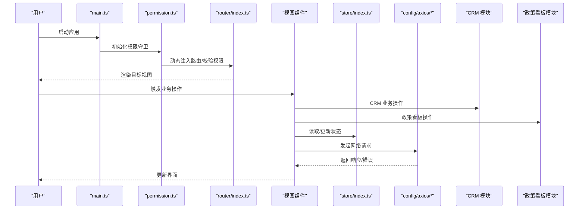

**图表来源**
- [main.ts](file://yudao-ui/yudao-ui-admin-vue3/src/main.ts)
- [permission.ts](file://yudao-ui/yudao-ui-admin-vue3/src/permission.ts)
- [index.ts](file://yudao-ui/yudao-ui-admin-vue3/src/router/index.ts)
- [index.ts](file://yudao-ui/yudao-ui-admin-vue3/src/store/index.ts)
- [index.ts](file://yudao-ui/yudao-ui-admin-vue3/src/config/axios/index.ts)
- [useCsWebSocket.ts](file://yudao-ui/yudao-ui-admin-vue3/src/hooks/useCsWebSocket.ts)

## 详细组件分析

### Composition API 使用模式与组件化设计
- 组合式函数：在 hooks/web 与 utils 中沉淀通用逻辑，如事件、Web 相关能力，避免重复造轮子。
- 组件化理念：以"可复用、可组合、可测试"为目标，组件通过 props、emits、slots 明确边界，内部使用 ref/reactive 管理状态，computed/watch 控制派生与副作用。
- 类型安全：所有组件与工具函数均使用 TypeScript，结合类型声明文件保证接口一致性与 IDE 支持。

**章节来源**
- [main.ts](file://yudao-ui/yudao-ui-admin-vue3/src/main.ts)
- [tsconfig.json](file://yudao-ui/yudao-ui-admin-vue3/tsconfig.json)

### Pinia 状态管理架构
- Store 模块划分：按业务域拆分 modules，每个模块包含 state、getters、actions，并通过 index.ts 统一导出命名空间。
- 状态持久化：可通过插件或自定义序列化策略实现部分状态持久化，建议仅对轻量非敏感数据启用持久化。
- 异步数据处理：在 actions 内部集中处理 API 调用、loading 状态与错误反馈，避免在组件中直接操作异步逻辑。


**图表来源**
- [index.ts](file://yudao-ui/yudao-ui-admin-vue3/src/store/index.ts)

**章节来源**
- [index.ts](file://yudao-ui/yudao-ui-admin-vue3/src/store/index.ts)

### Vue Router 路由系统设计
- 路由守卫：在 permission.ts 中实现全局前置守卫，校验登录态与权限，必要时动态注入路由模块。
- 动态路由：根据用户权限与菜单树生成路由表，支持懒加载与模块化拆分，减少首屏体积。
- 权限控制：结合后端返回的菜单/按钮权限，控制页面元素与操作按钮的显示隐藏。

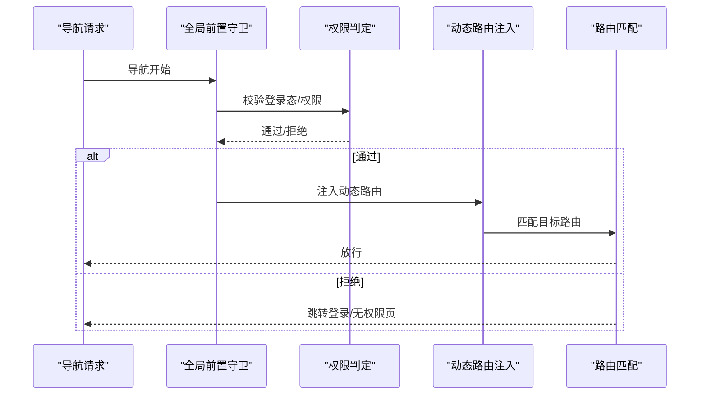

**图表来源**
- [permission.ts](file://yudao-ui/yudao-ui-admin-vue3/src/permission.ts)
- [index.ts](file://yudao-ui/yudao-ui-admin-vue3/src/router/index.ts)

**章节来源**
- [permission.ts](file://yudao-ui/yudao-ui-admin-vue3/src/permission.ts)
- [index.ts](file://yudao-ui/yudao-ui-admin-vue3/src/router/index.ts)

### Element Plus 组件库集成与定制
- 集成方式：在 plugins/elementPlus 中按需引入组件与图标，统一注册到应用实例。
- 主题配置：通过 styles/theme.scss 与 variables.scss 定义主题变量，结合 UnoCSS/PostCSS 实现样式覆盖与按需编译。
- 组件封装：在 components 目录下提供通用封装组件（如 Dialog、Form、Table 等），统一交互与样式风格。

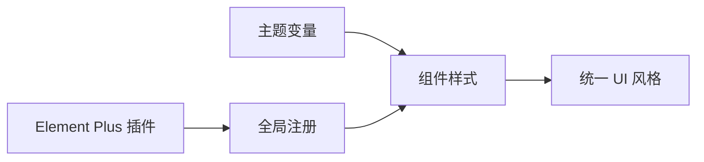

**图表来源**
- [index.ts](file://yudao-ui/yudao-ui-admin-vue3/src/plugins/elementPlus/index.ts)
- [index.scss](file://yudao-ui/yudao-ui-admin-vue3/src/styles/index.scss)
- [theme.scss](file://yudao-ui/yudao-ui-admin-vue3/src/styles/theme.scss)
- [variables.scss](file://yudao-ui/yudao-ui-admin-vue3/src/styles/variables.scss)

**章节来源**
- [index.ts](file://yudao-ui/yudao-ui-admin-vue3/src/plugins/elementPlus/index.ts)
- [index.scss](file://yudao-ui/yudao-ui-admin-vue3/src/styles/index.scss)
- [theme.scss](file://yudao-ui/yudao-ui-admin-vue3/src/styles/theme.scss)
- [variables.scss](file://yudao-ui/yudao-ui-admin-vue3/src/styles/variables.scss)

### Axios 网络请求封装
- 请求拦截器：统一添加 Token、Content-Type、超时等配置，支持环境隔离。
- 响应拦截器：解析响应状态、统一错误码映射与提示，支持自动登出与重定向。
- 错误处理：定义 errorCode.ts 映射服务端错误码，结合 i18n 提示用户友好信息。
- 请求重试：在特定场景（如网络抖动）可实现指数退避重试策略，避免阻塞主线程。

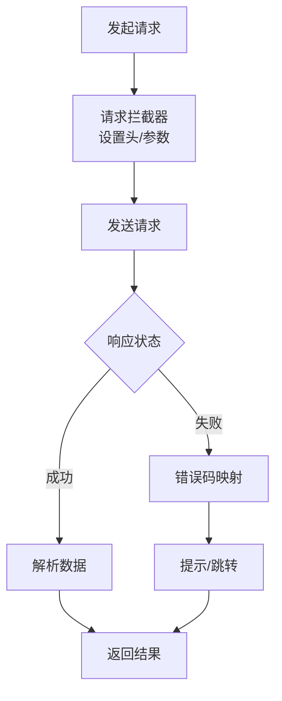

**图表来源**
- [service.ts](file://yudao-ui/yudao-ui-admin-vue3/src/config/axios/service.ts)
- [config.ts](file://yudao-ui/yudao-ui-admin-vue3/src/config/axios/config.ts)
- [errorCode.ts](file://yudao-ui/yudao-ui-admin-vue3/src/config/axios/errorCode.ts)

**章节来源**
- [index.ts](file://yudao-ui/yudao-ui-admin-vue3/src/config/axios/index.ts)
- [service.ts](file://yudao-ui/yudao-ui-admin-vue3/src/config/axios/service.ts)
- [config.ts](file://yudao-ui/yudao-ui-admin-vue3/src/config/axios/config.ts)
- [errorCode.ts](file://yudao-ui/yudao-ui-admin-vue3/src/config/axios/errorCode.ts)

### 国际化与本地化支持
- 多语言词条：locales 下维护 en.ts 与 zh-CN.ts，键值采用层级化命名，便于维护与查找。
- 切换策略：通过插件 vueI18n 实现语言切换，结合浏览器语言与用户偏好记忆，提供回退机制。
- 组件化使用：在组件中通过 $t 或 useI18n 获取文本，避免硬编码字符串。

**章节来源**
- [en.ts](file://yudao-ui/yudao-ui-admin-vue3/src/locales/en.ts)
- [zh-CN.ts](file://yudao-ui/yudao-ui-admin-vue3/src/locales/zh-CN.ts)
- [index.ts](file://yudao-ui/yudao-ui-admin-vue3/src/plugins/vueI18n/index.ts)

### 权限指令与细粒度控制
- 指令注册：在 directives/index.ts 中统一注册权限指令，按需在模板中使用。
- 权限判断：结合用户权限集合与指令参数，决定元素是否渲染或可交互。
- 与路由联动：指令与路由守卫共同构成前后端一体化的权限控制体系。

**章节来源**
- [index.ts](file://yudao-ui/yudao-ui-admin-vue3/src/directives/index.ts)

### CRM 模块架构设计

#### 客户管理模块
CRM 模块提供完整的企业客户关系管理功能，包括客户信息管理、公海客户管理、数据权限控制等核心能力：

- **客户列表管理**：支持按客户名称、手机、所属行业、客户级别、客户来源等条件搜索
- **数据权限控制**：通过 sceneType 参数区分"我负责的"、"我参与的"、"下属负责的"三种权限场景
- **批量操作**：支持新增、编辑、删除、导入、导出等批量操作
- **字典标签**：使用字典类型显示客户级别、来源、行业等枚举值
- **时间格式化**：统一使用 dateFormatter 格式化日期显示

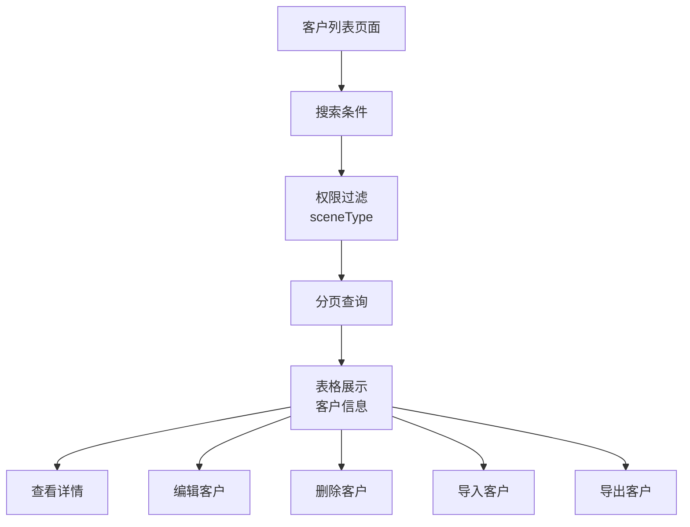

**图表来源**
- [index.vue](file://yudao-ui/yudao-ui-admin-vue3/src/views/crm/customer/index.vue)

#### 线索管理模块
线索管理模块专注于潜在客户的跟踪与转化，提供完整的线索生命周期管理：

- **线索状态管理**：支持转化状态筛选（未转化/已转化）
- **联系方式管理**：支持手机、电话、邮箱等多渠道联系方式
- **客户画像**：关联客户行业、客户级别等基本信息
- **跟进记录**：记录最后跟进时间和跟进内容
- **权限控制**：支持按负责人、参与人、下属负责的权限场景

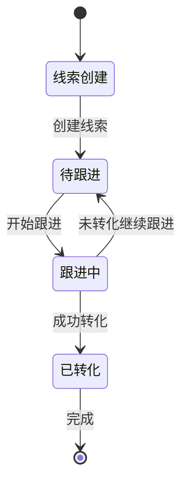

**图表来源**
- [index.vue](file://yudao-ui/yudao-ui-admin-vue3/src/views/crm/clue/index.vue)

#### 商机管理模块
商机管理模块提供销售机会的全流程管理，支持商机状态流转和数据分析：

- **商机状态管理**：支持商机状态组和阶段的管理
- **金额管理**：支持商机金额的精确计算和显示
- **客户关联**：支持与客户、联系人、合同的关联管理
- **权限控制**：支持多维度权限场景的控制
- **导出功能**：支持商机数据的批量导出

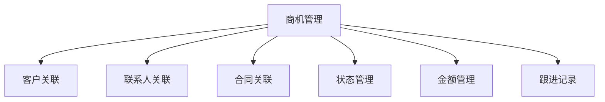

**图表来源**
- [index.vue](file://yudao-ui/yudao-ui-admin-vue3/src/views/crm/business/index.vue)

#### 合同管理模块
合同管理模块提供完整的合同生命周期管理，支持审批流程和财务管控：

- **审批流程**：支持合同的提交审核、审批查看等流程管理
- **财务管控**：支持合同金额、已回款金额、未回款金额的财务统计
- **关联管理**：支持与客户、商机、联系人的关联管理
- **状态管理**：使用字典类型管理合同审核状态
- **权限控制**：支持不同状态下操作权限的控制

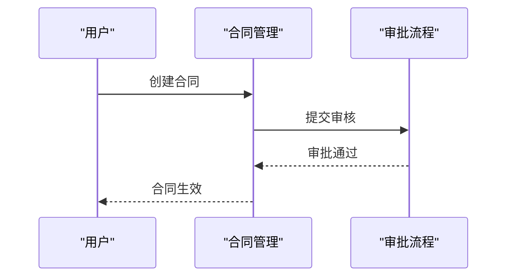

**图表来源**
- [index.vue](file://yudao-ui/yudao-ui-admin-vue3/src/views/crm/contract/index.vue)

#### 政策看板模块架构设计

##### 指标分析与目标分布
政策看板模块提供多维度的政策分析功能，支持指标可视化和目标分布分析：

- **指标柱状图**：展示各项指标的完成情况和目标分布
- **筛选器**：支持年份、产品线、经销商、政策类型等多维度过滤
- **交互功能**：支持点击指标查看政策列表、点击目标分布查看详细信息
- **数据联动**：筛选器变化时，所有图表数据同步更新

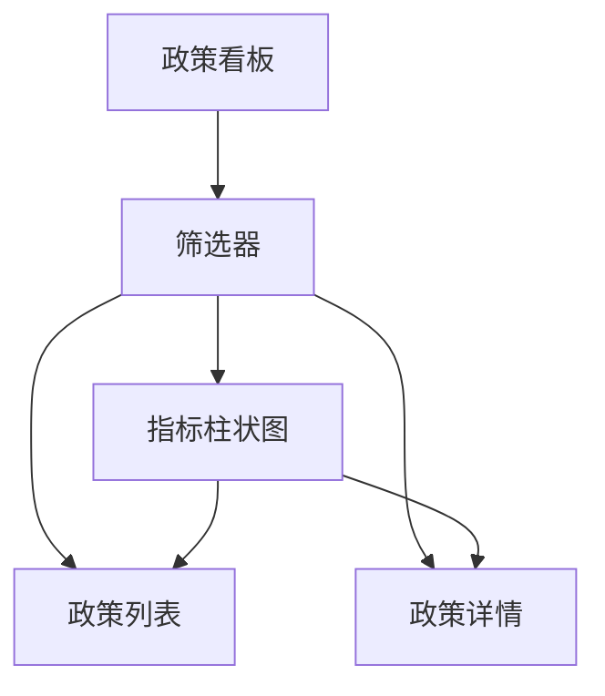

**图表来源**
- [index.vue](file://yudao-ui/yudao-ui-admin-vue3/src/views/opshub/policy/index.vue)

##### 多层级钻取功能
政策看板支持多层级的数据钻取，提供深入的分析视角：

- **政策数量钻取**：点击标题查看对应政策的详细列表
- **目标分布钻取**：点击药丸状目标查看该目标下的政策详情
- **达成明细钻取**：点击政策详情中的达成值查看详细的达成明细
- **弹窗交互**：通过弹窗组件提供丰富的交互体验

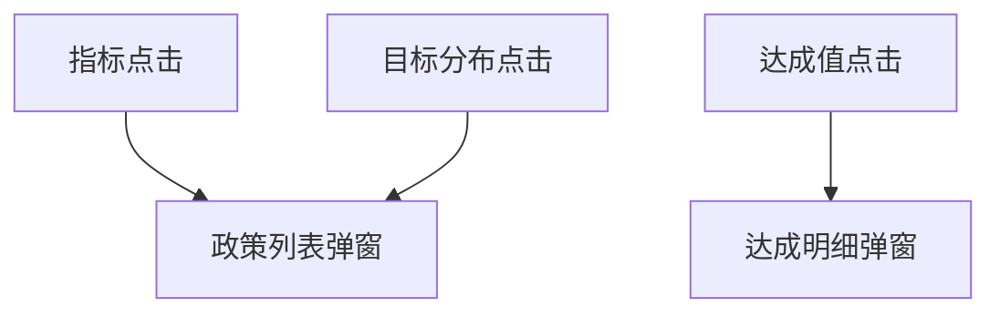

**图表来源**
- [index.vue](file://yudao-ui/yudao-ui-admin-vue3/src/views/opshub/policy/index.vue)

#### 统计分析模块架构设计

##### 客户分析统计
统计分析模块提供多维度的客户数据分析功能：

- **时间范围分析**：支持日、周、月、年等不同时间粒度的分析
- **部门权限控制**：支持按部门和员工的权限控制
- **多维度分析**：涵盖客户总量、跟进次数、转化率、成交周期等多个维度
- **图表可视化**：通过多种图表类型展示分析结果

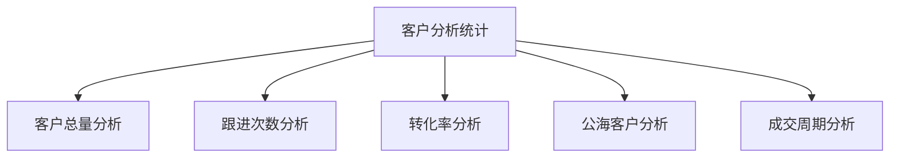

**图表来源**
- [index.vue](file://yudao-ui/yudao-ui-admin-vue3/src/views/crm/statistics/customer/index.vue)

##### 销售漏斗分析
销售漏斗分析模块专注于销售过程的可视化分析：

- **漏斗图展示**：直观展示从线索到成交的转化过程
- **商机分析**：分析新增商机和商机转化率
- **时间维度**：支持不同时间粒度的漏斗分析
- **部门对比**：支持不同部门间的销售漏斗对比

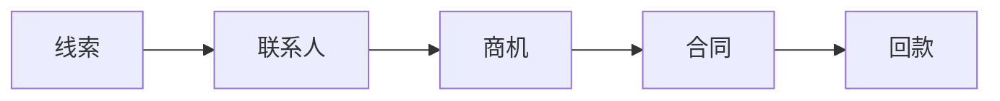

**图表来源**
- [index.vue](file://yudao-ui/yudao-ui-admin-vue3/src/views/crm/statistics/funnel/index.vue)

##### 员工业绩分析
员工业绩分析模块提供个人和团队的绩效评估功能：

- **合同统计**：分析员工的合同数量和金额统计
- **回款统计**：跟踪员工的回款完成情况
- **年度分析**：支持按年份的业绩分析
- **部门对比**：支持部门间的业绩对比分析

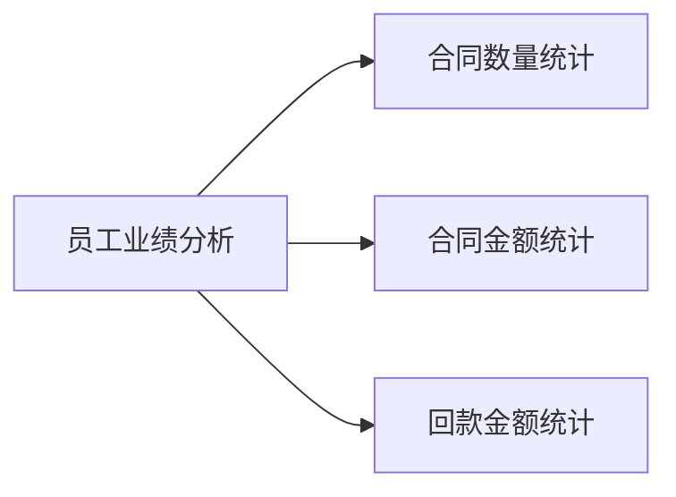

**图表来源**
- [index.vue](file://yudao-ui/yudao-ui-admin-vue3/src/views/crm/statistics/performance/index.vue)

### 组件开发规范与 UI 设计指南
- 组件命名：采用 PascalCase，功能明确，避免过度抽象。
- Props/Events：严格定义类型与默认值，保持单向数据流。
- 样式：优先使用 CSS Modules 或 scoped 样式，避免全局污染；主题变量统一管理。
- 可访问性：为交互元素提供语义化标签与键盘支持。
- 文档与示例：为复杂组件提供使用示例与变更日志。
- **新增**：CRM 组件规范：遵循 Material Design 设计语言，统一表格样式和操作按钮。
- **新增**：政策看板组件规范：提供清晰的视觉层次和交互反馈，支持多层级钻取。
- **新增**：统计分析组件规范：采用统一的图表组件库，确保数据可视化的准确性。
- **新增**：聊天组件规范：遵循 Material Design 设计语言，统一消息气泡样式和交互反馈。
- **新增**：经销商选择对话框：提供清晰的视觉层次和操作引导，支持一键选择。
- **新增**：工单下发模态框：采用表单验证和自动计算，确保数据完整性。

## 依赖关系分析
- 运行时依赖：Vue 3、Element Plus、Vue Router、Pinia、Axios、dayjs、crypto-js、@vueuse/core 等。
- 开发依赖：Vite、TypeScript、ESLint、Prettier、Stylelint、UnoCSS、PostCSS 等。
- 构建链路：Vite 负责开发服务器与打包，ESLint/TS/Stylelint 保障代码质量，UnoCSS/PostCSS 优化样式输出。
- **新增**：WebSocket 依赖：@vueuse/core 提供 useWebSocket 组合式函数，支持现代浏览器 WebSocket API。
- **新增**：聊天组件依赖：dayjs 用于时间计算，Element Plus 提供图标和组件支持。
- **新增**：CRM 模块依赖：Element Plus 的表单、表格、对话框等组件，dayjs 用于时间格式化。
- **新增**：政策看板依赖：图表组件库、弹窗组件、筛选器组件等。
- **新增**：统计分析依赖：图表组件库、日期选择器、树形选择器等。

```mermaid
graph TB
subgraph "运行时"
VUE["Vue 3"]
ROUTER["Vue Router"]
PINIA["Pinia"]
AX["Axios"]
ELE["Element Plus"]
VUEUSE["@vueuse/core"]
DAYJS["dayjs"]
END
subgraph "开发工具"
VITE["Vite"]
ESL["ESLint"]
TS["TypeScript"]
PRET["Prettier"]
STYLE["Stylelint"]
UNO["UnoCSS"]
POST["PostCSS"]
END
VITE --> VUE
VITE --> ELE
VUE --> ROUTER
VUE --> PINIA
PINIA --> AX
VUEUSE --> VUE
DAYJS --> VUE
VITE --> ESL
VITE --> TS
VITE --> PRET
VITE --> STYLE
VITE --> UNO
VITE --> POST
```

**图表来源**
- [package.json](file://yudao-ui/yudao-ui-admin-vue3/package.json)
- [vite.config.ts](file://yudao-ui/yudao-ui-admin-vue3/vite.config.ts)
- [eslint.config.mjs](file://yudao-ui/yudao-ui-admin-vue3/eslint.config.mjs)
- [tsconfig.json](file://yudao-ui/yudao-ui-admin-vue3/tsconfig.json)
- [uno.config.ts](file://yudao-ui/yudao-ui-admin-vue3/uno.config.ts)
- [postcss.config.js](file://yudao-ui/yudao-ui-admin-vue3/postcss.config.js)

**章节来源**
- [package.json](file://yudao-ui/yudao-ui-admin-vue3/package.json)
- [vite.config.ts](file://yudao-ui/yudao-ui-admin-vue3/vite.config.ts)
- [eslint.config.mjs](file://yudao-ui/yudao-ui-admin-vue3/eslint.config.mjs)
- [tsconfig.json](file://yudao-ui/yudao-ui-admin-vue3/tsconfig.json)
- [uno.config.ts](file://yudao-ui/yudao-ui-admin-vue3/uno.config.ts)
- [postcss.config.js](file://yudao-ui/yudao-ui-admin-vue3/postcss.config.js)

## 性能考虑
- 代码分割：路由级懒加载与按需导入第三方库，降低首屏包体。
- 资源压缩：生产环境启用最小化与 Tree Shaking，移除未使用代码。
- 缓存策略：静态资源配置长缓存，接口数据使用合理缓存与失效策略。
- 样式优化：按需引入组件样式，使用 UnoCSS 实现原子化样式与摇树优化。
- 图片与媒体：采用 WebP/AVIF 等现代格式，懒加载与尺寸裁剪。
- 网络优化：合并请求、节流防抖、离线兜底与错误重试。
- **新增**：WebSocket 优化：自动重连、心跳检测、消息去重，确保实时通信稳定性。
- **新增**：聊天组件优化：虚拟滚动、消息分页加载、图片懒加载。
- **新增**：CRM 模块优化：列表分页加载、权限过滤、批量操作优化。
- **新增**：政策看板优化：图表懒加载、筛选器缓存、数据预加载。
- **新增**：统计分析优化：图表组件复用、数据缓存、时间范围优化。

## 故障排查指南
- 登录态异常：检查权限守卫中的登录态判断与 Token 刷新逻辑。
- 路由白屏：确认动态路由注入顺序与路由表正确性，排查懒加载路径。
- 网络错误：查看拦截器中的错误映射与提示策略，核对服务端返回码。
- 国际化缺失：确认语言包键名拼写与回退逻辑，检查切换流程。
- 样式冲突：定位 scoped 作用域与主题变量覆盖范围，避免全局污染。
- **新增**：WebSocket 连接问题：检查 token 有效性、网络连接状态、服务器地址配置。
- **新增**：聊天消息异常：验证消息格式、检查 cs- 前缀过滤逻辑、确认消息类型映射。
- **新增**：经销商选择异常：检查 getMyDealers API 返回数据、对话框状态管理。
- **新增**：工单下发失败：验证表单验证规则、检查 SLA 时间计算逻辑。
- **新增**：CRM 模块异常**：检查 API 接口调用、权限过滤逻辑、数据格式化。
- **新增**：政策看板异常**：检查筛选器参数、图表渲染、弹窗组件状态。
- **新增**：统计分析异常**：检查时间范围参数、图表组件、数据加载状态。

**章节来源**
- [permission.ts](file://yudao-ui/yudao-ui-admin-vue3/src/permission.ts)
- [index.ts](file://yudao-ui/yudao-ui-admin-vue3/src/config/axios/index.ts)
- [errorCode.ts](file://yudao-ui/yudao-ui-admin-vue3/src/config/axios/errorCode.ts)
- [en.ts](file://yudao-ui/yudao-ui-admin-vue3/src/locales/en.ts)
- [zh-CN.ts](file://yudao-ui/yudao-ui-admin-vue3/src/locales/zh-CN.ts)
- [useCsWebSocket.ts](file://yudao-ui/yudao-ui-admin-vue3/src/hooks/useCsWebSocket.ts)
- [useCsConsult.ts](file://yudao-ui/yudao-ui-admin-vue3/src/hooks/useCsConsult.ts)

## 结论
本架构以 Vue 3 + TypeScript 为基础，结合 Composition API、Pinia、Vue Router、Element Plus 与 Axios，形成清晰的职责边界与可扩展的模块化结构。通过完善的权限体系、国际化与主题定制、网络层封装与构建优化，能够支撑复杂后台系统的前端需求。新增的 CRM 模块、政策看板模块和统计分析模块进一步增强了系统的业务能力，通过标准化的 CRUD 操作、数据权限控制、批量处理功能和多维度数据分析，为企业的客户关系管理、政策分析和业务决策提供了强大的前端支撑。建议在后续迭代中持续完善组件库生态、增强可访问性与自动化测试，进一步提升开发效率与用户体验。

## 附录
- 开发环境：Node.js 与包管理器版本见 package.json；TypeScript 配置参考 tsconfig.json。
- 代码质量：ESLint 与 Stylelint 配置位于 eslint.config.mjs 与 stylelint.config.js。
- 样式工具：UnoCSS 与 PostCSS 配置分别位于 uno.config.ts 与 postcss.config.js。
- 构建命令：参考 package.json scripts 字段，常用 dev/build/preview。
- **新增**：聊天组件使用：通过 ConsultTab 页面集成 ChatWindow 组件，支持在线客服咨询与会话管理。
- **新增**：咨询流程集成：useCsConsult 组合式函数简化各业务模块的咨询接入，支持批量处理和智能经销商选择。
- **新增**：CRM 模块使用：通过各个业务页面集成完整的 CRM 功能，支持客户管理、线索跟踪、商机转化等业务流程。
- **新增**：政策看板使用：通过政策看板页面集成指标分析、目标分布、政策详情等功能，支持多维度的政策分析。
- **新增**：统计分析使用：通过统计分析页面集成客户分析、销售漏斗、业绩分析等功能，提供全面的业务数据分析。