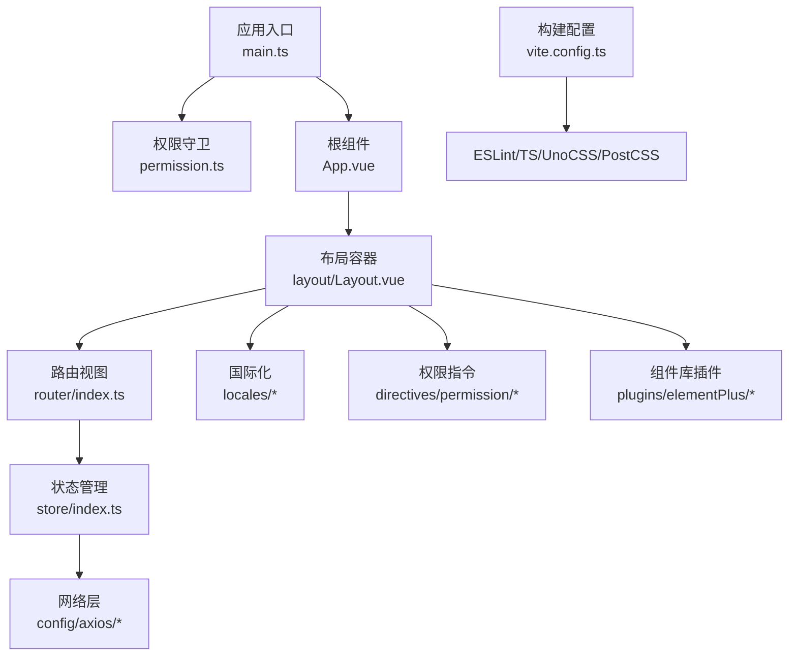
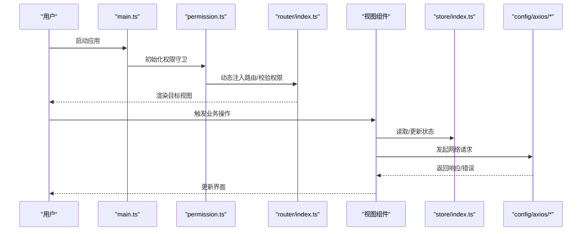
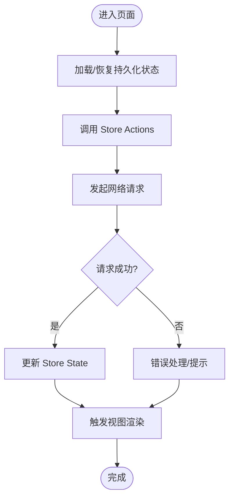
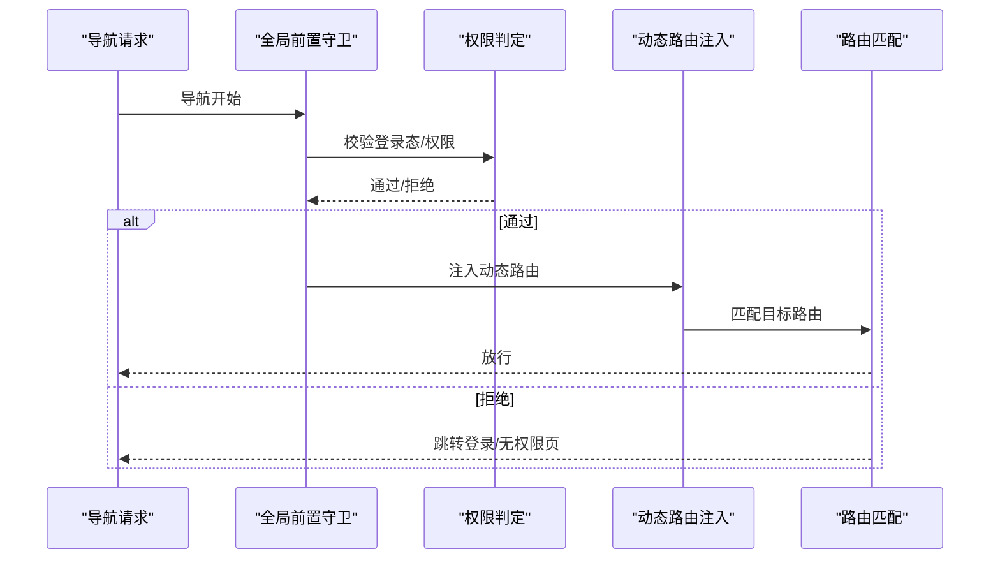
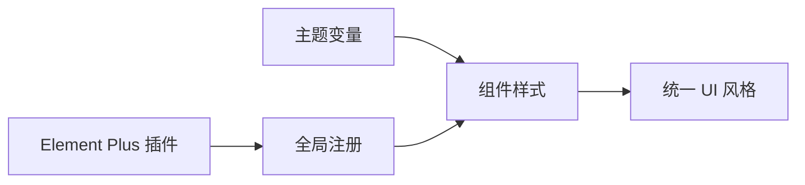
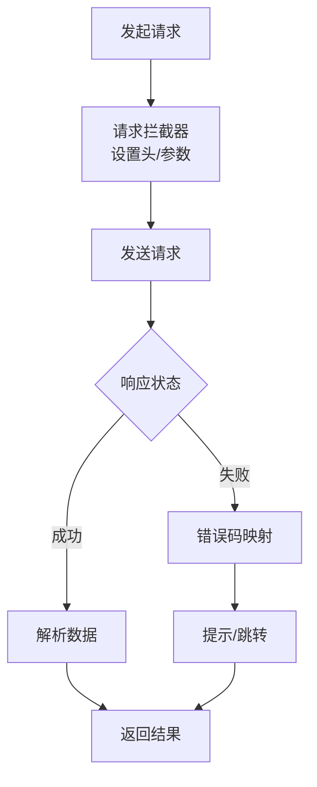
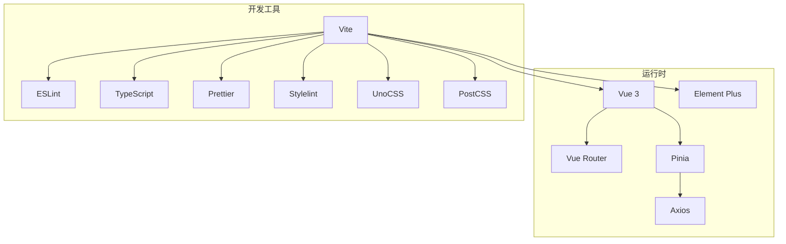

# 前端架构

<cite>
**本文引用的文件**
- [package.json](file://yudao-ui/yudao-ui-admin-vue3/package.json)
- [vite.config.ts](file://yudao-ui/yudao-ui-admin-vue3/vite.config.ts)
- [main.ts](file://yudao-ui/yudao-ui-admin-vue3/src/main.ts)
- [permission.ts](file://yudao-ui/yudao-ui-admin-vue3/src/permission.ts)
- [App.vue](file://yudao-ui/yudao-ui-admin-vue3/src/App.vue)
- [Layout.vue](file://yudao-ui/yudao-ui-admin-vue3/src/layout/Layout.vue)
- [index.ts](file://yudao-ui/yudao-ui-admin-vue3/src/router/index.ts)
- [index.ts](file://yudao-ui/yudao-ui-admin-vue3/src/store/index.ts)
- [index.ts](file://yudao-ui/yudao-ui-admin-vue3/src/config/axios/index.ts)
- [service.ts](file://yudao-ui/yudao-ui-admin-vue3/src/config/axios/service.ts)
- [config.ts](file://yudao-ui/yudao-ui-admin-vue3/src/config/axios/config.ts)
- [errorCode.ts](file://yudao-ui/yudao-ui-admin-vue3/src/config/axios/errorCode.ts)
- [en.ts](file://yudao-ui/yudao-ui-admin-vue3/src/locales/en.ts)
- [zh-CN.ts](file://yudao-ui/yudao-ui-admin-vue3/src/locales/zh-CN.ts)
- [index.ts](file://yudao-ui/yudao-ui-admin-vue3/src/directives/index.ts)
- [index.ts](file://yudao-ui/yudao-ui-admin-vue3/src/components/index.ts)
- [index.ts](file://yudao-ui/yudao-ui-admin-vue3/src/plugins/elementPlus/index.ts)
- [index.ts](file://yudao-ui/yudao-ui-admin-vue3/src/plugins/vueI18n/index.ts)
- [uno.config.ts](file://yudao-ui/yudao-ui-admin-vue3/uno.config.ts)
- [postcss.config.js](file://yudao-ui/yudao-ui-admin-vue3/postcss.config.js)
- [eslint.config.mjs](file://yudao-ui/yudao-ui-admin-vue3/eslint.config.mjs)
- [tsconfig.json](file://yudao-ui/yudao-ui-admin-vue3/tsconfig.json)
</cite>

## 目录
1. [引言](#引言)
2. [项目结构](#项目结构)
3. [核心组件](#核心组件)
4. [架构总览](#架构总览)
5. [详细组件分析](#详细组件分析)
6. [依赖关系分析](#依赖关系分析)
7. [性能考虑](#性能考虑)
8. [故障排查指南](#故障排查指南)
9. [结论](#结论)
10. [附录](#附录)

## 引言
本文件面向芋道 Ruoyi-Vue-Pro 的前端团队与贡献者，系统性梳理基于 Vue 3 + TypeScript 的前端架构设计，涵盖 Composition API 使用模式、组件化理念、Pinia 状态管理、Vue Router 路由体系、Element Plus 组件库集成与定制、Axios 网络层封装、国际化与本地化、构建配置与性能优化，以及组件开发规范与 UI 设计指南。目标是帮助开发者在统一的工程化标准下高效协作，产出高质量可维护的前端代码。

## 项目结构
前端工程位于 yudao-ui/yudao-ui-admin-vue3 目录，采用“按功能域分层 + 类型声明 + 插件扩展”的组织方式：
- 应用入口与权限：main.ts、permission.ts、App.vue
- 路由系统：router/index.ts 及其 modules 子模块
- 状态管理：store/index.ts 及 modules 子模块
- 网络层：config/axios 下的 index.ts、service.ts、config.ts、errorCode.ts
- 国际化：locales 下的 en.ts、zh-CN.ts
- 权限指令：directives/permission
- 组件库与插件：plugins/elementPlus、plugins/vueI18n 等
- 样式与主题：styles 下的全局样式与主题变量
- 工具与类型：utils、types
- 构建与质量：vite.config.ts、eslint.config.mjs、tsconfig.json、uno.config.ts、postcss.config.js

图表来源
- [main.ts](file://yudao-ui/yudao-ui-admin-vue3/src/main.ts)
- [permission.ts](file://yudao-ui/yudao-ui-admin-vue3/src/permission.ts)
- [App.vue](file://yudao-ui/yudao-ui-admin-vue3/src/App.vue)
- [Layout.vue](file://yudao-ui/yudao-ui-admin-vue3/src/layout/Layout.vue)
- [index.ts](file://yudao-ui/yudao-ui-admin-vue3/src/router/index.ts)
- [index.ts](file://yudao-ui/yudao-ui-admin-vue3/src/store/index.ts)
- [index.ts](file://yudao-ui/yudao-ui-admin-vue3/src/config/axios/index.ts)
- [en.ts](file://yudao-ui/yudao-ui-admin-vue3/src/locales/en.ts)
- [zh-CN.ts](file://yudao-ui/yudao-ui-admin-vue3/src/locales/zh-CN.ts)
- [index.ts](file://yudao-ui/yudao-ui-admin-vue3/src/directives/index.ts)
- [index.ts](file://yudao-ui/yudao-ui-admin-vue3/src/plugins/elementPlus/index.ts)
- [vite.config.ts](file://yudao-ui/yudao-ui-admin-vue3/vite.config.ts)
- [eslint.config.mjs](file://yudao-ui/yudao-ui-admin-vue3/eslint.config.mjs)
- [tsconfig.json](file://yudao-ui/yudao-ui-admin-vue3/tsconfig.json)
- [uno.config.ts](file://yudao-ui/yudao-ui-admin-vue3/uno.config.ts)
- [postcss.config.js](file://yudao-ui/yudao-ui-admin-vue3/postcss.config.js)

章节来源
- [package.json](file://yudao-ui/yudao-ui-admin-vue3/package.json)
- [vite.config.ts](file://yudao-ui/yudao-ui-admin-vue3/vite.config.ts)
- [main.ts](file://yudao-ui/yudao-ui-admin-vue3/src/main.ts)
- [permission.ts](file://yudao-ui/yudao-ui-admin-vue3/src/permission.ts)
- [App.vue](file://yudao-ui/yudao-ui-admin-vue3/src/App.vue)
- [Layout.vue](file://yudao-ui/yudao-ui-admin-vue3/src/layout/Layout.vue)
- [index.ts](file://yudao-ui/yudao-ui-admin-vue3/src/router/index.ts)
- [index.ts](file://yudao-ui/yudao-ui-admin-vue3/src/store/index.ts)
- [index.ts](file://yudao-ui/yudao-ui-admin-vue3/src/config/axios/index.ts)
- [service.ts](file://yudao-ui/yudao-ui-admin-vue3/src/config/axios/service.ts)
- [config.ts](file://yudao-ui/yudao-ui-admin-vue3/src/config/axios/config.ts)
- [errorCode.ts](file://yudao-ui/yudao-ui-admin-vue3/src/config/axios/errorCode.ts)
- [en.ts](file://yudao-ui/yudao-ui-admin-vue3/src/locales/en.ts)
- [zh-CN.ts](file://yudao-ui/yudao-ui-admin-vue3/src/locales/zh-CN.ts)
- [index.ts](file://yudao-ui/yudao-ui-admin-vue3/src/directives/index.ts)
- [index.ts](file://yudao-ui/yudao-ui-admin-vue3/src/components/index.ts)
- [index.ts](file://yudao-ui/yudao-ui-admin-vue3/src/plugins/elementPlus/index.ts)
- [index.ts](file://yudao-ui/yudao-ui-admin-vue3/src/plugins/vueI18n/index.ts)
- [uno.config.ts](file://yudao-ui/yudao-ui-admin-vue3/uno.config.ts)
- [postcss.config.js](file://yudao-ui/yudao-ui-admin-vue3/postcss.config.js)
- [eslint.config.mjs](file://yudao-ui/yudao-ui-admin-vue3/eslint.config.mjs)
- [tsconfig.json](file://yudao-ui/yudao-ui-admin-vue3/tsconfig.json)

## 核心组件
- 应用入口与初始化：通过 main.ts 注入插件、挂载应用、注册路由与状态；permission.ts 在导航前执行权限校验与动态路由注入。
- 布局与页面：Layout.vue 提供统一布局骨架，router/index.ts 管理路由表与模块化拆分。
- 状态管理：store/index.ts 统一导出 Store 实例，modules 下按业务域拆分 Store。
- 网络层：config/axios 将 Axios 实例、拦截器、错误码映射与默认配置解耦，便于复用与扩展。
- 国际化：locales 中维护多语言词条，结合插件完成切换与回退策略。
- 权限与指令：directives/permission 提供细粒度权限指令，配合后端菜单/按钮权限进行界面元素显隐控制。
- 组件库与主题：plugins/elementPlus 集成 Element Plus 并提供主题变量覆盖；styles 提供全局样式与主题变量。

章节来源
- [main.ts](file://yudao-ui/yudao-ui-admin-vue3/src/main.ts)
- [permission.ts](file://yudao-ui/yudao-ui-admin-vue3/src/permission.ts)
- [Layout.vue](file://yudao-ui/yudao-ui-admin-vue3/src/layout/Layout.vue)
- [index.ts](file://yudao-ui/yudao-ui-admin-vue3/src/router/index.ts)
- [index.ts](file://yudao-ui/yudao-ui-admin-vue3/src/store/index.ts)
- [index.ts](file://yudao-ui/yudao-ui-admin-vue3/src/config/axios/index.ts)
- [service.ts](file://yudao-ui/yudao-ui-admin-vue3/src/config/axios/service.ts)
- [config.ts](file://yudao-ui/yudao-ui-admin-vue3/src/config/axios/config.ts)
- [errorCode.ts](file://yudao-ui/yudao-ui-admin-vue3/src/config/axios/errorCode.ts)
- [en.ts](file://yudao-ui/yudao-ui-admin-vue3/src/locales/en.ts)
- [zh-CN.ts](file://yudao-ui/yudao-ui-admin-vue3/src/locales/zh-CN.ts)
- [index.ts](file://yudao-ui/yudao-ui-admin-vue3/src/directives/index.ts)
- [index.ts](file://yudao-ui/yudao-ui-admin-vue3/src/plugins/elementPlus/index.ts)

## 架构总览
前端采用“入口 -> 权限守卫 -> 路由 -> 视图 -> 状态 -> 网络 -> 国际化/主题”的主干流程，结合插件化与模块化设计，确保高内聚低耦合。

图表来源
- [main.ts](file://yudao-ui/yudao-ui-admin-vue3/src/main.ts)
- [permission.ts](file://yudao-ui/yudao-ui-admin-vue3/src/permission.ts)
- [index.ts](file://yudao-ui/yudao-ui-admin-vue3/src/router/index.ts)
- [index.ts](file://yudao-ui/yudao-ui-admin-vue3/src/store/index.ts)
- [index.ts](file://yudao-ui/yudao-ui-admin-vue3/src/config/axios/index.ts)

## 详细组件分析

### Composition API 使用模式与组件化设计
- 组合式函数：在 hooks/web 与 utils 中沉淀通用逻辑，如事件、Web 相关能力，避免重复造轮子。
- 组件化理念：以“可复用、可组合、可测试”为目标，组件通过 props、emits、slots 明确边界，内部使用 ref/reactive 管理状态，computed/watch 控制派生与副作用。
- 类型安全：所有组件与工具函数均使用 TypeScript，结合类型声明文件保证接口一致性与 IDE 支持。

章节来源
- [main.ts](file://yudao-ui/yudao-ui-admin-vue3/src/main.ts)
- [tsconfig.json](file://yudao-ui/yudao-ui-admin-vue3/tsconfig.json)

### Pinia 状态管理架构
- Store 模块划分：按业务域拆分 modules，每个模块包含 state、getters、actions，并通过 index.ts 统一导出命名空间。
- 状态持久化：可通过插件或自定义序列化策略实现部分状态持久化，建议仅对轻量非敏感数据启用持久化。
- 异步数据处理：在 actions 内部集中处理 API 调用、loading 状态与错误反馈，避免在组件中直接操作异步逻辑。

图表来源
- [index.ts](file://yudao-ui/yudao-ui-admin-vue3/src/store/index.ts)

章节来源
- [index.ts](file://yudao-ui/yudao-ui-admin-vue3/src/store/index.ts)

### Vue Router 路由系统设计
- 路由守卫：在 permission.ts 中实现全局前置守卫，校验登录态与权限，必要时动态注入路由模块。
- 动态路由：根据用户权限与菜单树生成路由表，支持懒加载与模块化拆分，减少首屏体积。
- 权限控制：结合后端返回的菜单/按钮权限，控制页面元素与操作按钮的显示隐藏。

图表来源
- [permission.ts](file://yudao-ui/yudao-ui-admin-vue3/src/permission.ts)
- [index.ts](file://yudao-ui/yudao-ui-admin-vue3/src/router/index.ts)

章节来源
- [permission.ts](file://yudao-ui/yudao-ui-admin-vue3/src/permission.ts)
- [index.ts](file://yudao-ui/yudao-ui-admin-vue3/src/router/index.ts)

### Element Plus 组件库集成与定制
- 集成方式：在 plugins/elementPlus 中按需引入组件与图标，统一注册到应用实例。
- 主题配置：通过 styles/theme.scss 与 variables.scss 定义主题变量，结合 UnoCSS/PostCSS 实现样式覆盖与按需编译。
- 组件封装：在 components 目录下提供通用封装组件（如 Dialog、Form、Table 等），统一交互与样式风格。

图表来源
- [index.ts](file://yudao-ui/yudao-ui-admin-vue3/src/plugins/elementPlus/index.ts)
- [index.scss](file://yudao-ui/yudao-ui-admin-vue3/src/styles/index.scss)
- [theme.scss](file://yudao-ui/yudao-ui-admin-vue3/src/styles/theme.scss)
- [variables.scss](file://yudao-ui/yudao-ui-admin-vue3/src/styles/variables.scss)

章节来源
- [index.ts](file://yudao-ui/yudao-ui-admin-vue3/src/plugins/elementPlus/index.ts)
- [index.scss](file://yudao-ui/yudao-ui-admin-vue3/src/styles/index.scss)
- [theme.scss](file://yudao-ui/yudao-ui-admin-vue3/src/styles/theme.scss)
- [variables.scss](file://yudao-ui/yudao-ui-admin-vue3/src/styles/variables.scss)

### Axios 网络请求封装
- 请求拦截器：统一添加 Token、Content-Type、超时等配置，支持环境隔离。
- 响应拦截器：解析响应状态、统一错误码映射与提示，支持自动登出与重定向。
- 错误处理：定义 errorCode.ts 映射服务端错误码，结合 i18n 提示用户友好信息。
- 请求重试：在特定场景（如网络抖动）可实现指数退避重试策略，避免阻塞主线程。

图表来源
- [service.ts](file://yudao-ui/yudao-ui-admin-vue3/src/config/axios/service.ts)
- [config.ts](file://yudao-ui/yudao-ui-admin-vue3/src/config/axios/config.ts)
- [errorCode.ts](file://yudao-ui/yudao-ui-admin-vue3/src/config/axios/errorCode.ts)

章节来源
- [index.ts](file://yudao-ui/yudao-ui-admin-vue3/src/config/axios/index.ts)
- [service.ts](file://yudao-ui/yudao-ui-admin-vue3/src/config/axios/service.ts)
- [config.ts](file://yudao-ui/yudao-ui-admin-vue3/src/config/axios/config.ts)
- [errorCode.ts](file://yudao-ui/yudao-ui-admin-vue3/src/config/axios/errorCode.ts)

### 国际化与本地化支持
- 多语言词条：locales 下维护 en.ts 与 zh-CN.ts，键值采用层级化命名，便于维护与查找。
- 切换策略：通过插件 vueI18n 实现语言切换，结合浏览器语言与用户偏好记忆，提供回退机制。
- 组件化使用：在组件中通过 $t 或 useI18n 获取文本，避免硬编码字符串。

章节来源
- [en.ts](file://yudao-ui/yudao-ui-admin-vue3/src/locales/en.ts)
- [zh-CN.ts](file://yudao-ui/yudao-ui-admin-vue3/src/locales/zh-CN.ts)
- [index.ts](file://yudao-ui/yudao-ui-admin-vue3/src/plugins/vueI18n/index.ts)

### 权限指令与细粒度控制
- 指令注册：在 directives/index.ts 中统一注册权限指令，按需在模板中使用。
- 权限判断：结合用户权限集合与指令参数，决定元素是否渲染或可交互。
- 与路由联动：指令与路由守卫共同构成前后端一体化的权限控制体系。

章节来源
- [index.ts](file://yudao-ui/yudao-ui-admin-vue3/src/directives/index.ts)

### 组件开发规范与 UI 设计指南
- 组件命名：采用 PascalCase，功能明确，避免过度抽象。
- Props/Events：严格定义类型与默认值，保持单向数据流。
- 样式：优先使用 CSS Modules 或 scoped 样式，避免全局污染；主题变量统一管理。
- 可访问性：为交互元素提供语义化标签与键盘支持。
- 文档与示例：为复杂组件提供使用示例与变更日志。

## 依赖关系分析
- 运行时依赖：Vue 3、Element Plus、Vue Router、Pinia、Axios、dayjs、crypto-js 等。
- 开发依赖：Vite、TypeScript、ESLint、Prettier、Stylelint、UnoCSS、PostCSS 等。
- 构建链路：Vite 负责开发服务器与打包，ESLint/TS/Stylelint 保障代码质量，UnoCSS/PostCSS 优化样式输出。

图表来源
- [package.json](file://yudao-ui/yudao-ui-admin-vue3/package.json)
- [vite.config.ts](file://yudao-ui/yudao-ui-admin-vue3/vite.config.ts)
- [eslint.config.mjs](file://yudao-ui/yudao-ui-admin-vue3/eslint.config.mjs)
- [tsconfig.json](file://yudao-ui/yudao-ui-admin-vue3/tsconfig.json)
- [uno.config.ts](file://yudao-ui/yudao-ui-admin-vue3/uno.config.ts)
- [postcss.config.js](file://yudao-ui/yudao-ui-admin-vue3/postcss.config.js)

章节来源
- [package.json](file://yudao-ui/yudao-ui-admin-vue3/package.json)
- [vite.config.ts](file://yudao-ui/yudao-ui-admin-vue3/vite.config.ts)
- [eslint.config.mjs](file://yudao-ui/yudao-ui-admin-vue3/eslint.config.mjs)
- [tsconfig.json](file://yudao-ui/yudao-ui-admin-vue3/tsconfig.json)
- [uno.config.ts](file://yudao-ui/yudao-ui-admin-vue3/uno.config.ts)
- [postcss.config.js](file://yudao-ui/yudao-ui-admin-vue3/postcss.config.js)

## 性能考虑
- 代码分割：路由级懒加载与按需导入第三方库，降低首屏包体。
- 资源压缩：生产环境启用最小化与 Tree Shaking，移除未使用代码。
- 缓存策略：静态资源配置长缓存，接口数据使用合理缓存与失效策略。
- 样式优化：按需引入组件样式，使用 UnoCSS 实现原子化样式与摇树优化。
- 图片与媒体：采用 WebP/AVIF 等现代格式，懒加载与尺寸裁剪。
- 网络优化：合并请求、节流防抖、离线兜底与错误重试。

## 故障排查指南
- 登录态异常：检查权限守卫中的登录态判断与 Token 刷新逻辑。
- 路由白屏：确认动态路由注入顺序与路由表正确性，排查懒加载路径。
- 网络错误：查看拦截器中的错误映射与提示策略，核对服务端返回码。
- 国际化缺失：确认语言包键名拼写与回退逻辑，检查切换流程。
- 样式冲突：定位 scoped 作用域与主题变量覆盖范围，避免全局污染。

章节来源
- [permission.ts](file://yudao-ui/yudao-ui-admin-vue3/src/permission.ts)
- [index.ts](file://yudao-ui/yudao-ui-admin-vue3/src/config/axios/index.ts)
- [errorCode.ts](file://yudao-ui/yudao-ui-admin-vue3/src/config/axios/errorCode.ts)
- [en.ts](file://yudao-ui/yudao-ui-admin-vue3/src/locales/en.ts)
- [zh-CN.ts](file://yudao-ui/yudao-ui-admin-vue3/src/locales/zh-CN.ts)

## 结论
本架构以 Vue 3 + TypeScript 为基础，结合 Composition API、Pinia、Vue Router、Element Plus 与 Axios，形成清晰的职责边界与可扩展的模块化结构。通过完善的权限体系、国际化与主题定制、网络层封装与构建优化，能够支撑复杂后台系统的前端需求。建议在后续迭代中持续完善组件库生态、增强可访问性与自动化测试，进一步提升开发效率与用户体验。

## 附录
- 开发环境：Node.js 与包管理器版本见 package.json；TypeScript 配置参考 tsconfig.json。
- 代码质量：ESLint 与 Stylelint 配置位于 eslint.config.mjs 与 stylelint.config.js。
- 样式工具：UnoCSS 与 PostCSS 配置分别位于 uno.config.ts 与 postcss.config.js。
- 构建命令：参考 package.json scripts 字段，常用 dev/build/preview。

章节来源
- [package.json](file://yudao-ui/yudao-ui-admin-vue3/package.json)
- [tsconfig.json](file://yudao-ui/yudao-ui-admin-vue3/tsconfig.json)
- [eslint.config.mjs](file://yudao-ui/yudao-ui-admin-vue3/eslint.config.mjs)
- [uno.config.ts](file://yudao-ui/yudao-ui-admin-vue3/uno.config.ts)
- [postcss.config.js](file://yudao-ui/yudao-ui-admin-vue3/postcss.config.js)