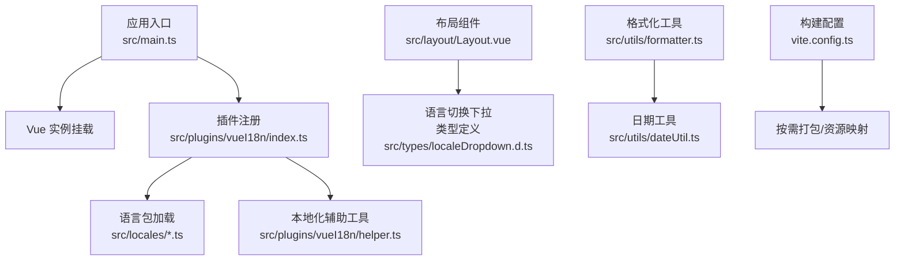
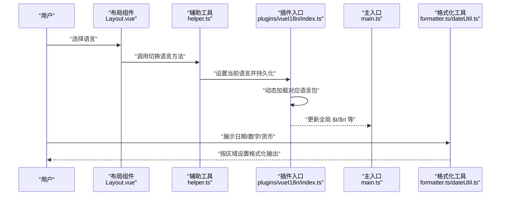
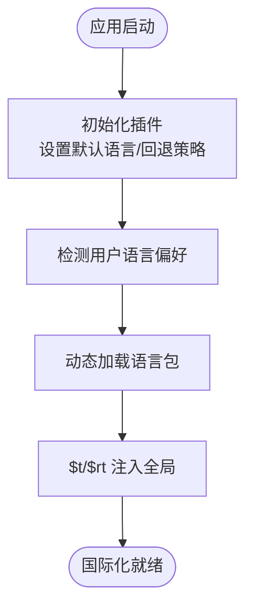
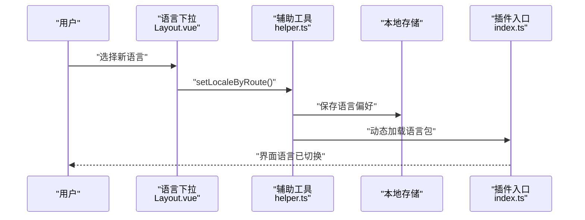
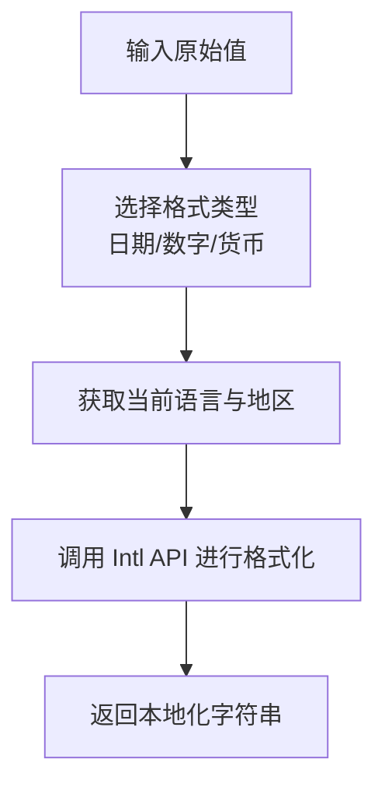
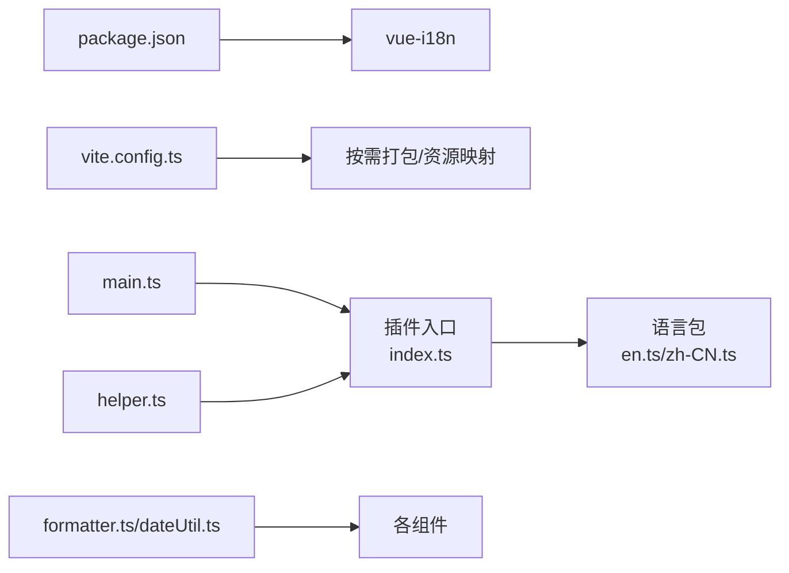

# 国际化(i18n)

<cite>
**本文引用的文件**   
- [en.ts](file://yudao-ui/yudao-ui-admin-vue3/src/locales/en.ts)
- [zh-CN.ts](file://yudao-ui/yudao-ui-admin-vue3/src/locales/zh-CN.ts)
- [index.ts](file://yudao-ui/yudao-ui-admin-vue3/src/plugins/vueI18n/index.ts)
- [helper.ts](file://yudao-ui/yudao-ui-admin-vue3/src/plugins/vueI18n/helper.ts)
- [main.ts](file://yudao-ui/yudao-ui-admin-vue3/src/main.ts)
- [formatter.ts](file://yudao-ui/yudao-ui-admin-vue3/src/utils/formatter.ts)
- [dateUtil.ts](file://yudao-ui/yudao-ui-admin-vue3/src/utils/dateUtil.ts)
- [Layout.vue](file://yudao-ui/yudao-ui-admin-vue3/src/layout/Layout.vue)
- [localeDropdown.d.ts](file://yudao-ui/yudao-ui-admin-vue3/src/types/localeDropdown.d.ts)
- [vite.config.ts](file://yudao-ui/yudao-ui-admin-vue3/vite.config.ts)
- [package.json](file://yudao-ui/yudao-ui-admin-vue3/package.json)
</cite>

## 目录
1. [简介](#简介)
2. [项目结构](#项目结构)
3. [核心组件](#核心组件)
4. [架构总览](#架构总览)
5. [详细组件分析](#详细组件分析)
6. [依赖关系分析](#依赖关系分析)
7. [性能考量](#性能考量)
8. [故障排查指南](#故障排查指南)
9. [结论](#结论)
10. [附录](#附录)

## 简介
本文件系统性梳理芋道 Ruoyi-Vue-Pro 前端国际化(i18n)方案，覆盖 vue-i18n 的集成与配置、语言包管理、动态切换、本地化存储、多语言资源组织、文本提取与翻译管理流程、日期/数字/货币等格式化本地化处理，以及国际化开发最佳实践。目标是帮助开发者快速理解并高效维护多语言能力。

## 项目结构
前端国际化相关代码主要集中在 yudao-ui/yudao-ui-admin-vue3 工程中，核心位置如下：
- 语言包：src/locales
- 插件入口与辅助工具：src/plugins/vueI18n
- 应用启动：src/main.ts
- 格式化工具：src/utils/formatter.ts、src/utils/dateUtil.ts
- 布局与语言切换下拉：src/layout/Layout.vue
- 类型定义：src/types/localeDropdown.d.ts
- 构建配置：vite.config.ts
- 依赖声明：package.json

**图示来源**
- [main.ts:1-200](file://yudao-ui/yudao-ui-admin-vue3/src/main.ts#L1-L200)
- [index.ts:1-200](file://yudao-ui/yudao-ui-admin-vue3/src/plugins/vueI18n/index.ts#L1-L200)
- [en.ts:1-200](file://yudao-ui/yudao-ui-admin-vue3/src/locales/en.ts#L1-L200)
- [zh-CN.ts:1-200](file://yudao-ui/yudao-ui-admin-vue3/src/locales/zh-CN.ts#L1-L200)
- [Layout.vue:1-200](file://yudao-ui/yudao-ui-admin-vue3/src/layout/Layout.vue#L1-L200)
- [formatter.ts:1-200](file://yudao-ui/yudao-ui-admin-vue3/src/utils/formatter.ts#L1-L200)
- [dateUtil.ts:1-200](file://yudao-ui/yudao-ui-admin-vue3/src/utils/dateUtil.ts#L1-L200)
- [vite.config.ts:1-200](file://yudao-ui/yudao-ui-admin-vue3/vite.config.ts#L1-L200)

**章节来源**
- [main.ts:1-200](file://yudao-ui/yudao-ui-admin-vue3/src/main.ts#L1-L200)
- [vite.config.ts:1-200](file://yudao-ui/yudao-ui-admin-vue3/vite.config.ts#L1-L200)

## 核心组件
- 语言包：包含英文(en.ts)与简体中文(zh-CN.ts)，采用键值对结构，支持嵌套分组，便于模块化管理。
- vue-i18n 插件：在插件入口完成初始化、默认语言设置、动态语言包加载与全局可用性配置。
- 本地化辅助：helper.ts 提供便捷方法，如获取当前语言、切换语言、持久化语言偏好等。
- 布局与下拉：Layout.vue 中的语言切换下拉菜单负责触发语言切换逻辑，并通过类型定义约束交互行为。
- 格式化工具：formatter.ts 与 dateUtil.ts 提供日期、数字、货币等格式化函数，结合 Intl API 实现区域化显示。
- 构建与依赖：package.json 声明 vue-i18n 及相关依赖；vite.config.ts 支持按需打包与资源映射。

**章节来源**
- [en.ts:1-200](file://yudao-ui/yudao-ui-admin-vue3/src/locales/en.ts#L1-L200)
- [zh-CN.ts:1-200](file://yudao-ui/yudao-ui-admin-vue3/src/locales/zh-CN.ts#L1-L200)
- [index.ts:1-200](file://yudao-ui/yudao-ui-admin-vue3/src/plugins/vueI18n/index.ts#L1-L200)
- [helper.ts:1-200](file://yudao-ui/yudao-ui-admin-vue3/src/plugins/vueI18n/helper.ts#L1-L200)
- [Layout.vue:1-200](file://yudao-ui/yudao-ui-admin-vue3/src/layout/Layout.vue#L1-L200)
- [formatter.ts:1-200](file://yudao-ui/yudao-ui-admin-vue3/src/utils/formatter.ts#L1-L200)
- [dateUtil.ts:1-200](file://yudao-ui/yudao-ui-admin-vue3/src/utils/dateUtil.ts#L1-L200)
- [package.json:1-200](file://yudao-ui/yudao-ui-admin-vue3/package.json#L1-L200)

## 架构总览
下图展示从应用启动到语言切换与格式化输出的完整链路：

**图示来源**
- [Layout.vue:1-200](file://yudao-ui/yudao-ui-admin-vue3/src/layout/Layout.vue#L1-L200)
- [helper.ts:1-200](file://yudao-ui/yudao-ui-admin-vue3/src/plugins/vueI18n/helper.ts#L1-L200)
- [index.ts:1-200](file://yudao-ui/yudao-ui-admin-vue3/src/plugins/vueI18n/index.ts#L1-L200)
- [main.ts:1-200](file://yudao-ui/yudao-ui-admin-vue3/src/main.ts#L1-L200)
- [formatter.ts:1-200](file://yudao-ui/yudao-ui-admin-vue3/src/utils/formatter.ts#L1-L200)
- [dateUtil.ts:1-200](file://yudao-ui/yudao-ui-admin-vue3/src/utils/dateUtil.ts#L1-L200)

## 详细组件分析

### 语言包管理与组织
- 文件划分：按语言拆分，如 en.ts、zh-CN.ts，避免单文件过大。
- 命名规范：采用 BCP 47 语言子标签作为文件名，确保浏览器与 Intl API 兼容。
- 层级管理：支持嵌套对象结构，按模块或页面维度组织键名，便于查找与维护。
- 最佳实践：
  - 键名语义化，避免重复与歧义。
  - 分层命名空间，如“系统/菜单/列表”、“业务/订单/状态”。
  - 统一占位符命名风格，如 {count}、{name}，并在模板中保持一致。

**章节来源**
- [en.ts:1-200](file://yudao-ui/yudao-ui-admin-vue3/src/locales/en.ts#L1-L200)
- [zh-CN.ts:1-200](file://yudao-ui/yudao-ui-admin-vue3/src/locales/zh-CN.ts#L1-L200)

### vue-i18n 插件集成与配置
- 初始化：在插件入口完成 vue-i18n 实例创建、默认语言设置与回退策略。
- 动态加载：根据当前语言动态导入对应语言包，减少初始包体积。
- 全局可用：将 $t/$rt 等方法注入全局，组件内可直接使用。
- 版本更新：通过重新加载语言包实现热更新，无需刷新页面。

**图示来源**
- [index.ts:1-200](file://yudao-ui/yudao-ui-admin-vue3/src/plugins/vueI18n/index.ts#L1-L200)
- [main.ts:1-200](file://yudao-ui/yudao-ui-admin-vue3/src/main.ts#L1-L200)

**章节来源**
- [index.ts:1-200](file://yudao-ui/yudao-ui-admin-vue3/src/plugins/vueI18n/index.ts#L1-L200)
- [main.ts:1-200](file://yudao-ui/yudao-ui-admin-vue3/src/main.ts#L1-L200)

### 动态切换与本地化存储
- 切换流程：布局中的语言下拉触发辅助工具，设置当前语言并持久化到本地存储。
- 存储策略：优先使用本地存储保存用户偏好，刷新后恢复上次选择。
- 回退机制：若本地存储缺失或无效，回退至浏览器语言或默认语言。

**图示来源**
- [Layout.vue:1-200](file://yudao-ui/yudao-ui-admin-vue3/src/layout/Layout.vue#L1-L200)
- [helper.ts:1-200](file://yudao-ui/yudao-ui-admin-vue3/src/plugins/vueI18n/helper.ts#L1-L200)
- [index.ts:1-200](file://yudao-ui/yudao-ui-admin-vue3/src/plugins/vueI18n/index.ts#L1-L200)

**章节来源**
- [Layout.vue:1-200](file://yudao-ui/yudao-ui-admin-vue3/src/layout/Layout.vue#L1-L200)
- [helper.ts:1-200](file://yudao-ui/yudao-ui-admin-vue3/src/plugins/vueI18n/helper.ts#L1-L200)

### 文本提取与翻译管理
- 静态文本标记：在模板与脚本中统一使用 $t 或 $rt 标记可翻译文本。
- 键名生成：建议以“模块/页面/用途”的层级命名，保证唯一性与可读性。
- 翻译工具：可借助 IDE 插件或第三方平台批量导出/导入 JSON/YAML。
- 版本更新：新增键名需同步到所有语言包；删除键名前需确认无引用，避免残留。

**章节来源**
- [index.ts:1-200](file://yudao-ui/yudao-ui-admin-vue3/src/plugins/vueI18n/index.ts#L1-L200)
- [en.ts:1-200](file://yudao-ui/yudao-ui-admin-vue3/src/locales/en.ts#L1-L200)
- [zh-CN.ts:1-200](file://yudao-ui/yudao-ui-admin-vue3/src/locales/zh-CN.ts#L1-L200)

### 日期、数字、货币格式化
- 区域设置：通过 Intl API 结合当前语言与地区，自动适配格式。
- 日期格式：支持年月日、时分秒、相对时间等多种模式，按需选择。
- 数字/货币：支持千分位、小数位、货币符号与地区符号，满足不同市场要求。
- 工具函数：formatter.ts 与 dateUtil.ts 封装常用格式化逻辑，组件内直接调用。

**图示来源**
- [formatter.ts:1-200](file://yudao-ui/yudao-ui-admin-vue3/src/utils/formatter.ts#L1-L200)
- [dateUtil.ts:1-200](file://yudao-ui/yudao-ui-admin-vue3/src/utils/dateUtil.ts#L1-L200)

**章节来源**
- [formatter.ts:1-200](file://yudao-ui/yudao-ui-admin-vue3/src/utils/formatter.ts#L1-L200)
- [dateUtil.ts:1-200](file://yudao-ui/yudao-ui-admin-vue3/src/utils/dateUtil.ts#L1-L200)

### 类型与交互约束
- 下拉类型：通过 localeDropdown.d.ts 定义语言选项与回调类型，确保组件交互安全。
- 布局组件：Layout.vue 负责渲染语言下拉并绑定事件，保证一致性与可维护性。

**章节来源**
- [localeDropdown.d.ts:1-200](file://yudao-ui/yudao-ui-admin-vue3/src/types/localeDropdown.d.ts#L1-L200)
- [Layout.vue:1-200](file://yudao-ui/yudao-ui-admin-vue3/src/layout/Layout.vue#L1-L200)

## 依赖关系分析
- 依赖声明：package.json 中声明 vue-i18n 及相关依赖，确保运行时可用。
- 构建配置：vite.config.ts 支持按需打包与资源映射，提升加载效率。
- 插件耦合：插件入口与语言包存在直接依赖；辅助工具与插件入口双向协作；格式化工具独立于插件但被组件广泛使用。

**图示来源**
- [package.json:1-200](file://yudao-ui/yudao-ui-admin-vue3/package.json#L1-L200)
- [vite.config.ts:1-200](file://yudao-ui/yudao-ui-admin-vue3/vite.config.ts#L1-L200)
- [main.ts:1-200](file://yudao-ui/yudao-ui-admin-vue3/src/main.ts#L1-L200)
- [index.ts:1-200](file://yudao-ui/yudao-ui-admin-vue3/src/plugins/vueI18n/index.ts#L1-L200)
- [en.ts:1-200](file://yudao-ui/yudao-ui-admin-vue3/src/locales/en.ts#L1-L200)
- [zh-CN.ts:1-200](file://yudao-ui/yudao-ui-admin-vue3/src/locales/zh-CN.ts#L1-L200)
- [helper.ts:1-200](file://yudao-ui/yudao-ui-admin-vue3/src/plugins/vueI18n/helper.ts#L1-L200)
- [formatter.ts:1-200](file://yudao-ui/yudao-ui-admin-vue3/src/utils/formatter.ts#L1-L200)
- [dateUtil.ts:1-200](file://yudao-ui/yudao-ui-admin-vue3/src/utils/dateUtil.ts#L1-L200)

**章节来源**
- [package.json:1-200](file://yudao-ui/yudao-ui-admin-vue3/package.json#L1-L200)
- [vite.config.ts:1-200](file://yudao-ui/yudao-ui-admin-vue3/vite.config.ts#L1-L200)

## 性能考量
- 按需加载：仅加载当前语言包，降低首屏体积。
- 缓存策略：利用本地存储缓存用户语言偏好，减少重复解析。
- 格式化复用：将格式化逻辑封装为纯函数，避免重复计算。
- 批量更新：语言包变更时，采用增量更新策略，避免全量重载。

## 故障排查指南
- 语言不生效：检查插件初始化顺序与默认语言设置；确认语言包键名拼写与层级一致。
- 切换后未持久化：核对本地存储写入逻辑与键名；验证刷新后读取流程。
- 格式化异常：检查当前语言与地区设置；确认 Intl API 在目标环境可用。
- 构建问题：确认 vite 配置与依赖版本兼容；清理缓存后重试。

**章节来源**
- [index.ts:1-200](file://yudao-ui/yudao-ui-admin-vue3/src/plugins/vueI18n/index.ts#L1-L200)
- [helper.ts:1-200](file://yudao-ui/yudao-ui-admin-vue3/src/plugins/vueI18n/helper.ts#L1-L200)
- [formatter.ts:1-200](file://yudao-ui/yudao-ui-admin-vue3/src/utils/formatter.ts#L1-L200)
- [dateUtil.ts:1-200](file://yudao-ui/yudao-ui-admin-vue3/src/utils/dateUtil.ts#L1-L200)

## 结论
本方案基于 vue-i18n 实现了完整的前端国际化能力，涵盖语言包管理、动态切换、本地化存储、格式化处理与构建优化。通过清晰的组织结构与严格的流程规范，能够有效支撑多语言需求并保障用户体验与性能表现。

## 附录
- 开发建议：统一键名规范、完善翻译清单、定期清理冗余键、持续优化格式化策略。
- 维护要点：版本发布前进行语言包一致性检查；引入自动化校验工具；建立翻译质量审核流程。