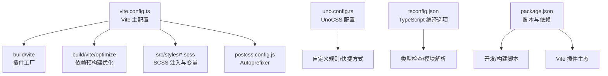
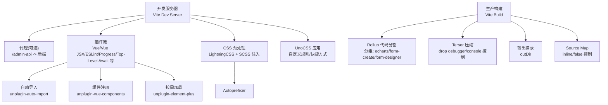
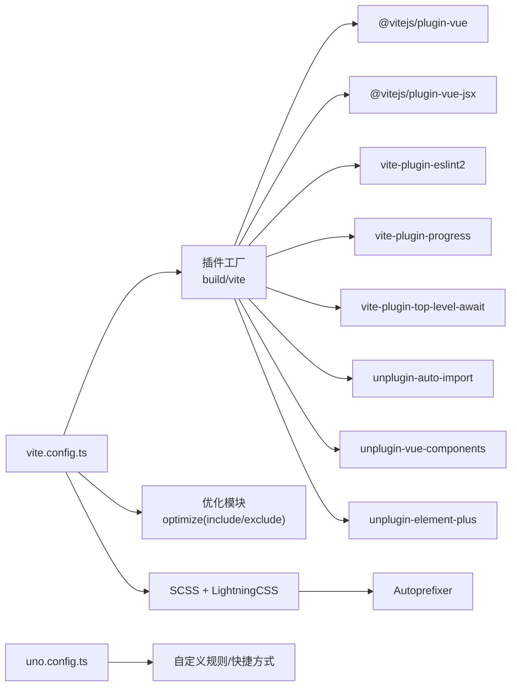
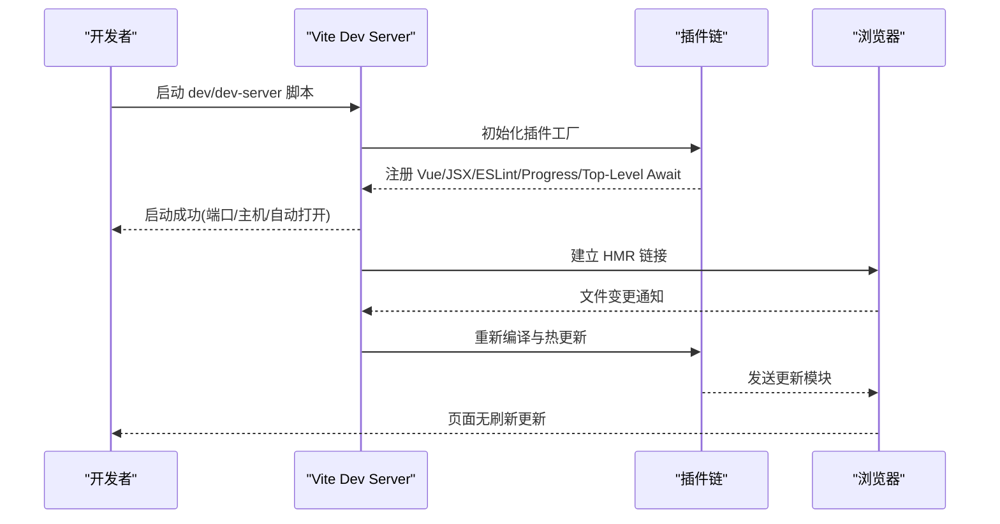
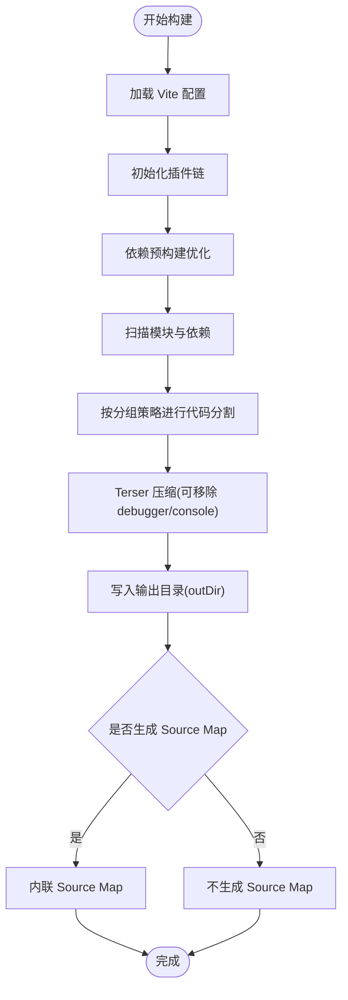
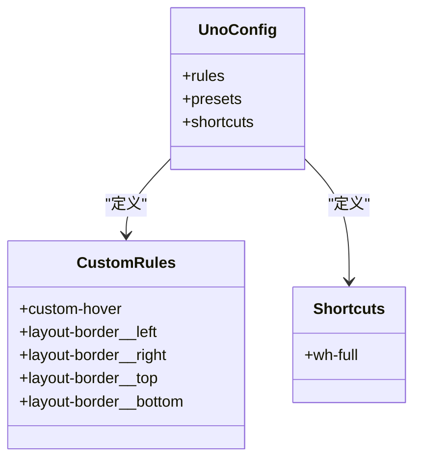

# 构建配置

<cite>
**本文引用的文件**
- [vite.config.ts](file://yudao-ui/yudao-ui-admin-vue3/vite.config.ts)
- [uno.config.ts](file://yudao-ui/yudao-ui-admin-vue3/uno.config.ts)
- [tsconfig.json](file://yudao-ui/yudao-ui-admin-vue3/tsconfig.json)
- [package.json](file://yudao-ui/yudao-ui-admin-vue3/package.json)
- [postcss.config.js](file://yudao-ui/yudao-ui-admin-vue3/postcss.config.js)
- [env.d.ts](file://yudao-ui/yudao-ui-admin-vue3/types/env.d.ts)
</cite>

## 目录
1. [简介](#简介)
2. [项目结构](#项目结构)
3. [核心组件](#核心组件)
4. [架构总览](#架构总览)
5. [详细组件分析](#详细组件分析)
6. [依赖关系分析](#依赖关系分析)
7. [性能考虑](#性能考虑)
8. [故障排查指南](#故障排查指南)
9. [结论](#结论)
10. [附录](#附录)

## 简介
本文件系统性梳理芋道 Ruoyi-Vue-Pro 前端构建体系，聚焦 Vite 构建配置与优化、UnoCSS 原子化样式、TypeScript 编译配置、以及构建产物分析与监控。内容覆盖开发环境（开发服务器、代理、热更新）、生产环境（代码分割、压缩、缓存策略）、样式与主题、编译选项与最佳实践，并提供可操作的性能优化建议与问题排查路径。

## 项目结构
前端工程位于 yudao-ui/yudao-ui-admin-vue3，核心构建相关文件如下：
- 构建入口与配置：vite.config.ts
- UnoCSS 配置：uno.config.ts
- TypeScript 编译配置：tsconfig.json
- 包管理与脚本：package.json
- PostCSS 配置：postcss.config.js
- 环境变量声明：types/env.d.ts

图表来源
- [vite.config.ts:14-101](file://yudao-ui/yudao-ui-admin-vue3/vite.config.ts#L14-L101)
- [uno.config.ts:1-108](file://yudao-ui/yudao-ui-admin-vue3/uno.config.ts#L1-L108)
- [tsconfig.json:1-45](file://yudao-ui/yudao-ui-admin-vue3/tsconfig.json#L1-L45)
- [package.json:1-158](file://yudao-ui/yudao-ui-admin-vue3/package.json#L1-L158)
- [postcss.config.js:1-6](file://yudao-ui/yudao-ui-admin-vue3/postcss.config.js#L1-L6)

章节来源
- [vite.config.ts:14-101](file://yudao-ui/yudao-ui-admin-vue3/vite.config.ts#L14-L101)
- [uno.config.ts:1-108](file://yudao-ui/yudao-ui-admin-vue3/uno.config.ts#L1-L108)
- [tsconfig.json:1-45](file://yudao-ui/yudao-ui-admin-vue3/tsconfig.json#L1-L45)
- [package.json:1-158](file://yudao-ui/yudao-ui-admin-vue3/package.json#L1-L158)
- [postcss.config.js:1-6](file://yudao-ui/yudao-ui-admin-vue3/postcss.config.js#L1-L6)
- [env.d.ts:1-41](file://yudao-ui/yudao-ui-admin-vue3/types/env.d.ts#L1-L41)

## 核心组件
- Vite 主配置：集中管理开发服务器、代理、插件、CSS 预处理、路径别名、构建输出与 Terser 压缩策略、Rollup 代码分割分组、依赖预构建优化。
- UnoCSS 配置：定义自定义规则、主题暗色模式、快捷方式与预设，支撑原子化样式与按需引入。
- TypeScript 配置：严格类型检查、模块解析策略、装饰器支持、路径映射、类型根目录与包含范围。
- 包管理与脚本：统一的开发/构建/预览脚本，集成 ESLint、Prettier、Stylelint、TSC 类型检查与多环境模式。
- PostCSS：Autoprefixer 自动补全浏览器前缀，配合 LightningCSS 进行 CSS 错误恢复与最小化。

章节来源
- [vite.config.ts:24-101](file://yudao-ui/yudao-ui-admin-vue3/vite.config.ts#L24-L101)
- [uno.config.ts:4-108](file://yudao-ui/yudao-ui-admin-vue3/uno.config.ts#L4-L108)
- [tsconfig.json:2-36](file://yudao-ui/yudao-ui-admin-vue3/tsconfig.json#L2-L36)
- [package.json:7-26](file://yudao-ui/yudao-ui-admin-vue3/package.json#L7-L26)
- [postcss.config.js:1-6](file://yudao-ui/yudao-ui-admin-vue3/postcss.config.js#L1-L6)

## 架构总览
下图展示从开发到生产的整体流程与关键节点：

图表来源
- [vite.config.ts:28-99](file://yudao-ui/yudao-ui-admin-vue3/vite.config.ts#L28-L99)
- [uno.config.ts:4-108](file://yudao-ui/yudao-ui-admin-vue3/uno.config.ts#L4-L108)
- [postcss.config.js:1-6](file://yudao-ui/yudao-ui-admin-vue3/postcss.config.js#L1-L6)
- [package.json:89-142](file://yudao-ui/yudao-ui-admin-vue3/package.json#L89-L142)

## 详细组件分析

### 开发环境配置（服务器、代理、热更新）
- 开发服务器
  - 端口、主机、启动后自动打开浏览器等由环境变量控制。
  - 代理当前处于注释状态，默认不启用本地代理，后端已支持跨域。
- 热更新与插件
  - 通过插件工厂集中管理 Vue、JSX、ESLint、进度条、Top-Level Await 等插件。
- 路径别名与扩展名
  - 使用 @/ 别名指向 src 目录；扩展名解析包含 .mjs/.js/.ts/.jsx/.tsx/.json/.scss/.css。
- CSS 预处理
  - LightningCSS 错误恢复开启，SCSS 注入全局变量避免重复注入导致的全局变量冲突。

章节来源
- [vite.config.ts:28-43](file://yudao-ui/yudao-ui-admin-vue3/vite.config.ts#L28-L43)
- [vite.config.ts:67-69](file://yudao-ui/yudao-ui-admin-vue3/vite.config.ts#L67-L69)
- [vite.config.ts:44-66](file://yudao-ui/yudao-ui-admin-vue3/vite.config.ts#L44-L66)

### 生产环境打包优化（代码分割、压缩、缓存策略）
- 代码分割
  - Rollup 输出分组策略：将 echarts、@form-create/element-ui、@form-create/designer 独立打包，降低首屏依赖体积并提升缓存命中率。
- 压缩与调试
  - Terser 压缩开启，支持按需移除 debugger 与 console。
- Source Map
  - 支持 inline 源码映射，便于定位但会增大包体。
- 输出目录
  - outDir 可通过环境变量自定义，默认 dist。
- 依赖预构建
  - optimizeDeps.include/exclude 用于加速冷启动与稳定依赖解析。

章节来源
- [vite.config.ts:76-99](file://yudao-ui/yudao-ui-admin-vue3/vite.config.ts#L76-L99)

### UnoCSS 原子化样式配置与使用
- 规则与快捷方式
  - 自定义规则：如自定义 hover 行为、布局边框伪元素等。
  - 快捷方式：如 wh-full 等常用组合。
- 主题与暗色模式
  - 预设启用暗色模式开关，支持 class 驱动。
- 使用方式
  - 在组件模板中直接使用工具类；通过快捷方式减少重复书写；在暗色模式下自动切换背景色等。

章节来源
- [uno.config.ts:4-108](file://yudao-ui/yudao-ui-admin-vue3/uno.config.ts#L4-L108)

### TypeScript 编译配置
- 严格模式与模块解析
  - 严格模式开启；模块解析采用 Node 方案；目标与模块均为 ESNext。
- 装饰器与 JSX
  - 启用 experimentalDecorators；JSX 保持 preserve。
- 类型与路径
  - 路径映射 @/* -> src/*；类型根目录包含 node_modules/@types 与 types 目录。
- 类型检查脚本
  - 提供独立的类型检查脚本，结合内存限制参数以避免 OOM。

章节来源
- [tsconfig.json:2-36](file://yudao-ui/yudao-ui-admin-vue3/tsconfig.json#L2-L36)
- [package.json:11](file://yudao-ui/yudao-ui-admin-vue3/package.json#L11)

### 构建脚本与多环境模式
- 开发/构建/预览
  - dev/dev-server：分别对应不同环境模式。
  - build:*：支持 local/dev/test/stage/prod 多环境构建。
  - serve:*：对 dev/prod 进行预览。
- 质量工具
  - ESLint、Prettier、Stylelint 统一格式与风格检查；支持 lint-staged。

章节来源
- [package.json:7-26](file://yudao-ui/yudao-ui-admin-vue3/package.json#L7-L26)

### 环境变量与类型声明
- 环境变量键值
  - 包含应用标题、端口、是否自动打开、开发标识、基础路径、API 地址、是否移除 debugger/console、Source Map、输出目录、文档告警开关、加密相关等。
- 类型声明
  - 通过 env.d.ts 为 import.meta.env 提供类型提示，确保 IDE 与类型检查一致。

章节来源
- [env.d.ts:10-41](file://yudao-ui/yudao-ui-admin-vue3/types/env.d.ts#L10-L41)

## 依赖关系分析
- Vite 配置依赖插件工厂与优化模块，插件工厂进一步依赖各类 Vite 插件生态。
- UnoCSS 配置与样式体系解耦，通过工具类与快捷方式在组件中使用。
- TypeScript 配置与包管理脚本共同保障类型安全与质量工具链。

图表来源
- [vite.config.ts:4-43](file://yudao-ui/yudao-ui-admin-vue3/vite.config.ts#L4-L43)
- [uno.config.ts:4-108](file://yudao-ui/yudao-ui-admin-vue3/uno.config.ts#L4-L108)
- [postcss.config.js:1-6](file://yudao-ui/yudao-ui-admin-vue3/postcss.config.js#L1-L6)
- [package.json:89-142](file://yudao-ui/yudao-ui-admin-vue3/package.json#L89-L142)

章节来源
- [vite.config.ts:4-43](file://yudao-ui/yudao-ui-admin-vue3/vite.config.ts#L4-L43)
- [uno.config.ts:4-108](file://yudao-ui/yudao-ui-admin-vue3/uno.config.ts#L4-L108)
- [postcss.config.js:1-6](file://yudao-ui/yudao-ui-admin-vue3/postcss.config.js#L1-L6)
- [package.json:89-142](file://yudao-ui/yudao-ui-admin-vue3/package.json#L89-L142)

## 性能考虑
- 代码分割
  - 已针对大体积第三方库进行分组打包，建议持续关注新增依赖是否需要拆分。
- 压缩与调试
  - 生产环境启用 Terser 并可按需移除调试语句与日志，平衡体积与可观测性。
- 依赖预构建
  - 通过 optimizeDeps.include/exclude 减少冷启动时间，建议定期评估 include 列表。
- CSS 与样式
  - LightningCSS 错误恢复与 Autoprefixer 结合，减少兼容性问题带来的重试成本。
- 构建速度
  - 使用插件进度条与 Top-Level Await 等优化体验；可结合缓存与并行任务提升速度。
- 打包体积
  - 结合后续“构建产物分析与监控”章节的工具链，持续识别体积热点。

## 故障排查指南
- 环境变量未生效
  - 确认 scripts 中的 --mode 传参与 .env.* 文件命名一致；检查 env.d.ts 的键值声明是否完整。
- 代理无效
  - 当前代理被注释，若业务需要本地代理，请取消注释并按需配置路径重写。
- UnoCSS 规则不生效
  - 检查自定义规则选择器与快捷方式是否正确；确认暗色模式 class 是否存在。
- 类型检查失败
  - 使用独立脚本运行类型检查，必要时调整 tsconfig.json 的严格级别或路径映射。
- 构建内存不足
  - 脚本中已增加内存限制参数，若仍失败，建议升级 Node 版本或减少一次性任务并发。

章节来源
- [vite.config.ts:32-41](file://yudao-ui/yudao-ui-admin-vue3/vite.config.ts#L32-L41)
- [uno.config.ts:4-108](file://yudao-ui/yudao-ui-admin-vue3/uno.config.ts#L4-L108)
- [tsconfig.json:2-36](file://yudao-ui/yudao-ui-admin-vue3/tsconfig.json#L2-L36)
- [package.json:11](file://yudao-ui/yudao-ui-admin-vue3/package.json#L11)

## 结论
本项目在 Vite 基础上，结合 UnoCSS 原子化样式、严格的 TypeScript 编译配置与完善的多环境脚本，形成了高可维护性的现代前端构建体系。通过合理的代码分割、压缩与依赖预构建策略，兼顾了开发体验与生产性能。建议持续利用构建产物分析工具与性能指标监控，不断迭代优化。

## 附录

### 开发流程时序（开发服务器启动与热更新）

图表来源
- [vite.config.ts:28-43](file://yudao-ui/yudao-ui-admin-vue3/vite.config.ts#L28-L43)
- [package.json:9-11](file://yudao-ui/yudao-ui-admin-vue3/package.json#L9-L11)

### 生产构建流程（代码分割与压缩）

图表来源
- [vite.config.ts:76-99](file://yudao-ui/yudao-ui-admin-vue3/vite.config.ts#L76-L99)

### UnoCSS 规则与快捷方式示例（类图）

图表来源
- [uno.config.ts:6-107](file://yudao-ui/yudao-ui-admin-vue3/uno.config.ts#L6-L107)