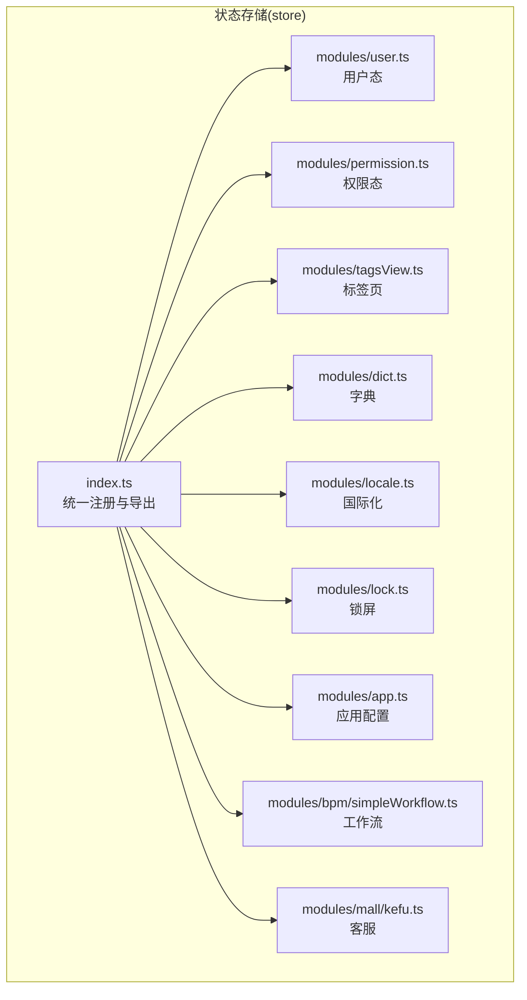
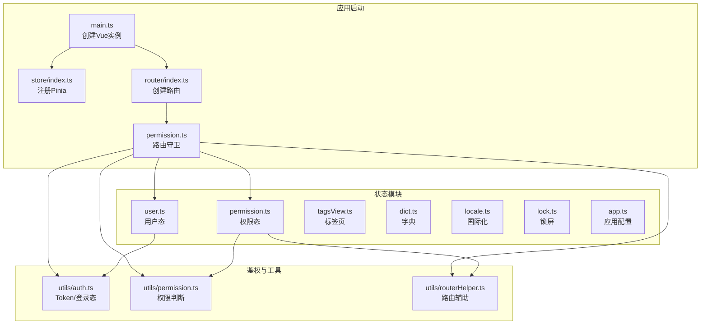
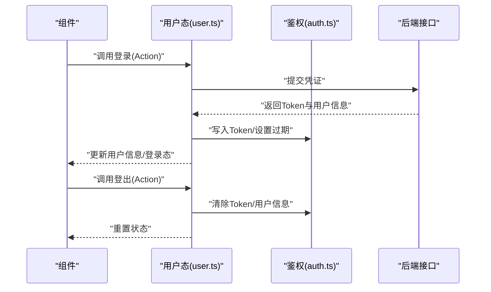
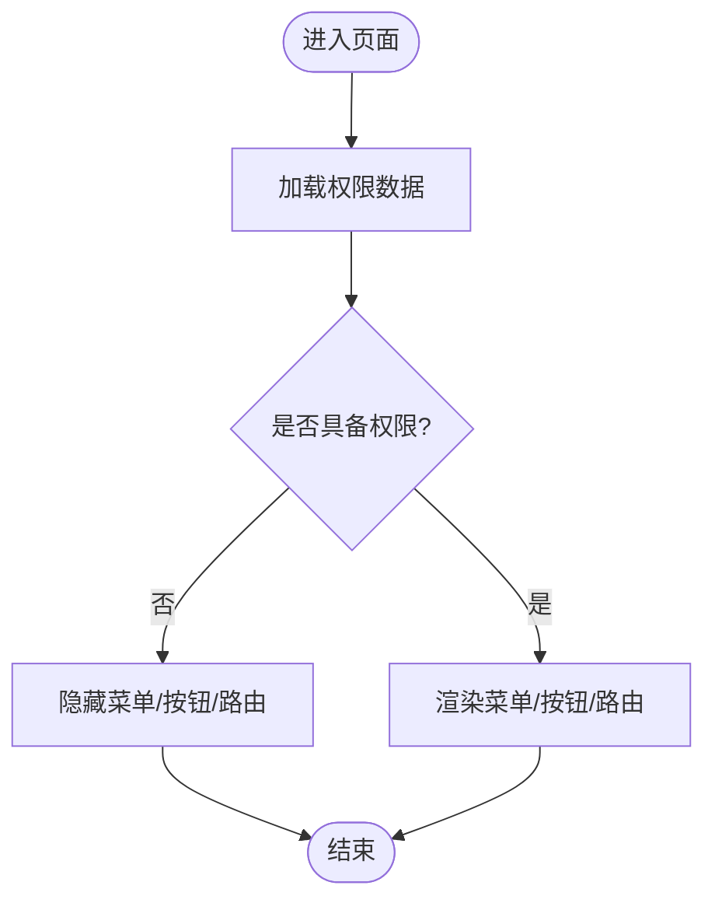
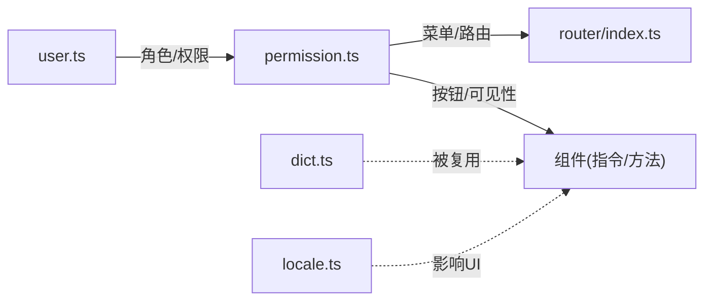

# 状态管理(Pinia)

<cite>
**本文引用的文件**
- [index.ts](file://yudao-ui/yudao-ui-admin-vue3/src/store/index.ts)
- [user.ts](file://yudao-ui/yudao-ui-admin-vue3/src/store/modules/user.ts)
- [permission.ts](file://yudao-ui/yudao-ui-admin-vue3/src/store/modules/permission.ts)
- [tagsView.ts](file://yudao-ui/yudao-ui-admin-vue3/src/store/modules/tagsView.ts)
- [dict.ts](file://yudao-ui/yudao-ui-admin-vue3/src/store/modules/dict.ts)
- [locale.ts](file://yudao-ui/yudao-ui-admin-vue3/src/store/modules/locale.ts)
- [lock.ts](file://yudao-ui/yudao-ui-admin-vue3/src/store/modules/lock.ts)
- [app.ts](file://yudao-ui/yudao-ui-admin-vue3/src/store/modules/app.ts)
- [simpleWorkflow.ts](file://yudao-ui/yudao-ui-admin-vue3/src/store/modules/bpm/simpleWorkflow.ts)
- [kefu.ts](file://yudao-ui/yudao-ui-admin-vue3/src/store/modules/mall/kefu.ts)
- [auth.ts](file://yudao-ui/yudao-ui-admin-vue3/src/utils/auth.ts)
- [permission.ts](file://yudao-ui/yudao-ui-admin-vue3/src/utils/permission.ts)
- [routerHelper.ts](file://yudao-ui/yudao-ui-admin-vue3/src/utils/routerHelper.ts)
- [main.ts](file://yudao-ui/yudao-ui-admin-vue3/src/main.ts)
- [permission.ts](file://yudao-ui/yudao-ui-admin-vue3/src/permission.ts)
- [index.ts](file://yudao-ui/yudao-ui-admin-vue3/src/router/index.ts)
</cite>

## 目录
1. [引言](#引言)
2. [项目结构](#项目结构)
3. [核心组件](#核心组件)
4. [架构总览](#架构总览)
5. [详细组件分析](#详细组件分析)
6. [依赖关系分析](#依赖关系分析)
7. [性能考虑](#性能考虑)
8. [故障排查指南](#故障排查指南)
9. [结论](#结论)
10. [附录](#附录)

## 引言
本文件系统性梳理芋道 Ruoyi-Vue-Pro 前端工程中基于 Pinia 的状态管理设计与使用模式，覆盖 Store 模块划分原则、状态定义规范、Action 设计模式；重点阐述用户态与权限态的实现（用户信息缓存、登录态维护、权限数据管理、菜单/按钮/路由权限动态控制）、状态持久化策略（localStorage/sessionStorage 使用建议）、以及状态调试与监控最佳实践（DevTools 使用、变更追踪、性能优化）。目标是帮助开发者快速理解并高效扩展状态管理能力。

## 项目结构
前端采用 Vite + Vue 3 + TypeScript 技术栈，状态管理集中在 src/store 目录下，按领域与职责拆分为多个模块，入口通过 src/store/index.ts 统一导出与挂载。整体遵循“按域分层、按职责聚合”的组织方式，便于维护与扩展。

图表来源
- [index.ts](file://yudao-ui/yudao-ui-admin-vue3/src/store/index.ts)
- [user.ts](file://yudao-ui/yudao-ui-admin-vue3/src/store/modules/user.ts)
- [permission.ts](file://yudao-ui/yudao-ui-admin-vue3/src/store/modules/permission.ts)
- [tagsView.ts](file://yudao-ui/yudao-ui-admin-vue3/src/store/modules/tagsView.ts)
- [dict.ts](file://yudao-ui/yudao-ui-admin-vue3/src/store/modules/dict.ts)
- [locale.ts](file://yudao-ui/yudao-ui-admin-vue3/src/store/modules/locale.ts)
- [lock.ts](file://yudao-ui/yudao-ui-admin-vue3/src/store/modules/lock.ts)
- [app.ts](file://yudao-ui/yudao-ui-admin-vue3/src/store/modules/app.ts)
- [simpleWorkflow.ts](file://yudao-ui/yudao-ui-admin-vue3/src/store/modules/bpm/simpleWorkflow.ts)
- [kefu.ts](file://yudao-ui/yudao-ui-admin-vue3/src/store/modules/mall/kefu.ts)

章节来源
- [index.ts](file://yudao-ui/yudao-ui-admin-vue3/src/store/index.ts)

## 核心组件
- 用户态模块：负责用户信息、登录态、角色权限、部门信息等核心数据的集中管理，并与鉴权工具协同完成登录态维护与刷新。
- 权限态模块：负责菜单权限、按钮权限、路由权限的动态计算与缓存，支撑前端侧的“可见性/可操作性”控制。
- 标签页模块：维护浏览器标签页列表与当前激活项，支持关闭、刷新、固定等交互行为。
- 字典模块：统一管理各类枚举/字典数据，避免重复请求与跨组件重复渲染。
- 国际化模块：切换语言、主题、布局等全局配置。
- 锁屏模块：记录锁屏状态与时间，配合安全策略。
- 应用模块：应用级配置（如侧边栏折叠、面包屑显示等）。
- BPM 工作流模块：业务流程相关临时状态。
- 商城客服模块：业务域内的临时状态。

章节来源
- [user.ts](file://yudao-ui/yudao-ui-admin-vue3/src/store/modules/user.ts)
- [permission.ts](file://yudao-ui/yudao-ui-admin-vue3/src/store/modules/permission.ts)
- [tagsView.ts](file://yudao-ui/yudao-ui-admin-vue3/src/store/modules/tagsView.ts)
- [dict.ts](file://yudao-ui/yudao-ui-admin-vue3/src/store/modules/dict.ts)
- [locale.ts](file://yudao-ui/yudao-ui-admin-vue3/src/store/modules/locale.ts)
- [lock.ts](file://yudao-ui/yudao-ui-admin-vue3/src/store/modules/lock.ts)
- [app.ts](file://yudao-ui/yudao-ui-admin-vue3/src/store/modules/app.ts)
- [simpleWorkflow.ts](file://yudao-ui/yudao-ui-admin-vue3/src/store/modules/bpm/simpleWorkflow.ts)
- [kefu.ts](file://yudao-ui/yudao-ui-admin-vue3/src/store/modules/mall/kefu.ts)

## 架构总览
Pinia 在本项目中的定位是“轻量、类型安全、易于组合”的状态中心，结合路由守卫与鉴权工具，形成“鉴权前置 + 状态后置”的完整闭环。应用启动时通过入口文件挂载 Store，随后在路由守卫中根据用户态与权限态决定页面访问与菜单渲染。

图表来源
- [main.ts](file://yudao-ui/yudao-ui-admin-vue3/src/main.ts)
- [index.ts](file://yudao-ui/yudao-ui-admin-vue3/src/store/index.ts)
- [index.ts](file://yudao-ui/yudao-ui-admin-vue3/src/router/index.ts)
- [permission.ts](file://yudao-ui/yudao-ui-admin-vue3/src/permission.ts)
- [auth.ts](file://yudao-ui/yudao-ui-admin-vue3/src/utils/auth.ts)
- [permission.ts](file://yudao-ui/yudao-ui-admin-vue3/src/utils/permission.ts)
- [routerHelper.ts](file://yudao-ui/yudao-ui-admin-vue3/src/utils/routerHelper.ts)
- [user.ts](file://yudao-ui/yudao-ui-admin-vue3/src/store/modules/user.ts)
- [permission.ts](file://yudao-ui/yudao-ui-admin-vue3/src/store/modules/permission.ts)
- [tagsView.ts](file://yudao-ui/yudao-ui-admin-vue3/src/store/modules/tagsView.ts)
- [dict.ts](file://yudao-ui/yudao-ui-admin-vue3/src/store/modules/dict.ts)
- [locale.ts](file://yudao-ui/yudao-ui-admin-vue3/src/store/modules/locale.ts)
- [lock.ts](file://yudao-ui/yudao-ui-admin-vue3/src/store/modules/lock.ts)
- [app.ts](file://yudao-ui/yudao-ui-admin-vue3/src/store/modules/app.ts)

## 详细组件分析

### 用户态模块（user.ts）
- 职责边界
  - 存储用户基本信息、角色标识、部门信息、登录态标记等。
  - 提供登录、登出、刷新令牌、更新用户信息等 Action。
  - 与鉴权工具协作，确保 Token 与用户信息一致性。
- 状态定义规范
  - 使用明确的字段命名与类型约束，避免“魔法字符串”。
  - 登录态与用户信息强关联，避免出现“半登录”状态。
- Action 设计模式
  - 异步 Action 内部进行错误捕获与回滚，失败时清理本地缓存并跳转登录。
  - 成功后同步更新用户信息与登录态，并持久化关键字段。
- 与鉴权工具的协作
  - 登录成功后写入 Token 并设置过期时间；登出时清除 Token 与用户信息。
  - 刷新令牌失败时统一跳转登录页，避免“幽灵登录”。

图表来源
- [user.ts](file://yudao-ui/yudao-ui-admin-vue3/src/store/modules/user.ts)
- [auth.ts](file://yudao-ui/yudao-ui-admin-vue3/src/utils/auth.ts)

章节来源
- [user.ts](file://yudao-ui/yudao-ui-admin-vue3/src/store/modules/user.ts)
- [auth.ts](file://yudao-ui/yudao-ui-admin-vue3/src/utils/auth.ts)

### 权限态模块（permission.ts）
- 职责边界
  - 计算并缓存菜单权限、按钮权限、路由权限集合。
  - 支持动态路由注入与权限路由守卫联动。
- 状态定义规范
  - 使用集合类型存储权限码，便于快速包含/排除判断。
  - 菜单树与路由表解耦，通过权限码映射生成可视菜单。
- Action 设计模式
  - 登录成功后拉取权限数据并写入缓存；登出时清空。
  - 权限变更时仅更新必要字段，避免全量重绘。
- 动态控制机制
  - 菜单权限：根据权限码过滤菜单树。
  - 按钮权限：在组件内通过指令或方法判断隐藏/禁用。
  - 路由权限：根据权限码动态添加/移除路由节点。

图表来源
- [permission.ts](file://yudao-ui/yudao-ui-admin-vue3/src/store/modules/permission.ts)
- [permission.ts](file://yudao-ui/yudao-ui-admin-vue3/src/utils/permission.ts)
- [routerHelper.ts](file://yudao-ui/yudao-ui-admin-vue3/src/utils/routerHelper.ts)

章节来源
- [permission.ts](file://yudao-ui/yudao-ui-admin-vue3/src/store/modules/permission.ts)
- [permission.ts](file://yudao-ui/yudao-ui-admin-vue3/src/utils/permission.ts)
- [routerHelper.ts](file://yudao-ui/yudao-ui-admin-vue3/src/utils/routerHelper.ts)

### 标签页模块（tagsView.ts）
- 职责边界
  - 维护标签页列表、当前激活项、是否固定等。
  - 提供新增、关闭、刷新、清空等动作。
- 状态定义规范
  - 标签页对象包含路径、标题、固定标记等字段，保持最小必要性。
- Action 设计模式
  - 关闭当前标签页时自动切换到相邻标签，避免无标签可选。
  - 清空标签页时保留首页，防止误关闭导致无法回到首页。

章节来源
- [tagsView.ts](file://yudao-ui/yudao-ui-admin-vue3/src/store/modules/tagsView.ts)

### 字典模块（dict.ts）
- 职责边界
  - 缓存字典/枚举数据，避免重复请求与跨组件重复渲染。
- 状态定义规范
  - 以键值对形式存储，键为字典类型，值为数组或映射。
- Action 设计模式
  - 懒加载：首次使用时才请求；批量加载：一次性拉取常用类型。
  - 缓存策略：按类型维度缓存，支持失效与手动刷新。

章节来源
- [dict.ts](file://yudao-ui/yudao-ui-admin-vue3/src/store/modules/dict.ts)

### 国际化模块（locale.ts）
- 职责边界
  - 切换语言、主题、布局等全局配置。
- 状态定义规范
  - 使用枚举限定语言与主题范围，避免非法值。
- Action 设计模式
  - 切换语言时同步更新 DOM 属性与本地缓存。

章节来源
- [locale.ts](file://yudao-ui/yudao-ui-admin-vue3/src/store/modules/locale.ts)

### 锁屏模块（lock.ts）
- 职责边界
  - 记录锁屏状态与时间，配合安全策略。
- 状态定义规范
  - 状态字段简洁明确，避免冗余。
- Action 设计模式
  - 锁屏超时自动解锁，解锁时验证密码并恢复状态。

章节来源
- [lock.ts](file://yudao-ui/yudao-ui-admin-vue3/src/store/modules/lock.ts)

### 应用模块（app.ts）
- 职责边界
  - 应用级配置（如侧边栏折叠、面包屑显示等）。
- 状态定义规范
  - 配置项粒度适中，避免过度细分。
- Action 设计模式
  - 配置变更时同步到本地存储，保证刷新后一致。

章节来源
- [app.ts](file://yudao-ui/yudao-ui-admin-vue3/src/store/modules/app.ts)

### BPM 工作流模块（simpleWorkflow.ts）
- 职责边界
  - 业务流程相关临时状态，避免污染全局。
- 状态定义规范
  - 与具体流程绑定，生命周期短，无需持久化。
- Action 设计模式
  - 仅在流程页面内使用，离开即释放。

章节来源
- [simpleWorkflow.ts](file://yudao-ui/yudao-ui-admin-vue3/src/store/modules/bpm/simpleWorkflow.ts)

### 商城客服模块（kefu.ts）
- 职责边界
  - 业务域内的临时状态，按需清理。
- 状态定义规范
  - 与客服会话、消息等实体解耦，仅保存 UI 状态。
- Action 设计模式
  - 会话切换时重置相关 UI 状态。

章节来源
- [kefu.ts](file://yudao-ui/yudao-ui-admin-vue3/src/store/modules/mall/kefu.ts)

## 依赖关系分析
- 模块内聚与耦合
  - 用户态与权限态存在强关联：权限态依赖用户态的角色/权限信息；二者共同决定菜单与路由渲染。
  - 标签页模块与路由模块紧密耦合：标签页的增删改与路由变化同步。
  - 字典模块被多处组件复用，降低网络与渲染成本。
- 外部依赖
  - 鉴权工具（Token/过期处理）与路由守卫共同构成“鉴权前置”，Store 在“鉴权后置”阶段完成状态落盘与缓存。
- 循环依赖
  - 当前模块间未见循环依赖迹象；若后续扩展，应避免在 Store 中直接引入路由/组件逻辑。

图表来源
- [user.ts](file://yudao-ui/yudao-ui-admin-vue3/src/store/modules/user.ts)
- [permission.ts](file://yudao-ui/yudao-ui-admin-vue3/src/store/modules/permission.ts)
- [index.ts](file://yudao-ui/yudao-ui-admin-vue3/src/router/index.ts)
- [permission.ts](file://yudao-ui/yudao-ui-admin-vue3/src/utils/permission.ts)
- [dict.ts](file://yudao-ui/yudao-ui-admin-vue3/src/store/modules/dict.ts)
- [locale.ts](file://yudao-ui/yudao-ui-admin-vue3/src/store/modules/locale.ts)

章节来源
- [user.ts](file://yudao-ui/yudao-ui-admin-vue3/src/store/modules/user.ts)
- [permission.ts](file://yudao-ui/yudao-ui-admin-vue3/src/store/modules/permission.ts)
- [index.ts](file://yudao-ui/yudao-ui-admin-vue3/src/router/index.ts)
- [permission.ts](file://yudao-ui/yudao-ui-admin-vue3/src/utils/permission.ts)
- [dict.ts](file://yudao-ui/yudao-ui-admin-vue3/src/store/modules/dict.ts)
- [locale.ts](file://yudao-ui/yudao-ui-admin-vue3/src/store/modules/locale.ts)

## 性能考虑
- 状态拆分与订阅粒度
  - 将大对象拆分为细粒度状态，减少无关渲染；仅在需要的组件订阅对应 Store。
- 持久化策略
  - 仅持久化必要字段（如 Token、用户ID、语言、主题），避免存储敏感或大体积数据。
  - 使用 sessionStorage 存放短期状态（如临时工作流），localStorage 存放长期配置（如语言、主题）。
- 缓存与去抖
  - 字典/枚举类数据采用懒加载与批量加载策略，避免频繁请求。
  - 权限数据在登录后缓存，权限变更时增量更新。
- DevTools 与性能监控
  - 使用浏览器 DevTools 的 Vue 插件观察状态变更与渲染次数。
  - 对高频 Action 进行节流/防抖，避免重复触发。
- 路由与菜单
  - 菜单树构建与路由注入尽量在后台完成，前端仅做映射与过滤，降低计算开销。

## 故障排查指南
- 登录后白屏或权限异常
  - 检查鉴权工具是否正确写入 Token 与过期时间；确认用户态与权限态已初始化。
  - 查看路由守卫是否阻断了必要的公共路由。
- 菜单不显示或按钮不可点
  - 核对权限码是否正确下发；检查权限态是否包含对应权限。
  - 确认菜单树构建逻辑与路由映射是否一致。
- 标签页异常
  - 检查标签页 Action 是否正确处理关闭/刷新场景；确认首页保留策略生效。
- 国际化/主题切换无效
  - 检查国际化模块是否同步更新 DOM 属性；确认本地缓存是否被覆盖。
- 性能问题
  - 使用 DevTools 观察渲染次数与状态变更频率；定位是否存在不必要的订阅或重复渲染。

章节来源
- [auth.ts](file://yudao-ui/yudao-ui-admin-vue3/src/utils/auth.ts)
- [permission.ts](file://yudao-ui/yudao-ui-admin-vue3/src/utils/permission.ts)
- [permission.ts](file://yudao-ui/yudao-ui-admin-vue3/src/permission.ts)
- [tagsView.ts](file://yudao-ui/yudao-ui-admin-vue3/src/store/modules/tagsView.ts)
- [locale.ts](file://yudao-ui/yudao-ui-admin-vue3/src/store/modules/locale.ts)

## 结论
本项目的 Pinia 状态管理以“模块化、类型安全、易调试”为核心设计原则，围绕用户态与权限态两大支柱，辅以标签页、字典、国际化等通用模块，形成清晰、可维护、可扩展的状态体系。通过与鉴权工具与路由守卫的协同，实现了从前端鉴权到状态落盘的完整闭环。建议在后续扩展中继续坚持“小而精”的模块边界与“按需订阅”的性能策略，持续优化用户体验与开发效率。

## 附录
- 状态持久化建议
  - Token：sessionStorage（随会话）
  - 语言/主题：localStorage（跨会话）
  - 临时工作流：sessionStorage（随会话）
- 调试与监控
  - 使用浏览器 Vue DevTools 观察状态树与变更日志。
  - 对高频 Action 添加日志埋点，定位性能瓶颈。
  - 定期清理过期缓存，避免内存泄漏。