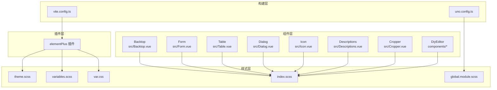
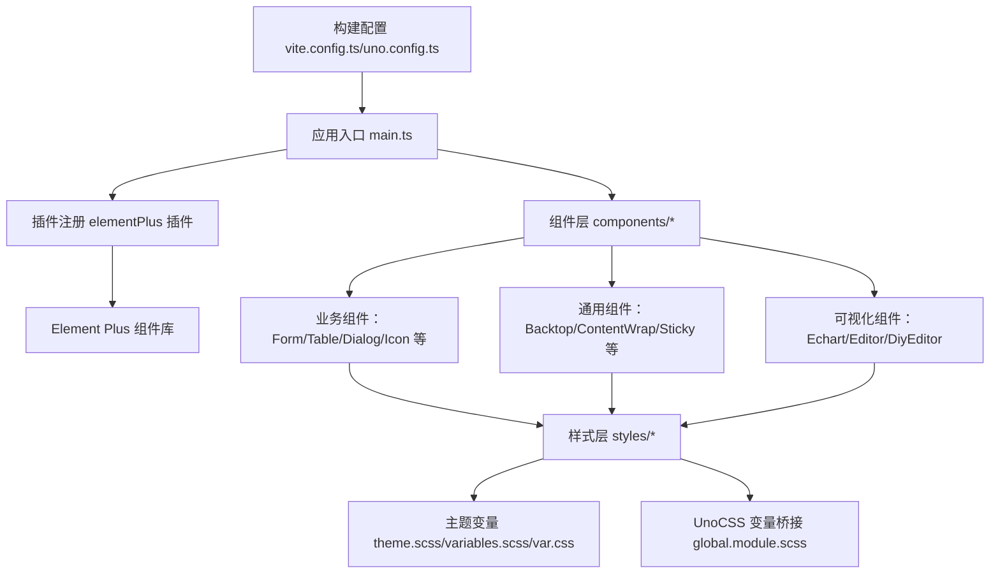
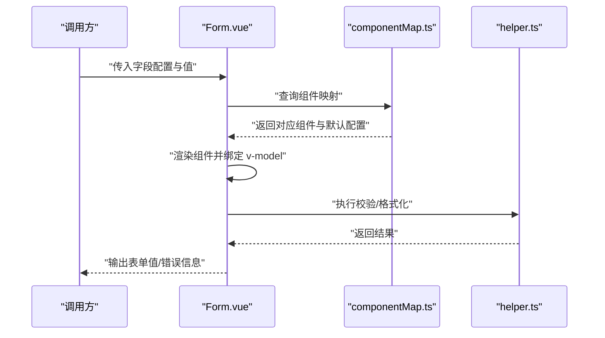
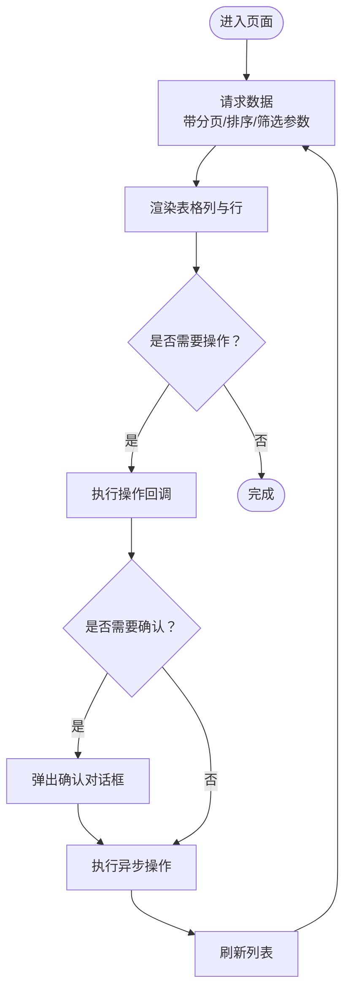
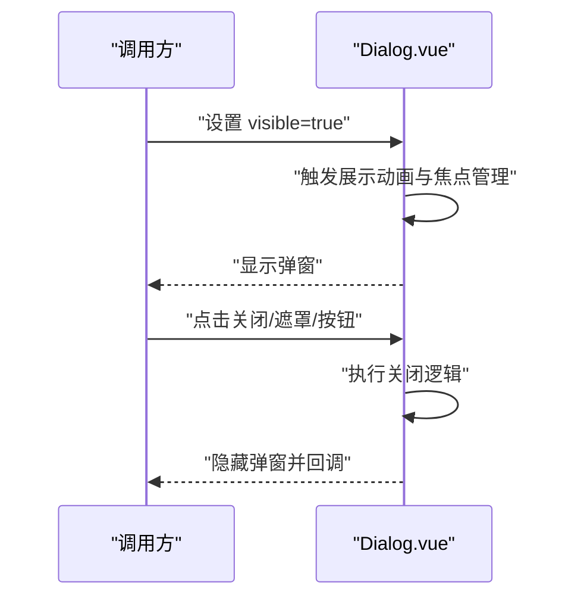
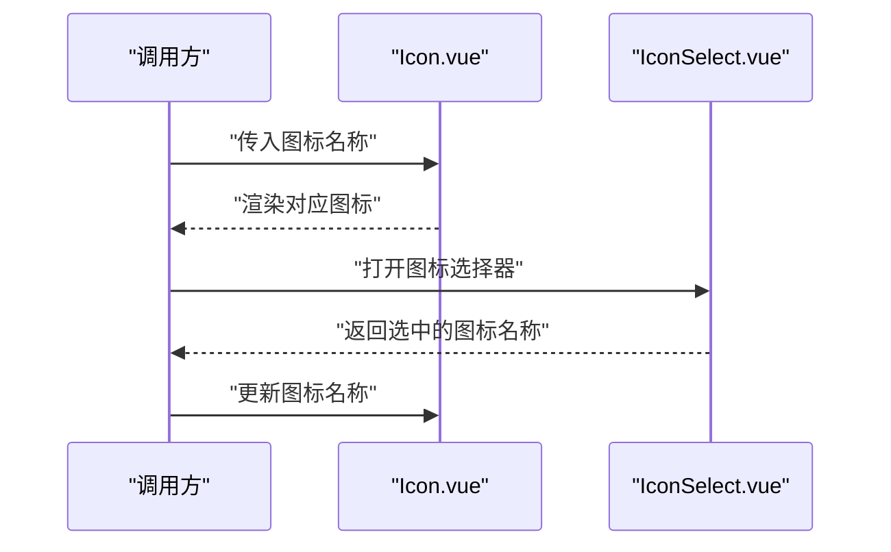
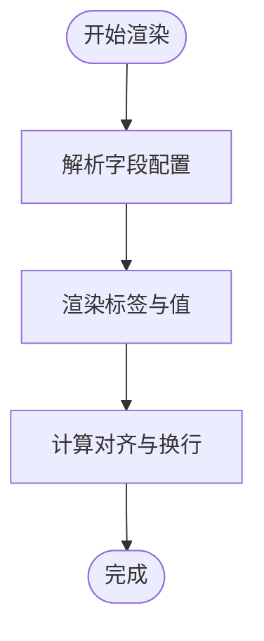
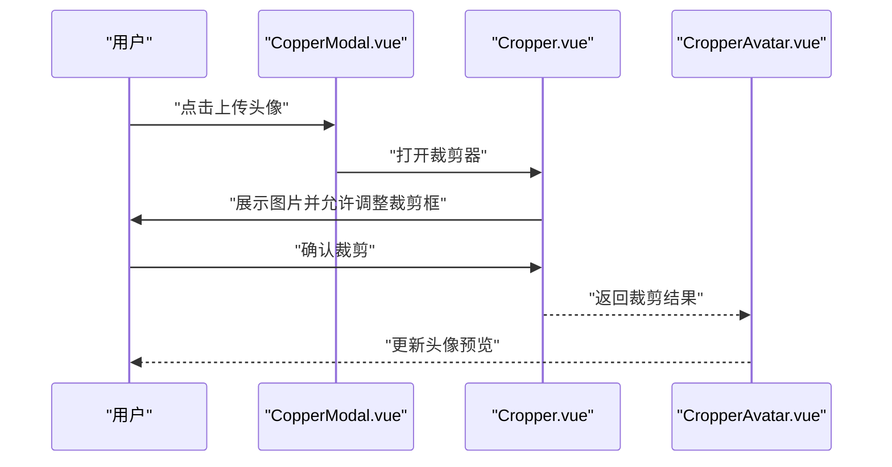
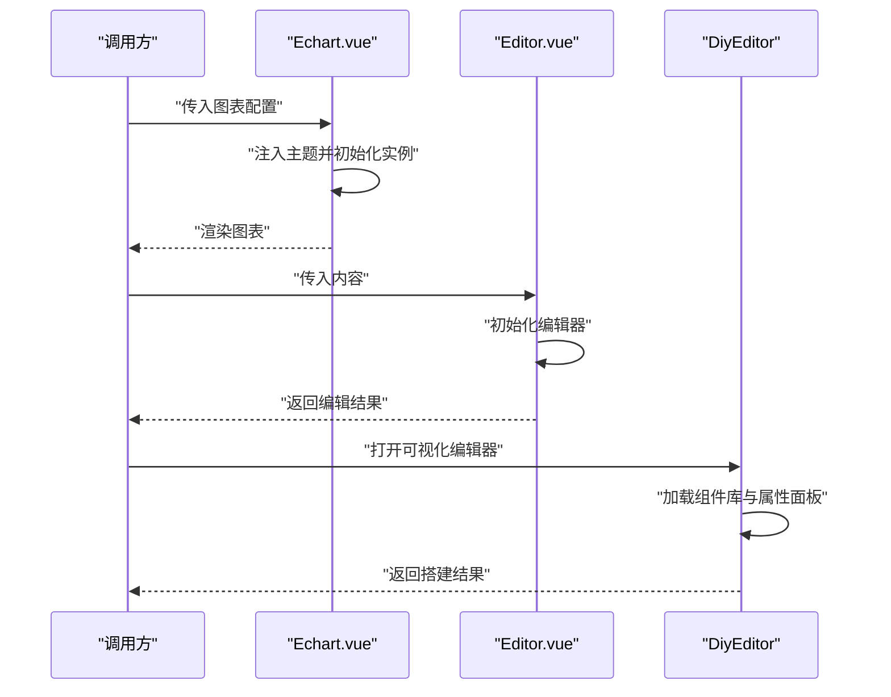
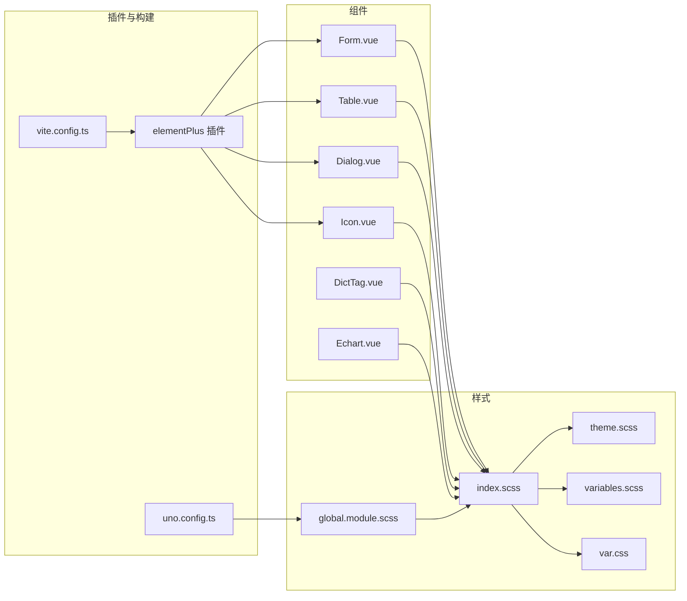

# 组件库与UI设计

<cite>
**本文引用的文件**
- [index.ts](file://yudao-ui/yudao-ui-admin-vue3/src/components/index.ts)
- [Backtop.vue](file://yudao-ui/yudao-ui-admin-vue3/src/components/Backtop/src/Backtop.vue)
- [CardTitle.vue](file://yudao-ui/yudao-ui-admin-vue3/src/components/Card/src/CardTitle.vue)
- [ConfigGlobal.vue](file://yudao-ui/yudao-ui-admin-vue3/src/components/ConfigGlobal/src/ConfigGlobal.vue)
- [ContentDetailWrap.vue](file://yudao-ui/yudao-ui-admin-vue3/src/components/ContentDetailWrap/src/ContentDetailWrap.vue)
- [ContentWrap.vue](file://yudao-ui/yudao-ui-admin-vue3/src/components/ContentWrap/src/ContentWrap.vue)
- [CountTo.vue](file://yudao-ui/yudao-ui-admin-vue3/src/components/CountTo/src/CountTo.vue)
- [Crontab.vue](file://yudao-ui/yudao-ui-admin-vue3/src/components/Crontab/src/Crontab.vue)
- [Cropper.vue](file://yudao-ui/yudao-ui-admin-vue3/src/components/Cropper/src/Cropper.vue)
- [CopperModal.vue](file://yudao-ui/yudao-ui-admin-vue3/src/components/Cropper/src/CopperModal.vue)
- [CropperAvatar.vue](file://yudao-ui/yudao-ui-admin-vue3/src/components/Cropper/src/CropperAvatar.vue)
- [DictTag.vue](file://yudao-ui/yudao-ui-admin-vue3/src/components/DictTag/src/DictTag.vue)
- [Descriptions.vue](file://yudao-ui/yudao-ui-admin-vue3/src/components/Descriptions/src/Descriptions.vue)
- [DescriptionsItemLabel.vue](file://yudao-ui/yudao-ui-admin-vue3/src/components/Descriptions/src/DescriptionsItemLabel.vue)
- [Dialog.vue](file://yudao-ui/yudao-ui-admin-vue3/src/components/Dialog/src/Dialog.vue)
- [Echart.vue](file://yudao-ui/yudao-ui-admin-vue3/src/components/Echart/src/Echart.vue)
- [Editor.vue](file://yudao-ui/yudao-ui-admin-vue3/src/components/Editor/src/Editor.vue)
- [Error.vue](file://yudao-ui/yudao-ui-admin-vue3/src/components/Error/src/Error.vue)
- [Form.vue](file://yudao-ui/yudao-ui-admin-vue3/src/components/Form/src/Form.vue)
- [componentMap.ts](file://yudao-ui/yudao-ui-admin-vue3/src/components/Form/src/componentMap.ts)
- [helper.ts](file://yudao-ui/yudao-ui-admin-vue3/src/components/Form/src/helper.ts)
- [types.ts](file://yudao-ui/yudao-ui-admin-vue3/src/components/Form/src/types.ts)
- [useFormCreateDesigner.ts](file://yudao-ui/yudao-ui-admin-vue3/src/components/FormCreate/src/useFormCreateDesigner.ts)
- [ComponentContainer.vue](file://yudao-ui/yudao-ui-admin-vue3/src/components/DiyEditor/components/ComponentContainer.vue)
- [ComponentContainerProperty.vue](file://yudao-ui/yudao-ui-admin-vue3/src/components/DiyEditor/components/ComponentContainerProperty.vue)
- [ComponentLibrary.vue](file://yudao-ui/yudao-ui-admin-vue3/src/components/DiyEditor/components/ComponentLibrary.vue)
- [Highlight.vue](file://yudao-ui/yudao-ui-admin-vue3/src/components/Highlight/src/Highlight.vue)
- [IFrame.vue](file://yudao-ui/yudao-ui-admin-vue3/src/components/IFrame/src/IFrame.vue)
- [Icon.vue](file://yudao-ui/yudao-ui-admin-vue3/src/components/Icon/src/Icon.vue)
- [IconSelect.vue](file://yudao-ui/yudao-ui-admin-vue3/src/components/Icon/src/IconSelect.vue)
- [ImageViewer.vue](file://yudao-ui/yudao-ui-admin-vue3/src/components/ImageViewer/src/ImageViewer.vue)
- [Infotip.vue](file://yudao-ui/yudao-ui-admin-vue3/src/components/Infotip/src/Infotip.vue)
- [InputPassword.vue](file://yudao-ui/yudao-ui-admin-vue3/src/components/InputPassword/src/InputPassword.vue)
- [JsonEditor.vue](file://yudao-ui/yudao-ui-admin-vue3/src/components/JsonEditor/src/JsonEditor.vue)
- [Qrcode.vue](file://yudao-ui/yudao-ui-admin-vue3/src/components/Qrcode/src/Qrcode.vue)
- [Search.vue](file://yudao-ui/yudao-ui-admin-vue3/src/components/Search/src/Search.vue)
- [SimpleProcessDesignerV2.vue](file://yudao-ui/yudao-ui-admin-vue3/src/components/SimpleProcessDesignerV2/src/SimpleProcessDesignerV2.vue)
- [Sticky.vue](file://yudao-ui/yudao-ui-admin-vue3/src/components/Sticky/src/Sticky.vue)
- [Table.vue](file://yudao-ui/yudao-ui-admin-vue3/src/components/Table/src/Table.vue)
- [Tooltip.vue](file://yudao-ui/yudao-ui-admin-vue3/src/components/Tooltip/src/Tooltip.vue)
- [UploadFile.vue](file://yudao-ui/yudao-ui-admin-vue3/src/components/UploadFile/src/UploadFile.vue)
- [Verifition.vue](file://yudao-ui/yudao-ui-admin-vue3/src/components/Verifition/src/Verifition.vue)
- [XButton.vue](file://yudao-ui/yudao-ui-admin-vue3/src/components/XButton/src/XButton.vue)
- [theme.scss](file://yudao-ui/yudao-ui-admin-vue3/src/styles/theme.scss)
- [variables.scss](file://yudao-ui/yudao-ui-admin-vue3/src/styles/variables.scss)
- [var.css](file://yudao-ui/yudao-ui-admin-vue3/src/styles/var.css)
- [index.scss](file://yudao-ui/yudao-ui-admin-vue3/src/styles/index.scss)
- [global.module.scss](file://yudao-ui/yudao-ui-admin-vue3/src/styles/global.module.scss)
- [elementPlus 插件](file://yudao-ui/yudao-ui-admin-vue3/src/plugins/elementPlus/)
- [main.ts](file://yudao-ui/yudao-ui-admin-vue3/src/main.ts)
- [vite.config.ts](file://yudao-ui/yudao-ui-admin-vue3/vite.config.ts)
- [uno.config.ts](file://yudao-ui/yudao-ui-admin-vue3/uno.config.ts)
- [package.json](file://yudao-ui/yudao-ui-admin-vue3/package.json)
</cite>

## 目录
1. [引言](#引言)
2. [项目结构](#项目结构)
3. [核心组件](#核心组件)
4. [架构总览](#架构总览)
5. [详细组件分析](#详细组件分析)
6. [依赖关系分析](#依赖关系分析)
7. [性能考量](#性能考量)
8. [故障排查指南](#故障排查指南)
9. [结论](#结论)
10. [附录](#附录)

## 引言
本文件面向芋道 Ruoyi-Vue-Pro 的前端组件库与 UI 设计，系统梳理基于 Element Plus 的组件集成与定制化实践，涵盖主题配置、组件封装、样式覆盖、可访问性设计以及开发规范与最佳实践。文档以“可读性优先”的方式组织内容，既服务于一线开发者，也便于产品与设计协作。

## 项目结构
前端组件主要位于 yudao-ui/yudao-ui-admin-vue3/src/components 下，采用“按功能域分包 + 统一导出”的组织方式：每个组件以独立目录存放源文件与入口 index.ts，便于按需引入与维护；样式集中于 styles 目录，包含主题变量、全局样式与 UnoCSS 变量桥接；插件层通过 plugins/elementPlus 集中注册 Element Plus；构建层由 Vite 与 UnoCSS 驱动。

图表来源
- [Backtop.vue](file://yudao-ui/yudao-ui-admin-vue3/src/components/Backtop/src/Backtop.vue)
- [Form.vue](file://yudao-ui/yudao-ui-admin-vue3/src/components/Form/src/Form.vue)
- [Table.vue](file://yudao-ui/yudao-ui-admin-vue3/src/components/Table/src/Table.vue)
- [Dialog.vue](file://yudao-ui/yudao-ui-admin-vue3/src/components/Dialog/src/Dialog.vue)
- [Icon.vue](file://yudao-ui/yudao-ui-admin-vue3/src/components/Icon/src/Icon.vue)
- [Descriptions.vue](file://yudao-ui/yudao-ui-admin-vue3/src/components/Descriptions/src/Descriptions.vue)
- [Cropper.vue](file://yudao-ui/yudao-ui-admin-vue3/src/components/Cropper/src/Cropper.vue)
- [ComponentContainer.vue](file://yudao-ui/yudao-ui-admin-vue3/src/components/DiyEditor/components/ComponentContainer.vue)
- [theme.scss](file://yudao-ui/yudao-ui-admin-vue3/src/styles/theme.scss)
- [variables.scss](file://yudao-ui/yudao-ui-admin-vue3/src/styles/variables.scss)
- [var.css](file://yudao-ui/yudao-ui-admin-vue3/src/styles/var.css)
- [index.scss](file://yudao-ui/yudao-ui-admin-vue3/src/styles/index.scss)
- [global.module.scss](file://yudao-ui/yudao-ui-admin-vue3/src/styles/global.module.scss)
- [elementPlus 插件](file://yudao-ui/yudao-ui-admin-vue3/src/plugins/elementPlus/)
- [vite.config.ts](file://yudao-ui/yudao-ui-admin-vue3/vite.config.ts)
- [uno.config.ts](file://yudao-ui/yudao-ui-admin-vue3/uno.config.ts)

章节来源
- [index.ts](file://yudao-ui/yudao-ui-admin-vue3/src/components/index.ts)
- [main.ts](file://yudao-ui/yudao-ui-admin-vue3/src/main.ts)
- [package.json](file://yudao-ui/yudao-ui-admin-vue3/package.json)

## 核心组件
- 组件统一入口与按需导出：通过 components/index.ts 聚合各组件入口，便于在业务页面按需引入，避免全量打包。
- 常用业务组件：
  - 表单组件：Form（含组件映射、辅助工具、类型定义）
  - 表格组件：Table（封装分页、排序、筛选等）
  - 弹窗组件：Dialog（统一尺寸、行为与交互）
  - 图标组件：Icon（图标选择器与渲染）
  - 描述列表：Descriptions（标签与值对齐展示）
  - 图片裁剪：Cropper（头像裁剪、模态框封装）
  - 可视化：Echart、Editor、DiyEditor（图表、富文本与可视化编辑器）
  - 辅助容器：Backtop、ContentWrap、ContentDetailWrap、Sticky 等
- 主题与样式：通过 theme.scss、variables.scss、var.css 与 UnoCSS 变量桥接，实现主题色、间距、圆角等可配置化。

章节来源
- [index.ts](file://yudao-ui/yudao-ui-admin-vue3/src/components/index.ts)
- [Form.vue](file://yudao-ui/yudao-ui-admin-vue3/src/components/Form/src/Form.vue)
- [Table.vue](file://yudao-ui/yudao-ui-admin-vue3/src/components/Table/src/Table.vue)
- [Dialog.vue](file://yudao-ui/yudao-ui-admin-vue3/src/components/Dialog/src/Dialog.vue)
- [Icon.vue](file://yudao-ui/yudao-ui-admin-vue3/src/components/Icon/src/Icon.vue)
- [Descriptions.vue](file://yudao-ui/yudao-ui-admin-vue3/src/components/Descriptions/src/Descriptions.vue)
- [Cropper.vue](file://yudao-ui/yudao-ui-admin-vue3/src/components/Cropper/src/Cropper.vue)
- [Echart.vue](file://yudao-ui/yudao-ui-admin-vue3/src/components/Echart/src/Echart.vue)
- [Editor.vue](file://yudao-ui/yudao-ui-admin-vue3/src/components/Editor/src/Editor.vue)
- [ComponentContainer.vue](file://yudao-ui/yudao-ui-admin-vue3/src/components/DiyEditor/components/ComponentContainer.vue)
- [theme.scss](file://yudao-ui/yudao-ui-admin-vue3/src/styles/theme.scss)
- [variables.scss](file://yudao-ui/yudao-ui-admin-vue3/src/styles/variables.scss)
- [var.css](file://yudao-ui/yudao-ui-admin-vue3/src/styles/var.css)
- [index.scss](file://yudao-ui/yudao-ui-admin-vue3/src/styles/index.scss)
- [global.module.scss](file://yudao-ui/yudao-ui-admin-vue3/src/styles/global.module.scss)

## 架构总览
组件库与 UI 设计的运行时架构围绕“组件层-样式层-插件层-构建层”展开：组件层提供业务能力；样式层统一主题与变量；插件层集中注册 Element Plus；构建层通过 Vite 与 UnoCSS 提供开发体验与产物优化。

图表来源
- [main.ts](file://yudao-ui/yudao-ui-admin-vue3/src/main.ts)
- [elementPlus 插件](file://yudao-ui/yudao-ui-admin-vue3/src/plugins/elementPlus/)
- [Form.vue](file://yudao-ui/yudao-ui-admin-vue3/src/components/Form/src/Form.vue)
- [Table.vue](file://yudao-ui/yudao-ui-admin-vue3/src/components/Table/src/Table.vue)
- [Dialog.vue](file://yudao-ui/yudao-ui-admin-vue3/src/components/Dialog/src/Dialog.vue)
- [Icon.vue](file://yudao-ui/yudao-ui-admin-vue3/src/components/Icon/src/Icon.vue)
- [Backtop.vue](file://yudao-ui/yudao-ui-admin-vue3/src/components/Backtop/src/Backtop.vue)
- [ContentWrap.vue](file://yudao-ui/yudao-ui-admin-vue3/src/components/ContentWrap/src/ContentWrap.vue)
- [Echart.vue](file://yudao-ui/yudao-ui-admin-vue3/src/components/Echart/src/Echart.vue)
- [Editor.vue](file://yudao-ui/yudao-ui-admin-vue3/src/components/Editor/src/Editor.vue)
- [DiyEditor 组件](file://yudao-ui/yudao-ui-admin-vue3/src/components/DiyEditor/components/)
- [theme.scss](file://yudao-ui/yudao-ui-admin-vue3/src/styles/theme.scss)
- [variables.scss](file://yudao-ui/yudao-ui-admin-vue3/src/styles/variables.scss)
- [var.css](file://yudao-ui/yudao-ui-admin-vue3/src/styles/var.css)
- [global.module.scss](file://yudao-ui/yudao-ui-admin-vue3/src/styles/global.module.scss)
- [vite.config.ts](file://yudao-ui/yudao-ui-admin-vue3/vite.config.ts)
- [uno.config.ts](file://yudao-ui/yudao-ui-admin-vue3/uno.config.ts)

## 详细组件分析

### 表单组件（Form）
- 设计原则
  - 组件映射：通过 componentMap 将字段类型映射到具体 Element Plus 组件，统一渲染逻辑。
  - 类型安全：types.ts 定义字段与布局类型，配合 helper.ts 提供校验与格式化工具。
  - 可扩展：支持动态增删字段、条件渲染与联动校验。
- 关键流程
  - 渲染流程：根据字段配置选择组件，传递 props、events、slots。
  - 校验流程：结合 v-model 与表单规则，触发实时或提交时校验。
  - 布局流程：支持栅格化布局与响应式断点控制。

图表来源
- [Form.vue](file://yudao-ui/yudao-ui-admin-vue3/src/components/Form/src/Form.vue)
- [componentMap.ts](file://yudao-ui/yudao-ui-admin-vue3/src/components/Form/src/componentMap.ts)
- [helper.ts](file://yudao-ui/yudao-ui-admin-vue3/src/components/Form/src/helper.ts)
- [types.ts](file://yudao-ui/yudao-ui-admin-vue3/src/components/Form/src/types.ts)

章节来源
- [Form.vue](file://yudao-ui/yudao-ui-admin-vue3/src/components/Form/src/Form.vue)
- [componentMap.ts](file://yudao-ui/yudao-ui-admin-vue3/src/components/Form/src/componentMap.ts)
- [helper.ts](file://yudao-ui/yudao-ui-admin-vue3/src/components/Form/src/helper.ts)
- [types.ts](file://yudao-ui/yudao-ui-admin-vue3/src/components/Form/src/types.ts)

### 表格组件（Table）
- 设计原则
  - 封装分页、排序、筛选与列配置，统一加载状态与空态处理。
  - 支持行内操作、批量操作与自定义列渲染。
- 关键流程
  - 数据请求：根据当前页、每页条数、排序与筛选参数发起请求。
  - 列配置：支持固定列、宽度自适应与列拖拽。
  - 操作流程：点击操作按钮触发回调，支持二次确认与异步加载。

图表来源
- [Table.vue](file://yudao-ui/yudao-ui-admin-vue3/src/components/Table/src/Table.vue)

章节来源
- [Table.vue](file://yudao-ui/yudao-ui-admin-vue3/src/components/Table/src/Table.vue)

### 弹窗组件（Dialog）
- 设计原则
  - 统一尺寸、标题、关闭与遮罩行为；支持全屏、无标题与自定义底部按钮。
  - 与表单/表格组合使用时，确保滚动与焦点管理一致。
- 关键流程
  - 打开流程：设置 visible 为 true，触发展示动画与焦点转移。
  - 关闭流程：支持 ESC 关闭、遮罩点击关闭与按钮关闭，关闭前可触发保存校验。

图表来源
- [Dialog.vue](file://yudao-ui/yudao-ui-admin-vue3/src/components/Dialog/src/Dialog.vue)

章节来源
- [Dialog.vue](file://yudao-ui/yudao-ui-admin-vue3/src/components/Dialog/src/Dialog.vue)

### 图标组件（Icon）
- 设计原则
  - Icon.vue 负责渲染与选择；IconSelect.vue 提供图标选择器。
  - 支持 SVG 注册与按需加载，避免全量引入。
- 关键流程
  - 渲染流程：根据名称匹配已注册图标，否则回退占位。
  - 选择流程：打开选择器，支持搜索与分类浏览，选中后回填名称。

图表来源
- [Icon.vue](file://yudao-ui/yudao-ui-admin-vue3/src/components/Icon/src/Icon.vue)
- [IconSelect.vue](file://yudao-ui/yudao-ui-admin-vue3/src/components/Icon/src/IconSelect.vue)

章节来源
- [Icon.vue](file://yudao-ui/yudao-ui-admin-vue3/src/components/Icon/src/Icon.vue)
- [IconSelect.vue](file://yudao-ui/yudao-ui-admin-vue3/src/components/Icon/src/IconSelect.vue)

### 描述列表组件（Descriptions）
- 设计原则
  - Descriptions.vue 负责整体布局与对齐；DescriptionsItemLabel.vue 提供标签渲染。
  - 支持多列布局与响应式断点，标签与值对齐展示。
- 关键流程
  - 渲染流程：遍历字段配置，渲染标签与值，支持自定义渲染函数。
  - 响应式流程：根据屏幕宽度切换列数，保证可读性。

图表来源
- [Descriptions.vue](file://yudao-ui/yudao-ui-admin-vue3/src/components/Descriptions/src/Descriptions.vue)
- [DescriptionsItemLabel.vue](file://yudao-ui/yudao-ui-admin-vue3/src/components/Descriptions/src/DescriptionsItemLabel.vue)

章节来源
- [Descriptions.vue](file://yudao-ui/yudao-ui-admin-vue3/src/components/Descriptions/src/Descriptions.vue)
- [DescriptionsItemLabel.vue](file://yudao-ui/yudao-ui-admin-vue3/src/components/Descriptions/src/DescriptionsItemLabel.vue)

### 图片裁剪组件（Cropper）
- 设计原则
  - Cropper.vue 提供裁剪能力；CopperModal.vue 与 CropperAvatar.vue 分别封装模态框与头像裁剪场景。
  - 支持预设比例、自由裁剪与预览缩略图。
- 关键流程
  - 上传流程：选择图片后预览，进入裁剪界面。
  - 裁剪流程：调整裁剪框大小与位置，生成裁剪结果。
  - 回显流程：将裁剪结果回填至表单或头像展示。

图表来源
- [CopperModal.vue](file://yudao-ui/yudao-ui-admin-vue3/src/components/Cropper/src/CopperModal.vue)
- [Cropper.vue](file://yudao-ui/yudao-ui-admin-vue3/src/components/Cropper/src/Cropper.vue)
- [CropperAvatar.vue](file://yudao-ui/yudao-ui-admin-vue3/src/components/Cropper/src/CropperAvatar.vue)

章节来源
- [CopperModal.vue](file://yudao-ui/yudao-ui-admin-vue3/src/components/Cropper/src/CopperModal.vue)
- [Cropper.vue](file://yudao-ui/yudao-ui-admin-vue3/src/components/Cropper/src/Cropper.vue)
- [CropperAvatar.vue](file://yudao-ui/yudao-ui-admin-vue3/src/components/Cropper/src/CropperAvatar.vue)

### 可视化组件（Echart、Editor、DiyEditor）
- 设计原则
  - Echart.vue 封装图表容器与主题适配；Editor.vue 提供富文本编辑能力；DiyEditor 提供可视化搭建组件库与属性面板。
  - 统一尺寸、主题与交互，支持响应式与暗色模式。
- 关键流程
  - 初始化流程：注入主题变量，监听容器尺寸变化。
  - 更新流程：根据数据变化重绘图表或刷新编辑器内容。
  - 属性流程：DiyEditor 的 ComponentContainer 与 ComponentContainerProperty 实现组件属性编辑与预览。

图表来源
- [Echart.vue](file://yudao-ui/yudao-ui-admin-vue3/src/components/Echart/src/Echart.vue)
- [Editor.vue](file://yudao-ui/yudao-ui-admin-vue3/src/components/Editor/src/Editor.vue)
- [ComponentContainer.vue](file://yudao-ui/yudao-ui-admin-vue3/src/components/DiyEditor/components/ComponentContainer.vue)
- [ComponentContainerProperty.vue](file://yudao-ui/yudao-ui-admin-vue3/src/components/DiyEditor/components/ComponentContainerProperty.vue)
- [ComponentLibrary.vue](file://yudao-ui/yudao-ui-admin-vue3/src/components/DiyEditor/components/ComponentLibrary.vue)

章节来源
- [Echart.vue](file://yudao-ui/yudao-ui-admin-vue3/src/components/Echart/src/Echart.vue)
- [Editor.vue](file://yudao-ui/yudao-ui-admin-vue3/src/components/Editor/src/Editor.vue)
- [ComponentContainer.vue](file://yudao-ui/yudao-ui-admin-vue3/src/components/DiyEditor/components/ComponentContainer.vue)
- [ComponentContainerProperty.vue](file://yudao-ui/yudao-ui-admin-vue3/src/components/DiyEditor/components/ComponentContainerProperty.vue)
- [ComponentLibrary.vue](file://yudao-ui/yudao-ui-admin-vue3/src/components/DiyEditor/components/ComponentLibrary.vue)

### 辅助容器与通用组件
- Backtop：回到顶部按钮，支持阈值与滚动容器配置。
- ContentWrap/ContentDetailWrap：内容容器，统一边距与阴影。
- Sticky：吸顶容器，支持偏移与触发条件。
- Highlight：高亮文本，支持关键词匹配与样式覆盖。
- IFrame：嵌套页面容器，支持跨域与安全策略。
- Tooltip：提示气泡，支持延迟与定位。
- UploadFile：文件上传，支持多文件、预览与删除。
- Verifition：验证码组件，支持刷新与校验。
- XButton：扩展按钮，支持图标、尺寸与禁用状态。
- Search：搜索输入，支持快捷日期范围选择。
- Qrcode：二维码生成，支持尺寸与背景色配置。
- Error：错误占位，支持重试与文案配置。

章节来源
- [Backtop.vue](file://yudao-ui/yudao-ui-admin-vue3/src/components/Backtop/src/Backtop.vue)
- [ContentWrap.vue](file://yudao-ui/yudao-ui-admin-vue3/src/components/ContentWrap/src/ContentWrap.vue)
- [ContentDetailWrap.vue](file://yudao-ui/yudao-ui-admin-vue3/src/components/ContentDetailWrap/src/ContentDetailWrap.vue)
- [Sticky.vue](file://yudao-ui/yudao-ui-admin-vue3/src/components/Sticky/src/Sticky.vue)
- [Highlight.vue](file://yudao-ui/yudao-ui-admin-vue3/src/components/Highlight/src/Highlight.vue)
- [IFrame.vue](file://yudao-ui/yudao-ui-admin-vue3/src/components/IFrame/src/IFrame.vue)
- [Tooltip.vue](file://yudao-ui/yudao-ui-admin-vue3/src/components/Tooltip/src/Tooltip.vue)
- [UploadFile.vue](file://yudao-ui/yudao-ui-admin-vue3/src/components/UploadFile/src/UploadFile.vue)
- [Verifition.vue](file://yudao-ui/yudao-ui-admin-vue3/src/components/Verifition/src/Verifition.vue)
- [XButton.vue](file://yudao-ui/yudao-ui-admin-vue3/src/components/XButton/src/XButton.vue)
- [Search.vue](file://yudao-ui/yudao-ui-admin-vue3/src/components/Search/src/Search.vue)
- [Qrcode.vue](file://yudao-ui/yudao-ui-admin-vue3/src/components/Qrcode/src/Qrcode.vue)
- [Error.vue](file://yudao-ui/yudao-ui-admin-vue3/src/components/Error/src/Error.vue)

## 依赖关系分析
- 组件与样式
  - 组件普遍依赖 index.scss 与 theme.scss/variables.scss 中的主题变量，确保视觉一致性。
  - UnoCSS 通过 global.module.scss 与 var.css 进行变量桥接，减少重复样式。
- 插件与构建
  - main.ts 中注册 elementPlus 插件，集中导入 Element Plus 组件与国际化资源。
  - vite.config.ts 与 uno.config.ts 配置开发服务器、自动导入与原子化样式。
- 组件间耦合
  - 表单组件与字典标签（DictTag）、图标（Icon）存在弱耦合，用于渲染与选择。
  - 可视化组件与 ECharts 生态存在弱耦合，通过 Echart.vue 封装。

图表来源
- [Form.vue](file://yudao-ui/yudao-ui-admin-vue3/src/components/Form/src/Form.vue)
- [Table.vue](file://yudao-ui/yudao-ui-admin-vue3/src/components/Table/src/Table.vue)
- [Dialog.vue](file://yudao-ui/yudao-ui-admin-vue3/src/components/Dialog/src/Dialog.vue)
- [Icon.vue](file://yudao-ui/yudao-ui-admin-vue3/src/components/Icon/src/Icon.vue)
- [DictTag.vue](file://yudao-ui/yudao-ui-admin-vue3/src/components/DictTag/src/DictTag.vue)
- [Echart.vue](file://yudao-ui/yudao-ui-admin-vue3/src/components/Echart/src/Echart.vue)
- [index.scss](file://yudao-ui/yudao-ui-admin-vue3/src/styles/index.scss)
- [theme.scss](file://yudao-ui/yudao-ui-admin-vue3/src/styles/theme.scss)
- [variables.scss](file://yudao-ui/yudao-ui-admin-vue3/src/styles/variables.scss)
- [var.css](file://yudao-ui/yudao-ui-admin-vue3/src/styles/var.css)
- [global.module.scss](file://yudao-ui/yudao-ui-admin-vue3/src/styles/global.module.scss)
- [elementPlus 插件](file://yudao-ui/yudao-ui-admin-vue3/src/plugins/elementPlus/)
- [vite.config.ts](file://yudao-ui/yudao-ui-admin-vue3/vite.config.ts)
- [uno.config.ts](file://yudao-ui/yudao-ui-admin-vue3/uno.config.ts)

章节来源
- [main.ts](file://yudao-ui/yudao-ui-admin-vue3/src/main.ts)
- [vite.config.ts](file://yudao-ui/yudao-ui-admin-vue3/vite.config.ts)
- [uno.config.ts](file://yudao-ui/yudao-ui-admin-vue3/uno.config.ts)
- [package.json](file://yudao-ui/yudao-ui-admin-vue3/package.json)

## 性能考量
- 按需引入：通过组件统一入口与 Tree Shaking，避免 Element Plus 全量引入。
- 样式隔离：使用 UnoCSS 与局部样式模块，减少全局污染与重绘。
- 渲染优化：表单与表格组件采用虚拟滚动与懒加载策略，降低大数据渲染压力。
- 缓存策略：图片裁剪与可视化编辑结果进行本地缓存，提升交互效率。
- 主题切换：通过 CSS 变量与主题文件热替换，实现快速主题切换。

## 故障排查指南
- 组件未生效
  - 检查 main.ts 是否正确注册 elementPlus 插件。
  - 确认组件是否通过 components/index.ts 正确导出。
- 样式异常
  - 检查 theme.scss/variables.scss 是否被正确引入。
  - 确认 UnoCSS 变量桥接 global.module.scss 是否生效。
- 表单校验不生效
  - 检查 Form.vue 的字段配置与 componentMap 映射。
  - 确认 helper.ts 的校验规则是否正确绑定。
- 图表渲染失败
  - 检查 Echart.vue 的主题注入与容器尺寸。
  - 确认数据格式与系列配置是否匹配。
- 图片裁剪异常
  - 检查 Cropper.vue 的图片加载与裁剪参数。
  - 确认 CopperModal.vue 的模态框状态与回调。

章节来源
- [main.ts](file://yudao-ui/yudao-ui-admin-vue3/src/main.ts)
- [index.ts](file://yudao-ui/yudao-ui-admin-vue3/src/components/index.ts)
- [theme.scss](file://yudao-ui/yudao-ui-admin-vue3/src/styles/theme.scss)
- [variables.scss](file://yudao-ui/yudao-ui-admin-vue3/src/styles/variables.scss)
- [global.module.scss](file://yudao-ui/yudao-ui-admin-vue3/src/styles/global.module.scss)
- [Form.vue](file://yudao-ui/yudao-ui-admin-vue3/src/components/Form/src/Form.vue)
- [Echart.vue](file://yudao-ui/yudao-ui-admin-vue3/src/components/Echart/src/Echart.vue)
- [Cropper.vue](file://yudao-ui/yudao-ui-admin-vue3/src/components/Cropper/src/Cropper.vue)

## 结论
本组件库以 Element Plus 为基础，结合项目实际业务需求，实现了表单、表格、弹窗、图标、描述列表、图片裁剪与可视化等核心组件的封装与定制。通过统一的主题变量、样式模块与插件注册，确保了组件的一致性与可维护性。建议后续持续完善可访问性与自动化测试，进一步提升组件质量与用户体验。

## 附录
- 开发规范
  - 组件命名：采用帕斯卡命名，如 XxxComponent。
  - 属性定义：使用 TypeScript 定义 props 与 emits，提供默认值与校验。
  - 事件处理：遵循 onXxx 命名，保持事件粒度清晰。
  - 插槽使用：提供具名插槽与作用域插槽，增强可扩展性。
- 可访问性设计
  - 键盘导航：确保所有可交互元素可通过 Tab 导航与 Enter/Space 触发。
  - 屏幕阅读器：为图标与按钮提供 aria-label 或替代文本。
  - 色彩对比度：遵循 WCAG 对比度要求，保障低视力用户的可读性。
- 最佳实践
  - 组件测试：为关键组件编写单元测试与快照测试。
  - 文档编写：为每个组件提供使用示例与 API 文档。
  - 版本管理：采用语义化版本与变更日志，确保升级可追溯。