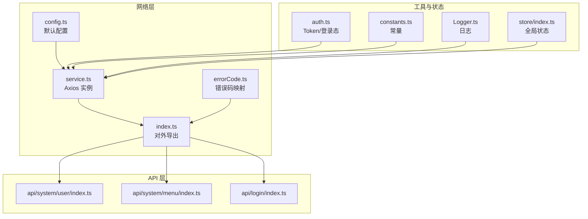
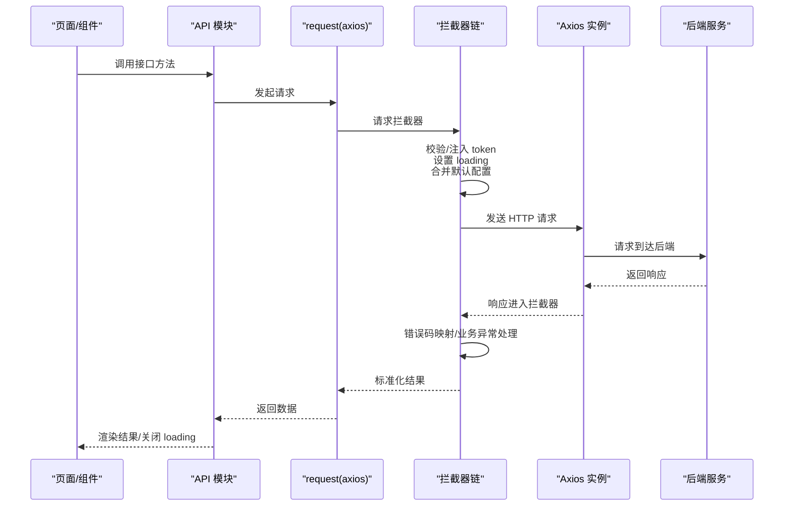
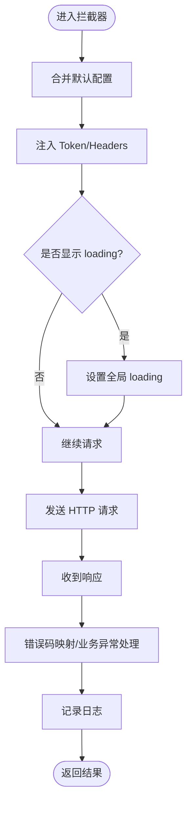
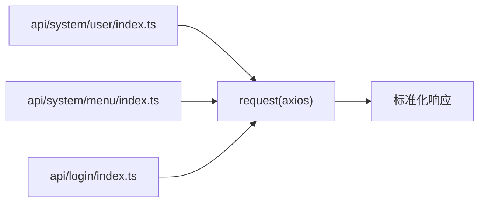
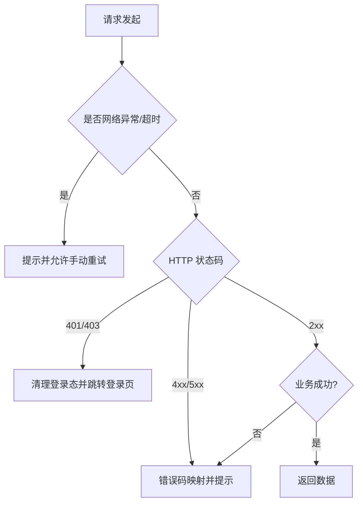
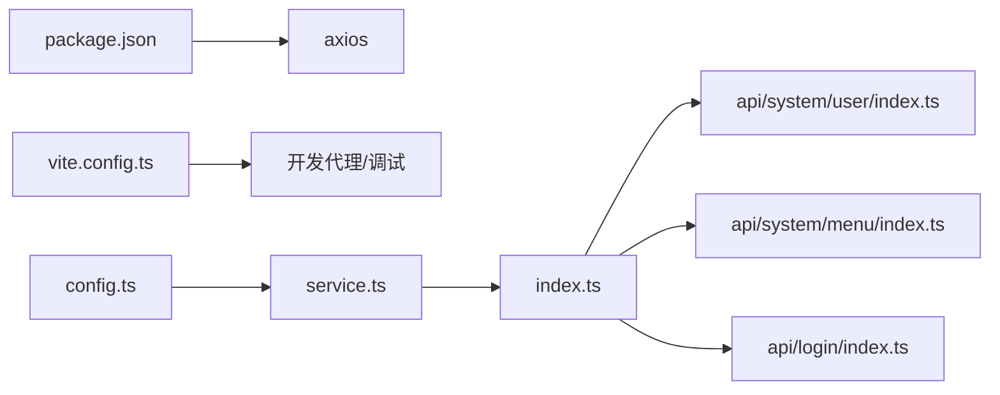

# 网络请求

<cite>
**本文引用的文件**
- [yudao-ui-admin-vue3/src/config/axios/config.ts](file://yudao-ui/yudao-ui-admin-vue3/src/config/axios/config.ts)
- [yudao-ui-admin-vue3/src/config/axios/service.ts](file://yudao-ui/yudao-ui-admin-vue3/src/config/axios/service.ts)
- [yudao-ui-admin-vue3/src/config/axios/errorCode.ts](file://yudao-ui/yudao-ui-admin-vue3/src/config/axios/errorCode.ts)
- [yudao-ui-admin-vue3/src/config/axios/index.ts](file://yudao-ui/yudao-ui-admin-vue3/src/config/axios/index.ts)
- [yudao-ui-admin-vue3/src/utils/auth.ts](file://yudao-ui/yudao-ui-admin-vue3/src/utils/auth.ts)
- [yudao-ui-admin-vue3/src/utils/constants.ts](file://yudao-ui/yudao-ui-admin-vue3/src/utils/constants.ts)
- [yudao-ui-admin-vue3/src/utils/Logger.ts](file://yudao-ui/yudao-ui-admin-vue3/src/utils/Logger.ts)
- [yudao-ui-admin-vue3/src/store/index.ts](file://yudao-ui/yudao-ui-admin-vue3/src/store/index.ts)
- [yudao-ui-admin-vue3/src/api/system/user/index.ts](file://yudao-ui/yudao-ui-admin-vue3/src/api/system/user/index.ts)
- [yudao-ui-admin-vue3/src/api/system/menu/index.ts](file://yudao-ui/yudao-ui-admin-vue3/src/api/system/menu/index.ts)
- [yudao-ui-admin-vue3/src/api/login/index.ts](file://yudao-ui/yudao-ui-admin-vue3/src/api/login/index.ts)
- [yudao-ui-admin-vue3/src/router/index.ts](file://yudao-ui/yudao-ui-admin-vue3/src/router/index.ts)
- [yudao-ui-admin-vue3/src/permission.ts](file://yudao-ui/yudao-ui-admin-vue3/src/permission.ts)
- [yudao-ui-admin-vue3/package.json](file://yudao-ui/yudao-ui-admin-vue3/package.json)
- [yudao-ui-admin-vue3/vite.config.ts](file://yudao-ui/yudao-ui-admin-vue3/vite.config.ts)
- [yudao-ui-admin-vue3/src/main.ts](file://yudao-ui/yudao-ui-admin-vue3/src/main.ts)
</cite>

## 目录
1. [引言](#引言)
2. [项目结构](#项目结构)
3. [核心组件](#核心组件)
4. [架构总览](#架构总览)
5. [详细组件分析](#详细组件分析)
6. [依赖关系分析](#依赖关系分析)
7. [性能考量](#性能考量)
8. [故障排查指南](#故障排查指南)
9. [结论](#结论)
10. [附录](#附录)

## 引言
本章节面向“芋道 Ruoyi-Vue-Pro”前端工程中的网络请求体系，系统化梳理 Axios 封装设计与使用模式，覆盖请求配置、响应处理、错误拦截、统一接口管理、拦截器链路（含 token、loading、错误提示）、异常与重试策略、安全与防护（XSS、CSRF、数据加密）、以及接口调试与监控方法。目标是帮助开发者快速理解并正确使用网络层，提升开发效率与系统稳定性。

## 项目结构
前端网络层位于 yudao-ui/yudao-ui-admin-vue3 工程中，核心目录为 config/axios，包含 axios 的全局配置、服务实例、错误码映射与导出入口；同时配合 utils 中的鉴权、常量、日志与 store，形成完整的请求生命周期闭环。

图表来源
- [yudao-ui-admin-vue3/src/config/axios/config.ts](file://yudao-ui/yudao-ui-admin-vue3/src/config/axios/config.ts)
- [yudao-ui-admin-vue3/src/config/axios/service.ts](file://yudao-ui/yudao-ui-admin-vue3/src/config/axios/service.ts)
- [yudao-ui-admin-vue3/src/config/axios/errorCode.ts](file://yudao-ui/yudao-ui-admin-vue3/src/config/axios/errorCode.ts)
- [yudao-ui-admin-vue3/src/config/axios/index.ts](file://yudao-ui/yudao-ui-admin-vue3/src/config/axios/index.ts)
- [yudao-ui-admin-vue3/src/utils/auth.ts](file://yudao-ui/yudao-ui-admin-vue3/src/utils/auth.ts)
- [yudao-ui-admin-vue3/src/utils/constants.ts](file://yudao-ui/yudao-ui-admin-vue3/src/utils/constants.ts)
- [yudao-ui-admin-vue3/src/utils/Logger.ts](file://yudao-ui/yudao-ui-admin-vue3/src/utils/Logger.ts)
- [yudao-ui-admin-vue3/src/store/index.ts](file://yudao-ui/yudao-ui-admin-vue3/src/store/index.ts)
- [yudao-ui-admin-vue3/src/api/system/user/index.ts](file://yudao-ui/yudao-ui-admin-vue3/src/api/system/user/index.ts)
- [yudao-ui-admin-vue3/src/api/system/menu/index.ts](file://yudao-ui/yudao-ui-admin-vue3/src/api/system/menu/index.ts)
- [yudao-ui-admin-vue3/src/api/login/index.ts](file://yudao-ui/yudao-ui-admin-vue3/src/api/login/index.ts)

章节来源
- [yudao-ui-admin-vue3/src/config/axios/config.ts](file://yudao-ui/yudao-ui-admin-vue3/src/config/axios/config.ts)
- [yudao-ui-admin-vue3/src/config/axios/service.ts](file://yudao-ui/yudao-ui-admin-vue3/src/config/axios/service.ts)
- [yudao-ui-admin-vue3/src/config/axios/errorCode.ts](file://yudao-ui/yudao-ui-admin-vue3/src/config/axios/errorCode.ts)
- [yudao-ui-admin-vue3/src/config/axios/index.ts](file://yudao-ui/yudao-ui-admin-vue3/src/config/axios/index.ts)

## 核心组件
- 默认配置 config.ts：集中定义 baseURL、timeout、withCredentials、headers 等通用参数，确保所有请求遵循统一规则。
- Axios 实例 service.ts：创建并导出 axios 实例，作为全局唯一请求通道，便于统一注入拦截器与错误处理。
- 错误码映射 errorCode.ts：将后端返回的业务错误码映射为可读提示，支持国际化与本地化提示策略。
- 导出入口 index.ts：对外暴露统一的 request 方法与类型声明，供各页面与 API 模块按需调用。
- 鉴权工具 auth.ts：负责 token 获取、刷新与失效处理，贯穿拦截器链路。
- 常量 constants.ts：存放环境变量、开关常量等，影响请求行为（如是否启用 loading、是否开启调试日志）。
- 日志 Logger.ts：提供统一的日志记录能力，便于调试与审计。
- 全局状态 store/index.ts：维护登录态、用户信息、权限等，驱动请求前置条件与拦截器逻辑。

章节来源
- [yudao-ui-admin-vue3/src/config/axios/config.ts](file://yudao-ui/yudao-ui-admin-vue3/src/config/axios/config.ts)
- [yudao-ui-admin-vue3/src/config/axios/service.ts](file://yudao-ui/yudao-ui-admin-vue3/src/config/axios/service.ts)
- [yudao-ui-admin-vue3/src/config/axios/errorCode.ts](file://yudao-ui/yudao-ui-admin-vue3/src/config/axios/errorCode.ts)
- [yudao-ui-admin-vue3/src/config/axios/index.ts](file://yudao-ui/yudao-ui-admin-vue3/src/config/axios/index.ts)
- [yudao-ui-admin-vue3/src/utils/auth.ts](file://yudao-ui/yudao-ui-admin-vue3/src/utils/auth.ts)
- [yudao-ui-admin-vue3/src/utils/constants.ts](file://yudao-ui/yudao-ui-admin-vue3/src/utils/constants.ts)
- [yudao-ui-admin-vue3/src/utils/Logger.ts](file://yudao-ui/yudao-ui-admin-vue3/src/utils/Logger.ts)
- [yudao-ui-admin-vue3/src/store/index.ts](file://yudao-ui/yudao-ui-admin-vue3/src/store/index.ts)

## 架构总览
下图展示从页面调用到后端响应的完整链路，包括请求前的鉴权与加载、请求后的错误处理与提示，以及与全局状态的交互。

图表来源
- [yudao-ui-admin-vue3/src/config/axios/service.ts](file://yudao-ui/yudao-ui-admin-vue3/src/config/axios/service.ts)
- [yudao-ui-admin-vue3/src/config/axios/errorCode.ts](file://yudao-ui/yudao-ui-admin-vue3/src/config/axios/errorCode.ts)
- [yudao-ui-admin-vue3/src/utils/auth.ts](file://yudao-ui/yudao-ui-admin-vue3/src/utils/auth.ts)
- [yudao-ui-admin-vue3/src/utils/constants.ts](file://yudao-ui/yudao-ui-admin-vue3/src/utils/constants.ts)
- [yudao-ui-admin-vue3/src/api/system/user/index.ts](file://yudao-ui/yudao-ui-admin-vue3/src/api/system/user/index.ts)

## 详细组件分析

### Axios 默认配置与实例
- 默认配置：集中管理 baseURL、超时时间、跨域凭据、默认 headers 等，保证请求一致性与安全性。
- 实例创建：基于 axios 创建全局实例，避免重复配置，便于后续注入拦截器与统一处理。
- 导出方式：通过 index.ts 统一导出 request 方法，隐藏底层细节，降低耦合度。

章节来源
- [yudao-ui-admin-vue3/src/config/axios/config.ts](file://yudao-ui/yudao-ui-admin-vue3/src/config/axios/config.ts)
- [yudao-ui-admin-vue3/src/config/axios/service.ts](file://yudao-ui/yudao-ui-admin-vue3/src/config/axios/service.ts)
- [yudao-ui-admin-vue3/src/config/axios/index.ts](file://yudao-ui/yudao-ui-admin-vue3/src/config/axios/index.ts)

### 请求拦截器与响应拦截器
- 请求拦截器职责
  - 合并默认配置：将 config.ts 中的默认项与调用方传入参数合并。
  - 注入认证信息：从 auth.ts 获取 token 并附加到 headers 或 params。
  - 控制加载态：根据 constants.ts 中的开关决定是否显示全局 loading。
  - 参数预处理：对复杂参数进行序列化或格式化，确保后端可解析。
- 响应拦截器职责
  - 业务错误码映射：依据 errorCode.ts 的映射表，将后端错误转换为用户可读提示。
  - 状态码处理：对 4xx/5xx 等非业务异常进行统一处理（如登出、跳转登录页）。
  - 成功透传：对业务成功响应直接透传，供上层消费。
  - 日志记录：通过 Logger.ts 输出请求日志，便于问题定位。

图表来源
- [yudao-ui-admin-vue3/src/config/axios/service.ts](file://yudao-ui/yudao-ui-admin-vue3/src/config/axios/service.ts)
- [yudao-ui-admin-vue3/src/config/axios/errorCode.ts](file://yudao-ui/yudao-ui-admin-vue3/src/config/axios/errorCode.ts)
- [yudao-ui-admin-vue3/src/utils/auth.ts](file://yudao-ui/yudao-ui-admin-vue3/src/utils/auth.ts)
- [yudao-ui-admin-vue3/src/utils/constants.ts](file://yudao-ui/yudao-ui-admin-vue3/src/utils/constants.ts)
- [yudao-ui-admin-vue3/src/utils/Logger.ts](file://yudao-ui/yudao-ui-admin-vue3/src/utils/Logger.ts)

章节来源
- [yudao-ui-admin-vue3/src/config/axios/service.ts](file://yudao-ui/yudao-ui-admin-vue3/src/config/axios/service.ts)
- [yudao-ui-admin-vue3/src/config/axios/errorCode.ts](file://yudao-ui/yudao-ui-admin-vue3/src/config/axios/errorCode.ts)
- [yudao-ui-admin-vue3/src/utils/auth.ts](file://yudao-ui/yudao-ui-admin-vue3/src/utils/auth.ts)
- [yudao-ui-admin-vue3/src/utils/constants.ts](file://yudao-ui/yudao-ui-admin-vue3/src/utils/constants.ts)
- [yudao-ui-admin-vue3/src/utils/Logger.ts](file://yudao-ui/yudao-ui-admin-vue3/src/utils/Logger.ts)

### API 接口的统一管理
- 模块化组织：按业务模块划分 API 文件（如 system/user、login 等），每个模块以 index.ts 暴露方法，便于维护与复用。
- 方法命名规范：统一采用动词短语命名（如 getUserList、createUser），参数与返回值明确标注。
- 参数校验：在调用前对必填字段与格式进行校验，减少无效请求。
- 返回值处理：统一包装响应结构，区分业务成功与失败，并结合 errorCode.ts 进行提示。

图表来源
- [yudao-ui-admin-vue3/src/api/system/user/index.ts](file://yudao-ui/yudao-ui-admin-vue3/src/api/system/user/index.ts)
- [yudao-ui-admin-vue3/src/api/system/menu/index.ts](file://yudao-ui/yudao-ui-admin-vue3/src/api/system/menu/index.ts)
- [yudao-ui-admin-vue3/src/api/login/index.ts](file://yudao-ui/yudao-ui-admin-vue3/src/api/login/index.ts)
- [yudao-ui-admin-vue3/src/config/axios/index.ts](file://yudao-ui/yudao-ui-admin-vue3/src/config/axios/index.ts)

章节来源
- [yudao-ui-admin-vue3/src/api/system/user/index.ts](file://yudao-ui/yudao-ui-admin-vue3/src/api/system/user/index.ts)
- [yudao-ui-admin-vue3/src/api/system/menu/index.ts](file://yudao-ui/yudao-ui-admin-vue3/src/api/system/menu/index.ts)
- [yudao-ui-admin-vue3/src/api/login/index.ts](file://yudao-ui/yudao-ui-admin-vue3/src/api/login/index.ts)
- [yudao-ui-admin-vue3/src/config/axios/index.ts](file://yudao-ui/yudao-ui-admin-vue3/src/config/axios/index.ts)

### 异常处理与重试机制
- 网络异常：对超时、断网等进行捕获，提示用户并引导重试。
- 业务异常：依据 errorCode.ts 映射错误提示，必要时弹窗或路由跳转。
- 登录态异常：当检测到未登录或 token 失效时，清空本地状态并跳转登录页。
- 重试策略：对幂等 GET/HEAD 请求可自动重试，对非幂等请求不重试；重试次数与退避策略由 constants.ts 控制。

图表来源
- [yudao-ui-admin-vue3/src/config/axios/service.ts](file://yudao-ui/yudao-ui-admin-vue3/src/config/axios/service.ts)
- [yudao-ui-admin-vue3/src/config/axios/errorCode.ts](file://yudao-ui/yudao-ui-admin-vue3/src/config/axios/errorCode.ts)
- [yudao-ui-admin-vue3/src/utils/auth.ts](file://yudao-ui/yudao-ui-admin-vue3/src/utils/auth.ts)
- [yudao-ui-admin-vue3/src/utils/constants.ts](file://yudao-ui/yudao-ui-admin-vue3/src/utils/constants.ts)

章节来源
- [yudao-ui-admin-vue3/src/config/axios/service.ts](file://yudao-ui/yudao-ui-admin-vue3/src/config/axios/service.ts)
- [yudao-ui-admin-vue3/src/config/axios/errorCode.ts](file://yudao-ui/yudao-ui-admin-vue3/src/config/axios/errorCode.ts)
- [yudao-ui-admin-vue3/src/utils/auth.ts](file://yudao-ui/yudao-ui-admin-vue3/src/utils/auth.ts)
- [yudao-ui-admin-vue3/src/utils/constants.ts](file://yudao-ui/yudao-ui-admin-vue3/src/utils/constants.ts)

### 安全与防护措施
- XSS 防护：对输入输出进行严格校验与转义，避免脚本注入；后端同样需要对敏感字段进行清洗。
- CSRF 防护：通过后端生成与校验 CSRF Token，前端在请求头携带；或使用 SameSite Cookie 策略。
- 数据加密：敏感字段在传输前进行加密（如 AES），存储时进行脱敏；接口采用 HTTPS。
- 权限控制：结合路由守卫与菜单权限，确保用户仅能访问授权资源；鉴权信息由 auth.ts 提供。

章节来源
- [yudao-ui-admin-vue3/src/utils/auth.ts](file://yudao-ui/yudao-ui-admin-vue3/src/utils/auth.ts)
- [yudao-ui-admin-vue3/src/permission.ts](file://yudao-ui/yudao-ui-admin-vue3/src/permission.ts)
- [yudao-ui-admin-vue3/src/router/index.ts](file://yudao-ui/yudao-ui-admin-vue3/src/router/index.ts)

### 接口调试与监控
- 请求日志：通过 Logger.ts 记录请求 URL、方法、耗时、状态码与关键参数，便于问题定位。
- 性能分析：结合浏览器 Network 面板与自定义指标（如 TTFB、首包时间），优化接口性能。
- 错误追踪：对异常响应与业务错误进行统一上报，结合 errorCode.ts 快速定位问题根因。
- 开发环境：在 vite.config.ts 中配置代理与调试开关，提高联调效率。

章节来源
- [yudao-ui-admin-vue3/src/utils/Logger.ts](file://yudao-ui/yudao-ui-admin-vue3/src/utils/Logger.ts)
- [yudao-ui-admin-vue3/vite.config.ts](file://yudao-ui/yudao-ui-admin-vue3/vite.config.ts)

## 依赖关系分析
- 组件内聚与解耦：config/axios 下的模块职责清晰，彼此低耦合；API 层仅依赖统一的 request 方法。
- 外部依赖：Axios 为核心依赖，版本与配置在 package.json 中管理；构建工具 Vite 在 vite.config.ts 中提供代理与环境配置。
- 循环依赖：无明显循环依赖迹象；若新增模块，需避免在 config/axios 与 API 层之间交叉引用。

图表来源
- [yudao-ui-admin-vue3/package.json](file://yudao-ui/yudao-ui-admin-vue3/package.json)
- [yudao-ui-admin-vue3/vite.config.ts](file://yudao-ui/yudao-ui-admin-vue3/vite.config.ts)
- [yudao-ui-admin-vue3/src/config/axios/config.ts](file://yudao-ui/yudao-ui-admin-vue3/src/config/axios/config.ts)
- [yudao-ui-admin-vue3/src/config/axios/service.ts](file://yudao-ui/yudao-ui-admin-vue3/src/config/axios/service.ts)
- [yudao-ui-admin-vue3/src/config/axios/index.ts](file://yudao-ui/yudao-ui-admin-vue3/src/config/axios/index.ts)
- [yudao-ui-admin-vue3/src/api/system/user/index.ts](file://yudao-ui/yudao-ui-admin-vue3/src/api/system/user/index.ts)
- [yudao-ui-admin-vue3/src/api/system/menu/index.ts](file://yudao-ui/yudao-ui-admin-vue3/src/api/system/menu/index.ts)
- [yudao-ui-admin-vue3/src/api/login/index.ts](file://yudao-ui/yudao-ui-admin-vue3/src/api/login/index.ts)

章节来源
- [yudao-ui-admin-vue3/package.json](file://yudao-ui/yudao-ui-admin-vue3/package.json)
- [yudao-ui-admin-vue3/vite.config.ts](file://yudao-ui/yudao-ui-admin-vue3/vite.config.ts)
- [yudao-ui-admin-vue3/src/config/axios/config.ts](file://yudao-ui/yudao-ui-admin-vue3/src/config/axios/config.ts)
- [yudao-ui-admin-vue3/src/config/axios/service.ts](file://yudao-ui/yudao-ui-admin-vue3/src/config/axios/service.ts)
- [yudao-ui-admin-vue3/src/config/axios/index.ts](file://yudao-ui/yudao-ui-admin-vue3/src/config/axios/index.ts)
- [yudao-ui-admin-vue3/src/api/system/user/index.ts](file://yudao-ui/yudao-ui-admin-vue3/src/api/system/user/index.ts)
- [yudao-ui-admin-vue3/src/api/system/menu/index.ts](file://yudao-ui/yudao-ui-admin-vue3/src/api/system/menu/index.ts)
- [yudao-ui-admin-vue3/src/api/login/index.ts](file://yudao-ui/yudao-ui-admin-vue3/src/api/login/index.ts)

## 性能考量
- 减少不必要的请求：合并请求、缓存策略、防抖节流。
- 优化超时与重试：合理设置 timeout 与重试次数，避免阻塞 UI。
- 分页与懒加载：列表类接口采用分页与虚拟滚动，降低首屏压力。
- 资源压缩：开启 gzip/br 压缩，减少传输体积。
- 监控埋点：记录关键指标（QPS、P95、错误率），持续优化。

## 故障排查指南
- 常见问题
  - 登录态失效：检查 auth.ts 中 token 获取与刷新逻辑，确认拦截器是否正确注入。
  - 跨域问题：核对 config.ts 中的 baseURL 与 withCredentials 设置，确认后端 CORS 配置。
  - 超时与重试：调整 constants.ts 中的超时与重试策略，避免频繁失败。
  - 错误提示不一致：核对 errorCode.ts 的映射表，确保与后端保持同步。
- 调试步骤
  - 打开浏览器 Network 面板，观察请求与响应详情。
  - 查看 Logger.ts 输出，定位异常发生阶段。
  - 使用 vite.config.ts 的代理功能，模拟真实环境。

章节来源
- [yudao-ui-admin-vue3/src/utils/auth.ts](file://yudao-ui/yudao-ui-admin-vue3/src/utils/auth.ts)
- [yudao-ui-admin-vue3/src/config/axios/config.ts](file://yudao-ui/yudao-ui-admin-vue3/src/config/axios/config.ts)
- [yudao-ui-admin-vue3/src/utils/constants.ts](file://yudao-ui/yudao-ui-admin-vue3/src/utils/constants.ts)
- [yudao-ui-admin-vue3/src/config/axios/errorCode.ts](file://yudao-ui/yudao-ui-admin-vue3/src/config/axios/errorCode.ts)
- [yudao-ui-admin-vue3/src/utils/Logger.ts](file://yudao-ui/yudao-ui-admin-vue3/src/utils/Logger.ts)
- [yudao-ui-admin-vue3/vite.config.ts](file://yudao-ui/yudao-ui-admin-vue3/vite.config.ts)

## 结论
本网络请求体系通过统一的 Axios 封装、完善的拦截器链路、模块化的 API 管理与健壮的异常处理，实现了高内聚、低耦合且易于扩展的前端请求层。结合安全与防护、调试与监控能力，能够有效支撑复杂业务场景下的稳定运行与持续演进。

## 附录
- 最佳实践
  - 所有接口调用统一通过 request 方法，避免直接使用 axios。
  - 在 API 层明确参数与返回值类型，便于 IDE 提示与契约约束。
  - 对关键流程增加日志与埋点，形成闭环监控。
  - 定期同步 errorCode.ts 与后端错误码，确保用户体验一致。