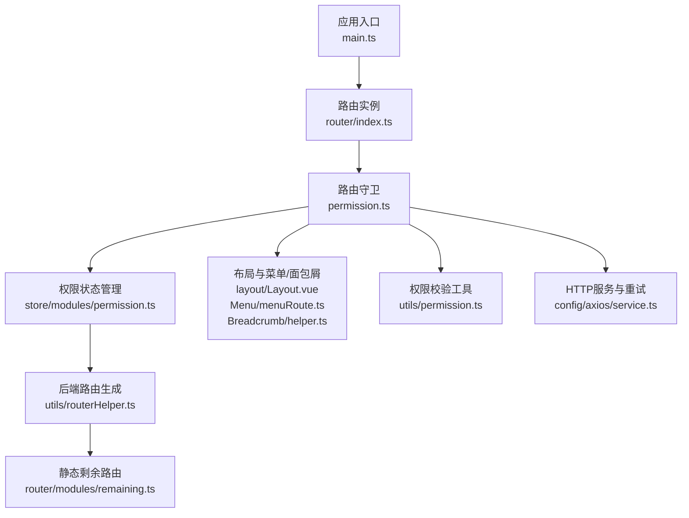
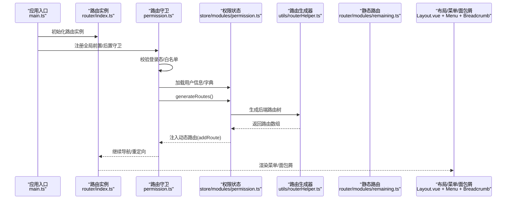
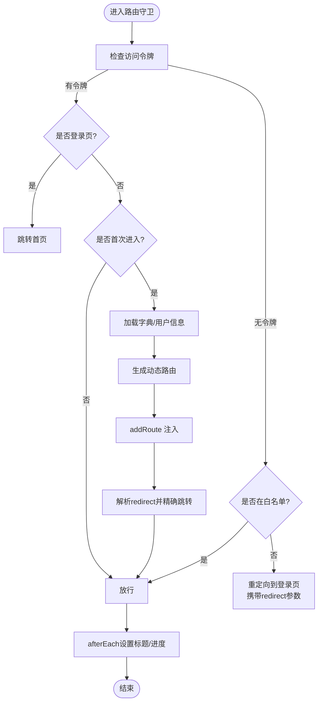
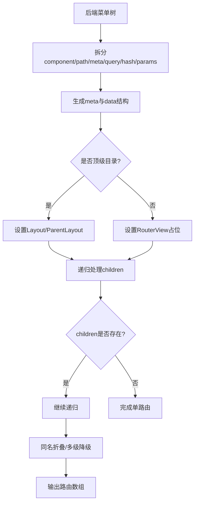
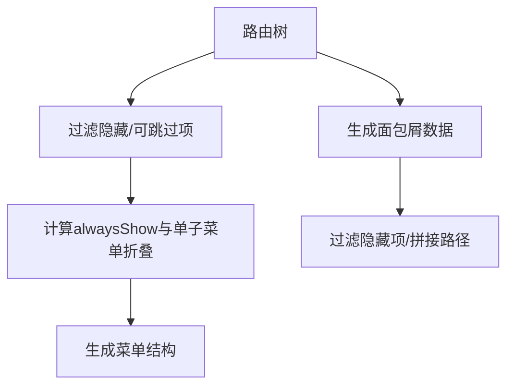
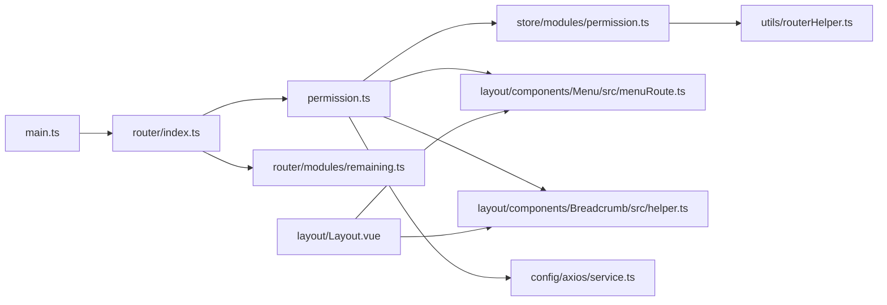

# 路由导航

<cite>
**本文引用的文件**
- [src/router/index.ts](file://yudao-ui/yudao-ui-admin-vue3/src/router/index.ts)
- [src/permission.ts](file://yudao-ui/yudao-ui-admin-vue3/src/permission.ts)
- [src/utils/routerHelper.ts](file://yudao-ui/yudao-ui-admin-vue3/src/utils/routerHelper.ts)
- [src/store/modules/permission.ts](file://yudao-ui/yudao-ui-admin-vue3/src/store/modules/permission.ts)
- [src/router/modules/remaining.ts](file://yudao-ui/yudao-ui-admin-vue3/src/router/modules/remaining.ts)
- [src/layout/Layout.vue](file://yudao-ui/yudao-ui-admin-vue3/src/layout/Layout.vue)
- [src/layout/components/Menu/src/menuRoute.ts](file://yudao-ui/yudao-ui-admin-vue3/src/layout/components/Menu/src/menuRoute.ts)
- [src/layout/components/Breadcrumb/src/helper.ts](file://yudao-ui/yudao-ui-admin-vue3/src/layout/components/Breadcrumb/src/helper.ts)
- [src/utils/permission.ts](file://yudao-ui/yudao-ui-admin-vue3/src/utils/permission.ts)
- [src/main.ts](file://yudao-ui/yudao-ui-admin-vue3/src/main.ts)
- [src/config/axios/service.ts](file://yudao-ui/yudao-ui-admin-vue3/src/config/axios/service.ts)
</cite>

## 目录
1. [简介](#简介)
2. [项目结构](#项目结构)
3. [核心组件](#核心组件)
4. [架构总览](#架构总览)
5. [详细组件分析](#详细组件分析)
6. [依赖关系分析](#依赖关系分析)
7. [性能考量](#性能考量)
8. [故障排查指南](#故障排查指南)
9. [结论](#结论)
10. [附录](#附录)

## 简介
本文件系统性梳理芋道 Ruoyi-Vue-Pro 前端的路由导航体系，覆盖 Vue Router 的配置与使用、嵌套路由与动态路由实现、权限路由设计与守卫、菜单生成与面包屑联动、路由懒加载与代码分割、路由元信息（页面标题、面包屑、权限标识等）、以及最佳实践（路由跳转、参数传递、查询字符串处理）。文档以“可落地”的方式呈现，既适合初学者快速上手，也为进阶开发者提供深入参考。

## 项目结构
围绕路由导航的关键目录与文件如下：
- 路由入口与实例：src/router/index.ts
- 路由守卫与全局前置/后置钩子：src/permission.ts
- 路由工具与后端路由生成：src/utils/routerHelper.ts
- 权限状态管理（动态路由注入、菜单渲染）：src/store/modules/permission.ts
- 静态剩余路由（首页、登录、错误页、业务子模块等）：src/router/modules/remaining.ts
- 布局与菜单/面包屑：src/layout/Layout.vue、src/layout/components/Menu/src/menuRoute.ts、src/layout/components/Breadcrumb/src/helper.ts
- 权限校验工具：src/utils/permission.ts
- 应用挂载与路由初始化：src/main.ts
- 错误处理与重试：src/config/axios/service.ts

**图表来源**
- [src/main.ts:28-78](file://yudao-ui/yudao-ui-admin-vue3/src/main.ts#L28-L78)
- [src/router/index.ts:1-47](file://yudao-ui/yudao-ui-admin-vue3/src/router/index.ts#L1-L47)
- [src/permission.ts:1-79](file://yudao-ui/yudao-ui-admin-vue3/src/permission.ts#L1-L79)
- [src/store/modules/permission.ts:1-80](file://yudao-ui/yudao-ui-admin-vue3/src/store/modules/permission.ts#L1-L80)
- [src/utils/routerHelper.ts:1-373](file://yudao-ui/yudao-ui-admin-vue3/src/utils/routerHelper.ts#L1-L373)
- [src/router/modules/remaining.ts:1-835](file://yudao-ui/yudao-ui-admin-vue3/src/router/modules/remaining.ts#L1-L835)
- [src/layout/Layout.vue:1-84](file://yudao-ui/yudao-ui-admin-vue3/src/layout/Layout.vue#L1-L84)
- [src/layout/components/Menu/src/menuRoute.ts:1-67](file://yudao-ui/yudao-ui-admin-vue3/src/layout/components/Menu/src/menuRoute.ts#L1-L67)
- [src/layout/components/Breadcrumb/src/helper.ts:1-32](file://yudao-ui/yudao-ui-admin-vue3/src/layout/components/Breadcrumb/src/helper.ts#L1-L32)
- [src/utils/permission.ts:1-37](file://yudao-ui/yudao-ui-admin-vue3/src/utils/permission.ts#L1-L37)
- [src/config/axios/service.ts:15-264](file://yudao-ui/yudao-ui-admin-vue3/src/config/axios/service.ts#L15-L264)

**章节来源**
- [src/router/index.ts:1-47](file://yudao-ui/yudao-ui-admin-vue3/src/router/index.ts#L1-L47)
- [src/permission.ts:1-79](file://yudao-ui/yudao-ui-admin-vue3/src/permission.ts#L1-L79)
- [src/utils/routerHelper.ts:1-373](file://yudao-ui/yudao-ui-admin-vue3/src/utils/routerHelper.ts#L1-L373)
- [src/store/modules/permission.ts:1-80](file://yudao-ui/yudao-ui-admin-vue3/src/store/modules/permission.ts#L1-L80)
- [src/router/modules/remaining.ts:1-835](file://yudao-ui/yudao-ui-admin-vue3/src/router/modules/remaining.ts#L1-L835)
- [src/layout/Layout.vue:1-84](file://yudao-ui/yudao-ui-admin-vue3/src/layout/Layout.vue#L1-L84)
- [src/layout/components/Menu/src/menuRoute.ts:1-67](file://yudao-ui/yudao-ui-admin-vue3/src/layout/components/Menu/src/menuRoute.ts#L1-L67)
- [src/layout/components/Breadcrumb/src/helper.ts:1-32](file://yudao-ui/yudao-ui-admin-vue3/src/layout/components/Breadcrumb/src/helper.ts#L1-L32)
- [src/utils/permission.ts:1-37](file://yudao-ui/yudao-ui-admin-vue3/src/utils/permission.ts#L1-L37)
- [src/main.ts:28-78](file://yudao-ui/yudao-ui-admin-vue3/src/main.ts#L28-L78)
- [src/config/axios/service.ts:15-264](file://yudao-ui/yudao-ui-admin-vue3/src/config/axios/service.ts#L15-L264)

## 核心组件
- 路由实例与历史模式：基于 History 模式创建路由实例，统一滚动行为，错误处理自动刷新当前页。
- 路由守卫：全局 beforeEach 控制登录态、字典加载、用户信息与角色路由生成；afterEach 设置页面标题、结束进度与页面加载。
- 动态路由：权限状态管理负责生成后端路由并注入；支持多级路由降级、同名折叠、外链与 IFrame 支持。
- 菜单与面包屑：菜单根据路由生成，支持根菜单识别、动态路径解析；面包屑过滤隐藏项并处理 alwaysShow 与单子菜单折叠。
- 权限校验：指令与工具函数结合，支持字符/角色权限校验。
- 路由懒加载：通过 import.meta.glob 自动收集视图组件，配合 keep-alive 与 noCache 控制缓存。

**章节来源**
- [src/router/index.ts:1-47](file://yudao-ui/yudao-ui-admin-vue3/src/router/index.ts#L1-L47)
- [src/permission.ts:1-79](file://yudao-ui/yudao-ui-admin-vue3/src/permission.ts#L1-L79)
- [src/store/modules/permission.ts:1-80](file://yudao-ui/yudao-ui-admin-vue3/src/store/modules/permission.ts#L1-L80)
- [src/utils/routerHelper.ts:1-373](file://yudao-ui/yudao-ui-admin-vue3/src/utils/routerHelper.ts#L1-L373)
- [src/layout/components/Menu/src/menuRoute.ts:1-67](file://yudao-ui/yudao-ui-admin-vue3/src/layout/components/Menu/src/menuRoute.ts#L1-L67)
- [src/layout/components/Breadcrumb/src/helper.ts:1-32](file://yudao-ui/yudao-ui-admin-vue3/src/layout/components/Breadcrumb/src/helper.ts#L1-L32)
- [src/utils/permission.ts:1-37](file://yudao-ui/yudao-ui-admin-vue3/src/utils/permission.ts#L1-L37)

## 架构总览
下图展示了从应用启动到路由守卫、动态路由生成、菜单/面包屑渲染与权限校验的整体流程。

**图表来源**
- [src/main.ts:28-78](file://yudao-ui/yudao-ui-admin-vue3/src/main.ts#L28-L78)
- [src/router/index.ts:1-47](file://yudao-ui/yudao-ui-admin-vue3/src/router/index.ts#L1-L47)
- [src/permission.ts:1-79](file://yudao-ui/yudao-ui-admin-vue3/src/permission.ts#L1-L79)
- [src/store/modules/permission.ts:1-80](file://yudao-ui/yudao-ui-admin-vue3/src/store/modules/permission.ts#L1-L80)
- [src/utils/routerHelper.ts:1-373](file://yudao-ui/yudao-ui-admin-vue3/src/utils/routerHelper.ts#L1-L373)
- [src/router/modules/remaining.ts:1-835](file://yudao-ui/yudao-ui-admin-vue3/src/router/modules/remaining.ts#L1-L835)
- [src/layout/Layout.vue:1-84](file://yudao-ui/yudao-ui-admin-vue3/src/layout/Layout.vue#L1-L84)

## 详细组件分析

### 路由实例与历史模式
- 基于 History 模式创建路由，支持严格模式与滚动行为统一。
- 错误处理：捕获动态导入失败错误，自动刷新当前路径，提升健壮性。
- 提供 resetRouter：白名单保留关键路由，其余动态路由批量移除，便于登出或切换账号后重置。

**章节来源**
- [src/router/index.ts:1-47](file://yudao-ui/yudao-ui-admin-vue3/src/router/index.ts#L1-L47)

### 路由守卫与权限路由
- 白名单：登录、社交登录、授权回调、绑定、注册等无需登录即可访问。
- 登录态校验：无 Token 则重定向至登录页并携带 redirect 参数。
- 首次进入：加载字典、拉取用户信息、生成动态路由并注入；随后根据 redirect 参数或当前路由进行精准跳转。
- 页面标题与进度：afterEach 中设置页面标题、结束 NProgress 与页面加载动画。
- 登出重置：调用 resetRouter 清理动态路由，保留白名单路由。

**图表来源**
- [src/permission.ts:1-79](file://yudao-ui/yudao-ui-admin-vue3/src/permission.ts#L1-L79)
- [src/store/modules/permission.ts:1-80](file://yudao-ui/yudao-ui-admin-vue3/src/store/modules/permission.ts#L1-L80)
- [src/utils/routeParams.ts](file://yudao-ui/yudao-ui-admin-vue3/src/utils/routeParams.ts)

**章节来源**
- [src/permission.ts:1-79](file://yudao-ui/yudao-ui-admin-vue3/src/permission.ts#L1-L79)
- [src/store/modules/permission.ts:1-80](file://yudao-ui/yudao-ui-admin-vue3/src/store/modules/permission.ts#L1-L80)

### 动态路由与后端路由生成
- 后端路由到前端路由映射：根据后端菜单数据生成路由树，自动处理 component 与 path 解析、meta（title、icon、hidden、noCache、alwaysShow、hash/query/params）。
- 外链与 IFrame：支持外链与 IFrame 嵌入，生成外部父级容器与子路由。
- 顶级目录与非顶级目录：顶级目录承载 Layout，非顶级目录仅占位 RouterView，避免重复渲染顶部与侧边栏。
- 同名折叠：当父子路由同名且仅默认页时折叠为父级组件，减少层级冗余。
- 多级路由降级：扁平化多级路由，保证层级不超过限制。
- 404 路由：动态路由末尾追加 404 页面（可选）。

**图表来源**
- [src/utils/routerHelper.ts:73-220](file://yudao-ui/yudao-ui-admin-vue3/src/utils/routerHelper.ts#L73-L220)
- [src/utils/routerHelper.ts:293-373](file://yudao-ui/yudao-ui-admin-vue3/src/utils/routerHelper.ts#L293-L373)

**章节来源**
- [src/utils/routerHelper.ts:1-373](file://yudao-ui/yudao-ui-admin-vue3/src/utils/routerHelper.ts#L1-L373)
- [src/store/modules/permission.ts:1-80](file://yudao-ui/yudao-ui-admin-vue3/src/store/modules/permission.ts#L1-L80)

### 静态剩余路由与嵌套路由
- 静态剩余路由包含首页、登录、错误页、用户资料、系统字典、代码生成、定时任务、流程管理、支付、AI 等子模块。
- 嵌套路由通过 Layout 包裹，子路由使用 RouterView 渲染；部分顶级目录采用 ParentLayout 避免重复渲染。
- 子路由支持动态参数与查询字符串，配合 meta.params 与 meta.query 使用。

**章节来源**
- [src/router/modules/remaining.ts:1-835](file://yudao-ui/yudao-ui-admin-vue3/src/router/modules/remaining.ts#L1-L835)
- [src/utils/routerHelper.ts:28-37](file://yudao-ui/yudao-ui-admin-vue3/src/utils/routerHelper.ts#L28-L37)

### 菜单生成与面包屑
- 菜单生成：遍历路由树，过滤 meta.hidden 且不可跳过的路由，支持 alwaysShow 与单子菜单折叠。
- 根菜单识别：根据路径前缀匹配，定位当前路由所属根菜单。
- 面包屑：过滤隐藏项，处理单子菜单折叠与路径拼接。

**图表来源**
- [src/layout/components/Menu/src/menuRoute.ts:1-67](file://yudao-ui/yudao-ui-admin-vue3/src/layout/components/Menu/src/menuRoute.ts#L1-L67)
- [src/layout/components/Breadcrumb/src/helper.ts:1-32](file://yudao-ui/yudao-ui-admin-vue3/src/layout/components/Breadcrumb/src/helper.ts#L1-L32)

**章节来源**
- [src/layout/components/Menu/src/menuRoute.ts:1-67](file://yudao-ui/yudao-ui-admin-vue3/src/layout/components/Menu/src/menuRoute.ts#L1-L67)
- [src/layout/components/Breadcrumb/src/helper.ts:1-32](file://yudao-ui/yudao-ui-admin-vue3/src/layout/components/Breadcrumb/src/helper.ts#L1-L32)

### 权限校验与指令
- 字符权限：通过指令与工具函数组合，校验用户是否具备某权限标识。
- 角色权限：支持超级管理员与角色集合校验，结合缓存中的用户信息判断。

**章节来源**
- [src/utils/permission.ts:1-37](file://yudao-ui/yudao-ui-admin-vue3/src/utils/permission.ts#L1-L37)

### 路由懒加载与代码分割
- 视图组件自动收集：通过 import.meta.glob 收集 ../views 下的 *.vue 与 *.tsx 文件，形成异步组件。
- 路由组件懒加载：generateRoute 将后端 component 路径映射到对应异步组件，实现按需加载。
- keep-alive 与 noCache：通过 meta.noCache 控制页面缓存策略，结合 RouterView 实现标签页缓存。

**章节来源**
- [src/utils/routerHelper.ts:13-26](file://yudao-ui/yudao-ui-admin-vue3/src/utils/routerHelper.ts#L13-L26)
- [src/utils/routerHelper.ts:184-190](file://yudao-ui/yudao-ui-admin-vue3/src/utils/routerHelper.ts#L184-L190)

### 路由元信息使用
- 页面标题：afterEach 中读取 meta.title 设置浏览器标题。
- 面包屑：通过 helper 过滤与拼接生成。
- 权限标识：followAuth 用于跟随特定路由进行权限过滤。
- 缓存控制：noCache 控制 keep-alive 缓存。
- 固定标签：affix 控制标签常驻。
- 外链与 IFrame：link/iframeSrc 控制外链与嵌入。

**章节来源**
- [src/permission.ts:74-78](file://yudao-ui/yudao-ui-admin-vue3/src/permission.ts#L74-L78)
- [src/utils/routerHelper.ts:88-118](file://yudao-ui/yudao-ui-admin-vue3/src/utils/routerHelper.ts#L88-L118)

### 最佳实践
- 路由跳转：优先使用命名路由与 params/query，避免硬编码路径。
- 参数传递：利用路由元信息 meta.params 与 resolveDynamicPath 解析动态参数。
- 查询字符串：afterEach 中读取 meta.title，结合 parseRouteLocation 处理 redirect。
- 登出重置：调用 resetRouter 清空动态路由，保留白名单路由。
- 错误恢复：动态导入失败时自动刷新当前路径，提升用户体验。

**章节来源**
- [src/permission.ts:52-60](file://yudao-ui/yudao-ui-admin-vue3/src/permission.ts#L52-L60)
- [src/router/index.ts:22-30](file://yudao-ui/yudao-ui-admin-vue3/src/router/index.ts#L22-L30)
- [src/config/axios/service.ts:15-264](file://yudao-ui/yudao-ui-admin-vue3/src/config/axios/service.ts#L15-L264)

## 依赖关系分析
- 应用入口 main.ts 依赖 router/index.ts 完成路由安装。
- 路由守卫 permission.ts 依赖 store/modules/permission.ts 生成动态路由，并依赖 utils/routeParams.ts 解析重定向。
- 权限状态 permission.ts 依赖 utils/routerHelper.ts 生成路由树。
- 菜单与面包屑依赖 Layout.vue 与 menuRoute.ts、helper.ts。
- HTTP 服务 service.ts 依赖 resetRouter，在鉴权失败时触发路由重置与重新校验。

**图表来源**
- [src/main.ts:28-78](file://yudao-ui/yudao-ui-admin-vue3/src/main.ts#L28-L78)
- [src/router/index.ts:1-47](file://yudao-ui/yudao-ui-admin-vue3/src/router/index.ts#L1-L47)
- [src/permission.ts:1-79](file://yudao-ui/yudao-ui-admin-vue3/src/permission.ts#L1-L79)
- [src/store/modules/permission.ts:1-80](file://yudao-ui/yudao-ui-admin-vue3/src/store/modules/permission.ts#L1-L80)
- [src/utils/routerHelper.ts:1-373](file://yudao-ui/yudao-ui-admin-vue3/src/utils/routerHelper.ts#L1-L373)
- [src/layout/Layout.vue:1-84](file://yudao-ui/yudao-ui-admin-vue3/src/layout/Layout.vue#L1-L84)
- [src/layout/components/Menu/src/menuRoute.ts:1-67](file://yudao-ui/yudao-ui-admin-vue3/src/layout/components/Menu/src/menuRoute.ts#L1-L67)
- [src/layout/components/Breadcrumb/src/helper.ts:1-32](file://yudao-ui/yudao-ui-admin-vue3/src/layout/components/Breadcrumb/src/helper.ts#L1-L32)
- [src/config/axios/service.ts:15-264](file://yudao-ui/yudao-ui-admin-vue3/src/config/axios/service.ts#L15-L264)

**章节来源**
- [src/main.ts:28-78](file://yudao-ui/yudao-ui-admin-vue3/src/main.ts#L28-L78)
- [src/router/index.ts:1-47](file://yudao-ui/yudao-ui-admin-vue3/src/router/index.ts#L1-L47)
- [src/permission.ts:1-79](file://yudao-ui/yudao-ui-admin-vue3/src/permission.ts#L1-L79)
- [src/store/modules/permission.ts:1-80](file://yudao-ui/yudao-ui-admin-vue3/src/store/modules/permission.ts#L1-L80)
- [src/utils/routerHelper.ts:1-373](file://yudao-ui/yudao-ui-admin-vue3/src/utils/routerHelper.ts#L1-L373)
- [src/layout/Layout.vue:1-84](file://yudao-ui/yudao-ui-admin-vue3/src/layout/Layout.vue#L1-L84)
- [src/layout/components/Menu/src/menuRoute.ts:1-67](file://yudao-ui/yudao-ui-admin-vue3/src/layout/components/Menu/src/menuRoute.ts#L1-L67)
- [src/layout/components/Breadcrumb/src/helper.ts:1-32](file://yudao-ui/yudao-ui-admin-vue3/src/layout/components/Breadcrumb/src/helper.ts#L1-L32)
- [src/config/axios/service.ts:15-264](file://yudao-ui/yudao-ui-admin-vue3/src/config/axios/service.ts#L15-L264)

## 性能考量
- 代码分割：通过 import.meta.glob 自动收集视图组件，按需加载，降低首屏体积。
- 路由懒加载：配合 keep-alive 与 noCache 控制缓存命中率，平衡内存占用与交互体验。
- 多级路由降级：flatMultiLevelRoutes 将深层路由扁平化，减少渲染层级与匹配复杂度。
- 动态导入错误恢复：路由 onError 捕获动态导入失败并自动刷新，避免死循环与白屏。
- 滚动行为统一：路由滚动回到顶部，减少跨页面滚动状态干扰。

[本节为通用性能建议，不直接分析具体文件]

## 故障排查指南
- 动态导入失败：当 chunk 哈希变化导致模块加载失败时，路由 onError 会自动刷新当前路径，确保页面可用。
- 登录态异常：若出现无限重定向或无法进入系统，检查白名单配置与 redirect 参数解析逻辑。
- 菜单不显示：确认 meta.hidden 与 canTo 配置，以及 alwaysShow 与单子菜单折叠规则。
- 外链/IFrame 无法打开：核对 meta.link 与 meta.iframeSrc 的设置，确保路径正确。
- 登出后仍可见动态路由：确认 resetRouter 是否被调用，以及白名单路由是否正确保留。

**章节来源**
- [src/router/index.ts:22-30](file://yudao-ui/yudao-ui-admin-vue3/src/router/index.ts#L22-L30)
- [src/permission.ts:66-71](file://yudao-ui/yudao-ui-admin-vue3/src/permission.ts#L66-L71)
- [src/layout/components/Menu/src/menuRoute.ts:40-67](file://yudao-ui/yudao-ui-admin-vue3/src/layout/components/Menu/src/menuRoute.ts#L40-L67)
- [src/store/modules/permission.ts:32-36](file://yudao-ui/yudao-ui-admin-vue3/src/store/modules/permission.ts#L32-L36)
- [src/config/axios/service.ts:15-264](file://yudao-ui/yudao-ui-admin-vue3/src/config/axios/service.ts#L15-L264)

## 结论
本项目采用“静态剩余路由 + 后端动态路由”的混合方案，结合完善的路由守卫、菜单/面包屑生成与权限校验机制，实现了灵活、安全、可维护的路由导航体系。通过代码分割与错误恢复策略，兼顾了性能与稳定性。建议在扩展新模块时遵循现有约定（命名、meta 配置、动态路由注入流程），以保持一致性与可演进性。

[本节为总结性内容，不直接分析具体文件]

## 附录
- 关键文件清单与职责概览
  - router/index.ts：路由实例、历史模式、滚动行为、错误处理、resetRouter
  - permission.ts：全局守卫、登录态校验、动态路由注入、标题与进度
  - utils/routerHelper.ts：后端路由生成、外链/IFrame、多级路由降级、同名折叠
  - store/modules/permission.ts：动态路由存储、菜单渲染、404 路由
  - router/modules/remaining.ts：首页、登录、错误页、业务子模块等静态路由
  - layout/Layout.vue、Menu/menuRoute.ts、Breadcrumb/helper.ts：布局与菜单/面包屑
  - utils/permission.ts：权限校验工具
  - main.ts：应用挂载与路由初始化
  - config/axios/service.ts：错误处理与重试，触发路由重置

[本节为概览性内容，不直接分析具体文件]