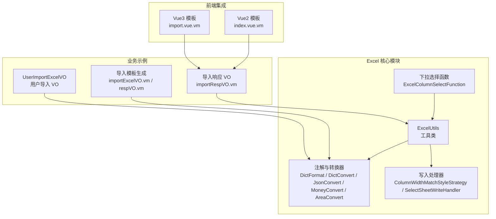
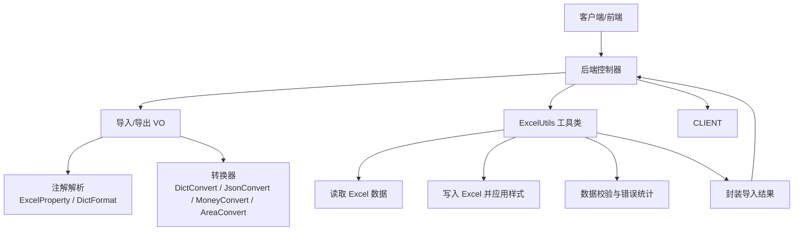
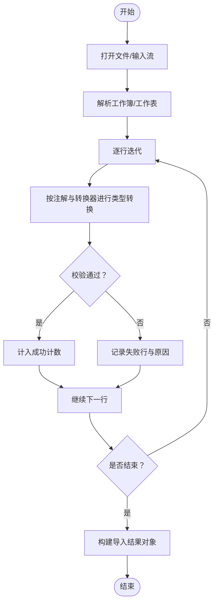
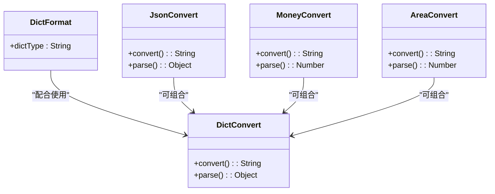
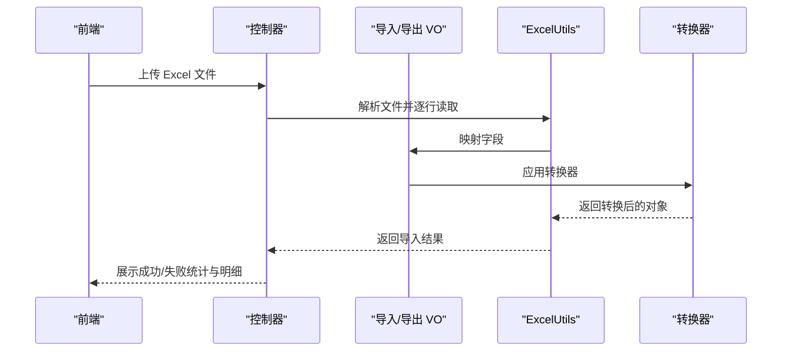
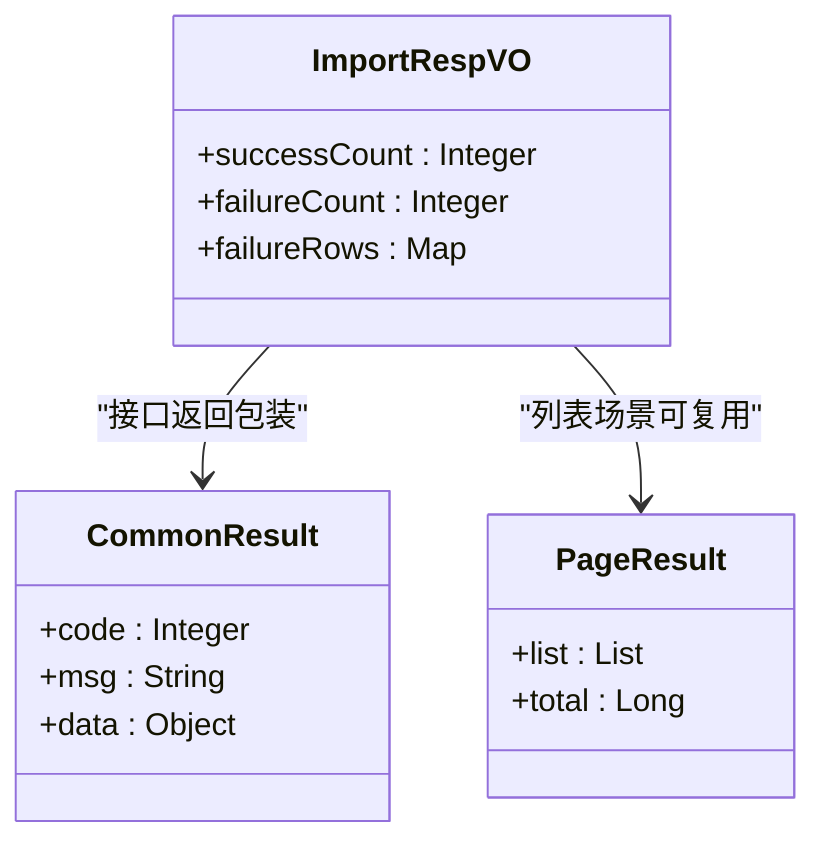
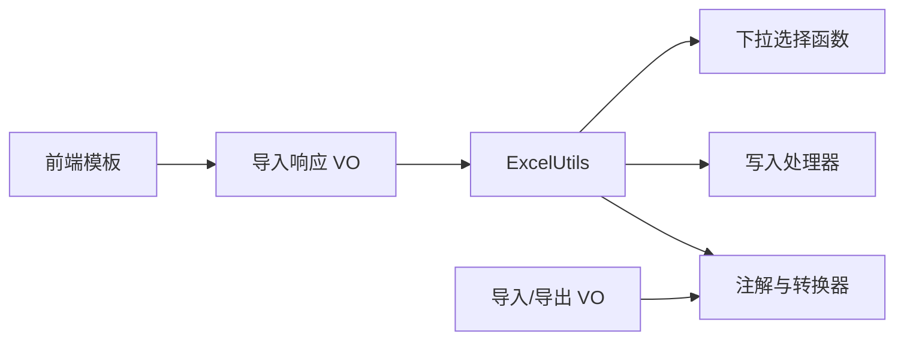

# Excel 处理组件

<cite>
**本文引用的文件**
- [ExcelUtils.java](file://yudao-framework/yudao-spring-boot-starter-excel/src/main/java/cn/iocoder/yudao/framework/excel/core/util/ExcelUtils.java)
- [ExcelColumnSelect.java](file://yudao-framework/yudao-spring-boot-starter-excel/src/main/java/cn/iocoder/yudao/framework/excel/core/annotations/ExcelColumnSelect.java)
- [ExcelColumnSelectFunction.java](file://yudao-framework/yudao-spring-boot-starter-excel/src/main/java/cn/iocoder/yudao/framework/excel/core/function/ExcelColumnSelectFunction.java)
- [DictFormat.java](file://yudao-framework/yudao-spring-boot-starter-excel/src/main/java/cn/iocoder/yudao/framework/excel/core/annotations/DictFormat.java)
- [DictConvert.java](file://yudao-framework/yudao-spring-boot-starter-excel/src/main/java/cn/iocoder/yudao/framework/excel/core/convert/DictConvert.java)
- [JsonConvert.java](file://yudao-framework/yudao-spring-boot-starter-excel/src/main/java/cn/iocoder/yudao/framework/excel/core/convert/JsonConvert.java)
- [MoneyConvert.java](file://yudao-framework/yudao-spring-boot-starter-excel/src/main/java/cn/iocoder/yudao/framework/excel/core/convert/MoneyConvert.java)
- [AreaConvert.java](file://yudao-framework/yudao-spring-boot-starter-excel/src/main/java/cn/iocoder/yudao/framework/excel/core/convert/AreaConvert.java)
- [ColumnWidthMatchStyleStrategy.java](file://yudao-framework/yudao-spring-boot-starter-excel/src/main/java/cn/iocoder/yudao/framework/excel/core/handler/ColumnWidthMatchStyleStrategy.java)
- [SelectSheetWriteHandler.java](file://yudao-framework/yudao-spring-boot-starter-excel/src/main/java/cn/iocoder/yudao/framework/excel/core/handler/SelectSheetWriteHandler.java)
- [UserImportExcelVO.java](file://yudao-module-system/src/main/java/cn/iocoder/yudao/module/system/controller/admin/user/vo/user/UserImportExcelVO.java)
- [importExcelVO.vm](file://yudao-module-infra/src/main/resources/codegen/java/controller/vo/importExcelVO.vm)
- [respVO.vm](file://yudao-module-infra/src/main/resources/codegen/java/controller/vo/respVO.vm)
- [importRespVO.vm](file://yudao-module-infra/src/main/resources/codegen/java/controller/vo/importRespVO.vm)
- [CommonResult.java](file://yudao-framework/yudao-common/src/main/java/cn/iocoder/yudao/framework/common/pojo/CommonResult.java)
- [PageResult.java](file://yudao-framework/yudao-common/src/main/java/cn/iocoder/yudao/framework/common/pojo/PageResult.java)
- [import.vue.vm](file://yudao-module-infra/src/main/resources/codegen/vue3_vben5_ele/general/views/import.vue.vm)
- [index.vue.vm](file://yudao-module-infra/src/main/resources/codegen/vue/views/index.vue.vm)
</cite>

## 目录
1. [简介](#简介)
2. [项目结构](#项目结构)
3. [核心组件](#核心组件)
4. [架构总览](#架构总览)
5. [详细组件分析](#详细组件分析)
6. [依赖关系分析](#依赖关系分析)
7. [性能考虑](#性能考虑)
8. [故障排查指南](#故障排查指南)
9. [结论](#结论)
10. [附录](#附录)

## 简介
本文件系统性阐述 Excel 处理组件的实现原理与使用方法，覆盖导入导出全流程：模板设计、数据验证、批量处理、工具类能力、VO 使用方式、结果封装机制、模板设计规范以及与 Spring Boot 的集成配置。目标是帮助开发者快速上手并稳定落地各类 Excel 场景，如用户批量导入、商品数据更新、报表数据导出等。

## 项目结构
Excel 处理组件主要分布在以下模块与目录：
- 核心工具与注解：yudao-spring-boot-starter-excel 模块下的 excel/core
- 业务示例 VO：yudao-module-system 中的用户导入 VO
- 代码生成模板：yudao-module-infra 中的 VO 与前端导入页面模板
- 通用返回体：yudao-common 中的统一响应封装

图表来源
- [ExcelUtils.java:1-200](file://yudao-framework/yudao-spring-boot-starter-excel/src/main/java/cn/iocoder/yudao/framework/excel/core/util/ExcelUtils.java#L1-L200)
- [DictFormat.java:1-200](file://yudao-framework/yudao-spring-boot-starter-excel/src/main/java/cn/iocoder/yudao/framework/excel/core/annotations/DictFormat.java#L1-L200)
- [DictConvert.java:1-200](file://yudao-framework/yudao-spring-boot-starter-excel/src/main/java/cn/iocoder/yudao/framework/excel/core/convert/DictConvert.java#L1-L200)
- [UserImportExcelVO.java:1-200](file://yudao-module-system/src/main/java/cn/iocoder/yudao/module/system/controller/admin/user/vo/user/UserImportExcelVO.java#L1-L200)
- [importExcelVO.vm:1-50](file://yudao-module-infra/src/main/resources/codegen/java/controller/vo/importExcelVO.vm#L1-L50)
- [respVO.vm:1-60](file://yudao-module-infra/src/main/resources/codegen/java/controller/vo/respVO.vm#L1-L60)
- [import.vue.vm:40-80](file://yudao-module-infra/src/main/resources/codegen/vue3_vben5_ele/general/views/import.vue.vm#L40-L80)
- [index.vue.vm:340-385](file://yudao-module-infra/src/main/resources/codegen/vue/views/index.vue.vm#L340-L385)

章节来源
- [ExcelUtils.java:1-200](file://yudao-framework/yudao-spring-boot-starter-excel/src/main/java/cn/iocoder/yudao/framework/excel/core/util/ExcelUtils.java#L1-L200)
- [UserImportExcelVO.java:1-200](file://yudao-module-system/src/main/java/cn/iocoder/yudao/module/system/controller/admin/user/vo/user/UserImportExcelVO.java#L1-L200)

## 核心组件
- ExcelUtils 工具类：提供文件读取、数据转换、错误处理与结果统计等核心能力，支持导入与导出流程的统一封装。
- 注解与转换器：通过注解声明字段含义，结合转换器完成类型转换与格式化，如字典值、JSON、金额、地区等。
- 写入处理器：在导出时自动适配列宽与样式，提升可读性与一致性。
- 下拉选择函数：用于生成导出模板中的下拉选项，便于用户正确填写。
- VO 与模板：通过代码生成器自动生成导入/导出 VO 与前端导入页面，保证一致性与可维护性。
- 统一响应：使用 CommonResult/PageResult 封装接口返回，导入响应使用专用 ImportRespVO。

章节来源
- [ExcelUtils.java:1-200](file://yudao-framework/yudao-spring-boot-starter-excel/src/main/java/cn/iocoder/yudao/framework/excel/core/util/ExcelUtils.java#L1-L200)
- [DictFormat.java:1-200](file://yudao-framework/yudao-spring-boot-starter-excel/src/main/java/cn/iocoder/yudao/framework/excel/core/annotations/DictFormat.java#L1-L200)
- [DictConvert.java:1-200](file://yudao-framework/yudao-spring-boot-starter-excel/src/main/java/cn/iocoder/yudao/framework/excel/core/convert/DictConvert.java#L1-L200)
- [JsonConvert.java:1-200](file://yudao-framework/yudao-spring-boot-starter-excel/src/main/java/cn/iocoder/yudao/framework/excel/core/convert/JsonConvert.java#L1-L200)
- [MoneyConvert.java:1-200](file://yudao-framework/yudao-spring-boot-starter-excel/src/main/java/cn/iocoder/yudao/framework/excel/core/convert/MoneyConvert.java#L1-L200)
- [AreaConvert.java:1-200](file://yudao-framework/yudao-spring-boot-starter-excel/src/main/java/cn/iocoder/yudao/framework/excel/core/convert/AreaConvert.java#L1-L200)
- [ColumnWidthMatchStyleStrategy.java:1-200](file://yudao-framework/yudao-spring-boot-starter-excel/src/main/java/cn/iocoder/yudao/framework/excel/core/handler/ColumnWidthMatchStyleStrategy.java#L1-L200)
- [SelectSheetWriteHandler.java:1-200](file://yudao-framework/yudao-spring-boot-starter-excel/src/main/java/cn/iocoder/yudao/framework/excel/core/handler/SelectSheetWriteHandler.java#L1-L200)
- [ExcelColumnSelectFunction.java:1-200](file://yudao-framework/yudao-spring-boot-starter-excel/src/main/java/cn/iocoder/yudao/framework/excel/core/function/ExcelColumnSelectFunction.java#L1-L200)
- [CommonResult.java:1-200](file://yudao-framework/yudao-common/src/main/java/cn/iocoder/yudao/framework/common/pojo/CommonResult.java#L1-L200)
- [PageResult.java:1-200](file://yudao-framework/yudao-common/src/main/java/cn/iocoder/yudao/framework/common/pojo/PageResult.java#L1-L200)

## 架构总览
Excel 处理组件采用“注解驱动 + 转换器 + 工具类 + 模板生成”的分层架构，贯穿导入、导出与前端交互的完整链路。

图表来源
- [ExcelUtils.java:1-200](file://yudao-framework/yudao-spring-boot-starter-excel/src/main/java/cn/iocoder/yudao/framework/excel/core/util/ExcelUtils.java#L1-L200)
- [DictFormat.java:1-200](file://yudao-framework/yudao-spring-boot-starter-excel/src/main/java/cn/iocoder/yudao/framework/excel/core/annotations/DictFormat.java#L1-L200)
- [DictConvert.java:1-200](file://yudao-framework/yudao-spring-boot-starter-excel/src/main/java/cn/iocoder/yudao/framework/excel/core/convert/DictConvert.java#L1-L200)
- [UserImportExcelVO.java:1-200](file://yudao-module-system/src/main/java/cn/iocoder/yudao/module/system/controller/admin/user/vo/user/UserImportExcelVO.java#L1-L200)

## 详细组件分析

### ExcelUtils 工具类
- 文件读取：支持从输入流读取 Excel，自动识别工作簿与工作表，按行解析数据。
- 数据转换：结合注解与转换器，将字符串或基础类型转换为目标 Java 类型，并进行格式化。
- 错误处理：捕获解析异常，记录失败行号与原因，避免中断整体流程。
- 结果统计：统计成功数、失败数与失败行明细，形成结构化导入结果。
- 导出能力：支持写入数据、自动列宽匹配与样式策略，输出标准 Excel 文件。

图表来源
- [ExcelUtils.java:1-200](file://yudao-framework/yudao-spring-boot-starter-excel/src/main/java/cn/iocoder/yudao/framework/excel/core/util/ExcelUtils.java#L1-L200)

章节来源
- [ExcelUtils.java:1-200](file://yudao-framework/yudao-spring-boot-starter-excel/src/main/java/cn/iocoder/yudao/framework/excel/core/util/ExcelUtils.java#L1-L200)

### 注解与转换器体系
- 注解驱动：通过 ExcelProperty 声明字段标题，DictFormat 指定字典格式化策略。
- 转换器：DictConvert 将字典值与编码互转；JsonConvert 支持 JSON 字符串与对象互转；MoneyConvert 处理金额；AreaConvert 处理地区编码。
- 列宽与样式：ColumnWidthMatchStyleStrategy 自动适配列宽；SelectSheetWriteHandler 提供下拉选择写入能力。

图表来源
- [DictFormat.java:1-200](file://yudao-framework/yudao-spring-boot-starter-excel/src/main/java/cn/iocoder/yudao/framework/excel/core/annotations/DictFormat.java#L1-L200)
- [DictConvert.java:1-200](file://yudao-framework/yudao-spring-boot-starter-excel/src/main/java/cn/iocoder/yudao/framework/excel/core/convert/DictConvert.java#L1-L200)
- [JsonConvert.java:1-200](file://yudao-framework/yudao-spring-boot-starter-excel/src/main/java/cn/iocoder/yudao/framework/excel/core/convert/JsonConvert.java#L1-L200)
- [MoneyConvert.java:1-200](file://yudao-framework/yudao-spring-boot-starter-excel/src/main/java/cn/iocoder/yudao/framework/excel/core/convert/MoneyConvert.java#L1-L200)
- [AreaConvert.java:1-200](file://yudao-framework/yudao-spring-boot-starter-excel/src/main/java/cn/iocoder/yudao/framework/excel/core/convert/AreaConvert.java#L1-L200)

章节来源
- [DictFormat.java:1-200](file://yudao-framework/yudao-spring-boot-starter-excel/src/main/java/cn/iocoder/yudao/framework/excel/core/annotations/DictFormat.java#L1-L200)
- [DictConvert.java:1-200](file://yudao-framework/yudao-spring-boot-starter-excel/src/main/java/cn/iocoder/yudao/framework/excel/core/convert/DictConvert.java#L1-L200)
- [JsonConvert.java:1-200](file://yudao-framework/yudao-spring-boot-starter-excel/src/main/java/cn/iocoder/yudao/framework/excel/core/convert/JsonConvert.java#L1-L200)
- [MoneyConvert.java:1-200](file://yudao-framework/yudao-spring-boot-starter-excel/src/main/java/cn/iocoder/yudao/framework/excel/core/convert/MoneyConvert.java#L1-L200)
- [AreaConvert.java:1-200](file://yudao-framework/yudao-spring-boot-starter-excel/src/main/java/cn/iocoder/yudao/framework/excel/core/convert/AreaConvert.java#L1-L200)

### ExcelImportVO 与 ExcelExportVO 使用方式
- 字段映射：通过 ExcelProperty 声明字段标题，确保模板表头与实体一致。
- 类型转换：结合转换器完成基础类型、字典、JSON、金额、地区等复杂类型的双向转换。
- 格式化规则：使用 DictFormat 等注解控制展示与回显格式，保证一致性。
- 代码生成：通过 importExcelVO.vm 与 respVO.vm 自动生成导入/导出 VO，减少手工维护成本。

图表来源
- [UserImportExcelVO.java:1-200](file://yudao-module-system/src/main/java/cn/iocoder/yudao/module/system/controller/admin/user/vo/user/UserImportExcelVO.java#L1-L200)
- [importExcelVO.vm:1-50](file://yudao-module-infra/src/main/resources/codegen/java/controller/vo/importExcelVO.vm#L1-L50)
- [respVO.vm:1-60](file://yudao-module-infra/src/main/resources/codegen/java/controller/vo/respVO.vm#L1-L60)
- [ExcelUtils.java:1-200](file://yudao-framework/yudao-spring-boot-starter-excel/src/main/java/cn/iocoder/yudao/framework/excel/core/util/ExcelUtils.java#L1-L200)

章节来源
- [UserImportExcelVO.java:1-200](file://yudao-module-system/src/main/java/cn/iocoder/yudao/module/system/controller/admin/user/vo/user/UserImportExcelVO.java#L1-L200)
- [importExcelVO.vm:1-50](file://yudao-module-infra/src/main/resources/codegen/java/controller/vo/importExcelVO.vm#L1-L50)
- [respVO.vm:1-60](file://yudao-module-infra/src/main/resources/codegen/java/controller/vo/respVO.vm#L1-L60)

### ExcelResult 结果封装机制
- 成功记录：统计成功导入条数，用于前端提示与后续处理。
- 失败记录：以行号为键、失败原因为值的映射，便于定位问题。
- 错误信息收集：统一收集解析异常、校验失败等信息，形成结构化反馈。
- 响应模型：使用 importRespVO.vm 生成导入响应 VO，字段包含 successCount、failureCount、failureRows。

图表来源
- [importRespVO.vm:1-23](file://yudao-module-infra/src/main/resources/codegen/java/controller/vo/importRespVO.vm#L1-L23)
- [CommonResult.java:1-200](file://yudao-framework/yudao-common/src/main/java/cn/iocoder/yudao/framework/common/pojo/CommonResult.java#L1-L200)
- [PageResult.java:1-200](file://yudao-framework/yudao-common/src/main/java/cn/iocoder/yudao/framework/common/pojo/PageResult.java#L1-L200)

章节来源
- [importRespVO.vm:1-23](file://yudao-module-infra/src/main/resources/codegen/java/controller/vo/importRespVO.vm#L1-L23)
- [CommonResult.java:1-200](file://yudao-framework/yudao-common/src/main/java/cn/iocoder/yudao/framework/common/pojo/CommonResult.java#L1-L200)
- [PageResult.java:1-200](file://yudao-framework/yudao-common/src/main/java/cn/iocoder/yudao/framework/common/pojo/PageResult.java#L1-L200)

### Excel 模板设计规范
- 表头定义：使用 ExcelProperty 的 value 声明表头名称，确保与 VO 字段一一对应。
- 数据类型约束：通过转换器对日期、金额、字典、JSON 等进行约束与格式化。
- 校验规则：在服务端进行必填、范围、格式等校验，失败行号与原因回传给前端。
- 下拉选择：使用 ExcelColumnSelect 与 ExcelColumnSelectFunction 生成下拉选项，降低录入误差。
- 列宽与样式：导出时应用 ColumnWidthMatchStyleStrategy，保证表格整洁易读。

章节来源
- [ExcelColumnSelect.java:1-200](file://yudao-framework/yudao-spring-boot-starter-excel/src/main/java/cn/iocoder/yudao/framework/excel/core/annotations/ExcelColumnSelect.java#L1-L200)
- [ExcelColumnSelectFunction.java:1-200](file://yudao-framework/yudao-spring-boot-starter-excel/src/main/java/cn/iocoder/yudao/framework/excel/core/function/ExcelColumnSelectFunction.java#L1-L200)
- [ColumnWidthMatchStyleStrategy.java:1-200](file://yudao-framework/yudao-spring-boot-starter-excel/src/main/java/cn/iocoder/yudao/framework/excel/core/handler/ColumnWidthMatchStyleStrategy.java#L1-L200)

### 实际业务应用场景
- 用户批量导入：通过 UserImportExcelVO 定义用户字段，ExcelUtils 批量读取并校验，最终返回导入结果。
- 商品数据更新：基于代码生成器生成的导入/导出 VO，结合转换器完成价格、库存、分类等字段的导入。
- 报表数据导出：使用导出 VO 与注解标注字段，ExcelUtils 写入数据并应用样式策略，提升可读性。

章节来源
- [UserImportExcelVO.java:1-200](file://yudao-module-system/src/main/java/cn/iocoder/yudao/module/system/controller/admin/user/vo/user/UserImportExcelVO.java#L1-L200)
- [import.vue.vm:40-80](file://yudao-module-infra/src/main/resources/codegen/vue3_vben5_ele/general/views/import.vue.vm#L40-L80)
- [index.vue.vm:340-385](file://yudao-module-infra/src/main/resources/codegen/vue/views/index.vue.vm#L340-L385)

### 与 Spring Boot 的集成方式与配置选项
- 自动装配：通过 starter 模块引入，自动注册 Excel 相关的注解、转换器与处理器。
- 控制器集成：在控制器中接收 MultipartFile，调用 ExcelUtils 进行解析与处理。
- 响应封装：使用 CommonResult 包装导入结果，前端统一处理 successCount、failureCount、failureRows。
- 模板下载：提供模板下载接口，前端可直接下载标准模板，减少手工维护成本。

章节来源
- [CommonResult.java:1-200](file://yudao-framework/yudao-common/src/main/java/cn/iocoder/yudao/framework/common/pojo/CommonResult.java#L1-L200)
- [import.vue.vm:40-80](file://yudao-module-infra/src/main/resources/codegen/vue3_vben5_ele/general/views/import.vue.vm#L40-L80)
- [index.vue.vm:340-385](file://yudao-module-infra/src/main/resources/codegen/vue/views/index.vue.vm#L340-L385)

## 依赖关系分析
Excel 处理组件内部依赖清晰，职责边界明确：
- ExcelUtils 依赖注解与转换器完成数据解析与转换。
- 注解与转换器之间通过 DictFormat 等注解协同工作。
- 写入处理器与下拉选择函数为导出流程提供增强能力。
- 前端模板与控制器通过 VO 与响应模型对接，形成闭环。

图表来源
- [ExcelUtils.java:1-200](file://yudao-framework/yudao-spring-boot-starter-excel/src/main/java/cn/iocoder/yudao/framework/excel/core/util/ExcelUtils.java#L1-L200)
- [DictFormat.java:1-200](file://yudao-framework/yudao-spring-boot-starter-excel/src/main/java/cn/iocoder/yudao/framework/excel/core/annotations/DictFormat.java#L1-L200)
- [DictConvert.java:1-200](file://yudao-framework/yudao-spring-boot-starter-excel/src/main/java/cn/iocoder/yudao/framework/excel/core/convert/DictConvert.java#L1-L200)
- [ColumnWidthMatchStyleStrategy.java:1-200](file://yudao-framework/yudao-spring-boot-starter-excel/src/main/java/cn/iocoder/yudao/framework/excel/core/handler/ColumnWidthMatchStyleStrategy.java#L1-L200)
- [ExcelColumnSelectFunction.java:1-200](file://yudao-framework/yudao-spring-boot-starter-excel/src/main/java/cn/iocoder/yudao/framework/excel/core/function/ExcelColumnSelectFunction.java#L1-L200)
- [importRespVO.vm:1-23](file://yudao-module-infra/src/main/resources/codegen/java/controller/vo/importRespVO.vm#L1-L23)
- [import.vue.vm:40-80](file://yudao-module-infra/src/main/resources/codegen/vue3_vben5_ele/general/views/import.vue.vm#L40-L80)

章节来源
- [ExcelUtils.java:1-200](file://yudao-framework/yudao-spring-boot-starter-excel/src/main/java/cn/iocoder/yudao/framework/excel/core/util/ExcelUtils.java#L1-L200)
- [importRespVO.vm:1-23](file://yudao-module-infra/src/main/resources/codegen/java/controller/vo/importRespVO.vm#L1-L23)

## 性能考虑
- 流式读取：优先使用流式读取避免大文件内存溢出。
- 批量处理：分批提交数据库，控制事务大小，提升吞吐量。
- 列宽计算：仅在必要时计算列宽，避免对大数据集造成额外开销。
- 缓存策略：对字典、枚举等静态数据进行缓存，减少重复查询。
- 并发控制：限制并发导入任务数量，防止资源争用。

## 故障排查指南
- 解析异常：检查文件格式与表头是否与 VO 一致，确认转换器是否正确配置。
- 校验失败：查看 failureRows 中的行号与原因，逐项修正数据。
- 导入无响应：确认前端上传文件大小限制与后端接收参数配置。
- 模板不匹配：核对 ExcelProperty 与模板表头，确保字段顺序与类型一致。
- 样式异常：检查 ColumnWidthMatchStyleStrategy 是否生效，确认字体与列宽设置。

章节来源
- [ExcelUtils.java:1-200](file://yudao-framework/yudao-spring-boot-starter-excel/src/main/java/cn/iocoder/yudao/framework/excel/core/util/ExcelUtils.java#L1-L200)
- [importRespVO.vm:1-23](file://yudao-module-infra/src/main/resources/codegen/java/controller/vo/importRespVO.vm#L1-L23)

## 结论
Excel 处理组件通过注解驱动、转换器与工具类的协作，实现了从模板设计、数据验证到批量处理与结果封装的完整闭环。结合代码生成器与前端模板，能够高效支撑用户批量导入、商品数据更新、报表导出等常见业务场景。建议在生产环境中关注性能与稳定性，合理配置并发与缓存策略，确保高并发下的可靠运行。

## 附录
- 快速上手清单
  - 在业务模块中定义导入/导出 VO，使用 ExcelProperty 声明表头。
  - 配置转换器，确保复杂类型正确转换。
  - 使用 ExcelUtils 进行解析与校验，返回导入结果。
  - 前端下载模板并上传，展示导入统计与失败明细。
- 最佳实践
  - 保持表头与 VO 字段一致，避免手动维护。
  - 对关键字段增加必填与范围校验，失败行号回传给前端。
  - 大数据量场景采用流式读取与分批提交，控制事务大小。
  - 使用 ColumnWidthMatchStyleStrategy 保证导出表格可读性。