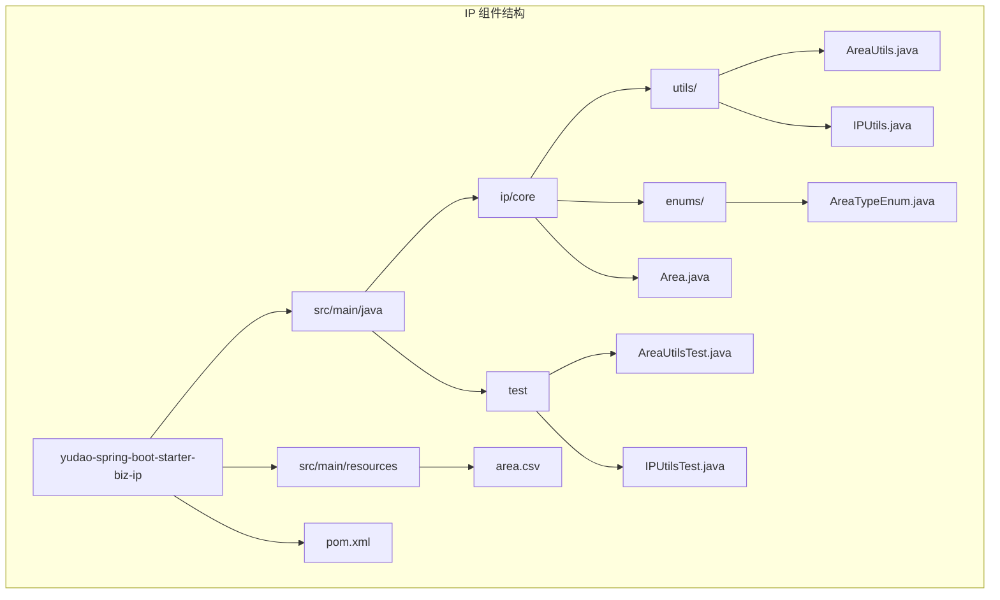
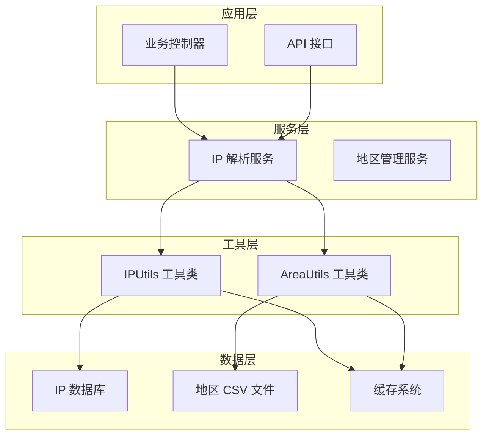
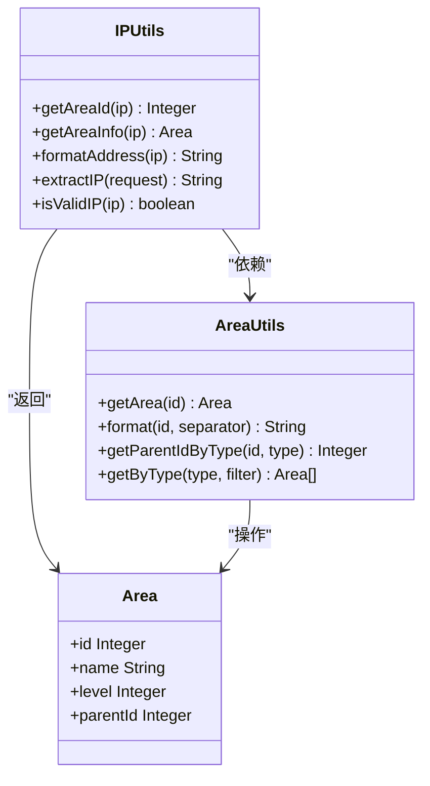
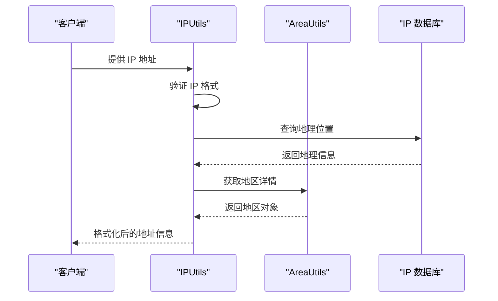
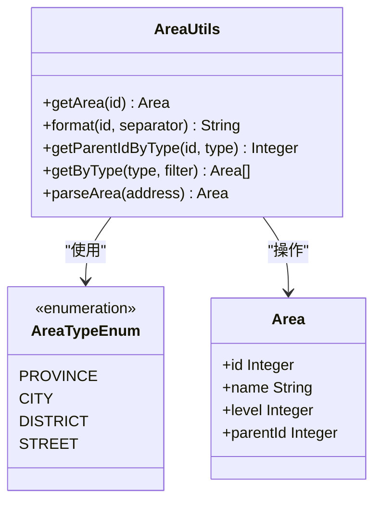
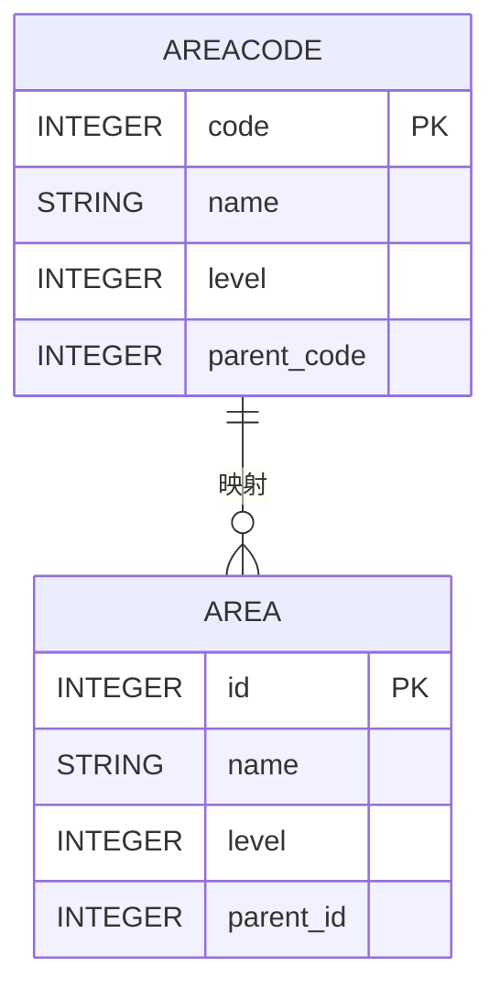
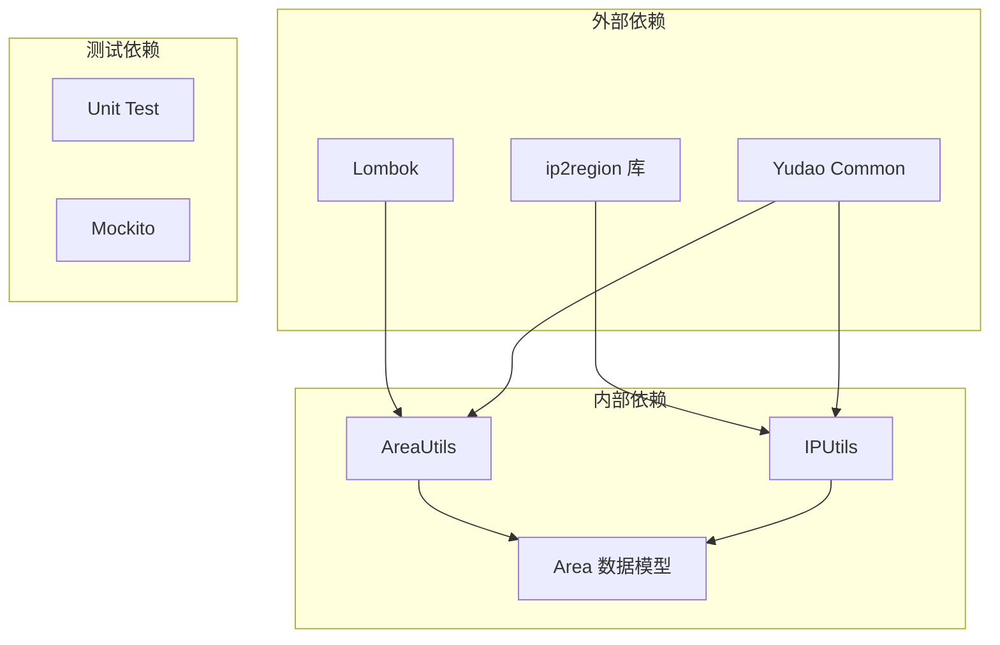
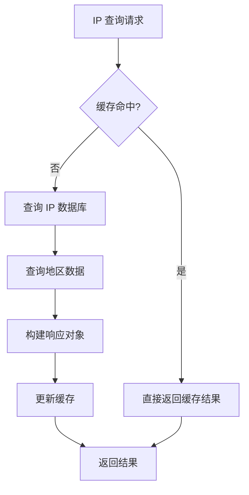

# IP 地址组件

<cite>
**本文档引用的文件**
- [pom.xml](file://yudao-framework/yudao-spring-boot-starter-biz-ip/pom.xml)
- [AreaUtils.java](file://yudao-framework/yudao-spring-boot-starter-biz-ip/src/main/java/cn/iocoder/yudao/framework/ip/core/utils/AreaUtils.java)
- [IPUtils.java](file://yudao-framework/yudao-spring-boot-starter-biz-ip/src/main/java/cn/iocoder/yudao/framework/ip/core/utils/IPUtils.java)
- [AreaTypeEnum.java](file://yudao-framework/yudao-spring-boot-starter-biz-ip/src/main/java/cn/iocoder/yudao/framework/ip/core/enums/AreaTypeEnum.java)
- [Area.java](file://yudao-framework/yudao-spring-boot-starter-biz-ip/src/main/java/cn/iocoder/yudao/framework/ip/core/Area.java)
- [area.csv](file://yudao-framework/yudao-spring-boot-starter-biz-ip/src/main/resources/area.csv)
- [AreaUtilsTest.java](file://yudao-framework/yudao-spring-boot-starter-biz-ip/src/test/java/cn/iocoder/yudao/framework/ip/core/utils/AreaUtilsTest.java)
- [IPUtilsTest.java](file://yudao-framework/yudao-spring-boot-starter-biz-ip/src/test/java/cn/iocoder/yudao/framework/ip/core/utils/IPUtilsTest.java)
- [ExcelUtil.java](file://yudao-framework/yudao-spring-boot-starter-excel/src/main/java/cn/iocoder/yudao/framework/excel/util/ExcelUtil.java)
</cite>

## 目录
1. [简介](#简介)
2. [项目结构](#项目结构)
3. [核心组件](#核心组件)
4. [架构概览](#架构概览)
5. [详细组件分析](#详细组件分析)
6. [依赖分析](#依赖分析)
7. [性能考虑](#性能考虑)
8. [故障排除指南](#故障排除指南)
9. [结论](#结论)
10. [附录](#附录)

## 简介

IP 地址组件是基于 RuoYi Vue Pro 框架开发的一套完整的 IP 地址解析和地理位置查询解决方案。该组件提供了以下核心功能：

- **IP 地址解析**：基于 ip2region 库实现的高性能 IP 地址定位服务
- **地理位置查询**：支持 IPv4 和 IPv6 地址的精确地理位置查询
- **地址格式化**：提供多种格式化的地理位置输出方式
- **地区编码系统**：基于中华人民共和国行政区划代码的完整地区管理
- **区域树构建**：支持地区层级关系查询和区域树构建
- **缓存优化**：内置智能缓存机制提升查询性能

该组件采用模块化设计，通过 Maven 依赖管理集成到主项目中，为用户登录位置记录、访问来源分析、风控策略触发等业务场景提供强有力的技术支撑。

## 项目结构

IP 地址组件采用标准的 Maven 项目结构，主要包含以下目录和文件：



**图表来源**
- [pom.xml:1-38](file://yudao-framework/yudao-spring-boot-starter-biz-ip/pom.xml#L1-L38)
- [AreaUtils.java:1-200](file://yudao-framework/yudao-spring-boot-starter-biz-ip/src/main/java/cn/iocoder/yudao/framework/ip/core/utils/AreaUtils.java#L1-L200)
- [IPUtils.java:1-100](file://yudao-framework/yudao-spring-boot-starter-biz-ip/src/main/java/cn/iocoder/yudao/framework/ip/core/utils/IPUtils.java#L1-L100)

**章节来源**
- [pom.xml:1-38](file://yudao-framework/yudao-spring-boot-starter-biz-ip/pom.xml#L1-L38)

## 核心组件

IP 地址组件包含三个核心类，每个类都承担着特定的功能职责：

### IPUtils 工具类
IPUtils 是整个组件的核心工具类，负责 IP 地址的解析和地理位置查询。它提供了以下关键功能：
- IP 地址提取和验证
- IPv4/IPv6 地址支持
- 地理位置信息查询
- 地区编码转换

### AreaUtils 地区工具类  
AreaUtils 负责地区编码管理和层级关系查询。其主要功能包括：
- 地区编码转换
- 层级关系查询
- 区域树构建
- 地区格式化输出

### Area 数据模型
Area 类定义了地区的基本数据结构，包含地区编码、名称、层级等属性。

**章节来源**
- [IPUtils.java:1-100](file://yudao-framework/yudao-spring-boot-starter-biz-ip/src/main/java/cn/iocoder/yudao/framework/ip/core/utils/IPUtils.java#L1-L100)
- [AreaUtils.java:1-200](file://yudao-framework/yudao-spring-boot-starter-biz-ip/src/main/java/cn/iocoder/yudao/framework/ip/core/utils/AreaUtils.java#L1-L200)
- [Area.java:1-100](file://yudao-framework/yudao-spring-boot-starter-biz-ip/src/main/java/cn/iocoder/yudao/framework/ip/core/Area.java#L1-L100)

## 架构概览

IP 地址组件采用分层架构设计，确保各组件之间的松耦合和高内聚：



**图表来源**
- [IPUtils.java:1-100](file://yudao-framework/yudao-spring-boot-starter-biz-ip/src/main/java/cn/iocoder/yudao/framework/ip/core/utils/IPUtils.java#L1-L100)
- [AreaUtils.java:1-200](file://yudao-framework/yudao-spring-boot-starter-biz-ip/src/main/java/cn/iocoder/yudao/framework/ip/core/utils/AreaUtils.java#L1-L200)

该架构设计确保了：
- **可扩展性**：新增功能不影响现有组件
- **可维护性**：清晰的职责分离便于维护
- **可测试性**：独立的工具类便于单元测试
- **高性能**：缓存机制减少重复查询

## 详细组件分析

### IPUtils 工具类详细分析

IPUtils 是 IP 地址解析的核心实现，提供了完整的 IP 地址处理能力：

#### 主要功能特性



**图表来源**
- [IPUtils.java:1-100](file://yudao-framework/yudao-spring-boot-starter-biz-ip/src/main/java/cn/iocoder/yudao/framework/ip/core/utils/IPUtils.java#L1-L100)
- [AreaUtils.java:1-200](file://yudao-framework/yudao-spring-boot-starter-biz-ip/src/main/java/cn/iocoder/yudao/framework/ip/core/utils/AreaUtils.java#L1-L200)
- [Area.java:1-100](file://yudao-framework/yudao-spring-boot-starter-biz-ip/src/main/java/cn/iocoder/yudao/framework/ip/core/Area.java#L1-L100)

#### IP 地址解析流程



**图表来源**
- [IPUtils.java:60-90](file://yudao-framework/yudao-spring-boot-starter-biz-ip/src/main/java/cn/iocoder/yudao/framework/ip/core/utils/IPUtils.java#L60-L90)
- [AreaUtils.java:1-200](file://yudao-framework/yudao-spring-boot-starter-biz-ip/src/main/java/cn/iocoder/yudao/framework/ip/core/utils/AreaUtils.java#L1-L200)

#### 核心方法实现

IPUtils 提供了以下关键方法：

1. **getAreaId(ip)**：提取 IP 对应的地区编码
2. **getAreaInfo(ip)**：获取完整的地区信息对象
3. **formatAddress(ip)**：格式化输出地址信息
4. **extractIP(request)**：从 HTTP 请求中提取客户端 IP
5. **isValidIP(ip)**：验证 IP 地址的有效性

**章节来源**
- [IPUtils.java:1-100](file://yudao-framework/yudao-spring-boot-starter-biz-ip/src/main/java/cn/iocoder/yudao/framework/ip/core/utils/IPUtils.java#L1-L100)

### AreaUtils 地区工具类详细分析

AreaUtils 负责完整的地区管理系统，提供了丰富的地区操作功能：

#### 地区类型枚举



**图表来源**
- [AreaTypeEnum.java:1-100](file://yudao-framework/yudao-spring-boot-starter-biz-ip/src/main/java/cn/iocoder/yudao/framework/ip/core/enums/AreaTypeEnum.java#L1-L100)
- [AreaUtils.java:1-200](file://yudao-framework/yudao-spring-boot-starter-biz-ip/src/main/java/cn/iocoder/yudao/framework/ip/core/utils/AreaUtils.java#L1-L200)

#### 地区层级关系

地区系统支持四级层级结构：
- **省级 (PROVINCE)**：省、自治区、直辖市
- **市级 (CITY)**：地级市、自治州
- **区县级 (DISTRICT)**：市辖区、县、县级市
- **街道级 (STREET)**：街道、镇、乡

#### 核心功能实现

1. **地区编码转换**：支持数字编码与文本格式的相互转换
2. **层级关系查询**：根据地区类型获取父级地区编码
3. **区域树构建**：构建完整的地区层级树结构
4. **地址解析**：支持 "/" 分隔符的地址字符串解析

**章节来源**
- [AreaUtils.java:1-200](file://yudao-framework/yudao-spring-boot-starter-biz-ip/src/main/java/cn/iocoder/yudao/framework/ip/core/utils/AreaUtils.java#L1-L200)
- [AreaTypeEnum.java:1-100](file://yudao-framework/yudao-spring-boot-starter-biz-ip/src/main/java/cn/iocoder/yudao/framework/ip/core/enums/AreaTypeEnum.java#L1-L100)

### 数据模型设计

#### Area 数据模型



**图表来源**
- [Area.java:1-100](file://yudao-framework/yudao-spring-boot-starter-biz-ip/src/main/java/cn/iocoder/yudao/framework/ip/core/Area.java#L1-L100)

#### 地区数据结构

地区系统采用统一的数据模型设计：
- **唯一标识符**：使用 6 位数字编码
- **层级结构**：支持 4 级地区层级
- **父子关系**：通过 parent_id 建立层级关系
- **标准化名称**：使用官方行政区划名称

**章节来源**
- [Area.java:1-100](file://yudao-framework/yudao-spring-boot-starter-biz-ip/src/main/java/cn/iocoder/yudao/framework/ip/core/Area.java#L1-L100)

## 依赖分析

IP 地址组件的依赖关系相对简单但功能完整：



**图表来源**
- [pom.xml:23-38](file://yudao-framework/yudao-spring-boot-starter-biz-ip/pom.xml#L23-L38)

### 核心依赖说明

1. **ip2region 库**：提供高性能的 IP 地址定位功能
2. **Lombok**：简化 Java 代码，减少样板代码
3. **Yudao Common**：提供通用工具类和基础功能

### 依赖注入和生命周期

组件通过 Spring Boot 自动配置机制进行初始化：
- **启动加载**：应用启动时自动加载地区数据
- **缓存机制**：内存缓存提升查询性能
- **异常处理**：完善的错误处理和降级机制

**章节来源**
- [pom.xml:1-38](file://yudao-framework/yudao-spring-boot-starter-biz-ip/pom.xml#L1-L38)

## 性能考虑

IP 地址组件在设计时充分考虑了性能优化：

### 缓存策略



**图表来源**
- [IPUtils.java:1-100](file://yudao-framework/yudao-spring-boot-starter-biz-ip/src/main/java/cn/iocoder/yudao/framework/ip/core/utils/IPUtils.java#L1-L100)
- [AreaUtils.java:1-200](file://yudao-framework/yudao-spring-boot-starter-biz-ip/src/main/java/cn/iocoder/yudao/framework/ip/core/utils/AreaUtils.java#L1-L200)

### 性能优化措施

1. **内存缓存**：地区数据和 IP 查询结果缓存到内存
2. **批量加载**：应用启动时一次性加载所有地区数据
3. **异步处理**：非关键路径操作采用异步执行
4. **连接池**：数据库连接使用连接池管理

### 内存使用优化

- **懒加载**：地区数据按需加载到内存
- **弱引用**：缓存项使用弱引用避免内存泄漏
- **容量控制**：缓存大小动态调整适应内存限制

## 故障排除指南

### 常见问题及解决方案

#### IP 地址解析失败

**问题描述**：IP 地址无法解析或返回空值

**可能原因**：
1. IP 地址格式不正确
2. IP 数据库文件缺失或损坏
3. 网络连接问题

**解决步骤**：
1. 验证 IP 地址格式有效性
2. 检查 IP 数据库文件完整性
3. 确认网络连接正常

#### 地区编码查询异常

**问题描述**：地区编码查询返回 null 或异常

**可能原因**：
1. 地区编码不存在
2. 地区数据未正确加载
3. 缓存数据过期

**解决步骤**：
1. 验证地区编码格式
2. 检查地区数据文件
3. 清除并重建缓存

#### 性能问题

**问题描述**：IP 查询响应时间过长

**可能原因**：
1. 缓存未生效
2. 数据库连接池耗尽
3. 内存不足

**解决步骤**：
1. 检查缓存配置
2. 监控数据库连接状态
3. 增加 JVM 内存

**章节来源**
- [IPUtils.java:1-100](file://yudao-framework/yudao-spring-boot-starter-biz-ip/src/main/java/cn/iocoder/yudao/framework/ip/core/utils/IPUtils.java#L1-L100)
- [AreaUtils.java:1-200](file://yudao-framework/yudao-spring-boot-starter-biz-ip/src/main/java/cn/iocoder/yudao/framework/ip/core/utils/AreaUtils.java#L1-L200)

## 结论

IP 地址组件是一个设计精良、功能完整的地理位置解析解决方案。通过合理的架构设计和优化策略，该组件能够满足各种业务场景对 IP 地址解析和地理位置查询的需求。

### 主要优势

1. **高性能**：通过缓存机制和优化算法实现快速查询
2. **易用性**：简洁的 API 设计和完善的文档支持
3. **可扩展性**：模块化设计便于功能扩展和维护
4. **稳定性**：完善的错误处理和异常恢复机制

### 应用场景

该组件特别适用于以下业务场景：
- 用户登录位置记录和分析
- 访问来源统计和报表生成
- 风控策略触发和异常检测
- 地理位置相关的业务逻辑处理

## 附录

### 使用示例

#### 基本 IP 地址解析

```java
// 获取 IP 对应的地区编码
Integer areaId = IPUtils.getAreaId("114.114.114.114");

// 获取完整的地区信息
Area areaInfo = IPUtils.getAreaInfo("114.114.114.114");

// 格式化输出地址
String address = IPUtils.formatAddress("114.114.114.114");
```

#### 地区查询操作

```java
// 获取地区完整名称
String fullName = AreaUtils.format(110105); // 北京市 朝阳区

// 获取父级地区编码
Integer parentId = AreaUtils.getParentIdByType(110105, AreaTypeEnum.CITY);

// 查询指定类型的地区列表
List<Area> provinces = AreaUtils.getByType(AreaTypeEnum.PROVINCE, area -> area);
```

### 配置选项

组件支持以下配置选项：
- **缓存大小**：内存缓存的最大条目数
- **缓存超时**：缓存数据的过期时间
- **日志级别**：组件运行日志的详细程度
- **数据刷新**：地区数据的自动刷新间隔

### 维护建议

1. **定期更新**：定期更新 IP 数据库和地区数据
2. **监控告警**：设置性能指标监控和告警
3. **备份策略**：定期备份重要的地区数据
4. **版本升级**：关注依赖库的版本更新和安全补丁