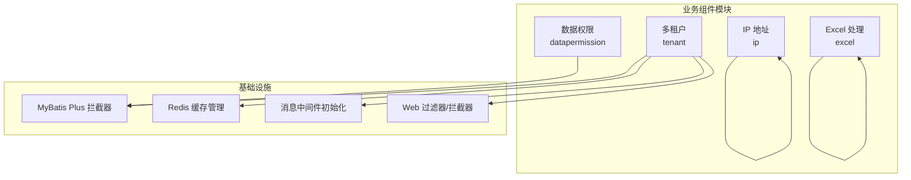
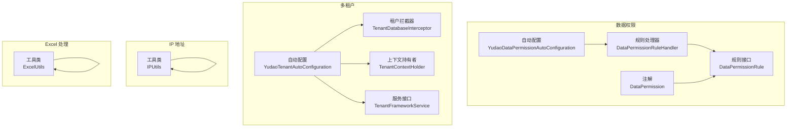
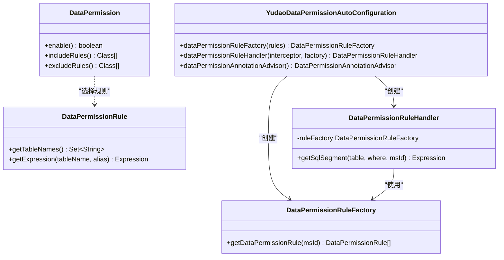
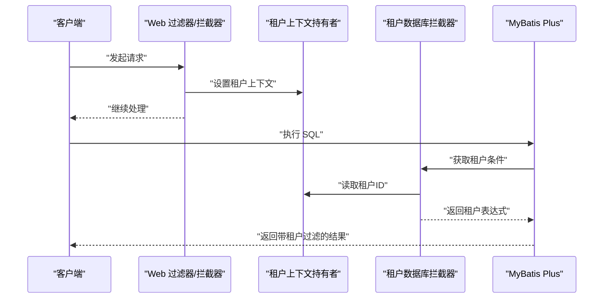
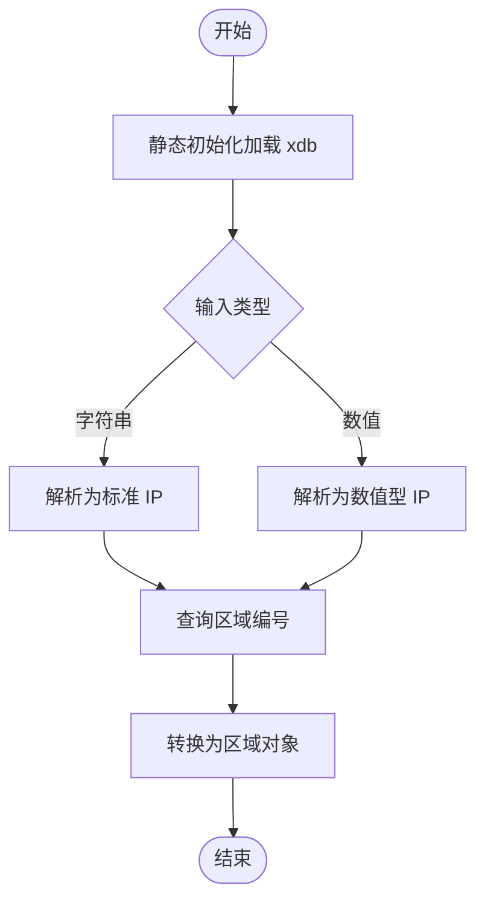
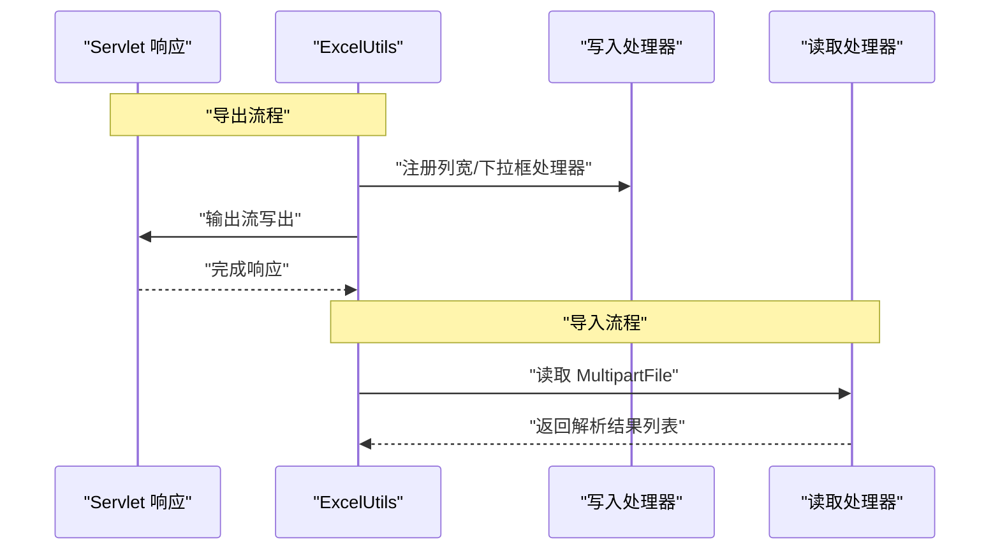
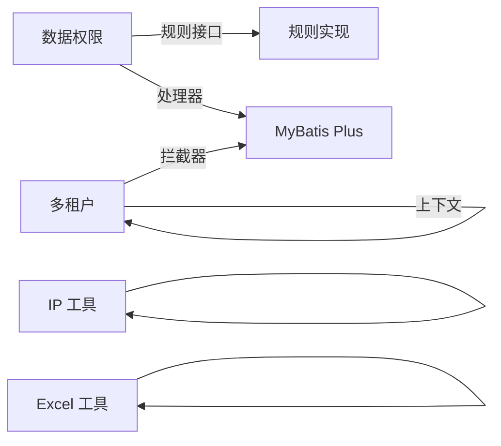

# 业务组件

<cite>
**本文引用的文件**
- [YudaoDataPermissionAutoConfiguration.java](file://yudao-framework/yudao-spring-boot-starter-biz-data-permission/src/main/java/cn/iocoder/yudao/framework/datapermission/config/YudaoDataPermissionAutoConfiguration.java)
- [DataPermission.java](file://yudao-framework/yudao-spring-boot-starter-biz-data-permission/src/main/java/cn/iocoder/yudao/framework/datapermission/core/annotation/DataPermission.java)
- [DataPermissionRule.java](file://yudao-framework/yudao-spring-boot-starter-biz-data-permission/src/main/java/cn/iocoder/yudao/framework/datapermission/core/rule/DataPermissionRule.java)
- [DataPermissionRuleHandler.java](file://yudao-framework/yudao-spring-boot-starter-biz-data-permission/src/main/java/cn/iocoder/yudao/framework/datapermission/core/db/DataPermissionRuleHandler.java)
- [YudaoTenantAutoConfiguration.java](file://yudao-framework/yudao-spring-boot-starter-biz-tenant/src/main/java/cn/iocoder/yudao/framework/tenant/config/YudaoTenantAutoConfiguration.java)
- [TenantDatabaseInterceptor.java](file://yudao-framework/yudao-spring-boot-starter-biz-tenant/src/main/java/cn/iocoder/yudao/framework/tenant/core/db/TenantDatabaseInterceptor.java)
- [TenantContextHolder.java](file://yudao-framework/yudao-spring-boot-starter-biz-tenant/src/main/java/cn/iocoder/yudao/framework/tenant/core/context/TenantContextHolder.java)
- [IPUtils.java](file://yudao-framework/yudao-spring-boot-starter-biz-ip/src/main/java/cn/iocoder/yudao/framework/ip/core/utils/IPUtils.java)
- [ExcelUtils.java](file://yudao-framework/yudao-spring-boot-starter-excel/src/main/java/cn/iocoder/yudao/framework/excel/core/util/ExcelUtils.java)
</cite>

## 目录
1. [引言](#引言)
2. [项目结构](#项目结构)
3. [核心组件](#核心组件)
4. [架构总览](#架构总览)
5. [详细组件分析](#详细组件分析)
6. [依赖关系分析](#依赖关系分析)
7. [性能考量](#性能考量)
8. [故障排查指南](#故障排查指南)
9. [结论](#结论)
10. [附录](#附录)

## 引言
本文件系统性梳理并讲解项目中的四大业务组件：数据权限组件、多租户组件、IP 地址组件与 Excel 处理组件。内容覆盖组件职责、实现原理、使用方式、扩展方法以及常见问题排查，帮助开发者快速理解与高效集成。

## 项目结构
四大业务组件分别位于独立的 starter 模块中，采用“按功能域拆分”的组织方式：
- 数据权限：yudao-spring-boot-starter-biz-data-permission
- 多租户：yudao-spring-boot-starter-biz-tenant
- IP 地址：yudao-spring-boot-starter-biz-ip
- Excel 处理：yudao-spring-boot-starter-excel

图表来源
- [YudaoDataPermissionAutoConfiguration.java:21-46](file://yudao-framework/yudao-spring-boot-starter-biz-data-permission/src/main/java/cn/iocoder/yudao/framework/datapermission/config/YudaoDataPermissionAutoConfiguration.java#L21-L46)
- [YudaoTenantAutoConfiguration.java:51-203](file://yudao-framework/yudao-spring-boot-starter-biz-tenant/src/main/java/cn/iocoder/yudao/framework/tenant/config/YudaoTenantAutoConfiguration.java#L51-L203)
- [IPUtils.java:17-85](file://yudao-framework/yudao-spring-boot-starter-biz-ip/src/main/java/cn/iocoder/yudao/framework/ip/core/utils/IPUtils.java#L17-L85)
- [ExcelUtils.java:20-56](file://yudao-framework/yudao-spring-boot-starter-excel/src/main/java/cn/iocoder/yudao/framework/excel/core/util/ExcelUtils.java#L20-L56)

章节来源
- [YudaoDataPermissionAutoConfiguration.java:16-46](file://yudao-framework/yudao-spring-boot-starter-biz-data-permission/src/main/java/cn/iocoder/yudao/framework/datapermission/config/YudaoDataPermissionAutoConfiguration.java#L16-L46)
- [YudaoTenantAutoConfiguration.java:51-203](file://yudao-framework/yudao-spring-boot-starter-biz-tenant/src/main/java/cn/iocoder/yudao/framework/tenant/config/YudaoTenantAutoConfiguration.java#L51-L203)

## 核心组件
- 数据权限组件：基于 MyBatis Plus 数据权限插件，在 SQL 执行前动态注入 WHERE 条件，实现按用户/角色维度的行级过滤。
- 多租户组件：通过数据库行级租户字段拦截、Web 过滤链、缓存隔离、消息中间件隔离等手段，实现租户级数据隔离与切换。
- IP 地址组件：基于 ip2region.xdb 轻量库，提供 IP 到区域编号与区域对象的查询能力。
- Excel 处理组件：封装导入导出流程，支持下拉选择、列宽适配、长整型精度保护等常用场景。

章节来源
- [DataPermissionRule.java:9-36](file://yudao-framework/yudao-spring-boot-starter-biz-data-permission/src/main/java/cn/iocoder/yudao/framework/datapermission/core/rule/DataPermissionRule.java#L9-L36)
- [TenantDatabaseInterceptor.java:16-83](file://yudao-framework/yudao-spring-boot-starter-biz-tenant/src/main/java/cn/iocoder/yudao/framework/tenant/core/db/TenantDatabaseInterceptor.java#L16-L83)
- [IPUtils.java:10-85](file://yudao-framework/yudao-spring-boot-starter-biz-ip/src/main/java/cn/iocoder/yudao/framework/ip/core/utils/IPUtils.java#L10-L85)
- [ExcelUtils.java:15-56](file://yudao-framework/yudao-spring-boot-starter-excel/src/main/java/cn/iocoder/yudao/framework/excel/core/util/ExcelUtils.java#L15-L56)

## 架构总览
四大组件均通过 Spring Boot 自动装配注册 Bean 并接入应用生命周期，形成“声明式 + 拦截式”的运行时增强体系。

图表来源
- [YudaoDataPermissionAutoConfiguration.java:21-46](file://yudao-framework/yudao-spring-boot-starter-biz-data-permission/src/main/java/cn/iocoder/yudao/framework/datapermission/config/YudaoDataPermissionAutoConfiguration.java#L21-L46)
- [DataPermissionRuleHandler.java:25-64](file://yudao-framework/yudao-spring-boot-starter-biz-data-permission/src/main/java/cn/iocoder/yudao/framework/datapermission/core/db/DataPermissionRuleHandler.java#L25-L64)
- [DataPermissionRule.java:15-36](file://yudao-framework/yudao-spring-boot-starter-biz-data-permission/src/main/java/cn/iocoder/yudao/framework/datapermission/core/rule/DataPermissionRule.java#L15-L36)
- [DataPermission.java:13-35](file://yudao-framework/yudao-spring-boot-starter-biz-data-permission/src/main/java/cn/iocoder/yudao/framework/datapermission/core/annotation/DataPermission.java#L13-L35)
- [YudaoTenantAutoConfiguration.java:51-203](file://yudao-framework/yudao-spring-boot-starter-biz-tenant/src/main/java/cn/iocoder/yudao/framework/tenant/config/YudaoTenantAutoConfiguration.java#L51-L203)
- [TenantDatabaseInterceptor.java:21-83](file://yudao-framework/yudao-spring-boot-starter-biz-tenant/src/main/java/cn/iocoder/yudao/framework/tenant/core/db/TenantDatabaseInterceptor.java#L21-L83)
- [TenantContextHolder.java:11-68](file://yudao-framework/yudao-spring-boot-starter-biz-tenant/src/main/java/cn/iocoder/yudao/framework/tenant/core/context/TenantContextHolder.java#L11-L68)
- [IPUtils.java:17-85](file://yudao-framework/yudao-spring-boot-starter-biz-ip/src/main/java/cn/iocoder/yudao/framework/ip/core/utils/IPUtils.java#L17-L85)
- [ExcelUtils.java:20-56](file://yudao-framework/yudao-spring-boot-starter-excel/src/main/java/cn/iocoder/yudao/framework/excel/core/util/ExcelUtils.java#L20-L56)

## 详细组件分析

### 数据权限组件
- 设计要点
  - 规则接口：通过统一接口定义“对哪些表生效”和“如何生成 WHERE 条件”，便于扩展自定义规则。
  - 注解驱动：在类或方法上声明启用/排除特定规则，支持细粒度控制。
  - 拦截器：在 SQL 执行前注入过滤条件，确保只返回当前用户有权限的数据。
  - 工厂与处理器：工厂聚合规则，处理器负责按表名匹配并合并表达式。
- 动态过滤原理
  - 基于 MyBatis Plus 数据权限插件，拦截 SQL，依据规则集合生成 AND 条件表达式，最终拼接到 WHERE 子句。
  - 支持跳过权限检查的场景（如跨租户访问），由上下文判断决定是否放行。
- 权限规则配置
  - 通过实现规则接口并注册为 Spring Bean，即可被工厂收集并参与过滤。
  - 注解支持 include/exclude 规则集，优先级明确。
- 权限继承机制
  - 通过注解层级（类/方法）叠加，实现从类级默认规则到方法级特例的继承与覆盖。

图表来源
- [DataPermissionRule.java:15-36](file://yudao-framework/yudao-spring-boot-starter-biz-data-permission/src/main/java/cn/iocoder/yudao/framework/datapermission/core/rule/DataPermissionRule.java#L15-L36)
- [DataPermissionRuleHandler.java:25-64](file://yudao-framework/yudao-spring-boot-starter-biz-data-permission/src/main/java/cn/iocoder/yudao/framework/datapermission/core/db/DataPermissionRuleHandler.java#L25-L64)
- [YudaoDataPermissionAutoConfiguration.java:21-46](file://yudao-framework/yudao-spring-boot-starter-biz-data-permission/src/main/java/cn/iocoder/yudao/framework/datapermission/config/YudaoDataPermissionAutoConfiguration.java#L21-L46)
- [DataPermission.java:13-35](file://yudao-framework/yudao-spring-boot-starter-biz-data-permission/src/main/java/cn/iocoder/yudao/framework/datapermission/core/annotation/DataPermission.java#L13-L35)

章节来源
- [YudaoDataPermissionAutoConfiguration.java:21-46](file://yudao-framework/yudao-spring-boot-starter-biz-data-permission/src/main/java/cn/iocoder/yudao/framework/datapermission/config/YudaoDataPermissionAutoConfiguration.java#L21-L46)
- [DataPermissionRuleHandler.java:30-62](file://yudao-framework/yudao-spring-boot-starter-biz-data-permission/src/main/java/cn/iocoder/yudao/framework/datapermission/core/db/DataPermissionRuleHandler.java#L30-L62)
- [DataPermissionRule.java:17-34](file://yudao-framework/yudao-spring-boot-starter-biz-data-permission/src/main/java/cn/iocoder/yudao/framework/datapermission/core/rule/DataPermissionRule.java#L17-L34)
- [DataPermission.java:18-33](file://yudao-framework/yudao-spring-boot-starter-biz-data-permission/src/main/java/cn/iocoder/yudao/framework/datapermission/core/annotation/DataPermission.java#L18-L33)

### 多租户组件
- 设计要点
  - 数据库层：通过租户字段拦截器在 SQL 中自动拼接租户条件，支持忽略表与全局忽略。
  - 上下文：线程本地存储租户 ID 与忽略标记，贯穿请求生命周期。
  - Web 层：过滤器与拦截器负责提取/设置租户上下文，支持忽略访问路径。
  - 缓存与消息：提供租户隔离的缓存管理器与消息中间件初始化器。
  - 作业：定时任务执行时自动切换租户上下文。
- 租户隔离策略
  - 行级隔离：数据库层强制追加租户条件。
  - 访问隔离：Web 层根据注解与配置决定是否忽略租户。
  - 缓存隔离：基于租户维度的缓存键空间隔离。
  - 消息隔离：针对不同 MQ 提供初始化与拦截逻辑。
- 租户切换
  - 通过上下文持有者设置租户 ID 或忽略标记，后续请求自动生效。
  - 支持跨租户临时访问（如运维场景）时的忽略策略。

图表来源
- [YudaoTenantAutoConfiguration.java:84-124](file://yudao-framework/yudao-spring-boot-starter-biz-tenant/src/main/java/cn/iocoder/yudao/framework/tenant/config/YudaoTenantAutoConfiguration.java#L84-L124)
- [TenantContextHolder.java:28-44](file://yudao-framework/yudao-spring-boot-starter-biz-tenant/src/main/java/cn/iocoder/yudao/framework/tenant/core/context/TenantContextHolder.java#L28-L44)
- [TenantDatabaseInterceptor.java:40-61](file://yudao-framework/yudao-spring-boot-starter-biz-tenant/src/main/java/cn/iocoder/yudao/framework/tenant/core/db/TenantDatabaseInterceptor.java#L40-L61)

章节来源
- [YudaoTenantAutoConfiguration.java:51-203](file://yudao-framework/yudao-spring-boot-starter-biz-tenant/src/main/java/cn/iocoder/yudao/framework/tenant/config/YudaoTenantAutoConfiguration.java#L51-L203)
- [TenantDatabaseInterceptor.java:21-83](file://yudao-framework/yudao-spring-boot-starter-biz-tenant/src/main/java/cn/iocoder/yudao/framework/tenant/core/db/TenantDatabaseInterceptor.java#L21-L83)
- [TenantContextHolder.java:11-68](file://yudao-framework/yudao-spring-boot-starter-biz-tenant/src/main/java/cn/iocoder/yudao/framework/tenant/core/context/TenantContextHolder.java#L11-L68)

### IP 地址解析组件
- 功能概述
  - 加载轻量级 ip2region.xdb 数据库至内存，提供 IP 到区域编号与区域对象的查询。
  - 支持字符串与数值型 IP 输入，内部统一封装查询入口。
- 使用建议
  - 首次查询会触发内存加载，后续查询走内存查找，性能稳定。
  - 区域信息通过工具类转换为 Area 对象，便于前端展示与国际化处理。

图表来源
- [IPUtils.java:26-42](file://yudao-framework/yudao-spring-boot-starter-biz-ip/src/main/java/cn/iocoder/yudao/framework/ip/core/utils/IPUtils.java#L26-L42)
- [IPUtils.java:50-84](file://yudao-framework/yudao-spring-boot-starter-biz-ip/src/main/java/cn/iocoder/yudao/framework/ip/core/utils/IPUtils.java#L50-L84)

章节来源
- [IPUtils.java:17-85](file://yudao-framework/yudao-spring-boot-starter-biz-ip/src/main/java/cn/iocoder/yudao/framework/ip/core/utils/IPUtils.java#L17-L85)

### Excel 导入导出组件
- 能力概览
  - 导出：支持设置文件名、工作表名、表头类与数据列表，自动注册列宽适配与下拉框写入处理器，避免长整型精度丢失。
  - 导入：支持从 MultipartFile 读取并同步解析为指定类型列表。
- 最佳实践
  - 表头类与数据模型保持一致，确保映射准确。
  - 大数据量导出时注意流式写出与内存占用平衡。
  - 导入前进行基础校验（如文件类型、必填字段），结合业务异常处理。

图表来源
- [ExcelUtils.java:33-45](file://yudao-framework/yudao-spring-boot-starter-excel/src/main/java/cn/iocoder/yudao/framework/excel/core/util/ExcelUtils.java#L33-L45)
- [ExcelUtils.java:47-54](file://yudao-framework/yudao-spring-boot-starter-excel/src/main/java/cn/iocoder/yudao/framework/excel/core/util/ExcelUtils.java#L47-L54)

章节来源
- [ExcelUtils.java:20-56](file://yudao-framework/yudao-spring-boot-starter-excel/src/main/java/cn/iocoder/yudao/framework/excel/core/util/ExcelUtils.java#L20-L56)

## 依赖关系分析
- 组件内聚与耦合
  - 数据权限：规则接口与处理器低耦合，通过工厂聚合，易于扩展新规则。
  - 多租户：拦截器、上下文、Web 组件协同，形成完整的租户生命周期闭环。
  - IP 与 Excel：均为工具类封装，对外暴露简洁 API，内部依赖稳定库。
- 外部依赖
  - 数据权限与多租户依赖 MyBatis Plus 插件生态。
  - IP 解析依赖 ip2region.xdb 资源。
  - Excel 导出依赖 FastExcelFactory 与相关转换器。

图表来源
- [DataPermissionRuleHandler.java:25-64](file://yudao-framework/yudao-spring-boot-starter-biz-data-permission/src/main/java/cn/iocoder/yudao/framework/datapermission/core/db/DataPermissionRuleHandler.java#L25-L64)
- [YudaoTenantAutoConfiguration.java:73-81](file://yudao-framework/yudao-spring-boot-starter-biz-tenant/src/main/java/cn/iocoder/yudao/framework/tenant/config/YudaoTenantAutoConfiguration.java#L73-L81)
- [IPUtils.java:17-85](file://yudao-framework/yudao-spring-boot-starter-biz-ip/src/main/java/cn/iocoder/yudao/framework/ip/core/utils/IPUtils.java#L17-L85)
- [ExcelUtils.java:20-56](file://yudao-framework/yudao-spring-boot-starter-excel/src/main/java/cn/iocoder/yudao/framework/excel/core/util/ExcelUtils.java#L20-L56)

章节来源
- [YudaoDataPermissionAutoConfiguration.java:21-46](file://yudao-framework/yudao-spring-boot-starter-biz-data-permission/src/main/java/cn/iocoder/yudao/framework/datapermission/config/YudaoDataPermissionAutoConfiguration.java#L21-L46)
- [YudaoTenantAutoConfiguration.java:51-203](file://yudao-framework/yudao-spring-boot-starter-biz-tenant/src/main/java/cn/iocoder/yudao/framework/tenant/config/YudaoTenantAutoConfiguration.java#L51-L203)

## 性能考量
- 数据权限
  - 规则表达式合并为 AND 条件，尽量减少复杂嵌套；避免在规则中做昂贵计算。
- 多租户
  - 租户上下文线程本地存储，避免频繁 IO；忽略表与全局忽略策略减少无效拦截。
- IP 解析
  - 静态加载一次，内存命中率高；建议预热或在启动阶段触发加载。
- Excel 处理
  - 大数据量导出建议分批写出；导入时注意流式读取与异常恢复。

## 故障排查指南
- 数据权限
  - 现象：查询结果为空或越权。
  - 排查：确认规则是否正确匹配表名；检查注解 include/exclude 是否符合预期；核对上下文是否跳过了权限检查。
- 多租户
  - 现象：跨租户数据泄露或无法访问。
  - 排查：检查 Web 过滤器是否正确设置租户上下文；确认拦截器忽略表配置；核对租户 ID 是否存在。
- IP 解析
  - 现象：解析异常或返回空。
  - 排查：确认资源文件是否存在且可读；检查输入格式是否符合要求。
- Excel 处理
  - 现现：导出乱码或精度丢失。
  - 排查：确认响应头设置与字符编码；检查是否注册了长整型转换器。

章节来源
- [DataPermissionRuleHandler.java:30-41](file://yudao-framework/yudao-spring-boot-starter-biz-data-permission/src/main/java/cn/iocoder/yudao/framework/datapermission/core/db/DataPermissionRuleHandler.java#L30-L41)
- [TenantContextHolder.java:37-44](file://yudao-framework/yudao-spring-boot-starter-biz-tenant/src/main/java/cn/iocoder/yudao/framework/tenant/core/context/TenantContextHolder.java#L37-L44)
- [IPUtils.java:33-42](file://yudao-framework/yudao-spring-boot-starter-biz-ip/src/main/java/cn/iocoder/yudao/framework/ip/core/utils/IPUtils.java#L33-L42)
- [ExcelUtils.java:33-45](file://yudao-framework/yudao-spring-boot-starter-excel/src/main/java/cn/iocoder/yudao/framework/excel/core/util/ExcelUtils.java#L33-L45)

## 结论
四大业务组件以“声明 + 拦截”的方式无缝融入应用，既保证了业务灵活性，又提供了强一致性的安全边界。通过清晰的接口与自动装配机制，开发者可以快速启用并扩展相应能力。

## 附录
- 扩展方法
  - 自定义数据权限规则：实现规则接口并注册为 Bean，即可参与动态过滤。
  - 自定义多租户策略：通过上下文持有者与 Web 组件扩展租户识别逻辑。
  - 第三方组件集成：IP 与 Excel 工具类提供稳定 API，可直接复用；多租户与数据权限可按需引入对应拦截器与上下文。