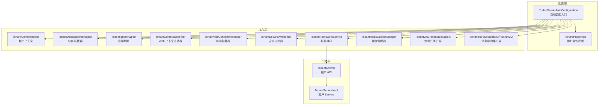
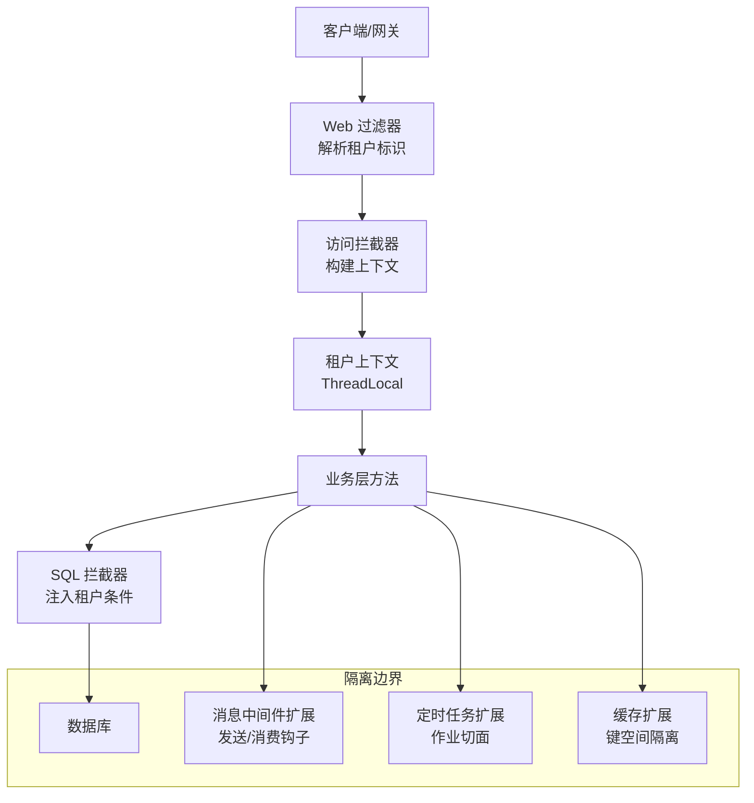
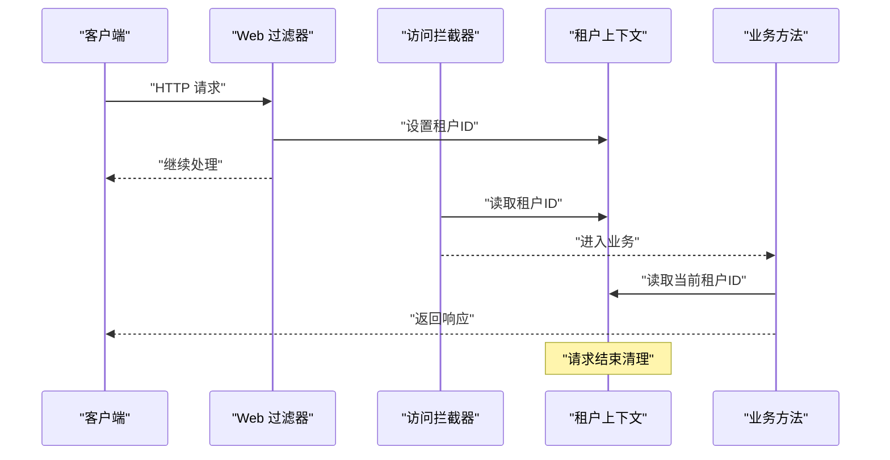
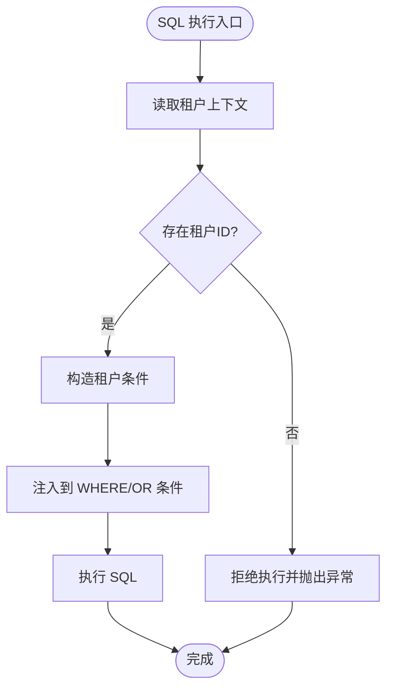
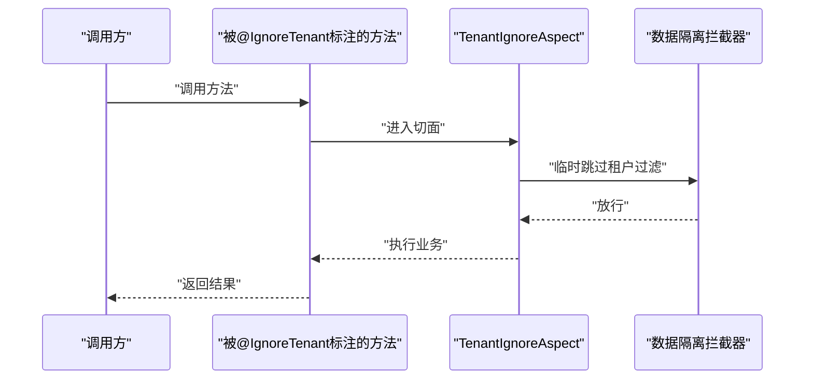
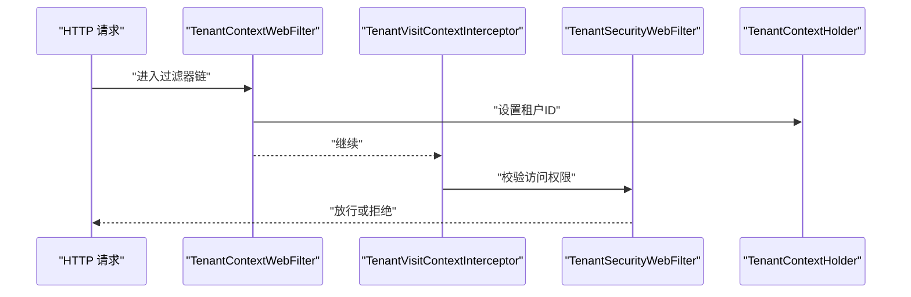
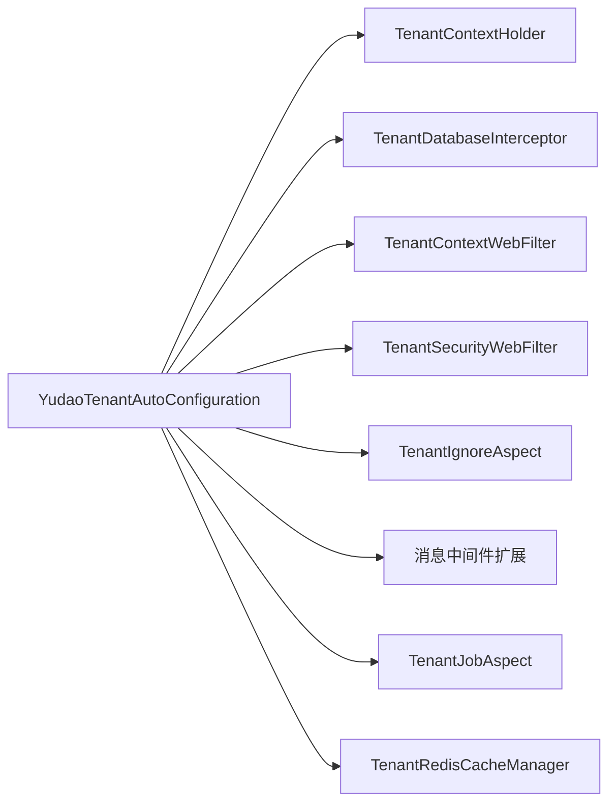

# 多租户组件

<cite>
**本文引用的文件**
- [YudaoTenantAutoConfiguration.java](file://yudao-framework/yudao-spring-boot-starter-biz-tenant/src/main/java/cn/iocoder/yudao/framework/tenant/config/YudaoTenantAutoConfiguration.java)
- [TenantProperties.java](file://yudao-framework/yudao-spring-boot-starter-biz-tenant/src/main/java/cn/iocoder/yudao/framework/tenant/config/TenantProperties.java)
- [TenantIgnore.java](file://yudao-framework/yudao-spring-boot-starter-biz-tenant/src/main/java/cn/iocoder/yudao/framework/tenant/core/aop/TenantIgnore.java)
- [TenantIgnoreAspect.java](file://yudao-framework/yudao-spring-boot-starter-biz-tenant/src/main/java/cn/iocoder/yudao/framework/tenant/core/aop/TenantIgnoreAspect.java)
- [TenantContextHolder.java](file://yudao-framework/yudao-spring-boot-starter-biz-tenant/src/main/java/cn/iocoder/yudao/framework/tenant/core/context/TenantContextHolder.java)
- [TenantDatabaseInterceptor.java](file://yudao-framework/yudao-spring-boot-starter-biz-tenant/src/main/java/cn/iocoder/yudao/framework/tenant/core/db/TenantDatabaseInterceptor.java)
- [TenantBaseDO.java](file://yudao-framework/yudao-spring-boot-starter-biz-tenant/src/main/java/cn/iocoder/yudao/framework/tenant/core/db/TenantBaseDO.java)
- [TenantContextWebFilter.java](file://yudao-framework/yudao-spring-boot-starter-biz-tenant/src/main/java/cn/iocoder/yudao/framework/tenant/core/web/TenantContextWebFilter.java)
- [TenantVisitContextInterceptor.java](file://yudao-framework/yudao-spring-boot-starter-biz-tenant/src/main/java/cn/iocoder/yudao/framework/tenant/core/web/TenantVisitContextInterceptor.java)
- [TenantSecurityWebFilter.java](file://yudao-framework/yudao-spring-boot-starter-biz-tenant/src/main/java/cn/iocoder/yudao/framework/tenant/core/security/TenantSecurityWebFilter.java)
- [TenantFrameworkService.java](file://yudao-framework/yudao-spring-boot-starter-biz-tenant/src/main/java/cn/iocoder/yudao/framework/tenant/core/service/TenantFrameworkService.java)
- [TenantFrameworkServiceImpl.java](file://yudao-framework/yudao-spring-boot-starter-biz-tenant/src/main/java/cn/iocoder/yudao/framework/tenant/core/service/TenantFrameworkServiceImpl.java)
- [TenantRedisCacheManager.java](file://yudao-framework/yudao-spring-boot-starter-biz-tenant/src/main/java/cn/iocoder/yudao/framework/tenant/core/redis/TenantRedisCacheManager.java)
- [TenantJob.java](file://yudao-framework/yudao-spring-boot-starter-biz-tenant/src/main/java/cn/iocoder/yudao/framework/tenant/core/job/TenantJob.java)
- [TenantJobAspect.java](file://yudao-framework/yudao-spring-boot-starter-biz-tenant/src/main/java/cn/iocoder/yudao/framework/tenant/core/job/TenantJobAspect.java)
- [TenantKafkaProducerInterceptor.java](file://yudao-framework/yudao-spring-boot-starter-biz-tenant/src/main/java/cn/iocoder/yudao/framework/tenant/core/mq/kafka/TenantKafkaProducerInterceptor.java)
- [TenantRabbitMQInitializer.java](file://yudao-framework/yudao-spring-boot-starter-biz-tenant/src/main/java/cn/iocoder/yudao/framework/tenant/core/mq/rabbitmq/TenantRabbitMQInitializer.java)
- [TenantRabbitMQMessagePostProcessor.java](file://yudao-framework/yudao-spring-boot-starter-biz-tenant/src/main/java/cn/iocoder/yudao/framework/tenant/core/mq/rabbitmq/TenantRabbitMQMessagePostProcessor.java)
- [TenantRedisMessageInterceptor.java](file://yudao-framework/yudao-spring-boot-starter-biz-tenant/src/main/java/cn/iocoder/yudao/framework/tenant/core/mq/redis/TenantRedisMessageInterceptor.java)
- [TenantRocketMQSendMessageHook.java](file://yudao-framework/yudao-spring-boot-starter-biz-tenant/src/main/java/cn/iocoder/yudao/framework/tenant/core/mq/rocketmq/TenantRocketMQSendMessageHook.java)
- [TenantRocketMQConsumeMessageHook.java](file://yudao-framework/yudao-spring-boot-starter-biz-tenant/src/main/java/cn/iocoder/yudao/framework/tenant/core/mq/rocketmq/TenantRocketMQConsumeMessageHook.java)
- [TenantRocketMQInitializer.java](file://yudao-framework/yudao-spring-boot-starter-biz-tenant/src/main/java/cn/iocoder/yudao/framework/tenant/core/mq/rocketmq/TenantRocketMQInitializer.java)
- [TenantApiImpl.java](file://yudao-module-system/src/main/java/cn/iocoder/yudao/module/system/api/tenant/TenantApiImpl.java)
- [TenantServiceImpl.java](file://yudao-module-system/src/main/java/cn/iocoder/yudao/module/system/service/tenant/TenantServiceImpl.java)
</cite>

## 目录
1. [引言](#引言)
2. [项目结构](#项目结构)
3. [核心组件](#核心组件)
4. [架构总览](#架构总览)
5. [详细组件分析](#详细组件分析)
6. [依赖关系分析](#依赖关系分析)
7. [性能考量](#性能考量)
8. [故障排查指南](#故障排查指南)
9. [结论](#结论)
10. [附录](#附录)

## 引言
本文件系统性梳理多租户组件的设计与实现，覆盖租户隔离策略、数据隔离机制、租户切换与上下文管理、注解式跳过策略、拦截器链路、以及与数据库连接池/消息中间件的集成方案，并结合 SaaS 平台与独立部署多组织场景给出实践建议。

## 项目结构
多租户能力集中在 yudao-spring-boot-starter-biz-tenant 模块中，采用“按域分层 + 自动装配”的方式组织：
- 配置层：自动装配入口与属性配置
- 核心层：上下文、拦截器、AOP、Web 过滤器、作业与 MQ 扩展、缓存扩展、安全扩展、服务接口
- 业务层：系统模块中的租户 API 与 Service 实现，用于租户维度的通用能力调用

图示来源
- [YudaoTenantAutoConfiguration.java](file://yudao-framework/yudao-spring-boot-starter-biz-tenant/src/main/java/cn/iocoder/yudao/framework/tenant/config/YudaoTenantAutoConfiguration.java)
- [TenantProperties.java](file://yudao-framework/yudao-spring-boot-starter-biz-tenant/src/main/java/cn/iocoder/yudao/framework/tenant/config/TenantProperties.java)
- [TenantContextHolder.java](file://yudao-framework/yudao-spring-boot-starter-biz-tenant/src/main/java/cn/iocoder/yudao/framework/tenant/core/context/TenantContextHolder.java)
- [TenantDatabaseInterceptor.java](file://yudao-framework/yudao-spring-boot-starter-biz-tenant/src/main/java/cn/iocoder/yudao/framework/tenant/core/db/TenantDatabaseInterceptor.java)
- [TenantIgnoreAspect.java](file://yudao-framework/yudao-spring-boot-starter-biz-tenant/src/main/java/cn/iocoder/yudao/framework/tenant/core/aop/TenantIgnoreAspect.java)
- [TenantContextWebFilter.java](file://yudao-framework/yudao-spring-boot-starter-biz-tenant/src/main/java/cn/iocoder/yudao/framework/tenant/core/web/TenantContextWebFilter.java)
- [TenantVisitContextInterceptor.java](file://yudao-framework/yudao-spring-boot-starter-biz-tenant/src/main/java/cn/iocoder/yudao/framework/tenant/core/web/TenantVisitContextInterceptor.java)
- [TenantSecurityWebFilter.java](file://yudao-framework/yudao-spring-boot-starter-biz-tenant/src/main/java/cn/iocoder/yudao/framework/tenant/core/security/TenantSecurityWebFilter.java)
- [TenantFrameworkService.java](file://yudao-framework/yudao-spring-boot-starter-biz-tenant/src/main/java/cn/iocoder/yudao/framework/tenant/core/service/TenantFrameworkService.java)
- [TenantRedisCacheManager.java](file://yudao-framework/yudao-spring-boot-starter-biz-tenant/src/main/java/cn/iocoder/yudao/framework/tenant/core/redis/TenantRedisCacheManager.java)
- [TenantJob.java](file://yudao-framework/yudao-spring-boot-starter-biz-tenant/src/main/java/cn/iocoder/yudao/framework/tenant/core/job/TenantJob.java)
- [TenantJobAspect.java](file://yudao-framework/yudao-spring-boot-starter-biz-tenant/src/main/java/cn/iocoder/yudao/framework/tenant/core/job/TenantJobAspect.java)
- [TenantKafkaProducerInterceptor.java](file://yudao-framework/yudao-spring-boot-starter-biz-tenant/src/main/java/cn/iocoder/yudao/framework/tenant/core/mq/kafka/TenantKafkaProducerInterceptor.java)
- [TenantRabbitMQInitializer.java](file://yudao-framework/yudao-spring-boot-starter-biz-tenant/src/main/java/cn/iocoder/yudao/framework/tenant/core/mq/rabbitmq/TenantRabbitMQInitializer.java)
- [TenantRabbitMQMessagePostProcessor.java](file://yudao-framework/yudao-spring-boot-starter-biz-tenant/src/main/java/cn/iocoder/yudao/framework/tenant/core/mq/rabbitmq/TenantRabbitMQMessagePostProcessor.java)
- [TenantRedisMessageInterceptor.java](file://yudao-framework/yudao-spring-boot-starter-biz-tenant/src/main/java/cn/iocoder/yudao/framework/tenant/core/mq/redis/TenantRedisMessageInterceptor.java)
- [TenantRocketMQSendMessageHook.java](file://yudao-framework/yudao-spring-boot-starter-biz-tenant/src/main/java/cn/iocoder/yudao/framework/tenant/core/mq/rocketmq/TenantRocketMQSendMessageHook.java)
- [TenantRocketMQConsumeMessageHook.java](file://yudao-framework/yudao-spring-boot-starter-biz-tenant/src/main/java/cn/iocoder/yudao/framework/tenant/core/mq/rocketmq/TenantRocketMQConsumeMessageHook.java)
- [TenantRocketMQInitializer.java](file://yudao-framework/yudao-spring-boot-starter-biz-tenant/src/main/java/cn/iocoder/yudao/framework/tenant/core/mq/rocketmq/TenantRocketMQInitializer.java)
- [TenantApiImpl.java](file://yudao-module-system/src/main/java/cn/iocoder/yudao/module/system/api/tenant/TenantApiImpl.java)
- [TenantServiceImpl.java](file://yudao-module-system/src/main/java/cn/iocoder/yudao/module/system/service/tenant/TenantServiceImpl.java)

章节来源
- [YudaoTenantAutoConfiguration.java](file://yudao-framework/yudao-spring-boot-starter-biz-tenant/src/main/java/cn/iocoder/yudao/framework/tenant/config/YudaoTenantAutoConfiguration.java)
- [TenantProperties.java](file://yudao-framework/yudao-spring-boot-starter-biz-tenant/src/main/java/cn/iocoder/yudao/framework/tenant/config/TenantProperties.java)

## 核心组件
- 自动装配与属性
  - 自动装配入口负责注册上下文、拦截器、Web 过滤器、作业与 MQ 扩展、缓存扩展等组件。
  - 属性配置集中于租户属性类，控制是否启用多租户、默认租户、忽略列表等开关。
- 上下文管理
  - 提供线程本地存储的租户上下文，支持设置/清除当前租户 ID，并在 Web/拦截器/作业/消息等链路中透传。
- 数据隔离
  - 通过 SQL 拦截器在查询/更新/删除前自动拼接租户条件，确保跨租户数据隔离。
- 注解式跳过
  - @IgnoreTenant 注解用于标记方法或类，使其在执行时忽略租户过滤，适用于系统级或跨租户操作。
- Web 与安全
  - Web 过滤器与拦截器负责从请求中提取租户标识，建立上下文；安全过滤器保障鉴权与租户边界。
- 缓存与作业/消息
  - 缓存管理器、作业切面、消息中间件 Hook/拦截器确保在多租户环境下缓存键空间隔离、任务与消息处理正确路由。

章节来源
- [YudaoTenantAutoConfiguration.java](file://yudao-framework/yudao-spring-boot-starter-biz-tenant/src/main/java/cn/iocoder/yudao/framework/tenant/config/YudaoTenantAutoConfiguration.java)
- [TenantProperties.java](file://yudao-framework/yudao-spring-boot-starter-biz-tenant/src/main/java/cn/iocoder/yudao/framework/tenant/config/TenantProperties.java)
- [TenantIgnore.java](file://yudao-framework/yudao-spring-boot-starter-biz-tenant/src/main/java/cn/iocoder/yudao/framework/tenant/core/aop/TenantIgnore.java)
- [TenantIgnoreAspect.java](file://yudao-framework/yudao-spring-boot-starter-biz-tenant/src/main/java/cn/iocoder/yudao/framework/tenant/core/aop/TenantIgnoreAspect.java)
- [TenantContextHolder.java](file://yudao-framework/yudao-spring-boot-starter-biz-tenant/src/main/java/cn/iocoder/yudao/framework/tenant/core/context/TenantContextHolder.java)
- [TenantDatabaseInterceptor.java](file://yudao-framework/yudao-spring-boot-starter-biz-tenant/src/main/java/cn/iocoder/yudao/framework/tenant/core/db/TenantDatabaseInterceptor.java)
- [TenantContextWebFilter.java](file://yudao-framework/yudao-spring-boot-starter-biz-tenant/src/main/java/cn/iocoder/yudao/framework/tenant/core/web/TenantContextWebFilter.java)
- [TenantVisitContextInterceptor.java](file://yudao-framework/yudao-spring-boot-starter-biz-tenant/src/main/java/cn/iocoder/yudao/framework/tenant/core/web/TenantVisitContextInterceptor.java)
- [TenantSecurityWebFilter.java](file://yudao-framework/yudao-spring-boot-starter-biz-tenant/src/main/java/cn/iocoder/yudao/framework/tenant/core/security/TenantSecurityWebFilter.java)
- [TenantRedisCacheManager.java](file://yudao-framework/yudao-spring-boot-starter-biz-tenant/src/main/java/cn/iocoder/yudao/framework/tenant/core/redis/TenantRedisCacheManager.java)
- [TenantJob.java](file://yudao-framework/yudao-spring-boot-starter-biz-tenant/src/main/java/cn/iocoder/yudao/framework/tenant/core/job/TenantJob.java)
- [TenantJobAspect.java](file://yudao-framework/yudao-spring-boot-starter-biz-tenant/src/main/java/cn/iocoder/yudao/framework/tenant/core/job/TenantJobAspect.java)
- [TenantKafkaProducerInterceptor.java](file://yudao-framework/yudao-spring-boot-starter-biz-tenant/src/main/java/cn/iocoder/yudao/framework/tenant/core/mq/kafka/TenantKafkaProducerInterceptor.java)
- [TenantRabbitMQInitializer.java](file://yudao-framework/yudao-spring-boot-starter-biz-tenant/src/main/java/cn/iocoder/yudao/framework/tenant/core/mq/rabbitmq/TenantRabbitMQInitializer.java)
- [TenantRabbitMQMessagePostProcessor.java](file://yudao-framework/yudao-spring-boot-starter-biz-tenant/src/main/java/cn/iocoder/yudao/framework/tenant/core/mq/rabbitmq/TenantRabbitMQMessagePostProcessor.java)
- [TenantRedisMessageInterceptor.java](file://yudao-framework/yudao-spring-boot-starter-biz-tenant/src/main/java/cn/iocoder/yudao/framework/tenant/core/mq/redis/TenantRedisMessageInterceptor.java)
- [TenantRocketMQSendMessageHook.java](file://yudao-framework/yudao-spring-boot-starter-biz-tenant/src/main/java/cn/iocoder/yudao/framework/tenant/core/mq/rocketmq/TenantRocketMQSendMessageHook.java)
- [TenantRocketMQConsumeMessageHook.java](file://yudao-framework/yudao-spring-boot-starter-biz-tenant/src/main/java/cn/iocoder/yudao/framework/tenant/core/mq/rocketmq/TenantRocketMQConsumeMessageHook.java)
- [TenantRocketMQInitializer.java](file://yudao-framework/yudao-spring-boot-starter-biz-tenant/src/main/java/cn/iocoder/yudao/framework/tenant/core/mq/rocketmq/TenantRocketMQInitializer.java)

## 架构总览
多租户架构围绕“上下文贯穿 + 拦截器注入 + 统一隔离”展开，形成从 Web 到持久层再到消息与作业的全链路隔离。

图示来源
- [TenantContextWebFilter.java](file://yudao-framework/yudao-spring-boot-starter-biz-tenant/src/main/java/cn/iocoder/yudao/framework/tenant/core/web/TenantContextWebFilter.java)
- [TenantVisitContextInterceptor.java](file://yudao-framework/yudao-spring-boot-starter-biz-tenant/src/main/java/cn/iocoder/yudao/framework/tenant/core/web/TenantVisitContextInterceptor.java)
- [TenantContextHolder.java](file://yudao-framework/yudao-spring-boot-starter-biz-tenant/src/main/java/cn/iocoder/yudao/framework/tenant/core/context/TenantContextHolder.java)
- [TenantDatabaseInterceptor.java](file://yudao-framework/yudao-spring-boot-starter-biz-tenant/src/main/java/cn/iocoder/yudao/framework/tenant/core/db/TenantDatabaseInterceptor.java)
- [TenantKafkaProducerInterceptor.java](file://yudao-framework/yudao-spring-boot-starter-biz-tenant/src/main/java/cn/iocoder/yudao/framework/tenant/core/mq/kafka/TenantKafkaProducerInterceptor.java)
- [TenantRabbitMQInitializer.java](file://yudao-framework/yudao-spring-boot-starter-biz-tenant/src/main/java/cn/iocoder/yudao/framework/tenant/core/mq/rabbitmq/TenantRabbitMQInitializer.java)
- [TenantRabbitMQMessagePostProcessor.java](file://yudao-framework/yudao-spring-boot-starter-biz-tenant/src/main/java/cn/iocoder/yudao/framework/tenant/core/mq/rabbitmq/TenantRabbitMQMessagePostProcessor.java)
- [TenantRedisMessageInterceptor.java](file://yudao-framework/yudao-spring-boot-starter-biz-tenant/src/main/java/cn/iocoder/yudao/framework/tenant/core/mq/redis/TenantRedisMessageInterceptor.java)
- [TenantRocketMQSendMessageHook.java](file://yudao-framework/yudao-spring-boot-starter-biz-tenant/src/main/java/cn/iocoder/yudao/framework/tenant/core/mq/rocketmq/TenantRocketMQSendMessageHook.java)
- [TenantRocketMQConsumeMessageHook.java](file://yudao-framework/yudao-spring-boot-starter-biz-tenant/src/main/java/cn/iocoder/yudao/framework/tenant/core/mq/rocketmq/TenantRocketMQConsumeMessageHook.java)
- [TenantRocketMQInitializer.java](file://yudao-framework/yudao-spring-boot-starter-biz-tenant/src/main/java/cn/iocoder/yudao/framework/tenant/core/mq/rocketmq/TenantRocketMQInitializer.java)
- [TenantRedisCacheManager.java](file://yudao-framework/yudao-spring-boot-starter-biz-tenant/src/main/java/cn/iocoder/yudao/framework/tenant/core/redis/TenantRedisCacheManager.java)
- [TenantJob.java](file://yudao-framework/yudao-spring-boot-starter-biz-tenant/src/main/java/cn/iocoder/yudao/framework/tenant/core/job/TenantJob.java)
- [TenantJobAspect.java](file://yudao-framework/yudao-spring-boot-starter-biz-tenant/src/main/java/cn/iocoder/yudao/framework/tenant/core/job/TenantJobAspect.java)

## 详细组件分析

### 租户上下文管理器
- 设计要点
  - 使用线程本地存储保存当前租户 ID，避免跨线程污染。
  - 提供设置、清除、获取等基础方法，配合 Web 过滤器与拦截器在请求生命周期内维护。
- 线程安全
  - ThreadLocal 天然线程隔离；在异步/线程池场景需显式传递上下文或在任务开始处恢复。
- 上下文传递
  - Web 层通过过滤器/拦截器建立；持久层通过拦截器读取；消息/作业通过切面/钩子恢复。

图示来源
- [TenantContextWebFilter.java](file://yudao-framework/yudao-spring-boot-starter-biz-tenant/src/main/java/cn/iocoder/yudao/framework/tenant/core/web/TenantContextWebFilter.java)
- [TenantVisitContextInterceptor.java](file://yudao-framework/yudao-spring-boot-starter-biz-tenant/src/main/java/cn/iocoder/yudao/framework/tenant/core/web/TenantVisitContextInterceptor.java)
- [TenantContextHolder.java](file://yudao-framework/yudao-spring-boot-starter-biz-tenant/src/main/java/cn/iocoder/yudao/framework/tenant/core/context/TenantContextHolder.java)

章节来源
- [TenantContextHolder.java](file://yudao-framework/yudao-spring-boot-starter-biz-tenant/src/main/java/cn/iocoder/yudao/framework/tenant/core/context/TenantContextHolder.java)
- [TenantContextWebFilter.java](file://yudao-framework/yudao-spring-boot-starter-biz-tenant/src/main/java/cn/iocoder/yudao/framework/tenant/core/web/TenantContextWebFilter.java)
- [TenantVisitContextInterceptor.java](file://yudao-framework/yudao-spring-boot-starter-biz-tenant/src/main/java/cn/iocoder/yudao/framework/tenant/core/web/TenantVisitContextInterceptor.java)

### 数据隔离机制（SQL 注入）
- 工作原理
  - 在 SQL 执行前拦截，根据上下文中的租户 ID 自动为查询语句追加租户条件，确保读写均受隔离。
  - 支持对基础模型字段进行统一处理，减少业务侧重复判断。
- 适用范围
  - MyBatis/MyBatis-Plus 场景下的通用拦截，覆盖 SELECT/INSERT/UPDATE/DELETE。
- 错误处理
  - 当租户 ID 缺失且必须隔离时，拦截器应拒绝执行并抛出明确异常，避免越权。

图示来源
- [TenantDatabaseInterceptor.java](file://yudao-framework/yudao-spring-boot-starter-biz-tenant/src/main/java/cn/iocoder/yudao/framework/tenant/core/db/TenantDatabaseInterceptor.java)
- [TenantBaseDO.java](file://yudao-framework/yudao-spring-boot-starter-biz-tenant/src/main/java/cn/iocoder/yudao/framework/tenant/core/db/TenantBaseDO.java)

章节来源
- [TenantDatabaseInterceptor.java](file://yudao-framework/yudao-spring-boot-starter-biz-tenant/src/main/java/cn/iocoder/yudao/framework/tenant/core/db/TenantDatabaseInterceptor.java)
- [TenantBaseDO.java](file://yudao-framework/yudao-spring-boot-starter-biz-tenant/src/main/java/cn/iocoder/yudao/framework/tenant/core/db/TenantBaseDO.java)

### @IgnoreTenant 注解与切面
- 使用场景
  - 系统运维类操作（如跨租户统计）、初始化脚本、迁移任务等需要忽略租户过滤的场景。
- 实现机制
  - AOP 切面扫描标注的方法/类，执行前临时提升权限或绕过拦截器逻辑，执行后恢复上下文。
- 注意事项
  - 必须谨慎使用，确保仅在必要范围内生效，避免无意越权。

图示来源
- [TenantIgnore.java](file://yudao-framework/yudao-spring-boot-starter-biz-tenant/src/main/java/cn/iocoder/yudao/framework/tenant/core/aop/TenantIgnore.java)
- [TenantIgnoreAspect.java](file://yudao-framework/yudao-spring-boot-starter-biz-tenant/src/main/java/cn/iocoder/yudao/framework/tenant/core/aop/TenantIgnoreAspect.java)

章节来源
- [TenantIgnore.java](file://yudao-framework/yudao-spring-boot-starter-biz-tenant/src/main/java/cn/iocoder/yudao/framework/tenant/core/aop/TenantIgnore.java)
- [TenantIgnoreAspect.java](file://yudao-framework/yudao-spring-boot-starter-biz-tenant/src/main/java/cn/iocoder/yudao/framework/tenant/core/aop/TenantIgnoreAspect.java)

### 多租户拦截器与 Web 过滤
- 请求拦截
  - Web 过滤器从 Header/Cookie/Path 等位置解析租户标识，建立上下文。
- 访问拦截
  - 拦截器进一步校验访问权限与租户边界，确保用户仅能访问其所属租户资源。
- 安全过滤
  - 安全过滤器与认证/授权链路协同，防止越权访问。

图示来源
- [TenantContextWebFilter.java](file://yudao-framework/yudao-spring-boot-starter-biz-tenant/src/main/java/cn/iocoder/yudao/framework/tenant/core/web/TenantContextWebFilter.java)
- [TenantVisitContextInterceptor.java](file://yudao-framework/yudao-spring-boot-starter-biz-tenant/src/main/java/cn/iocoder/yudao/framework/tenant/core/web/TenantVisitContextInterceptor.java)
- [TenantSecurityWebFilter.java](file://yudao-framework/yudao-spring-boot-starter-biz-tenant/src/main/java/cn/iocoder/yudao/framework/tenant/core/security/TenantSecurityWebFilter.java)

章节来源
- [TenantContextWebFilter.java](file://yudao-framework/yudao-spring-boot-starter-biz-tenant/src/main/java/cn/iocoder/yudao/framework/tenant/core/web/TenantContextWebFilter.java)
- [TenantVisitContextInterceptor.java](file://yudao-framework/yudao-spring-boot-starter-biz-tenant/src/main/java/cn/iocoder/yudao/framework/tenant/core/web/TenantVisitContextInterceptor.java)
- [TenantSecurityWebFilter.java](file://yudao-framework/yudao-spring-boot-starter-biz-tenant/src/main/java/cn/iocoder/yudao/framework/tenant/core/security/TenantSecurityWebFilter.java)

### 与数据库连接池的集成
- 动态数据源切换
  - 可基于租户 ID 选择对应的数据源/Schema/库，实现强隔离。
  - 结合连接池参数（最大连接数、空闲超时、连接生命周期）优化性能。
- 配置要点
  - 为每个租户配置独立数据源或共享数据源但隔离 Schema/表前缀。
  - 在拦截器中根据租户 ID 决定 SQL 的命名空间与条件。
- 连接池优化
  - 合理设置池大小与超时，避免热点租户导致的连接争用。
  - 结合读写分离与只读副本，降低主库压力。

章节来源
- [TenantDatabaseInterceptor.java](file://yudao-framework/yudao-spring-boot-starter-biz-tenant/src/main/java/cn/iocoder/yudao/framework/tenant/core/db/TenantDatabaseInterceptor.java)

### 与消息中间件的集成
- Kafka/RabbitMQ/RocketMQ
  - 发送/消费钩子与环境后处理器确保消息携带租户信息并在目标节点正确路由。
  - Redis Pub/Sub 也提供消息拦截器以实现键空间隔离。
- 事务一致性
  - 在分布式事务中保持租户上下文一致，必要时通过消息头传递租户标识。

章节来源
- [TenantKafkaProducerInterceptor.java](file://yudao-framework/yudao-spring-boot-starter-biz-tenant/src/main/java/cn/iocoder/yudao/framework/tenant/core/mq/kafka/TenantKafkaProducerInterceptor.java)
- [TenantRabbitMQInitializer.java](file://yudao-framework/yudao-spring-boot-starter-biz-tenant/src/main/java/cn/iocoder/yudao/framework/tenant/core/mq/rabbitmq/TenantRabbitMQInitializer.java)
- [TenantRabbitMQMessagePostProcessor.java](file://yudao-framework/yudao-spring-boot-starter-biz-tenant/src/main/java/cn/iocoder/yudao/framework/tenant/core/mq/rabbitmq/TenantRabbitMQMessagePostProcessor.java)
- [TenantRedisMessageInterceptor.java](file://yudao-framework/yudao-spring-boot-starter-biz-tenant/src/main/java/cn/iocoder/yudao/framework/tenant/core/mq/redis/TenantRedisMessageInterceptor.java)
- [TenantRocketMQSendMessageHook.java](file://yudao-framework/yudao-spring-boot-starter-biz-tenant/src/main/java/cn/iocoder/yudao/framework/tenant/core/mq/rocketmq/TenantRocketMQSendMessageHook.java)
- [TenantRocketMQConsumeMessageHook.java](file://yudao-framework/yudao-spring-boot-starter-biz-tenant/src/main/java/cn/iocoder/yudao/framework/tenant/core/mq/rocketmq/TenantRocketMQConsumeMessageHook.java)
- [TenantRocketMQInitializer.java](file://yudao-framework/yudao-spring-boot-starter-biz-tenant/src/main/java/cn/iocoder/yudao/framework/tenant/core/mq/rocketmq/TenantRocketMQInitializer.java)

### 与缓存的集成
- 缓存键空间隔离
  - 缓存键前缀加入租户 ID，避免跨租户键冲突。
  - 清理/失效策略需按租户维度执行。

章节来源
- [TenantRedisCacheManager.java](file://yudao-framework/yudao-spring-boot-starter-biz-tenant/src/main/java/cn/iocoder/yudao/framework/tenant/core/redis/TenantRedisCacheManager.java)

### 与定时任务的集成
- 作业切面
  - 在任务执行前后恢复/清理租户上下文，确保任务在正确租户上下文中运行。
- 任务路由
  - 可按租户维度调度不同任务实例，或在任务内部按租户批量处理。

章节来源
- [TenantJob.java](file://yudao-framework/yudao-spring-boot-starter-biz-tenant/src/main/java/cn/iocoder/yudao/framework/tenant/core/job/TenantJob.java)
- [TenantJobAspect.java](file://yudao-framework/yudao-spring-boot-starter-biz-tenant/src/main/java/cn/iocoder/yudao/framework/tenant/core/job/TenantJobAspect.java)

### 租户服务与通用 API
- 通用 API
  - 提供获取租户列表、校验租户有效性等通用能力，供各模块复用。
- 业务实现
  - 租户 Service 实现中可结合配置开关决定是否启用多租户能力。

章节来源
- [TenantApiImpl.java](file://yudao-module-system/src/main/java/cn/iocoder/yudao/module/system/api/tenant/TenantApiImpl.java)
- [TenantServiceImpl.java](file://yudao-module-system/src/main/java/cn/iocoder/yudao/module/system/service/tenant/TenantServiceImpl.java)

## 依赖关系分析
- 组件耦合
  - 自动装配入口集中注册所有租户相关组件，降低业务侧感知成本。
  - 上下文与拦截器之间弱耦合，通过接口契约协作。
- 外部依赖
  - 与 Web 框架、ORM 框架、消息中间件、缓存与定时任务组件存在集成点。
- 循环依赖规避
  - 通过延迟加载与接口抽象避免 Service 间循环依赖。

图示来源
- [YudaoTenantAutoConfiguration.java](file://yudao-framework/yudao-spring-boot-starter-biz-tenant/src/main/java/cn/iocoder/yudao/framework/tenant/config/YudaoTenantAutoConfiguration.java)
- [TenantIgnoreAspect.java](file://yudao-framework/yudao-spring-boot-starter-biz-tenant/src/main/java/cn/iocoder/yudao/framework/tenant/core/aop/TenantIgnoreAspect.java)
- [TenantContextHolder.java](file://yudao-framework/yudao-spring-boot-starter-biz-tenant/src/main/java/cn/iocoder/yudao/framework/tenant/core/context/TenantContextHolder.java)
- [TenantDatabaseInterceptor.java](file://yudao-framework/yudao-spring-boot-starter-biz-tenant/src/main/java/cn/iocoder/yudao/framework/tenant/core/db/TenantDatabaseInterceptor.java)
- [TenantContextWebFilter.java](file://yudao-framework/yudao-spring-boot-starter-biz-tenant/src/main/java/cn/iocoder/yudao/framework/tenant/core/web/TenantContextWebFilter.java)
- [TenantSecurityWebFilter.java](file://yudao-framework/yudao-spring-boot-starter-biz-tenant/src/main/java/cn/iocoder/yudao/framework/tenant/core/security/TenantSecurityWebFilter.java)
- [TenantRedisCacheManager.java](file://yudao-framework/yudao-spring-boot-starter-biz-tenant/src/main/java/cn/iocoder/yudao/framework/tenant/core/redis/TenantRedisCacheManager.java)
- [TenantJobAspect.java](file://yudao-framework/yudao-spring-boot-starter-biz-tenant/src/main/java/cn/iocoder/yudao/framework/tenant/core/job/TenantJobAspect.java)

## 性能考量
- 上下文传递
  - 在高并发场景，尽量减少上下文设置/清理频率；对异步任务显式恢复上下文。
- SQL 拦截
  - 尽量使用索引字段作为租户条件，避免全表扫描；批量操作时合并条件。
- 缓存
  - 为不同租户设置独立缓存键空间，避免无效命中；合理设置过期时间。
- 消息
  - 按租户分区或路由键区分消息通道，降低跨租户干扰。
- 作业
  - 将大租户拆分为多个小任务并行执行，避免单点瓶颈。

## 故障排查指南
- 常见问题
  - 未设置租户 ID 导致 SQL 拒绝执行：检查 Web 过滤器是否正确解析租户标识。
  - 跨租户数据泄露：确认 SQL 拦截器是否生效，租户条件是否正确注入。
  - 异步任务越权：在任务开始处恢复租户上下文。
  - 消息路由错误：核对消息钩子/后处理器是否携带并解析租户标识。
- 排查步骤
  - 开启租户相关日志，定位拦截器执行点。
  - 校验上下文在请求链路中的传递与清理时机。
  - 对比租户 ID 与数据归属，确认隔离策略是否按预期工作。

章节来源
- [TenantContextWebFilter.java](file://yudao-framework/yudao-spring-boot-starter-biz-tenant/src/main/java/cn/iocoder/yudao/framework/tenant/core/web/TenantContextWebFilter.java)
- [TenantVisitContextInterceptor.java](file://yudao-framework/yudao-spring-boot-starter-biz-tenant/src/main/java/cn/iocoder/yudao/framework/tenant/core/web/TenantVisitContextInterceptor.java)
- [TenantDatabaseInterceptor.java](file://yudao-framework/yudao-spring-boot-starter-biz-tenant/src/main/java/cn/iocoder/yudao/framework/tenant/core/db/TenantDatabaseInterceptor.java)

## 结论
该多租户组件通过“上下文贯穿 + 拦截器注入 + 统一隔离”的设计，在 Web、持久层、消息与作业等多个层面实现了强隔离与灵活扩展。结合动态数据源与连接池配置，可在 SaaS 平台与独立部署多组织场景中稳定支撑多租户业务。

## 附录
- 实际应用建议
  - SaaS 平台：按租户维度分配数据源/Schema，结合限流与配额控制资源占用。
  - 独立部署：优先使用表级隔离与索引优化，兼顾成本与性能。
  - 特殊业务：对确实需要跨租户的操作使用 @IgnoreTenant 注解，并严格审计。