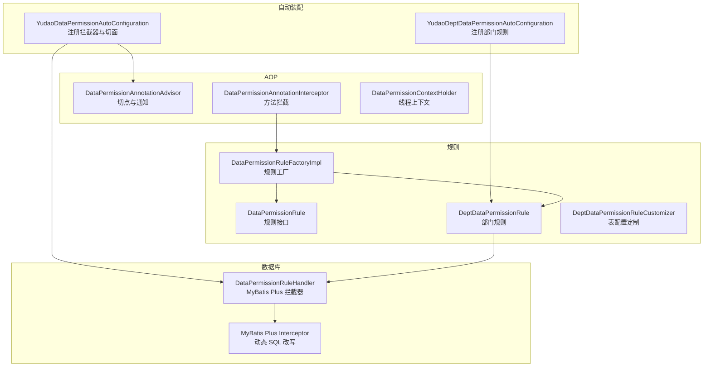
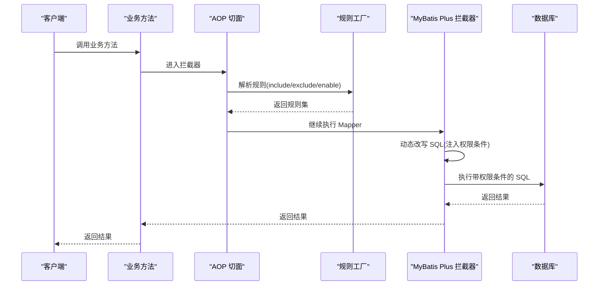
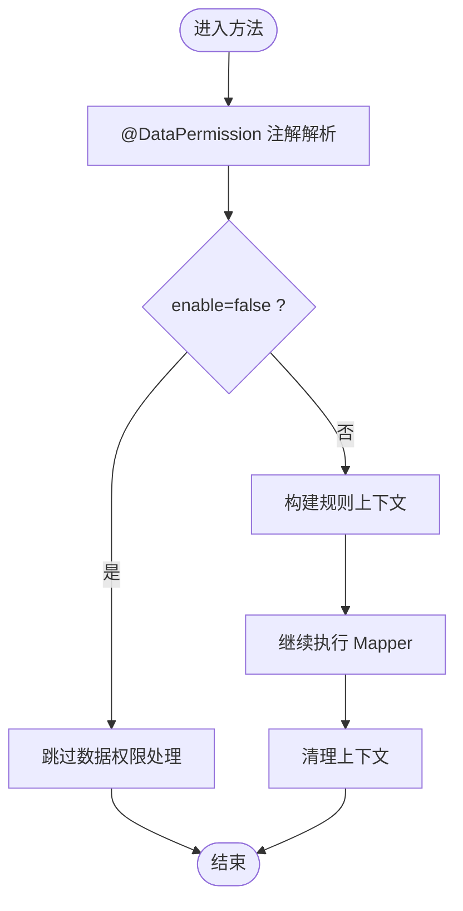
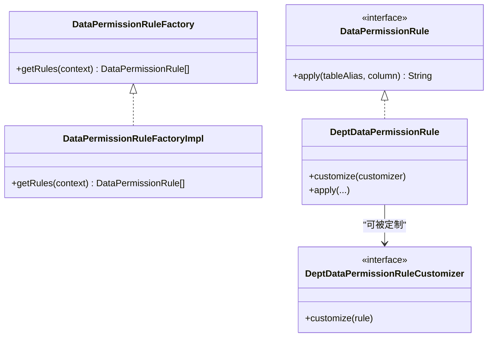
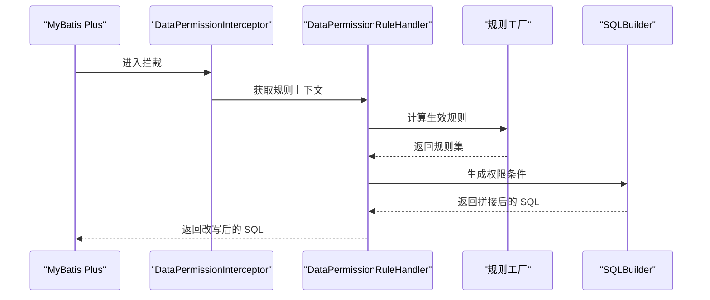
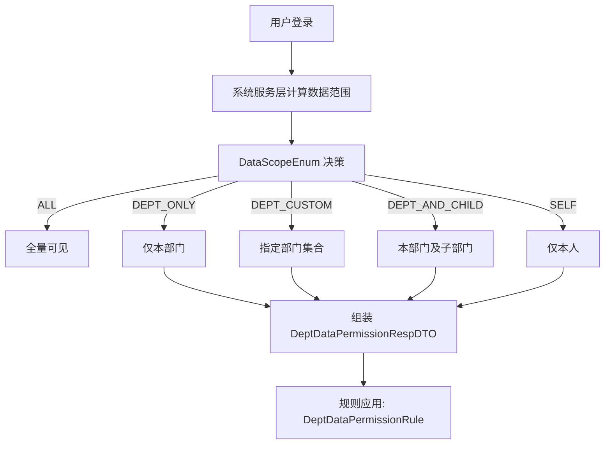
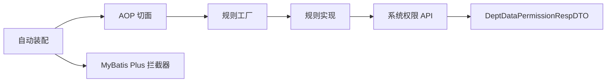

# 数据权限组件

<cite>
**本文引用的文件**
- [DataPermission.java](file://yudao-framework/yudao-spring-boot-starter-biz-data-permission/src/main/java/cn/iocoder/yudao/framework/datapermission/core/annotation/DataPermission.java)
- [YudaoDataPermissionAutoConfiguration.java](file://yudao-framework/yudao-spring-boot-starter-biz-data-permission/src/main/java/cn/iocoder/yudao/framework/datapermission/config/YudaoDataPermissionAutoConfiguration.java)
- [YudaoDeptDataPermissionAutoConfiguration.java](file://yudao-framework/yudao-spring-boot-starter-biz-data-permission/src/main/java/cn/iocoder/yudao/framework/datapermission/config/YudaoDeptDataPermissionAutoConfiguration.java)
- [DataPermissionAnnotationAdvisor.java](file://yudao-framework/yudao-spring-boot-starter-biz-data-permission/src/main/java/cn/iocoder/yudao/framework/datapermission/core/aop/DataPermissionAnnotationAdvisor.java)
- [DataPermissionAnnotationInterceptor.java](file://yudao-framework/yudao-spring-boot-starter-biz-data-permission/src/main/java/cn/iocoder/yudao/framework/datapermission/core/aop/DataPermissionAnnotationInterceptor.java)
- [DataPermissionContextHolder.java](file://yudao-framework/yudao-spring-boot-starter-biz-data-permission/src/main/java/cn/iocoder/yudao/framework/datapermission/core/aop/DataPermissionContextHolder.java)
- [DataPermissionRuleHandler.java](file://yudao-framework/yudao-spring-boot-starter-biz-data-permission/src/main/java/cn/iocoder/yudao/framework/datapermission/core/db/DataPermissionRuleHandler.java)
- [DataPermissionRuleFactory.java](file://yudao-framework/yudao-spring-boot-starter-biz-data-permission/src/main/java/cn/iocoder/yudao/framework/datapermission/core/rule/DataPermissionRuleFactory.java)
- [DataPermissionRuleFactoryImpl.java](file://yudao-framework/yudao-spring-boot-starter-biz-data-permission/src/main/java/cn/iocoder/yudao/framework/datapermission/core/rule/DataPermissionRuleFactoryImpl.java)
- [DataPermissionRule.java](file://yudao-framework/yudao-spring-boot-starter-biz-data-permission/src/main/java/cn/iocoder/yudao/framework/datapermission/core/rule/DataPermissionRule.java)
- [DeptDataPermissionRule.java](file://yudao-framework/yudao-spring-boot-starter-biz-data-permission/src/main/java/cn/iocoder/yudao/framework/datapermission/core/rule/dept/DeptDataPermissionRule.java)
- [DeptDataPermissionRuleCustomizer.java](file://yudao-framework/yudao-spring-boot-starter-biz-data-permission/src/main/java/cn/iocoder/yudao/framework/datapermission/core/rule/dept/DeptDataPermissionRuleCustomizer.java)
- [DataPermissionUtils.java](file://yudao-framework/yudao-spring-boot-starter-biz-data-permission/src/main/java/cn/iocoder/yudao/framework/datapermission/core/util/DataPermissionUtils.java)
- [DataScopeEnum.java](file://yudao-module-system/src/main/java/cn/iocoder/yudao/module/system/enums/permission/DataScopeEnum.java)
- [PermissionApiImpl.java](file://yudao-module-system/src/main/java/cn/iocoder/yudao/module/system/api/permission/PermissionApiImpl.java)
- [PermissionApi.java](file://yudao-module-system/src/main/java/cn/iocoder/yudao/module/system/api/permission/PermissionApi.java)
- [PermissionServiceImpl.java](file://yudao-module-system/src/main/java/cn/iocoder/yudao/module/system/service/permission/PermissionServiceImpl.java)
- [DeptDataPermissionRespDTO.java](file://yudao-framework/yudao-common/src/main/java/cn/iocoder/yudao/framework/common/biz/system/permission/dto/DeptDataPermissionRespDTO.java)
</cite>

## 目录
1. [简介](#简介)
2. [项目结构](#项目结构)
3. [核心组件](#核心组件)
4. [架构总览](#架构总览)
5. [详细组件分析](#详细组件分析)
6. [依赖关系分析](#依赖关系分析)
7. [性能考量](#性能考量)
8. [故障排查指南](#故障排查指南)
9. [结论](#结论)
10. [附录](#附录)

## 简介
本文件系统性阐述数据权限组件的实现原理与使用方法，覆盖动态数据权限过滤机制、权限规则配置与继承策略、@DataPermission 注解的参数与优先级、AOP 切面拦截器与 SQL 注入点、MyBatis Plus 集成方式、以及典型业务场景（销售数据权限控制、客户信息访问限制）的应用实践。目标是帮助开发者快速理解并正确使用该组件。

## 项目结构
数据权限组件位于 yudao-framework 子模块中，采用“自动装配 + AOP + 规则工厂 + MyBatis Plus 拦截器”的分层设计：
- 自动装配：负责注册 AOP 切面与 MyBatis Plus 拦截器，并按顺序插入。
- AOP 层：通过注解解析与上下文传递，决定方法调用是否启用数据权限。
- 规则层：以规则工厂统一管理内置与自定义规则，支持优先级与排除策略。
- DB 层：基于 MyBatis Plus Interceptor 动态改写 SQL，注入权限条件。

图表来源
- [YudaoDataPermissionAutoConfiguration.java:29-46](file://yudao-framework/yudao-spring-boot-starter-biz-data-permission/src/main/java/cn/iocoder/yudao/framework/datapermission/config/YudaoDataPermissionAutoConfiguration.java#L29-L46)
- [YudaoDeptDataPermissionAutoConfiguration.java:24-32](file://yudao-framework/yudao-spring-boot-starter-biz-data-permission/src/main/java/cn/iocoder/yudao/framework/datapermission/config/YudaoDeptDataPermissionAutoConfiguration.java#L24-L32)
- [DataPermissionAnnotationAdvisor.java:18](file://yudao-framework/yudao-spring-boot-starter-biz-data-permission/src/main/java/cn/iocoder/yudao/framework/datapermission/core/aop/DataPermissionAnnotationAdvisor.java#L18)
- [DataPermissionAnnotationInterceptor.java:21](file://yudao-framework/yudao-spring-boot-starter-biz-data-permission/src/main/java/cn/iocoder/yudao/framework/datapermission/core/aop/DataPermissionAnnotationInterceptor.java#L21)
- [DataPermissionContextHolder.java:13](file://yudao-framework/yudao-spring-boot-starter-biz-data-permission/src/main/java/cn/iocoder/yudao/framework/datapermission/core/aop/DataPermissionContextHolder.java#L13)
- [DataPermissionRuleFactoryImpl.java:20](file://yudao-framework/yudao-spring-boot-starter-biz-data-permission/src/main/java/cn/iocoder/yudao/framework/datapermission/core/rule/DataPermissionRuleFactoryImpl.java#L20)
- [DeptDataPermissionRule.java](file://yudao-framework/yudao-spring-boot-starter-biz-data-permission/src/main/java/cn/iocoder/yudao/framework/datapermission/core/rule/dept/DeptDataPermissionRule.java)
- [DeptDataPermissionRuleCustomizer.java](file://yudao-framework/yudao-spring-boot-starter-biz-data-permission/src/main/java/cn/iocoder/yudao/framework/datapermission/core/rule/dept/DeptDataPermissionRuleCustomizer.java)
- [DataPermissionRuleHandler.java:25](file://yudao-framework/yudao-spring-boot-starter-biz-data-permission/src/main/java/cn/iocoder/yudao/framework/datapermission/core/db/DataPermissionRuleHandler.java#L25)

章节来源
- [YudaoDataPermissionAutoConfiguration.java:29-46](file://yudao-framework/yudao-spring-boot-starter-biz-data-permission/src/main/java/cn/iocoder/yudao/framework/datapermission/config/YudaoDataPermissionAutoConfiguration.java#L29-L46)
- [YudaoDeptDataPermissionAutoConfiguration.java:24-32](file://yudao-framework/yudao-spring-boot-starter-biz-data-permission/src/main/java/cn/iocoder/yudao/framework/datapermission/config/YudaoDeptDataPermissionAutoConfiguration.java#L24-L32)

## 核心组件
- 注解驱动：@DataPermission 提供 enable/includeRules/excludeRules 三类控制，支持类级别与方法级别生效。
- AOP 切面：通过 AnnotationAwareAspectJAutoProxyCreator 注册 Advisor/Interceptor，在方法执行前后注入/清理数据权限上下文。
- 规则工厂：集中管理规则实例，支持优先级 includeRules > 默认 > excludeRules。
- MyBatis Plus 拦截器：在 SQL 查询阶段动态拼接权限条件，确保数据访问边界。

章节来源
- [DataPermission.java:13-35](file://yudao-framework/yudao-spring-boot-starter-biz-data-permission/src/main/java/cn/iocoder/yudao/framework/datapermission/core/annotation/DataPermission.java#L13-L35)
- [DataPermissionAnnotationAdvisor.java:18](file://yudao-framework/yudao-spring-boot-starter-biz-data-permission/src/main/java/cn/iocoder/yudao/framework/datapermission/core/aop/DataPermissionAnnotationAdvisor.java#L18)
- [DataPermissionAnnotationInterceptor.java:21](file://yudao-framework/yudao-spring-boot-starter-biz-data-permission/src/main/java/cn/iocoder/yudao/framework/datapermission/core/aop/DataPermissionAnnotationInterceptor.java#L21)
- [DataPermissionRuleFactoryImpl.java:20](file://yudao-framework/yudao-spring-boot-starter-biz-data-permission/src/main/java/cn/iocoder/yudao/framework/datapermission/core/rule/DataPermissionRuleFactoryImpl.java#L20)
- [DataPermissionRuleHandler.java:25](file://yudao-framework/yudao-spring-boot-starter-biz-data-permission/src/main/java/cn/iocoder/yudao/framework/datapermission/core/db/DataPermissionRuleHandler.java#L25)

## 架构总览
下图展示从方法调用到 SQL 执行期间，数据权限如何贯穿 AOP 与 MyBatis Plus 拦截器链路。

图表来源
- [DataPermissionAnnotationInterceptor.java:21](file://yudao-framework/yudao-spring-boot-starter-biz-data-permission/src/main/java/cn/iocoder/yudao/framework/datapermission/core/aop/DataPermissionAnnotationInterceptor.java#L21)
- [DataPermissionRuleFactoryImpl.java:20](file://yudao-framework/yudao-spring-boot-starter-biz-data-permission/src/main/java/cn/iocoder/yudao/framework/datapermission/core/rule/DataPermissionRuleFactoryImpl.java#L20)
- [DataPermissionRuleHandler.java:25](file://yudao-framework/yudao-spring-boot-starter-biz-data-permission/src/main/java/cn/iocoder/yudao/framework/datapermission/core/db/DataPermissionRuleHandler.java#L25)

## 详细组件分析

### 注解 @DataPermission 使用指南
- 作用范围：类级别与方法级别均可使用，方法级别优先于类级别。
- 关键参数
  - enable：默认开启，显式设为 false 可禁用。
  - includeRules：明确指定启用的规则集合，优先级最高。
  - excludeRules：明确排除的规则集合，优先级最低。
- 优先级策略：includeRules > 默认规则集 > excludeRules；当 includeRules 非空时，excludeRules 不生效。

章节来源
- [DataPermission.java:13-35](file://yudao-framework/yudao-spring-boot-starter-biz-data-permission/src/main/java/cn/iocoder/yudao/framework/datapermission/core/annotation/DataPermission.java#L13-L35)

### AOP 切面与拦截器工作原理
- 切点与通知：Advisor 将拦截标注了 @DataPermission 的方法，交由 Interceptor 处理。
- 上下文管理：通过 ThreadLocal 的 DataPermissionContextHolder 在方法执行前后设置/清理上下文，保证规则解析与 SQL 改写的一致性。
- 方法拦截流程：进入方法时解析注解与规则工厂，离开方法时清理上下文，避免污染其他请求。

图表来源
- [DataPermissionAnnotationAdvisor.java:18](file://yudao-framework/yudao-spring-boot-starter-biz-data-permission/src/main/java/cn/iocoder/yudao/framework/datapermission/core/aop/DataPermissionAnnotationAdvisor.java#L18)
- [DataPermissionAnnotationInterceptor.java:21](file://yudao-framework/yudao-spring-boot-starter-biz-data-permission/src/main/java/cn/iocoder/yudao/framework/datapermission/core/aop/DataPermissionAnnotationInterceptor.java#L21)
- [DataPermissionContextHolder.java:13](file://yudao-framework/yudao-spring-boot-starter-biz-data-permission/src/main/java/cn/iocoder/yudao/framework/datapermission/core/aop/DataPermissionContextHolder.java#L13)

章节来源
- [DataPermissionAnnotationAdvisor.java:18](file://yudao-framework/yudao-spring-boot-starter-biz-data-permission/src/main/java/cn/iocoder/yudao/framework/datapermission/core/aop/DataPermissionAnnotationAdvisor.java#L18)
- [DataPermissionAnnotationInterceptor.java:21](file://yudao-framework/yudao-spring-boot-starter-biz-data-permission/src/main/java/cn/iocoder/yudao/framework/datapermission/core/aop/DataPermissionAnnotationInterceptor.java#L21)
- [DataPermissionContextHolder.java:13](file://yudao-framework/yudao-spring-boot-starter-biz-data-permission/src/main/java/cn/iocoder/yudao/framework/datapermission/core/aop/DataPermissionContextHolder.java#L13)

### 规则工厂与规则继承策略
- 工厂职责：统一创建与聚合规则实例，支持 includeRules/excludeRules 的优先级合并。
- 继承策略：规则接口定义通用能力，具体规则（如部门规则）实现各自的数据范围计算逻辑。
- 自定义扩展：通过 DeptDataPermissionRuleCustomizer 为部门规则补充表字段映射等配置。

图表来源
- [DataPermissionRuleFactory.java](file://yudao-framework/yudao-spring-boot-starter-biz-data-permission/src/main/java/cn/iocoder/yudao/framework/datapermission/core/rule/DataPermissionRuleFactory.java)
- [DataPermissionRuleFactoryImpl.java:20](file://yudao-framework/yudao-spring-boot-starter-biz-data-permission/src/main/java/cn/iocoder/yudao/framework/datapermission/core/rule/DataPermissionRuleFactoryImpl.java#L20)
- [DataPermissionRule.java](file://yudao-framework/yudao-spring-boot-starter-biz-data-permission/src/main/java/cn/iocoder/yudao/framework/datapermission/core/rule/DataPermissionRule.java)
- [DeptDataPermissionRule.java](file://yudao-framework/yudao-spring-boot-starter-biz-data-permission/src/main/java/cn/iocoder/yudao/framework/datapermission/core/rule/dept/DeptDataPermissionRule.java)
- [DeptDataPermissionRuleCustomizer.java](file://yudao-framework/yudao-spring-boot-starter-biz-data-permission/src/main/java/cn/iocoder/yudao/framework/datapermission/core/rule/dept/DeptDataPermissionRuleCustomizer.java)

章节来源
- [DataPermissionRuleFactoryImpl.java:20](file://yudao-framework/yudao-spring-boot-starter-biz-data-permission/src/main/java/cn/iocoder/yudao/framework/datapermission/core/rule/DataPermissionRuleFactoryImpl.java#L20)
- [DeptDataPermissionRule.java](file://yudao-framework/yudao-spring-boot-starter-biz-data-permission/src/main/java/cn/iocoder/yudao/framework/datapermission/core/rule/dept/DeptDataPermissionRule.java)
- [DeptDataPermissionRuleCustomizer.java](file://yudao-framework/yudao-spring-boot-starter-biz-data-permission/src/main/java/cn/iocoder/yudao/framework/datapermission/core/rule/dept/DeptDataPermissionRuleCustomizer.java)

### MyBatis Plus 集成与动态 SQL 构建
- 拦截器注册：自动装配将 DataPermissionRuleHandler 包装为 DataPermissionInterceptor，并插入到 MyBatis Plus Interceptor 链首，确保在分页之前执行。
- SQL 注入点：拦截器根据当前上下文与规则工厂生成的条件，对查询 SQL 进行动态改写，注入 WHERE 或 JOIN 条件。
- 顺序要求：必须置于分页插件之前，以避免越权导致的分页数量异常。

图表来源
- [YudaoDataPermissionAutoConfiguration.java:29-46](file://yudao-framework/yudao-spring-boot-starter-biz-data-permission/src/main/java/cn/iocoder/yudao/framework/datapermission/config/YudaoDataPermissionAutoConfiguration.java#L29-L46)
- [DataPermissionRuleHandler.java:25](file://yudao-framework/yudao-spring-boot-starter-biz-data-permission/src/main/java/cn/iocoder/yudao/framework/datapermission/core/db/DataPermissionRuleHandler.java#L25)

章节来源
- [YudaoDataPermissionAutoConfiguration.java:29-46](file://yudao-framework/yudao-spring-boot-starter-biz-data-permission/src/main/java/cn/iocoder/yudao/framework/datapermission/config/YudaoDataPermissionAutoConfiguration.java#L29-L46)
- [DataPermissionRuleHandler.java:25](file://yudao-framework/yudao-spring-boot-starter-biz-data-permission/src/main/java/cn/iocoder/yudao/framework/datapermission/core/db/DataPermissionRuleHandler.java#L25)

### 数据权限规则实现示例

#### 部门权限规则
- 规则来源：DeptDataPermissionRule，结合系统侧的部门数据权限计算结果。
- 权限来源：系统服务层根据用户角色与数据范围枚举计算部门集合，返回 DeptDataPermissionRespDTO。
- 规则定制：通过 DeptDataPermissionRuleCustomizer 为不同表补充字段映射与表名配置。

图表来源
- [DataScopeEnum.java:18-26](file://yudao-module-system/src/main/java/cn/iocoder/yudao/module/system/enums/permission/DataScopeEnum.java#L18-L26)
- [DeptDataPermissionRespDTO.java:14-35](file://yudao-framework/yudao-common/src/main/java/cn/iocoder/yudao/framework/common/biz/system/permission/dto/DeptDataPermissionRespDTO.java#L14-L35)
- [PermissionServiceImpl.java:311-335](file://yudao-module-system/src/main/java/cn/iocoder/yudao/module/system/service/permission/PermissionServiceImpl.java#L311-L335)
- [DeptDataPermissionRule.java](file://yudao-framework/yudao-spring-boot-starter-biz-data-permission/src/main/java/cn/iocoder/yudao/framework/datapermission/core/rule/dept/DeptDataPermissionRule.java)

章节来源
- [DataScopeEnum.java:18-26](file://yudao-module-system/src/main/java/cn/iocoder/yudao/module/system/enums/permission/DataScopeEnum.java#L18-L26)
- [DeptDataPermissionRespDTO.java:14-35](file://yudao-framework/yudao-common/src/main/java/cn/iocoder/yudao/framework/common/biz/system/permission/dto/DeptDataPermissionRespDTO.java#L14-L35)
- [PermissionServiceImpl.java:311-335](file://yudao-module-system/src/main/java/cn/iocoder/yudao/module/system/service/permission/PermissionServiceImpl.java#L311-L335)
- [DeptDataPermissionRule.java](file://yudao-framework/yudao-spring-boot-starter-biz-data-permission/src/main/java/cn/iocoder/yudao/framework/datapermission/core/rule/dept/DeptDataPermissionRule.java)

#### 岗位权限与个人数据权限
- 岗位权限：通常与部门权限组合使用，通过 DeptDataPermissionRuleCustomizer 为涉及岗位的表增加岗位字段映射，再由规则工厂在 SQL 中拼接岗位维度条件。
- 个人数据权限：当数据范围为 SELF 时，规则会在 SQL 中追加“用户 ID=当前登录用户”条件，确保只能看到自己的数据。

章节来源
- [DeptDataPermissionRuleCustomizer.java](file://yudao-framework/yudao-spring-boot-starter-biz-data-permission/src/main/java/cn/iocoder/yudao/framework/datapermission/core/rule/dept/DeptDataPermissionRuleCustomizer.java)
- [DataPermissionRuleFactoryImpl.java:20](file://yudao-framework/yudao-spring-boot-starter-biz-data-permission/src/main/java/cn/iocoder/yudao/framework/datapermission/core/rule/DataPermissionRuleFactoryImpl.java#L20)

### 业务场景应用案例

#### 销售数据权限控制
- 场景描述：销售报表需要按销售人员所属部门/岗位/本人进行数据隔离。
- 实施要点：
  - 在销售相关 Mapper 或 Service 类/方法上使用 @DataPermission，includeRules 指向部门规则。
  - 若需支持“本人”维度，可在规则工厂中加入个人数据规则。
  - 通过 DeptDataPermissionRuleCustomizer 为销售订单表补充部门/岗位字段映射。

章节来源
- [DataPermission.java:28-33](file://yudao-framework/yudao-spring-boot-starter-biz-data-permission/src/main/java/cn/iocoder/yudao/framework/datapermission/core/annotation/DataPermission.java#L28-L33)
- [DeptDataPermissionRuleCustomizer.java](file://yudao-framework/yudao-spring-boot-starter-biz-data-permission/src/main/java/cn/iocoder/yudao/framework/datapermission/core/rule/dept/DeptDataPermissionRuleCustomizer.java)

#### 客户信息访问限制
- 场景描述：客户数据仅能被归属部门内的人员查看。
- 实施要点：
  - 使用 @DataPermission 启用部门规则。
  - 系统侧通过 DataScopeEnum.DEPT_ONLY/DEPT_AND_CHILD 等策略计算可访问部门集合。
  - 规则在 SQL 中追加部门 IN 条件，确保跨部门不可见。

章节来源
- [DataScopeEnum.java:20-26](file://yudao-module-system/src/main/java/cn/iocoder/yudao/module/system/enums/permission/DataScopeEnum.java#L20-L26)
- [DeptDataPermissionRule.java](file://yudao-framework/yudao-spring-boot-starter-biz-data-permission/src/main/java/cn/iocoder/yudao/framework/datapermission/core/rule/dept/DeptDataPermissionRule.java)

## 依赖关系分析
- 组件耦合
  - 自动装配依赖 MyBatis Plus Interceptor 与规则工厂。
  - AOP 依赖注解与规则工厂；规则依赖系统权限 API。
  - 规则依赖系统侧数据范围计算结果（DeptDataPermissionRespDTO）。
- 外部依赖
  - Spring AOP 与自动装配机制。
  - MyBatis Plus 拦截器链与 SQL 改写能力。
  - 登录用户上下文（LoginUser）与权限 API。

图表来源
- [YudaoDataPermissionAutoConfiguration.java:29-46](file://yudao-framework/yudao-spring-boot-starter-biz-data-permission/src/main/java/cn/iocoder/yudao/framework/datapermission/config/YudaoDataPermissionAutoConfiguration.java#L29-L46)
- [YudaoDeptDataPermissionAutoConfiguration.java:24-32](file://yudao-framework/yudao-spring-boot-starter-biz-data-permission/src/main/java/cn/iocoder/yudao/framework/datapermission/config/YudaoDeptDataPermissionAutoConfiguration.java#L24-L32)
- [PermissionApiImpl.java:38-40](file://yudao-module-system/src/main/java/cn/iocoder/yudao/module/system/api/permission/PermissionApiImpl.java#L38-L40)
- [DeptDataPermissionRespDTO.java:14-35](file://yudao-framework/yudao-common/src/main/java/cn/iocoder/yudao/framework/common/biz/system/permission/dto/DeptDataPermissionRespDTO.java#L14-L35)

章节来源
- [YudaoDataPermissionAutoConfiguration.java:29-46](file://yudao-framework/yudao-spring-boot-starter-biz-data-permission/src/main/java/cn/iocoder/yudao/framework/datapermission/config/YudaoDataPermissionAutoConfiguration.java#L29-L46)
- [YudaoDeptDataPermissionAutoConfiguration.java:24-32](file://yudao-framework/yudao-spring-boot-starter-biz-data-permission/src/main/java/cn/iocoder/yudao/framework/datapermission/config/YudaoDeptDataPermissionAutoConfiguration.java#L24-L32)
- [PermissionApiImpl.java:38-40](file://yudao-module-system/src/main/java/cn/iocoder/yudao/module/system/api/permission/PermissionApiImpl.java#L38-L40)
- [DeptDataPermissionRespDTO.java:14-35](file://yudao-framework/yudao-common/src/main/java/cn/iocoder/yudao/framework/common/biz/system/permission/dto/DeptDataPermissionRespDTO.java#L14-L35)

## 性能考量
- 规则解析缓存：建议在规则工厂与系统权限 API 层引入缓存，减少重复计算与查询。
- SQL 改写成本：尽量将规则条件简化为索引友好的形式，避免复杂函数导致的全表扫描。
- AOP 开销：仅在标注 @DataPermission 的方法上生效，避免全局切面带来的额外开销。
- 插件顺序：确保拦截器在分页插件之前，避免因越权导致的分页统计偏差。

## 故障排查指南
- 现象：查询结果为空或越权可见
  - 检查 @DataPermission 注解的 enable/includeRules/excludeRules 配置是否正确。
  - 确认系统侧数据范围计算（DataScopeEnum）与 DeptDataPermissionRespDTO 是否符合预期。
- 现象：SQL 性能下降
  - 检查规则生成的 WHERE 条件是否命中索引。
  - 确认拦截器顺序是否正确（需在分页插件之前）。
- 现象：AOP 未生效
  - 确认方法是否被 Spring 代理，避免同类内部调用导致 AOP 失效。
  - 检查注解是否正确放置在类或方法上。

章节来源
- [DataPermission.java:23-33](file://yudao-framework/yudao-spring-boot-starter-biz-data-permission/src/main/java/cn/iocoder/yudao/framework/datapermission/core/annotation/DataPermission.java#L23-L33)
- [YudaoDataPermissionAutoConfiguration.java:36-37](file://yudao-framework/yudao-spring-boot-starter-biz-data-permission/src/main/java/cn/iocoder/yudao/framework/datapermission/config/YudaoDataPermissionAutoConfiguration.java#L36-L37)
- [PermissionServiceImpl.java:311-335](file://yudao-module-system/src/main/java/cn/iocoder/yudao/module/system/service/permission/PermissionServiceImpl.java#L311-L335)

## 结论
数据权限组件通过注解驱动、AOP 切面与 MyBatis Plus 拦截器的协同，实现了灵活且高性能的数据访问控制。借助规则工厂与系统权限 API，可快速适配部门、岗位、个人等多维权限模型，并在不侵入业务代码的前提下完成动态 SQL 注入。建议在生产环境中结合缓存与索引优化，确保安全与性能的平衡。

## 附录
- 快速上手清单
  - 在需要控制的类或方法上添加 @DataPermission，并合理配置 enable/includeRules/excludeRules。
  - 确保自动装配已启用，拦截器与切面正常注册。
  - 通过 DeptDataPermissionRuleCustomizer 为相关表补充字段映射。
  - 在系统侧完善数据范围计算逻辑，返回 DeptDataPermissionRespDTO。