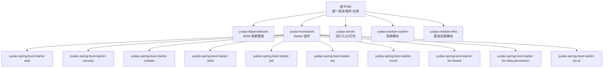
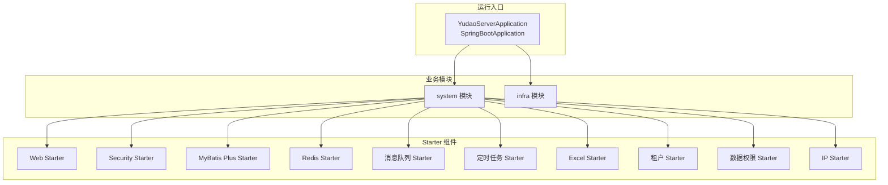
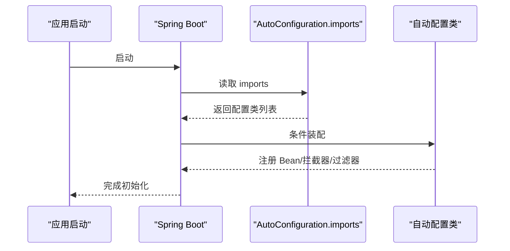
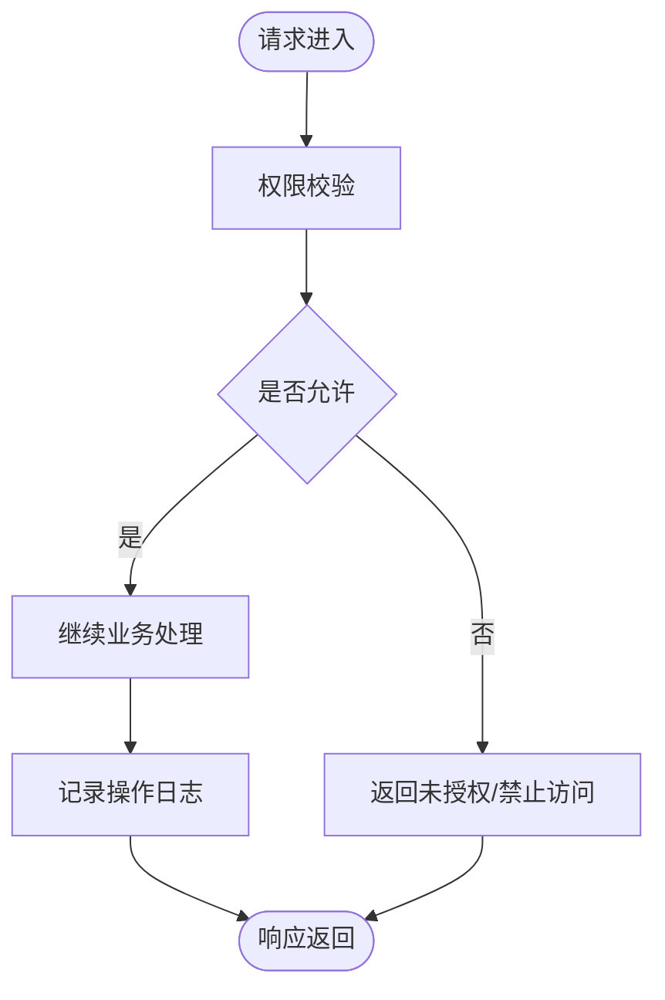
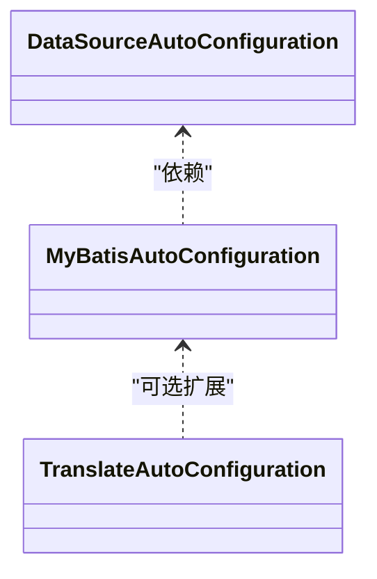
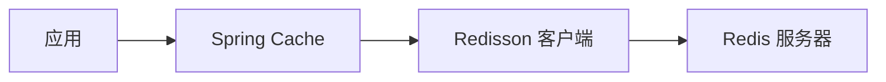
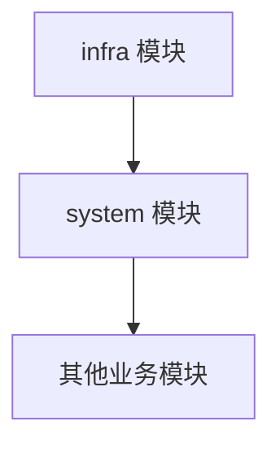
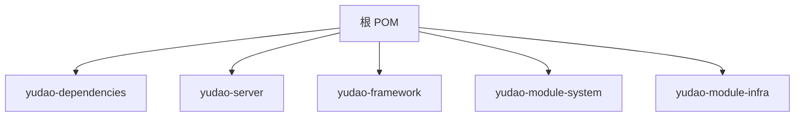

# 后端开发指南

<cite>
**本文引用的文件**   
- [pom.xml](file://pom.xml)
- [yudao-server/pom.xml](file://yudao-server/pom.xml)
- [yudao-server/src/main/java/cn/iocoder/yudao/server/YudaoServerApplication.java](file://yudao-server/src/main/java/cn/iocoder/yudao/server/YudaoServerApplication.java)
- [yudao-framework/pom.xml](file://yudao-framework/pom.xml)
- [yudao-dependencies/pom.xml](file://yudao-dependencies/pom.xml)
- [yudao-framework/yudao-spring-boot-starter-web/pom.xml](file://yudao-framework/yudao-spring-boot-starter-web/pom.xml)
- [yudao-framework/yudao-spring-boot-starter-security/pom.xml](file://yudao-framework/yudao-spring-boot-starter-security/pom.xml)
- [yudao-framework/yudao-spring-boot-starter-mybatis/pom.xml](file://yudao-framework/yudao-spring-boot-starter-mybatis/pom.xml)
- [yudao-framework/yudao-spring-boot-starter-redis/pom.xml](file://yudao-framework/yudao-spring-boot-starter-redis/pom.xml)
- [yudao-module-system/pom.xml](file://yudao-module-system/pom.xml)
- [yudao-framework/yudao-spring-boot-starter-web/src/main/resources/META-INF/spring/org.springframework.boot.autoconfigure.AutoConfiguration.imports](file://yudao-framework/yudao-spring-boot-starter-web/src/main/resources/META-INF/spring/org.springframework.boot.autoconfigure.AutoConfiguration.imports)
- [yudao-framework/yudao-spring-boot-starter-security/src/main/resources/META-INF/spring/org.springframework.boot.autoconfigure.AutoConfiguration.imports](file://yudao-framework/yudao-spring-boot-starter-security/src/main/resources/META-INF/spring/org.springframework.boot.autoconfigure.AutoConfiguration.imports)
- [yudao-framework/yudao-spring-boot-starter-mybatis/src/main/resources/META-INF/spring/org.springframework.boot.autoconfigure.AutoConfiguration.imports](file://yudao-framework/yudao-spring-boot-starter-mybatis/src/main/resources/META-INF/spring/org.springframework.boot.autoconfigure.AutoConfiguration.imports)
</cite>

## 目录
1. [简介](#简介)
2. [项目结构](#项目结构)
3. [核心组件](#核心组件)
4. [架构总览](#架构总览)
5. [详细组件分析](#详细组件分析)
6. [依赖分析](#依赖分析)
7. [性能考虑](#性能考虑)
8. [故障排查指南](#故障排查指南)
9. [结论](#结论)
10. [附录](#附录)

## 简介
本指南面向芋道 ruoyi-vue-pro 后端开发者，系统讲解 Spring Boot 核心配置与自动配置原理、Starter 模式与自定义配置、多模块架构设计、核心框架组件（Spring Security、MyBatis Plus、Redis、消息队列等）的使用方式、业务模块开发规范与最佳实践、代码生成器用法、单元测试编写与覆盖率要求、性能优化与安全编码规范。目标是帮助你在不深入源码的前提下，也能高效地进行二次开发与维护。

## 项目结构
ruoyi-vue-pro 采用多模块聚合工程，根 POM 负责统一版本与插件管理；yudao-framework 提供可复用的 Starter 组件；yudao-module-* 为业务模块；yudao-server 作为打包运行的聚合入口。

**图表来源**
- [pom.xml:10-31](file://pom.xml#L10-L31)
- [yudao-framework/pom.xml:12-31](file://yudao-framework/pom.xml#L12-L31)

**章节来源**
- [pom.xml:10-31](file://pom.xml#L10-L31)
- [yudao-framework/pom.xml:12-31](file://yudao-framework/pom.xml#L12-L31)

## 核心组件
- yudao-dependencies：集中管理所有依赖版本，确保跨模块一致性。
- yudao-framework：提供 Web、安全、MyBatis、Redis、定时任务、消息队列、Excel、业务组件（租户、数据权限、IP）等 Starter。
- yudao-module-system：系统管理模块，包含用户、部门、权限、字典、操作日志等通用能力。
- yudao-module-infra：基础设施模块，提供文件、代码生成、短信、任务调度、WebSocket 等能力。
- yudao-server：运行入口，按需引入各业务模块，打包为可执行 JAR。

**章节来源**
- [yudao-dependencies/pom.xml:85-706](file://yudao-dependencies/pom.xml#L85-L706)
- [yudao-framework/pom.xml:33-46](file://yudao-framework/pom.xml#L33-L46)
- [yudao-module-system/pom.xml:20-122](file://yudao-module-system/pom.xml#L20-L122)
- [yudao-server/pom.xml:23-145](file://yudao-server/pom.xml#L23-L145)

## 架构总览
系统以“Starter 组件 + 业务模块 + 运行入口”三层架构组织。Starter 通过 AutoConfiguration.imports 自动装配，业务模块按需组合，运行入口统一打包。

**图表来源**
- [yudao-server/src/main/java/cn/iocoder/yudao/server/YudaoServerApplication.java:16](file://yudao-server/src/main/java/cn/iocoder/yudao/server/YudaoServerApplication.java#L16)
- [yudao-module-system/pom.xml:20-122](file://yudao-module-system/pom.xml#L20-L122)
- [yudao-framework/yudao-spring-boot-starter-web/pom.xml:18-79](file://yudao-framework/yudao-spring-boot-starter-web/pom.xml#L18-L79)
- [yudao-framework/yudao-spring-boot-starter-security/pom.xml:21-62](file://yudao-framework/yudao-spring-boot-starter-security/pom.xml#L21-L62)
- [yudao-framework/yudao-spring-boot-starter-mybatis/pom.xml:18-115](file://yudao-framework/yudao-spring-boot-starter-mybatis/pom.xml#L18-L115)
- [yudao-framework/yudao-spring-boot-starter-redis/pom.xml:18-39](file://yudao-framework/yudao-spring-boot-starter-redis/pom.xml#L18-L39)

## 详细组件分析

### Spring Boot 自动配置与 Starter 模式
- 自动配置入口：各 Starter 在 META-INF/spring 下提供 AutoConfiguration.imports，声明自动配置类，Spring Boot 启动时自动加载。
- Web Starter：注册 API 日志、Jackson、Swagger、XSS、Banner、加密等自动配置。
- Security Starter：注册安全自动配置、WebSecurityConfigurerAdapter、操作日志配置。
- MyBatis Plus Starter：注册数据源、MyBatis、翻译等自动配置。

**图表来源**
- [yudao-framework/yudao-spring-boot-starter-web/src/main/resources/META-INF/spring/org.springframework.boot.autoconfigure.AutoConfiguration.imports:1-7](file://yudao-framework/yudao-spring-boot-starter-web/src/main/resources/META-INF/spring/org.springframework.boot.autoconfigure.AutoConfiguration.imports#L1-L7)
- [yudao-framework/yudao-spring-boot-starter-security/src/main/resources/META-INF/spring/org.springframework.boot.autoconfigure.AutoConfiguration.imports:1-3](file://yudao-framework/yudao-spring-boot-starter-security/src/main/resources/META-INF/spring/org.springframework.boot.autoconfigure.AutoConfiguration.imports#L1-L3)
- [yudao-framework/yudao-spring-boot-starter-mybatis/src/main/resources/META-INF/spring/org.springframework.boot.autoconfigure.AutoConfiguration.imports:1-3](file://yudao-framework/yudao-spring-boot-starter-mybatis/src/main/resources/META-INF/spring/org.springframework.boot.autoconfigure.AutoConfiguration.imports#L1-L3)

**章节来源**
- [yudao-framework/yudao-spring-boot-starter-web/src/main/resources/META-INF/spring/org.springframework.boot.autoconfigure.AutoConfiguration.imports:1-7](file://yudao-framework/yudao-spring-boot-starter-web/src/main/resources/META-INF/spring/org.springframework.boot.autoconfigure.AutoConfiguration.imports#L1-L7)
- [yudao-framework/yudao-spring-boot-starter-security/src/main/resources/META-INF/spring/org.springframework.boot.autoconfigure.AutoConfiguration.imports:1-3](file://yudao-framework/yudao-spring-boot-starter-security/src/main/resources/META-INF/spring/org.springframework.boot.autoconfigure.AutoConfiguration.imports#L1-L3)
- [yudao-framework/yudao-spring-boot-starter-mybatis/src/main/resources/META-INF/spring/org.springframework.boot.autoconfigure.AutoConfiguration.imports:1-3](file://yudao-framework/yudao-spring-boot-starter-mybatis/src/main/resources/META-INF/spring/org.springframework.boot.autoconfigure.AutoConfiguration.imports#L1-L3)

### Spring Security 安全框架
- 认证与授权：基于 Spring Security，结合业务注解与操作日志，实现“谁”可以做“什么事”的控制。
- 集成方式：在业务模块中引入 yudao-spring-boot-starter-security，即可启用安全自动配置与操作日志。
- 最佳实践：将鉴权逻辑集中在切面或拦截器中，配合统一异常处理与返回码体系。

**图表来源**
- [yudao-framework/yudao-spring-boot-starter-security/pom.xml:21-62](file://yudao-framework/yudao-spring-boot-starter-security/pom.xml#L21-L62)

**章节来源**
- [yudao-framework/yudao-spring-boot-starter-security/pom.xml:21-62](file://yudao-framework/yudao-spring-boot-starter-security/pom.xml#L21-L62)

### MyBatis Plus 数据访问层
- 功能特性：多数据源、动态数据源、连接池、联表查询、VO 翻译、代码生成器等。
- 集成方式：在业务模块引入 yudao-spring-boot-starter-mybatis，自动装配数据源与 MyBatis Plus。
- 开发规范：DAO 层使用 MP 接口，Service 层组合业务逻辑，避免在 Controller 中直接操作数据库。

**图表来源**
- [yudao-framework/yudao-spring-boot-starter-mybatis/pom.xml:18-115](file://yudao-framework/yudao-spring-boot-starter-mybatis/pom.xml#L18-L115)
- [yudao-framework/yudao-spring-boot-starter-mybatis/src/main/resources/META-INF/spring/org.springframework.boot.autoconfigure.AutoConfiguration.imports:1-3](file://yudao-framework/yudao-spring-boot-starter-mybatis/src/main/resources/META-INF/spring/org.springframework.boot.autoconfigure.AutoConfiguration.imports#L1-L3)

**章节来源**
- [yudao-framework/yudao-spring-boot-starter-mybatis/pom.xml:18-115](file://yudao-framework/yudao-spring-boot-starter-mybatis/pom.xml#L18-L115)
- [yudao-framework/yudao-spring-boot-starter-mybatis/src/main/resources/META-INF/spring/org.springframework.boot.autoconfigure.AutoConfiguration.imports:1-3](file://yudao-framework/yudao-spring-boot-starter-mybatis/src/main/resources/META-INF/spring/org.springframework.boot.autoconfigure.AutoConfiguration.imports#L1-L3)

### Redis 缓存系统
- 功能特性：基于 Redisson 的缓存封装、分布式锁、序列化（JSR310 时间类型）等。
- 集成方式：引入 yudao-spring-boot-starter-redis，自动装配 Cache 与 Redisson。
- 最佳实践：合理设置过期策略、热点键降级、批量操作减少 RTT。

**图表来源**
- [yudao-framework/yudao-spring-boot-starter-redis/pom.xml:18-39](file://yudao-framework/yudao-spring-boot-starter-redis/pom.xml#L18-L39)

**章节来源**
- [yudao-framework/yudao-spring-boot-starter-redis/pom.xml:18-39](file://yudao-framework/yudao-spring-boot-starter-redis/pom.xml#L18-L39)

### 消息队列集成
- 支持多种消息中间件 Starter，便于在业务模块中按需启用。
- 建议：异步解耦、幂等设计、死信队列、监控告警。

**章节来源**
- [yudao-framework/pom.xml:20-26](file://yudao-framework/pom.xml#L20-L26)

### 业务模块开发规范
- 系统模块（system）：通用能力（用户、部门、权限、字典、操作日志等），作为上层业务的基础。
- 基础设施模块（infra）：文件、代码生成、短信、任务调度、WebSocket 等公共能力。
- 开发步骤：先在 infra 完成通用能力沉淀，再在 system 或其他业务模块复用。

**图表来源**
- [yudao-module-system/pom.xml:20-122](file://yudao-module-system/pom.xml#L20-L122)

**章节来源**
- [yudao-module-system/pom.xml:20-122](file://yudao-module-system/pom.xml#L20-L122)

### 代码生成器使用指南
- 依赖：mybatis-plus-generator 已在 yudao-dependencies 中统一管理。
- 使用流程：基于数据库表结构生成实体、Mapper、Service、Controller 等代码，再根据业务调整。
- 建议：统一命名规范、分层清晰、保留可配置模板。

**章节来源**
- [yudao-dependencies/pom.xml:205-207](file://yudao-dependencies/pom.xml#L205-L207)

### 单元测试编写指南
- 测试 Starter：yudao-spring-boot-starter-test 提供测试环境与工具。
- 测试框架：Spring Boot Test + JUnit 5 + Mockito（含 inline 支持 final 类）。
- 覆盖率：建议接口与核心 Service 达到较高覆盖率，重点路径与异常分支覆盖完整。

**章节来源**
- [yudao-dependencies/pom.xml:390-431](file://yudao-dependencies/pom.xml#L390-L431)
- [yudao-framework/pom.xml:26](file://yudao-framework/pom.xml#L26)

## 依赖分析
- 版本管理：yudao-dependencies 通过 dependencyManagement 统一版本，避免冲突。
- 插件管理：根 POM 配置 maven-compiler-plugin、maven-surefire-plugin、flatten-maven-plugin 等，确保编译参数与测试执行一致。
- 运行入口：yudao-server 选择性引入业务模块，最终打包为可执行 JAR。

**图表来源**
- [pom.xml:53-63](file://pom.xml#L53-L63)
- [pom.xml:10-31](file://pom.xml#L10-L31)

**章节来源**
- [pom.xml:53-63](file://pom.xml#L53-L63)
- [pom.xml:10-31](file://pom.xml#L10-L31)

## 性能考虑
- 数据访问：合理使用 MyBatis Plus 的联表查询与分页，避免 N+1 查询；必要时开启二级缓存与只读缓存。
- 缓存策略：热点数据本地缓存 + Redis 缓存，设置合理的过期时间与淘汰策略；批量读写降低网络开销。
- 并发控制：使用 Redisson 分布式锁保护关键资源；对高频接口限流与熔断。
- 序列化：Jackson JSR310 时间类型序列化保持一致性，避免时区问题。
- 定时任务：使用 Quartz 或本地任务，注意任务拆分与并发度控制。

## 故障排查指南
- 启动问题：检查 yudao.info.base-package 是否正确扫描到 server 与 module 包；查看启动日志中的异常堆栈。
- 自动配置未生效：确认 Starter 依赖已引入且版本匹配；检查 AutoConfiguration.imports 是否存在。
- 数据源/多数据源：核对数据源配置与动态数据源 Starter 的使用；关注连接池参数与 SQL 方言。
- 安全与日志：确认 Security Starter 已启用；操作日志注解使用正确，避免遗漏。

**章节来源**
- [yudao-server/src/main/java/cn/iocoder/yudao/server/YudaoServerApplication.java:16](file://yudao-server/src/main/java/cn/iocoder/yudao/server/YudaoServerApplication.java#L16)
- [yudao-framework/yudao-spring-boot-starter-web/src/main/resources/META-INF/spring/org.springframework.boot.autoconfigure.AutoConfiguration.imports:1-7](file://yudao-framework/yudao-spring-boot-starter-web/src/main/resources/META-INF/spring/org.springframework.boot.autoconfigure.AutoConfiguration.imports#L1-L7)

## 结论
通过 Starter 组件化与多模块架构，ruoyi-vue-pro 实现了高内聚、低耦合的后端工程组织。遵循本文的自动配置原理、组件使用方式、开发规范与最佳实践，可在保证质量的前提下快速迭代业务功能，并持续优化性能与安全性。

## 附录
- 快速开始：参考启动类注释中的文档链接，定位常见问题与解决方案。
- 版本与依赖：统一在 yudao-dependencies 中管理，避免版本漂移导致的兼容问题。