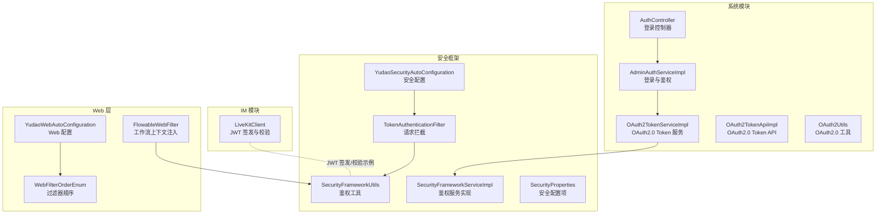
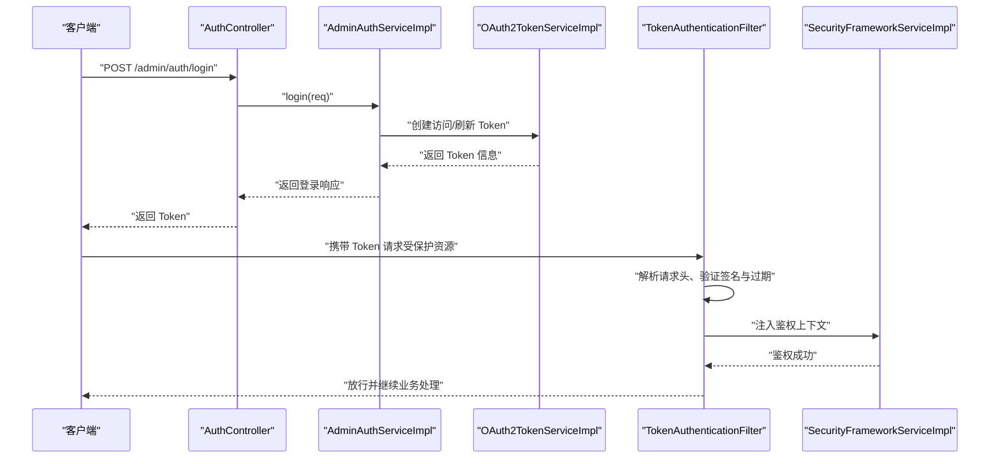
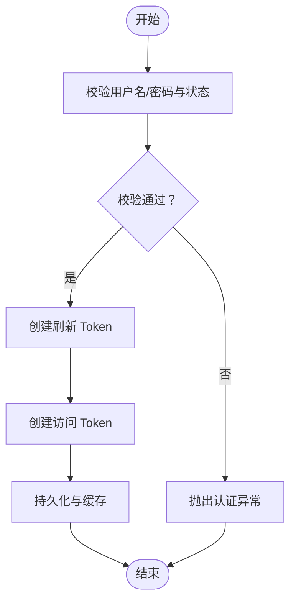
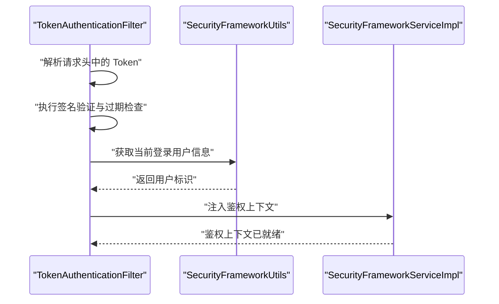
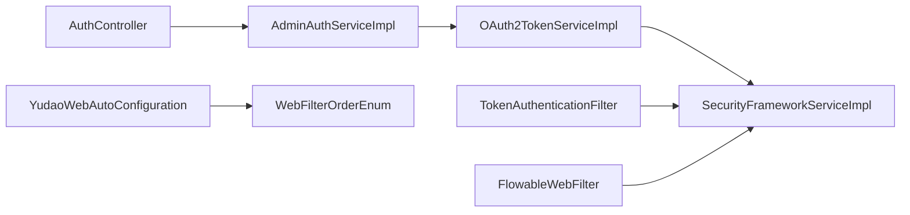

# JWT Token 认证

<cite>
**本文引用的文件**
- [SecurityFrameworkUtils.java](file://yudao-framework/yudao-spring-boot-starter-security/src/main/java/cn/iocoder/yudao/framework/security/core/util/SecurityFrameworkUtils.java)
- [TokenAuthenticationFilter.java](file://yudao-framework/yudao-spring-boot-starter-security/src/main/java/cn/iocoder/yudao/framework/security/core/filter/TokenAuthenticationFilter.java)
- [SecurityFrameworkServiceImpl.java](file://yudao-framework/yudao-spring-boot-starter-security/src/main/java/cn/iocoder/yudao/framework/security/core/service/SecurityFrameworkServiceImpl.java)
- [YudaoSecurityAutoConfiguration.java](file://yudao-framework/yudao-spring-boot-starter-security/src/main/java/cn/iocoder/yudao/framework/security/config/YudaoSecurityAutoConfiguration.java)
- [SecurityProperties.java](file://yudao-framework/yudao-spring-boot-starter-security/src/main/java/cn/iocoder/yudao/framework/security/config/SecurityProperties.java)
- [AdminAuthServiceImpl.java](file://yudao-module-system/src/main/java/cn/iocoder/yudao/module/system/service/auth/AdminAuthServiceImpl.java)
- [OAuth2TokenServiceImpl.java](file://yudao-module-system/src/main/java/cn/iocoder/yudao/module/system/service/oauth2/OAuth2TokenServiceImpl.java)
- [OAuth2TokenApiImpl.java](file://yudao-module-system/src/main/java/cn/iocoder/yudao/module/system/api/oauth2/OAuth2TokenApiImpl.java)
- [OAuth2Utils.java](file://yudao-module-system/src/main/java/cn/iocoder/yudao/module/system/util/oauth2/OAuth2Utils.java)
- [AuthController.java](file://yudao-module-system/src/main/java/cn/iocoder/yudao/module/system/controller/admin/auth/AuthController.java)
- [LiveKitClient.java](file://yudao-module-im/src/main/java/cn/iocoder/yudao/module/im/framework/rtc/core/LiveKitClient.java)
- [WebFilterOrderEnum.java](file://yudao-framework/yudao-common/src/main/java/cn/iocoder/yudao/framework/common/enums/WebFilterOrderEnum.java)
- [YudaoWebAutoConfiguration.java](file://yudao-framework/yudao-spring-boot-starter-web/src/main/java/cn/iocoder/yudao/framework/web/config/YudaoWebAutoConfiguration.java)
- [FlowableWebFilter.java](file://yudao-module-bpm/src/main/java/cn/iocoder/yudao/module/bpm/framework/web/core/FlowableWebFilter.java)
</cite>

## 目录
1. [简介](#简介)
2. [项目结构](#项目结构)
3. [核心组件](#核心组件)
4. [架构总览](#架构总览)
5. [组件详解](#组件详解)
6. [依赖关系分析](#依赖关系分析)
7. [性能考量](#性能考量)
8. [故障排查指南](#故障排查指南)
9. [结论](#结论)
10. [附录](#附录)

## 简介
本文件系统性梳理本仓库中的 JWT Token 认证机制，覆盖以下方面：
- JWT 结构：头部、载荷与签名的组成与作用
- Token 签发流程：用户身份验证、权限信息提取、Token 加密与存储
- Token 验证机制：请求头解析、签名验证、过期检查与鉴权上下文注入
- Token 刷新策略：刷新令牌使用与续期机制
- Token 存储与传递最佳实践：Cookie 与 LocalStorage 场景建议
- Token 失效处理与黑名单机制的实现思路

说明：本仓库以 OAuth2.0 Token 为核心认证载体，结合 Spring Security 进行统一鉴权。JWT 作为 OAuth2.0 Token 的一种实现形式，在部分模块中直接使用 JWT 库进行签发与校验。

## 项目结构
围绕 JWT 认证的关键模块与文件如下：
- 安全框架层：负责全局安全配置、Token 解析与鉴权上下文注入
- 系统模块：提供登录、Token 生成与校验、OAuth2.0 Token API
- IM 模块：演示 JWT 在实时通信场景中的签发与校验
- Web 层：过滤器链与跨域配置，确保 Token 传递与安全拦截有效

**图表来源**
- [SecurityFrameworkUtils.java](file://yudao-framework/yudao-spring-boot-starter-security/src/main/java/cn/iocoder/yudao/framework/security/core/util/SecurityFrameworkUtils.java)
- [TokenAuthenticationFilter.java](file://yudao-framework/yudao-spring-boot-starter-security/src/main/java/cn/iocoder/yudao/framework/security/core/filter/TokenAuthenticationFilter.java)
- [SecurityFrameworkServiceImpl.java](file://yudao-framework/yudao-spring-boot-starter-security/src/main/java/cn/iocoder/yudao/framework/security/core/service/SecurityFrameworkServiceImpl.java)
- [YudaoSecurityAutoConfiguration.java](file://yudao-framework/yudao-spring-boot-starter-security/src/main/java/cn/iocoder/yudao/framework/security/config/YudaoSecurityAutoConfiguration.java)
- [SecurityProperties.java](file://yudao-framework/yudao-spring-boot-starter-security/src/main/java/cn/iocoder/yudao/framework/security/config/SecurityProperties.java)
- [AdminAuthServiceImpl.java](file://yudao-module-system/src/main/java/cn/iocoder/yudao/module/system/service/auth/AdminAuthServiceImpl.java)
- [OAuth2TokenServiceImpl.java](file://yudao-module-system/src/main/java/cn/iocoder/yudao/module/system/service/oauth2/OAuth2TokenServiceImpl.java)
- [OAuth2TokenApiImpl.java](file://yudao-module-system/src/main/java/cn/iocoder/yudao/module/system/api/oauth2/OAuth2TokenApiImpl.java)
- [OAuth2Utils.java](file://yudao-module-system/src/main/java/cn/iocoder/yudao/module/system/util/oauth2/OAuth2Utils.java)
- [AuthController.java](file://yudao-module-system/src/main/java/cn/iocoder/yudao/module/system/controller/admin/auth/AuthController.java)
- [LiveKitClient.java](file://yudao-module-im/src/main/java/cn/iocoder/yudao/module/im/framework/rtc/core/LiveKitClient.java)
- [WebFilterOrderEnum.java](file://yudao-framework/yudao-common/src/main/java/cn/iocoder/yudao/framework/common/enums/WebFilterOrderEnum.java)
- [YudaoWebAutoConfiguration.java](file://yudao-framework/yudao-spring-boot-starter-web/src/main/java/cn/iocoder/yudao/framework/web/config/YudaoWebAutoConfiguration.java)
- [FlowableWebFilter.java](file://yudao-module-bpm/src/main/java/cn/iocoder/yudao/module/bpm/framework/web/core/FlowableWebFilter.java)

**章节来源**
- [YudaoSecurityAutoConfiguration.java](file://yudao-framework/yudao-spring-boot-starter-security/src/main/java/cn/iocoder/yudao/framework/security/config/YudaoSecurityAutoConfiguration.java)
- [YudaoWebAutoConfiguration.java](file://yudao-framework/yudao-spring-boot-starter-web/src/main/java/cn/iocoder/yudao/framework/web/config/YudaoWebAutoConfiguration.java)

## 核心组件
- 鉴权工具与过滤器
  - SecurityFrameworkUtils：提供获取登录用户信息、构建认证头常量等能力
  - TokenAuthenticationFilter：从请求头解析 Token，完成签名验证与过期检查，并注入鉴权上下文
- 鉴权服务实现
  - SecurityFrameworkServiceImpl：封装鉴权上下文、用户会话等核心逻辑
- OAuth2.0 Token 体系
  - AdminAuthServiceImpl：登录入口，完成用户校验后调用 Token 服务生成访问/刷新 Token
  - OAuth2TokenServiceImpl：创建访问 Token 与刷新 Token，持久化与缓存管理
  - OAuth2TokenApiImpl：对外暴露创建 Token 的 API
  - OAuth2Utils：构建 OAuth2.0 授权码/简化模式回调 URI
- 实时通信 JWT 示例
  - LiveKitClient：演示如何使用 JWT 库签发与校验 JWT，包含签发者、主题、有效期与自定义声明
- Web 过滤器链与顺序
  - WebFilterOrderEnum：定义过滤器执行顺序，确保跨域、请求体缓存、XSS、安全过滤器等按序执行
  - FlowableWebFilter：在工作流场景中注入当前登录用户 ID

**章节来源**
- [SecurityFrameworkUtils.java](file://yudao-framework/yudao-spring-boot-starter-security/src/main/java/cn/iocoder/yudao/framework/security/core/util/SecurityFrameworkUtils.java)
- [TokenAuthenticationFilter.java](file://yudao-framework/yudao-spring-boot-starter-security/src/main/java/cn/iocoder/yudao/framework/security/core/filter/TokenAuthenticationFilter.java)
- [SecurityFrameworkServiceImpl.java](file://yudao-framework/yudao-spring-boot-starter-security/src/main/java/cn/iocoder/yudao/framework/security/core/service/SecurityFrameworkServiceImpl.java)
- [AdminAuthServiceImpl.java](file://yudao-module-system/src/main/java/cn/iocoder/yudao/module/system/service/auth/AdminAuthServiceImpl.java)
- [OAuth2TokenServiceImpl.java](file://yudao-module-system/src/main/java/cn/iocoder/yudao/module/system/service/oauth2/OAuth2TokenServiceImpl.java)
- [OAuth2TokenApiImpl.java](file://yudao-module-system/src/main/java/cn/iocoder/yudao/module/system/api/oauth2/OAuth2TokenApiImpl.java)
- [OAuth2Utils.java](file://yudao-module-system/src/main/java/cn/iocoder/yudao/module/system/util/oauth2/OAuth2Utils.java)
- [LiveKitClient.java](file://yudao-module-im/src/main/java/cn/iocoder/yudao/module/im/framework/rtc/core/LiveKitClient.java)
- [WebFilterOrderEnum.java](file://yudao-framework/yudao-common/src/main/java/cn/iocoder/yudao/framework/common/enums/WebFilterOrderEnum.java)
- [FlowableWebFilter.java](file://yudao-module-bpm/src/main/java/cn/iocoder/yudao/module/bpm/framework/web/core/FlowableWebFilter.java)

## 架构总览
整体认证流程由“登录—签发 Token—请求携带 Token—过滤器校验—注入上下文”构成，配合 OAuth2.0 Token 与 Spring Security 完成统一鉴权。

**图表来源**
- [AuthController.java](file://yudao-module-system/src/main/java/cn/iocoder/yudao/module/system/controller/admin/auth/AuthController.java)
- [AdminAuthServiceImpl.java](file://yudao-module-system/src/main/java/cn/iocoder/yudao/module/system/service/auth/AdminAuthServiceImpl.java)
- [OAuth2TokenServiceImpl.java](file://yudao-module-system/src/main/java/cn/iocoder/yudao/module/system/service/oauth2/OAuth2TokenServiceImpl.java)
- [TokenAuthenticationFilter.java](file://yudao-framework/yudao-spring-boot-starter-security/src/main/java/cn/iocoder/yudao/framework/security/core/filter/TokenAuthenticationFilter.java)
- [SecurityFrameworkServiceImpl.java](file://yudao-framework/yudao-spring-boot-starter-security/src/main/java/cn/iocoder/yudao/framework/security/core/service/SecurityFrameworkServiceImpl.java)

## 组件详解

### JWT 结构与用途
- 头部（Header）：描述算法与类型，用于标识签名算法（如 HS256）
- 载荷（Payload）：包含标准字段（如 iss、sub、exp、iat、nbf）与自定义声明（如角色、权限范围）
- 签名（Signature）：基于 Header 与 Payload 以及密钥计算得出，用于验证完整性与真实性

在本项目中：
- OAuth2.0 Token 作为 JWT 的一种实现，承载用户身份与权限范围
- IM 模块的 LiveKitClient 展示了使用 JWT 库签发含自定义声明的 Token，并进行签名校验

**章节来源**
- [LiveKitClient.java](file://yudao-module-im/src/main/java/cn/iocoder/yudao/module/im/framework/rtc/core/LiveKitClient.java)

### Token 签发流程
- 用户登录
  - AuthController 接收登录请求，AdminAuthServiceImpl 执行账号密码校验与状态校验
  - 成功后调用 OAuth2TokenServiceImpl 创建访问 Token 与刷新 Token
- 权限信息提取
  - Token 中通常包含用户标识、租户信息、权限范围等，具体字段由业务决定
- Token 加密与存储
  - OAuth2TokenServiceImpl 将访问 Token 与刷新 Token 持久化并写入缓存，便于后续校验与刷新

**图表来源**
- [AdminAuthServiceImpl.java](file://yudao-module-system/src/main/java/cn/iocoder/yudao/module/system/service/auth/AdminAuthServiceImpl.java)
- [OAuth2TokenServiceImpl.java](file://yudao-module-system/src/main/java/cn/iocoder/yudao/module/system/service/oauth2/OAuth2TokenServiceImpl.java)

**章节来源**
- [AuthController.java](file://yudao-module-system/src/main/java/cn/iocoder/yudao/module/system/controller/admin/auth/AuthController.java)
- [AdminAuthServiceImpl.java](file://yudao-module-system/src/main/java/cn/iocoder/yudao/module/system/service/auth/AdminAuthServiceImpl.java)
- [OAuth2TokenServiceImpl.java](file://yudao-module-system/src/main/java/cn/iocoder/yudao/module/system/service/oauth2/OAuth2TokenServiceImpl.java)

### Token 验证机制
- 请求头解析
  - TokenAuthenticationFilter 从请求头中解析 Token 字符串
- 签名验证与过期检查
  - 基于配置的密钥与算法对 Token 进行签名验证与过期时间检查
- 鉴权上下文注入
  - 验证通过后，SecurityFrameworkServiceImpl 注入当前登录用户信息至上下文，供后续业务使用

**图表来源**
- [TokenAuthenticationFilter.java](file://yudao-framework/yudao-spring-boot-starter-security/src/main/java/cn/iocoder/yudao/framework/security/core/filter/TokenAuthenticationFilter.java)
- [SecurityFrameworkUtils.java](file://yudao-framework/yudao-spring-boot-starter-security/src/main/java/cn/iocoder/yudao/framework/security/core/util/SecurityFrameworkUtils.java)
- [SecurityFrameworkServiceImpl.java](file://yudao-framework/yudao-spring-boot-starter-security/src/main/java/cn/iocoder/yudao/framework/security/core/service/SecurityFrameworkServiceImpl.java)

**章节来源**
- [TokenAuthenticationFilter.java](file://yudao-framework/yudao-spring-boot-starter-security/src/main/java/cn/iocoder/yudao/framework/security/core/filter/TokenAuthenticationFilter.java)
- [SecurityFrameworkUtils.java](file://yudao-framework/yudao-spring-boot-starter-security/src/main/java/cn/iocoder/yudao/framework/security/core/util/SecurityFrameworkUtils.java)
- [SecurityFrameworkServiceImpl.java](file://yudao-framework/yudao-spring-boot-starter-security/src/main/java/cn/iocoder/yudao/framework/security/core/service/SecurityFrameworkServiceImpl.java)

### Token 刷新策略
- 刷新令牌使用
  - OAuth2TokenServiceImpl 在签发访问 Token 时同时创建刷新 Token，并进行持久化与缓存
- Token 续期机制
  - 当访问 Token 过期但刷新 Token 有效时，可通过刷新流程换取新的访问 Token
- 黑名单机制
  - 登录或退出时可将 Token 放入黑名单，拦截器在验证阶段检查黑名单，拒绝已失效 Token

说明：刷新流程的具体实现细节在相关服务类中，建议结合业务需求设计刷新策略与黑名单维护方案。

**章节来源**
- [OAuth2TokenServiceImpl.java](file://yudao-module-system/src/main/java/cn/iocoder/yudao/module/system/service/oauth2/OAuth2TokenServiceImpl.java)

### Token 存储与传递最佳实践
- Cookie
  - 适合服务端可控的会话场景，可设置 HttpOnly、Secure、SameSite 等属性，降低 XSS 与 CSRF 风险
- LocalStorage
  - 适合前端单页应用，便于跨域与无状态调用；需注意 XSS 防护与最小权限原则
- 传递方式
  - 建议通过 Authorization 请求头携带 Bearer Token，确保与拦截器一致的解析逻辑

说明：本项目通过 SecurityFrameworkUtils 统一处理认证头常量，确保前后端一致。

**章节来源**
- [SecurityFrameworkUtils.java](file://yudao-framework/yudao-spring-boot-starter-security/src/main/java/cn/iocoder/yudao/framework/security/core/util/SecurityFrameworkUtils.java)

### OAuth2.0 授权模式与回调
- 授权码模式与简化模式
  - OAuth2Utils 提供构建授权码模式与简化模式回调 URI 的工具方法，支持追加状态、过期时间、授权范围与附加信息

**章节来源**
- [OAuth2Utils.java](file://yudao-module-system/src/main/java/cn/iocoder/yudao/module/system/util/oauth2/OAuth2Utils.java)

## 依赖关系分析
- 组件耦合
  - AuthController 依赖 AdminAuthServiceImpl 完成登录
  - AdminAuthServiceImpl 依赖 OAuth2TokenServiceImpl 生成 Token
  - TokenAuthenticationFilter 依赖 SecurityFrameworkServiceImpl 注入鉴权上下文
- 过滤器链
  - WebFilterOrderEnum 明确各过滤器执行顺序，确保跨域、请求体缓存、XSS、安全过滤器按序执行
  - FlowableWebFilter 在工作流场景中注入当前登录用户 ID

**图表来源**
- [AuthController.java](file://yudao-module-system/src/main/java/cn/iocoder/yudao/module/system/controller/admin/auth/AuthController.java)
- [AdminAuthServiceImpl.java](file://yudao-module-system/src/main/java/cn/iocoder/yudao/module/system/service/auth/AdminAuthServiceImpl.java)
- [OAuth2TokenServiceImpl.java](file://yudao-module-system/src/main/java/cn/iocoder/yudao/module/system/service/oauth2/OAuth2TokenServiceImpl.java)
- [SecurityFrameworkServiceImpl.java](file://yudao-framework/yudao-spring-boot-starter-security/src/main/java/cn/iocoder/yudao/framework/security/core/service/SecurityFrameworkServiceImpl.java)
- [TokenAuthenticationFilter.java](file://yudao-framework/yudao-spring-boot-starter-security/src/main/java/cn/iocoder/yudao/framework/security/core/filter/TokenAuthenticationFilter.java)
- [YudaoWebAutoConfiguration.java](file://yudao-framework/yudao-spring-boot-starter-web/src/main/java/cn/iocoder/yudao/framework/web/config/YudaoWebAutoConfiguration.java)
- [WebFilterOrderEnum.java](file://yudao-framework/yudao-common/src/main/java/cn/iocoder/yudao/framework/common/enums/WebFilterOrderEnum.java)
- [FlowableWebFilter.java](file://yudao-module-bpm/src/main/java/cn/iocoder/yudao/module/bpm/framework/web/core/FlowableWebFilter.java)

**章节来源**
- [WebFilterOrderEnum.java](file://yudao-framework/yudao-common/src/main/java/cn/iocoder/yudao/framework/common/enums/WebFilterOrderEnum.java)
- [YudaoWebAutoConfiguration.java](file://yudao-framework/yudao-spring-boot-starter-web/src/main/java/cn/iocoder/yudao/framework/web/config/YudaoWebAutoConfiguration.java)
- [FlowableWebFilter.java](file://yudao-module-bpm/src/main/java/cn/iocoder/yudao/module/bpm/framework/web/core/FlowableWebFilter.java)

## 性能考量
- Token 缓存
  - 访问 Token 与刷新 Token 建议放入高性能缓存（如 Redis），减少数据库压力
- 过滤器顺序
  - 合理的过滤器顺序可避免重复解析与不必要的开销
- 最小权限原则
  - Token 中仅包含必要声明，降低体积与解析成本

[本节为通用指导，无需特定文件引用]

## 故障排查指南
- 认证失败
  - 检查请求头是否包含有效的 Bearer Token，确认 Token 未过期且签名正确
- 过滤器顺序问题
  - 若跨域或请求体读取异常，检查 WebFilterOrderEnum 的顺序配置
- 工作流上下文缺失
  - 确认 FlowableWebFilter 在 Spring Security 过滤器之后执行，以便注入用户 ID

**章节来源**
- [TokenAuthenticationFilter.java](file://yudao-framework/yudao-spring-boot-starter-security/src/main/java/cn/iocoder/yudao/framework/security/core/filter/TokenAuthenticationFilter.java)
- [WebFilterOrderEnum.java](file://yudao-framework/yudao-common/src/main/java/cn/iocoder/yudao/framework/common/enums/WebFilterOrderEnum.java)
- [FlowableWebFilter.java](file://yudao-module-bpm/src/main/java/cn/iocoder/yudao/module/bpm/framework/web/core/FlowableWebFilter.java)

## 结论
本项目采用 OAuth2.0 Token 作为统一认证载体，结合 Spring Security 实现请求拦截与鉴权上下文注入。JWT 在部分模块中作为 Token 的实现形式，承担身份与权限信息的承载与校验职责。通过合理的 Token 签发、验证、刷新与存储策略，可满足多场景下的安全需求。

[本节为总结性内容，无需特定文件引用]

## 附录
- 配置参考
  - SecurityProperties：安全相关配置项
  - YudaoSecurityAutoConfiguration：安全自动装配与过滤器注册
- 实时通信示例
  - LiveKitClient：展示 JWT 签发与校验的完整流程，可作为自定义 Token 策略的参考

**章节来源**
- [SecurityProperties.java](file://yudao-framework/yudao-spring-boot-starter-security/src/main/java/cn/iocoder/yudao/framework/security/config/SecurityProperties.java)
- [YudaoSecurityAutoConfiguration.java](file://yudao-framework/yudao-spring-boot-starter-security/src/main/java/cn/iocoder/yudao/framework/security/config/YudaoSecurityAutoConfiguration.java)
- [LiveKitClient.java](file://yudao-module-im/src/main/java/cn/iocoder/yudao/module/im/framework/rtc/core/LiveKitClient.java)