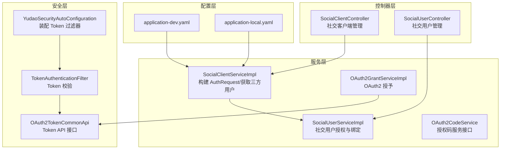
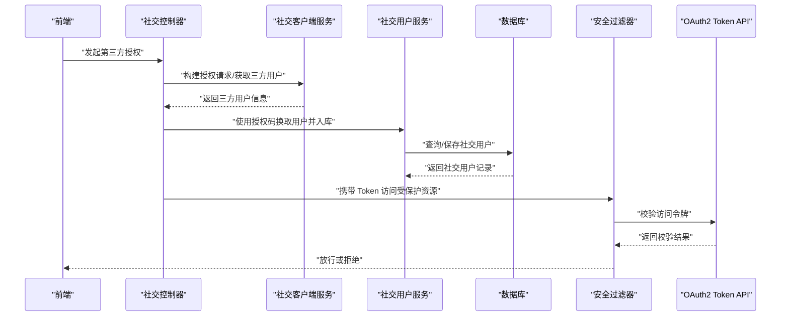
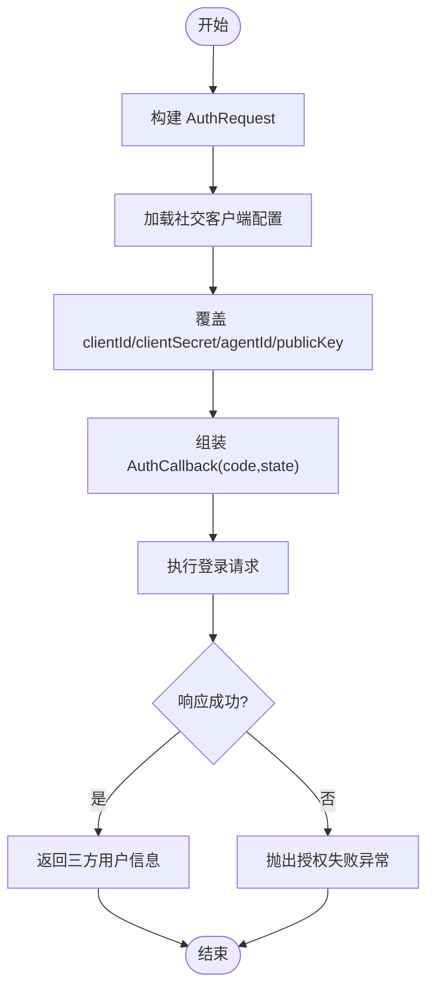
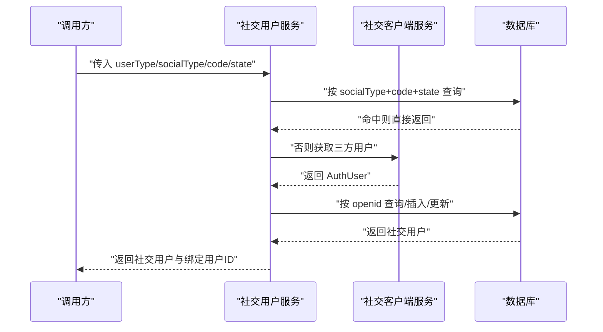
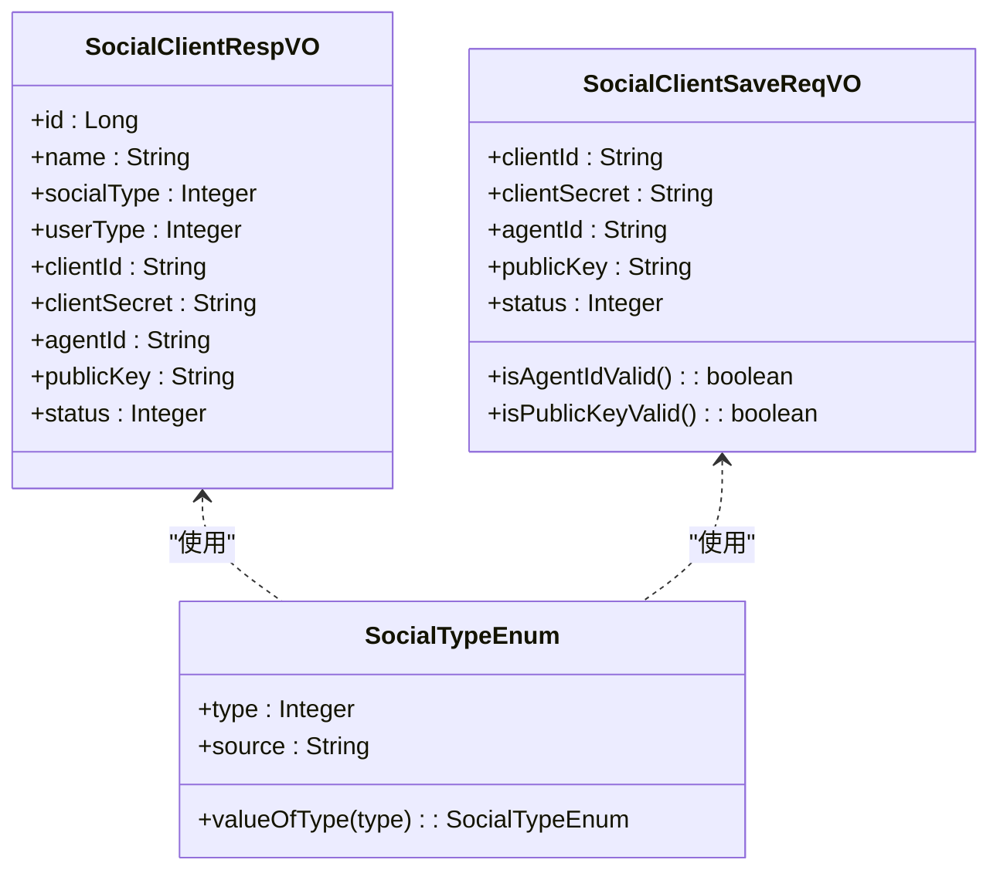

# OAuth2 第三方登录

<cite>
**本文引用的文件**   
- [application-dev.yaml](file://yudao-server/src/main/resources/application-dev.yaml)
- [application-local.yaml](file://yudao-server/src/main/resources/application-local.yaml)
- [SocialClientServiceImpl.java](file://yudao-module-system/src/main/java/cn/iocoder/yudao/module/system/service/social/SocialClientServiceImpl.java)
- [SocialUserServiceImpl.java](file://yudao-module-system/src/main/java/cn/iocoder/yudao/module/system/service/social/SocialUserServiceImpl.java)
- [AdminAuthServiceImpl.java](file://yudao-module-system/src/main/java/cn/iocoder/yudao/module/system/service/auth/AdminAuthServiceImpl.java)
- [OAuth2GrantServiceImpl.java](file://yudao-module-system/src/main/java/cn/iocoder/yudao/module/system/service/oauth2/OAuth2GrantServiceImpl.java)
- [OAuth2CodeService.java](file://yudao-module-system/src/main/java/cn/iocoder/yudao/module/system/service/oauth2/OAuth2CodeService.java)
- [SocialTypeEnum.java](file://yudao-module-system/src/main/java/cn/iocoder/yudao/module/system/enums/social/SocialTypeEnum.java)
- [SocialClientRespVO.java](file://yudao-module-system/src/main/java/cn/iocoder/yudao/module/system/controller/admin/socail/vo/client/SocialClientRespVO.java)
- [SocialClientSaveReqVO.java](file://yudao-module-system/src/main/java/cn/iocoder/yudao/module/system/controller/admin/socail/vo/client/SocialClientSaveReqVO.java)
- [OAuth2TokenCommonApi.java](file://yudao-framework/yudao-common/src/main/java/cn/iocoder/yudao/framework/common/biz/system/oauth2/OAuth2TokenCommonApi.java)
- [YudaoSecurityAutoConfiguration.java](file://yudao-framework/yudao-spring-boot-starter-security/src/main/java/cn/iocoder/yudao/framework/security/config/YudaoSecurityAutoConfiguration.java)
- [TokenAuthenticationFilter.java](file://yudao-framework/yudao-spring-boot-starter-security/src/main/java/cn/iocoder/yudao/framework/security/core/filter/TokenAuthenticationFilter.java)
</cite>

## 目录
1. [引言](#引言)
2. [项目结构](#项目结构)
3. [核心组件](#核心组件)
4. [架构总览](#架构总览)
5. [详细组件分析](#详细组件分析)
6. [依赖关系分析](#依赖关系分析)
7. [性能与安全考量](#性能与安全考量)
8. [故障排查指南](#故障排查指南)
9. [结论](#结论)
10. [附录](#附录)

## 引言
本文件系统性阐述本项目的 OAuth2 第三方登录集成方案，涵盖授权码模式、简化模式与客户端凭证模式的应用场景；详述微信、支付宝、钉钉等第三方平台的接入要点（应用注册、回调地址、权限范围）；介绍 JustAuth 第三方登录框架在本项目中的使用方式（配置文件、授权链接生成、用户信息获取）；说明 OAuth2 客户端管理（Client ID/Secret 配置与安全存储）；并提供集成示例与错误处理机制（授权失败与用户绑定逻辑）。

## 项目结构
围绕 OAuth2 与第三方登录的关键模块分布如下：
- 配置层：JustAuth 在环境配置文件中启用与平台参数注入
- 服务层：社交客户端与社交用户服务负责第三方授权与用户信息落库
- 控制器层：提供社交客户端与社交用户的管理接口
- 安全层：基于 OAuth2 Token 的鉴权过滤与 API 接口

图表来源
- [application-dev.yaml:181-212](file://yudao-server/src/main/resources/application-dev.yaml#L181-L212)
- [application-local.yaml:253-284](file://yudao-server/src/main/resources/application-local.yaml#L253-L284)
- [SocialClientServiceImpl.java:178-191](file://yudao-module-system/src/main/java/cn/iocoder/yudao/module/system/service/social/SocialClientServiceImpl.java#L178-L191)
- [SocialUserServiceImpl.java:109-174](file://yudao-module-system/src/main/java/cn/iocoder/yudao/module/system/service/social/SocialUserServiceImpl.java#L109-L174)
- [OAuth2GrantServiceImpl.java:1-38](file://yudao-module-system/src/main/java/cn/iocoder/yudao/module/system/service/oauth2/OAuth2GrantServiceImpl.java#L1-L38)
- [OAuth2CodeService.java:1-39](file://yudao-module-system/src/main/java/cn/iocoder/yudao/module/system/service/oauth2/OAuth2CodeService.java#L1-L39)
- [YudaoSecurityAutoConfiguration.java:71-72](file://yudao-framework/yudao-spring-boot-starter-security/src/main/java/cn/iocoder/yudao/framework/security/config/YudaoSecurityAutoConfiguration.java#L71-L72)
- [TokenAuthenticationFilter.java:1-10](file://yudao-framework/yudao-spring-boot-starter-security/src/main/java/cn/iocoder/yudao/framework/security/core/filter/TokenAuthenticationFilter.java#L1-L10)
- [OAuth2TokenCommonApi.java:1-46](file://yudao-framework/yudao-common/src/main/java/cn/iocoder/yudao/framework/common/biz/system/oauth2/OAuth2TokenCommonApi.java#L1-L46)

章节来源
- [application-dev.yaml:181-212](file://yudao-server/src/main/resources/application-dev.yaml#L181-L212)
- [application-local.yaml:253-284](file://yudao-server/src/main/resources/application-local.yaml#L253-L284)
- [SocialClientServiceImpl.java:178-191](file://yudao-module-system/src/main/java/cn/iocoder/yudao/module/system/service/social/SocialClientServiceImpl.java#L178-L191)
- [SocialUserServiceImpl.java:109-174](file://yudao-module-system/src/main/java/cn/iocoder/yudao/module/system/service/social/SocialUserServiceImpl.java#L109-L174)
- [OAuth2GrantServiceImpl.java:1-38](file://yudao-module-system/src/main/java/cn/iocoder/yudao/module/system/service/oauth2/OAuth2GrantServiceImpl.java#L1-L38)
- [OAuth2CodeService.java:1-39](file://yudao-module-system/src/main/java/cn/iocoder/yudao/module/system/service/oauth2/OAuth2CodeService.java#L1-L39)
- [YudaoSecurityAutoConfiguration.java:71-72](file://yudao-framework/yudao-spring-boot-starter-security/src/main/java/cn/iocoder/yudao/framework/security/config/YudaoSecurityAutoConfiguration.java#L71-L72)
- [TokenAuthenticationFilter.java:1-10](file://yudao-framework/yudao-spring-boot-starter-security/src/main/java/cn/iocoder/yudao/framework/security/core/filter/TokenAuthenticationFilter.java#L1-L10)
- [OAuth2TokenCommonApi.java:1-46](file://yudao-framework/yudao-common/src/main/java/cn/iocoder/yudao/framework/common/biz/system/oauth2/OAuth2TokenCommonApi.java#L1-L46)

## 核心组件
- JustAuth 配置与平台参数
  - 在环境配置文件中启用 JustAuth，并为各平台设置 client-id、client-secret、agent-id（企业微信）、alipay-public-key（支付宝）、忽略检查项等参数
  - 示例路径：[application-dev.yaml:181-212](file://yudao-server/src/main/resources/application-dev.yaml#L181-L212)、[application-local.yaml:253-284](file://yudao-server/src/main/resources/application-local.yaml#L253-L284)
- 社交客户端服务
  - 动态构建 AuthRequest 并根据数据库配置覆盖客户端参数（clientId、clientSecret、agentId、公钥等），统一获取三方用户信息
  - 示例路径：[SocialClientServiceImpl.java:178-191](file://yudao-module-system/src/main/java/cn/iocoder/yudao/module/system/service/social/SocialClientServiceImpl.java#L178-L191)
- 社交用户服务
  - 通过授权码换取三方用户信息并入库，支持 code 一次性使用与后续绑定查询
  - 示例路径：[SocialUserServiceImpl.java:109-174](file://yudao-module-system/src/main/java/cn/iocoder/yudao/module/system/service/social/SocialUserServiceImpl.java#L109-L174)
- OAuth2 授予与授权码服务
  - 提供隐式授权等授予方式与授权码服务接口，支撑后续 Token 颁发与校验
  - 示例路径：[OAuth2GrantServiceImpl.java:1-38](file://yudao-module-system/src/main/java/cn/iocoder/yudao/module/system/service/oauth2/OAuth2GrantServiceImpl.java#L1-L38)、[OAuth2CodeService.java:1-39](file://yudao-module-system/src/main/java/cn/iocoder/yudao/module/system/service/oauth2/OAuth2CodeService.java#L1-L39)
- 安全过滤与 Token API
  - 自动装配 Token 鉴权过滤器，结合 OAuth2 Token API 实现访问令牌的创建、校验与刷新
  - 示例路径：[YudaoSecurityAutoConfiguration.java:71-72](file://yudao-framework/yudao-spring-boot-starter-security/src/main/java/cn/iocoder/yudao/framework/security/config/YudaoSecurityAutoConfiguration.java#L71-L72)、[TokenAuthenticationFilter.java:1-10](file://yudao-framework/yudao-spring-boot-starter-security/src/main/java/cn/iocoder/yudao/framework/security/core/filter/TokenAuthenticationFilter.java#L1-L10)、[OAuth2TokenCommonApi.java:1-46](file://yudao-framework/yudao-common/src/main/java/cn/iocoder/yudao/framework/common/biz/system/oauth2/OAuth2TokenCommonApi.java#L1-L46)

章节来源
- [application-dev.yaml:181-212](file://yudao-server/src/main/resources/application-dev.yaml#L181-L212)
- [application-local.yaml:253-284](file://yudao-server/src/main/resources/application-local.yaml#L253-L284)
- [SocialClientServiceImpl.java:178-191](file://yudao-module-system/src/main/java/cn/iocoder/yudao/module/system/service/social/SocialClientServiceImpl.java#L178-L191)
- [SocialUserServiceImpl.java:109-174](file://yudao-module-system/src/main/java/cn/iocoder/yudao/module/system/service/social/SocialUserServiceImpl.java#L109-L174)
- [OAuth2GrantServiceImpl.java:1-38](file://yudao-module-system/src/main/java/cn/iocoder/yudao/module/system/service/oauth2/OAuth2GrantServiceImpl.java#L1-L38)
- [OAuth2CodeService.java:1-39](file://yudao-module-system/src/main/java/cn/iocoder/yudao/module/system/service/oauth2/OAuth2CodeService.java#L1-L39)
- [YudaoSecurityAutoConfiguration.java:71-72](file://yudao-framework/yudao-spring-boot-starter-security/src/main/java/cn/iocoder/yudao/framework/security/config/YudaoSecurityAutoConfiguration.java#L71-L72)
- [TokenAuthenticationFilter.java:1-10](file://yudao-framework/yudao-spring-boot-starter-security/src/main/java/cn/iocoder/yudao/framework/security/core/filter/TokenAuthenticationFilter.java#L1-L10)
- [OAuth2TokenCommonApi.java:1-46](file://yudao-framework/yudao-common/src/main/java/cn/iocoder/yudao/framework/common/biz/system/oauth2/OAuth2TokenCommonApi.java#L1-L46)

## 架构总览
下图展示从“前端发起第三方授权”到“后端获取用户并完成绑定”的整体流程，以及与 JustAuth、社交服务与安全层的交互。

图表来源
- [SocialClientServiceImpl.java:178-191](file://yudao-module-system/src/main/java/cn/iocoder/yudao/module/system/service/social/SocialClientServiceImpl.java#L178-L191)
- [SocialUserServiceImpl.java:109-174](file://yudao-module-system/src/main/java/cn/iocoder/yudao/module/system/service/social/SocialUserServiceImpl.java#L109-L174)
- [OAuth2TokenCommonApi.java:1-46](file://yudao-framework/yudao-common/src/main/java/cn/iocoder/yudao/framework/common/biz/system/oauth2/OAuth2TokenCommonApi.java#L1-L46)
- [YudaoSecurityAutoConfiguration.java:71-72](file://yudao-framework/yudao-spring-boot-starter-security/src/main/java/cn/iocoder/yudao/framework/security/config/YudaoSecurityAutoConfiguration.java#L71-L72)
- [TokenAuthenticationFilter.java:1-10](file://yudao-framework/yudao-spring-boot-starter-security/src/main/java/cn/iocoder/yudao/framework/security/core/filter/TokenAuthenticationFilter.java#L1-L10)

## 详细组件分析

### JustAuth 配置与平台参数
- 启用 JustAuth 并按平台注入参数
  - 钉钉：client-id、client-secret、忽略重定向校验
  - 企业微信：client-id、client-secret、agent-id、忽略重定向校验
  - 微信小程序/公众号：client-id、client-secret、忽略重定向与 state 校验
  - 支付宝小程序：client-id、client-secret、alipay-public-key、忽略重定向与 state 校验
- 配置缓存策略（Redis）与超时控制
- 关键字段定义参考：
  - [SocialClientRespVO.java:24-34](file://yudao-module-system/src/main/java/cn/iocoder/yudao/module/system/controller/admin/socail/vo/client/SocialClientRespVO.java#L24-L34)
  - [SocialClientSaveReqVO.java:37-70](file://yudao-module-system/src/main/java/cn/iocoder/yudao/module/system/controller/admin/socail/vo/client/SocialClientSaveReqVO.java#L37-L70)

章节来源
- [application-dev.yaml:181-212](file://yudao-server/src/main/resources/application-dev.yaml#L181-L212)
- [application-local.yaml:253-284](file://yudao-server/src/main/resources/application-local.yaml#L253-L284)
- [SocialClientRespVO.java:24-34](file://yudao-module-system/src/main/java/cn/iocoder/yudao/module/system/controller/admin/socail/vo/client/SocialClientRespVO.java#L24-L34)
- [SocialClientSaveReqVO.java:37-70](file://yudao-module-system/src/main/java/cn/iocoder/yudao/module/system/controller/admin/socail/vo/client/SocialClientSaveReqVO.java#L37-L70)

### 社交客户端服务（JustAuth 封装）
- 功能要点
  - 从工厂获取默认 AuthRequest，再从数据库读取社交客户端配置并覆盖 clientId/clientSecret/agentId/publicKey 等
  - 统一执行授权回调，返回三方用户信息；失败时抛出业务异常
- 关键流程
  - 构建 AuthRequest
  - 组装 AuthCallback（code/state）
  - 执行登录并校验响应
- 参考路径：
  - [SocialClientServiceImpl.java:178-191](file://yudao-module-system/src/main/java/cn/iocoder/yudao/module/system/service/social/SocialClientServiceImpl.java#L178-L191)

图表来源
- [SocialClientServiceImpl.java:178-191](file://yudao-module-system/src/main/java/cn/iocoder/yudao/module/system/service/social/SocialClientServiceImpl.java#L178-L191)

章节来源
- [SocialClientServiceImpl.java:178-191](file://yudao-module-system/src/main/java/cn/iocoder/yudao/module/system/service/social/SocialClientServiceImpl.java#L178-L191)

### 社交用户服务（授权码换取用户与绑定）
- 功能要点
  - 优先从数据库按 code+state 查询已使用的授权码，避免重复使用
  - 通过社交客户端服务获取三方用户信息并入库（包含 openid、昵称、头像、原始用户信息等）
  - 返回社交用户与绑定用户 ID（若已绑定）
- 关键流程
  - 查询已用授权码
  - 获取三方用户并持久化
  - 返回社交用户与绑定状态
- 参考路径：
  - [SocialUserServiceImpl.java:109-174](file://yudao-module-system/src/main/java/cn/iocoder/yudao/module/system/service/social/SocialUserServiceImpl.java#L109-L174)

图表来源
- [SocialUserServiceImpl.java:109-174](file://yudao-module-system/src/main/java/cn/iocoder/yudao/module/system/service/social/SocialUserServiceImpl.java#L109-L174)
- [SocialClientServiceImpl.java:178-191](file://yudao-module-system/src/main/java/cn/iocoder/yudao/module/system/service/social/SocialClientServiceImpl.java#L178-L191)

章节来源
- [SocialUserServiceImpl.java:109-174](file://yudao-module-system/src/main/java/cn/iocoder/yudao/module/system/service/social/SocialUserServiceImpl.java#L109-L174)
- [SocialClientServiceImpl.java:178-191](file://yudao-module-system/src/main/java/cn/iocoder/yudao/module/system/service/social/SocialClientServiceImpl.java#L178-L191)

### OAuth2 授予与授权码服务
- 授权码服务接口
  - 创建授权码：用于授权码模式
  - 消费授权码：换取访问令牌
- 授予服务实现
  - 隐式授权：直接颁发访问令牌
- 参考路径：
  - [OAuth2CodeService.java:1-39](file://yudao-module-system/src/main/java/cn/iocoder/yudao/module/system/service/oauth2/OAuth2CodeService.java#L1-L39)
  - [OAuth2GrantServiceImpl.java:1-38](file://yudao-module-system/src/main/java/cn/iocoder/yudao/module/system/service/oauth2/OAuth2GrantServiceImpl.java#L1-L38)

章节来源
- [OAuth2CodeService.java:1-39](file://yudao-module-system/src/main/java/cn/iocoder/yudao/module/system/service/oauth2/OAuth2CodeService.java#L1-L39)
- [OAuth2GrantServiceImpl.java:1-38](file://yudao-module-system/src/main/java/cn/iocoder/yudao/module/system/service/oauth2/OAuth2GrantServiceImpl.java#L1-L38)

### 安全过滤与 Token API
- 自动装配
  - 在安全自动配置中注入 TokenAuthenticationFilter，并依赖 OAuth2TokenCommonApi
- Token 校验
  - 通过 OAuth2TokenCommonApi 提供的接口进行访问令牌的创建、校验与刷新
- 参考路径：
  - [YudaoSecurityAutoConfiguration.java:71-72](file://yudao-framework/yudao-spring-boot-starter-security/src/main/java/cn/iocoder/yudao/framework/security/config/YudaoSecurityAutoConfiguration.java#L71-L72)
  - [TokenAuthenticationFilter.java:1-10](file://yudao-framework/yudao-spring-boot-starter-security/src/main/java/cn/iocoder/yudao/framework/security/core/filter/TokenAuthenticationFilter.java#L1-L10)
  - [OAuth2TokenCommonApi.java:1-46](file://yudao-framework/yudao-common/src/main/java/cn/iocoder/yudao/framework/common/biz/system/oauth2/OAuth2TokenCommonApi.java#L1-L46)

章节来源
- [YudaoSecurityAutoConfiguration.java:71-72](file://yudao-framework/yudao-spring-boot-starter-security/src/main/java/cn/iocoder/yudao/framework/security/config/YudaoSecurityAutoConfiguration.java#L71-L72)
- [TokenAuthenticationFilter.java:1-10](file://yudao-framework/yudao-spring-boot-starter-security/src/main/java/cn/iocoder/yudao/framework/security/core/filter/TokenAuthenticationFilter.java#L1-L10)
- [OAuth2TokenCommonApi.java:1-46](file://yudao-framework/yudao-common/src/main/java/cn/iocoder/yudao/framework/common/biz/system/oauth2/OAuth2TokenCommonApi.java#L1-L46)

## 依赖关系分析
- 平台枚举与配置映射
  - 社交平台类型枚举与 JustAuth 的 source 映射，确保正确选择平台工厂
  - 参考路径：[SocialTypeEnum.java:17-84](file://yudao-module-system/src/main/java/cn/iocoder/yudao/module/system/enums/social/SocialTypeEnum.java#L17-L84)
- 客户端配置对象
  - 响应与保存 VO 定义了 clientId、clientSecret、agentId、publicKey 等字段及校验规则
  - 参考路径：
    - [SocialClientRespVO.java:12-42](file://yudao-module-system/src/main/java/cn/iocoder/yudao/module/system/controller/admin/socail/vo/client/SocialClientRespVO.java#L12-L42)
    - [SocialClientSaveReqVO.java:37-70](file://yudao-module-system/src/main/java/cn/iocoder/yudao/module/system/controller/admin/socail/vo/client/SocialClientSaveReqVO.java#L37-L70)

图表来源
- [SocialTypeEnum.java:17-84](file://yudao-module-system/src/main/java/cn/iocoder/yudao/module/system/enums/social/SocialTypeEnum.java#L17-L84)
- [SocialClientRespVO.java:12-42](file://yudao-module-system/src/main/java/cn/iocoder/yudao/module/system/controller/admin/socail/vo/client/SocialClientRespVO.java#L12-L42)
- [SocialClientSaveReqVO.java:37-70](file://yudao-module-system/src/main/java/cn/iocoder/yudao/module/system/controller/admin/socail/vo/client/SocialClientSaveReqVO.java#L37-L70)

章节来源
- [SocialTypeEnum.java:17-84](file://yudao-module-system/src/main/java/cn/iocoder/yudao/module/system/enums/social/SocialTypeEnum.java#L17-L84)
- [SocialClientRespVO.java:12-42](file://yudao-module-system/src/main/java/cn/iocoder/yudao/module/system/controller/admin/socail/vo/client/SocialClientRespVO.java#L12-L42)
- [SocialClientSaveReqVO.java:37-70](file://yudao-module-system/src/main/java/cn/iocoder/yudao/module/system/controller/admin/socail/vo/client/SocialClientSaveReqVO.java#L37-L70)

## 性能与安全考量
- 授权码复用防护
  - 社交用户服务优先按 code+state 查询已使用记录，避免重复消费
  - 参考路径：[SocialUserServiceImpl.java:134-139](file://yudao-module-system/src/main/java/cn/iocoder/yudao/module/system/service/social/SocialUserServiceImpl.java#L134-L139)
- 客户端参数覆盖
  - 通过反射复制并覆盖 AuthConfig 的 clientId/clientSecret/agentId/publicKey，确保不同用户类型与平台的差异化配置
  - 参考路径：[SocialClientServiceImpl.java:200-216](file://yudao-module-system/src/main/java/cn/iocoder/yudao/module/system/service/social/SocialClientServiceImpl.java#L200-L216)
- Token 校验链路
  - 安全过滤器依赖 OAuth2TokenCommonApi 进行令牌校验，保障受保护资源访问安全
  - 参考路径：
    - [YudaoSecurityAutoConfiguration.java:71-72](file://yudao-framework/yudao-spring-boot-starter-security/src/main/java/cn/iocoder/yudao/framework/security/config/YudaoSecurityAutoConfiguration.java#L71-L72)
    - [TokenAuthenticationFilter.java:1-10](file://yudao-framework/yudao-spring-boot-starter-security/src/main/java/cn/iocoder/yudao/framework/security/core/filter/TokenAuthenticationFilter.java#L1-L10)
    - [OAuth2TokenCommonApi.java:1-46](file://yudao-framework/yudao-common/src/main/java/cn/iocoder/yudao/framework/common/biz/system/oauth2/OAuth2TokenCommonApi.java#L1-L46)

章节来源
- [SocialUserServiceImpl.java:134-139](file://yudao-module-system/src/main/java/cn/iocoder/yudao/module/system/service/social/SocialUserServiceImpl.java#L134-L139)
- [SocialClientServiceImpl.java:200-216](file://yudao-module-system/src/main/java/cn/iocoder/yudao/module/system/service/social/SocialClientServiceImpl.java#L200-L216)
- [YudaoSecurityAutoConfiguration.java:71-72](file://yudao-framework/yudao-spring-boot-starter-security/src/main/java/cn/iocoder/yudao/framework/security/config/YudaoSecurityAutoConfiguration.java#L71-L72)
- [TokenAuthenticationFilter.java:1-10](file://yudao-framework/yudao-spring-boot-starter-security/src/main/java/cn/iocoder/yudao/framework/security/core/filter/TokenAuthenticationFilter.java#L1-L10)
- [OAuth2TokenCommonApi.java:1-46](file://yudao-framework/yudao-common/src/main/java/cn/iocoder/yudao/framework/common/biz/system/oauth2/OAuth2TokenCommonApi.java#L1-L46)

## 故障排查指南
- 授权失败处理
  - 社交客户端服务在授权响应非成功时抛出业务异常，需检查平台配置、回调地址与 state 校验
  - 参考路径：[SocialClientServiceImpl.java:187-189](file://yudao-module-system/src/main/java/cn/iocoder/yudao/module/system/service/social/SocialClientServiceImpl.java#L187-L189)
- 用户未绑定
  - 管理端社交登录在未绑定用户时抛出“第三方登录未绑定”异常，需引导用户完成绑定或注册
  - 参考路径：[AdminAuthServiceImpl.java:176-178](file://yudao-module-system/src/main/java/cn/iocoder/yudao/module/system/service/auth/AdminAuthServiceImpl.java#L176-L178)
- 配置校验
  - 企业微信需 agentId，支付宝小程序需 publicKey；保存时进行断言校验
  - 参考路径：
    - [SocialClientSaveReqVO.java:56-70](file://yudao-module-system/src/main/java/cn/iocoder/yudao/module/system/controller/admin/socail/vo/client/SocialClientSaveReqVO.java#L56-L70)
    - [SocialTypeEnum.java:30-61](file://yudao-module-system/src/main/java/cn/iocoder/yudao/module/system/enums/social/SocialTypeEnum.java#L30-L61)

章节来源
- [SocialClientServiceImpl.java:187-189](file://yudao-module-system/src/main/java/cn/iocoder/yudao/module/system/service/social/SocialClientServiceImpl.java#L187-L189)
- [AdminAuthServiceImpl.java:176-178](file://yudao-module-system/src/main/java/cn/iocoder/yudao/module/system/service/auth/AdminAuthServiceImpl.java#L176-L178)
- [SocialClientSaveReqVO.java:56-70](file://yudao-module-system/src/main/java/cn/iocoder/yudao/module/system/controller/admin/socail/vo/client/SocialClientSaveReqVO.java#L56-L70)
- [SocialTypeEnum.java:30-61](file://yudao-module-system/src/main/java/cn/iocoder/yudao/module/system/enums/social/SocialTypeEnum.java#L30-L61)

## 结论
本项目通过 JustAuth 与自研社交服务实现了对微信、支付宝、钉钉等平台的统一接入，结合社交用户服务与 OAuth2 授予/授权码服务，提供了完整的授权码模式与隐式模式能力。配置层以环境变量与数据库配置相结合，确保客户端参数的安全与灵活管理；安全层通过 Token 校验保障受保护资源访问。建议在生产环境中严格校验回调地址与 state，妥善保管 Client Secret，并对授权码进行一次性使用约束。

## 附录
- OAuth2 授权模式应用场景
  - 授权码模式：适合 Web 应用，安全性高，支持刷新令牌
  - 简化模式：适合浏览器端应用，无需后端参与交换令牌
  - 客户端凭证模式：适合服务端到服务端调用，使用 Client Credentials 获取令牌
- 第三方平台接入要点
  - 应用注册：在各平台完成应用创建，获取 client-id/client-secret
  - 回调地址：在平台配置正确的回调地址，与后端一致
  - 权限范围：根据业务需求设置 scope，遵循平台限制
- 集成示例与错误处理
  - 授权失败：检查平台配置、回调地址与 state 校验
  - 用户绑定：在社交登录后引导用户绑定已有账户或创建新账户
  - 客户端管理：通过社交客户端管理接口维护不同用户类型的平台配置