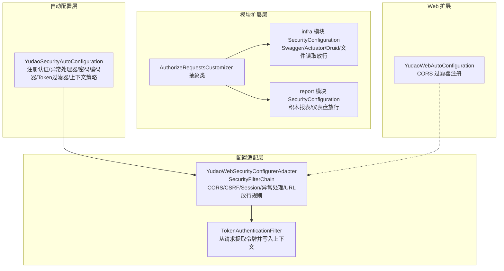
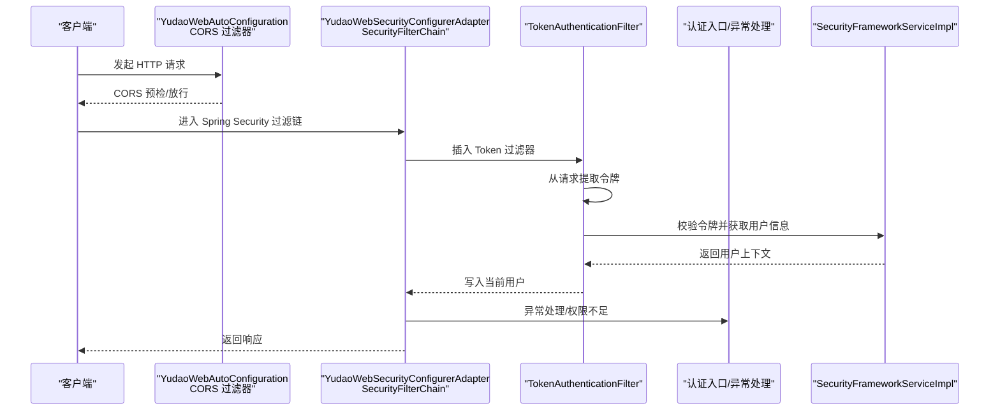
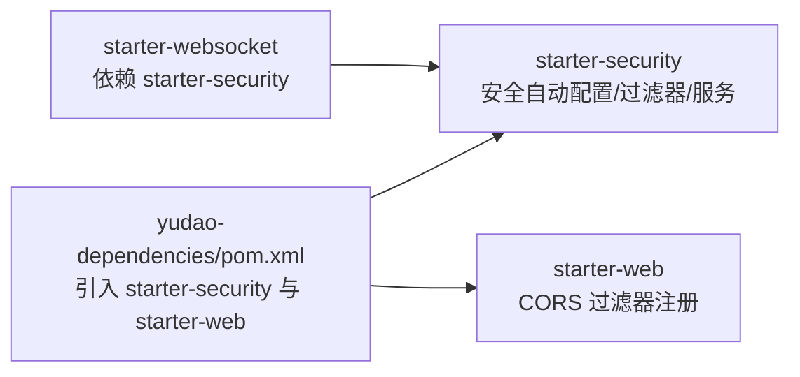

# Spring Security 配置

<cite>
**本文引用的文件**
- [YudaoSecurityAutoConfiguration.java](file://yudao-framework/yudao-spring-boot-starter-security/src/main/java/cn/iocoder/yudao/framework/security/config/YudaoSecurityAutoConfiguration.java)
- [YudaoWebSecurityConfigurerAdapter.java](file://yudao-framework/yudao-spring-boot-starter-security/src/main/java/cn/iocoder/yudao/framework/security/config/YudaoWebSecurityConfigurerAdapter.java)
- [SecurityProperties.java](file://yudao-framework/yudao-spring-boot-starter-security/src/main/java/cn/iocoder/yudao/framework/security/config/SecurityProperties.java)
- [AuthorizeRequestsCustomizer.java](file://yudao-framework/yudao-spring-boot-starter-security/src/main/java/cn/iocoder/yudao/framework/security/config/AuthorizeRequestsCustomizer.java)
- [TokenAuthenticationFilter.java](file://yudao-framework/yudao-spring-boot-starter-security/src/main/java/cn/iocoder/yudao/framework/security/core/filter/TokenAuthenticationFilter.java)
- [SecurityFrameworkServiceImpl.java](file://yudao-framework/yudao-spring-boot-starter-security/src/main/java/cn/iocoder/yudao/framework/security/core/service/SecurityFrameworkServiceImpl.java)
- [SecurityConfiguration.java（infra 模块）](file://yudao-module-infra/src/main/java/cn/iocoder/yudao/module/infra/framework/security/config/SecurityConfiguration.java)
- [SecurityConfiguration.java（report 模块）](file://yudao-module-report/src/main/java/cn/iocoder/yudao/module/report/framework/security/config/SecurityConfiguration.java)
- [YudaoWebAutoConfiguration.java](file://yudao-framework/yudao-spring-boot-starter-web/src/main/java/cn/iocoder/yudao/framework/web/config/YudaoWebAutoConfiguration.java)
- [pom.xml（yudao-dependencies）](file://yudao-dependencies/pom.xml)
</cite>

## 目录
1. [简介](#简介)
2. [项目结构](#项目结构)
3. [核心组件](#核心组件)
4. [架构总览](#架构总览)
5. [组件详解](#组件详解)
6. [依赖关系分析](#依赖关系分析)
7. [性能与安全特性](#性能与安全特性)
8. [故障排查指南](#故障排查指南)
9. [结论](#结论)
10. [附录：配置示例与最佳实践](#附录配置示例与最佳实践)

## 简介
本文件系统性梳理项目中基于 Spring Security 的安全配置，重点覆盖以下方面：
- 自动配置机制与替代方案：解释如何在不使用 WebSecurityConfigurerAdapter 的前提下完成安全配置
- 过滤器链与拦截规则：静态资源放行、免登录注解扫描、统一权限控制与兜底策略
- 自定义 SecurityConfig 编写：密码编码器、会话管理、跨域处理与安全过滤器顺序
- 与 Spring Boot Starter 的集成与依赖管理
- CORS、CSRF、XSS 等常见安全防护建议与落地方式

## 项目结构
围绕 Spring Security 的核心由“自动配置 + 安全过滤器 + 模块化授权规则”三部分组成：
- 自动配置层：负责注册认证入口、异常处理器、密码编码器、Token 过滤器、上下文策略等
- 配置适配层：以 SecurityFilterChain 形式集中定义 URL 放行与鉴权规则
- 模块扩展层：通过 AuthorizeRequestsCustomizer 为各模块追加放行规则

图表来源
- [YudaoSecurityAutoConfiguration.java:1-95](file://yudao-framework/yudao-spring-boot-starter-security/src/main/java/cn/iocoder/yudao/framework/security/config/YudaoSecurityAutoConfiguration.java#L1-L95)
- [YudaoWebSecurityConfigurerAdapter.java:1-222](file://yudao-framework/yudao-spring-boot-starter-security/src/main/java/cn/iocoder/yudao/framework/security/config/YudaoWebSecurityConfigurerAdapter.java#L1-L222)
- [TokenAuthenticationFilter.java:1-120](file://yudao-framework/yudao-spring-boot-starter-security/src/main/java/cn/iocoder/yudao/framework/security/core/filter/TokenAuthenticationFilter.java#L1-L120)
- [AuthorizeRequestsCustomizer.java:1-36](file://yudao-framework/yudao-spring-boot-starter-security/src/main/java/cn/iocoder/yudao/framework/security/config/AuthorizeRequestsCustomizer.java#L1-L36)
- [SecurityConfiguration.java（infra 模块）:1-39](file://yudao-module-infra/src/main/java/cn/iocoder/yudao/module/infra/framework/security/config/SecurityConfiguration.java#L1-L39)
- [SecurityConfiguration.java（report 模块）:1-32](file://yudao-module-report/src/main/java/cn/iocoder/yudao/module/report/framework/security/config/SecurityConfiguration.java#L1-L32)
- [YudaoWebAutoConfiguration.java:106-119](file://yudao-framework/yudao-spring-boot-starter-web/src/main/java/cn/iocoder/yudao/framework/web/config/YudaoWebAutoConfiguration.java#L106-L119)

章节来源
- [YudaoSecurityAutoConfiguration.java:1-95](file://yudao-framework/yudao-spring-boot-starter-security/src/main/java/cn/iocoder/yudao/framework/security/config/YudaoSecurityAutoConfiguration.java#L1-L95)
- [YudaoWebSecurityConfigurerAdapter.java:1-222](file://yudao-framework/yudao-spring-boot-starter-security/src/main/java/cn/iocoder/yudao/framework/security/config/YudaoWebSecurityConfigurerAdapter.java#L1-L222)
- [YudaoWebAutoConfiguration.java:106-119](file://yudao-framework/yudao-spring-boot-starter-web/src/main/java/cn/iocoder/yudao/framework/web/config/YudaoWebAutoConfiguration.java#L106-L119)

## 核心组件
- 自动配置类
  - 认证入口、权限不足处理器、BCrypt 密码编码器、Token 认证过滤器、安全上下文策略
- 配置适配器
  - 基于 SecurityFilterChain 的统一配置，包含 CORS、CSRF、Session、异常处理、URL 放行规则与过滤器链插入
- 过滤器
  - TokenAuthenticationFilter：从请求头或参数提取令牌，校验并写入当前用户上下文
- 模块化授权规则
  - AuthorizeRequestsCustomizer 抽象类 + 各模块实现，按需追加放行规则
- Web 扩展
  - YudaoWebAutoConfiguration 提供 CORS 过滤器注册，确保跨域优先执行

章节来源
- [YudaoSecurityAutoConfiguration.java:43-92](file://yudao-framework/yudao-spring-boot-starter-security/src/main/java/cn/iocoder/yudao/framework/security/config/YudaoSecurityAutoConfiguration.java#L43-L92)
- [YudaoWebSecurityConfigurerAdapter.java:110-153](file://yudao-framework/yudao-spring-boot-starter-security/src/main/java/cn/iocoder/yudao/framework/security/config/YudaoWebSecurityConfigurerAdapter.java#L110-L153)
- [TokenAuthenticationFilter.java:40-69](file://yudao-framework/yudao-spring-boot-starter-security/src/main/java/cn/iocoder/yudao/framework/security/core/filter/TokenAuthenticationFilter.java#L40-L69)
- [AuthorizeRequestsCustomizer.java:16-35](file://yudao-framework/yudao-spring-boot-starter-security/src/main/java/cn/iocoder/yudao/framework/security/config/AuthorizeRequestsCustomizer.java#L16-L35)
- [YudaoWebAutoConfiguration.java:106-119](file://yudao-framework/yudao-spring-boot-starter-web/src/main/java/cn/iocoder/yudao/framework/web/config/YudaoWebAutoConfiguration.java#L106-L119)

## 架构总览
下图展示从请求进入至鉴权完成的关键流程，以及与 CORS、CSRF、Session 的关系。

图表来源
- [YudaoWebAutoConfiguration.java:106-119](file://yudao-framework/yudao-spring-boot-starter-web/src/main/java/cn/iocoder/yudao/framework/web/config/YudaoWebAutoConfiguration.java#L106-L119)
- [YudaoWebSecurityConfigurerAdapter.java:110-153](file://yudao-framework/yudao-spring-boot-starter-security/src/main/java/cn/iocoder/yudao/framework/security/config/YudaoWebSecurityConfigurerAdapter.java#L110-L153)
- [TokenAuthenticationFilter.java:40-69](file://yudao-framework/yudao-spring-boot-starter-security/src/main/java/cn/iocoder/yudao/framework/security/core/filter/TokenAuthenticationFilter.java#L40-L69)
- [SecurityFrameworkServiceImpl.java:24-82](file://yudao-framework/yudao-spring-boot-starter-security/src/main/java/cn/iocoder/yudao/framework/security/core/service/SecurityFrameworkServiceImpl.java#L24-L82)

## 组件详解

### 自动配置类：YudaoSecurityAutoConfiguration
- 负责注册认证入口、权限不足处理器、BCrypt 密码编码器、Token 认证过滤器、安全上下文策略
- 通过 MethodInvokingFactoryBean 将 SecurityContextHolder 策略替换为线程透传策略，便于多线程场景传递用户上下文
- 与 Web 安全配置的顺序控制，确保在 Spring Security 自动配置之前生效

章节来源
- [YudaoSecurityAutoConfiguration.java:43-92](file://yudao-framework/yudao-spring-boot-starter-security/src/main/java/cn/iocoder/yudao/framework/security/config/YudaoSecurityAutoConfiguration.java#L43-L92)

### 配置适配器：YudaoWebSecurityConfigurerAdapter
- 以 SecurityFilterChain 为核心，集中配置：
  - CORS：启用跨域支持
  - CSRF：禁用（无状态令牌机制）
  - Session：STATELESS（无状态）
  - Headers：禁用 frameOptions（如需 iframe 场景可按需调整）
  - 异常处理：绑定认证入口与权限不足处理器
- URL 放行规则分三层：
  - ① 全局共享规则：静态资源、基于 @PermitAll 注解的接口、配置文件中指定的免登录 URL
  - ② 模块化自定义规则：通过 AuthorizeRequestsCustomizer 列表动态注入
  - ③ 兜底规则：除上述之外的所有请求均需认证
- 过滤器链插入：在用户名密码过滤器之前插入 TokenAuthenticationFilter

章节来源
- [YudaoWebSecurityConfigurerAdapter.java:110-153](file://yudao-framework/yudao-spring-boot-starter-security/src/main/java/cn/iocoder/yudao/framework/security/config/YudaoWebSecurityConfigurerAdapter.java#L110-L153)
- [YudaoWebSecurityConfigurerAdapter.java:159-219](file://yudao-framework/yudao-spring-boot-starter-security/src/main/java/cn/iocoder/yudao/framework/security/config/YudaoWebSecurityConfigurerAdapter.java#L159-L219)

### Token 认证过滤器：TokenAuthenticationFilter
- 从请求头或参数提取令牌（支持自定义 Header 与参数名）
- 调用 OAuth2TokenCommonApi 校验令牌有效性，构建 LoginUser 并写入上下文
- 支持 mock 模式（开发调试），但生产务必关闭
- 异常统一交由全局异常处理器处理并返回 JSON

章节来源
- [TokenAuthenticationFilter.java:40-69](file://yudao-framework/yudao-spring-boot-starter-security/src/main/java/cn/iocoder/yudao/framework/security/core/filter/TokenAuthenticationFilter.java#L40-L69)
- [TokenAuthenticationFilter.java:71-93](file://yudao-framework/yudao-spring-boot-starter-security/src/main/java/cn/iocoder/yudao/framework/security/core/filter/TokenAuthenticationFilter.java#L71-L93)
- [TokenAuthenticationFilter.java:105-117](file://yudao-framework/yudao-spring-boot-starter-security/src/main/java/cn/iocoder/yudao/framework/security/core/filter/TokenAuthenticationFilter.java#L105-L117)

### 模块化授权规则：AuthorizeRequestsCustomizer 与模块实现
- AuthorizeRequestsCustomizer 抽象类提供 WebProperties 工具方法，便于拼接 admin/app 前缀
- 各模块通过实现类追加放行规则：
  - infra 模块：Swagger、Actuator、Druid、文件读取
  - report 模块：积木报表、仪表盘等

章节来源
- [AuthorizeRequestsCustomizer.java:16-35](file://yudao-framework/yudao-spring-boot-starter-security/src/main/java/cn/iocoder/yudao/framework/security/config/AuthorizeRequestsCustomizer.java#L16-L35)
- [SecurityConfiguration.java（infra 模块）:15-36](file://yudao-module-infra/src/main/java/cn/iocoder/yudao/module/infra/framework/security/config/SecurityConfiguration.java#L15-L36)
- [SecurityConfiguration.java（report 模块）:15-31](file://yudao-module-report/src/main/java/cn/iocoder/yudao/module/report/framework/security/config/SecurityConfiguration.java#L15-L31)

### 安全框架服务：SecurityFrameworkServiceImpl
- 提供权限、角色、作用域的校验能力，内部通过 PermissionCommonApi 与当前登录用户上下文进行判断
- 支持跨租户访问跳过校验的特殊场景

章节来源
- [SecurityFrameworkServiceImpl.java:24-82](file://yudao-framework/yudao-spring-boot-starter-security/src/main/java/cn/iocoder/yudao/framework/security/core/service/SecurityFrameworkServiceImpl.java#L24-L82)

### Web 层 CORS 配置
- YudaoWebAutoConfiguration 注册 CorsFilter，设置允许凭据、通配符来源/头/方法，并对全部路径生效
- 通过 FilterRegistrationBean 的 order 控制执行顺序，避免跨域配置不生效的问题

章节来源
- [YudaoWebAutoConfiguration.java:106-119](file://yudao-framework/yudao-spring-boot-starter-web/src/main/java/cn/iocoder/yudao/framework/web/config/YudaoWebAutoConfiguration.java#L106-L119)

## 依赖关系分析
- yudao-dependencies 中引入 yudao-spring-boot-starter-security 与 yudao-spring-boot-starter-web，确保安全与 Web 扩展可用
- WebSocket Starter 明确声明对 yudao-spring-boot-starter-security 的依赖（用于与登录用户关联）

图表来源
- [pom.xml（yudao-dependencies）:149-153](file://yudao-dependencies/pom.xml#L149-L153)
- [YudaoWebAutoConfiguration.java:106-119](file://yudao-framework/yudao-spring-boot-starter-web/src/main/java/cn/iocoder/yudao/framework/web/config/YudaoWebAutoConfiguration.java#L106-L119)

章节来源
- [pom.xml（yudao-dependencies）:149-153](file://yudao-dependencies/pom.xml#L149-L153)

## 性能与安全特性
- 无状态设计：Session 策略为 STATELESS，降低服务器内存压力，适合分布式部署
- 过滤器顺序：CORS 过滤器优先执行，确保跨域预检与后续安全链路一致
- 令牌校验：TokenAuthenticationFilter 在进入业务前完成令牌校验与用户上下文注入，减少无效请求处理
- 密码编码：采用 BCryptPasswordEncoder，支持可配置加密复杂度

章节来源
- [YudaoWebSecurityConfigurerAdapter.java:117-118](file://yudao-framework/yudao-spring-boot-starter-security/src/main/java/cn/iocoder/yudao/framework/security/config/YudaoWebSecurityConfigurerAdapter.java#L117-L118)
- [YudaoWebAutoConfiguration.java:106-119](file://yudao-framework/yudao-spring-boot-starter-web/src/main/java/cn/iocoder/yudao/framework/web/config/YudaoWebAutoConfiguration.java#L106-L119)
- [YudaoSecurityAutoConfiguration.java:62-65](file://yudao-framework/yudao-spring-boot-starter-security/src/main/java/cn/iocoder/yudao/framework/security/config/YudaoSecurityAutoConfiguration.java#L62-L65)

## 故障排查指南
- 跨域不生效
  - 检查 CORS 过滤器是否优先执行（order 设置）
  - 确认 Allow-Credentials、允许来源/方法/头是否正确配置
- 403 权限不足
  - 确认 URL 是否被正确放行（@PermitAll 注解、配置文件免登录列表）
  - 检查模块化自定义规则是否生效
- 401 未认证
  - 确认请求是否携带正确的令牌头或参数
  - 检查 TokenAuthenticationFilter 是否正常写入用户上下文
- CSRF 相关问题
  - 项目已禁用 CSRF，若出现前端表单提交问题，请确认是否误用 Session 场景
- XSS 防护
  - 项目未内置专门的 XSS 过滤器，建议结合输入校验、输出转义与内容安全策略（CSP）等综合手段

章节来源
- [YudaoWebAutoConfiguration.java:106-119](file://yudao-framework/yudao-spring-boot-starter-web/src/main/java/cn/iocoder/yudao/framework/web/config/YudaoWebAutoConfiguration.java#L106-L119)
- [YudaoWebSecurityConfigurerAdapter.java:115-118](file://yudao-framework/yudao-spring-boot-starter-security/src/main/java/cn/iocoder/yudao/framework/security/config/YudaoWebSecurityConfigurerAdapter.java#L115-L118)
- [TokenAuthenticationFilter.java:40-69](file://yudao-framework/yudao-spring-boot-starter-security/src/main/java/cn/iocoder/yudao/framework/security/core/filter/TokenAuthenticationFilter.java#L40-L69)

## 结论
本项目采用“自动配置 + SecurityFilterChain + 模块化授权规则”的组合，实现了：
- 无状态、可扩展的安全体系
- 明确的过滤器链与拦截规则
- 与 Web 扩展（CORS）的协同
- 可插拔的模块放行策略

在实际工程中，建议遵循本文的最佳实践，结合业务场景灵活扩展授权规则与安全策略。

## 附录：配置示例与最佳实践

### 如何编写自定义 SecurityConfig
- 建议通过实现 AuthorizeRequestsCustomizer 并以 @Bean 注入的方式，向 SecurityFilterChain 追加模块级放行规则
- 若需覆盖全局放行策略，可在配置类中注入多个 AuthorizeRequestsCustomizer，并通过实现类的 getOrder 控制顺序

章节来源
- [AuthorizeRequestsCustomizer.java:16-35](file://yudao-framework/yudao-spring-boot-starter-security/src/main/java/cn/iocoder/yudao/framework/security/config/AuthorizeRequestsCustomizer.java#L16-L35)
- [SecurityConfiguration.java（infra 模块）:15-36](file://yudao-module-infra/src/main/java/cn/iocoder/yudao/module/infra/framework/security/config/SecurityConfiguration.java#L15-L36)
- [SecurityConfiguration.java（report 模块）:15-31](file://yudao-module-report/src/main/java/cn/iocoder/yudao/module/report/framework/security/config/SecurityConfiguration.java#L15-L31)

### 密码编码器配置
- 使用 BCryptPasswordEncoder，可通过配置项设置加密复杂度
- 生产环境请勿修改默认复杂度，除非有明确性能与合规要求

章节来源
- [YudaoSecurityAutoConfiguration.java:62-65](file://yudao-framework/yudao-spring-boot-starter-security/src/main/java/cn/iocoder/yudao/framework/security/config/YudaoSecurityAutoConfiguration.java#L62-L65)
- [SecurityProperties.java:48-51](file://yudao-framework/yudao-spring-boot-starter-security/src/main/java/cn/iocoder/yudao/framework/security/config/SecurityProperties.java#L48-L51)

### 会话管理与 CSRF
- 会话策略：STATELESS，适用于前后端分离与移动端场景
- CSRF：已禁用，如需启用请评估业务场景并谨慎开启

章节来源
- [YudaoWebSecurityConfigurerAdapter.java:117-118](file://yudao-framework/yudao-spring-boot-starter-security/src/main/java/cn/iocoder/yudao/framework/security/config/YudaoWebSecurityConfigurerAdapter.java#L117-L118)
- [YudaoWebSecurityConfigurerAdapter.java:115-116](file://yudao-framework/yudao-spring-boot-starter-security/src/main/java/cn/iocoder/yudao/framework/security/config/YudaoWebSecurityConfigurerAdapter.java#L115-L116)

### 跨域（CORS）处理
- 通过 YudaoWebAutoConfiguration 注册 CorsFilter，设置 Allow-Credentials、通配来源/头/方法
- 确保 CORS 过滤器 order 优先，避免后续过滤器覆盖跨域配置

章节来源
- [YudaoWebAutoConfiguration.java:106-119](file://yudao-framework/yudao-spring-boot-starter-web/src/main/java/cn/iocoder/yudao/framework/web/config/YudaoWebAutoConfiguration.java#L106-L119)

### XSS 防护建议
- 输入校验：使用参数校验注解与 DTO 校验
- 输出转义：对模板渲染与富文本输出进行 HTML 转义
- 内容安全策略（CSP）：在网关或应用层设置响应头，限制脚本执行来源
- 上传文件：严格校验 MIME 类型与文件内容，避免恶意脚本嵌入

[本节为通用安全建议，不直接对应特定源文件]

### 与 Spring Boot Starter 的集成与依赖管理
- 在 yudao-dependencies 中引入 yudao-spring-boot-starter-security 与 yudao-spring-boot-starter-web
- WebSocket Starter 明确依赖 yudao-spring-boot-starter-security，便于与登录用户关联

章节来源
- [pom.xml（yudao-dependencies）:149-153](file://yudao-dependencies/pom.xml#L149-L153)