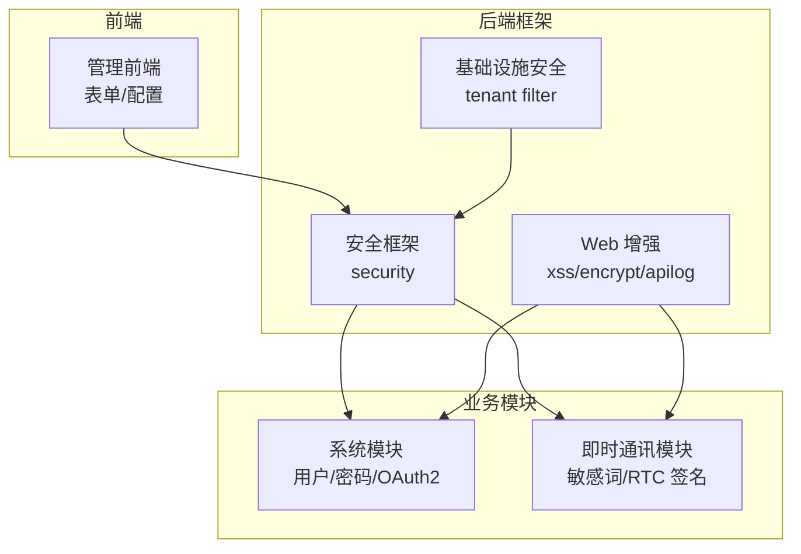
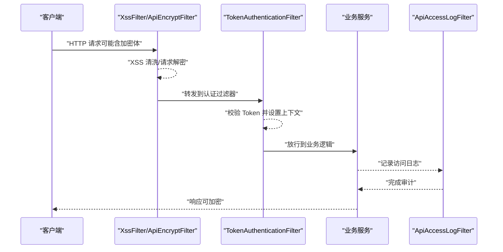
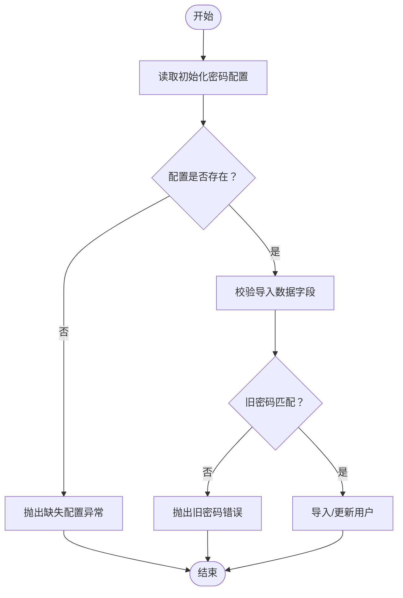
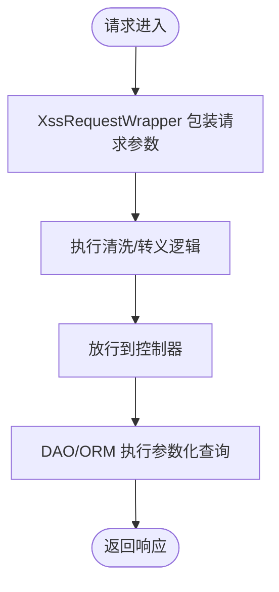
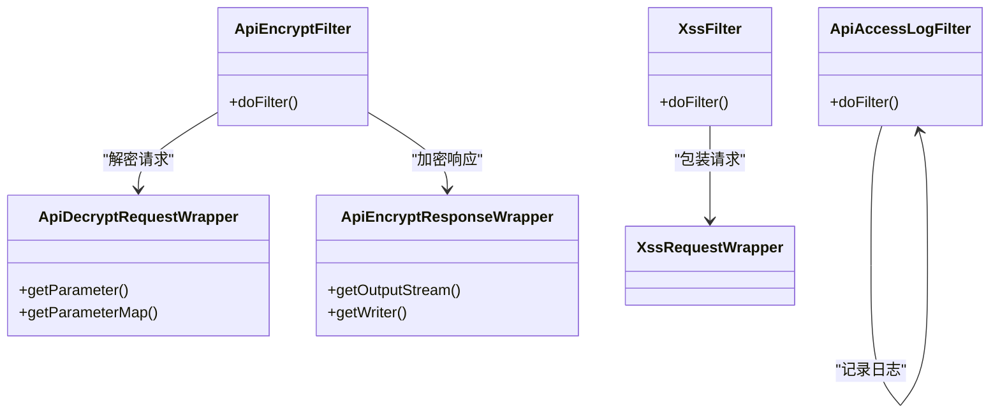
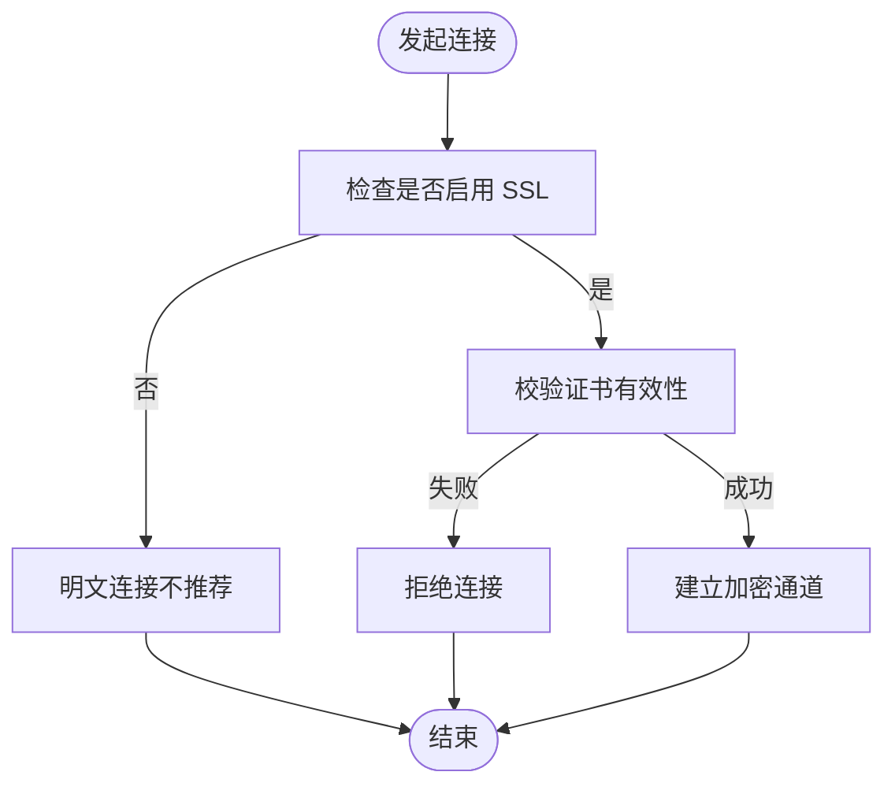
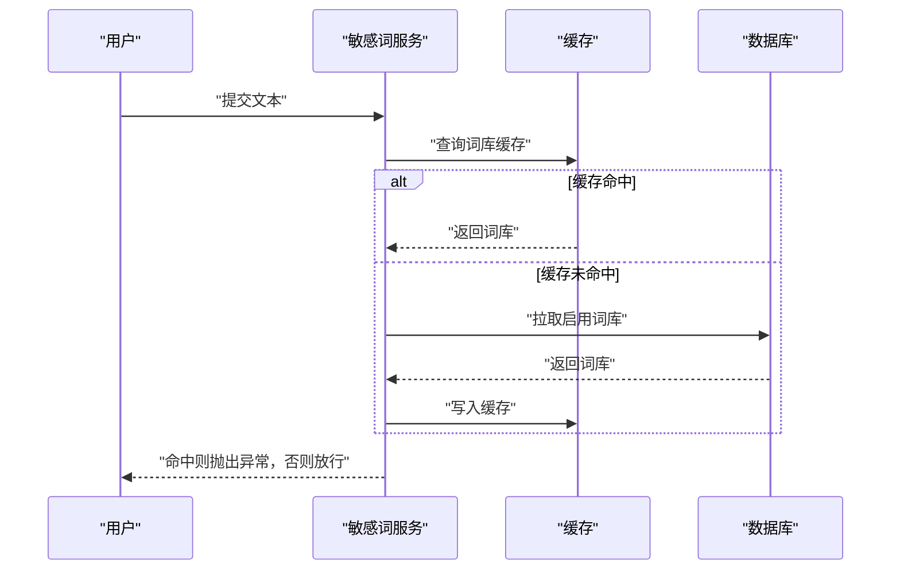
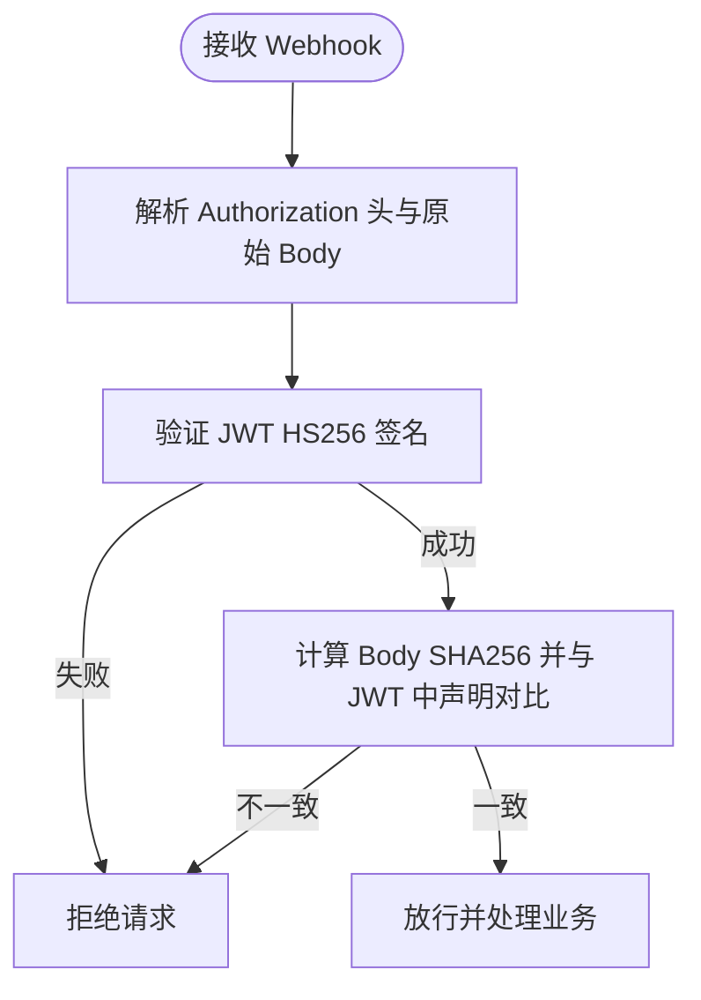
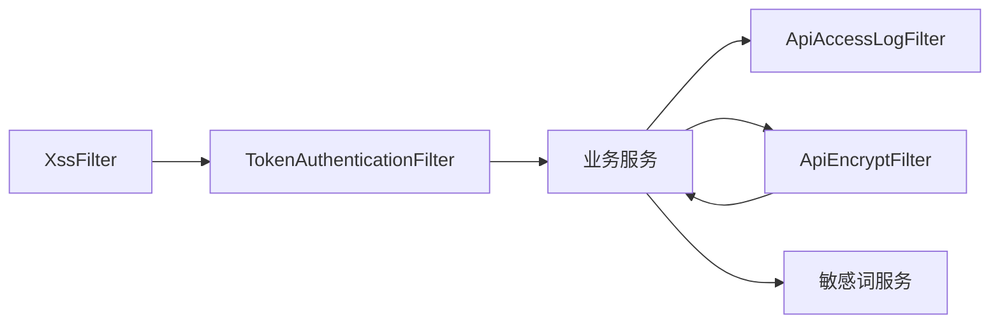

# 安全实践与防护

<cite>
**本文引用的文件**   
- [application.yaml](file://yudao-server/src/main/resources/application.yaml)
- [TokenAuthenticationFilter.java](file://yudao-framework/yudao-spring-boot-starter-security/src/main/java/cn/iocoder/yudao/framework/security/core/filter/TokenAuthenticationFilter.java)
- [SecurityFrameworkServiceImpl.java](file://yudao-framework/yudao-spring-boot-starter-security/src/main/java/cn/iocoder/yudao/framework/security/core/service/SecurityFrameworkServiceImpl.java)
- [SecurityFrameworkUtils.java](file://yudao-framework/yudao-spring-boot-starter-security/src/main/java/cn/iocoder/yudao/framework/security/core/util/SecurityFrameworkUtils.java)
- [XssFilter.java](file://yudao-framework/yudao-spring-boot-starter-web/src/main/java/cn/iocoder/yudao/framework/xss/core/filter/XssFilter.java)
- [XssRequestWrapper.java](file://yudao-framework/yudao-spring-boot-starter-web/src/main/java/cn/iocoder/yudao/framework/xss/core/filter/XssRequestWrapper.java)
- [ApiAccessLogFilter.java](file://yudao-framework/yudao-spring-boot-starter-web/src/main/java/cn/iocoder/yudao/framework/apilog/core/filter/ApiAccessLogFilter.java)
- [ApiEncryptFilter.java](file://yudao-framework/yudao-spring-boot-starter-web/src/main/java/cn/iocoder/yudao/framework/encrypt/core/filter/ApiEncryptFilter.java)
- [ApiDecryptRequestWrapper.java](file://yudao-framework/yudao-spring-boot-starter-web/src/main/java/cn/iocoder/yudao/framework/encrypt/core/filter/ApiDecryptRequestWrapper.java)
- [ApiEncryptResponseWrapper.java](file://yudao-framework/yudao-spring-boot-starter-web/src/main/java/cn/iocoder/yudao/framework/encrypt/core/filter/ApiEncryptResponseWrapper.java)
- [LiveKitClient.java](file://yudao-module-im/src/main/java/cn/iocoder/yudao/module/im/framework/rtc/core/LiveKitClient.java)
- [ImSensitiveWordServiceImpl.java](file://yudao-module-im/src/main/java/cn/iocoder/yudao/module/im/service/sensitiveword/ImSensitiveWordServiceImpl.java)
- [AdminUserServiceImpl.java](file://yudao-module-system/src/main/java/cn/iocoder/yudao/module/system/service/user/AdminUserServiceImpl.java)
- [OAuth2Utils.java](file://yudao-module-system/src/main/java/cn/iocoder/yudao/module/system/util/oauth2/OAuth2Utils.java)
- [WebSocketConfigForm.vue](file://yudao-ui/yudao-ui-admin-vue3/src/views/iot/rule/data/sink/config/WebSocketConfigForm.vue)
- [TcpConfigForm.vue](file://yudao-ui/yudao-ui-admin-vue3/src/views/iot/rule/data/sink/config/TcpConfigForm.vue)
- [ResetPwd.vue](file://yudao-ui/yudao-ui-admin-vue3/src/views/Profile/components/ResetPwd.vue)
- [ForgetPasswordForm.vue](file://yudao-ui/yudao-ui-admin-vue3/src/views/Login/components/ForgetPasswordForm.vue)
</cite>

## 目录
1. [引言](#引言)
2. [项目结构](#项目结构)
3. [核心组件](#核心组件)
4. [架构总览](#架构总览)
5. [详细组件分析](#详细组件分析)
6. [依赖关系分析](#依赖关系分析)
7. [性能考量](#性能考量)
8. [故障排查指南](#故障排查指南)
9. [结论](#结论)
10. [附录](#附录)

## 引言
本文件聚焦于本项目的“安全实践与防护”主题，围绕密码加密与盐值处理、CSRF 防护、XSS 与 SQL 注入防护、安全过滤器配置与自定义、安全审计与日志、HTTPS 与证书管理等维度，结合仓库中的实际实现进行系统化梳理与说明，帮助读者快速理解并落地安全策略。

## 项目结构
本项目采用多模块分层架构，安全相关能力主要分布在如下位置：
- 后端安全框架与通用能力：yudao-framework/yudao-spring-boot-starter-security（认证、授权、过滤器等）
- Web 层安全增强：yudao-framework/yudao-spring-boot-starter-web（XSS 过滤、请求/响应加解密、访问日志）
- 业务模块安全实践：yudao-module-system（用户密码校验、OAuth2 简化模式重定向）、yudao-module-infra（租户隔离安全过滤器）、yudao-module-im（敏感词过滤、Webhook 签名校验）
- 前端安全配置：yudao-ui/yudao-ui-admin-vue3（密码强度校验、登录/重置密码表单规则、WebSocket/TCP SSL 配置）

**图表来源**
- [TokenAuthenticationFilter.java](file://yudao-framework/yudao-spring-boot-starter-security/src/main/java/cn/iocoder/yudao/framework/security/core/filter/TokenAuthenticationFilter.java)
- [XssFilter.java](file://yudao-framework/yudao-spring-boot-starter-web/src/main/java/cn/iocoder/yudao/framework/xss/core/filter/XssFilter.java)
- [ApiEncryptFilter.java](file://yudao-framework/yudao-spring-boot-starter-web/src/main/java/cn/iocoder/yudao/framework/encrypt/core/filter/ApiEncryptFilter.java)
- [ApiAccessLogFilter.java](file://yudao-framework/yudao-spring-boot-starter-web/src/main/java/cn/iocoder/yudao/framework/apilog/core/filter/ApiAccessLogFilter.java)
- [LiveKitClient.java](file://yudao-module-im/src/main/java/cn/iocoder/yudao/module/im/framework/rtc/core/LiveKitClient.java)
- [ImSensitiveWordServiceImpl.java](file://yudao-module-im/src/main/java/cn/iocoder/yudao/module/im/service/sensitiveword/ImSensitiveWordServiceImpl.java)
- [AdminUserServiceImpl.java](file://yudao-module-system/src/main/java/cn/iocoder/yudao/module/system/service/user/AdminUserServiceImpl.java)
- [OAuth2Utils.java](file://yudao-module-system/src/main/java/cn/iocoder/yudao/module/system/util/oauth2/OAuth2Utils.java)

**章节来源**
- [application.yaml](file://yudao-server/src/main/resources/application.yaml)

## 核心组件
- 认证与授权过滤器：基于 Token 的认证过滤器负责拦截请求、提取与校验 Token，并注入当前登录用户上下文。
- XSS 防护：在 Web 层对请求参数进行统一清洗与转义包装，降低反射型与存储型 XSS 风险。
- 请求/响应加解密：对特定接口的请求体与响应体进行对称加解密，提升传输与落库安全性。
- 安全日志：统一记录 API 访问日志与异常日志，便于审计与问题定位。
- 敏感词过滤：在 IM 模块中对文本进行敏感词检测与阻断，并支持缓存与热更新。
- RTC 签名校验：对第三方 Webhook 进行签名校验，确保来源可信与内容未被篡改。
- 密码与强度：系统模块对用户密码进行匹配校验与初始化密码策略控制；前端提供密码强度提示与规则校验。
- OAuth2 简化模式重定向：构建不含授权码的重定向 URI，减少泄露面。

**章节来源**
- [TokenAuthenticationFilter.java](file://yudao-framework/yudao-spring-boot-starter-security/src/main/java/cn/iocoder/yudao/framework/security/core/filter/TokenAuthenticationFilter.java)
- [XssFilter.java](file://yudao-framework/yudao-spring-boot-starter-web/src/main/java/cn/iocoder/yudao/framework/xss/core/filter/XssFilter.java)
- [ApiEncryptFilter.java](file://yudao-framework/yudao-spring-boot-starter-web/src/main/java/cn/iocoder/yudao/framework/encrypt/core/filter/ApiEncryptFilter.java)
- [ApiAccessLogFilter.java](file://yudao-framework/yudao-spring-boot-starter-web/src/main/java/cn/iocoder/yudao/framework/apilog/core/filter/ApiAccessLogFilter.java)
- [ImSensitiveWordServiceImpl.java](file://yudao-module-im/src/main/java/cn/iocoder/yudao/module/im/service/sensitiveword/ImSensitiveWordServiceImpl.java)
- [LiveKitClient.java](file://yudao-module-im/src/main/java/cn/iocoder/yudao/module/im/framework/rtc/core/LiveKitClient.java)
- [AdminUserServiceImpl.java](file://yudao-module-system/src/main/java/cn/iocoder/yudao/module/system/service/user/AdminUserServiceImpl.java)
- [OAuth2Utils.java](file://yudao-module-system/src/main/java/cn/iocoder/yudao/module/system/util/oauth2/OAuth2Utils.java)

## 架构总览
下图展示了从客户端到后端的关键安全交互路径，涵盖认证、XSS 过滤、加解密与日志审计。

**图表来源**
- [XssFilter.java](file://yudao-framework/yudao-spring-boot-starter-web/src/main/java/cn/iocoder/yudao/framework/xss/core/filter/XssFilter.java)
- [ApiEncryptFilter.java](file://yudao-framework/yudao-spring-boot-starter-web/src/main/java/cn/iocoder/yudao/framework/encrypt/core/filter/ApiEncryptFilter.java)
- [TokenAuthenticationFilter.java](file://yudao-framework/yudao-spring-boot-starter-security/src/main/java/cn/iocoder/yudao/framework/security/core/filter/TokenAuthenticationFilter.java)
- [ApiAccessLogFilter.java](file://yudao-framework/yudao-spring-boot-starter-web/src/main/java/cn/iocoder/yudao/framework/apilog/core/filter/ApiAccessLogFilter.java)

## 详细组件分析

### 密码加密与盐值处理、密码强度验证
- 密码匹配校验：系统模块在修改/导入用户时，会调用密码匹配方法进行旧密码校验，确保操作合法性。
- 初始化密码策略：导入用户时强制使用配置项中的初始密码，避免弱口令或空口令进入系统。
- 前端密码强度与规则：重置密码与忘记密码表单均包含最小长度、二次确认等规则；前端组件提供密码强度指示，辅助用户选择更强口令。

**图表来源**
- [AdminUserServiceImpl.java](file://yudao-module-system/src/main/java/cn/iocoder/yudao/module/system/service/user/AdminUserServiceImpl.java)

**章节来源**
- [AdminUserServiceImpl.java](file://yudao-module-system/src/main/java/cn/iocoder/yudao/module/system/service/user/AdminUserServiceImpl.java)
- [ResetPwd.vue](file://yudao-ui/yudao-ui-admin-vue3/src/views/Profile/components/ResetPwd.vue)
- [ForgetPasswordForm.vue](file://yudao-ui/yudao-ui-admin-vue3/src/views/Login/components/ForgetPasswordForm.vue)

### CSRF 防护机制（Token 生成、验证与跨站请求防范）
- 本项目未发现显式的 CSRF Token 生成与校验实现。建议在 Spring Security 中启用 CSRF，默认使用 SameSite Cookie 与隐藏表单 Token 双重防护；对于前后端分离场景，推荐采用 Token 方案并在网关或过滤器中统一校验。
- 当前认证体系以 Token 为主，配合严格的接口权限控制与来源校验，可在一定程度上降低 CSRF 风险，但建议补充 CSRF 专项治理以满足更严格的安全基线。

[本节为概念性说明，不直接分析具体文件，故无“章节来源”]

### XSS 防护与 SQL 注入防护
- XSS 防护：Web 层提供 XssFilter 与 XssRequestWrapper，对请求参数进行统一清洗与转义，避免恶意脚本注入。
- SQL 注入防护：MyBatis 层建议优先使用参数化查询与 ORM 映射，避免拼接 SQL；同时结合白名单校验与最小权限原则，降低注入风险。

**图表来源**
- [XssFilter.java](file://yudao-framework/yudao-spring-boot-starter-web/src/main/java/cn/iocoder/yudao/framework/xss/core/filter/XssFilter.java)
- [XssRequestWrapper.java](file://yudao-framework/yudao-spring-boot-starter-web/src/main/java/cn/iocoder/yudao/framework/xss/core/filter/XssRequestWrapper.java)

**章节来源**
- [XssFilter.java](file://yudao-framework/yudao-spring-boot-starter-web/src/main/java/cn/iocoder/yudao/framework/xss/core/filter/XssFilter.java)
- [XssRequestWrapper.java](file://yudao-framework/yudao-spring-boot-starter-web/src/main/java/cn/iocoder/yudao/framework/xss/core/filter/XssRequestWrapper.java)

### 安全过滤器配置与自定义
- XSS 过滤器：在 Web 层统一拦截请求，对参数进行清洗与转义，建议结合白名单策略与最小必要原则。
- 请求/响应加解密过滤器：对特定接口启用请求解密与响应加密，需在配置中明确生效范围与密钥管理策略。
- 访问日志过滤器：统一记录 API 访问与异常信息，便于审计与溯源。

**图表来源**
- [XssFilter.java](file://yudao-framework/yudao-spring-boot-starter-web/src/main/java/cn/iocoder/yudao/framework/xss/core/filter/XssFilter.java)
- [ApiEncryptFilter.java](file://yudao-framework/yudao-spring-boot-starter-web/src/main/java/cn/iocoder/yudao/framework/encrypt/core/filter/ApiEncryptFilter.java)
- [ApiDecryptRequestWrapper.java](file://yudao-framework/yudao-spring-boot-starter-web/src/main/java/cn/iocoder/yudao/framework/encrypt/core/filter/ApiDecryptRequestWrapper.java)
- [ApiEncryptResponseWrapper.java](file://yudao-framework/yudao-spring-boot-starter-web/src/main/java/cn/iocoder/yudao/framework/encrypt/core/filter/ApiEncryptResponseWrapper.java)
- [ApiAccessLogFilter.java](file://yudao-framework/yudao-spring-boot-starter-web/src/main/java/cn/iocoder/yudao/framework/apilog/core/filter/ApiAccessLogFilter.java)

**章节来源**
- [ApiEncryptFilter.java](file://yudao-framework/yudao-spring-boot-starter-web/src/main/java/cn/iocoder/yudao/framework/encrypt/core/filter/ApiEncryptFilter.java)
- [ApiDecryptRequestWrapper.java](file://yudao-framework/yudao-spring-boot-starter-web/src/main/java/cn/iocoder/yudao/framework/encrypt/core/filter/ApiDecryptRequestWrapper.java)
- [ApiEncryptResponseWrapper.java](file://yudao-framework/yudao-spring-boot-starter-web/src/main/java/cn/iocoder/yudao/framework/encrypt/core/filter/ApiEncryptResponseWrapper.java)
- [ApiAccessLogFilter.java](file://yudao-framework/yudao-spring-boot-starter-web/src/main/java/cn/iocoder/yudao/framework/apilog/core/filter/ApiAccessLogFilter.java)

### 安全审计与日志记录最佳实践
- 访问日志：统一记录请求路径、参数摘要、耗时、状态码与异常信息，建议脱敏敏感字段后再入库。
- 异常日志：捕获并记录异常堆栈，便于问题定位与复盘。
- 审计范围：对关键操作（如密码修改、角色变更、敏感数据导出）单独打点，形成可追溯的操作轨迹。

**章节来源**
- [ApiAccessLogFilter.java](file://yudao-framework/yudao-spring-boot-starter-web/src/main/java/cn/iocoder/yudao/framework/apilog/core/filter/ApiAccessLogFilter.java)

### HTTPS 配置与证书管理
- WebSocket/TCP 配置：前端配置项支持启用 SSL 与证书校验，便于在传输层建立加密通道。
- 证书校验：建议在生产环境开启严格证书校验，定期轮换证书并监控过期时间。

**图表来源**
- [WebSocketConfigForm.vue](file://yudao-ui/yudao-ui-admin-vue3/src/views/iot/rule/data/sink/config/WebSocketConfigForm.vue)
- [TcpConfigForm.vue](file://yudao-ui/yudao-ui-admin-vue3/src/views/iot/rule/data/sink/config/TcpConfigForm.vue)

**章节来源**
- [WebSocketConfigForm.vue](file://yudao-ui/yudao-ui-admin-vue3/src/views/iot/rule/data/sink/config/WebSocketConfigForm.vue)
- [TcpConfigForm.vue](file://yudao-ui/yudao-ui-admin-vue3/src/views/iot/rule/data/sink/config/TcpConfigForm.vue)

### 敏感词过滤与请求限制
- 敏感词过滤：IM 模块提供敏感词服务，支持缓存加载与失效，对文本进行命中阻断，并在词库变更后自动刷新。
- 请求限制：建议在网关或过滤器层引入速率限制与黑名单策略，结合业务场景对高频接口进行保护。

**图表来源**
- [ImSensitiveWordServiceImpl.java](file://yudao-module-im/src/main/java/cn/iocoder/yudao/module/im/service/sensitiveword/ImSensitiveWordServiceImpl.java)

**章节来源**
- [ImSensitiveWordServiceImpl.java](file://yudao-module-im/src/main/java/cn/iocoder/yudao/module/im/service/sensitiveword/ImSensitiveWordServiceImpl.java)

### 第三方 Webhook 签名校验
- RTC Webhook 签名：对来自第三方的 Webhook 进行两步校验：JWT HS256 签名验证与请求体 SHA256 一致性校验，防止伪造与篡改。

**图表来源**
- [LiveKitClient.java](file://yudao-module-im/src/main/java/cn/iocoder/yudao/module/im/framework/rtc/core/LiveKitClient.java)

**章节来源**
- [LiveKitClient.java](file://yudao-module-im/src/main/java/cn/iocoder/yudao/module/im/framework/rtc/core/LiveKitClient.java)

### OAuth2 简化模式重定向
- 构建简化模式下的重定向 URI，包含访问令牌、有效期、作用域与附加信息，避免授权码泄露面。

**章节来源**
- [OAuth2Utils.java](file://yudao-module-system/src/main/java/cn/iocoder/yudao/module/system/util/oauth2/OAuth2Utils.java)

## 依赖关系分析
- 认证链路：XssFilter → TokenAuthenticationFilter → 业务服务；日志链路：业务服务 → ApiAccessLogFilter。
- 加解密链路：ApiEncryptFilter 负责请求解密与响应加密，配合配置文件中的密钥参数。
- 敏感词链路：ImSensitiveWordServiceImpl 依赖缓存与数据库，支持热更新与失效。

**图表来源**
- [XssFilter.java](file://yudao-framework/yudao-spring-boot-starter-web/src/main/java/cn/iocoder/yudao/framework/xss/core/filter/XssFilter.java)
- [TokenAuthenticationFilter.java](file://yudao-framework/yudao-spring-boot-starter-security/src/main/java/cn/iocoder/yudao/framework/security/core/filter/TokenAuthenticationFilter.java)
- [ApiAccessLogFilter.java](file://yudao-framework/yudao-spring-boot-starter-web/src/main/java/cn/iocoder/yudao/framework/apilog/core/filter/ApiAccessLogFilter.java)
- [ApiEncryptFilter.java](file://yudao-framework/yudao-spring-boot-starter-web/src/main/java/cn/iocoder/yudao/framework/encrypt/core/filter/ApiEncryptFilter.java)
- [ImSensitiveWordServiceImpl.java](file://yudao-module-im/src/main/java/cn/iocoder/yudao/module/im/service/sensitiveword/ImSensitiveWordServiceImpl.java)

**章节来源**
- [application.yaml](file://yudao-server/src/main/resources/application.yaml)

## 性能考量
- XSS 清洗与加解密会带来额外 CPU 开销，建议对热点接口进行限流与缓存优化。
- 敏感词缓存命中率直接影响性能，建议合理设置刷新周期与失效策略。
- 日志记录应异步化与采样化，避免成为性能瓶颈。

[本节提供一般性指导，不直接分析具体文件，故无“章节来源”]

## 故障排查指南
- 认证失败：检查 Token 是否过期、签名是否正确、上下文是否注入成功。
- XSS 过度清洗：核对清洗规则与白名单，避免误伤正常参数。
- 加解密异常：确认密钥长度与格式、请求体编码、以及过滤器顺序。
- 敏感词误判：检查词库状态、缓存失效时机与热更新流程。
- Webhook 校验失败：核对第三方签名算法、密钥一致性与请求体哈希比对。

**章节来源**
- [TokenAuthenticationFilter.java](file://yudao-framework/yudao-spring-boot-starter-security/src/main/java/cn/iocoder/yudao/framework/security/core/filter/TokenAuthenticationFilter.java)
- [XssFilter.java](file://yudao-framework/yudao-spring-boot-starter-web/src/main/java/cn/iocoder/yudao/framework/xss/core/filter/XssFilter.java)
- [ApiEncryptFilter.java](file://yudao-framework/yudao-spring-boot-starter-web/src/main/java/cn/iocoder/yudao/framework/encrypt/core/filter/ApiEncryptFilter.java)
- [ImSensitiveWordServiceImpl.java](file://yudao-module-im/src/main/java/cn/iocoder/yudao/module/im/service/sensitiveword/ImSensitiveWordServiceImpl.java)
- [LiveKitClient.java](file://yudao-module-im/src/main/java/cn/iocoder/yudao/module/im/framework/rtc/core/LiveKitClient.java)

## 结论
本项目在安全方面具备较为完善的基础设施：认证授权、XSS 防护、请求/响应加解密、访问日志与敏感词过滤等。建议后续补充 CSRF 专项治理、完善 HTTPS 证书策略与轮换流程，并持续优化性能与可观测性，以满足更高标准的安全基线。

## 附录
- 配置要点：在应用配置中启用/配置加密密钥、日志级别与敏感词缓存策略。
- 最佳实践清单：
  - 强制 HTTPS 与证书校验
  - 使用参数化查询与 ORM
  - 启用 CSRF 保护与 Token 校验
  - 对敏感操作进行审计与告警
  - 定期轮换密钥与证书

**章节来源**
- [application.yaml](file://yudao-server/src/main/resources/application.yaml)