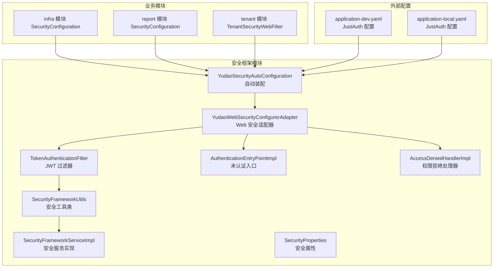
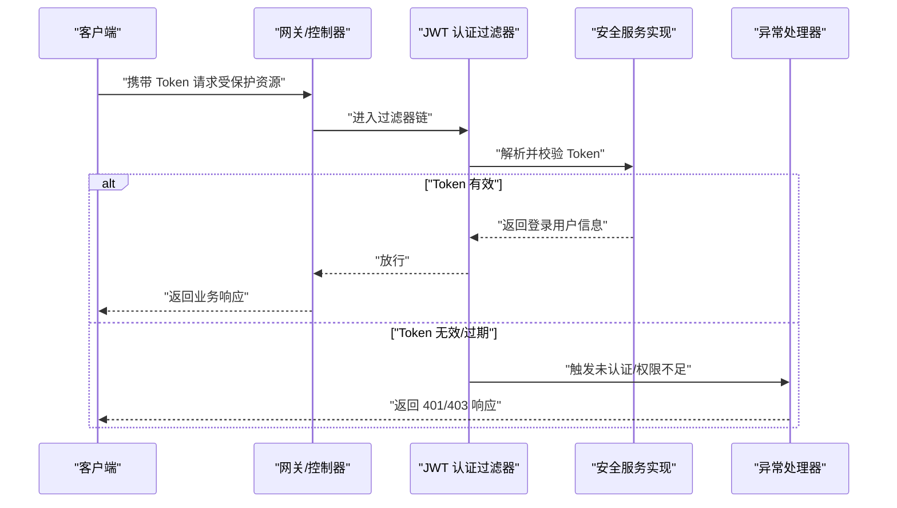
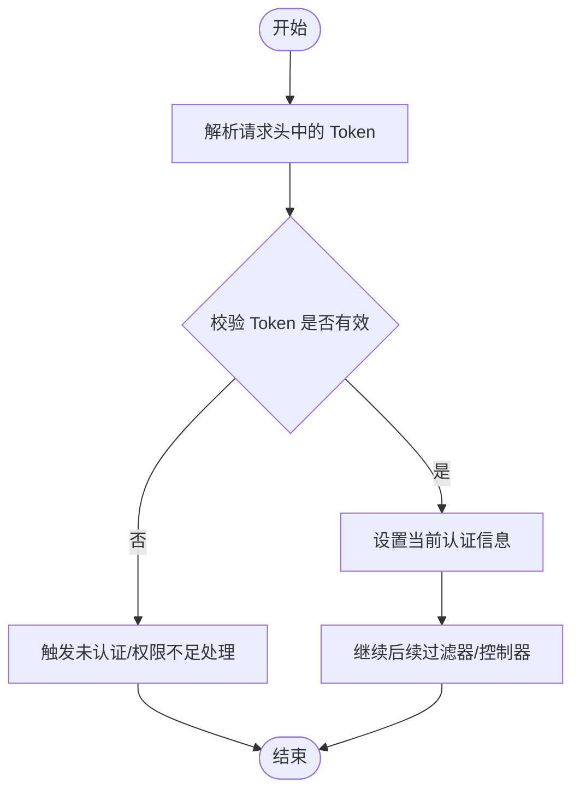
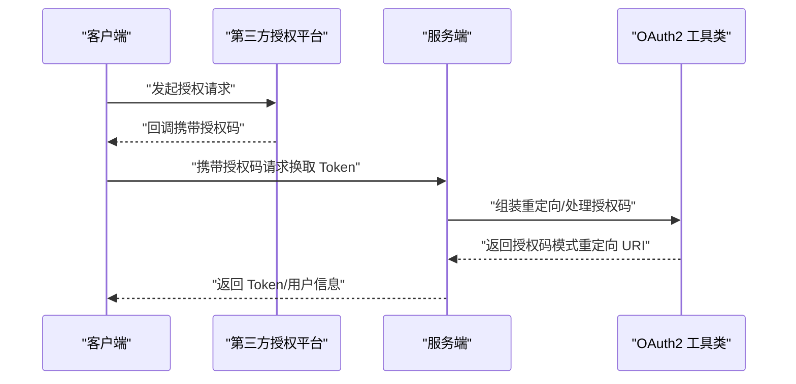
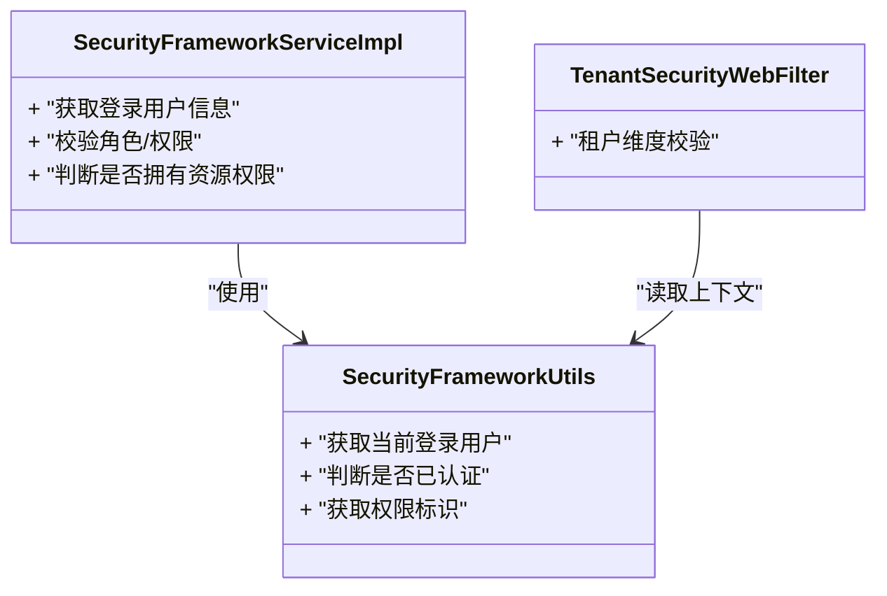
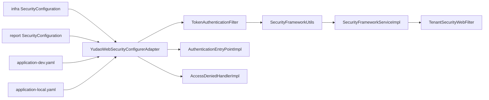

# 安全认证

<cite>
**本文引用的文件**
- [YudaoWebSecurityConfigurerAdapter.java](file://yudao-framework/yudao-spring-boot-starter-security/src/main/java/cn/iocoder/yudao/framework/security/config/YudaoWebSecurityConfigurerAdapter.java)
- [YudaoSecurityAutoConfiguration.java](file://yudao-framework/yudao-spring-boot-starter-security/src/main/java/cn/iocoder/yudao/framework/security/config/YudaoSecurityAutoConfiguration.java)
- [SecurityProperties.java](file://yudao-framework/yudao-spring-boot-starter-security/src/main/java/cn/iocoder/yudao/framework/security/config/SecurityProperties.java)
- [TokenAuthenticationFilter.java](file://yudao-framework/yudao-spring-boot-starter-security/src/main/java/cn/iocoder/yudao/framework/security/core/filter/TokenAuthenticationFilter.java)
- [SecurityFrameworkUtils.java](file://yudao-framework/yudao-spring-boot-starter-security/src/main/java/cn/iocoder/yudao/framework/security/core/util/SecurityFrameworkUtils.java)
- [SecurityFrameworkServiceImpl.java](file://yudao-framework/yudao-spring-boot-starter-security/src/main/java/cn/iocoder/yudao/framework/security/core/service/SecurityFrameworkServiceImpl.java)
- [AuthenticationEntryPointImpl.java](file://yudao-framework/yudao-spring-boot-starter-security/src/main/java/cn/iocoder/yudao/framework/security/core/handler/AuthenticationEntryPointImpl.java)
- [AccessDeniedHandlerImpl.java](file://yudao-framework/yudao-spring-boot-starter-security/src/main/java/cn/iocoder/yudao/framework/security/core/handler/AccessDeniedHandlerImpl.java)
- [SecurityConfiguration.java（infra模块）](file://yudao-module-infra/src/main/java/cn/iocoder/yudao/module/infra/framework/security/config/SecurityConfiguration.java)
- [SecurityConfiguration.java（report模块）](file://yudao-module-report/src/main/java/cn/iocoder/yudao/module/report/framework/security/config/SecurityConfiguration.java)
- [application-dev.yaml](file://yudao-server/src/main/resources/application-dev.yaml)
- [application-local.yaml](file://yudao-server/src/main/resources/application-local.yaml)
- [OAuth2Utils.java](file://yudao-module-system/src/main/java/cn/iocoder/yudao/module/system/util/oauth2/OAuth2Utils.java)
- [TenantSecurityWebFilter.java](file://yudao-framework/yudao-spring-boot-starter-biz-tenant/src/main/java/cn/iocoder/yudao/framework/tenant/core/security/TenantSecurityWebFilter.java)
</cite>

## 目录
1. [简介](#简介)
2. [项目结构](#项目结构)
3. [核心组件](#核心组件)
4. [架构总览](#架构总览)
5. [详细组件分析](#详细组件分析)
6. [依赖关系分析](#依赖关系分析)
7. [性能考虑](#性能考虑)
8. [故障排查指南](#故障排查指南)
9. [结论](#结论)
10. [附录](#附录)

## 简介
本文件系统性梳理并阐述本项目的安全认证体系，覆盖以下方面：
- Spring Security 的集成与配置：包括 WebSecurityConfigurerAdapter 的使用、过滤器链配置与认证机制
- JWT Token 的签发、刷新与失效处理流程
- OAuth2 第三方登录（微信、企业微信、钉钉、支付宝小程序等）的接入与配置
- RBAC 权限控制、资源与接口权限模型
- 密码加密与盐值处理（BCrypt）
- CSRF、XSS、SQL 注入等常见安全威胁的防护策略

## 项目结构
安全相关能力主要由“安全框架”模块提供，并在业务模块中通过自动装配与自定义配置进行扩展；同时，第三方登录能力通过 JustAuth 配置启用。

图示来源
- [YudaoSecurityAutoConfiguration.java:34-120](file://yudao-framework/yudao-spring-boot-starter-security/src/main/java/cn/iocoder/yudao/framework/security/config/YudaoSecurityAutoConfiguration.java#L34-L120)
- [YudaoWebSecurityConfigurerAdapter.java:48-120](file://yudao-framework/yudao-spring-boot-starter-security/src/main/java/cn/iocoder/yudao/framework/security/config/YudaoWebSecurityConfigurerAdapter.java#L48-L120)
- [TokenAuthenticationFilter.java](file://yudao-framework/yudao-spring-boot-starter-security/src/main/java/cn/iocoder/yudao/framework/security/core/filter/TokenAuthenticationFilter.java)
- [SecurityConfiguration.java（infra模块）:12-80](file://yudao-module-infra/src/main/java/cn/iocoder/yudao/module/infra/framework/security/config/SecurityConfiguration.java#L12-L80)
- [SecurityConfiguration.java（report模块）:12-80](file://yudao-module-report/src/main/java/cn/iocoder/yudao/module/report/framework/security/config/SecurityConfiguration.java#L12-L80)
- [application-dev.yaml:181-212](file://yudao-server/src/main/resources/application-dev.yaml#L181-L212)
- [application-local.yaml:253-284](file://yudao-server/src/main/resources/application-local.yaml#L253-L284)

章节来源
- [YudaoSecurityAutoConfiguration.java:34-120](file://yudao-framework/yudao-spring-boot-starter-security/src/main/java/cn/iocoder/yudao/framework/security/config/YudaoSecurityAutoConfiguration.java#L34-L120)
- [YudaoWebSecurityConfigurerAdapter.java:48-120](file://yudao-framework/yudao-spring-boot-starter-security/src/main/java/cn/iocoder/yudao/framework/security/config/YudaoWebSecurityConfigurerAdapter.java#L48-L120)
- [application-dev.yaml:181-212](file://yudao-server/src/main/resources/application-dev.yaml#L181-L212)
- [application-local.yaml:253-284](file://yudao-server/src/main/resources/application-local.yaml#L253-L284)

## 核心组件
- 自动装配与适配器
  - 自动装配类负责加载安全相关组件与默认配置
  - Web 安全适配器用于定制 Web 层的拦截规则、过滤器链与认证机制
- 过滤器链
  - JWT 认证过滤器负责从请求中提取并解析 Token，完成用户身份解析
- 安全工具与服务
  - 工具类提供上下文获取、鉴权常量、Token 解析等通用能力
  - 安全服务实现提供登录用户信息、权限判断等业务能力
- 异常处理
  - 未认证入口与权限拒绝处理器分别处理匿名访问与越权场景
- 业务模块扩展
  - 各业务模块可按需扩展安全配置，或通过租户过滤器实现多租户隔离

章节来源
- [YudaoSecurityAutoConfiguration.java:34-120](file://yudao-framework/yudao-spring-boot-starter-security/src/main/java/cn/iocoder/yudao/framework/security/config/YudaoSecurityAutoConfiguration.java#L34-L120)
- [YudaoWebSecurityConfigurerAdapter.java:48-120](file://yudao-framework/yudao-spring-boot-starter-security/src/main/java/cn/iocoder/yudao/framework/security/config/YudaoWebSecurityConfigurerAdapter.java#L48-L120)
- [TokenAuthenticationFilter.java](file://yudao-framework/yudao-spring-boot-starter-security/src/main/java/cn/iocoder/yudao/framework/security/core/filter/TokenAuthenticationFilter.java)
- [SecurityFrameworkUtils.java:23-120](file://yudao-framework/yudao-spring-boot-starter-security/src/main/java/cn/iocoder/yudao/framework/security/core/util/SecurityFrameworkUtils.java#L23-L120)
- [SecurityFrameworkServiceImpl.java:19-120](file://yudao-framework/yudao-spring-boot-starter-security/src/main/java/cn/iocoder/yudao/framework/security/core/service/SecurityFrameworkServiceImpl.java#L19-L120)
- [AuthenticationEntryPointImpl.java](file://yudao-framework/yudao-spring-boot-starter-security/src/main/java/cn/iocoder/yudao/framework/security/core/handler/AuthenticationEntryPointImpl.java)
- [AccessDeniedHandlerImpl.java](file://yudao-framework/yudao-spring-boot-starter-security/src/main/java/cn/iocoder/yudao/framework/security/core/handler/AccessDeniedHandlerImpl.java)
- [SecurityConfiguration.java（infra模块）:12-80](file://yudao-module-infra/src/main/java/cn/iocoder/yudao/module/infra/framework/security/config/SecurityConfiguration.java#L12-L80)
- [SecurityConfiguration.java（report模块）:12-80](file://yudao-module-report/src/main/java/cn/iocoder/yudao/module/report/framework/security/config/SecurityConfiguration.java#L12-L80)

## 架构总览
下图展示从客户端到后端的典型认证与授权流程，以及第三方登录的接入方式。

图示来源
- [TokenAuthenticationFilter.java](file://yudao-framework/yudao-spring-boot-starter-security/src/main/java/cn/iocoder/yudao/framework/security/core/filter/TokenAuthenticationFilter.java)
- [SecurityFrameworkServiceImpl.java:19-120](file://yudao-framework/yudao-spring-boot-starter-security/src/main/java/cn/iocoder/yudao/framework/security/core/service/SecurityFrameworkServiceImpl.java#L19-L120)
- [AuthenticationEntryPointImpl.java](file://yudao-framework/yudao-spring-boot-starter-security/src/main/java/cn/iocoder/yudao/framework/security/core/handler/AuthenticationEntryPointImpl.java)
- [AccessDeniedHandlerImpl.java](file://yudao-framework/yudao-spring-boot-starter-security/src/main/java/cn/iocoder/yudao/framework/security/core/handler/AccessDeniedHandlerImpl.java)

## 详细组件分析

### WebSecurityConfigurerAdapter 使用与过滤器链
- 适配器职责
  - 定义受保护路径与放行路径
  - 注册自定义 JWT 认证过滤器
  - 配置未认证与权限拒绝处理器
- 过滤器链顺序
  - 通常在用户名密码认证之前执行，以优先解析 Token
- 与业务模块的结合
  - 业务模块可通过各自的 SecurityConfiguration 扩展匹配规则或添加额外过滤器

章节来源
- [YudaoWebSecurityConfigurerAdapter.java:48-120](file://yudao-framework/yudao-spring-boot-starter-security/src/main/java/cn/iocoder/yudao/framework/security/config/YudaoWebSecurityConfigurerAdapter.java#L48-L120)
- [SecurityConfiguration.java（infra模块）:12-80](file://yudao-module-infra/src/main/java/cn/iocoder/yudao/module/infra/framework/security/config/SecurityConfiguration.java#L12-L80)
- [SecurityConfiguration.java（report模块）:12-80](file://yudao-module-report/src/main/java/cn/iocoder/yudao/module/report/framework/security/config/SecurityConfiguration.java#L12-L80)

### JWT Token 的生成、刷新与失效处理
- Token 生成
  - 登录成功后，服务端根据用户信息生成 Token，并设置过期时间
- Token 刷新
  - 可采用短期 Token + 刷新 Token 的策略；短期 Token 过期后，使用刷新 Token 申请新的短期 Token
- Token 失效
  - 支持黑名单/撤销列表机制，或通过缩短过期时间降低风险
- 过滤器解析
  - 过滤器从请求头中提取 Token，调用安全服务进行解析与校验

图示来源
- [TokenAuthenticationFilter.java](file://yudao-framework/yudao-spring-boot-starter-security/src/main/java/cn/iocoder/yudao/framework/security/core/filter/TokenAuthenticationFilter.java)
- [SecurityFrameworkServiceImpl.java:19-120](file://yudao-framework/yudao-spring-boot-starter-security/src/main/java/cn/iocoder/yudao/framework/security/core/service/SecurityFrameworkServiceImpl.java#L19-L120)

### OAuth2 第三方登录（微信、企业微信、钉钉、支付宝等）
- 配置位置
  - 在应用配置文件中开启 JustAuth 并配置各平台的 client-id、client-secret、agent-id 等参数
- 授权流程
  - 客户端跳转至第三方授权页，回调后换取授权码，再换取访问令牌与用户信息
- 重定向构建
  - 工具类提供授权码模式与简化模式下的重定向 URI 组装逻辑

图示来源
- [application-dev.yaml:181-212](file://yudao-server/src/main/resources/application-dev.yaml#L181-L212)
- [application-local.yaml:253-284](file://yudao-server/src/main/resources/application-local.yaml#L253-L284)
- [OAuth2Utils.java:1-68](file://yudao-module-system/src/main/java/cn/iocoder/yudao/module/system/util/oauth2/OAuth2Utils.java#L1-L68)

章节来源
- [application-dev.yaml:181-212](file://yudao-server/src/main/resources/application-dev.yaml#L181-L212)
- [application-local.yaml:253-284](file://yudao-server/src/main/resources/application-local.yaml#L253-L284)
- [OAuth2Utils.java:1-68](file://yudao-module-system/src/main/java/cn/iocoder/yudao/module/system/util/oauth2/OAuth2Utils.java#L1-L68)

### 权限控制：RBAC、资源权限与接口权限
- 角色与权限
  - 登录用户对象包含角色与权限集合，用于判定资源访问
- 接口权限
  - 通过 Web 安全适配器配置受保护接口与放行接口
- 资源权限
  - 结合业务维度（如部门、租户）进行数据级权限控制
- 多租户隔离
  - 租户安全过滤器在请求链路中进行租户维度的校验与隔离

图示来源
- [SecurityFrameworkUtils.java:23-120](file://yudao-framework/yudao-spring-boot-starter-security/src/main/java/cn/iocoder/yudao/framework/security/core/util/SecurityFrameworkUtils.java#L23-L120)
- [SecurityFrameworkServiceImpl.java:19-120](file://yudao-framework/yudao-spring-boot-starter-security/src/main/java/cn/iocoder/yudao/framework/security/core/service/SecurityFrameworkServiceImpl.java#L19-L120)
- [TenantSecurityWebFilter.java:34-80](file://yudao-framework/yudao-spring-boot-starter-biz-tenant/src/main/java/cn/iocoder/yudao/framework/tenant/core/security/TenantSecurityWebFilter.java#L34-L80)

章节来源
- [SecurityFrameworkUtils.java:23-120](file://yudao-framework/yudao-spring-boot-starter-security/src/main/java/cn/iocoder/yudao/framework/security/core/util/SecurityFrameworkUtils.java#L23-L120)
- [SecurityFrameworkServiceImpl.java:19-120](file://yudao-framework/yudao-spring-boot-starter-security/src/main/java/cn/iocoder/yudao/framework/security/core/service/SecurityFrameworkServiceImpl.java#L19-L120)
- [TenantSecurityWebFilter.java:34-80](file://yudao-framework/yudao-spring-boot-starter-biz-tenant/src/main/java/cn/iocoder/yudao/framework/tenant/core/security/TenantSecurityWebFilter.java#L34-L80)

### 密码加密与盐值处理（BCrypt）
- 密码加密
  - 用户密码采用 BCrypt 进行加盐哈希存储，确保不可逆
- 登录校验
  - 登录时使用 BCrypt 校验输入密码与存储哈希的一致性

章节来源
- [SecurityFrameworkServiceImpl.java:19-120](file://yudao-framework/yudao-spring-boot-starter-security/src/main/java/cn/iocoder/yudao/framework/security/core/service/SecurityFrameworkServiceImpl.java#L19-L120)

### CSRF、XSS 与 SQL 注入防护
- CSRF 防护
  - 通过 Spring Security 默认策略与 Token 机制降低风险；建议在前端表单提交时携带 Token 或使用同源策略约束
- XSS 防护
  - 输入输出过滤、富文本编辑器白名单、内容安全策略（CSP）等
- SQL 注入防护
  - 使用参数化查询、ORM 框架、字段级权限与最小暴露原则

章节来源
- [YudaoWebSecurityConfigurerAdapter.java:48-120](file://yudao-framework/yudao-spring-boot-starter-security/src/main/java/cn/iocoder/yudao/framework/security/config/YudaoWebSecurityConfigurerAdapter.java#L48-L120)

## 依赖关系分析
- 组件耦合
  - 过滤器依赖安全服务与工具类；异常处理器独立于业务逻辑
  - 业务模块通过各自 SecurityConfiguration 与自动装配解耦
- 外部依赖
  - JustAuth 提供第三方登录能力
  - Redis 可用于缓存社交登录状态（如 state）

图示来源
- [YudaoWebSecurityConfigurerAdapter.java:48-120](file://yudao-framework/yudao-spring-boot-starter-security/src/main/java/cn/iocoder/yudao/framework/security/config/YudaoWebSecurityConfigurerAdapter.java#L48-L120)
- [TokenAuthenticationFilter.java](file://yudao-framework/yudao-spring-boot-starter-security/src/main/java/cn/iocoder/yudao/framework/security/core/filter/TokenAuthenticationFilter.java)
- [SecurityFrameworkUtils.java:23-120](file://yudao-framework/yudao-spring-boot-starter-security/src/main/java/cn/iocoder/yudao/framework/security/core/util/SecurityFrameworkUtils.java#L23-L120)
- [SecurityFrameworkServiceImpl.java:19-120](file://yudao-framework/yudao-spring-boot-starter-security/src/main/java/cn/iocoder/yudao/framework/security/core/service/SecurityFrameworkServiceImpl.java#L19-L120)
- [SecurityConfiguration.java（infra模块）:12-80](file://yudao-module-infra/src/main/java/cn/iocoder/yudao/module/infra/framework/security/config/SecurityConfiguration.java#L12-L80)
- [SecurityConfiguration.java（report模块）:12-80](file://yudao-module-report/src/main/java/cn/iocoder/yudao/module/report/framework/security/config/SecurityConfiguration.java#L12-L80)
- [application-dev.yaml:181-212](file://yudao-server/src/main/resources/application-dev.yaml#L181-L212)
- [application-local.yaml:253-284](file://yudao-server/src/main/resources/application-local.yaml#L253-L284)

章节来源
- [YudaoWebSecurityConfigurerAdapter.java:48-120](file://yudao-framework/yudao-spring-boot-starter-security/src/main/java/cn/iocoder/yudao/framework/security/config/YudaoWebSecurityConfigurerAdapter.java#L48-L120)
- [application-dev.yaml:181-212](file://yudao-server/src/main/resources/application-dev.yaml#L181-L212)
- [application-local.yaml:253-284](file://yudao-server/src/main/resources/application-local.yaml#L253-L284)

## 性能考虑
- Token 解析与校验
  - 尽量减少 Token 解析次数，避免重复解析；必要时引入本地缓存（如用户信息缓存）
- 过滤器链优化
  - 将高成本校验放在 Token 校验之后，减少无效请求进入后续链路
- 缓存策略
  - 对权限树、字典等静态数据进行缓存，降低数据库压力
- 并发与线程安全
  - 使用线程本地上下文策略保证多线程环境下的安全上下文一致性

## 故障排查指南
- 401 未认证
  - 检查请求头是否携带 Token、Token 是否过期或格式错误
- 403 权限不足
  - 检查用户角色/权限是否具备访问资源的授权
- 第三方登录失败
  - 核对配置文件中的 client-id、client-secret、agent-id 等参数
  - 检查回调地址与 state 缓存配置
- 多租户隔离异常
  - 检查租户维度校验逻辑与上下文传递

章节来源
- [AuthenticationEntryPointImpl.java](file://yudao-framework/yudao-spring-boot-starter-security/src/main/java/cn/iocoder/yudao/framework/security/core/handler/AuthenticationEntryPointImpl.java)
- [AccessDeniedHandlerImpl.java](file://yudao-framework/yudao-spring-boot-starter-security/src/main/java/cn/iocoder/yudao/framework/security/core/handler/AccessDeniedHandlerImpl.java)
- [application-dev.yaml:181-212](file://yudao-server/src/main/resources/application-dev.yaml#L181-L212)
- [application-local.yaml:253-284](file://yudao-server/src/main/resources/application-local.yaml#L253-L284)
- [TenantSecurityWebFilter.java:34-80](file://yudao-framework/yudao-spring-boot-starter-biz-tenant/src/main/java/cn/iocoder/yudao/framework/tenant/core/security/TenantSecurityWebFilter.java#L34-L80)

## 结论
本项目通过 Spring Security 与自研安全框架实现了完善的认证与授权体系，结合 JWT、RBAC、多租户隔离与第三方登录能力，满足企业级应用的安全需求。建议在生产环境中进一步完善缓存策略、监控告警与应急处置流程，持续提升安全性与稳定性。

## 附录
- 关键配置项参考
  - JustAuth 开关与各平台配置
  - 社交登录 state 缓存类型与超时
- 最佳实践
  - 严格区分受保护接口与公开接口
  - 定期轮换密钥与缩短 Token 过期时间
  - 对敏感操作增加二次确认与审计日志