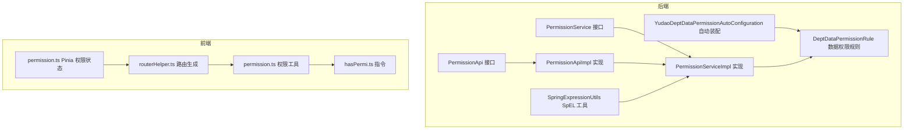
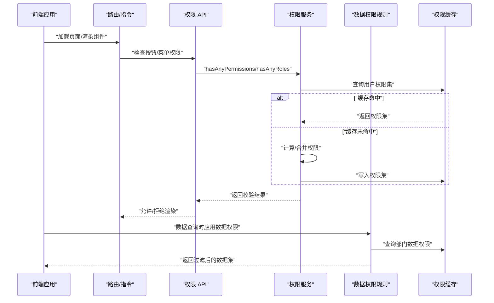
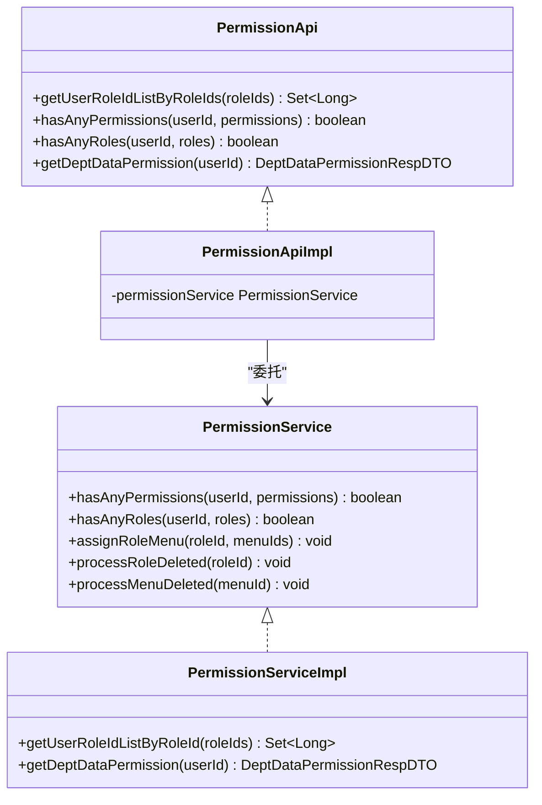
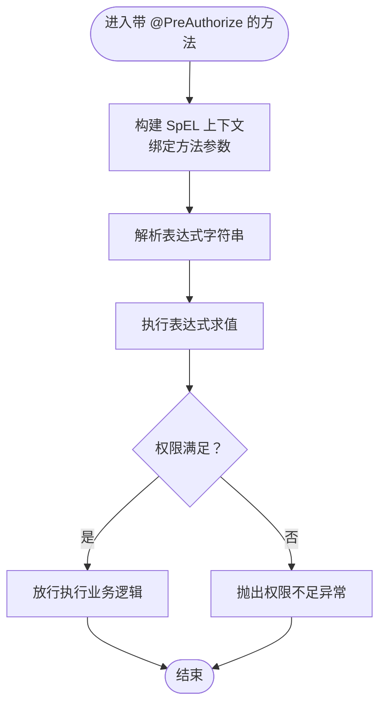
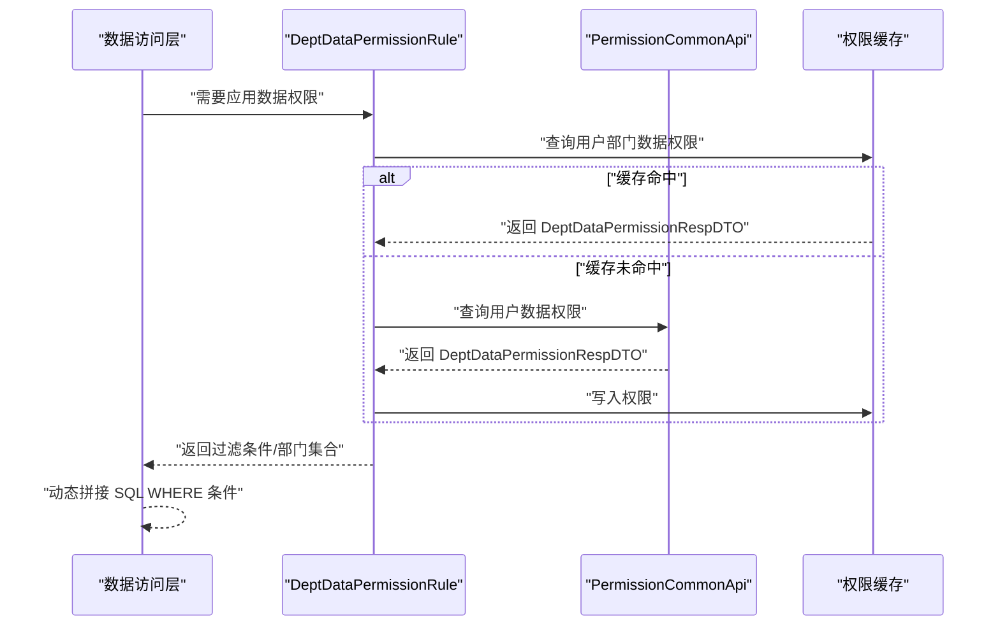
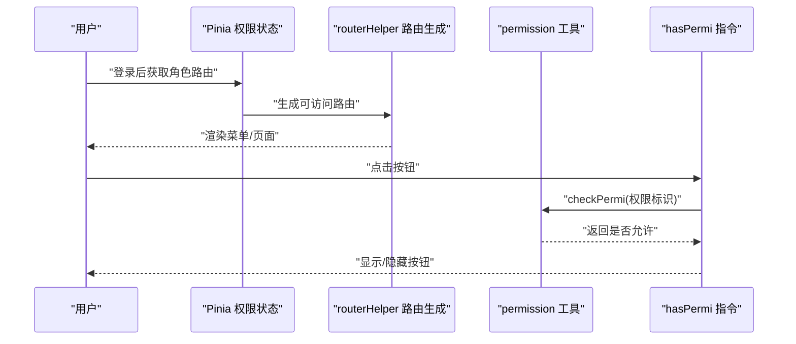

# 权限控制系统

<cite>
**本文档引用的文件**
- [PermissionService.java](file://yudao-module-system/src/main/java/cn/iocoder/yudao/module/system/service/permission/PermissionService.java)
- [PermissionServiceImpl.java](file://yudao-module-system/src/main/java/cn/iocoder/yudao/module/system/service/permission/PermissionServiceImpl.java)
- [PermissionApi.java](file://yudao-module-system/src/main/java/cn/iocoder/yudao/module/system/api/permission/PermissionApi.java)
- [PermissionApiImpl.java](file://yudao-module-system/src/main/java/cn/iocoder/yudao/module/system/api/permission/PermissionApiImpl.java)
- [PermissionAssignUserRoleReqVO.java](file://yudao-module-system/src/main/java/cn/iocoder/yudao/module/system/controller/admin/permission/vo/permission/PermissionAssignUserRoleReqVO.java)
- [PermissionAssignRoleMenuReqVO.java](file://yudao-module-system/src/main/java/cn/iocoder/yudao/module/system/controller/admin/permission/vo/permission/PermissionAssignRoleMenuReqVO.java)
- [SpringExpressionUtils.java](file://yudao-framework/yudao-common/src/main/java/cn/iocoder/yudao/framework/common/util/spring/SpringExpressionUtils.java)
- [DataScopeEnum.java](file://yudao-module-system/src/main/java/cn/iocoder/yudao/module/system/enums/permission/DataScopeEnum.java)
- [DeptDataPermissionRespDTO.java](file://yudao-framework/yudao-common/src/main/java/cn/iocoder/yudao/framework/common/biz/system/permission/dto/DeptDataPermissionRespDTO.java)
- [YudaoDeptDataPermissionAutoConfiguration.java](file://yudao-framework/yudao-spring-boot-starter-biz-data-permission/src/main/java/cn/iocoder/yudao/framework/datapermission/config/YudaoDeptDataPermissionAutoConfiguration.java)
- [DeptDataPermissionRule.java](file://yudao-framework/yudao-spring-boot-starter-biz-data-permission/src/main/java/cn/iocoder/yudao/framework/datapermission/core/rule/dept/DeptDataPermissionRule.java)
- [permission.ts](file://yudao-ui/yudao-ui-admin-vue3/src/utils/permission.ts)
- [hasPermi.ts](file://yudao-ui/yudao-ui-admin-vue3/src/directives/permission/hasPermi.ts)
- [permission.ts](file://yudao-ui/yudao-ui-admin-vue3/src/store/modules/permission.ts)
- [routerHelper.ts](file://yudao-ui/yudao-ui-admin-vue3/src/utils/routerHelper.ts)
- [PermissionCommonApi.java](file://yudao-framework/yudao-common/src/main/java/cn/iocoder/yudao/framework/common/biz/system/permission/PermissionCommonApi.java)
</cite>

## 目录
1. [简介](#简介)
2. [项目结构](#项目结构)
3. [核心组件](#核心组件)
4. [架构总览](#架构总览)
5. [详细组件分析](#详细组件分析)
6. [依赖关系分析](#依赖关系分析)
7. [性能考虑](#性能考虑)
8. [故障排除指南](#故障排除指南)
9. [结论](#结论)

## 简介
本文件系统性阐述基于角色的访问控制（RBAC）模型在本项目中的实现，覆盖用户-角色-权限三层关系设计、接口级与数据级权限控制、菜单与按钮权限控制机制、权限缓存策略与性能优化，以及权限继承与合并逻辑。文档面向技术与非技术读者，提供分层次的解释与可视化图示。

## 项目结构
权限控制涉及后端服务层与前端路由/指令两大部分：
- 后端：系统模块的权限服务与 API、通用权限接口、数据权限自动装配与规则、SpEL 表达式工具
- 前端：权限校验工具函数、指令、路由生成与权限状态存储

**图表来源**
- [PermissionService.java:1-58](file://yudao-module-system/src/main/java/cn/iocoder/yudao/module/system/service/permission/PermissionService.java#L1-L58)
- [PermissionServiceImpl.java:1-25](file://yudao-module-system/src/main/java/cn/iocoder/yudao/module/system/service/permission/PermissionServiceImpl.java#L1-L25)
- [PermissionApi.java:1-23](file://yudao-module-system/src/main/java/cn/iocoder/yudao/module/system/api/permission/PermissionApi.java#L1-L23)
- [PermissionApiImpl.java:1-42](file://yudao-module-system/src/main/java/cn/iocoder/yudao/module/system/api/permission/PermissionApiImpl.java#L1-L42)
- [YudaoDeptDataPermissionAutoConfiguration.java:1-34](file://yudao-framework/yudao-spring-boot-starter-biz-data-permission/src/main/java/cn/iocoder/yudao/framework/datapermission/config/YudaoDeptDataPermissionAutoConfiguration.java#L1-L34)
- [DeptDataPermissionRule.java](file://yudao-framework/yudao-spring-boot-starter-biz-data-permission/src/main/java/cn/iocoder/yudao/framework/datapermission/core/rule/dept/DeptDataPermissionRule.java)
- [SpringExpressionUtils.java:1-101](file://yudao-framework/yudao-common/src/main/java/cn/iocoder/yudao/framework/common/util/spring/SpringExpressionUtils.java#L1-L101)
- [permission.ts:1-36](file://yudao-ui/yudao-ui-admin-vue3/src/utils/permission.ts#L1-L36)
- [hasPermi.ts](file://yudao-ui/yudao-ui-admin-vue3/src/directives/permission/hasPermi.ts)
- [permission.ts:1-79](file://yudao-ui/yudao-ui-admin-vue3/src/store/modules/permission.ts#L1-L79)
- [routerHelper.ts:73-220](file://yudao-ui/yudao-ui-admin-vue3/src/utils/routerHelper.ts#L73-L220)

**章节来源**
- [PermissionService.java:1-58](file://yudao-module-system/src/main/java/cn/iocoder/yudao/module/system/service/permission/PermissionService.java#L1-L58)
- [PermissionServiceImpl.java:1-25](file://yudao-module-system/src/main/java/cn/iocoder/yudao/module/system/service/permission/PermissionServiceImpl.java#L1-L25)
- [PermissionApi.java:1-23](file://yudao-module-system/src/main/java/cn/iocoder/yudao/module/system/api/permission/PermissionApi.java#L1-L23)
- [PermissionApiImpl.java:1-42](file://yudao-module-system/src/main/java/cn/iocoder/yudao/module/system/api/permission/PermissionApiImpl.java#L1-L42)
- [YudaoDeptDataPermissionAutoConfiguration.java:1-34](file://yudao-framework/yudao-spring-boot-starter-biz-data-permission/src/main/java/cn/iocoder/yudao/framework/datapermission/config/YudaoDeptDataPermissionAutoConfiguration.java#L1-L34)
- [DeptDataPermissionRule.java](file://yudao-framework/yudao-spring-boot-starter-biz-data-permission/src/main/java/cn/iocoder/yudao/framework/datapermission/core/rule/dept/DeptDataPermissionRule.java)
- [SpringExpressionUtils.java:1-101](file://yudao-framework/yudao-common/src/main/java/cn/iocoder/yudao/framework/common/util/spring/SpringExpressionUtils.java#L1-L101)
- [permission.ts:1-36](file://yudao-ui/yudao-ui-admin-vue3/src/utils/permission.ts#L1-L36)
- [hasPermi.ts](file://yudao-ui/yudao-ui-admin-vue3/src/directives/permission/hasPermi.ts)
- [permission.ts:1-79](file://yudao-ui/yudao-ui-admin-vue3/src/store/modules/permission.ts#L1-L79)
- [routerHelper.ts:73-220](file://yudao-ui/yudao-ui-admin-vue3/src/utils/routerHelper.ts#L73-L220)

## 核心组件
- 权限服务接口与实现：提供用户-角色、角色-菜单、角色-部门关联权限处理能力，包含权限/角色判断、角色菜单分配、删除清理等方法
- 权限 API 接口与实现：向上游暴露统一权限查询能力，如按角色获取用户集合、权限/角色校验、部门数据权限查询
- 数据权限自动装配与规则：基于部门维度的数据权限规则，通过自动配置注入 DeptDataPermissionRule 并交由自定义器完善表配置
- SpEL 表达式工具：封装从切面或 Bean 工厂解析表达式的能力，支持方法参数变量绑定与批量解析
- 前端权限工具与指令：提供按钮级权限校验与角色校验，结合路由生成与 Pinia 状态管理实现菜单级权限控制

**章节来源**
- [PermissionService.java:1-58](file://yudao-module-system/src/main/java/cn/iocoder/yudao/module/system/service/permission/PermissionService.java#L1-L58)
- [PermissionServiceImpl.java:1-25](file://yudao-module-system/src/main/java/cn/iocoder/yudao/module/system/service/permission/PermissionServiceImpl.java#L1-L25)
- [PermissionApi.java:1-23](file://yudao-module-system/src/main/java/cn/iocoder/yudao/module/system/api/permission/PermissionApi.java#L1-L23)
- [PermissionApiImpl.java:1-42](file://yudao-module-system/src/main/java/cn/iocoder/yudao/module/system/api/permission/PermissionApiImpl.java#L1-L42)
- [YudaoDeptDataPermissionAutoConfiguration.java:1-34](file://yudao-framework/yudao-spring-boot-starter-biz-data-permission/src/main/java/cn/iocoder/yudao/framework/datapermission/config/YudaoDeptDataPermissionAutoConfiguration.java#L1-L34)
- [DeptDataPermissionRule.java](file://yudao-framework/yudao-spring-boot-starter-biz-data-permission/src/main/java/cn/iocoder/yudao/framework/datapermission/core/rule/dept/DeptDataPermissionRule.java)
- [SpringExpressionUtils.java:1-101](file://yudao-framework/yudao-common/src/main/java/cn/iocoder/yudao/framework/common/util/spring/SpringExpressionUtils.java#L1-L101)
- [permission.ts:1-36](file://yudao-ui/yudao-ui-admin-vue3/src/utils/permission.ts#L1-L36)
- [hasPermi.ts](file://yudao-ui/yudao-ui-admin-vue3/src/directives/permission/hasPermi.ts)
- [permission.ts:1-79](file://yudao-ui/yudao-ui-admin-vue3/src/store/modules/permission.ts#L1-L79)
- [routerHelper.ts:73-220](file://yudao-ui/yudao-ui-admin-vue3/src/utils/routerHelper.ts#L73-L220)

## 架构总览
下图展示权限控制的端到端流程：前端路由与按钮权限、后端接口权限与数据权限、以及权限缓存与更新机制。

**图表来源**
- [PermissionApiImpl.java:1-42](file://yudao-module-system/src/main/java/cn/iocoder/yudao/module/system/api/permission/PermissionApiImpl.java#L1-L42)
- [PermissionServiceImpl.java:1-25](file://yudao-module-system/src/main/java/cn/iocoder/yudao/module/system/service/permission/PermissionServiceImpl.java#L1-L25)
- [YudaoDeptDataPermissionAutoConfiguration.java:1-34](file://yudao-framework/yudao-spring-boot-starter-biz-data-permission/src/main/java/cn/iocoder/yudao/framework/datapermission/config/YudaoDeptDataPermissionAutoConfiguration.java#L1-L34)
- [DeptDataPermissionRule.java](file://yudao-framework/yudao-spring-boot-starter-biz-data-permission/src/main/java/cn/iocoder/yudao/framework/datapermission/core/rule/dept/DeptDataPermissionRule.java)
- [permission.ts:1-36](file://yudao-ui/yudao-ui-admin-vue3/src/utils/permission.ts#L1-L36)
- [hasPermi.ts](file://yudao-ui/yudao-ui-admin-vue3/src/directives/permission/hasPermi.ts)
- [permission.ts:1-79](file://yudao-ui/yudao-ui-admin-vue3/src/store/modules/permission.ts#L1-L79)

## 详细组件分析

### RBAC 三层关系设计
- 用户-角色：用户拥有多个角色，角色具备多个权限
- 角色-菜单：角色拥有多个菜单访问权限
- 角色-部门：角色具备不同数据范围的数据权限（全量、指定部门、仅本人等）

**图表来源**
- [PermissionService.java:1-58](file://yudao-module-system/src/main/java/cn/iocoder/yudao/module/system/service/permission/PermissionService.java#L1-L58)
- [PermissionServiceImpl.java:1-25](file://yudao-module-system/src/main/java/cn/iocoder/yudao/module/system/service/permission/PermissionServiceImpl.java#L1-L25)
- [PermissionApi.java:1-23](file://yudao-module-system/src/main/java/cn/iocoder/yudao/module/system/api/permission/PermissionApi.java#L1-L23)
- [PermissionApiImpl.java:1-42](file://yudao-module-system/src/main/java/cn/iocoder/yudao/module/system/api/permission/PermissionApiImpl.java#L1-L42)

**章节来源**
- [PermissionService.java:1-58](file://yudao-module-system/src/main/java/cn/iocoder/yudao/module/system/service/permission/PermissionService.java#L1-L58)
- [PermissionServiceImpl.java:1-25](file://yudao-module-system/src/main/java/cn/iocoder/yudao/module/system/service/permission/PermissionServiceImpl.java#L1-L25)
- [PermissionApi.java:1-23](file://yudao-module-system/src/main/java/cn/iocoder/yudao/module/system/api/permission/PermissionApi.java#L1-L23)
- [PermissionApiImpl.java:1-42](file://yudao-module-system/src/main/java/cn/iocoder/yudao/module/system/api/permission/PermissionApiImpl.java#L1-L42)

### 接口级别权限控制（@PreAuthorize 与 SpEL）
- 使用场景：在控制器或服务方法上通过注解声明权限要求
- 表达式编写：利用 SpEL 从方法参数、SecurityContext、业务对象属性等解析变量
- 工具支撑：SpringExpressionUtils 将 JoinPoint 中的方法签名与实参绑定到 SpEL 上下文，批量解析表达式

**图表来源**
- [SpringExpressionUtils.java:1-101](file://yudao-framework/yudao-common/src/main/java/cn/iocoder/yudao/framework/common/util/spring/SpringExpressionUtils.java#L1-L101)

**章节来源**
- [SpringExpressionUtils.java:1-101](file://yudao-framework/yudao-common/src/main/java/cn/iocoder/yudao/framework/common/util/spring/SpringExpressionUtils.java#L1-L101)

### 数据级别权限控制（数据权限注解与动态过滤）
- 数据范围枚举：定义全量、指定部门、部门及以下、仅本人等数据范围
- 部门数据权限规则：通过自动配置注入 DeptDataPermissionRule，结合 PermissionCommonApi 查询用户数据权限
- 动态过滤：在查询阶段根据规则动态拼接过滤条件，确保用户只能看到其权限范围内的数据

**图表来源**
- [DataScopeEnum.java:1-40](file://yudao-module-system/src/main/java/cn/iocoder/yudao/module/system/enums/permission/DataScopeEnum.java#L1-L40)
- [DeptDataPermissionRespDTO.java:1-35](file://yudao-framework/yudao-common/src/main/java/cn/iocoder/yudao/framework/common/biz/system/permission/dto/DeptDataPermissionRespDTO.java#L1-L35)
- [YudaoDeptDataPermissionAutoConfiguration.java:1-34](file://yudao-framework/yudao-spring-boot-starter-biz-data-permission/src/main/java/cn/iocoder/yudao/framework/datapermission/config/YudaoDeptDataPermissionAutoConfiguration.java#L1-L34)
- [DeptDataPermissionRule.java](file://yudao-framework/yudao-spring-boot-starter-biz-data-permission/src/main/java/cn/iocoder/yudao/framework/datapermission/core/rule/dept/DeptDataPermissionRule.java)
- [PermissionCommonApi.java](file://yudao-framework/yudao-common/src/main/java/cn/iocoder/yudao/framework/common/biz/system/permission/PermissionCommonApi.java)

**章节来源**
- [DataScopeEnum.java:1-40](file://yudao-module-system/src/main/java/cn/iocoder/yudao/module/system/enums/permission/DataScopeEnum.java#L1-L40)
- [DeptDataPermissionRespDTO.java:1-35](file://yudao-framework/yudao-common/src/main/java/cn/iocoder/yudao/framework/common/biz/system/permission/dto/DeptDataPermissionRespDTO.java#L1-L35)
- [YudaoDeptDataPermissionAutoConfiguration.java:1-34](file://yudao-framework/yudao-spring-boot-starter-biz-data-permission/src/main/java/cn/iocoder/yudao/framework/datapermission/config/YudaoDeptDataPermissionAutoConfiguration.java#L1-L34)
- [DeptDataPermissionRule.java](file://yudao-framework/yudao-spring-boot-starter-biz-data-permission/src/main/java/cn/iocoder/yudao/framework/datapermission/core/rule/dept/DeptDataPermissionRule.java)
- [PermissionCommonApi.java](file://yudao-framework/yudao-common/src/main/java/cn/iocoder/yudao/framework/common/biz/system/permission/PermissionCommonApi.java)

### 菜单权限与按钮权限控制
- 菜单权限：前端通过路由生成与 Pinia 状态管理，结合后端下发的角色路由，动态渲染菜单树与导航
- 按钮权限：通过指令与工具函数校验当前用户是否具备特定权限标识，决定按钮/操作项的显隐

**图表来源**
- [permission.ts:1-79](file://yudao-ui/yudao-ui-admin-vue3/src/store/modules/permission.ts#L1-L79)
- [routerHelper.ts:73-220](file://yudao-ui/yudao-ui-admin-vue3/src/utils/routerHelper.ts#L73-L220)
- [permission.ts:1-36](file://yudao-ui/yudao-ui-admin-vue3/src/utils/permission.ts#L1-L36)
- [hasPermi.ts](file://yudao-ui/yudao-ui-admin-vue3/src/directives/permission/hasPermi.ts)

**章节来源**
- [permission.ts:1-79](file://yudao-ui/yudao-ui-admin-vue3/src/store/modules/permission.ts#L1-L79)
- [routerHelper.ts:73-220](file://yudao-ui/yudao-ui-admin-vue3/src/utils/routerHelper.ts#L73-L220)
- [permission.ts:1-36](file://yudao-ui/yudao-ui-admin-vue3/src/utils/permission.ts#L1-L36)
- [hasPermi.ts](file://yudao-ui/yudao-ui-admin-vue3/src/directives/permission/hasPermi.ts)

### 权限缓存策略与性能优化
- 缓存位置：后端权限服务与数据权限规则均支持缓存，减少重复查询
- 缓存键：以用户 ID 为键，存储其权限集合与部门数据权限
- 更新机制：角色/菜单/用户变更时，触发失效或主动刷新缓存，保证一致性
- 性能建议：批量查询、合并权限、延迟加载、合理设置过期时间

[本节为通用指导，无需具体文件分析]

### 权限继承与权限合并
- 继承：角色可继承其他角色的权限，形成层级关系
- 合并：用户最终权限为其所有角色权限的并集；数据权限按“最小范围”原则合并
- 冲突处理：当出现冲突时，遵循“最小授权”与“最大可见”之间的平衡策略

[本节为通用指导，无需具体文件分析]

## 依赖关系分析
后端权限模块与前端权限模块的耦合点主要体现在：
- 前端通过权限 API 获取用户权限与路由数据
- 后端通过数据权限规则在查询阶段动态过滤
- 前端指令与工具函数依赖后端返回的权限标识

**图表来源**
- [PermissionApiImpl.java:1-42](file://yudao-module-system/src/main/java/cn/iocoder/yudao/module/system/api/permission/PermissionApiImpl.java#L1-L42)
- [PermissionServiceImpl.java:1-25](file://yudao-module-system/src/main/java/cn/iocoder/yudao/module/system/service/permission/PermissionServiceImpl.java#L1-L25)
- [YudaoDeptDataPermissionAutoConfiguration.java:1-34](file://yudao-framework/yudao-spring-boot-starter-biz-data-permission/src/main/java/cn/iocoder/yudao/framework/datapermission/config/YudaoDeptDataPermissionAutoConfiguration.java#L1-L34)
- [DeptDataPermissionRule.java](file://yudao-framework/yudao-spring-boot-starter-biz-data-permission/src/main/java/cn/iocoder/yudao/framework/datapermission/core/rule/dept/DeptDataPermissionRule.java)
- [permission.ts:1-36](file://yudao-ui/yudao-ui-admin-vue3/src/utils/permission.ts#L1-L36)
- [hasPermi.ts](file://yudao-ui/yudao-ui-admin-vue3/src/directives/permission/hasPermi.ts)
- [routerHelper.ts:73-220](file://yudao-ui/yudao-ui-admin-vue3/src/utils/routerHelper.ts#L73-L220)

**章节来源**
- [PermissionApiImpl.java:1-42](file://yudao-module-system/src/main/java/cn/iocoder/yudao/module/system/api/permission/PermissionApiImpl.java#L1-L42)
- [PermissionServiceImpl.java:1-25](file://yudao-module-system/src/main/java/cn/iocoder/yudao/module/system/service/permission/PermissionServiceImpl.java#L1-L25)
- [YudaoDeptDataPermissionAutoConfiguration.java:1-34](file://yudao-framework/yudao-spring-boot-starter-biz-data-permission/src/main/java/cn/iocoder/yudao/framework/datapermission/config/YudaoDeptDataPermissionAutoConfiguration.java#L1-L34)
- [DeptDataPermissionRule.java](file://yudao-framework/yudao-spring-boot-starter-biz-data-permission/src/main/java/cn/iocoder/yudao/framework/datapermission/core/rule/dept/DeptDataPermissionRule.java)
- [permission.ts:1-36](file://yudao-ui/yudao-ui-admin-vue3/src/utils/permission.ts#L1-L36)
- [hasPermi.ts](file://yudao-ui/yudao-ui-admin-vue3/src/directives/permission/hasPermi.ts)
- [routerHelper.ts:73-220](file://yudao-ui/yudao-ui-admin-vue3/src/utils/routerHelper.ts#L73-L220)

## 性能考虑
- 缓存优先：优先从缓存读取权限与数据权限，降低数据库压力
- 批量查询：在一次请求中批量获取用户权限与路由，减少往返次数
- 延迟加载：菜单与按钮权限在首次访问时再加载，提升首屏性能
- 合理过期：为权限缓存设置合适的过期时间，平衡实时性与性能

[本节为通用指导，无需具体文件分析]

## 故障排除指南
- 按钮/菜单不显示
  - 检查后端权限 API 返回的用户权限集合是否包含所需标识
  - 确认前端指令/工具函数调用是否正确传递权限标识
- 数据越权
  - 检查数据权限规则是否正确配置与生效
  - 确认用户所属部门与数据权限范围匹配
- 权限更新不生效
  - 触发缓存失效或手动刷新用户权限缓存
  - 确认角色/菜单/用户变更后是否正确清理相关缓存

[本节为通用指导，无需具体文件分析]

## 结论
本权限控制系统以 RBAC 为核心，结合接口级与数据级权限控制、菜单与按钮权限联动、以及完善的缓存与更新机制，实现了高可用、高性能、易维护的权限体系。通过前后端协同与自动化配置，系统在保证安全的同时兼顾了开发效率与用户体验。