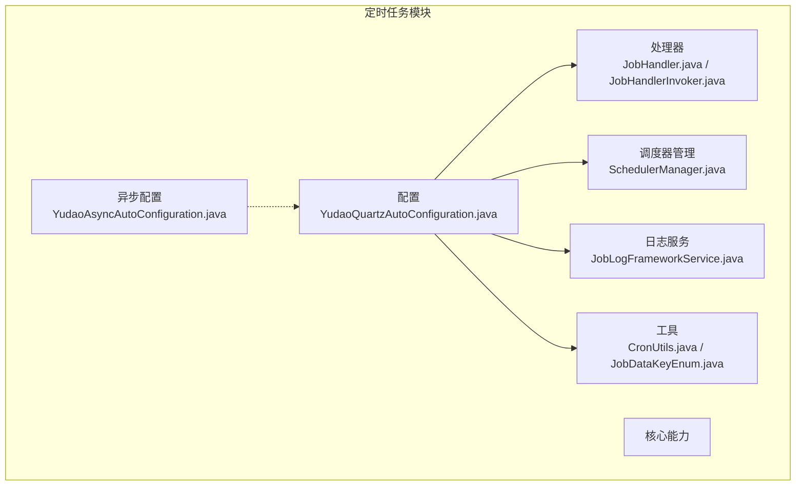
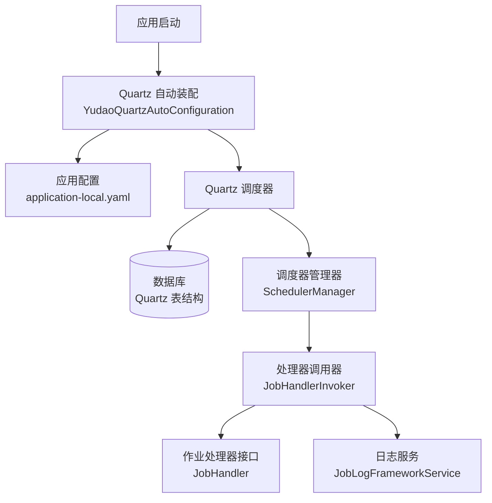
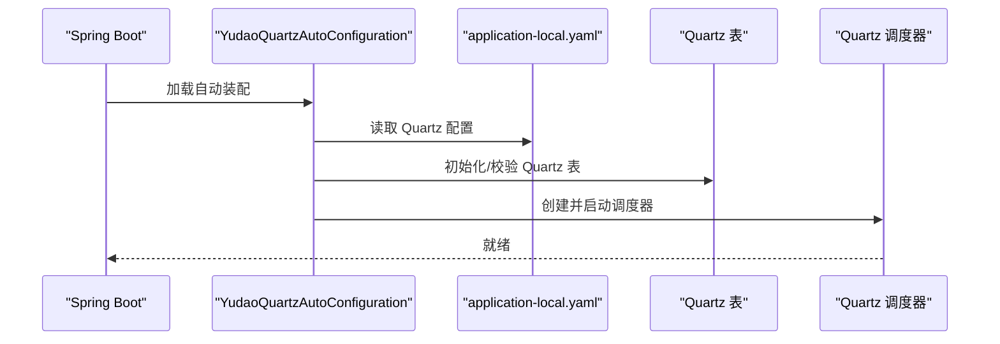
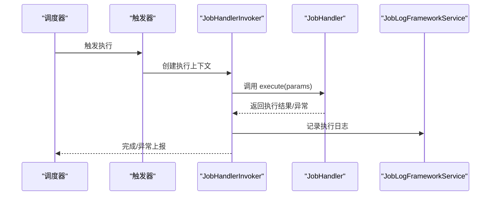
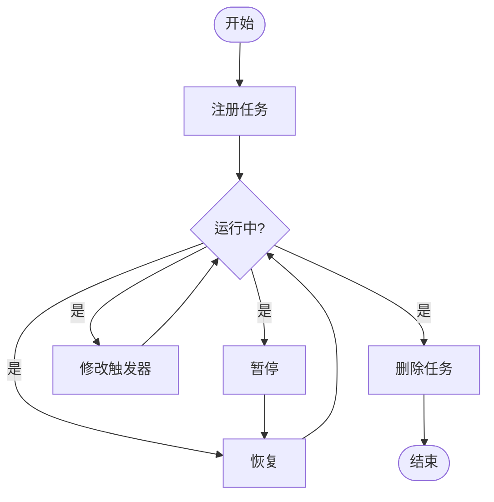
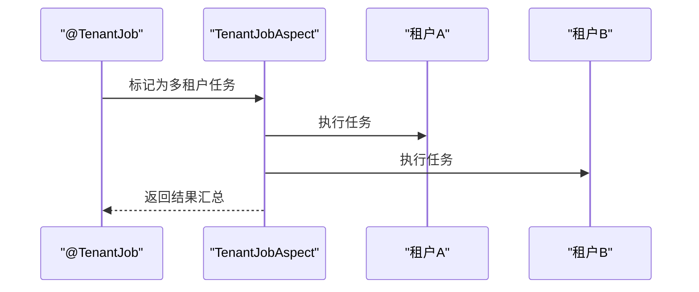
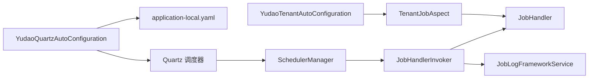

# 定时任务

<cite>
**本文引用的文件**
- [YudaoQuartzAutoConfiguration.java](file://yudao-framework/yudao-spring-boot-starter-job/src/main/java/cn/iocoder/yudao/framework/quartz/config/YudaoQuartzAutoConfiguration.java)
- [YudaoAsyncAutoConfiguration.java](file://yudao-framework/yudao-spring-boot-starter-job/src/main/java/cn/iocoder/yudao/framework/quartz/config/YudaoAsyncAutoConfiguration.java)
- [JobHandler.java](file://yudao-framework/yudao-spring-boot-starter-job/src/main/java/cn/iocoder/yudao/framework/quartz/core/handler/JobHandler.java)
- [JobHandlerInvoker.java](file://yudao-framework/yudao-spring-boot-starter-job/src/main/java/cn/iocoder/yudao/framework/quartz/core/handler/JobHandlerInvoker.java)
- [SchedulerManager.java](file://yudao-framework/yudao-spring-boot-starter-job/src/main/java/cn/iocoder/yudao/framework/quartz/core/scheduler/SchedulerManager.java)
- [JobLogFrameworkService.java](file://yudao-framework/yudao-spring-boot-starter-job/src/main/java/cn/iocoder/yudao/framework/quartz/core/service/JobLogFrameworkService.java)
- [CronUtils.java](file://yudao-framework/yudao-spring-boot-starter-job/src/main/java/cn/iocoder/yudao/framework/quartz/core/util/CronUtils.java)
- [JobDataKeyEnum.java](file://yudao-framework/yudao-spring-boot-starter-job/src/main/java/cn/iocoder/yudao/framework/quartz/core/enums/JobDataKeyEnum.java)
- [application-local.yaml](file://yudao-server/src/main/resources/application-local.yaml)
- [quartz.sql](file://sql/mysql/quartz.sql)
- [TenantJob.java](file://yudao-framework/yudao-spring-boot-starter-biz-tenant/src/main/java/cn/iocoder/yudao/framework/tenant/core/job/TenantJob.java)
- [TenantJobAspect.java](file://yudao-framework/yudao-spring-boot-starter-biz-tenant/src/main/java/cn/iocoder/yudao/framework/tenant/core/job/TenantJobAspect.java)
- [YudaoTenantAutoConfiguration.java](file://yudao-framework/yudao-spring-boot-starter-biz-tenant/src/main/java/cn/iocoder/yudao/framework/tenant/config/YudaoTenantAutoConfiguration.java)
</cite>

## 目录
1. [引言](#引言)
2. [项目结构](#项目结构)
3. [核心组件](#核心组件)
4. [架构总览](#架构总览)
5. [详细组件分析](#详细组件分析)
6. [依赖关系分析](#依赖关系分析)
7. [性能考量](#性能考量)
8. [故障排查指南](#故障排查指南)
9. [结论](#结论)
10. [附录](#附录)

## 引言
本文件系统化梳理项目中基于 Quartz 的定时任务体系，覆盖以下主题：
- Quartz 在项目中的集成与配置（自动装配、存储、线程池、集群）
- 作业定义、触发器配置与调度器管理
- 动态任务管理（增删改查、状态控制、运行时调整）
- 分布式任务调度（集群部署、分片与负载均衡思路）
- 任务执行监控（日志、指标、异常告警）
- 最佳实践（Cron 编写、参数传递、超时处理）
- 与业务系统的集成（事件驱动、依赖管理）

## 项目结构
定时任务模块位于 yudao-framework/yudao-spring-boot-starter-job，采用“配置 + 核心能力 + 工具”的分层组织方式：
- config：自动装配入口，负责加载 Quartz 配置与注册调度器
- core：核心能力
  - handler：作业处理器接口与调用器
  - scheduler：调度器管理器
  - service：作业日志服务
  - util：Cron 工具
  - enums：作业数据键枚举
- 资源：Spring 自动装配导入清单

图表来源
- [YudaoQuartzAutoConfiguration.java](file://yudao-framework/yudao-spring-boot-starter-job/src/main/java/cn/iocoder/yudao/framework/quartz/config/YudaoQuartzAutoConfiguration.java)
- [YudaoAsyncAutoConfiguration.java](file://yudao-framework/yudao-spring-boot-starter-job/src/main/java/cn/iocoder/yudao/framework/quartz/config/YudaoAsyncAutoConfiguration.java)
- [JobHandler.java](file://yudao-framework/yudao-spring-boot-starter-job/src/main/java/cn/iocoder/yudao/framework/quartz/core/handler/JobHandler.java)
- [JobHandlerInvoker.java](file://yudao-framework/yudao-spring-boot-starter-job/src/main/java/cn/iocoder/yudao/framework/quartz/core/handler/JobHandlerInvoker.java)
- [SchedulerManager.java](file://yudao-framework/yudao-spring-boot-starter-job/src/main/java/cn/iocoder/yudao/framework/quartz/core/scheduler/SchedulerManager.java)
- [JobLogFrameworkService.java](file://yudao-framework/yudao-spring-boot-starter-job/src/main/java/cn/iocoder/yudao/framework/quartz/core/service/JobLogFrameworkService.java)
- [CronUtils.java](file://yudao-framework/yudao-spring-boot-starter-job/src/main/java/cn/iocoder/yudao/framework/quartz/core/util/CronUtils.java)
- [JobDataKeyEnum.java](file://yudao-framework/yudao-spring-boot-starter-job/src/main/java/cn/iocoder/yudao/framework/quartz/core/enums/JobDataKeyEnum.java)

章节来源
- [YudaoQuartzAutoConfiguration.java](file://yudao-framework/yudao-spring-boot-starter-job/src/main/java/cn/iocoder/yudao/framework/quartz/config/YudaoQuartzAutoConfiguration.java)
- [YudaoAsyncAutoConfiguration.java](file://yudao-framework/yudao-spring-boot-starter-job/src/main/java/cn/iocoder/yudao/framework/quartz/config/YudaoAsyncAutoConfiguration.java)

## 核心组件
- 作业处理器接口：定义统一的执行入口，便于扩展不同业务任务
- 作业处理器调用器：封装 Quartz 上下文，负责参数解析、异常处理与日志记录
- 调度器管理器：提供任务的动态注册、暂停、恢复、删除等生命周期管理
- 日志服务：记录每次任务执行结果，支持查询与统计
- Cron 工具：提供 Cron 表达式校验与辅助方法
- 作业数据键枚举：规范作业参数传递的键名

章节来源
- [JobHandler.java](file://yudao-framework/yudao-spring-boot-starter-job/src/main/java/cn/iocoder/yudao/framework/quartz/core/handler/JobHandler.java)
- [JobHandlerInvoker.java](file://yudao-framework/yudao-spring-boot-starter-job/src/main/java/cn/iocoder/yudao/framework/quartz/core/handler/JobHandlerInvoker.java)
- [SchedulerManager.java](file://yudao-framework/yudao-spring-boot-starter-job/src/main/java/cn/iocoder/yudao/framework/quartz/core/scheduler/SchedulerManager.java)
- [JobLogFrameworkService.java](file://yudao-framework/yudao-spring-boot-starter-job/src/main/java/cn/iocoder/yudao/framework/quartz/core/service/JobLogFrameworkService.java)
- [CronUtils.java](file://yudao-framework/yudao-spring-boot-starter-job/src/main/java/cn/iocoder/yudao/framework/quartz/core/util/CronUtils.java)
- [JobDataKeyEnum.java](file://yudao-framework/yudao-spring-boot-starter-job/src/main/java/cn/iocoder/yudao/framework/quartz/core/enums/JobDataKeyEnum.java)

## 架构总览
整体架构围绕 Quartz Scheduler 展开，通过自动装配加载配置，结合 JDBC JobStore 实现持久化与集群能力；业务侧通过 JobHandler 接口注入具体任务逻辑。

图表来源
- [YudaoQuartzAutoConfiguration.java](file://yudao-framework/yudao-spring-boot-starter-job/src/main/java/cn/iocoder/yudao/framework/quartz/config/YudaoQuartzAutoConfiguration.java)
- [application-local.yaml](file://yudao-server/src/main/resources/application-local.yaml)
- [quartz.sql](file://sql/mysql/quartz.sql)
- [SchedulerManager.java](file://yudao-framework/yudao-spring-boot-starter-job/src/main/java/cn/iocoder/yudao/framework/quartz/core/scheduler/SchedulerManager.java)
- [JobHandlerInvoker.java](file://yudao-framework/yudao-spring-boot-starter-job/src/main/java/cn/iocoder/yudao/framework/quartz/core/handler/JobHandlerInvoker.java)
- [JobLogFrameworkService.java](file://yudao-framework/yudao-spring-boot-starter-job/src/main/java/cn/iocoder/yudao/framework/quartz/core/service/JobLogFrameworkService.java)

## 详细组件分析

### Quartz 自动装配与配置
- 自动装配类负责加载 Quartz 属性、初始化调度器，并启用 JDBC JobStore 以支持持久化与集群
- 应用配置中启用了集群模式、线程池大小、关闭策略等关键参数
- Quartz 表结构由 SQL 文件提供，包含作业详情、触发器、简单触发器等表及索引

图表来源
- [YudaoQuartzAutoConfiguration.java](file://yudao-framework/yudao-spring-boot-starter-job/src/main/java/cn/iocoder/yudao/framework/quartz/config/YudaoQuartzAutoConfiguration.java)
- [application-local.yaml](file://yudao-server/src/main/resources/application-local.yaml)
- [quartz.sql](file://sql/mysql/quartz.sql)

章节来源
- [YudaoQuartzAutoConfiguration.java](file://yudao-framework/yudao-spring-boot-starter-job/src/main/java/cn/iocoder/yudao/framework/quartz/config/YudaoQuartzAutoConfiguration.java)
- [application-local.yaml](file://yudao-server/src/main/resources/application-local.yaml)
- [quartz.sql](file://sql/mysql/quartz.sql)

### 作业处理器与调用链
- JobHandler 定义了统一的任务执行接口
- JobHandlerInvoker 封装 Quartz 上下文，负责参数提取、异常转译、执行后数据持久化与日志记录
- 调用链遵循“调度器 -> 触发器 -> 调用器 -> 处理器”的顺序

图表来源
- [JobHandlerInvoker.java](file://yudao-framework/yudao-spring-boot-starter-job/src/main/java/cn/iocoder/yudao/framework/quartz/core/handler/JobHandlerInvoker.java)
- [JobHandler.java](file://yudao-framework/yudao-spring-boot-starter-job/src/main/java/cn/iocoder/yudao/framework/quartz/core/handler/JobHandler.java)
- [JobLogFrameworkService.java](file://yudao-framework/yudao-spring-boot-starter-job/src/main/java/cn/iocoder/yudao/framework/quartz/core/service/JobLogFrameworkService.java)

章节来源
- [JobHandler.java](file://yudao-framework/yudao-spring-boot-starter-job/src/main/java/cn/iocoder/yudao/framework/quartz/core/handler/JobHandler.java)
- [JobHandlerInvoker.java](file://yudao-framework/yudao-spring-boot-starter-job/src/main/java/cn/iocoder/yudao/framework/quartz/core/handler/JobHandlerInvoker.java)
- [JobLogFrameworkService.java](file://yudao-framework/yudao-spring-boot-starter-job/src/main/java/cn/iocoder/yudao/framework/quartz/core/service/JobLogFrameworkService.java)

### 调度器管理器（动态任务管理）
- 提供任务的动态注册、修改、暂停、恢复、删除等操作
- 支持运行时对触发器进行调整（如重新设定 Cron 或时间间隔）
- 结合日志服务，可实现任务状态可视化与审计

图表来源
- [SchedulerManager.java](file://yudao-framework/yudao-spring-boot-starter-job/src/main/java/cn/iocoder/yudao/framework/quartz/core/scheduler/SchedulerManager.java)

章节来源
- [SchedulerManager.java](file://yudao-framework/yudao-spring-boot-starter-job/src/main/java/cn/iocoder/yudao/framework/quartz/core/scheduler/SchedulerManager.java)

### Cron 工具与表达式最佳实践
- CronUtils 提供表达式校验与辅助方法，降低错误率
- 建议优先使用 Quartz 支持的 6 段或 7 段表达式，避免跨平台差异
- 复杂场景建议配合“简单触发器”或“日历触发器”实现更灵活的时间窗控制

章节来源
- [CronUtils.java](file://yudao-framework/yudao-spring-boot-starter-job/src/main/java/cn/iocoder/yudao/framework/quartz/core/util/CronUtils.java)

### 多租户任务执行（按租户维度并行）
- 通过注解与 AOP 切面，在任务执行前按租户列表逐一执行，确保多租户隔离
- 注意幂等性设计，避免因重试导致已成功租户重复执行

图表来源
- [TenantJob.java](file://yudao-framework/yudao-spring-boot-starter-biz-tenant/src/main/java/cn/iocoder/yudao/framework/tenant/core/job/TenantJob.java)
- [TenantJobAspect.java](file://yudao-framework/yudao-spring-boot-starter-biz-tenant/src/main/java/cn/iocoder/yudao/framework/tenant/core/job/TenantJobAspect.java)
- [YudaoTenantAutoConfiguration.java](file://yudao-framework/yudao-spring-boot-starter-biz-tenant/src/main/java/cn/iocoder/yudao/framework/tenant/config/YudaoTenantAutoConfiguration.java)

章节来源
- [TenantJob.java](file://yudao-framework/yudao-spring-boot-starter-biz-tenant/src/main/java/cn/iocoder/yudao/framework/tenant/core/job/TenantJob.java)
- [TenantJobAspect.java](file://yudao-framework/yudao-spring-boot-starter-biz-tenant/src/main/java/cn/iocoder/yudao/framework/tenant/core/job/TenantJobAspect.java)
- [YudaoTenantAutoConfiguration.java](file://yudao-framework/yudao-spring-boot-starter-biz-tenant/src/main/java/cn/iocoder/yudao/framework/tenant/config/YudaoTenantAutoConfiguration.java)

## 依赖关系分析
- Quartz 自动装配依赖应用配置与数据库表结构
- 调度器管理器依赖 Quartz 调度器实例
- 处理器调用器依赖处理器接口与日志服务
- 多租户任务依赖 AOP 切面与租户框架服务

图表来源
- [YudaoQuartzAutoConfiguration.java](file://yudao-framework/yudao-spring-boot-starter-job/src/main/java/cn/iocoder/yudao/framework/quartz/config/YudaoQuartzAutoConfiguration.java)
- [application-local.yaml](file://yudao-server/src/main/resources/application-local.yaml)
- [SchedulerManager.java](file://yudao-framework/yudao-spring-boot-starter-job/src/main/java/cn/iocoder/yudao/framework/quartz/core/scheduler/SchedulerManager.java)
- [JobHandlerInvoker.java](file://yudao-framework/yudao-spring-boot-starter-job/src/main/java/cn/iocoder/yudao/framework/quartz/core/handler/JobHandlerInvoker.java)
- [JobLogFrameworkService.java](file://yudao-framework/yudao-spring-boot-starter-job/src/main/java/cn/iocoder/yudao/framework/quartz/core/service/JobLogFrameworkService.java)
- [YudaoTenantAutoConfiguration.java](file://yudao-framework/yudao-spring-boot-starter-biz-tenant/src/main/java/cn/iocoder/yudao/framework/tenant/config/YudaoTenantAutoConfiguration.java)

章节来源
- [YudaoQuartzAutoConfiguration.java](file://yudao-framework/yudao-spring-boot-starter-job/src/main/java/cn/iocoder/yudao/framework/quartz/config/YudaoQuartzAutoConfiguration.java)
- [YudaoTenantAutoConfiguration.java](file://yudao-framework/yudao-spring-boot-starter-biz-tenant/src/main/java/cn/iocoder/yudao/framework/tenant/config/YudaoTenantAutoConfiguration.java)

## 性能考量
- 线程池大小应根据 CPU 核数与任务 IO 特性合理配置，避免过度并发导致资源争用
- 启用集群模式时，检查集群心跳与 Misfire 阈值，防止节点抖动引发重复执行
- 对于长耗时任务，建议拆分为多个短任务或引入异步处理，减少阻塞
- 使用 CronUtils 进行表达式预检，避免无效或高冲突的调度计划

## 故障排查指南
- 任务未执行
  - 检查 Quartz 配置与数据库表结构是否一致
  - 确认调度器已启动且未处于关闭等待状态
- 重复执行或漏执行
  - 校验 Misfire 策略与阈值
  - 检查集群节点数量与心跳间隔
- 执行异常
  - 查看日志服务记录的执行结果与异常堆栈
  - 确保处理器实现幂等，必要时增加去重逻辑
- 多租户任务异常
  - 关注切面是否正确捕获异常并记录
  - 核对租户列表与权限隔离是否生效

章节来源
- [application-local.yaml](file://yudao-server/src/main/resources/application-local.yaml)
- [quartz.sql](file://sql/mysql/quartz.sql)
- [JobLogFrameworkService.java](file://yudao-framework/yudao-spring-boot-starter-job/src/main/java/cn/iocoder/yudao/framework/quartz/core/service/JobLogFrameworkService.java)
- [TenantJobAspect.java](file://yudao-framework/yudao-spring-boot-starter-biz-tenant/src/main/java/cn/iocoder/yudao/framework/tenant/core/job/TenantJobAspect.java)

## 结论
本项目以 Quartz 为核心，结合 JDBC JobStore 实现了稳定可靠的定时任务体系，并通过自动装配、调度器管理器与日志服务形成闭环。多租户任务通过 AOP 切面实现按租户并行执行，满足复杂业务场景需求。建议在生产环境中重点关注集群配置、线程池与 Misfire 策略，以及任务参数传递与超时处理的规范化。

## 附录

### Cron 表达式编写要点
- 优先使用 Quartz 官方支持的段数，确保跨平台一致性
- 复杂周期建议拆分为多个 Cron 或使用“简单触发器”
- 使用 CronUtils 进行语法与冲突校验

章节来源
- [CronUtils.java](file://yudao-framework/yudao-spring-boot-starter-job/src/main/java/cn/iocoder/yudao/framework/quartz/core/util/CronUtils.java)

### 任务参数传递与键名规范
- 使用 JobDataKeyEnum 统一键名，避免硬编码
- 参数通过作业数据映射传入处理器，确保类型安全

章节来源
- [JobDataKeyEnum.java](file://yudao-framework/yudao-spring-boot-starter-job/src/main/java/cn/iocoder/yudao/framework/quartz/core/enums/JobDataKeyEnum.java)

### 与业务系统的集成模式
- 事件驱动：业务事件触发任务创建或状态变更
- 依赖管理：通过任务间依赖或外部编排系统实现有序执行
- 幂等设计：确保任务可重复执行不产生副作用

章节来源
- [JobHandler.java](file://yudao-framework/yudao-spring-boot-starter-job/src/main/java/cn/iocoder/yudao/framework/quartz/core/handler/JobHandler.java)
- [TenantJob.java](file://yudao-framework/yudao-spring-boot-starter-biz-tenant/src/main/java/cn/iocoder/yudao/framework/tenant/core/job/TenantJob.java)