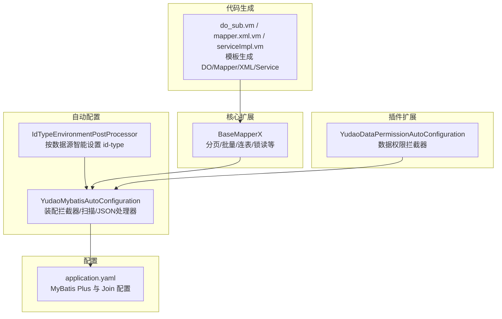
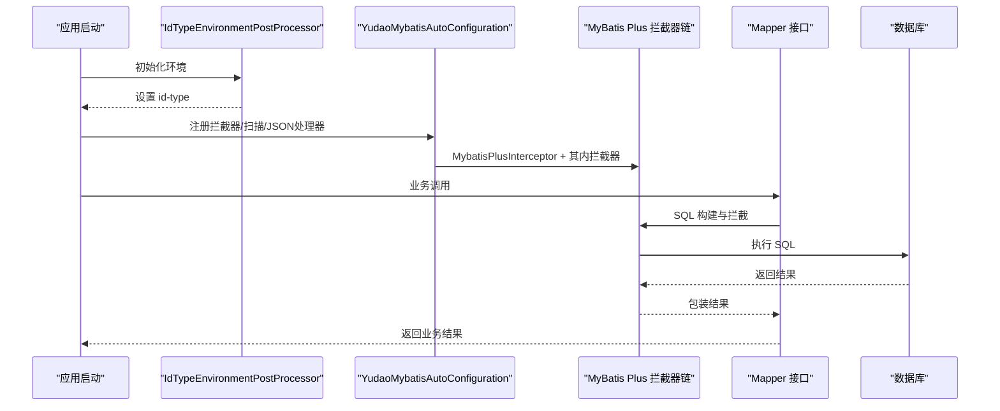
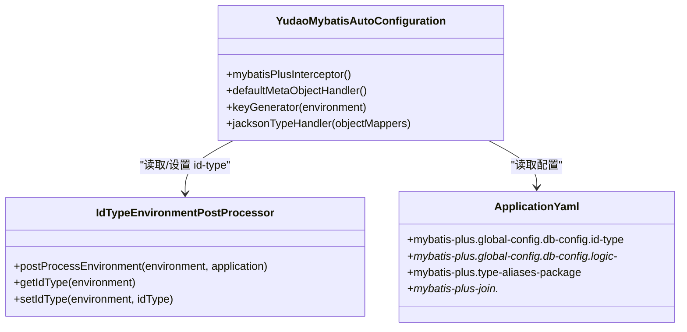
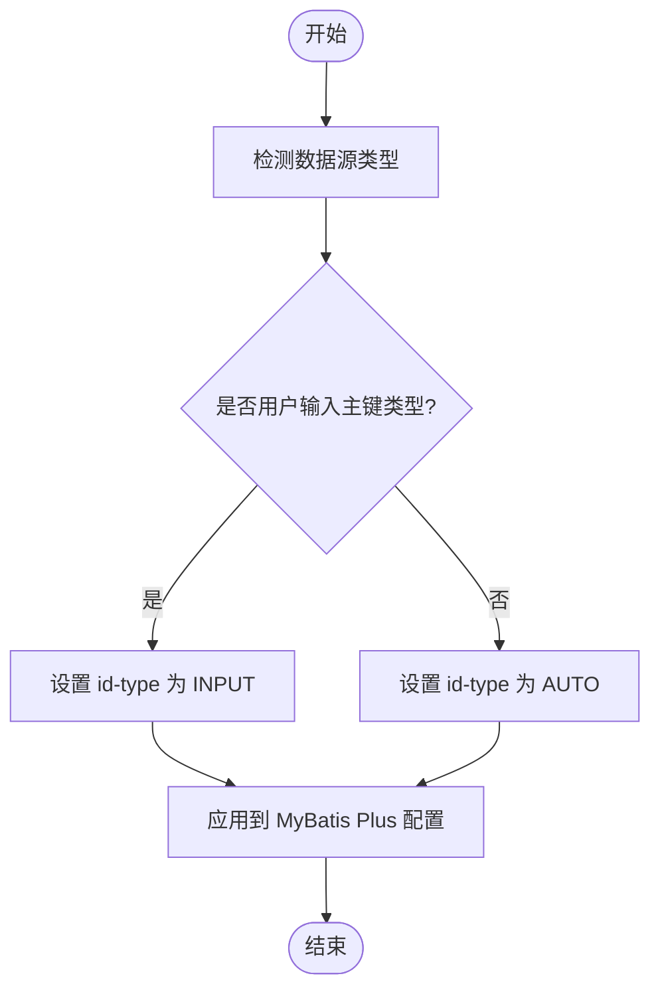
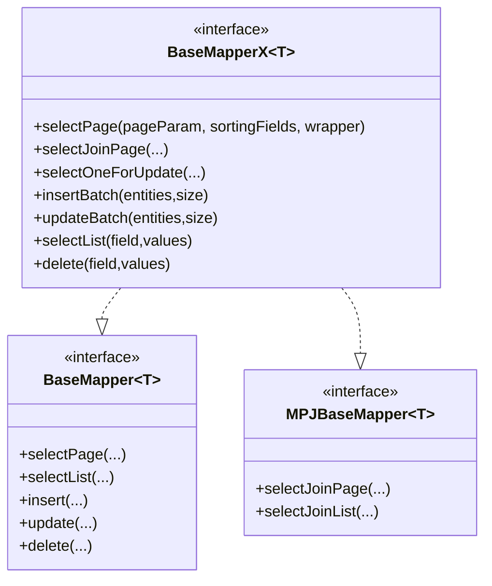
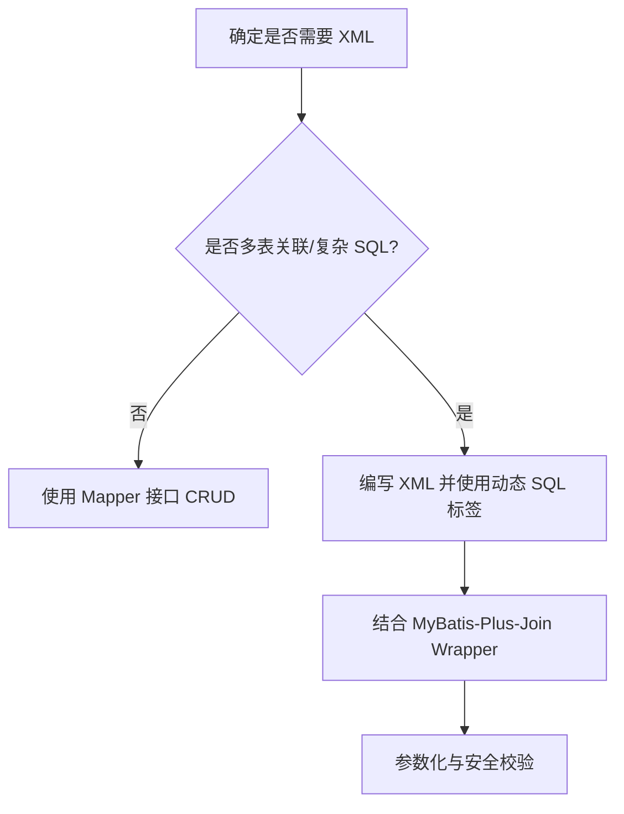
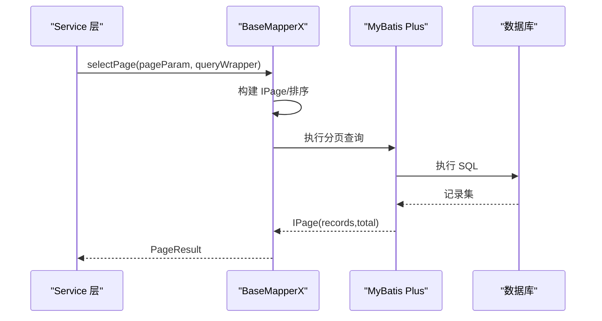
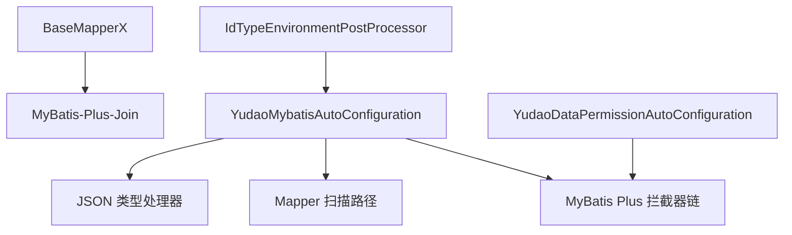

# MyBatis Plus 集成

<cite>
**本文引用的文件**
- [YudaoMybatisAutoConfiguration.java](file://yudao-framework/yudao-spring-boot-starter-mybatis/src/main/java/cn/iocoder/yudao/framework/mybatis/config/YudaoMybatisAutoConfiguration.java)
- [IdTypeEnvironmentPostProcessor.java](file://yudao-framework/yudao-spring-boot-starter-mybatis/src/main/java/cn/iocoder/yudao/framework/mybatis/config/IdTypeEnvironmentPostProcessor.java)
- [application.yaml](file://yudao-server/src/main/resources/application.yaml)
- [BaseMapperX.java](file://yudao-framework/yudao-spring-boot-starter-mybatis/src/main/java/cn/iocoder/yudao/framework/mybatis/core/mapper/BaseMapperX.java)
- [YudaoDataPermissionAutoConfiguration.java](file://yudao-framework/yudao-spring-boot-starter-biz-data-permission/src/main/java/cn/iocoder/yudao/framework/datapermission/config/YudaoDataPermissionAutoConfiguration.java)
- [do_sub.vm](file://yudao-module-infra/src/main/resources/codegen/java/dal/do_sub.vm)
- [mapper.xml.vm](file://yudao-module-infra/src/main/resources/codegen/java/dal/mapper.xml.vm)
- [serviceImpl.vm](file://yudao-module-infra/src/main/resources/codegen/java/service/serviceImpl.vm)
</cite>

## 目录
1. [简介](#简介)
2. [项目结构](#项目结构)
3. [核心组件](#核心组件)
4. [架构总览](#架构总览)
5. [详细组件分析](#详细组件分析)
6. [依赖关系分析](#依赖关系分析)
7. [性能考量](#性能考量)
8. [故障排查指南](#故障排查指南)
9. [结论](#结论)
10. [附录](#附录)

## 简介
本文件系统性阐述本项目中 MyBatis Plus 的集成与使用实践，覆盖自动配置机制、实体设计规范、Mapper 接口与通用 CRUD、XML 映射与动态 SQL、分页查询与条件构造器、批量操作、插件机制与自定义扩展等内容。目标是帮助开发者快速理解并正确使用 MyBatis Plus，提升开发效率与系统稳定性。

## 项目结构
围绕 MyBatis Plus 的集成，项目主要由以下部分构成：
- 自动配置模块：负责 MyBatis Plus 拦截器、扫描路径、JSON 类型处理器、主键生成器等的装配。
- 配置文件：集中定义 MyBatis Plus 与 MyBatis-Plus-Join 的全局行为。
- 核心 Mapper 扩展：在 MyBatis Plus 基础之上提供分页、批量、连表查询等增强能力。
- 业务层与代码生成：通过模板生成 DO、Mapper、Service 实现与 XML，确保一致性与规范性。
- 插件扩展：如数据权限插件，作为拦截器链的一部分参与执行流程。

**图表来源**
- [YudaoMybatisAutoConfiguration.java:29-95](file://yudao-framework/yudao-spring-boot-starter-mybatis/src/main/java/cn/iocoder/yudao/framework/mybatis/config/YudaoMybatisAutoConfiguration.java#L29-L95)
- [IdTypeEnvironmentPostProcessor.java:35-76](file://yudao-framework/yudao-spring-boot-starter-mybatis/src/main/java/cn/iocoder/yudao/framework/mybatis/config/IdTypeEnvironmentPostProcessor.java#L35-L76)
- [application.yaml:66-88](file://yudao-server/src/main/resources/application.yaml#L66-L88)
- [BaseMapperX.java:26-285](file://yudao-framework/yudao-spring-boot-starter-mybatis/src/main/java/cn/iocoder/yudao/framework/mybatis/core/mapper/BaseMapperX.java#L26-L285)
- [YudaoDataPermissionAutoConfiguration.java:29-46](file://yudao-framework/yudao-spring-boot-starter-biz-data-permission/src/main/java/cn/iocoder/yudao/framework/datapermission/config/YudaoDataPermissionAutoConfiguration.java#L29-L46)
- [do_sub.vm:48-69](file://yudao-module-infra/src/main/resources/codegen/java/dal/do_sub.vm#L48-L69)
- [mapper.xml.vm:1-12](file://yudao-module-infra/src/main/resources/codegen/java/dal/mapper.xml.vm#L1-L12)
- [serviceImpl.vm:32-60](file://yudao-module-infra/src/main/resources/codegen/java/service/serviceImpl.vm#L32-L60)

**章节来源**
- [YudaoMybatisAutoConfiguration.java:29-95](file://yudao-framework/yudao-spring-boot-starter-mybatis/src/main/java/cn/iocoder/yudao/framework/mybatis/config/YudaoMybatisAutoConfiguration.java#L29-L95)
- [application.yaml:66-88](file://yudao-server/src/main/resources/application.yaml#L66-L88)

## 核心组件
- 自动配置类：负责 MyBatis Plus 拦截器注册、Mapper 扫描路径、JSON 类型处理器、主键生成器等。
- 环境处理器：根据数据源类型智能设置 id-type，减少手工配置。
- 核心 Mapper 扩展：提供分页查询、批量插入/更新、连表查询、FOR UPDATE 锁读、条件构造器便捷方法等。
- 插件扩展：数据权限拦截器以拦截器形式接入 MyBatis Plus 拦截器链。
- 代码生成模板：统一生成 DO、Mapper、Service 与 XML，保证风格一致。

**章节来源**
- [YudaoMybatisAutoConfiguration.java:29-95](file://yudao-framework/yudao-spring-boot-starter-mybatis/src/main/java/cn/iocoder/yudao/framework/mybatis/config/YudaoMybatisAutoConfiguration.java#L29-L95)
- [IdTypeEnvironmentPostProcessor.java:35-76](file://yudao-framework/yudao-spring-boot-starter-mybatis/src/main/java/cn/iocoder/yudao/framework/mybatis/config/IdTypeEnvironmentPostProcessor.java#L35-L76)
- [BaseMapperX.java:26-285](file://yudao-framework/yudao-spring-boot-starter-mybatis/src/main/java/cn/iocoder/yudao/framework/mybatis/core/mapper/BaseMapperX.java#L26-L285)
- [YudaoDataPermissionAutoConfiguration.java:29-46](file://yudao-framework/yudao-spring-boot-starter-biz-data-permission/src/main/java/cn/iocoder/yudao/framework/datapermission/config/YudaoDataPermissionAutoConfiguration.java#L29-L46)

## 架构总览
MyBatis Plus 在本项目的集成遵循“自动配置优先、拦截器链有序、扩展接口统一”的原则。自动配置类在 MyBatis Plus 自动配置之前生效，确保 Mapper 扫描与拦截器注册无冲突；环境处理器根据数据源类型自动设定 id-type；核心 Mapper 扩展提供统一的 CRUD 与分页能力；插件扩展以拦截器形式参与 SQL 执行前后的处理。

**图表来源**
- [YudaoMybatisAutoConfiguration.java:34-54](file://yudao-framework/yudao-spring-boot-starter-mybatis/src/main/java/cn/iocoder/yudao/framework/mybatis/config/YudaoMybatisAutoConfiguration.java#L34-L54)
- [IdTypeEnvironmentPostProcessor.java:35-76](file://yudao-framework/yudao-spring-boot-starter-mybatis/src/main/java/cn/iocoder/yudao/framework/mybatis/config/IdTypeEnvironmentPostProcessor.java#L35-L76)

## 详细组件分析

### 自动配置机制与配置参数
- 自动配置类职责
  - 在 MyBatis Plus 自动配置之前生效，避免 Mapper 扫描警告。
  - 注册 MyBatis Plus 拦截器（含分页），可按需添加安全拦截器。
  - 配置 JSON 类型处理器，确保对象序列化一致性。
  - 按数据源类型选择合适的主键生成器。
  - 启用动态 SQL 解析缓存，提升复杂 XML 解析性能。
- 关键配置参数
  - id-type：NONE（智能模式）、AUTO（自增）、INPUT（用户输入）、ASSIGN_ID（雪花算法）。
  - 逻辑删除值：logic-delete-value、logic-not-delete-value。
  - 类型别名包：type-aliases-package。
  - MyBatis-Plus-Join：banner、sub-table-logic、ms-cache、table-alias、logic-del-type 等。

**图表来源**
- [YudaoMybatisAutoConfiguration.java:29-95](file://yudao-framework/yudao-spring-boot-starter-mybatis/src/main/java/cn/iocoder/yudao/framework/mybatis/config/YudaoMybatisAutoConfiguration.java#L29-L95)
- [IdTypeEnvironmentPostProcessor.java:35-76](file://yudao-framework/yudao-spring-boot-starter-mybatis/src/main/java/cn/iocoder/yudao/framework/mybatis/config/IdTypeEnvironmentPostProcessor.java#L35-L76)
- [application.yaml:66-88](file://yudao-server/src/main/resources/application.yaml#L66-L88)

**章节来源**
- [YudaoMybatisAutoConfiguration.java:29-95](file://yudao-framework/yudao-spring-boot-starter-mybatis/src/main/java/cn/iocoder/yudao/framework/mybatis/config/YudaoMybatisAutoConfiguration.java#L29-L95)
- [IdTypeEnvironmentPostProcessor.java:35-76](file://yudao-framework/yudao-spring-boot-starter-mybatis/src/main/java/cn/iocoder/yudao/framework/mybatis/config/IdTypeEnvironmentPostProcessor.java#L35-L76)
- [application.yaml:66-88](file://yudao-server/src/main/resources/application.yaml#L66-L88)

### 实体类设计规范
- 主键策略
  - 智能模式：由环境处理器根据数据源类型自动设置 id-type（AUTO 或 INPUT）。
  - 用户输入模式：适用于 Oracle、PostgreSQL、Kingbase、DB2、H2 等数据库。
  - 自增模式：适用于 MySQL、DM 等直接自增的数据库。
  - 分配 ID：默认雪花算法，某些数据库需移除 @KeySequence 注解。
- 字段命名与注解
  - 使用驼峰映射（默认开启），保持 Java 字段与数据库列的对应关系。
  - 主键字段使用 @TableId，字符串主键在用户输入模式下标注 type=IdType.INPUT。
  - 可结合 Swagger 注解描述字段含义与必填性，便于前端与文档生成。
- 逻辑删除
  - 统一配置逻辑删除值与未删除值，确保查询与更新的安全性。

**图表来源**
- [IdTypeEnvironmentPostProcessor.java:35-76](file://yudao-framework/yudao-spring-boot-starter-mybatis/src/main/java/cn/iocoder/yudao/framework/mybatis/config/IdTypeEnvironmentPostProcessor.java#L35-L76)
- [application.yaml:70-78](file://yudao-server/src/main/resources/application.yaml#L70-L78)

**章节来源**
- [IdTypeEnvironmentPostProcessor.java:35-76](file://yudao-framework/yudao-spring-boot-starter-mybatis/src/main/java/cn/iocoder/yudao/framework/mybatis/config/IdTypeEnvironmentPostProcessor.java#L35-L76)
- [application.yaml:70-78](file://yudao-server/src/main/resources/application.yaml#L70-L78)
- [do_sub.vm:48-69](file://yudao-module-infra/src/main/resources/codegen/java/dal/do_sub.vm#L48-L69)

### Mapper 接口定义与通用 CRUD
- 基础接口
  - 继承 MyBatis Plus 的 BaseMapper，获得标准 CRUD 能力。
  - 扩展接口 BaseMapperX 提供分页、批量、连表查询、锁读、便捷条件构造等能力。
- 通用 CRUD 使用要点
  - 分页查询：支持传入排序字段集合，自动构建分页与排序。
  - 批量插入/更新：针对不同数据库做兼容处理（如 SQL Server 循环插入）。
  - 条件构造器：提供便捷的 eq/in/last 等方法，支持 FOR UPDATE 锁读。
  - 连表查询：基于 MyBatis-Plus-Join，支持 selectJoinPage/selectJoinList 等。

**图表来源**
- [BaseMapperX.java:26-285](file://yudao-framework/yudao-spring-boot-starter-mybatis/src/main/java/cn/iocoder/yudao/framework/mybatis/core/mapper/BaseMapperX.java#L26-L285)

**章节来源**
- [BaseMapperX.java:26-285](file://yudao-framework/yudao-spring-boot-starter-mybatis/src/main/java/cn/iocoder/yudao/framework/mybatis/core/mapper/BaseMapperX.java#L26-L285)

### XML 映射文件与动态 SQL
- 编写规范
  - 优先使用 Mapper 接口进行 CRUD；仅在多表关联或复杂 SQL 场景使用 XML。
  - XML 文件命名与命名空间与 Mapper 对应，便于维护与查找。
  - 使用 MyBatisX 等插件辅助生成常用查询，减少手写错误。
- 动态 SQL 技巧
  - 利用 <where>/<trim>/<choose> 等标签组织条件，避免多余的 AND/OR。
  - 对于复杂联表查询，结合 MyBatis-Plus-Join 的 Wrapper 构造器，提升可读性与可维护性。
  - 注意 SQL 注入防护，尽量使用参数化与条件构造器。

**图表来源**
- [mapper.xml.vm:1-12](file://yudao-module-infra/src/main/resources/codegen/java/dal/mapper.xml.vm#L1-L12)

**章节来源**
- [mapper.xml.vm:1-12](file://yudao-module-infra/src/main/resources/codegen/java/dal/mapper.xml.vm#L1-L12)

### 分页查询、条件构造器与批量操作
- 分页查询
  - BaseMapperX 支持传入 SortablePageParam/PageParam 与排序字段集合，自动构建分页与排序。
  - 当 pageSize 为特殊值时，实现“不分页查询全部”的逻辑。
- 条件构造器
  - 提供 eq/in/like/orderBy 等便捷方法，支持链式调用与复杂组合。
  - 支持 FOR UPDATE 锁读，需在事务中使用。
- 批量操作
  - insertBatch/updateBatch 提供批量插入与批量更新，内部对 SQL Server 做了兼容处理。
  - 支持指定批次大小，平衡内存与性能。

**图表来源**
- [BaseMapperX.java:34-55](file://yudao-framework/yudao-spring-boot-starter-mybatis/src/main/java/cn/iocoder/yudao/framework/mybatis/core/mapper/BaseMapperX.java#L34-L55)

**章节来源**
- [BaseMapperX.java:34-55](file://yudao-framework/yudao-spring-boot-starter-mybatis/src/main/java/cn/iocoder/yudao/framework/mybatis/core/mapper/BaseMapperX.java#L34-L55)
- [BaseMapperX.java:232-268](file://yudao-framework/yudao-spring-boot-starter-mybatis/src/main/java/cn/iocoder/yudao/framework/mybatis/core/mapper/BaseMapperX.java#L232-L268)

### 插件机制与自定义扩展
- 拦截器链
  - MyBatis Plus 拦截器链顺序至关重要。数据权限拦截器需置于分页插件之前。
  - 可按需添加 BlockAttackInnerInterceptor 等安全拦截器，但需评估对批量更新的影响。
- 自定义扩展
  - 通过实现自定义拦截器并注入 MyBatis Plus Interceptor，可扩展审计、限流、加密等功能。
  - JSON 类型处理器统一设置 ObjectMapper，避免全局污染。

**图表来源**
- [YudaoDataPermissionAutoConfiguration.java:29-46](file://yudao-framework/yudao-spring-boot-starter-biz-data-permission/src/main/java/cn/iocoder/yudao/framework/datapermission/config/YudaoDataPermissionAutoConfiguration.java#L29-L46)
- [YudaoMybatisAutoConfiguration.java:47-54](file://yudao-framework/yudao-spring-boot-starter-mybatis/src/main/java/cn/iocoder/yudao/framework/mybatis/config/YudaoMybatisAutoConfiguration.java#L47-L54)

**章节来源**
- [YudaoDataPermissionAutoConfiguration.java:29-46](file://yudao-framework/yudao-spring-boot-starter-biz-data-permission/src/main/java/cn/iocoder/yudao/framework/datapermission/config/YudaoDataPermissionAutoConfiguration.java#L29-L46)
- [YudaoMybatisAutoConfiguration.java:47-54](file://yudao-framework/yudao-spring-boot-starter-mybatis/src/main/java/cn/iocoder/yudao/framework/mybatis/config/YudaoMybatisAutoConfiguration.java#L47-L54)

## 依赖关系分析
- 自动配置类依赖 MyBatis Plus 的自动配置顺序，确保扫描与拦截器注册无冲突。
- 环境处理器依赖数据源类型推断，影响 id-type 的最终值。
- 核心 Mapper 扩展依赖 MyBatis-Plus-Join 提供的连表能力。
- 插件扩展通过 MyBatisUtils 将拦截器插入到拦截器链的正确位置。

**图表来源**
- [YudaoMybatisAutoConfiguration.java:34-54](file://yudao-framework/yudao-spring-boot-starter-mybatis/src/main/java/cn/iocoder/yudao/framework/mybatis/config/YudaoMybatisAutoConfiguration.java#L34-L54)
- [IdTypeEnvironmentPostProcessor.java:35-76](file://yudao-framework/yudao-spring-boot-starter-mybatis/src/main/java/cn/iocoder/yudao/framework/mybatis/config/IdTypeEnvironmentPostProcessor.java#L35-L76)
- [BaseMapperX.java:18-21](file://yudao-framework/yudao-spring-boot-starter-mybatis/src/main/java/cn/iocoder/yudao/framework/mybatis/core/mapper/BaseMapperX.java#L18-L21)
- [YudaoDataPermissionAutoConfiguration.java:29-46](file://yudao-framework/yudao-spring-boot-starter-biz-data-permission/src/main/java/cn/iocoder/yudao/framework/datapermission/config/YudaoDataPermissionAutoConfiguration.java#L29-L46)

**章节来源**
- [YudaoMybatisAutoConfiguration.java:34-54](file://yudao-framework/yudao-spring-boot-starter-mybatis/src/main/java/cn/iocoder/yudao/framework/mybatis/config/YudaoMybatisAutoConfiguration.java#L34-L54)
- [BaseMapperX.java:18-21](file://yudao-framework/yudao-spring-boot-starter-mybatis/src/main/java/cn/iocoder/yudao/framework/mybatis/core/mapper/BaseMapperX.java#L18-L21)
- [YudaoDataPermissionAutoConfiguration.java:29-46](file://yudao-framework/yudao-spring-boot-starter-biz-data-permission/src/main/java/cn/iocoder/yudao/framework/datapermission/config/YudaoDataPermissionAutoConfiguration.java#L29-L46)

## 性能考量
- 动态 SQL 解析缓存：启用 JsqlParser 全局缓存，减少复杂 XML 的重复解析开销。
- 批量操作：合理设置批量大小，避免一次性提交过多数据导致内存压力；对 SQL Server 做循环插入兼容。
- 分页查询：避免不必要的排序与大偏移量；在高频查询场景下考虑索引优化。
- 拦截器顺序：将数据权限等前置拦截器置于分页之前，减少无效计算。

**章节来源**
- [YudaoMybatisAutoConfiguration.java:39-45](file://yudao-framework/yudao-spring-boot-starter-mybatis/src/main/java/cn/iocoder/yudao/framework/mybatis/config/YudaoMybatisAutoConfiguration.java#L39-L45)
- [BaseMapperX.java:232-268](file://yudao-framework/yudao-spring-boot-starter-mybatis/src/main/java/cn/iocoder/yudao/framework/mybatis/core/mapper/BaseMapperX.java#L232-L268)

## 故障排查指南
- Mapper 扫描警告
  - 确认自动配置类在 MyBatis Plus 自动配置之前生效，避免扫描路径冲突。
- id-type 不生效
  - 检查环境处理器是否正确识别数据源类型；确认 application.yaml 中 id-type 设置与预期一致。
- 批量更新异常
  - 若使用安全拦截器，确认已正确配置；必要时临时禁用以定位问题。
- FOR UPDATE 未生效
  - 确保在事务上下文中调用；检查数据库是否支持行级锁。
- XML 动态 SQL 报错
  - 检查条件标签拼接是否正确；避免多余的 AND/OR；使用参数化防止注入。

**章节来源**
- [YudaoMybatisAutoConfiguration.java:34-37](file://yudao-framework/yudao-spring-boot-starter-mybatis/src/main/java/cn/iocoder/yudao/framework/mybatis/config/YudaoMybatisAutoConfiguration.java#L34-L37)
- [IdTypeEnvironmentPostProcessor.java:35-76](file://yudao-framework/yudao-spring-boot-starter-mybatis/src/main/java/cn/iocoder/yudao/framework/mybatis/config/IdTypeEnvironmentPostProcessor.java#L35-L76)
- [BaseMapperX.java:122-145](file://yudao-framework/yudao-spring-boot-starter-mybatis/src/main/java/cn/iocoder/yudao/framework/mybatis/core/mapper/BaseMapperX.java#L122-L145)

## 结论
本项目通过自动配置类、环境处理器、核心 Mapper 扩展与插件机制，实现了 MyBatis Plus 的高效集成与稳定运行。遵循本文的实体设计规范、Mapper 使用方式与 XML 编写准则，可在保证性能与安全的前提下，显著提升开发效率与系统可维护性。

## 附录
- 代码生成模板
  - DO 模板：生成实体类字段与注解，包含主键策略与 Swagger 注解。
  - Mapper XML 模板：生成命名空间与注释，指导后续 SQL 编写。
  - Service 实现模板：生成依赖注入与 Mapper 引用，统一业务实现风格。

**章节来源**
- [do_sub.vm:48-69](file://yudao-module-infra/src/main/resources/codegen/java/dal/do_sub.vm#L48-L69)
- [mapper.xml.vm:1-12](file://yudao-module-infra/src/main/resources/codegen/java/dal/mapper.xml.vm#L1-L12)
- [serviceImpl.vm:32-60](file://yudao-module-infra/src/main/resources/codegen/java/service/serviceImpl.vm#L32-L60)