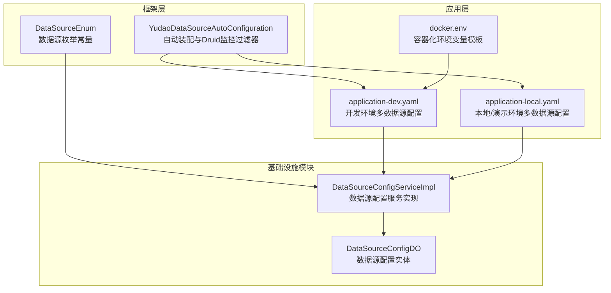
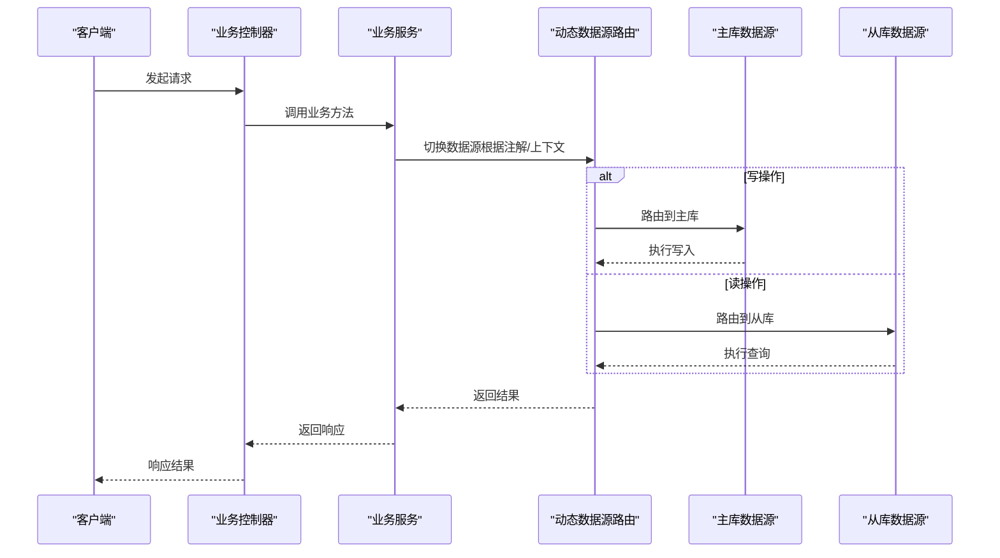
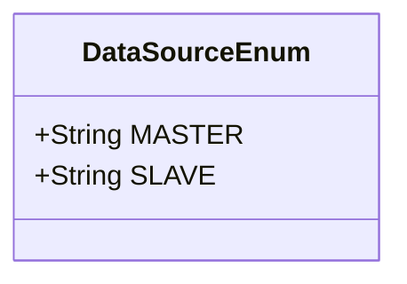
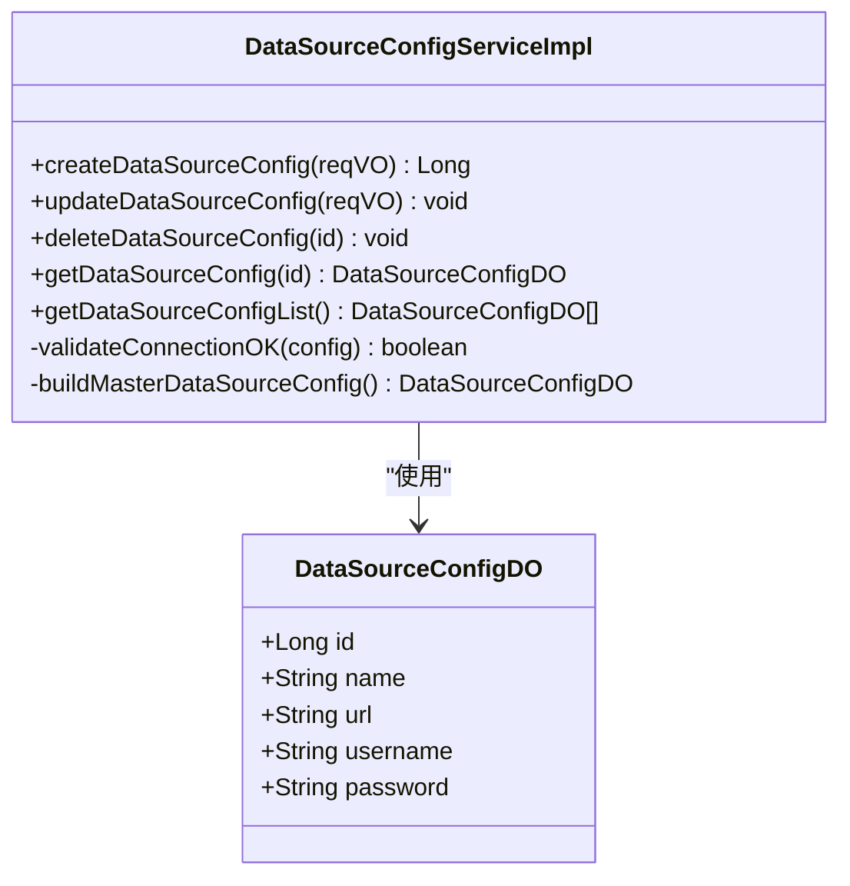
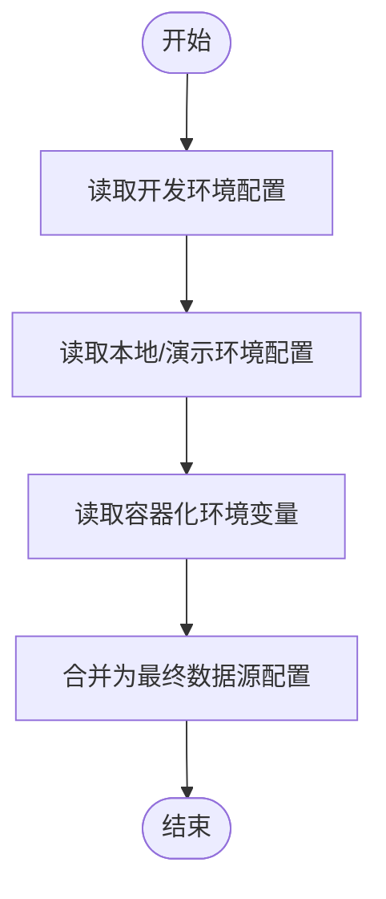
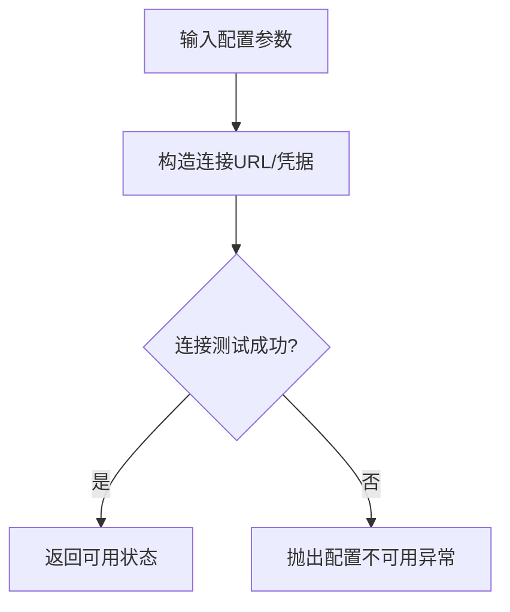
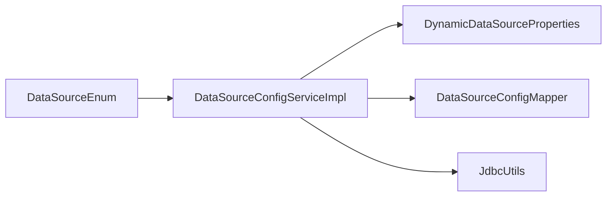

# 多数据源配置

<cite>
**本文引用的文件**
- [YudaoDataSourceAutoConfiguration.java](file://yudao-framework/yudao-spring-boot-starter-mybatis/src/main/java/cn/iocoder/yudao/framework/datasource/config/YudaoDataSourceAutoConfiguration.java)
- [DataSourceEnum.java](file://yudao-framework/yudao-spring-boot-starter-mybatis/src/main/java/cn/iocoder/yudao/framework/datasource/core/enums/DataSourceEnum.java)
- [DataSourceConfigServiceImpl.java](file://yudao-module-infra/src/main/java/cn/iocoder/yudao/module/infra/service/db/DataSourceConfigServiceImpl.java)
- [DataSourceConfigDO.java](file://yudao-module-infra/src/main/java/cn/iocoder/yudao/module/infra/dal/dataobject/db/DataSourceConfigDO.java)
- [application-dev.yaml](file://yudao-server/src/main/resources/application-dev.yaml)
- [application-local.yaml](file://yudao-server/src/main/resources/application-local.yaml)
- [docker.env](file://script/docker/docker.env)
- [JdbcUtils.java](file://yudao-framework/yudao-spring-boot-starter-mybatis/src/main/java/cn/iocoder/yudao/framework/mybatis/core/util/JdbcUtils.java)
</cite>

## 目录
1. [简介](#简介)
2. [项目结构](#项目结构)
3. [核心组件](#核心组件)
4. [架构总览](#架构总览)
5. [详细组件分析](#详细组件分析)
6. [依赖分析](#依赖分析)
7. [性能考虑](#性能考虑)
8. [故障排查指南](#故障排查指南)
9. [结论](#结论)
10. [附录](#附录)

## 简介
本文件系统化阐述本项目的多数据源与读写分离能力，覆盖以下主题：
- 动态数据源实现原理：数据源切换机制、线程上下文管理、事务传播与一致性保障
- 多数据源配置方法：数据源注册、路由规则、负载均衡策略
- 读写分离方案：主从库配置、读写分离注解、事务处理
- 实际配置示例与使用场景：跨库查询、分布式事务处理
- 监控与故障转移：连接健康检查、异常恢复与高可用策略

## 项目结构
围绕多数据源的关键模块分布如下：
- 框架层（yudao-spring-boot-starter-mybatis）：提供自动装配、Druid 监控过滤器、枚举常量等基础设施
- 应用层（yudao-server）：提供多环境配置文件，定义主从数据源连接信息
- 基础设施模块（yudao-module-infra）：提供数据源配置的持久化、校验与运行时注入能力
- 工具与脚本（script/docker/docker.env）：提供容器化部署时的数据源环境变量模板

图表来源
- [YudaoDataSourceAutoConfiguration.java:1-41](file://yudao-framework/yudao-spring-boot-starter-mybatis/src/main/java/cn/iocoder/yudao/framework/datasource/config/YudaoDataSourceAutoConfiguration.java#L1-L41)
- [DataSourceEnum.java:1-23](file://yudao-framework/yudao-spring-boot-starter-mybatis/src/main/java/cn/iocoder/yudao/framework/datasource/core/enums/DataSourceEnum.java#L1-L23)
- [application-dev.yaml:36-57](file://yudao-server/src/main/resources/application-dev.yaml#L36-L57)
- [application-local.yaml:65-90](file://yudao-server/src/main/resources/application-local.yaml#L65-L90)
- [docker.env:1-25](file://script/docker/docker.env#L1-L25)
- [DataSourceConfigServiceImpl.java:1-112](file://yudao-module-infra/src/main/java/cn/iocoder/yudao/module/infra/service/db/DataSourceConfigServiceImpl.java#L1-L112)
- [DataSourceConfigDO.java:1-51](file://yudao-module-infra/src/main/java/cn/iocoder/yudao/module/infra/dal/dataobject/db/DataSourceConfigDO.java#L1-L51)

章节来源
- [YudaoDataSourceAutoConfiguration.java:1-41](file://yudao-framework/yudao-spring-boot-starter-mybatis/src/main/java/cn/iocoder/yudao/framework/datasource/config/YudaoDataSourceAutoConfiguration.java#L1-L41)
- [application-dev.yaml:36-57](file://yudao-server/src/main/resources/application-dev.yaml#L36-L57)
- [application-local.yaml:65-90](file://yudao-server/src/main/resources/application-local.yaml#L65-L90)
- [docker.env:1-25](file://script/docker/docker.env#L1-L25)
- [DataSourceConfigServiceImpl.java:1-112](file://yudao-module-infra/src/main/java/cn/iocoder/yudao/module/infra/service/db/DataSourceConfigServiceImpl.java#L1-L112)
- [DataSourceConfigDO.java:1-51](file://yudao-module-infra/src/main/java/cn/iocoder/yudao/module/infra/dal/dataobject/db/DataSourceConfigDO.java#L1-L51)

## 核心组件
- 自动装配与监控过滤器
  - 启用事务管理与 Druid 统计视图 Servlet 的广告移除过滤器，按需注册到指定 URL 模式
- 数据源枚举常量
  - 定义主库与从库标识，配合注解驱动的路由选择
- 数据源配置服务
  - 支持创建、更新、删除、列表查询数据源配置；对配置进行连接有效性校验；内置“主库”占位项
- 数据源配置实体
  - 记录数据源名称、URL、用户名、密码等字段；密码采用加密类型处理器存储
- 多环境配置
  - 在开发与本地环境中分别声明主库与从库连接信息，支持懒加载以优化启动时间

章节来源
- [YudaoDataSourceAutoConfiguration.java:17-41](file://yudao-framework/yudao-spring-boot-starter-mybatis/src/main/java/cn/iocoder/yudao/framework/datasource/config/YudaoDataSourceAutoConfiguration.java#L17-L41)
- [DataSourceEnum.java:11-22](file://yudao-framework/yudao-spring-boot-starter-mybatis/src/main/java/cn/iocoder/yudao/framework/datasource/core/enums/DataSourceEnum.java#L11-L22)
- [DataSourceConfigServiceImpl.java:26-112](file://yudao-module-infra/src/main/java/cn/iocoder/yudao/module/infra/service/db/DataSourceConfigServiceImpl.java#L26-L112)
- [DataSourceConfigDO.java:16-51](file://yudao-module-infra/src/main/java/cn/iocoder/yudao/module/infra/dal/dataobject/db/DataSourceConfigDO.java#L16-L51)
- [application-dev.yaml:36-57](file://yudao-server/src/main/resources/application-dev.yaml#L36-L57)
- [application-local.yaml:65-90](file://yudao-server/src/main/resources/application-local.yaml#L65-L90)

## 架构总览
下图展示从请求进入至数据访问的整体流程，以及多数据源与读写分离的关键交互点。

图表来源
- [DataSourceEnum.java:11-22](file://yudao-framework/yudao-spring-boot-starter-mybatis/src/main/java/cn/iocoder/yudao/framework/datasource/core/enums/DataSourceEnum.java#L11-L22)
- [application-dev.yaml:36-57](file://yudao-server/src/main/resources/application-dev.yaml#L36-L57)
- [application-local.yaml:65-90](file://yudao-server/src/main/resources/application-local.yaml#L65-L90)

## 详细组件分析

### 数据源枚举与注解路由
- 设计要点
  - 使用统一的枚举常量标识主库与从库，便于在方法上通过注解精确控制路由
  - 默认路由为主库，读操作可通过注解切换到从库
- 复杂度与性能
  - 路由判定为 O(1)，对性能影响极小
- 错误处理
  - 若未正确配置或注解使用不当，可能导致读写错配，需结合日志与监控定位

图表来源
- [DataSourceEnum.java:11-22](file://yudao-framework/yudao-spring-boot-starter-mybatis/src/main/java/cn/iocoder/yudao/framework/datasource/core/enums/DataSourceEnum.java#L11-L22)

章节来源
- [DataSourceEnum.java:11-22](file://yudao-framework/yudao-spring-boot-starter-mybatis/src/main/java/cn/iocoder/yudao/framework/datasource/core/enums/DataSourceEnum.java#L11-L22)

### 数据源配置服务与实体
- 设计要点
  - 服务层负责配置的 CRUD、连接有效性校验与“主库”占位构建
  - 实体层包含连接名、URL、用户名、密码等字段，并对密码进行加密存储
- 关键流程
  - 创建/更新前进行连接可达性验证，失败则抛出业务异常
  - 列表返回时补充内置主库配置，保证路由始终有主库可用
- 复杂度与性能
  - 校验逻辑基于 JDBC 连接测试，复杂度取决于网络与数据库响应时间
- 错误处理
  - 连接失败时抛出“配置不可用”异常；查询不存在配置时抛出“配置不存在”异常

图表来源
- [DataSourceConfigServiceImpl.java:26-112](file://yudao-module-infra/src/main/java/cn/iocoder/yudao/module/infra/service/db/DataSourceConfigServiceImpl.java#L26-L112)
- [DataSourceConfigDO.java:16-51](file://yudao-module-infra/src/main/java/cn/iocoder/yudao/module/infra/dal/dataobject/db/DataSourceConfigDO.java#L16-L51)

章节来源
- [DataSourceConfigServiceImpl.java:26-112](file://yudao-module-infra/src/main/java/cn/iocoder/yudao/module/infra/service/db/DataSourceConfigServiceImpl.java#L26-L112)
- [DataSourceConfigDO.java:16-51](file://yudao-module-infra/src/main/java/cn/iocoder/yudao/module/infra/dal/dataobject/db/DataSourceConfigDO.java#L16-L51)

### 多环境数据源配置
- 开发环境配置
  - 明确声明主库与从库的 URL、用户名、密码
  - 支持 Druid 连接池参数与主从标识
- 本地/演示环境配置
  - 从库示例指向 PostgreSQL，体现多数据库类型支持
  - 从库可启用懒加载以提升启动速度
- 容器化环境变量
  - 提供主从库 URL、用户名、密码的环境变量模板，便于 Docker Compose 或 K8s 注入

图表来源
- [application-dev.yaml:36-57](file://yudao-server/src/main/resources/application-dev.yaml#L36-L57)
- [application-local.yaml:65-90](file://yudao-server/src/main/resources/application-local.yaml#L65-L90)
- [docker.env:1-25](file://script/docker/docker.env#L1-L25)

章节来源
- [application-dev.yaml:36-57](file://yudao-server/src/main/resources/application-dev.yaml#L36-L57)
- [application-local.yaml:65-90](file://yudao-server/src/main/resources/application-local.yaml#L65-L90)
- [docker.env:1-25](file://script/docker/docker.env#L1-L25)

### 连接健康检查与异常处理
- 健康检查
  - 通过 JDBC 工具类对目标 URL、用户名、密码进行连接测试
- 异常处理
  - 连接失败抛出“配置不可用”异常；查询不到配置抛出“配置不存在”异常
- 监控与告警
  - 结合 Druid 监控页面与日志，定位连接问题与路由异常

图表来源
- [DataSourceConfigServiceImpl.java:95-100](file://yudao-module-infra/src/main/java/cn/iocoder/yudao/module/infra/service/db/DataSourceConfigServiceImpl.java#L95-L100)
- [JdbcUtils.java:1-200](file://yudao-framework/yudao-spring-boot-starter-mybatis/src/main/java/cn/iocoder/yudao/framework/mybatis/core/util/JdbcUtils.java#L1-L200)

章节来源
- [DataSourceConfigServiceImpl.java:95-100](file://yudao-module-infra/src/main/java/cn/iocoder/yudao/module/infra/service/db/DataSourceConfigServiceImpl.java#L95-L100)
- [JdbcUtils.java:1-200](file://yudao-framework/yudao-spring-boot-starter-mybatis/src/main/java/cn/iocoder/yudao/framework/mybatis/core/util/JdbcUtils.java#L1-L200)

## 依赖分析
- 组件耦合
  - 数据源配置服务依赖动态数据源属性与映射，确保运行时可注入新配置
  - 控制器与业务层通过注解驱动路由，降低硬编码耦合
- 外部依赖
  - 动态数据源（Dynamic-DataSource）、Druid、Spring Transaction 等
- 循环依赖
  - 当前结构未发现循环依赖迹象

图表来源
- [DataSourceConfigServiceImpl.java:34-35](file://yudao-module-infra/src/main/java/cn/iocoder/yudao/module/infra/service/db/DataSourceConfigServiceImpl.java#L34-L35)
- [DataSourceEnum.java:11-22](file://yudao-framework/yudao-spring-boot-starter-mybatis/src/main/java/cn/iocoder/yudao/framework/datasource/core/enums/DataSourceEnum.java#L11-L22)

章节来源
- [DataSourceConfigServiceImpl.java:34-35](file://yudao-module-infra/src/main/java/cn/iocoder/yudao/module/infra/service/db/DataSourceConfigServiceImpl.java#L34-L35)
- [DataSourceEnum.java:11-22](file://yudao-framework/yudao-spring-boot-starter-mybatis/src/main/java/cn/iocoder/yudao/framework/datasource/core/enums/DataSourceEnum.java#L11-L22)

## 性能考虑
- 启动性能
  - 从库可启用懒加载，减少启动时连接数
- 连接池参数
  - 合理设置最大连接、空闲检测周期、预编译语句缓存等参数，平衡吞吐与资源占用
- 路由开销
  - 路由判定为 O(1)，对整体性能影响可忽略
- 读写分离
  - 将只读查询路由至从库，显著降低主库压力；写操作严格路由至主库

## 故障排查指南
- 常见问题
  - 配置不可用：连接测试失败，检查 URL、用户名、密码与网络连通性
  - 配置不存在：查询主键对应的配置不存在，检查数据源配置表
  - 路由错误：读写错配导致一致性问题，检查注解使用与默认路由
- 排查步骤
  - 使用 Druid 监控页面查看连接状态与慢查询
  - 查看服务日志定位异常堆栈
  - 通过健康检查接口确认数据库连通性
- 修复建议
  - 修正配置后重新创建/更新配置记录
  - 确保事务边界内读写在同一数据源上

章节来源
- [DataSourceConfigServiceImpl.java:71-100](file://yudao-module-infra/src/main/java/cn/iocoder/yudao/module/infra/service/db/DataSourceConfigServiceImpl.java#L71-L100)
- [YudaoDataSourceAutoConfiguration.java:25-38](file://yudao-framework/yudao-spring-boot-starter-mybatis/src/main/java/cn/iocoder/yudao/framework/datasource/config/YudaoDataSourceAutoConfiguration.java#L25-L38)

## 结论
本项目通过动态数据源与读写分离实现了高可用、高性能的多数据源架构。借助统一的枚举常量、完善的配置服务与环境化配置，系统具备良好的扩展性与运维友好性。结合连接健康检查与监控告警，可进一步提升系统的稳定性与可观测性。

## 附录

### 配置示例与使用场景
- 示例一：开发环境主从库配置
  - 在开发环境配置文件中声明主库与从库连接信息，确保写操作走主库、读操作走从库
- 示例二：本地/演示环境多数据库类型
  - 从库示例指向 PostgreSQL，验证多数据库类型支持
- 示例三：容器化部署
  - 通过环境变量模板注入主从库连接信息，简化部署流程

章节来源
- [application-dev.yaml:36-57](file://yudao-server/src/main/resources/application-dev.yaml#L36-L57)
- [application-local.yaml:65-90](file://yudao-server/src/main/resources/application-local.yaml#L65-L90)
- [docker.env:1-25](file://script/docker/docker.env#L1-L25)

### 读写分离与事务处理
- 读写分离注解
  - 使用注解将方法路由到主库或从库，保证读写分离
- 事务处理
  - 写操作必须在主库上进行；跨库事务需结合分布式事务方案或业务补偿机制
- 负载均衡策略
  - 从库侧可配置多个实例，结合数据库自身复制拓扑实现读负载分担

章节来源
- [DataSourceEnum.java:11-22](file://yudao-framework/yudao-spring-boot-starter-mybatis/src/main/java/cn/iocoder/yudao/framework/datasource/core/enums/DataSourceEnum.java#L11-L22)