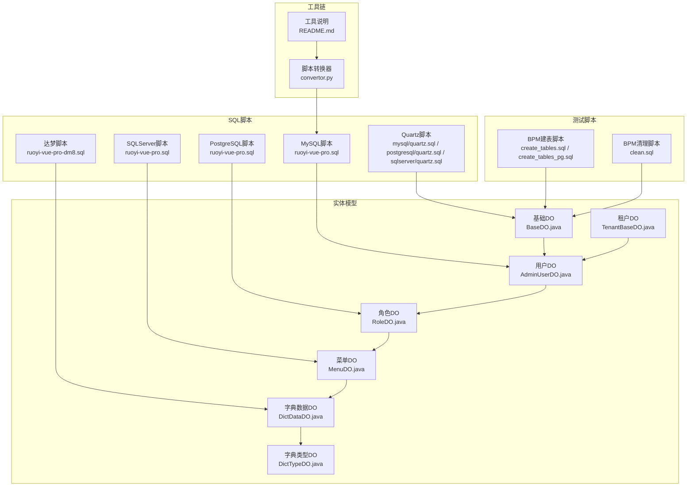
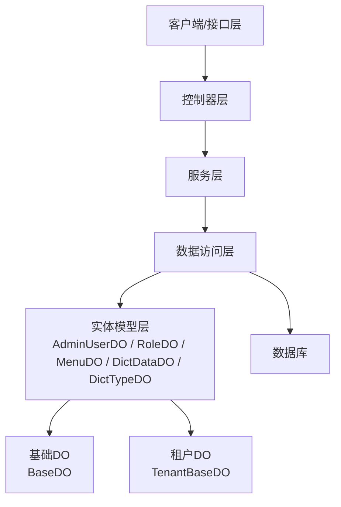
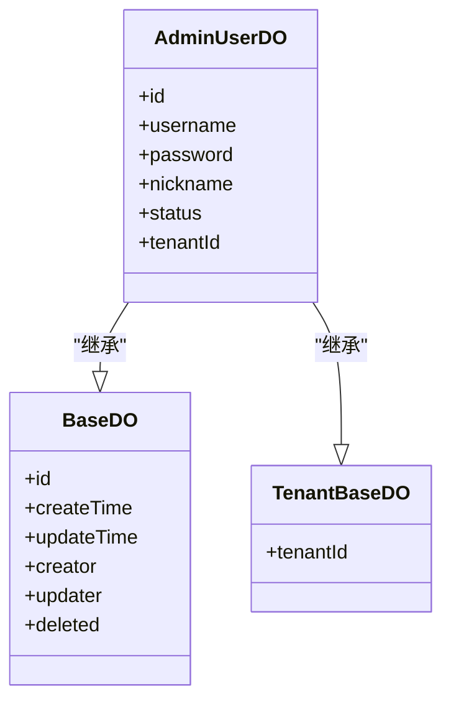
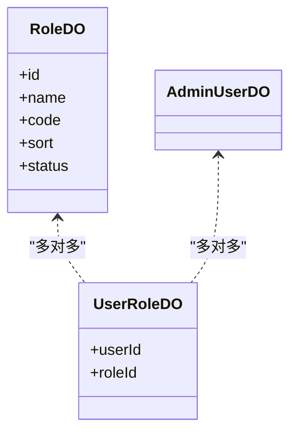
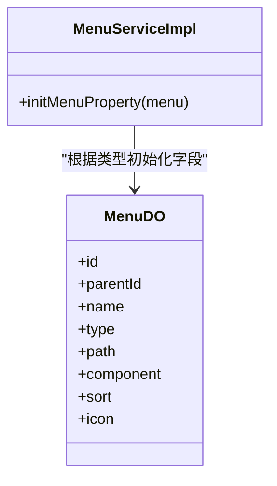
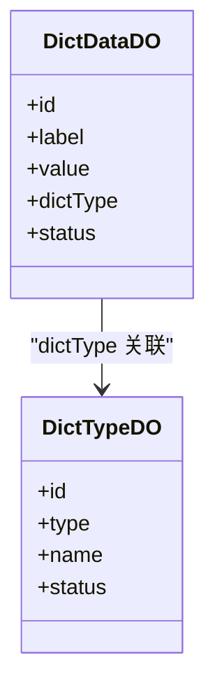
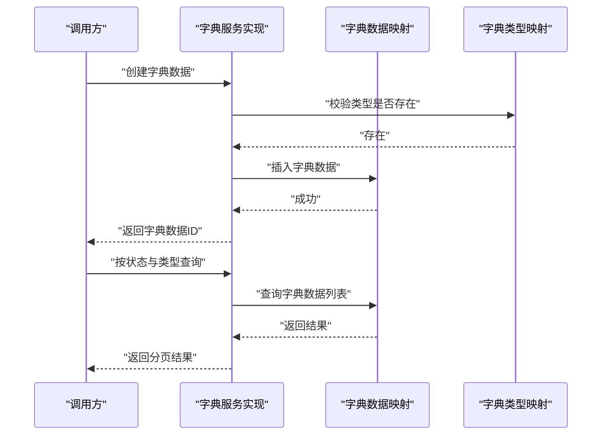
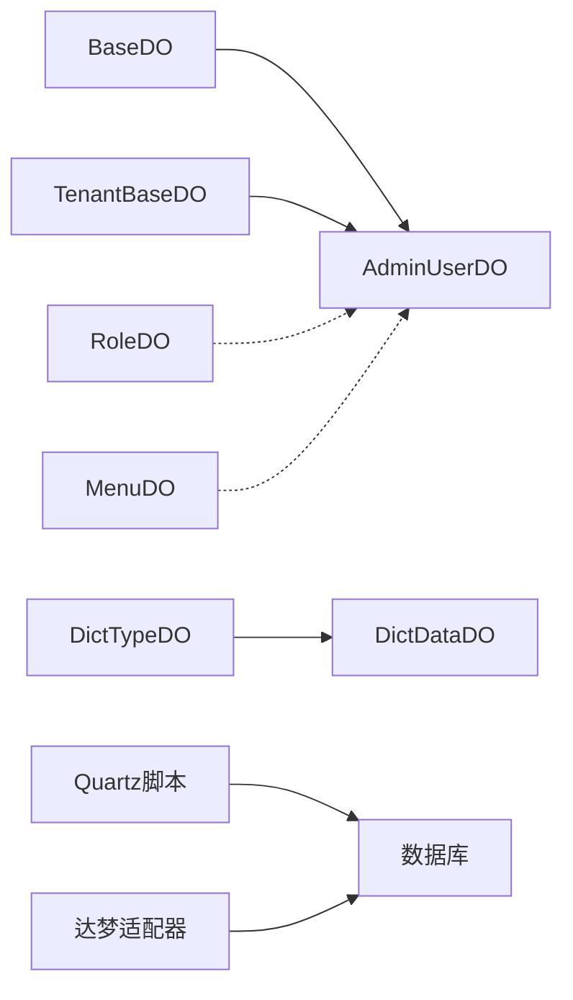
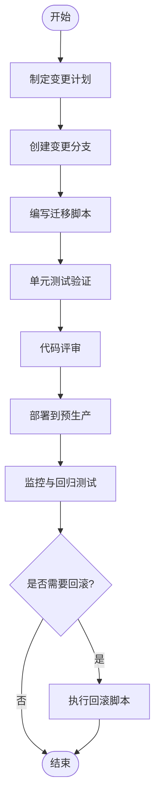
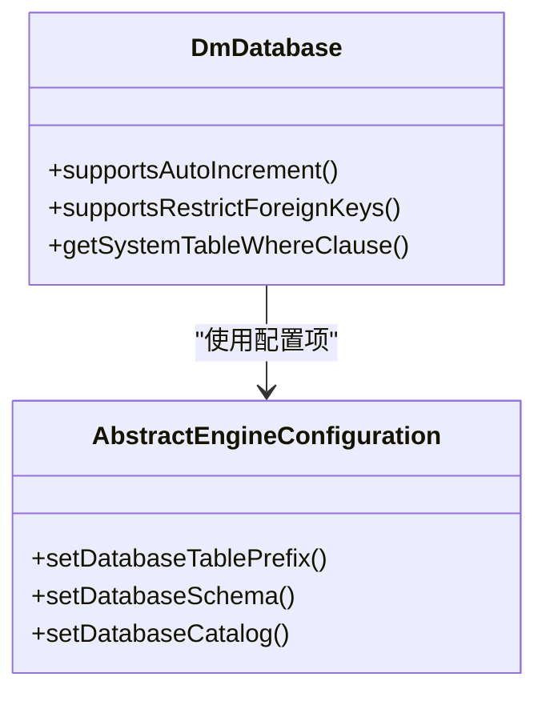

# 数据库表结构设计

<cite>
**本文引用的文件**
- [ruoyi-vue-pro.sql](file://sql/mysql/ruoyi-vue-pro.sql)
- [BaseDO.java](file://yudao-framework/yudao-spring-boot-starter-mybatis/src/main/java/cn/iocoder/yudao/framework/mybatis/core/dataobject/BaseDO.java)
- [TenantBaseDO.java](file://yudao-framework/yudao-spring-boot-starter-biz-tenant/src/main/java/cn/iocoder/yudao/framework/tenant/core/db/TenantBaseDO.java)
- [AdminUserDO.java](file://yudao-module-system/src/main/java/cn/iocoder/yudao/module/system/dal/dataobject/user/AdminUserDO.java)
- [RoleDO.java](file://yudao-module-system/src/main/java/cn/iocoder/yudao/module/system/dal/dataobject/permission/RoleDO.java)
- [MenuDO.java](file://yudao-module-system/src/main/java/cn/iocoder/yudao/module/system/dal/dataobject/permission/MenuDO.java)
- [DictDataDO.java](file://yudao-module-system/src/main/java/cn/iocoder/yudao/module/system/dal/dataobject/dict/DictDataDO.java)
- [DictTypeDO.java](file://yudao-module-system/src/main/java/cn/iocoder/yudao/module/system/dal/dataobject/dict/DictTypeDO.java)
- [DictDataServiceImpl.java](file://yudao-module-system/src/main/java/cn/iocoder/yudao/module/system/service/dict/DictDataServiceImpl.java)
- [DictDataServiceImplTest.java](file://yudao-module-system/src/test/java/cn/iocoder/yudao/module/system/service/dict/DictDataServiceImplTest.java)
- [DictDataRespDTO.java](file://yudao-framework/yudao-common/src/main/java/cn/iocoder/yudao/framework/common/biz/system/dict/dto/DictDataRespDTO.java)
- [MenuServiceImpl.java](file://yudao-module-system/src/main/java/cn/iocoder/yudao/module/system/service/permission/MenuServiceImpl.java)
- [create_tables.sql](file://yudao-module-bpm/src/test/resources/sql/create_tables.sql)
- [clean.sql](file://yudao-module-bpm/src/test/resources/sql/clean.sql)
- [create_tables_pg.sql](file://yudao-module-bpm/src/test/resources/sql/create_tables_pg.sql)
- [convertor.py](file://sql/tools/convertor.py)
- [README.md](file://sql/tools/README.md)
- [DmDatabase.java](file://sql/dm/flowable-patch/src/main/java/liquibase/database/core/DmDatabase.java)
- [AbstractEngineConfiguration.java](file://sql/dm/flowable-patch/src/main/java/org/flowable/common/engine/impl/AbstractEngineConfiguration.java)
</cite>

## 目录
1. [简介](#简介)
2. [项目结构](#项目结构)
3. [核心组件](#核心组件)
4. [架构总览](#架构总览)
5. [详细组件分析](#详细组件分析)
6. [依赖关系分析](#依赖关系分析)
7. [性能考虑](#性能考虑)
8. [故障排查指南](#故障排查指南)
9. [结论](#结论)
10. [附录](#附录)

## 简介
本指南面向数据库表结构设计与演进，结合项目现有数据库脚本与实体模型，系统阐述命名规范、字段设计、索引策略、外键约束与参照完整性保障、版本管理与回滚策略、数据字典设计与维护，以及性能优化建议（含分区与物化视图等高级特性）。目标是帮助开发者在保持一致性的同时，提升可维护性与性能表现。

## 项目结构
项目采用多模块分层组织，数据库相关能力主要体现在以下位置：
- SQL脚本：位于 sql 目录，按数据库类型分包，包含初始化脚本与 Quartz 等第三方组件脚本
- 实体模型：位于各业务模块的 dal.dataobject 包下，统一继承基础 DO 类，支持租户隔离
- 测试脚本：位于各模块测试资源目录，包含建表与清理脚本，便于单元测试环境搭建
- 工具链：位于 sql/tools，包含脚本转换器与说明文档

**图表来源**
- [ruoyi-vue-pro.sql](file://sql/mysql/ruoyi-vue-pro.sql)
- [BaseDO.java](file://yudao-framework/yudao-spring-boot-starter-mybatis/src/main/java/cn/iocoder/yudao/framework/mybatis/core/dataobject/BaseDO.java)
- [TenantBaseDO.java](file://yudao-framework/yudao-spring-boot-starter-biz-tenant/src/main/java/cn/iocoder/yudao/framework/tenant/core/db/TenantBaseDO.java)
- [AdminUserDO.java](file://yudao-module-system/src/main/java/cn/iocoder/yudao/module/system/dal/dataobject/user/AdminUserDO.java)
- [RoleDO.java](file://yudao-module-system/src/main/java/cn/iocoder/yudao/module/system/dal/dataobject/permission/RoleDO.java)
- [MenuDO.java](file://yudao-module-system/src/main/java/cn/iocoder/yudao/module/system/dal/dataobject/permission/MenuDO.java)
- [DictDataDO.java](file://yudao-module-system/src/main/java/cn/iocoder/yudao/module/system/dal/dataobject/dict/DictDataDO.java)
- [DictTypeDO.java](file://yudao-module-system/src/main/java/cn/iocoder/yudao/module/system/dal/dataobject/dict/DictTypeDO.java)
- [create_tables.sql](file://yudao-module-bpm/src/test/resources/sql/create_tables.sql)
- [clean.sql](file://yudao-module-bpm/src/test/resources/sql/clean.sql)
- [convertor.py](file://sql/tools/convertor.py)
- [README.md](file://sql/tools/README.md)

**章节来源**
- [ruoyi-vue-pro.sql](file://sql/mysql/ruoyi-vue-pro.sql)
- [BaseDO.java](file://yudao-framework/yudao-spring-boot-starter-mybatis/src/main/java/cn/iocoder/yudao/framework/mybatis/core/dataobject/BaseDO.java)
- [TenantBaseDO.java](file://yudao-framework/yudao-spring-boot-starter-biz-tenant/src/main/java/cn/iocoder/yudao/framework/tenant/core/db/TenantBaseDO.java)
- [create_tables.sql](file://yudao-module-bpm/src/test/resources/sql/create_tables.sql)
- [clean.sql](file://yudao-module-bpm/src/test/resources/sql/clean.sql)
- [convertor.py](file://sql/tools/convertor.py)
- [README.md](file://sql/tools/README.md)

## 核心组件
本节聚焦于系统模块的核心业务表与实体，说明其设计思路与约束策略。

- 用户表（AdminUserDO）
  - 设计要点：统一继承基础 DO，具备通用审计字段；支持租户隔离字段；密码字段仅在安全场景使用，避免明文存储
  - 约束策略：主键自增；唯一索引用于登录账号；状态枚举控制启用/禁用；租户字段参与联合查询以实现多租户隔离
  - 参考实现路径：[AdminUserDO.java](file://yudao-module-system/src/main/java/cn/iocoder/yudao/module/system/dal/dataobject/user/AdminUserDO.java)

- 角色表（RoleDO）
  - 设计要点：角色编码唯一；名称与编码用于前端展示与后端匹配；状态枚举控制生效范围；排序字段用于菜单层级渲染
  - 约束策略：唯一索引保证编码唯一；状态字段用于过滤启用角色；与用户表通过中间表建立多对多关系
  - 参考实现路径：[RoleDO.java](file://yudao-module-system/src/main/java/cn/iocoder/yudao/module/system/dal/dataobject/permission/RoleDO.java)

- 菜单表（MenuDO）
  - 设计要点：树形结构字段（父级、层级、排序）；类型区分目录/菜单/按钮；路由与权限标识字段；图标与组件字段按类型启用
  - 约束策略：唯一索引保证路由路径唯一；类型字段驱动前端渲染；按钮类型不设置组件与路径字段
  - 参考实现路径：[MenuDO.java](file://yudao-module-system/src/main/java/cn/iocoder/yudao/module/system/dal/dataobject/permission/MenuDO.java)，[MenuServiceImpl.java](file://yudao-module-system/src/main/java/cn/iocoder/yudao/module/system/service/permission/MenuServiceImpl.java)

- 字典表（DictTypeDO 与 DictDataDO）
  - 设计要点：字典类型与字典数据解耦；类型字段关联数据项；标签/值/类型三者构成稳定映射；状态枚举控制启用
  - 约束策略：类型唯一；数据项唯一；状态与类型共同决定可见性
  - 参考实现路径：[DictTypeDO.java](file://yudao-module-system/src/main/java/cn/iocoder/yudao/module/system/dal/dataobject/dict/DictTypeDO.java)，[DictDataDO.java](file://yudao-module-system/src/main/java/cn/iocoder/yudao/module/system/dal/dataobject/dict/DictDataDO.java)，[DictDataServiceImpl.java](file://yudao-module-system/src/main/java/cn/iocoder/yudao/module/system/service/dict/DictDataServiceImpl.java)，[DictDataRespDTO.java](file://yudao-framework/yudao-common/src/main/java/cn/iocoder/yudao/framework/common/biz/system/dict/dto/DictDataRespDTO.java)

- 基础与租户基类（BaseDO、TenantBaseDO）
  - 设计要点：统一审计字段（创建时间、更新时间、操作人等）；租户字段用于多租户隔离；所有业务表均继承该基类
  - 约束策略：通过基类约束保证一致性；租户字段参与查询条件以实现数据隔离
  - 参考实现路径：[BaseDO.java](file://yudao-framework/yudao-spring-boot-starter-mybatis/src/main/java/cn/iocoder/yudao/framework/mybatis/core/dataobject/BaseDO.java)，[TenantBaseDO.java](file://yudao-framework/yudao-spring-boot-starter-biz-tenant/src/main/java/cn/iocoder/yudao/framework/tenant/core/db/TenantBaseDO.java)

**章节来源**
- [AdminUserDO.java](file://yudao-module-system/src/main/java/cn/iocoder/yudao/module/system/dal/dataobject/user/AdminUserDO.java)
- [RoleDO.java](file://yudao-module-system/src/main/java/cn/iocoder/yudao/module/system/dal/dataobject/permission/RoleDO.java)
- [MenuDO.java](file://yudao-module-system/src/main/java/cn/iocoder/yudao/module/system/dal/dataobject/permission/MenuDO.java)
- [DictDataDO.java](file://yudao-module-system/src/main/java/cn/iocoder/yudao/module/system/dal/dataobject/dict/DictDataDO.java)
- [DictTypeDO.java](file://yudao-module-system/src/main/java/cn/iocoder/yudao/module/system/dal/dataobject/dict/DictTypeDO.java)
- [DictDataServiceImpl.java](file://yudao-module-system/src/main/java/cn/iocoder/yudao/module/system/service/dict/DictDataServiceImpl.java)
- [DictDataRespDTO.java](file://yudao-framework/yudao-common/src/main/java/cn/iocoder/yudao/framework/common/biz/system/dict/dto/DictDataRespDTO.java)
- [MenuServiceImpl.java](file://yudao-module-system/src/main/java/cn/iocoder/yudao/module/system/service/permission/MenuServiceImpl.java)
- [BaseDO.java](file://yudao-framework/yudao-spring-boot-starter-mybatis/src/main/java/cn/iocoder/yudao/framework/mybatis/core/dataobject/BaseDO.java)
- [TenantBaseDO.java](file://yudao-framework/yudao-spring-boot-starter-biz-tenant/src/main/java/cn/iocoder/yudao/framework/tenant/core/db/TenantBaseDO.java)

## 架构总览
数据库层与业务层通过实体模型与DAO层解耦，统一由基础 DO 与租户 DO 提供一致的审计与隔离能力。系统模块的用户、角色、菜单、字典等核心表围绕权限与配置展开，形成清晰的领域边界。

**图表来源**
- [AdminUserDO.java](file://yudao-module-system/src/main/java/cn/iocoder/yudao/module/system/dal/dataobject/user/AdminUserDO.java)
- [RoleDO.java](file://yudao-module-system/src/main/java/cn/iocoder/yudao/module/system/dal/dataobject/permission/RoleDO.java)
- [MenuDO.java](file://yudao-module-system/src/main/java/cn/iocoder/yudao/module/system/dal/dataobject/permission/MenuDO.java)
- [DictDataDO.java](file://yudao-module-system/src/main/java/cn/iocoder/yudao/module/system/dal/dataobject/dict/DictDataDO.java)
- [DictTypeDO.java](file://yudao-module-system/src/main/java/cn/iocoder/yudao/module/system/dal/dataobject/dict/DictTypeDO.java)
- [BaseDO.java](file://yudao-framework/yudao-spring-boot-starter-mybatis/src/main/java/cn/iocoder/yudao/framework/mybatis/core/dataobject/BaseDO.java)
- [TenantBaseDO.java](file://yudao-framework/yudao-spring-boot-starter-biz-tenant/src/main/java/cn/iocoder/yudao/framework/tenant/core/db/TenantBaseDO.java)

## 详细组件分析

### 用户表（AdminUserDO）设计
- 表名命名：采用复数形式，体现集合语义
- 字段设计：统一继承基础 DO，包含审计字段；租户字段用于多租户隔离；登录账号建立唯一索引
- 索引设计：账号唯一索引；租户字段参与查询条件
- 外键策略：无外键依赖，降低耦合；通过业务层保证关联数据有效性
- 参照完整性：通过服务层校验与事务控制保障

**图表来源**
- [BaseDO.java](file://yudao-framework/yudao-spring-boot-starter-mybatis/src/main/java/cn/iocoder/yudao/framework/mybatis/core/dataobject/BaseDO.java)
- [TenantBaseDO.java](file://yudao-framework/yudao-spring-boot-starter-biz-tenant/src/main/java/cn/iocoder/yudao/framework/tenant/core/db/TenantBaseDO.java)
- [AdminUserDO.java](file://yudao-module-system/src/main/java/cn/iocoder/yudao/module/system/dal/dataobject/user/AdminUserDO.java)

**章节来源**
- [AdminUserDO.java](file://yudao-module-system/src/main/java/cn/iocoder/yudao/module/system/dal/dataobject/user/AdminUserDO.java)
- [BaseDO.java](file://yudao-framework/yudao-spring-boot-starter-mybatis/src/main/java/cn/iocoder/yudao/framework/mybatis/core/dataobject/BaseDO.java)
- [TenantBaseDO.java](file://yudao-framework/yudao-spring-boot-starter-biz-tenant/src/main/java/cn/iocoder/yudao/framework/tenant/core/db/TenantBaseDO.java)

### 角色表（RoleDO）设计
- 表名命名：复数形式，语义明确
- 字段设计：角色编码唯一；名称与编码用于前端展示；状态枚举控制生效范围；排序字段用于层级渲染
- 索引设计：角色编码唯一索引；状态过滤索引
- 外键策略：无外键依赖；通过中间表与用户表建立多对多关系
- 参照完整性：通过服务层校验与事务控制保障

**图表来源**
- [RoleDO.java](file://yudao-module-system/src/main/java/cn/iocoder/yudao/module/system/dal/dataobject/permission/RoleDO.java)
- [AdminUserDO.java](file://yudao-module-system/src/main/java/cn/iocoder/yudao/module/system/dal/dataobject/user/AdminUserDO.java)

**章节来源**
- [RoleDO.java](file://yudao-module-system/src/main/java/cn/iocoder/yudao/module/system/dal/dataobject/permission/RoleDO.java)

### 菜单表（MenuDO）设计
- 表名命名：复数形式，语义明确
- 字段设计：树形结构字段（父级、层级、排序）；类型区分目录/菜单/按钮；路由与权限标识字段；图标与组件字段按类型启用
- 索引设计：路由路径唯一索引；类型过滤索引；父级/层级组合索引
- 外键策略：无外键依赖；通过服务层校验父子关系合法性
- 参照完整性：通过服务层校验与事务控制保障

**图表来源**
- [MenuDO.java](file://yudao-module-system/src/main/java/cn/iocoder/yudao/module/system/dal/dataobject/permission/MenuDO.java)
- [MenuServiceImpl.java](file://yudao-module-system/src/main/java/cn/iocoder/yudao/module/system/service/permission/MenuServiceImpl.java)

**章节来源**
- [MenuDO.java](file://yudao-module-system/src/main/java/cn/iocoder/yudao/module/system/dal/dataobject/permission/MenuDO.java)
- [MenuServiceImpl.java](file://yudao-module-system/src/main/java/cn/iocoder/yudao/module/system/service/permission/MenuServiceImpl.java)

### 字典表（DictTypeDO 与 DictDataDO）设计
- 表名命名：复数形式，语义明确
- 字典类型与字典数据解耦：类型唯一；数据项唯一；标签/值/类型三者构成稳定映射
- 索引设计：类型唯一索引；状态过滤索引
- 外键策略：无外键依赖；通过服务层校验类型存在性
- 参照完整性：通过服务层校验与事务控制保障

**图表来源**
- [DictTypeDO.java](file://yudao-module-system/src/main/java/cn/iocoder/yudao/module/system/dal/dataobject/dict/DictTypeDO.java)
- [DictDataDO.java](file://yudao-module-system/src/main/java/cn/iocoder/yudao/module/system/dal/dataobject/dict/DictDataDO.java)

**章节来源**
- [DictTypeDO.java](file://yudao-module-system/src/main/java/cn/iocoder/yudao/module/system/dal/dataobject/dict/DictTypeDO.java)
- [DictDataDO.java](file://yudao-module-system/src/main/java/cn/iocoder/yudao/module/system/dal/dataobject/dict/DictDataDO.java)
- [DictDataServiceImpl.java](file://yudao-module-system/src/main/java/cn/iocoder/yudao/module/system/service/dict/DictDataServiceImpl.java)
- [DictDataRespDTO.java](file://yudao-framework/yudao-common/src/main/java/cn/iocoder/yudao/framework/common/biz/system/dict/dto/DictDataRespDTO.java)

### 数据字典（字典类型与字典数据）维护流程
- 新增字典类型：校验类型唯一；状态默认启用；记录创建/更新信息
- 新增字典数据：校验类型存在；标签/值唯一；状态默认启用；记录创建/更新信息
- 更新与删除：通过服务层校验与事务控制；删除支持批量删除
- 查询与分页：支持按状态与类型过滤；返回 DTO 结构便于前端展示

**图表来源**
- [DictDataServiceImpl.java](file://yudao-module-system/src/main/java/cn/iocoder/yudao/module/system/service/dict/DictDataServiceImpl.java)
- [DictDataDO.java](file://yudao-module-system/src/main/java/cn/iocoder/yudao/module/system/dal/dataobject/dict/DictDataDO.java)
- [DictTypeDO.java](file://yudao-module-system/src/main/java/cn/iocoder/yudao/module/system/dal/dataobject/dict/DictTypeDO.java)

**章节来源**
- [DictDataServiceImpl.java](file://yudao-module-system/src/main/java/cn/iocoder/yudao/module/system/service/dict/DictDataServiceImpl.java)
- [DictDataServiceImplTest.java](file://yudao-module-system/src/test/java/cn/iocoder/yudao/module/system/service/dict/DictDataServiceImplTest.java)
- [DictDataRespDTO.java](file://yudao-framework/yudao-common/src/main/java/cn/iocoder/yudao/framework/common/biz/system/dict/dto/DictDataRespDTO.java)

## 依赖关系分析
- 继承关系：所有业务实体均继承基础 DO 与租户 DO，确保审计与隔离能力一致
- 业务关系：用户与角色通过中间表建立多对多；菜单为树形结构；字典类型与字典数据为一对多
- 外部依赖：Quartz 脚本用于定时任务；达梦适配器用于特定数据库方言支持

**图表来源**
- [BaseDO.java](file://yudao-framework/yudao-spring-boot-starter-mybatis/src/main/java/cn/iocoder/yudao/framework/mybatis/core/dataobject/BaseDO.java)
- [TenantBaseDO.java](file://yudao-framework/yudao-spring-boot-starter-biz-tenant/src/main/java/cn/iocoder/yudao/framework/tenant/core/db/TenantBaseDO.java)
- [AdminUserDO.java](file://yudao-module-system/src/main/java/cn/iocoder/yudao/module/system/dal/dataobject/user/AdminUserDO.java)
- [RoleDO.java](file://yudao-module-system/src/main/java/cn/iocoder/yudao/module/system/dal/dataobject/permission/RoleDO.java)
- [MenuDO.java](file://yudao-module-system/src/main/java/cn/iocoder/yudao/module/system/dal/dataobject/permission/MenuDO.java)
- [DictTypeDO.java](file://yudao-module-system/src/main/java/cn/iocoder/yudao/module/system/dal/dataobject/dict/DictTypeDO.java)
- [DictDataDO.java](file://yudao-module-system/src/main/java/cn/iocoder/yudao/module/system/dal/dataobject/dict/DictDataDO.java)
- [ruoyi-vue-pro.sql](file://sql/mysql/ruoyi-vue-pro.sql)
- [DmDatabase.java](file://sql/dm/flowable-patch/src/main/java/liquibase/database/core/DmDatabase.java)

**章节来源**
- [BaseDO.java](file://yudao-framework/yudao-spring-boot-starter-mybatis/src/main/java/cn/iocoder/yudao/framework/mybatis/core/dataobject/BaseDO.java)
- [TenantBaseDO.java](file://yudao-framework/yudao-spring-boot-starter-biz-tenant/src/main/java/cn/iocoder/yudao/framework/tenant/core/db/TenantBaseDO.java)
- [AdminUserDO.java](file://yudao-module-system/src/main/java/cn/iocoder/yudao/module/system/dal/dataobject/user/AdminUserDO.java)
- [RoleDO.java](file://yudao-module-system/src/main/java/cn/iocoder/yudao/module/system/dal/dataobject/permission/RoleDO.java)
- [MenuDO.java](file://yudao-module-system/src/main/java/cn/iocoder/yudao/module/system/dal/dataobject/permission/MenuDO.java)
- [DictTypeDO.java](file://yudao-module-system/src/main/java/cn/iocoder/yudao/module/system/dal/dataobject/dict/DictTypeDO.java)
- [DictDataDO.java](file://yudao-module-system/src/main/java/cn/iocoder/yudao/module/system/dal/dataobject/dict/DictDataDO.java)
- [DmDatabase.java](file://sql/dm/flowable-patch/src/main/java/liquibase/database/core/DmDatabase.java)

## 性能考虑
- 索引设计
  - 唯一索引：账号、角色编码、路由路径、字典类型等唯一性约束字段
  - 过滤索引：状态字段用于快速过滤启用数据
  - 组合索引：菜单的父级/层级组合索引；用户与租户组合查询
- 分区表
  - 建议对大表按时间维度（如创建时间）进行分区，降低扫描范围
- 物化视图
  - 对高频统计查询（如字典数据聚合）可考虑物化视图缓存结果
- 查询优化
  - 使用覆盖索引减少回表；避免 SELECT *；合理使用 LIMIT
- 写入优化
  - 批量插入与更新；控制事务粒度；避免长事务

## 故障排查指南
- 唯一约束冲突
  - 现象：新增用户/角色/菜单/字典时报唯一约束错误
  - 排查：检查对应唯一字段是否重复；确认租户隔离是否正确
- 外键相关问题
  - 现象：删除或更新关联数据时报外键约束错误
  - 排查：确认是否使用了外键；若未使用外键，需通过服务层校验与事务控制保证参照完整性
- 租户隔离异常
  - 现象：跨租户数据泄露
  - 排查：确认租户字段是否参与查询条件；服务层是否强制带租户参数
- 字典数据不一致
  - 现象：前端显示字典标签与预期不符
  - 排查：确认字典类型是否存在；状态是否启用；标签/值是否正确

**章节来源**
- [MenuServiceImpl.java](file://yudao-module-system/src/main/java/cn/iocoder/yudao/module/system/service/permission/MenuServiceImpl.java)
- [DictDataServiceImpl.java](file://yudao-module-system/src/main/java/cn/iocoder/yudao/module/system/service/dict/DictDataServiceImpl.java)

## 结论
本指南基于项目现有实体与脚本，总结了数据库表结构设计规范与最佳实践。通过统一的基类与租户隔离、合理的索引设计与参照完整性保障、完善的字典体系与版本管理流程，能够有效提升系统的可维护性与性能表现。建议在后续演进中持续完善索引策略、引入分区与物化视图，并加强自动化测试与回滚演练。

## 附录

### 数据库版本管理与回滚策略
- 标准化流程
  - 变更前：在独立分支上编写脚本；编写单元测试验证变更影响
  - 变更时：使用 Liquibase 或 Flyway 管理迁移；记录变更日志与回滚脚本
  - 变更后：灰度发布；监控关键指标；准备回滚预案
- 回滚策略
  - 逻辑回滚：通过反向 SQL 恢复；确保幂等性
  - 版本回退：锁定数据库版本；逐步回退到上一个稳定版本
- 工具链
  - 脚本转换器：用于不同数据库方言之间的脚本转换
  - 说明文档：指导脚本编写与执行规范

**图表来源**
- [convertor.py](file://sql/tools/convertor.py)
- [README.md](file://sql/tools/README.md)

**章节来源**
- [convertor.py](file://sql/tools/convertor.py)
- [README.md](file://sql/tools/README.md)

### 达梦数据库适配参考
- 方言差异
  - 自增/标识列支持：根据数据库版本判断是否支持 IDENTITY
  - 外键限制：部分数据库不支持 RESTRICT 外键
  - 系统表过滤：提供系统表过滤规则
- 配置项
  - 表前缀与模式：可通过引擎配置设置表前缀与模式
  - 通配符转义：提供通配符转义字符配置

**图表来源**
- [DmDatabase.java](file://sql/dm/flowable-patch/src/main/java/liquibase/database/core/DmDatabase.java)
- [AbstractEngineConfiguration.java](file://sql/dm/flowable-patch/src/main/java/org/flowable/common/engine/impl/AbstractEngineConfiguration.java)

**章节来源**
- [DmDatabase.java](file://sql/dm/flowable-patch/src/main/java/liquibase/database/core/DmDatabase.java)
- [AbstractEngineConfiguration.java](file://sql/dm/flowable-patch/src/main/java/org/flowable/common/engine/impl/AbstractEngineConfiguration.java)