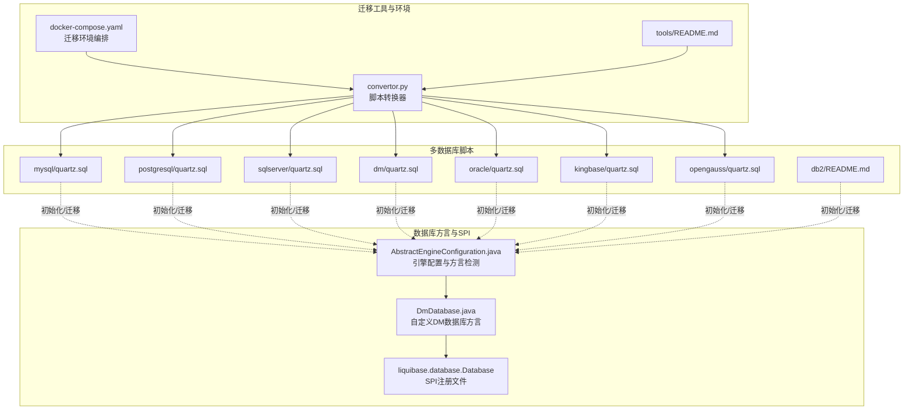
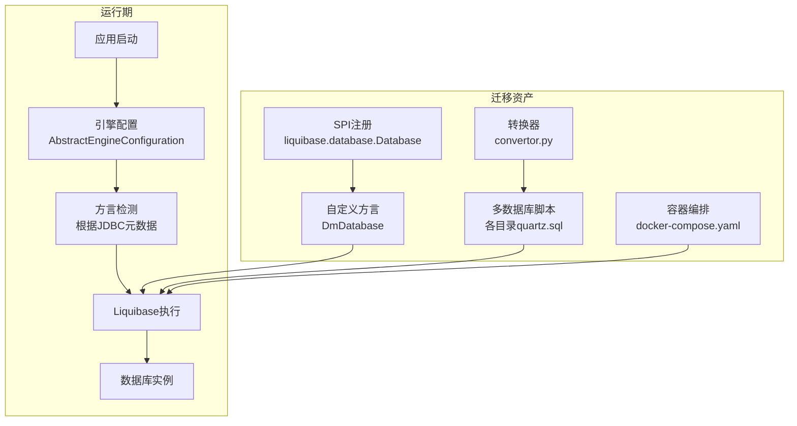
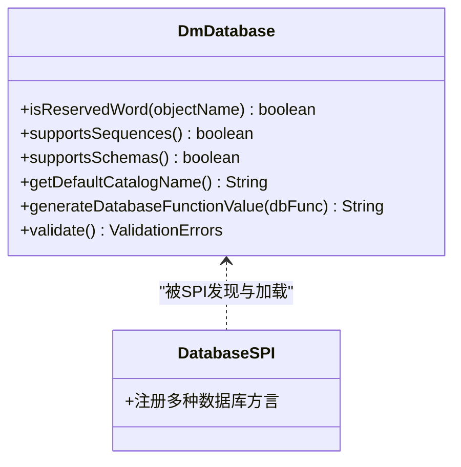
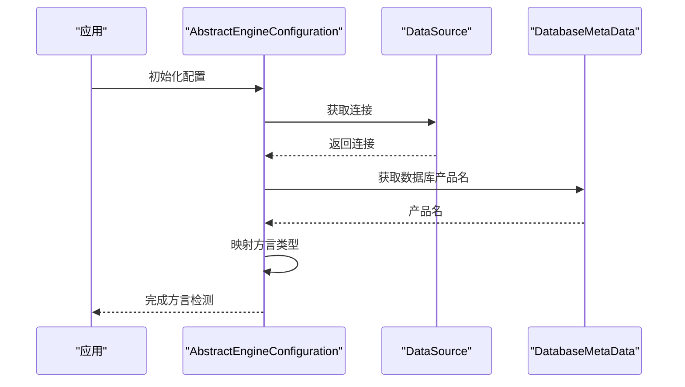
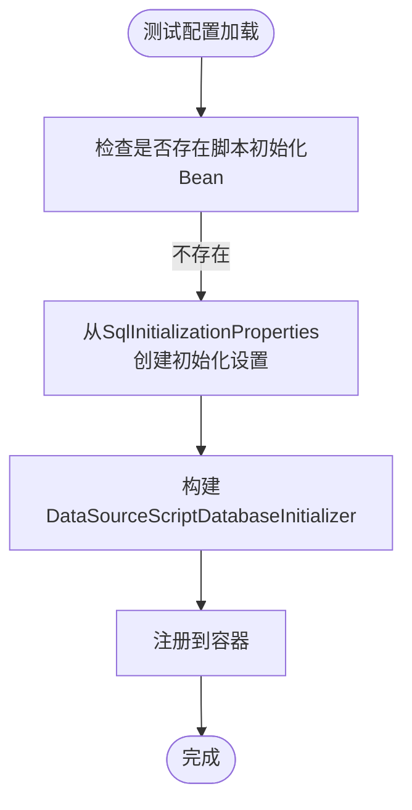
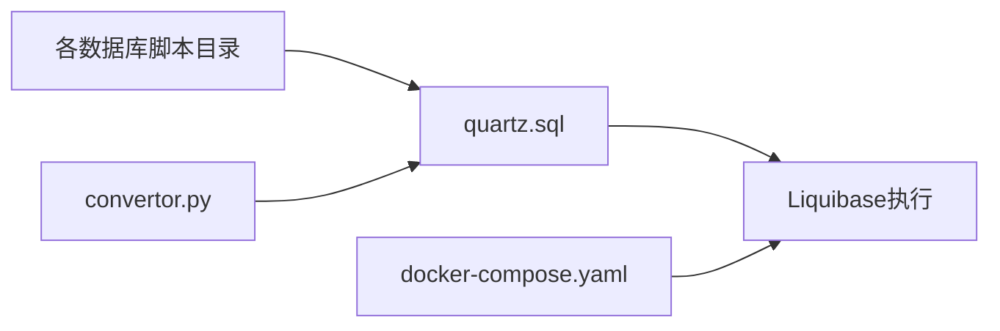
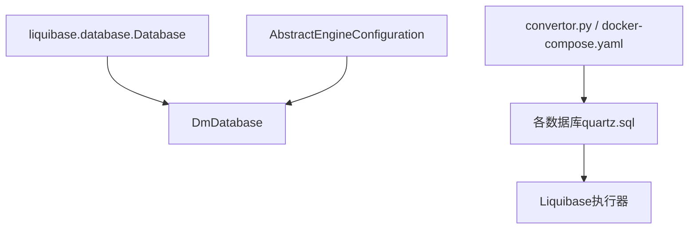

# 数据库迁移管理

<cite>
**本文引用的文件**
- [DmDatabase.java](file://sql/dm/flowable-patch/src/main/java/liquibase/database/core/DmDatabase.java)
- [liquibase.database.Database](file://sql/dm/flowable-patch/src/main/resources/META-INF/services/liquibase.database.Database)
- [AbstractEngineConfiguration.java](file://sql/dm/flowable-patch/src/main/java/org/flowable/common/engine/impl/AbstractEngineConfiguration.java)
- [SqlInitializationTestConfiguration.java](file://yudao-framework/yudao-spring-boot-starter-test/src/main/java/cn/iocoder/yudao/framework/test/config/SqlInitializationTestConfiguration.java)
- [README.md](file://sql/db2/README.md)
- [quartz.sql](file://sql/mysql/quartz.sql)
- [quartz.sql](file://sql/postgresql/quartz.sql)
- [quartz.sql](file://sql/sqlserver/quartz.sql)
- [quartz.sql](file://sql/dm/quartz.sql)
- [quartz.sql](file://sql/oracle/quartz.sql)
- [quartz.sql](file://sql/kingbase/quartz.sql)
- [quartz.sql](file://sql/opengauss/quartz.sql)
- [convertor.py](file://sql/tools/convertor.py)
- [docker-compose.yaml](file://sql/tools/docker-compose.yaml)
- [README.md](file://sql/tools/README.md)
</cite>

## 目录
1. [引言](#引言)
2. [项目结构](#项目结构)
3. [核心组件](#核心组件)
4. [架构总览](#架构总览)
5. [详细组件分析](#详细组件分析)
6. [依赖关系分析](#依赖关系分析)
7. [性能考量](#性能考量)
8. [故障排查指南](#故障排查指南)
9. [结论](#结论)
10. [附录](#附录)

## 引言
本文件系统化梳理本仓库在数据库迁移与版本管理方面的实践，重点覆盖以下方面：
- Liquibase 在项目中的集成方式与变更日志组织策略
- 多数据库方言适配（MySQL、PostgreSQL、SQLServer、DM、Oracle、Kingbase、openGauss、DB2）
- 迁移脚本的自动化执行顺序与回滚机制
- 多数据库支持的实现路径与兼容性处理
- 版本升级最佳实践（灰度与零停机策略）
- 自动化备份与恢复方案
- 迁移过程的监控与审计能力

## 项目结构
围绕数据库迁移与多数据库支持，项目中存在两类关键资源：
- 数据库方言扩展与服务注册：位于 DM 方向盘补丁模块，通过 SPI 注册自定义数据库方言
- 多数据库迁移脚本与工具：位于 sql 目录，按数据库类型分目录存放初始化与 Quartz 相关脚本，并提供转换器与容器化工具

**图表来源**
- [DmDatabase.java:207-503](file://sql/dm/flowable-patch/src/main/java/liquibase/database/core/DmDatabase.java#L207-L503)
- [liquibase.database.Database:1-21](file://sql/dm/flowable-patch/src/main/resources/META-INF/services/liquibase.database.Database#L1-L21)
- [AbstractEngineConfiguration.java:496-543](file://sql/dm/flowable-patch/src/main/java/org/flowable/common/engine/impl/AbstractEngineConfiguration.java#L496-L543)
- [quartz.sql](file://sql/mysql/quartz.sql)
- [quartz.sql](file://sql/postgresql/quartz.sql)
- [quartz.sql](file://sql/sqlserver/quartz.sql)
- [quartz.sql](file://sql/dm/quartz.sql)
- [quartz.sql](file://sql/oracle/quartz.sql)
- [quartz.sql](file://sql/kingbase/quartz.sql)
- [quartz.sql](file://sql/opengauss/quartz.sql)
- [README.md](file://sql/db2/README.md)
- [convertor.py](file://sql/tools/convertor.py)
- [docker-compose.yaml](file://sql/tools/docker-compose.yaml)
- [README.md](file://sql/tools/README.md)

**章节来源**
- [DmDatabase.java:207-503](file://sql/dm/flowable-patch/src/main/java/liquibase/database/core/DmDatabase.java#L207-L503)
- [liquibase.database.Database:1-21](file://sql/dm/flowable-patch/src/main/resources/META-INF/services/liquibase.database.Database#L1-L21)
- [AbstractEngineConfiguration.java:496-543](file://sql/dm/flowable-patch/src/main/java/org/flowable/common/engine/impl/AbstractEngineConfiguration.java#L496-L543)
- [README.md](file://sql/db2/README.md)
- [quartz.sql](file://sql/mysql/quartz.sql)
- [quartz.sql](file://sql/postgresql/quartz.sql)
- [quartz.sql](file://sql/sqlserver/quartz.sql)
- [quartz.sql](file://sql/dm/quartz.sql)
- [quartz.sql](file://sql/oracle/quartz.sql)
- [quartz.sql](file://sql/kingbase/quartz.sql)
- [quartz.sql](file://sql/opengauss/quartz.sql)
- [convertor.py](file://sql/tools/convertor.py)
- [docker-compose.yaml](file://sql/tools/docker-compose.yaml)
- [README.md](file://sql/tools/README.md)

## 核心组件
- 自定义数据库方言与SPI注册
  - 通过 SPI 文件注册多种数据库方言，其中包含 DM 方向盘方言，用于 Liquibase 识别与适配特定数据库语法与特性
  - 自定义方言类提供保留字判断、序列支持、模式/目录支持、默认模式获取、函数值生成、验证错误等能力
- 引擎配置与方言检测
  - 引擎配置类负责从 JDBC 元数据推断数据库类型，并据此选择合适的方言与表前缀、模式等参数
- 测试阶段的 SQL 初始化配置
  - 提供测试环境下的 SQL 初始化 Bean，支持设置 schema/data 位置、继续执行策略、分隔符、编码与执行模式
- 多数据库脚本与工具
  - 各数据库目录下提供 Quartz 初始化脚本；提供转换器脚本与容器编排文件，支撑跨数据库迁移与环境一致性

**章节来源**
- [DmDatabase.java:207-503](file://sql/dm/flowable-patch/src/main/java/liquibase/database/core/DmDatabase.java#L207-L503)
- [liquibase.database.Database:1-21](file://sql/dm/flowable-patch/src/main/resources/META-INF/services/liquibase.database.Database#L1-L21)
- [AbstractEngineConfiguration.java:496-543](file://sql/dm/flowable-patch/src/main/java/org/flowable/common/engine/impl/AbstractEngineConfiguration.java#L496-L543)
- [SqlInitializationTestConfiguration.java:1-52](file://yudao-framework/yudao-spring-boot-starter-test/src/main/java/cn/iocoder/yudao/framework/test/config/SqlInitializationTestConfiguration.java#L1-L52)

## 架构总览
整体迁移架构由“方言识别—脚本准备—执行与回滚—监控审计”构成，贯穿开发、测试与生产各阶段。

**图表来源**
- [AbstractEngineConfiguration.java:496-543](file://sql/dm/flowable-patch/src/main/java/org/flowable/common/engine/impl/AbstractEngineConfiguration.java#L496-L543)
- [DmDatabase.java:207-503](file://sql/dm/flowable-patch/src/main/java/liquibase/database/core/DmDatabase.java#L207-L503)
- [liquibase.database.Database:1-21](file://sql/dm/flowable-patch/src/main/resources/META-INF/services/liquibase.database.Database#L1-L21)
- [quartz.sql](file://sql/mysql/quartz.sql)
- [quartz.sql](file://sql/postgresql/quartz.sql)
- [quartz.sql](file://sql/sqlserver/quartz.sql)
- [quartz.sql](file://sql/dm/quartz.sql)
- [quartz.sql](file://sql/oracle/quartz.sql)
- [quartz.sql](file://sql/kingbase/quartz.sql)
- [quartz.sql](file://sql/opengauss/quartz.sql)
- [convertor.py](file://sql/tools/convertor.py)
- [docker-compose.yaml](file://sql/tools/docker-compose.yaml)

## 详细组件分析

### 组件A：Liquibase 方言与SPI注册
- 设计要点
  - 通过 SPI 文件集中声明可用数据库方言，Liquibase 启动时自动发现并加载
  - 自定义方言类覆盖保留字、序列、模式/目录支持、默认模式、函数值生成与验证逻辑，确保在特定数据库上执行 DDL/DML 的正确性
- 关键行为
  - 支持序列、关闭 schema 支持、默认 catalog 大小写处理、函数值生成规则调整、回收站访问警告等
- 适用场景
  - 在多数据库环境下，保证同一套变更集在不同数据库上行为一致

**图表来源**
- [DmDatabase.java:207-503](file://sql/dm/flowable-patch/src/main/java/liquibase/database/core/DmDatabase.java#L207-L503)
- [liquibase.database.Database:1-21](file://sql/dm/flowable-patch/src/main/resources/META-INF/services/liquibase.database.Database#L1-L21)

**章节来源**
- [DmDatabase.java:207-503](file://sql/dm/flowable-patch/src/main/java/liquibase/database/core/DmDatabase.java#L207-L503)
- [liquibase.database.Database:1-21](file://sql/dm/flowable-patch/src/main/resources/META-INF/services/liquibase.database.Database#L1-L21)

### 组件B：引擎配置与方言检测
- 设计要点
  - 从 DataSource 获取 JDBC 元数据，解析数据库产品名并映射到方言类型
  - 针对特定数据库（如 SQL Server）调整批量插入语句数量上限，避免参数超限
- 关键行为
  - 初始化数据库类型、Schema 管理器、表前缀、模式等
  - 支持是否使用 Schema 管理、表前缀是否作为 Schema 等配置项

**图表来源**
- [AbstractEngineConfiguration.java:496-543](file://sql/dm/flowable-patch/src/main/java/org/flowable/common/engine/impl/AbstractEngineConfiguration.java#L496-L543)

**章节来源**
- [AbstractEngineConfiguration.java:496-543](file://sql/dm/flowable-patch/src/main/java/org/flowable/common/engine/impl/AbstractEngineConfiguration.java#L496-L543)

### 组件C：测试阶段的 SQL 初始化配置
- 设计要点
  - 在测试环境中启用 SQL 初始化 Bean，允许指定 schema/data 资源位置、继续执行策略、分隔符、编码与执行模式
  - 通过禁用懒加载确保初始化在应用启动时执行
- 关键行为
  - 将 Spring Boot 的 SQL 初始化属性映射到初始化设置对象
  - 创建 DataSourceScriptDatabaseInitializer 并注入到容器

**图表来源**
- [SqlInitializationTestConfiguration.java:1-52](file://yudao-framework/yudao-spring-boot-starter-test/src/main/java/cn/iocoder/yudao/framework/test/config/SqlInitializationTestConfiguration.java#L1-L52)

**章节来源**
- [SqlInitializationTestConfiguration.java:1-52](file://yudao-framework/yudao-spring-boot-starter-test/src/main/java/cn/iocoder/yudao/framework/test/config/SqlInitializationTestConfiguration.java#L1-L52)

### 组件D：多数据库脚本与工具
- 设计要点
  - 各数据库目录提供 Quartz 初始化脚本，确保工作流引擎在不同数据库上的表结构一致
  - 提供转换器脚本与容器编排文件，辅助跨数据库迁移与环境一致性
- 关键行为
  - convertor.py 可用于脚本转换或格式统一
  - docker-compose.yaml 提供迁移环境编排，便于本地或 CI 执行

**图表来源**
- [quartz.sql](file://sql/mysql/quartz.sql)
- [quartz.sql](file://sql/postgresql/quartz.sql)
- [quartz.sql](file://sql/sqlserver/quartz.sql)
- [quartz.sql](file://sql/dm/quartz.sql)
- [quartz.sql](file://sql/oracle/quartz.sql)
- [quartz.sql](file://sql/kingbase/quartz.sql)
- [quartz.sql](file://sql/opengauss/quartz.sql)
- [convertor.py](file://sql/tools/convertor.py)
- [docker-compose.yaml](file://sql/tools/docker-compose.yaml)

**章节来源**
- [quartz.sql](file://sql/mysql/quartz.sql)
- [quartz.sql](file://sql/postgresql/quartz.sql)
- [quartz.sql](file://sql/sqlserver/quartz.sql)
- [quartz.sql](file://sql/dm/quartz.sql)
- [quartz.sql](file://sql/oracle/quartz.sql)
- [quartz.sql](file://sql/kingbase/quartz.sql)
- [quartz.sql](file://sql/opengauss/quartz.sql)
- [convertor.py](file://sql/tools/convertor.py)
- [docker-compose.yaml](file://sql/tools/docker-compose.yaml)

## 依赖关系分析
- 方言层依赖
  - 自定义方言类依赖于 Liquibase 的数据库抽象接口，通过 SPI 注册后被 Liquibase 发现
  - 引擎配置类依赖 JDBC 元数据进行数据库类型推断
- 资产层依赖
  - 各数据库脚本作为迁移资产，被 Liquibase 执行器消费
  - 工具链（转换器、容器编排）为脚本准备与执行提供支撑

**图表来源**
- [liquibase.database.Database:1-21](file://sql/dm/flowable-patch/src/main/resources/META-INF/services/liquibase.database.Database#L1-L21)
- [DmDatabase.java:207-503](file://sql/dm/flowable-patch/src/main/java/liquibase/database/core/DmDatabase.java#L207-L503)
- [AbstractEngineConfiguration.java:496-543](file://sql/dm/flowable-patch/src/main/java/org/flowable/common/engine/impl/AbstractEngineConfiguration.java#L496-L543)
- [quartz.sql](file://sql/mysql/quartz.sql)
- [convertor.py](file://sql/tools/convertor.py)
- [docker-compose.yaml](file://sql/tools/docker-compose.yaml)

**章节来源**
- [liquibase.database.Database:1-21](file://sql/dm/flowable-patch/src/main/resources/META-INF/services/liquibase.database.Database#L1-L21)
- [DmDatabase.java:207-503](file://sql/dm/flowable-patch/src/main/java/liquibase/database/core/DmDatabase.java#L207-L503)
- [AbstractEngineConfiguration.java:496-543](file://sql/dm/flowable-patch/src/main/java/org/flowable/common/engine/impl/AbstractEngineConfiguration.java#L496-L543)
- [quartz.sql](file://sql/mysql/quartz.sql)
- [convertor.py](file://sql/tools/convertor.py)
- [docker-compose.yaml](file://sql/tools/docker-compose.yaml)

## 性能考量
- 批量操作优化
  - 针对 SQL Server 设置最大批量语句数，避免参数超限导致失败
- 连接与事务
  - 合理配置 JDBC Ping 查询与空闲时间，降低无效连接占用
- 脚本执行顺序
  - 使用 Liquibase 的变更集顺序与条件标签，确保依赖先行、幂等执行

[本节为通用指导，无需具体文件来源]

## 故障排查指南
- 方言识别失败
  - 检查 SPI 注册文件是否包含目标数据库方言
  - 确认 JDBC 驱动与连接信息正确，使元数据可被正确解析
- 序列/函数生成异常
  - 核对自定义方言中序列支持与函数值生成规则
- 回收站/权限问题
  - 若出现回收站访问警告，需确认数据库权限与配置
- 测试环境初始化失败
  - 检查测试配置 Bean 是否被正确注册与执行，确认 schema/data 位置与分隔符设置

**章节来源**
- [DmDatabase.java:487-503](file://sql/dm/flowable-patch/src/main/java/liquibase/database/core/DmDatabase.java#L487-L503)
- [AbstractEngineConfiguration.java:496-543](file://sql/dm/flowable-patch/src/main/java/org/flowable/common/engine/impl/AbstractEngineConfiguration.java#L496-L543)
- [SqlInitializationTestConfiguration.java:1-52](file://yudao-framework/yudao-spring-boot-starter-test/src/main/java/cn/iocoder/yudao/framework/test/config/SqlInitializationTestConfiguration.java#L1-L52)

## 结论
本项目通过 SPI 注册与自定义方言扩展，结合引擎配置的数据库类型推断，实现了对多数据库的统一迁移入口；配合各数据库脚本与工具链，形成从开发到生产的完整迁移闭环。建议在生产中进一步完善灰度与零停机策略、自动化备份与恢复以及迁移监控与审计能力，以提升可靠性与可观测性。

[本节为总结，无需具体文件来源]

## 附录

### A. 变更日志编写与版本控制策略
- 变更集命名与分层
  - 采用层级化的变更集命名，区分基础表结构、索引、约束、数据初始化与 Quartz 相关内容
- 条件执行与回滚
  - 利用 Liquibase 的条件标签与回滚脚本，确保幂等与可逆
- 分支与合并
  - 在团队协作中，每个功能模块独立维护变更集，合并前进行交叉数据库验证

[本节为通用指导，无需具体文件来源]

### B. 自动化执行顺序与回滚机制
- 执行顺序
  - 优先执行基础表结构与索引，再执行约束与数据初始化
- 回滚策略
  - 为关键变更提供精确回滚脚本，避免级联影响
  - 在测试与预生产环境先行验证回滚

[本节为通用指导，无需具体文件来源]

### C. 多数据库支持与兼容性处理
- 方言适配
  - 通过自定义方言覆盖保留字、序列、函数值生成等差异
- 脚本准备
  - 各数据库目录提供对应脚本，必要时使用转换器统一格式
- 环境一致性
  - 使用容器编排文件在本地与 CI 中复现相同环境

**章节来源**
- [DmDatabase.java:207-503](file://sql/dm/flowable-patch/src/main/java/liquibase/database/core/DmDatabase.java#L207-L503)
- [liquibase.database.Database:1-21](file://sql/dm/flowable-patch/src/main/resources/META-INF/services/liquibase.database.Database#L1-L21)
- [convertor.py](file://sql/tools/convertor.py)
- [docker-compose.yaml](file://sql/tools/docker-compose.yaml)

### D. 版本升级最佳实践（灰度与零停机）
- 灰度发布
  - 先在小部分实例上执行迁移，观察指标与日志后再扩大范围
- 零停机策略
  - 使用在线 DDL 工具与双写校验，逐步替换旧结构
  - 预留回滚窗口，确保可快速回退

[本节为通用指导，无需具体文件来源]

### E. 自动化备份与恢复
- 备份策略
  - 在迁移前执行全量/增量备份，记录快照时间点
- 恢复演练
  - 定期进行恢复演练，验证备份完整性与恢复速度
- 迁移后校验
  - 执行一致性校验与抽样查询，确保数据正确

[本节为通用指导，无需具体文件来源]

### F. 监控与审计
- 迁移监控
  - 记录每次迁移的执行者、时间、目标版本与结果
- 审计日志
  - 保留变更集与回滚脚本的审计轨迹，满足合规要求

[本节为通用指导，无需具体文件来源]