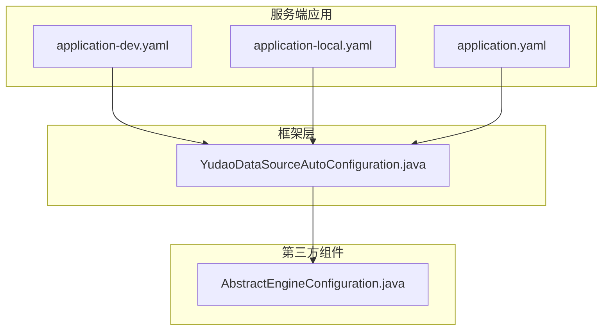
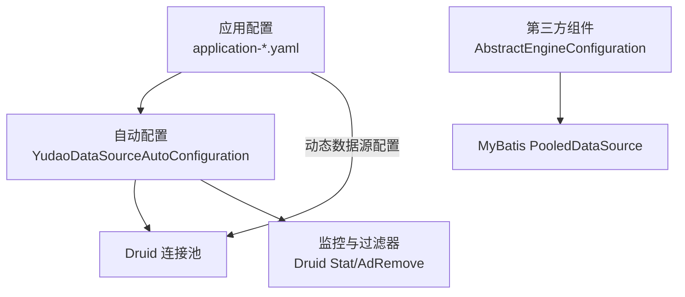
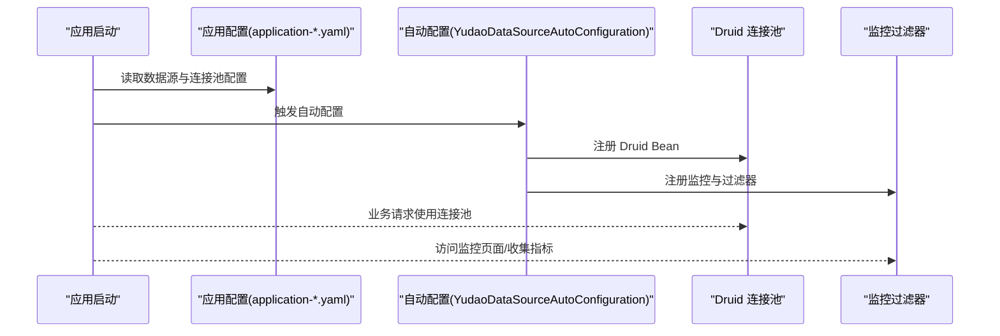
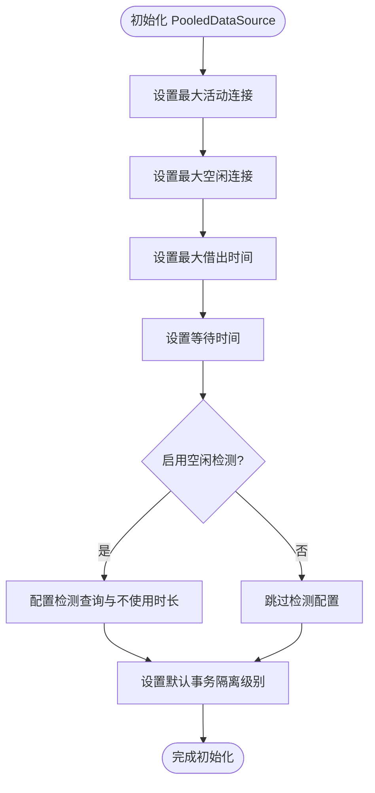
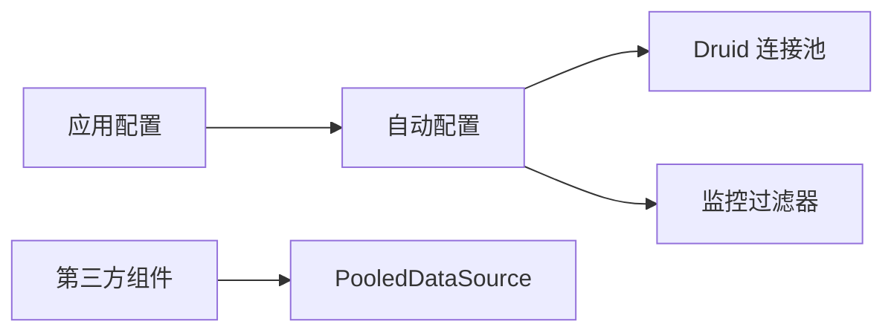

# 数据库连接池

<cite>
**本文引用的文件**
- [application-dev.yaml](file://yudao-server/src/main/resources/application-dev.yaml)
- [application-local.yaml](file://yudao-server/src/main/resources/application-local.yaml)
- [application.yaml](file://yudao-server/src/main/resources/application.yaml)
- [YudaoDataSourceAutoConfiguration.java](file://yudao-framework/yudao-spring-boot-starter-mybatis/src/main/java/cn/iocoder/yudao/framework/datasource/config/YudaoDataSourceAutoConfiguration.java)
- [AbstractEngineConfiguration.java](file://sql/dm/flowable-patch/src/main/java/org/flowable/common/engine/impl/AbstractEngineConfiguration.java)
</cite>

## 目录
1. [引言](#引言)
2. [项目结构](#项目结构)
3. [核心组件](#核心组件)
4. [架构总览](#架构总览)
5. [详细组件分析](#详细组件分析)
6. [依赖关系分析](#依赖关系分析)
7. [性能考量](#性能考量)
8. [故障排查指南](#故障排查指南)
9. [结论](#结论)
10. [附录](#附录)

## 引言
本文件系统性梳理项目中数据库连接池的技术选型与配置实践，重点覆盖以下方面：
- 连接池技术选型：HikariCP 与 Druid 的特性对比与适用场景
- 关键配置参数：最大连接数、最小空闲连接、连接超时、空闲回收策略等设置原则
- 监控与调优：性能指标监控、连接泄漏检测与常见问题定位
- 场景化最佳实践：高并发与低延迟场景的配置策略
- 故障处理与恢复：连接池异常的识别、隔离与恢复机制

## 项目结构
项目采用多模块结构，连接池能力由框架层提供，并在服务端应用中统一启用与配置。核心位置如下：
- 服务端应用配置：位于 yudao-server 模块的 application-dev.yaml、application-local.yaml、application.yaml 中，集中定义数据源与连接池参数
- 连接池自动装配：在 yudao-spring-boot-starter-mybatis 框架中通过 YudaoDataSourceAutoConfiguration 自动注册 Druid 连接池及监控过滤器
- 其他场景：部分第三方组件（如 Flowable 扩展）仍使用 MyBatis 内置的 PooledDataSource，体现多连接池并存的历史背景

**图表来源**
- [application-dev.yaml](file://yudao-server/src/main/resources/application-dev.yaml)
- [application-local.yaml](file://yudao-server/src/main/resources/application-local.yaml)
- [application.yaml](file://yudao-server/src/main/resources/application.yaml)
- [YudaoDataSourceAutoConfiguration.java](file://yudao-framework/yudao-spring-boot-starter-mybatis/src/main/java/cn/iocoder/yudao/framework/datasource/config/YudaoDataSourceAutoConfiguration.java)
- [AbstractEngineConfiguration.java](file://sql/dm/flowable-patch/src/main/java/org/flowable/common/engine/impl/AbstractEngineConfiguration.java)

**章节来源**
- [application-dev.yaml](file://yudao-server/src/main/resources/application-dev.yaml)
- [application-local.yaml](file://yudao-server/src/main/resources/application-local.yaml)
- [application.yaml](file://yudao-server/src/main/resources/application.yaml)
- [YudaoDataSourceAutoConfiguration.java](file://yudao-framework/yudao-spring-boot-starter-mybatis/src/main/java/cn/iocoder/yudao/framework/datasource/config/YudaoDataSourceAutoConfiguration.java)
- [AbstractEngineConfiguration.java](file://sql/dm/flowable-patch/src/main/java/org/flowable/common/engine/impl/AbstractEngineConfiguration.java)

## 核心组件
- Druid 连接池与监控
  - 在框架层通过自动配置类启用 Druid，并注册统计与 Web 监控过滤器，便于在开发环境观察连接池状态与 SQL 统计
  - 应用配置中集中声明 druid 监控与连接池参数，确保与自动配置协同工作
- MyBatis 内置 PooledDataSource
  - 第三方组件扩展中仍保留对 MyBatis PooledDataSource 的使用，体现历史兼容与特定场景需求
- 动态数据源与多数据源
  - 应用配置中包含动态数据源主从配置入口，为后续读写分离与多数据源治理奠定基础

**章节来源**
- [YudaoDataSourceAutoConfiguration.java](file://yudao-framework/yudao-spring-boot-starter-mybatis/src/main/java/cn/iocoder/yudao/framework/datasource/config/YudaoDataSourceAutoConfiguration.java)
- [application-dev.yaml](file://yudao-server/src/main/resources/application-dev.yaml)
- [application-local.yaml](file://yudao-server/src/main/resources/application-local.yaml)
- [application.yaml](file://yudao-server/src/main/resources/application.yaml)
- [AbstractEngineConfiguration.java](file://sql/dm/flowable-patch/src/main/java/org/flowable/common/engine/impl/AbstractEngineConfiguration.java)

## 架构总览
下图展示连接池在系统中的角色与交互路径：应用配置驱动自动配置，自动配置注册 Druid 并暴露监控；第三方组件可选择性使用内置 PooledDataSource。

**图表来源**
- [application-dev.yaml](file://yudao-server/src/main/resources/application-dev.yaml)
- [YudaoDataSourceAutoConfiguration.java](file://yudao-framework/yudao-spring-boot-starter-mybatis/src/main/java/cn/iocoder/yudao/framework/datasource/config/YudaoDataSourceAutoConfiguration.java)
- [AbstractEngineConfiguration.java](file://sql/dm/flowable-patch/src/main/java/org/flowable/common/engine/impl/AbstractEngineConfiguration.java)

## 详细组件分析

### Druid 连接池与监控
- 自动配置要点
  - 条件化启用：基于属性开关控制自动配置加载
  - 监控属性：启用 Druid 统计相关属性，便于采集连接池运行指标
  - Web 过滤器：注册 Druid 监控与 AdRemove 过滤器，支持在线查看慢查询、SQL 面板等
- 应用配置要点
  - druid 监控：开启监控页面与访问路径
  - 连接池参数：初始连接数、最小空闲、最大活跃、获取连接超时、空闲检测周期、空闲连接存活时间、最大存活时间、验证语句、空闲检测开关、预编译缓存与每连接缓存上限等
  - 动态数据源：声明 primary 与 master 数据源，为后续扩展读写分离做准备

**图表来源**
- [application-dev.yaml](file://yudao-server/src/main/resources/application-dev.yaml)
- [application-local.yaml](file://yudao-server/src/main/resources/application-local.yaml)
- [YudaoDataSourceAutoConfiguration.java](file://yudao-framework/yudao-spring-boot-starter-mybatis/src/main/java/cn/iocoder/yudao/framework/datasource/config/YudaoDataSourceAutoConfiguration.java)

**章节来源**
- [YudaoDataSourceAutoConfiguration.java](file://yudao-framework/yudao-spring-boot-starter-mybatis/src/main/java/cn/iocoder/yudao/framework/datasource/config/YudaoDataSourceAutoConfiguration.java)
- [application-dev.yaml](file://yudao-server/src/main/resources/application-dev.yaml)
- [application-local.yaml](file://yudao-server/src/main/resources/application-local.yaml)

### MyBatis PooledDataSource（第三方组件）
- 使用场景
  - 第三方组件扩展中仍保留对 PooledDataSource 的使用，用于特定流程引擎或迁移阶段
- 关键参数映射
  - 最大活动连接、最大空闲连接、最大借出时间、等待时间、空闲检测、验证查询、默认事务隔离级别等
- 配置方式
  - 通过配置项设置上述参数，实现与 Druid 参数的等价映射

**图表来源**
- [AbstractEngineConfiguration.java](file://sql/dm/flowable-patch/src/main/java/org/flowable/common/engine/impl/AbstractEngineConfiguration.java)

**章节来源**
- [AbstractEngineConfiguration.java](file://sql/dm/flowable-patch/src/main/java/org/flowable/common/engine/impl/AbstractEngineConfiguration.java)

### 动态数据源与多数据源（扩展性）
- 当前配置已预留 primary 与 master 数据源字段，为后续引入读写分离、多租户分库或多业务库场景提供基础
- 建议结合路由规则与切换策略，配合连接池参数进行整体优化

**章节来源**
- [application.yaml](file://yudao-server/src/main/resources/application.yaml)

## 依赖关系分析
- 自动配置依赖于应用配置中的数据源与 druid 相关参数
- Druid 连接池与监控过滤器在自动配置阶段完成注册
- 第三方组件可独立选择使用内置 PooledDataSource，避免与主数据源冲突

**图表来源**
- [application-dev.yaml](file://yudao-server/src/main/resources/application-dev.yaml)
- [YudaoDataSourceAutoConfiguration.java](file://yudao-framework/yudao-spring-boot-starter-mybatis/src/main/java/cn/iocoder/yudao/framework/datasource/config/YudaoDataSourceAutoConfiguration.java)
- [AbstractEngineConfiguration.java](file://sql/dm/flowable-patch/src/main/java/org/flowable/common/engine/impl/AbstractEngineConfiguration.java)

**章节来源**
- [application-dev.yaml](file://yudao-server/src/main/resources/application-dev.yaml)
- [YudaoDataSourceAutoConfiguration.java](file://yudao-framework/yudao-spring-boot-starter-mybatis/src/main/java/cn/iocoder/yudao/framework/datasource/config/YudaoDataSourceAutoConfiguration.java)
- [AbstractEngineConfiguration.java](file://sql/dm/flowable-patch/src/main/java/org/flowable/common/engine/impl/AbstractEngineConfiguration.java)

## 性能考量
- 连接池参数设置原则
  - 最大连接数：根据数据库最大连接限制与线程并发度综合评估，避免超过数据库承载上限
  - 最小空闲连接：维持较低空闲以减少资源占用，同时保证突发流量的瞬时可用性
  - 获取连接超时：结合业务峰值与排队策略设定，避免长时间阻塞影响响应
  - 空闲回收策略：合理设置检测周期与空闲存活时间，平衡资源回收与连接复用效率
  - 验证查询：使用轻量级查询（如 SELECT 1）验证连接有效性，降低误判率
  - 预编译缓存：开启 PreparedStatement 缓存并限制每连接上限，提升高频 SQL 的执行效率
- 监控与调优
  - 通过 Druid 监控页面观察活跃连接、等待时间、慢查询、SQL 排行等指标
  - 结合业务峰值与数据库资源水位，动态调整连接池参数
- 适用场景建议
  - 高并发场景：适当提高最大连接数与空闲连接，缩短获取超时，开启预编译缓存
  - 低延迟场景：降低空闲检测周期与最大空闲，减少连接抖动带来的延迟

[本节为通用指导，无需列出具体文件来源]

## 故障排查指南
- 连接池耗尽
  - 现象：获取连接超时、请求堆积
  - 排查：检查最大连接数、获取超时、活跃连接数与等待队列长度；核对是否存在未归还连接
- 连接泄漏
  - 现象：活跃连接持续增长、空闲连接无法回收
  - 排查：启用 Druid 监控，定位长时间占用连接的 SQL 与调用栈；检查业务代码是否遗漏关闭 Statement/ResultSet/Connection
- 验证失败导致频繁重建
  - 现象：连接池波动大、性能抖动
  - 排查：确认验证查询是否适用于目标数据库；调整验证策略与检测周期
- 第三方组件冲突
  - 现象：连接池重复注册、监控冲突
  - 排查：区分第三方组件与主数据源的连接池实例，避免同名配置与端口冲突

**章节来源**
- [application-dev.yaml](file://yudao-server/src/main/resources/application-dev.yaml)
- [YudaoDataSourceAutoConfiguration.java](file://yudao-framework/yudao-spring-boot-starter-mybatis/src/main/java/cn/iocoder/yudao/framework/datasource/config/YudaoDataSourceAutoConfiguration.java)

## 结论
- 项目当前以 Druid 作为主数据源连接池，并通过自动配置与应用配置实现统一治理与监控
- 对于第三方组件仍保留 PooledDataSource 的使用，满足历史兼容与特定场景需求
- 建议在生产环境中结合业务峰值与数据库承载能力，持续优化连接池参数并强化监控告警

[本节为总结性内容，无需列出具体文件来源]

## 附录

### 关键配置参数对照与设置原则
- 初始连接数：维持较低起步，按需增长
- 最小空闲连接：兼顾资源占用与突发流量
- 最大连接数：不超过数据库最大连接限制
- 获取连接超时：结合业务 SLA 设定
- 空闲检测周期：平衡资源回收与开销
- 空闲连接最小/最大存活时间：避免连接老化与过度复用
- 验证查询：使用轻量级查询
- 空闲/借用/归还检测：按需开启，避免过度检测
- 预编译缓存：开启并限制每连接上限

**章节来源**
- [application-local.yaml](file://yudao-server/src/main/resources/application-local.yaml)
- [application-dev.yaml](file://yudao-server/src/main/resources/application-dev.yaml)