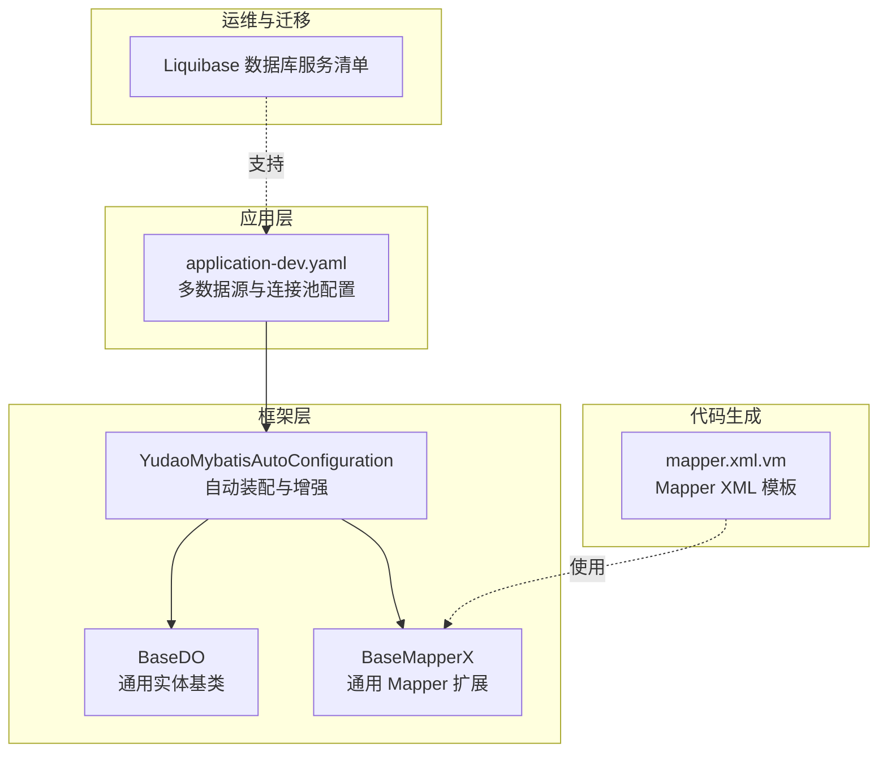
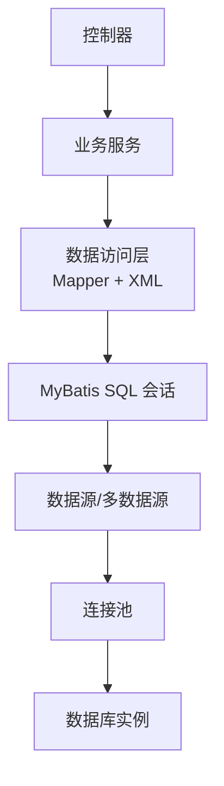
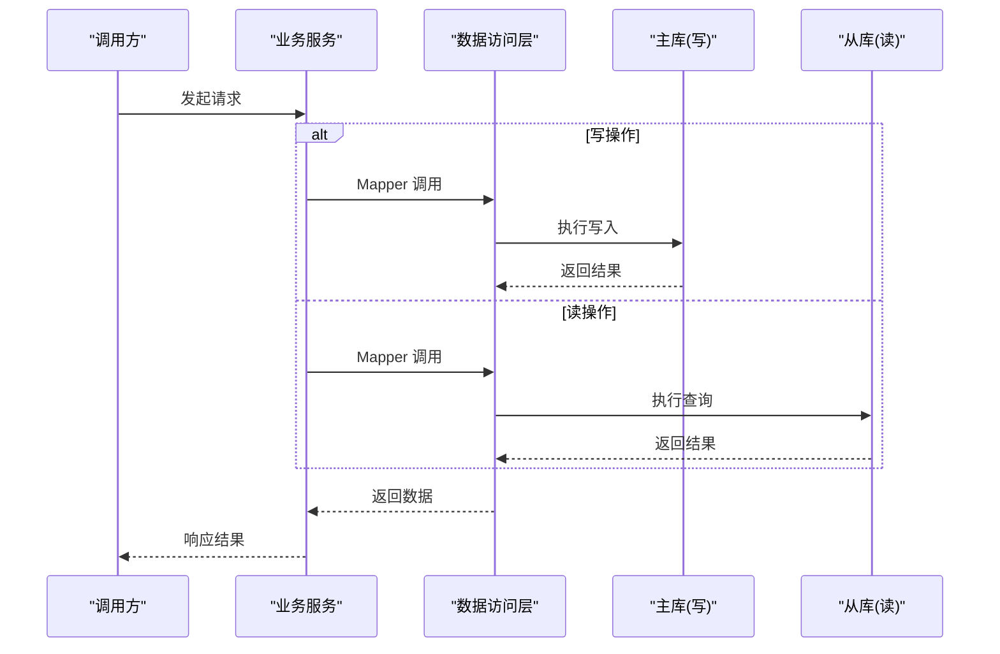
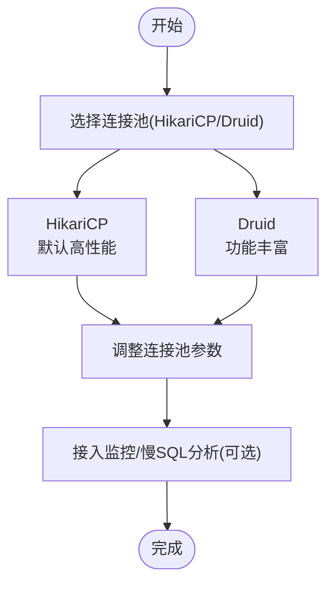
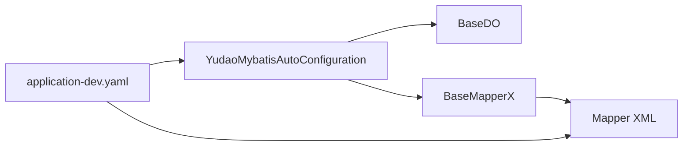

# 数据访问层

<cite>
**本文引用的文件**
- [BaseDO.java](file://yudao-framework/yudao-spring-boot-starter-mybatis/src/main/java/cn/iocoder/yudao/framework/mybatis/core/dataobject/BaseDO.java)
- [BaseMapperX.java](file://yudao-framework/yudao-spring-boot-starter-mybatis/src/main/java/cn/iocoder/yudao/framework/mybatis/core/mapper/BaseMapperX.java)
- [YudaoMybatisAutoConfiguration.java](file://yudao-framework/yudao-spring-boot-starter-mybatis/src/main/java/cn/iocoder/yudao/framework/mybatis/config/YudaoMybatisAutoConfiguration.java)
- [application-dev.yaml](file://yudao-server/src/main/resources/application-dev.yaml)
- [DataSourceConfigVO.ts](file://yudao-ui/yudao-ui-admin-vue3/src/api/infra/dataSourceConfig/index.ts)
- [mapper.xml.vm](file://yudao-module-infra/src/main/resources/codegen/java/dal/mapper.xml.vm)
- [AbstractEngineConfiguration.java](file://sql/dm/flowable-patch/src/main/java/org/flowable/common/engine/impl/AbstractEngineConfiguration.java)
- [Liquibase 数据库服务清单](file://sql/dm/flowable-patch/src/main/resources/META-INF/services/liquibase.database.Database)
</cite>

## 目录
1. [简介](#简介)
2. [项目结构](#项目结构)
3. [核心组件](#核心组件)
4. [架构总览](#架构总览)
5. [组件详解](#组件详解)
6. [依赖关系分析](#依赖关系分析)
7. [性能与连接池](#性能与连接池)
8. [故障排查指南](#故障排查指南)
9. [结论](#结论)
10. [附录](#附录)

## 简介
本章节面向数据访问层（DAO/ORM）的使用与最佳实践，结合项目中已有的 MyBatis Plus 组件与多数据源配置，系统讲解以下主题：
- 实体类设计与通用基类
- Mapper 接口与通用 CRUD
- XML 映射文件的编写与代码生成模板
- 多数据源与读写分离的实现思路与配置要点
- 数据库连接池选型与配置建议（HikariCP、Druid）
- 表结构设计规范（命名、索引、外键、数据类型）
- 数据库迁移与版本管理（Liquibase）

## 项目结构
围绕数据访问层的关键位置如下：
- 框架层（MyBatis Plus 封装与自动装配）
  - 自动配置类：负责扫描、注入与增强 MyBatis 能力
  - 通用基类与通用 Mapper：统一实体字段、扩展常用查询能力
- 应用层（Spring Boot 配置）
  - 多数据源与连接池参数示例
- 代码生成（模板）
  - Mapper XML 模板，指导如何在需要时补充自定义 SQL
- 运维与迁移（Liquibase）
  - 支持多种数据库类型的 Liquibase 服务清单



**图表来源**
- [YudaoMybatisAutoConfiguration.java](file://yudao-framework/yudao-spring-boot-starter-mybatis/src/main/java/cn/iocoder/yudao/framework/mybatis/config/YudaoMybatisAutoConfiguration.java)
- [BaseDO.java](file://yudao-framework/yudao-spring-boot-starter-mybatis/src/main/java/cn/iocoder/yudao/framework/mybatis/core/dataobject/BaseDO.java)
- [BaseMapperX.java](file://yudao-framework/yudao-spring-boot-starter-mybatis/src/main/java/cn/iocoder/yudao/framework/mybatis/core/mapper/BaseMapperX.java)
- [application-dev.yaml](file://yudao-server/src/main/resources/application-dev.yaml)
- [mapper.xml.vm](file://yudao-module-infra/src/main/resources/codegen/java/dal/mapper.xml.vm)
- [Liquibase 数据库服务清单](file://sql/dm/flowable-patch/src/main/resources/META-INF/services/liquibase.database.Database)

**章节来源**
- [YudaoMybatisAutoConfiguration.java](file://yudao-framework/yudao-spring-boot-starter-mybatis/src/main/java/cn/iocoder/yudao/framework/mybatis/config/YudaoMybatisAutoConfiguration.java)
- [application-dev.yaml](file://yudao-server/src/main/resources/application-dev.yaml)

## 核心组件
- 通用实体基类 BaseDO：统一审计字段（如创建时间、更新时间、逻辑删除等），便于所有实体复用
- 通用 Mapper 扩展 BaseMapperX：在 MyBatis Plus 基础上扩展常用查询与条件构造器，减少重复代码
- 自动配置 YudaoMybatisAutoConfiguration：负责扫描、注册与增强 MyBatis 能力，确保通用基类与 Mapper 生效

上述组件为“通用 CRUD + 条件构造”的标准实践提供了统一入口。

**章节来源**
- [BaseDO.java](file://yudao-framework/yudao-spring-boot-starter-mybatis/src/main/java/cn/iocoder/yudao/framework/mybatis/core/dataobject/BaseDO.java)
- [BaseMapperX.java](file://yudao-framework/yudao-spring-boot-starter-mybatis/src/main/java/cn/iocoder/yudao/framework/mybatis/core/mapper/BaseMapperX.java)
- [YudaoMybatisAutoConfiguration.java](file://yudao-framework/yudao-spring-boot-starter-mybatis/src/main/java/cn/iocoder/yudao/framework/mybatis/config/YudaoMybatisAutoConfiguration.java)

## 架构总览
下图展示了数据访问层在系统中的位置与交互关系：控制器通过 Service 调用 DAO 层；DAO 层基于通用 Mapper 与 XML 映射执行 SQL；连接池与多数据源由 Spring Boot 配置提供。



[此图为概念性示意，不直接映射具体源码文件]

## 组件详解

### 实体类设计与通用基类 BaseDO
- 设计原则
  - 统一审计字段：创建时间、更新时间、创建者、更新者、逻辑删除标记
  - 字段命名规范：采用小写下划线风格，避免保留字
  - 可选扩展：租户隔离字段、版本号用于乐观锁
- 复用方式
  - 所有实体继承 BaseDO，即可获得统一的审计与控制字段
  - 与 MyBatis Plus 注解配合，自动映射数据库字段

**章节来源**
- [BaseDO.java](file://yudao-framework/yudao-spring-boot-starter-mybatis/src/main/java/cn/iocoder/yudao/framework/mybatis/core/dataobject/BaseDO.java)

### Mapper 接口与通用 CRUD
- Mapper 接口
  - 建议每个实体对应一个 Mapper 接口，继承通用 Mapper 扩展 BaseMapperX
  - 仅在需要复杂 SQL 或跨表联查时，再引入 XML 映射
- 通用 CRUD
  - 提供新增、删除、更新、分页查询、条件查询等常用能力
  - 结合条件构造器 QueryWrapperX/MPJLambdaWrapperX，简化复杂查询拼装

```mermaid
classDiagram
class BaseDO {
"+创建时间"
"+更新时间"
"+逻辑删除"
}
class BaseMapperX {
"+插入/删除/更新"
"+分页/条件查询"
}
class UserMapper {
"<<Mapper>>"
}
class User {
"<<实体>>"
}
User --|> BaseDO : "继承"
UserMapper --|> BaseMapperX : "继承"
```

**图表来源**
- [BaseDO.java](file://yudao-framework/yudao-spring-boot-starter-mybatis/src/main/java/cn/iocoder/yudao/framework/mybatis/core/dataobject/BaseDO.java)
- [BaseMapperX.java](file://yudao-framework/yudao-spring-boot-starter-mybatis/src/main/java/cn/iocoder/yudao/framework/mybatis/core/mapper/BaseMapperX.java)

**章节来源**
- [BaseMapperX.java](file://yudao-framework/yudao-spring-boot-starter-mybatis/src/main/java/cn/iocoder/yudao/framework/mybatis/core/mapper/BaseMapperX.java)

### XML 映射文件编写与模板
- 使用场景
  - 当通用 Mapper 无法覆盖的复杂 SQL（如多表关联、子查询、聚合统计）时，使用 XML 编写
- 模板与约定
  - 代码生成器提供 Mapper XML 模板，建议在需要时手动完善 SQL
  - 命名空间与接口保持一致，遵循模块化组织（按业务域划分）

**章节来源**
- [mapper.xml.vm](file://yudao-module-infra/src/main/resources/codegen/java/dal/mapper.xml.vm)

### 多数据源与读写分离
- 配置要点（以 application-dev.yaml 为例）
  - 主从数据源：master（写）、slave（读）
  - 连接池参数：最大连接数、获取超时、空闲检测、预编译语句缓存等
  - 启动优化：从库可启用懒加载，降低启动时间
- 切换策略
  - 基于注解或路由规则在读写操作间切换
  - 写操作强制走主库，读操作走从库
- 事务管理
  - 事务边界内应保持数据源一致性，避免跨库事务
  - 建议使用本地事务，避免分布式事务带来的复杂度



**图表来源**
- [application-dev.yaml](file://yudao-server/src/main/resources/application-dev.yaml)

**章节来源**
- [application-dev.yaml](file://yudao-server/src/main/resources/application-dev.yaml)

### 数据库连接池配置与选型
- HikariCP
  - 特点：默认高性能、零配置即可用、连接泄漏防护完善
  - 适用：大多数高并发场景，推荐作为默认选择
- Druid
  - 特点：功能丰富（监控、SQL 防火墙、慢 SQL 记录等）
  - 适用：对监控与运维可观测性要求较高，或需精细化 SQL 分析
- 通用配置项（来自示例配置）
  - 最大连接数、获取超时、空闲回收周期、最大空闲存活时间、最大生命周期
  - 连接有效性检测、是否缓存 PreparedStatement、每连接缓存上限



**图表来源**
- [application-dev.yaml](file://yudao-server/src/main/resources/application-dev.yaml)

**章节来源**
- [application-dev.yaml](file://yudao-server/src/main/resources/application-dev.yaml)

### 数据库表结构设计规范
- 命名约定
  - 表名与字段统一使用小写下划线风格，避免保留字
  - 外键命名采用“业务含义_表名_id”模式，提升可读性
- 索引设计
  - 唯一索引：保证业务唯一性（如账号、编号）
  - 聚集索引：优先考虑主键；辅助索引：覆盖高频查询条件
  - 复合索引：遵循“最左前缀原则”，避免冗余
- 外键约束
  - 关系明确且强一致需求时启用外键；否则可通过应用层约束与校验替代
- 数据类型选择
  - 时间类型：统一使用带时区的 DATETIME 或 TIMESTAMP
  - 大文本：使用 TEXT/VARCHAR 限制长度；二进制使用 BLOB
  - 数值类型：精确计算使用 DECIMAL；整数使用 BIGINT/INT

[本节为通用规范说明，不直接分析具体源码文件]

### 数据库迁移与版本管理（Liquibase）
- 服务发现
  - 通过服务清单声明支持的数据库类型，便于 Liquibase 自动识别适配
- 最佳实践
  - 将变更脚本纳入版本控制，每次变更提交独立变更集
  - 使用标签（tag）标记里程碑版本，便于回滚与对比
  - 在集成测试环境先行验证，再推广到生产

**章节来源**
- [Liquibase 数据库服务清单](file://sql/dm/flowable-patch/src/main/resources/META-INF/services/liquibase.database.Database)

## 依赖关系分析
- 组件耦合
  - Mapper 依赖通用基类与通用 Mapper 扩展，形成清晰的层次
  - 自动配置类负责装配与增强，降低使用者心智负担
- 外部依赖
  - 连接池与多数据源由 Spring Boot 配置提供
  - XML 映射文件与代码生成模板协同，保证 SQL 维护成本可控



**图表来源**
- [YudaoMybatisAutoConfiguration.java](file://yudao-framework/yudao-spring-boot-starter-mybatis/src/main/java/cn/iocoder/yudao/framework/mybatis/config/YudaoMybatisAutoConfiguration.java)
- [BaseDO.java](file://yudao-framework/yudao-spring-boot-starter-mybatis/src/main/java/cn/iocoder/yudao/framework/mybatis/core/dataobject/BaseDO.java)
- [BaseMapperX.java](file://yudao-framework/yudao-spring-boot-starter-mybatis/src/main/java/cn/iocoder/yudao/framework/mybatis/core/mapper/BaseMapperX.java)
- [application-dev.yaml](file://yudao-server/src/main/resources/application-dev.yaml)

**章节来源**
- [YudaoMybatisAutoConfiguration.java](file://yudao-framework/yudao-spring-boot-starter-mybatis/src/main/java/cn/iocoder/yudao/framework/mybatis/config/YudaoMybatisAutoConfiguration.java)
- [application-dev.yaml](file://yudao-server/src/main/resources/application-dev.yaml)

## 性能与连接池
- 连接池参数建议
  - 最大连接数：根据峰值并发与数据库承载能力评估
  - 获取超时：避免长时间阻塞导致线程池耗尽
  - 空闲回收：定期清理长时间未使用的连接
  - 预编译语句缓存：提升热点 SQL 的执行效率
- 读写分离性能
  - 读流量较大时，合理设置从库数量与延迟容忍度
  - 写后读一致性：必要时增加短暂延迟或强制主库读取

[本节提供通用建议，不直接分析具体源码文件]

## 故障排查指南
- 连接池问题
  - 现象：获取连接超时、连接泄漏
  - 排查：检查最大连接数、空闲回收、获取超时；确认业务未遗漏关闭资源
- 多数据源问题
  - 现象：读写错乱、事务跨库
  - 排查：核对路由规则、事务边界；确保写操作强制走主库
- XML SQL 问题
  - 现象：慢查询、索引未命中
  - 排查：使用数据库 EXPLAIN 分析执行计划；优化索引与 SQL 结构

**章节来源**
- [application-dev.yaml](file://yudao-server/src/main/resources/application-dev.yaml)

## 结论
本项目通过通用实体与通用 Mapper 扩展，实现了“通用 CRUD + 条件构造”的高效开发范式；借助多数据源与连接池配置，兼顾了性能与可维护性；配合 Liquibase 的数据库迁移能力，保障了演进过程中的稳定性与可追溯性。建议在实际落地时，严格遵循表结构设计规范，并结合监控与压测持续优化。

## 附录
- 数据源配置 API（前端对接）
  - 提供数据源配置的增删改查接口，便于后台动态维护多数据源

**章节来源**
- [DataSourceConfigVO.ts](file://yudao-ui/yudao-ui-admin-vue3/src/api/infra/dataSourceConfig/index.ts)