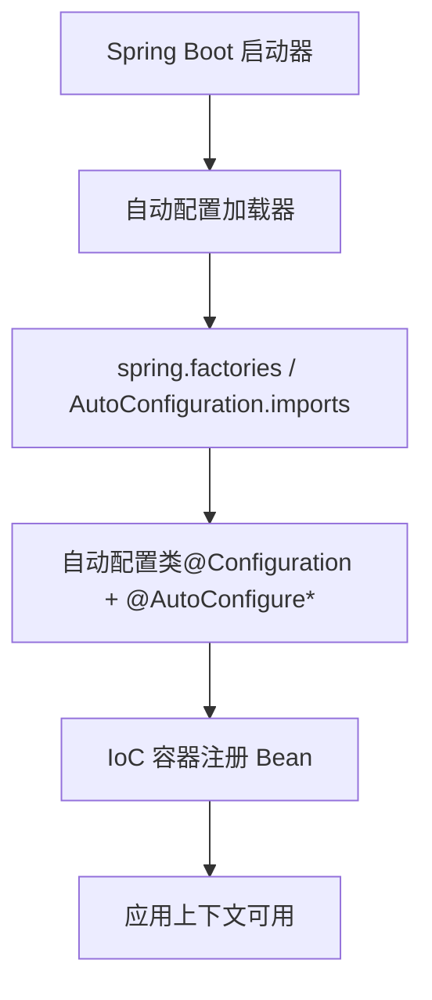
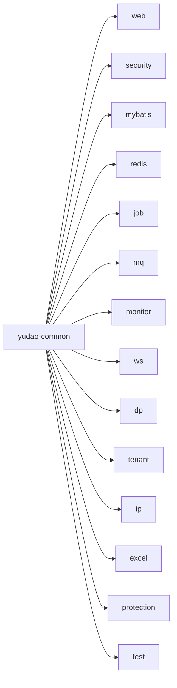

# 核心框架

<cite>
**本文引用的文件**
- [yudao-framework/pom.xml](file://yudao-framework/pom.xml)
- [yudao-framework/yudao-common/pom.xml](file://yudao-framework/yudao-common/pom.xml)
- [yudao-framework/yudao-spring-boot-starter-web/pom.xml](file://yudao-framework/yudao-spring-boot-starter-web/pom.xml)
- [yudao-framework/yudao-spring-boot-starter-security/pom.xml](file://yudao-framework/yudao-spring-boot-starter-security/pom.xml)
- [yudao-framework/yudao-spring-boot-starter-mybatis/pom.xml](file://yudao-framework/yudao-spring-boot-starter-mybatis/pom.xml)
- [yudao-framework/yudao-spring-boot-starter-redis/pom.xml](file://yudao-framework/yudao-spring-boot-starter-redis/pom.xml)
- [yudao-framework/yudao-spring-boot-starter-job/pom.xml](file://yudao-framework/yudao-spring-boot-starter-job/pom.xml)
- [yudao-framework/yudao-spring-boot-starter-mq/pom.xml](file://yudao-framework/yudao-spring-boot-starter-mq/pom.xml)
- [yudao-framework/yudao-spring-boot-starter-monitor/pom.xml](file://yudao-framework/yudao-spring-boot-starter-monitor/pom.xml)
- [yudao-framework/yudao-spring-boot-starter-websocket/pom.xml](file://yudao-framework/yudao-spring-boot-starter-websocket/pom.xml)
- [yudao-framework/yudao-spring-boot-starter-biz-data-permission/pom.xml](file://yudao-framework/yudao-spring-boot-starter-biz-data-permission/pom.xml)
- [yudao-framework/yudao-spring-boot-starter-biz-tenant/pom.xml](file://yudao-framework/yudao-spring-boot-starter-biz-tenant/pom.xml)
- [yudao-framework/yudao-spring-boot-starter-biz-ip/pom.xml](file://yudao-framework/yudao-spring-boot-starter-biz-ip/pom.xml)
- [yudao-framework/yudao-spring-boot-starter-excel/pom.xml](file://yudao-framework/yudao-spring-boot-starter-excel/pom.xml)
- [yudao-framework/yudao-spring-boot-starter-protection/pom.xml](file://yudao-framework/yudao-spring-boot-starter-protection/pom.xml)
- [yudao-framework/yudao-spring-boot-starter-test/pom.xml](file://yudao-framework/yudao-spring-boot-starter-test/pom.xml)
- [yudao-framework/yudao-spring-boot-starter-biz-tenant/src/main/resources/META-INF/spring.factories](file://yudao-framework/yudao-spring-boot-starter-biz-tenant/src/main/resources/META-INF/spring.factories)
- [yudao-framework/yudao-spring-boot-starter-mybatis/src/main/resources/META-INF/spring.factories](file://yudao-framework/yudao-spring-boot-starter-mybatis/src/main/resources/META-INF/spring.factories)
- [yudao-framework/yudao-spring-boot-starter-job/src/main/resources/org.springframework.boot.autoconfigure.AutoConfiguration.imports](file://yudao-framework/yudao-spring-boot-starter-job/src/main/resources/org.springframework.boot.autoconfigure.AutoConfiguration.imports)
- [yudao-framework/yudao-spring-boot-starter-monitor/src/main/resources/org.springframework.boot.autoconfigure.AutoConfiguration.imports](file://yudao-framework/yudao-spring-boot-starter-monitor/src/main/resources/org.springframework.boot.autoconfigure.AutoConfiguration.imports)
- [yudao-framework/yudao-spring-boot-starter-mq/src/main/resources/org.springframework.boot.autoconfigure.AutoConfiguration.imports](file://yudao-framework/yudao-spring-boot-starter-mq/src/main/resources/org.springframework.boot.autoconfigure.AutoConfiguration.imports)
- [yudao-framework/yudao-spring-boot-starter-redis/src/main/resources/org.springframework.boot.autoconfigure.AutoConfiguration.imports](file://yudao-framework/yudao-spring-boot-starter-redis/src/main/resources/org.springframework.boot.autoconfigure.AutoConfiguration.imports)
- [yudao-framework/yudao-spring-boot-starter-websocket/src/main/resources/org.springframework.boot.autoconfigure.AutoConfiguration.imports](file://yudao-framework/yudao-spring-boot-starter-websocket/src/main/resources/org.springframework.boot.autoconfigure.AutoConfiguration.imports)
</cite>

## 目录
1. [引言](#引言)
2. [项目结构](#项目结构)
3. [核心组件](#核心组件)
4. [架构总览](#架构总览)
5. [详细组件分析](#详细组件分析)
6. [依赖分析](#依赖分析)
7. [性能考虑](#性能考虑)
8. [故障排查指南](#故障排查指南)
9. [结论](#结论)
10. [附录](#附录)

## 引言
本文件面向 ruoyi-vue-pro 的 yudao-framework 核心框架，系统性阐述其基于 Spring Boot Starter 的自动化装配与模块化设计。文档聚焦以下目标：
- 解析 yudao-framework 的模块组织与职责边界
- 详解 Spring Boot 自动配置原理在框架中的落地：@EnableAutoConfiguration、条件装配与配置类加载机制
- 深入说明各核心 Starter（web、security、mybatis、redis 等）的功能、配置项与扩展方式
- 描述组件间的依赖关系与集成模式，并给出可操作的配置示例与最佳实践
- 提供自定义 Starter 开发与发布流程指南

## 项目结构
yudao-framework 采用多模块聚合结构，以“yudao-common”为基础通用能力，以“yudao-spring-boot-starter-*”为各功能域的自动装配模块。顶层聚合工程统一管理版本与依赖。

```mermaid
graph TB
root["yudao-framework 聚合工程<br/>聚合所有 Starter 与公共模块"] --> common["yudao-common<br/>通用工具/异常/枚举等"]
root --> web["yudao-spring-boot-starter-web"]
root --> security["yudao-spring-boot-starter-security"]
root --> mybatis["yudao-spring-boot-starter-mybatis"]
root --> redis["yudao-spring-boot-starter-redis"]
root --> job["yudao-spring-boot-starter-job"]
root --> mq["yudao-spring-boot-starter-mq"]
root --> monitor["yudao-spring-boot-starter-monitor"]
root --> ws["yudao-spring-boot-starter-websocket"]
root --> dp["yudao-spring-boot-starter-biz-data-permission"]
root --> tenant["yudao-spring-boot-starter-biz-tenant"]
root --> ip["yudao-spring-boot-starter-biz-ip"]
root --> excel["yudao-spring-boot-starter-excel"]
root --> protection["yudao-spring-boot-starter-protection"]
root --> test["yudao-spring-boot-starter-test"]
```

图表来源
- [yudao-framework/pom.xml](file://yudao-framework/pom.xml)
- [yudao-framework/yudao-common/pom.xml](file://yudao-framework/yudao-common/pom.xml)
- [yudao-framework/yudao-spring-boot-starter-web/pom.xml](file://yudao-framework/yudao-spring-boot-starter-web/pom.xml)
- [yudao-framework/yudao-spring-boot-starter-security/pom.xml](file://yudao-framework/yudao-spring-boot-starter-security/pom.xml)
- [yudao-framework/yudao-spring-boot-starter-mybatis/pom.xml](file://yudao-framework/yudao-spring-boot-starter-mybatis/pom.xml)
- [yudao-framework/yudao-spring-boot-starter-redis/pom.xml](file://yudao-framework/yudao-spring-boot-starter-redis/pom.xml)
- [yudao-framework/yudao-spring-boot-starter-job/pom.xml](file://yudao-framework/yudao-spring-boot-starter-job/pom.xml)
- [yudao-framework/yudao-spring-boot-starter-mq/pom.xml](file://yudao-framework/yudao-spring-boot-starter-mq/pom.xml)
- [yudao-framework/yudao-spring-boot-starter-monitor/pom.xml](file://yudao-framework/yudao-spring-boot-starter-monitor/pom.xml)
- [yudao-framework/yudao-spring-boot-starter-websocket/pom.xml](file://yudao-framework/yudao-spring-boot-starter-websocket/pom.xml)
- [yudao-framework/yudao-spring-boot-starter-biz-data-permission/pom.xml](file://yudao-framework/yudao-spring-boot-starter-biz-data-permission/pom.xml)
- [yudao-framework/yudao-spring-boot-starter-biz-tenant/pom.xml](file://yudao-framework/yudao-spring-boot-starter-biz-tenant/pom.xml)
- [yudao-framework/yudao-spring-boot-starter-biz-ip/pom.xml](file://yudao-framework/yudao-spring-boot-starter-biz-ip/pom.xml)
- [yudao-framework/yudao-spring-boot-starter-excel/pom.xml](file://yudao-framework/yudao-spring-boot-starter-excel/pom.xml)
- [yudao-framework/yudao-spring-boot-starter-protection/pom.xml](file://yudao-framework/yudao-spring-boot-starter-protection/pom.xml)
- [yudao-framework/yudao-spring-boot-starter-test/pom.xml](file://yudao-framework/yudao-spring-boot-starter-test/pom.xml)

章节来源
- [yudao-framework/pom.xml](file://yudao-framework/pom.xml)

## 核心组件
- yudao-common：提供通用 POJO、异常体系、枚举、校验注解、工具类等基础能力，被各 Starter 与业务模块复用。
- 各 Starter：通过 spring.factories 或 AutoConfiguration.imports 实现自动装配，按需启用对应能力（Web MVC、安全、MyBatis、Redis、定时任务、消息队列、监控、WebSocket、租户、IP、Excel、签名保护等）。
- 测试 Starter：提供单元测试环境下的数据库与缓存初始化配置，便于模块级测试。

章节来源
- [yudao-framework/yudao-common/pom.xml](file://yudao-framework/yudao-common/pom.xml)
- [yudao-framework/yudao-spring-boot-starter-test/pom.xml](file://yudao-framework/yudao-spring-boot-starter-test/pom.xml)

## 架构总览
yudao-framework 的自动装配遵循 Spring Boot 标准约定：
- 使用 spring.factories 或 AutoConfiguration.imports 声明自动配置类
- 通过条件注解（如 @ConditionalOnProperty、@ConditionalOnClass 等）实现按需装配
- 通过外部配置（application.yaml）控制开关与行为

图表来源
- [yudao-framework/yudao-spring-boot-starter-biz-tenant/src/main/resources/META-INF/spring.factories](file://yudao-framework/yudao-spring-boot-starter-biz-tenant/src/main/resources/META-INF/spring.factories)
- [yudao-framework/yudao-spring-boot-starter-mybatis/src/main/resources/META-INF/spring.factories](file://yudao-framework/yudao-spring-boot-starter-mybatis/src/main/resources/META-INF/spring.factories)
- [yudao-framework/yudao-spring-boot-starter-job/src/main/resources/org.springframework.boot.autoconfigure.AutoConfiguration.imports](file://yudao-framework/yudao-spring-boot-starter-job/src/main/resources/org.springframework.boot.autoconfigure.AutoConfiguration.imports)
- [yudao-framework/yudao-spring-boot-starter-monitor/src/main/resources/org.springframework.boot.autoconfigure.AutoConfiguration.imports](file://yudao-framework/yudao-spring-boot-starter-monitor/src/main/resources/org.springframework.boot.autoconfigure.AutoConfiguration.imports)
- [yudao-framework/yudao-spring-boot-starter-mq/src/main/resources/org.springframework.boot.autoconfigure.AutoConfiguration.imports](file://yudao-framework/yudao-spring-boot-starter-mq/src/main/resources/org.springframework.boot.autoconfigure.AutoConfiguration.imports)
- [yudao-framework/yudao-spring-boot-starter-redis/src/main/resources/org.springframework.boot.autoconfigure.AutoConfiguration.imports](file://yudao-framework/yudao-spring-boot-starter-redis/src/main/resources/org.springframework.boot.autoconfigure.AutoConfiguration.imports)
- [yudao-framework/yudao-spring-boot-starter-websocket/src/main/resources/org.springframework.boot.autoconfigure.AutoConfiguration.imports](file://yudao-framework/yudao-spring-boot-starter-websocket/src/main/resources/org.springframework.boot.autoconfigure.AutoConfiguration.imports)

## 详细组件分析

### Web Starter（yudao-spring-boot-starter-web）
- 功能定位：封装 Spring MVC、接口文档（Swagger）、请求参数加密与脱敏等通用 Web 能力。
- 自动装配机制：通过 AutoConfiguration.imports 声明配置类，按需启用。
- 关键点：
  - 可通过配置项开启/关闭相关功能
  - 提供全局异常处理、响应包装、参数校验增强等
- 使用建议：
  - 在应用中引入该 Starter 后，按需在配置文件中启用相应特性
  - 如需自定义拦截器或消息转换器，可在自身配置类中声明并覆盖默认 Bean

章节来源
- [yudao-framework/yudao-spring-boot-starter-web/pom.xml](file://yudao-framework/yudao-spring-boot-starter-web/pom.xml)

### Security Starter（yudao-spring-boot-starter-security）
- 功能定位：基于 Spring Security 封装统一认证授权、操作日志记录、登录审计等。
- 自动装配机制：通过 AutoConfiguration.imports 声明配置类。
- 关键点：
  - 提供统一的认证策略与权限控制
  - 记录操作日志，支持扩展审计字段
- 使用建议：
  - 在应用中引入后，按需配置用户详情服务、权限表达式等
  - 如需自定义过滤链或认证逻辑，可通过扩展配置类实现

章节来源
- [yudao-framework/yudao-spring-boot-starter-security/pom.xml](file://yudao-framework/yudao-spring-boot-starter-security/pom.xml)

### MyBatis Starter（yudao-spring-boot-starter-mybatis）
- 功能定位：提供 MyBatis Plus、分页插件、SQL 日志、多数据源与读写分离等能力。
- 自动装配机制：通过 spring.factories 声明自动配置类。
- 关键点：
  - 默认启用常用插件与配置
  - 支持多数据源与动态切换
- 使用建议：
  - 在配置文件中定义数据源与 SQL 日志开关
  - 如需自定义 SQL 方言或分页策略，可通过扩展配置类注入

章节来源
- [yudao-framework/yudao-spring-boot-starter-mybatis/pom.xml](file://yudao-framework/yudao-spring-boot-starter-mybatis/pom.xml)
- [yudao-framework/yudao-spring-boot-starter-mybatis/src/main/resources/META-INF/spring.factories](file://yudao-framework/yudao-spring-boot-starter-mybatis/src/main/resources/META-INF/spring.factories)

### Redis Starter（yudao-spring-boot-starter-redis）
- 功能定位：提供 RedisTemplate、序列化策略、分布式缓存、限流等能力。
- 自动装配机制：通过 AutoConfiguration.imports 声明配置类。
- 关键点：
  - 默认提供合适的序列化与模板配置
  - 支持与 Spring Cache 集成
- 使用建议：
  - 在配置文件中设置连接参数与序列化策略
  - 如需自定义缓存注解行为，可通过扩展配置类覆盖

章节来源
- [yudao-framework/yudao-spring-boot-starter-redis/pom.xml](file://yudao-framework/yudao-spring-boot-starter-redis/pom.xml)
- [yudao-framework/yudao-spring-boot-starter-redis/src/main/resources/org.springframework.boot.autoconfigure.AutoConfiguration.imports](file://yudao-framework/yudao-spring-boot-starter-redis/src/main/resources/org.springframework.boot.autoconfigure.AutoConfiguration.imports)

### Job（定时任务）Starter（yudao-spring-boot-starter-job）
- 功能定位：基于 Quartz 的定时任务调度能力。
- 自动装配机制：通过 AutoConfiguration.imports 声明配置类。
- 关键点：
  - 提供任务持久化、并发控制、失败重试等能力
- 使用建议：
  - 在配置文件中启用 Quartz 并设置存储策略
  - 通过注解或编程方式注册任务

章节来源
- [yudao-framework/yudao-spring-boot-starter-job/pom.xml](file://yudao-framework/yudao-spring-boot-starter-job/pom.xml)
- [yudao-framework/yudao-spring-boot-starter-job/src/main/resources/org.springframework.boot.autoconfigure.AutoConfiguration.imports](file://yudao-framework/yudao-spring-boot-starter-job/src/main/resources/org.springframework.boot.autoconfigure.AutoConfiguration.imports)

### MQ（消息队列）Starter（yudao-spring-boot-starter-mq）
- 功能定位：统一消息发送与监听抽象，支持多种消息中间件。
- 自动装配机制：通过 AutoConfiguration.imports 声明配置类。
- 关键点：
  - 提供事件发布与监听的统一入口
  - 支持 RabbitMQ 等实现
- 使用建议：
  - 在配置文件中选择并配置 MQ 实现
  - 通过事件驱动解耦模块间通信

章节来源
- [yudao-framework/yudao-spring-boot-starter-mq/pom.xml](file://yudao-framework/yudao-spring-boot-starter-mq/pom.xml)
- [yudao-framework/yudao-spring-boot-starter-mq/src/main/resources/org.springframework.boot.autoconfigure.AutoConfiguration.imports](file://yudao-framework/yudao-spring-boot-starter-mq/src/main/resources/org.springframework.boot.autoconfigure.AutoConfiguration.imports)

### Monitor（监控）Starter（yudao-spring-boot-starter-monitor）
- 功能定位：集成监控端点、链路追踪与可视化监控工具。
- 自动装配机制：通过 AutoConfiguration.imports 声明配置类。
- 关键点：
  - 提供 Actuator 端点与链路追踪能力
- 使用建议：
  - 在配置文件中启用所需监控功能
  - 结合外部监控平台进行采集与展示

章节来源
- [yudao-framework/yudao-spring-boot-starter-monitor/pom.xml](file://yudao-framework/yudao-spring-boot-starter-monitor/pom.xml)
- [yudao-framework/yudao-spring-boot-starter-monitor/src/main/resources/org.springframework.boot.autoconfigure.AutoConfiguration.imports](file://yudao-framework/yudao-spring-boot-starter-monitor/src/main/resources/org.springframework.boot.autoconfigure.AutoConfiguration.imports)

### WebSocket Starter（yudao-spring-boot-starter-websocket）
- 功能定位：提供 WebSocket 服务端能力，支持消息推送与长连接。
- 自动装配机制：通过 AutoConfiguration.imports 声明配置类。
- 关键点：
  - 提供消息路由与会话管理
- 使用建议：
  - 在配置文件中启用并设置消息处理器
  - 结合前端实现实时交互

章节来源
- [yudao-framework/yudao-spring-boot-starter-websocket/pom.xml](file://yudao-framework/yudao-spring-boot-starter-websocket/pom.xml)
- [yudao-framework/yudao-spring-boot-starter-websocket/src/main/resources/org.springframework.boot.autoconfigure.AutoConfiguration.imports](file://yudao-framework/yudao-spring-boot-starter-websocket/src/main/resources/org.springframework.boot.autoconfigure.AutoConfiguration.imports)

### 数据权限 Starter（yudao-spring-boot-starter-biz-data-permission）
- 功能定位：基于 AOP 的数据权限规则注入，实现查询范围控制。
- 使用建议：
  - 在业务层通过注解或规则配置实现数据隔离
  - 与租户、角色等维度结合使用

章节来源
- [yudao-framework/yudao-spring-boot-starter-biz-data-permission/pom.xml](file://yudao-framework/yudao-spring-boot-starter-biz-data-permission/pom.xml)

### 租户 Starter（yudao-spring-boot-starter-biz-tenant）
- 功能定位：多租户能力封装，支持租户识别与数据隔离。
- 自动装配机制：通过 spring.factories 声明自动配置类。
- 关键点：
  - 提供租户上下文与路由策略
- 使用建议：
  - 在网关或过滤器中设置租户标识
  - 与数据权限、多数据源配合使用

章节来源
- [yudao-framework/yudao-spring-boot-starter-biz-tenant/pom.xml](file://yudao-framework/yudao-spring-boot-starter-biz-tenant/pom.xml)
- [yudao-framework/yudao-spring-boot-starter-biz-tenant/src/main/resources/META-INF/spring.factories](file://yudao-framework/yudao-spring-boot-starter-biz-tenant/src/main/resources/META-INF/spring.factories)

### IP Starter（yudao-spring-boot-starter-biz-ip）
- 功能定位：IP 地址解析与区域查询能力。
- 使用建议：
  - 在需要地理位置信息的场景中启用
  - 结合日志与审计使用

章节来源
- [yudao-framework/yudao-spring-boot-starter-biz-ip/pom.xml](file://yudao-framework/yudao-spring-boot-starter-biz-ip/pom.xml)

### Excel Starter（yudao-spring-boot-starter-excel）
- 功能定位：提供 Excel 导入导出能力。
- 使用建议：
  - 在报表与数据导出场景中启用
  - 自定义样式与模板

章节来源
- [yudao-framework/yudao-spring-boot-starter-excel/pom.xml](file://yudao-framework/yudao-spring-boot-starter-excel/pom.xml)

### Protection（防护）Starter（yudao-spring-boot-starter-protection）
- 功能定位：提供接口签名、防重放等安全防护能力。
- 使用建议：
  - 在开放接口或第三方对接场景中启用
  - 与安全模块协同使用

章节来源
- [yudao-framework/yudao-spring-boot-starter-protection/pom.xml](file://yudao-framework/yudao-spring-boot-starter-protection/pom.xml)

### 测试 Starter（yudao-spring-boot-starter-test）
- 功能定位：提供测试环境下的数据库与缓存初始化配置。
- 使用建议：
  - 在模块测试中引入，减少重复配置

章节来源
- [yudao-framework/yudao-spring-boot-starter-test/pom.xml](file://yudao-framework/yudao-spring-boot-starter-test/pom.xml)

## 依赖分析
- 模块内聚：各 Starter 保持独立功能边界，避免交叉依赖
- 外部依赖：通过 Maven 版本管理统一依赖，确保兼容性
- 条件装配：通过 spring.factories/AutoConfiguration.imports 与条件注解实现按需加载

图表来源
- [yudao-framework/pom.xml](file://yudao-framework/pom.xml)

章节来源
- [yudao-framework/pom.xml](file://yudao-framework/pom.xml)

## 性能考虑
- 启动性能：仅启用必要 Starter，避免不必要的自动配置扫描
- 缓存策略：合理设置 Redis 序列化与过期策略，避免内存压力
- 数据访问：MyBatis 分页与 SQL 日志仅在调试阶段开启，生产关闭
- 定时任务：任务并发与持久化策略需结合业务负载评估
- 监控开销：Actuator 与链路追踪在高并发下需关注采样率与上报频率

## 故障排查指南
- 自动装配未生效
  - 检查是否正确引入 Starter 依赖
  - 核对 spring.factories/AutoConfiguration.imports 是否存在
  - 确认条件注解匹配当前运行环境
- 配置不生效
  - 检查配置文件层级与命名空间
  - 确认配置项拼写与类型
- 依赖冲突
  - 使用 Maven/Gradle 依赖树定位冲突版本
  - 通过版本管理统一依赖

## 结论
yudao-framework 以清晰的模块划分与标准的自动装配机制，为 ruoyi-vue-pro 提供了稳定、可扩展的基础能力。通过合理选择与组合各 Starter，开发者可以快速搭建符合业务需求的应用骨架；同时，完善的条件装配与配置体系也为定制化扩展提供了良好基础。

## 附录
- 自定义 Starter 开发步骤
  - 创建 Maven 模块，添加 spring-boot-starter 依赖
  - 在 src/main/resources 下创建 spring.factories 或 AutoConfiguration.imports
  - 编写 @Configuration 类，使用条件注解声明 Bean
  - 发布至内部仓库，业务模块以依赖形式引入
- 最佳实践
  - 明确模块职责，避免过度耦合
  - 使用条件装配与配置开关控制功能启用
  - 提供完善的默认配置与可覆盖点
  - 编写单元测试与集成测试保障质量