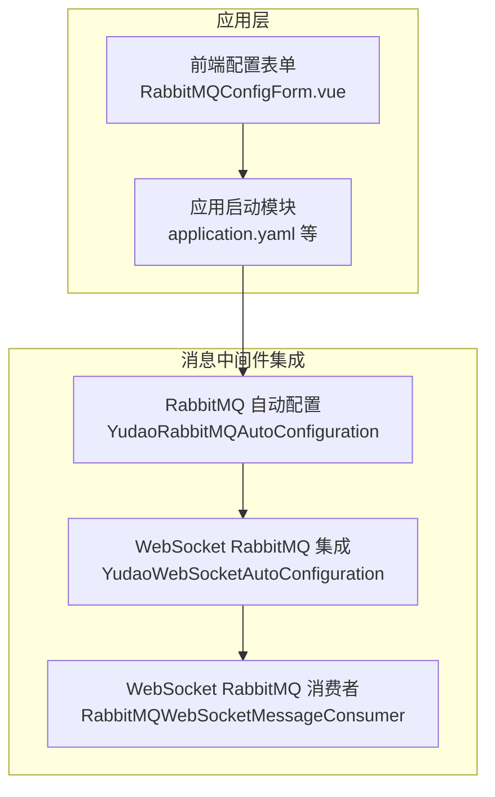
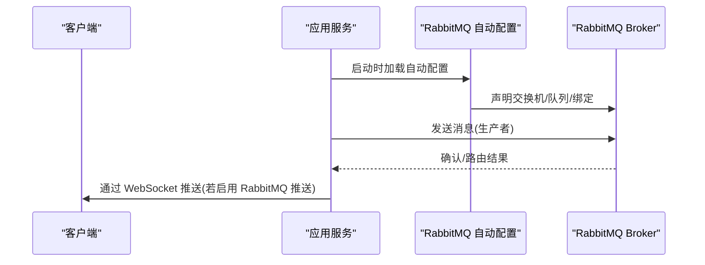
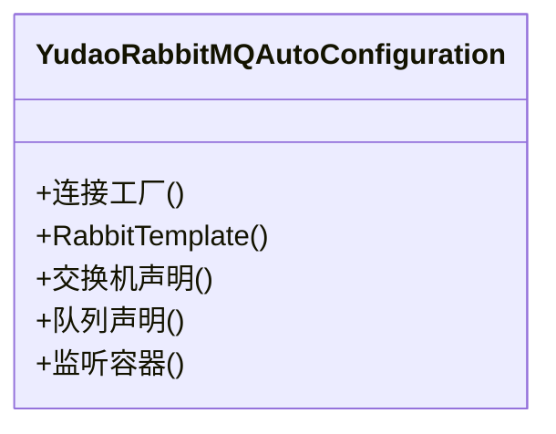
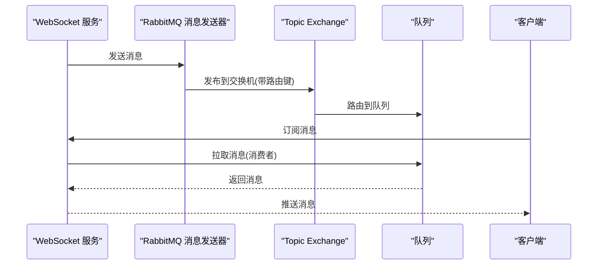
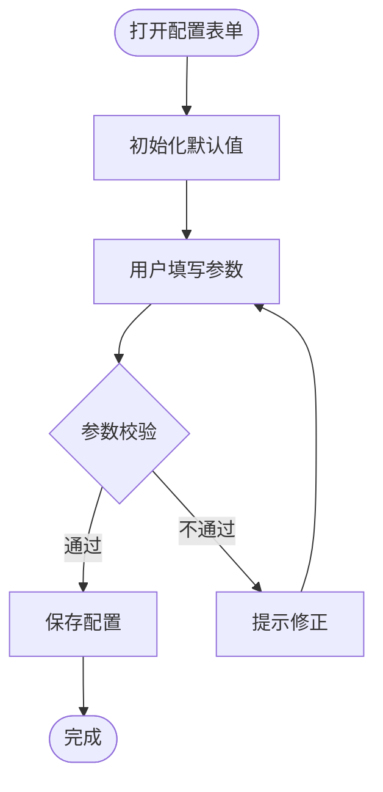
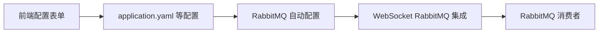

# RabbitMQ 集成

<cite>
**本文引用的文件**
- [YudaoRabbitMQAutoConfiguration.java](file://yudao-framework/yudao-spring-boot-starter-mq/src/main/java/cn/iocoder/yudao/framework/mq/rabbitmq/config/YudaoRabbitMQAutoConfiguration.java)
- [YudaoWebSocketAutoConfiguration.java](file://yudao-framework/yudao-spring-boot-starter-websocket/src/main/java/cn/iocoder/yudao/framework/websocket/config/YudaoWebSocketAutoConfiguration.java)
- [RabbitMQWebSocketMessageConsumer.java](file://yudao-framework/yudao-spring-boot-starter-websocket/src/main/java/cn/iocoder/yudao/framework/websocket/core/sender/rabbitmq/RabbitMQWebSocketMessageConsumer.java)
- [application.yaml](file://yudao-server/src/main/resources/application.yaml)
- [application-dev.yaml](file://yudao-server/src/main/resources/application-dev.yaml)
- [application-local.yaml](file://yudao-server/src/main/resources/application-local.yaml)
- [RabbitMQConfigForm.vue](file://yudao-ui/yudao-ui-admin-vue3/src/views/iot/rule/data/sink/config/RabbitMQConfigForm.vue)
- [《芋道 Spring Boot 消息队列 RabbitMQ 入门》.md](file://yudao-framework/yudao-spring-boot-starter-mq/《芋道 Spring Boot 消息队列 RabbitMQ 入门》.md)
</cite>

## 目录
1. [简介](#简介)
2. [项目结构](#项目结构)
3. [核心组件](#核心组件)
4. [架构总览](#架构总览)
5. [详细组件分析](#详细组件分析)
6. [依赖关系分析](#依赖关系分析)
7. [性能与可靠性](#性能与可靠性)
8. [监控与调试](#监控与调试)
9. [故障排查指南](#故障排查指南)
10. [结论](#结论)
11. [附录](#附录)

## 简介
本文件系统性梳理项目中基于 RabbitMQ 的集成方案，覆盖自动配置、连接工厂与交换机/队列声明、消息生产与消费、高级特性（确认、持久化、路由键、死信交换机）、可靠性保障（手动确认与重试）、监控与调试方法以及配置示例与使用场景。重点围绕 WebSocket 与物联网规则引擎两类业务场景展开。

## 项目结构
项目采用多模块结构，RabbitMQ 相关能力主要分布在以下模块：
- yudao-spring-boot-starter-mq：提供 RabbitMQ 自动配置与通用能力入口
- yudao-spring-boot-starter-websocket：在 WebSocket 场景下集成 RabbitMQ 发送/接收
- yudao-server：应用启动模块，提供环境化配置
- yudao-ui-admin-vue3：前端配置表单，支持 IoT 规则引擎数据下沉到 RabbitMQ

图表来源
- [YudaoRabbitMQAutoConfiguration.java](file://yudao-framework/yudao-spring-boot-starter-mq/src/main/java/cn/iocoder/yudao/framework/mq/rabbitmq/config/YudaoRabbitMQAutoConfiguration.java)
- [YudaoWebSocketAutoConfiguration.java](file://yudao-framework/yudao-spring-boot-starter-websocket/src/main/java/cn/iocoder/yudao/framework/websocket/config/YudaoWebSocketAutoConfiguration.java)
- [RabbitMQWebSocketMessageConsumer.java](file://yudao-framework/yudao-spring-boot-starter-websocket/src/main/java/cn/iocoder/yudao/framework/websocket/core/sender/rabbitmq/RabbitMQWebSocketMessageConsumer.java)

章节来源
- [YudaoRabbitMQAutoConfiguration.java](file://yudao-framework/yudao-spring-boot-starter-mq/src/main/java/cn/iocoder/yudao/framework/mq/rabbitmq/config/YudaoRabbitMQAutoConfiguration.java)
- [YudaoWebSocketAutoConfiguration.java](file://yudao-framework/yudao-spring-boot-starter-websocket/src/main/java/cn/iocoder/yudao/framework/websocket/config/YudaoWebSocketAutoConfiguration.java)
- [RabbitMQConfigForm.vue](file://yudao-ui/yudao-ui-admin-vue3/src/views/iot/rule/data/sink/config/RabbitMQConfigForm.vue)

## 核心组件
- RabbitMQ 自动配置类：负责连接工厂、模板、交换机与队列等基础设施的声明与装配
- WebSocket RabbitMQ 集成：在 WebSocket 消息推送场景下，通过 RabbitMQ 实现消息分发
- 前端配置表单：为 IoT 规则引擎的数据下沉提供 RabbitMQ 连接参数配置界面

章节来源
- [YudaoRabbitMQAutoConfiguration.java](file://yudao-framework/yudao-spring-boot-starter-mq/src/main/java/cn/iocoder/yudao/framework/mq/rabbitmq/config/YudaoRabbitMQAutoConfiguration.java)
- [YudaoWebSocketAutoConfiguration.java](file://yudao-framework/yudao-spring-boot-starter-websocket/src/main/java/cn/iocoder/yudao/framework/websocket/config/YudaoWebSocketAutoConfiguration.java)
- [RabbitMQConfigForm.vue](file://yudao-ui/yudao-ui-admin-vue3/src/views/iot/rule/data/sink/config/RabbitMQConfigForm.vue)

## 架构总览
RabbitMQ 在项目中的集成路径如下：
- 自动配置加载：通过自动配置类完成连接工厂、RabbitTemplate、交换机与队列的声明
- 业务接入：WebSocket 场景下，消息由服务端发送至 RabbitMQ；消费者从队列拉取消息并推送到客户端
- 前端配置：IoT 规则引擎数据下沉时，前端填写 RabbitMQ 连接信息，后端据此建立连接并投递消息

图表来源
- [YudaoRabbitMQAutoConfiguration.java](file://yudao-framework/yudao-spring-boot-starter-mq/src/main/java/cn/iocoder/yudao/framework/mq/rabbitmq/config/YudaoRabbitMQAutoConfiguration.java)
- [YudaoWebSocketAutoConfiguration.java](file://yudao-framework/yudao-spring-boot-starter-websocket/src/main/java/cn/iocoder/yudao/framework/websocket/config/YudaoWebSocketAutoConfiguration.java)

## 详细组件分析

### RabbitMQ 自动配置
- 职责：提供连接工厂、RabbitTemplate、交换机与队列的声明与装配
- 关键点：
  - 连接工厂：基于配置文件中的连接参数创建
  - RabbitTemplate：用于消息发送
  - 交换机与队列：按需声明，支持持久化与排他属性
  - 监听容器：可选的消费者容器配置（依据实际业务）

图表来源
- [YudaoRabbitMQAutoConfiguration.java](file://yudao-framework/yudao-spring-boot-starter-mq/src/main/java/cn/iocoder/yudao/framework/mq/rabbitmq/config/YudaoRabbitMQAutoConfiguration.java)

章节来源
- [YudaoRabbitMQAutoConfiguration.java](file://yudao-framework/yudao-spring-boot-starter-mq/src/main/java/cn/iocoder/yudao/framework/mq/rabbitmq/config/YudaoRabbitMQAutoConfiguration.java)

### WebSocket RabbitMQ 集成
- 职责：在 WebSocket 场景下，通过 RabbitMQ 实现消息的发布与订阅
- 关键点：
  - 条件装配：仅当配置项满足条件时才启用 RabbitMQ 推送
  - Topic Exchange：用于按路由键进行消息分发
  - 消费者：从队列拉取消息并推送到客户端会话

图表来源
- [YudaoWebSocketAutoConfiguration.java](file://yudao-framework/yudao-spring-boot-starter-websocket/src/main/java/cn/iocoder/yudao/framework/websocket/config/YudaoWebSocketAutoConfiguration.java)
- [RabbitMQWebSocketMessageConsumer.java](file://yudao-framework/yudao-spring-boot-starter-websocket/src/main/java/cn/iocoder/yudao/framework/websocket/core/sender/rabbitmq/RabbitMQWebSocketMessageConsumer.java)

章节来源
- [YudaoWebSocketAutoConfiguration.java](file://yudao-framework/yudao-spring-boot-starter-websocket/src/main/java/cn/iocoder/yudao/framework/websocket/config/YudaoWebSocketAutoConfiguration.java)
- [RabbitMQWebSocketMessageConsumer.java](file://yudao-framework/yudao-spring-boot-starter-websocket/src/main/java/cn/iocoder/yudao/framework/websocket/core/sender/rabbitmq/RabbitMQWebSocketMessageConsumer.java)

### 前端 RabbitMQ 配置表单
- 职责：为 IoT 规则引擎数据下沉提供 RabbitMQ 连接参数配置界面
- 字段：主机地址、端口、虚拟主机、用户名、密码、交换机、路由键、队列
- 默认值：端口默认 5672，虚拟主机默认 “/”

图表来源
- [RabbitMQConfigForm.vue](file://yudao-ui/yudao-ui-admin-vue3/src/views/iot/rule/data/sink/config/RabbitMQConfigForm.vue)

章节来源
- [RabbitMQConfigForm.vue](file://yudao-ui/yudao-ui-admin-vue3/src/views/iot/rule/data/sink/config/RabbitMQConfigForm.vue)

## 依赖关系分析
- 自动配置依赖于 Spring Boot Starter AMQP 与项目内配置
- WebSocket 集成依赖自动配置提供的 RabbitTemplate 与 Exchange
- 前端表单依赖后端接口生成的配置模型

图表来源
- [application.yaml](file://yudao-server/src/main/resources/application.yaml)
- [YudaoRabbitMQAutoConfiguration.java](file://yudao-framework/yudao-spring-boot-starter-mq/src/main/java/cn/iocoder/yudao/framework/mq/rabbitmq/config/YudaoRabbitMQAutoConfiguration.java)
- [YudaoWebSocketAutoConfiguration.java](file://yudao-framework/yudao-spring-boot-starter-websocket/src/main/java/cn/iocoder/yudao/framework/websocket/config/YudaoWebSocketAutoConfiguration.java)

章节来源
- [application.yaml](file://yudao-server/src/main/resources/application.yaml)
- [application-dev.yaml](file://yudao-server/src/main/resources/application-dev.yaml)
- [application-local.yaml](file://yudao-server/src/main/resources/application-local.yaml)

## 性能与可靠性
- 持久化与确认
  - 交换机与队列声明为持久化，确保重启后仍可用
  - 生产者侧建议开启发送方确认（publisher confirms），消费者侧开启手动确认（manual ack）
- 并发与资源
  - 合理设置并发消费者数量与预取计数，避免内存压力
  - 使用独立的交换机/队列命名空间区分不同业务域
- 死信与重试
  - 为关键队列配置死信交换机，异常消息进入死信队列以便人工介入
  - 实现指数退避重试策略，避免雪崩效应
- 监控指标
  - 关注未确认消息数、死信队列积压、消费者处理耗时与失败率

[本节为通用指导，无需列出具体文件来源]

## 监控与调试
- 管理界面
  - 使用 RabbitMQ 管理插件提供的 Web 控制台查看连接、交换机、队列、消费者与消息统计
- 日志与追踪
  - 开启 AMQP 客户端日志，定位网络与协议层面问题
  - 结合链路追踪系统，定位消息流转路径
- 性能观测
  - 关注队列长度、消息入出速率、消费者确认延迟、死信积压等指标

[本节为通用指导，无需列出具体文件来源]

## 故障排查指南
- 连接失败
  - 检查主机、端口、虚拟主机、用户名与密码是否正确
  - 确认防火墙与网络连通性
- 无法收发消息
  - 核对交换机与队列名称、路由键是否匹配
  - 查看绑定关系与权限配置
- 消息堆积
  - 提升消费者并发或优化处理逻辑
  - 检查死信队列是否积压
- 可靠性问题
  - 确认已启用发送方确认与手动确认
  - 检查重试与死信策略是否生效

[本节为通用指导，无需列出具体文件来源]

## 结论
项目通过自动配置与条件装配，将 RabbitMQ 无缝集成到 WebSocket 与 IoT 规则引擎等场景。结合持久化、确认与死信策略，可有效提升消息可靠性；配合管理界面与日志追踪，便于日常运维与性能优化。

[本节为总结性内容，无需列出具体文件来源]

## 附录

### 配置示例与使用场景
- WebSocket 场景
  - 启用条件：根据配置项决定是否启用 RabbitMQ 推送
  - 交换机：Topic 类型，持久化
  - 队列：按路由键绑定，支持消费者并发
- IoT 规则引擎数据下沉
  - 前端表单提供连接参数输入，后端据此建立连接并投递消息
  - 交换机、路由键与队列由前端配置决定

章节来源
- [YudaoWebSocketAutoConfiguration.java](file://yudao-framework/yudao-spring-boot-starter-websocket/src/main/java/cn/iocoder/yudao/framework/websocket/config/YudaoWebSocketAutoConfiguration.java)
- [RabbitMQConfigForm.vue](file://yudao-ui/yudao-ui-admin-vue3/src/views/iot/rule/data/sink/config/RabbitMQConfigForm.vue)
- [《芋道 Spring Boot 消息队列 RabbitMQ 入门》.md](file://yudao-framework/yudao-spring-boot-starter-mq/《芋道 Spring Boot 消息队列 RabbitMQ 入门》.md)