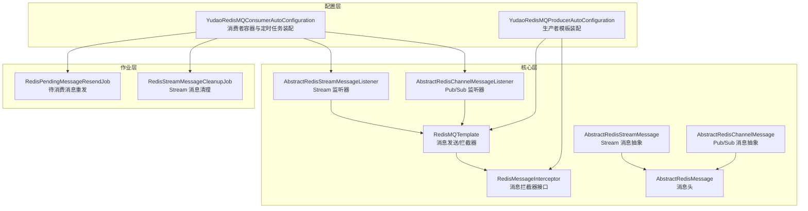
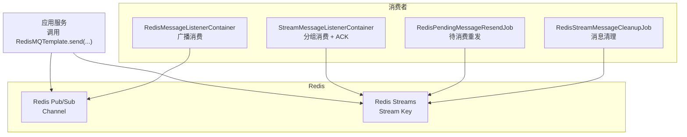
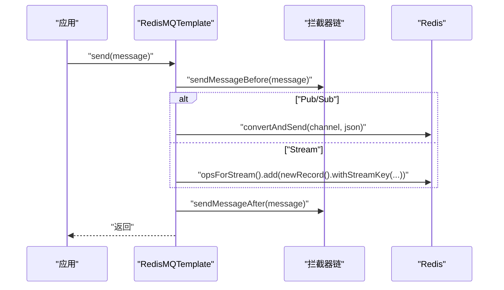
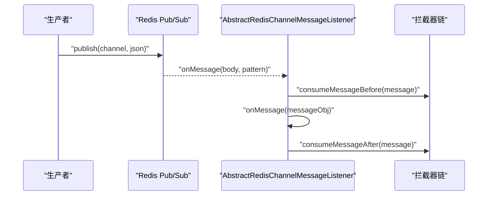
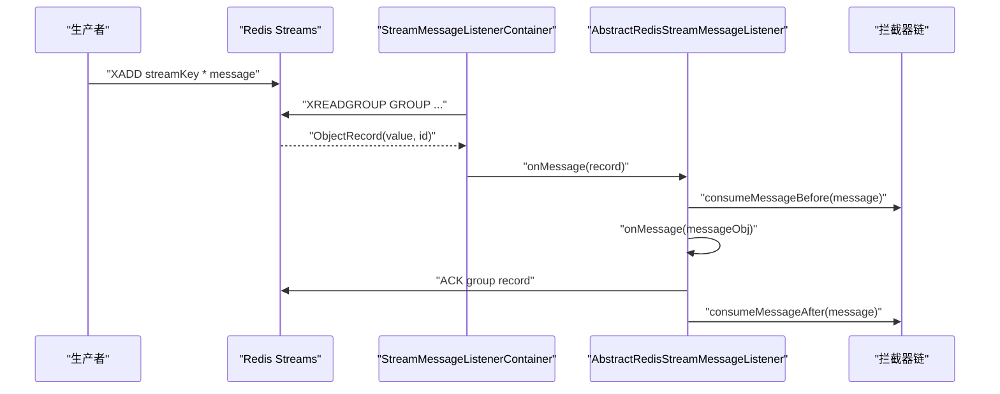
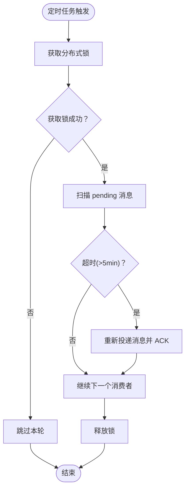
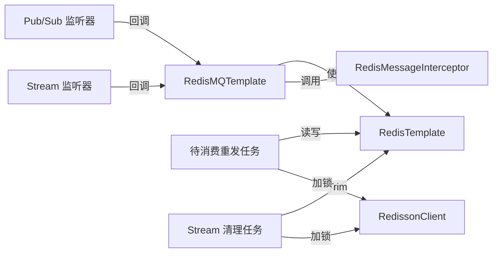

# Redis 消息队列

<cite>
**本文引用的文件**
- [RedisMQTemplate.java](file://yudao-framework/yudao-spring-boot-starter-mq/src/main/java/cn/iocoder/yudao/framework/mq/redis/core/RedisMQTemplate.java)
- [AbstractRedisMessage.java](file://yudao-framework/yudao-spring-boot-starter-mq/src/main/java/cn/iocoder/yudao/framework/mq/redis/core/message/AbstractRedisMessage.java)
- [AbstractRedisChannelMessage.java](file://yudao-framework/yudao-spring-boot-starter-mq/src/main/java/cn/iocoder/yudao/framework/mq/redis/core/pubsub/AbstractRedisChannelMessage.java)
- [AbstractRedisChannelMessageListener.java](file://yudao-framework/yudao-spring-boot-starter-mq/src/main/java/cn/iocoder/yudao/framework/mq/redis/core/pubsub/AbstractRedisChannelMessageListener.java)
- [AbstractRedisStreamMessage.java](file://yudao-framework/yudao-spring-boot-starter-mq/src/main/java/cn/iocoder/yudao/framework/mq/redis/core/stream/AbstractRedisStreamMessage.java)
- [AbstractRedisStreamMessageListener.java](file://yudao-framework/yudao-spring-boot-starter-mq/src/main/java/cn/iocoder/yudao/framework/mq/redis/core/stream/AbstractRedisStreamMessageListener.java)
- [YudaoRedisMQProducerAutoConfiguration.java](file://yudao-framework/yudao-spring-boot-starter-mq/src/main/java/cn/iocoder/yudao/framework/mq/redis/config/YudaoRedisMQProducerAutoConfiguration.java)
- [YudaoRedisMQConsumerAutoConfiguration.java](file://yudao-framework/yudao-spring-boot-starter-mq/src/main/java/cn/iocoder/yudao/framework/mq/redis/config/YudaoRedisMQConsumerAutoConfiguration.java)
- [RedisMessageInterceptor.java](file://yudao-framework/yudao-spring-boot-starter-mq/src/main/java/cn/iocoder/yudao/framework/mq/redis/core/interceptor/RedisMessageInterceptor.java)
- [RedisPendingMessageResendJob.java](file://yudao-framework/yudao-spring-boot-starter-mq/src/main/java/cn/iocoder/yudao/framework/mq/redis/core/job/RedisPendingMessageResendJob.java)
- [RedisStreamMessageCleanupJob.java](file://yudao-framework/yudao-spring-boot-starter-mq/src/main/java/cn/iocoder/yudao/framework/mq/redis/core/job/RedisStreamMessageCleanupJob.java)
</cite>

## 目录
1. [简介](#简介)
2. [项目结构](#项目结构)
3. [核心组件](#核心组件)
4. [架构总览](#架构总览)
5. [组件详解](#组件详解)
6. [依赖关系分析](#依赖关系分析)
7. [性能优化建议](#性能优化建议)
8. [故障排查指南](#故障排查指南)
9. [结论](#结论)
10. [附录](#附录)

## 简介
本文件系统性阐述基于 Redis 的消息队列实现，覆盖 Redis Pub/Sub 与 Redis Stream 两种模式的实现原理、使用场景与最佳实践；详述 RedisMQTemplate 的消息发送、接收与监听器配置方式；解释可靠性保障机制（ACK、重试、清理与幂等扩展点）；对比 RedisStreamMessage 与 RedisChannelMessage 的差异与适用场景；并给出连接池、批量处理与内存管理等性能优化建议。

## 项目结构
Redis 消息队列模块位于 yudao-spring-boot-starter-mq 中，采用“按功能域分层”的组织方式：
- config：自动装配与容器配置（生产者模板、消费者容器、定时任务）
- core：核心 API 与抽象模型（消息、监听器、拦截器、模板）
- core.job：可靠性保障相关的定时任务（待消费消息重发、Stream 消息清理）

图表来源
- [YudaoRedisMQProducerAutoConfiguration.java:1-32](file://yudao-framework/yudao-spring-boot-starter-mq/src/main/java/cn/iocoder/yudao/framework/mq/redis/config/YudaoRedisMQProducerAutoConfiguration.java#L1-L32)
- [YudaoRedisMQConsumerAutoConfiguration.java:1-164](file://yudao-framework/yudao-spring-boot-starter-mq/src/main/java/cn/iocoder/yudao/framework/mq/redis/config/YudaoRedisMQConsumerAutoConfiguration.java#L1-L164)
- [RedisMQTemplate.java:1-88](file://yudao-framework/yudao-spring-boot-starter-mq/src/main/java/cn/iocoder/yudao/framework/mq/redis/core/RedisMQTemplate.java#L1-L88)
- [RedisMessageInterceptor.java:1-27](file://yudao-framework/yudao-spring-boot-starter-mq/src/main/java/cn/iocoder/yudao/framework/mq/redis/core/interceptor/RedisMessageInterceptor.java#L1-L27)
- [AbstractRedisMessage.java:1-30](file://yudao-framework/yudao-spring-boot-starter-mq/src/main/java/cn/iocoder/yudao/framework/mq/redis/core/message/AbstractRedisMessage.java#L1-L30)
- [AbstractRedisChannelMessage.java:1-24](file://yudao-framework/yudao-spring-boot-starter-mq/src/main/java/cn/iocoder/yudao/framework/mq/redis/core/pubsub/AbstractRedisChannelMessage.java#L1-L24)
- [AbstractRedisChannelMessageListener.java:1-104](file://yudao-framework/yudao-spring-boot-starter-mq/src/main/java/cn/iocoder/yudao/framework/mq/redis/core/pubsub/AbstractRedisChannelMessageListener.java#L1-L104)
- [AbstractRedisStreamMessage.java:1-24](file://yudao-framework/yudao-spring-boot-starter-mq/src/main/java/cn/iocoder/yudao/framework/mq/redis/core/stream/AbstractRedisStreamMessage.java#L1-L24)
- [AbstractRedisStreamMessageListener.java:1-120](file://yudao-framework/yudao-spring-boot-starter-mq/src/main/java/cn/iocoder/yudao/framework/mq/redis/core/stream/AbstractRedisStreamMessageListener.java#L1-L120)
- [RedisPendingMessageResendJob.java:1-106](file://yudao-framework/yudao-spring-boot-starter-mq/src/main/java/cn/iocoder/yudao/framework/mq/redis/core/job/RedisPendingMessageResendJob.java#L1-L106)
- [RedisStreamMessageCleanupJob.java:1-88](file://yudao-framework/yudao-spring-boot-starter-mq/src/main/java/cn/iocoder/yudao/framework/mq/redis/core/job/RedisStreamMessageCleanupJob.java#L1-L88)

章节来源
- [YudaoRedisMQProducerAutoConfiguration.java:1-32](file://yudao-framework/yudao-spring-boot-starter-mq/src/main/java/cn/iocoder/yudao/framework/mq/redis/config/YudaoRedisMQProducerAutoConfiguration.java#L1-L32)
- [YudaoRedisMQConsumerAutoConfiguration.java:1-164](file://yudao-framework/yudao-spring-boot-starter-mq/src/main/java/cn/iocoder/yudao/framework/mq/redis/config/YudaoRedisMQConsumerAutoConfiguration.java#L1-L164)

## 核心组件
- RedisMQTemplate：统一的消息发送入口，支持 Pub/Sub 与 Stream 两种模式；内置拦截器链，贯穿发送前后与消费前后。
- 消息抽象：AbstractRedisMessage 提供消息头；Pub/Sub 与 Stream 各自定义消息抽象，分别决定 Channel 与 Stream Key。
- 监听器抽象：AbstractRedisChannelMessageListener 与 AbstractRedisStreamMessageListener 分别负责 Pub/Sub 广播消费与 Stream 集群消费。
- 自动装配：生产者与消费者自动配置类负责模板、容器与定时任务的装配。
- 可靠性作业：待消费消息重发与 Stream 消息清理定时任务。

章节来源
- [RedisMQTemplate.java:1-88](file://yudao-framework/yudao-spring-boot-starter-mq/src/main/java/cn/iocoder/yudao/framework/mq/redis/core/RedisMQTemplate.java#L1-L88)
- [AbstractRedisMessage.java:1-30](file://yudao-framework/yudao-spring-boot-starter-mq/src/main/java/cn/iocoder/yudao/framework/mq/redis/core/message/AbstractRedisMessage.java#L1-L30)
- [AbstractRedisChannelMessage.java:1-24](file://yudao-framework/yudao-spring-boot-starter-mq/src/main/java/cn/iocoder/yudao/framework/mq/redis/core/pubsub/AbstractRedisChannelMessage.java#L1-L24)
- [AbstractRedisStreamMessage.java:1-24](file://yudao-framework/yudao-spring-boot-starter-mq/src/main/java/cn/iocoder/yudao/framework/mq/redis/core/stream/AbstractRedisStreamMessage.java#L1-L24)
- [AbstractRedisChannelMessageListener.java:1-104](file://yudao-framework/yudao-spring-boot-starter-mq/src/main/java/cn/iocoder/yudao/framework/mq/redis/core/pubsub/AbstractRedisChannelMessageListener.java#L1-L104)
- [AbstractRedisStreamMessageListener.java:1-120](file://yudao-framework/yudao-spring-boot-starter-mq/src/main/java/cn/iocoder/yudao/framework/mq/redis/core/stream/AbstractRedisStreamMessageListener.java#L1-L120)
- [YudaoRedisMQProducerAutoConfiguration.java:1-32](file://yudao-framework/yudao-spring-boot-starter-mq/src/main/java/cn/iocoder/yudao/framework/mq/redis/config/YudaoRedisMQProducerAutoConfiguration.java#L1-L32)
- [YudaoRedisMQConsumerAutoConfiguration.java:1-164](file://yudao-framework/yudao-spring-boot-starter-mq/src/main/java/cn/iocoder/yudao/framework/mq/redis/config/YudaoRedisMQConsumerAutoConfiguration.java#L1-L164)
- [RedisMessageInterceptor.java:1-27](file://yudao-framework/yudao-spring-boot-starter-mq/src/main/java/cn/iocoder/yudao/framework/mq/redis/core/interceptor/RedisMessageInterceptor.java#L1-L27)
- [RedisPendingMessageResendJob.java:1-106](file://yudao-framework/yudao-spring-boot-starter-mq/src/main/java/cn/iocoder/yudao/framework/mq/redis/core/job/RedisPendingMessageResendJob.java#L1-L106)
- [RedisStreamMessageCleanupJob.java:1-88](file://yudao-framework/yudao-spring-boot-starter-mq/src/main/java/cn/iocoder/yudao/framework/mq/redis/core/job/RedisStreamMessageCleanupJob.java#L1-L88)

## 架构总览
Redis 消息队列采用“模板 + 监听器 + 自动装配 + 定时任务”的架构：
- 生产者：通过 RedisMQTemplate 发送消息，支持 Pub/Sub 与 Stream；可插入拦截器扩展（如多租户上下文透传）。
- 消费者：Pub/Sub 使用 RedisMessageListenerContainer；Stream 使用 StreamMessageListenerContainer，支持消费者分组与 ACK。
- 可靠性：RedisPendingMessageResendJob 扫描超时未消费消息并重发；RedisStreamMessageCleanupJob 周期性 Trim Stream，控制内存增长。
- 版本要求：Stream 模式需 Redis 5.0+。

图表来源
- [YudaoRedisMQConsumerAutoConfiguration.java:46-136](file://yudao-framework/yudao-spring-boot-starter-mq/src/main/java/cn/iocoder/yudao/framework/mq/redis/config/YudaoRedisMQConsumerAutoConfiguration.java#L46-L136)
- [RedisPendingMessageResendJob.java:46-104](file://yudao-framework/yudao-spring-boot-starter-mq/src/main/java/cn/iocoder/yudao/framework/mq/redis/core/job/RedisPendingMessageResendJob.java#L46-L104)
- [RedisStreamMessageCleanupJob.java:53-87](file://yudao-framework/yudao-spring-boot-starter-mq/src/main/java/cn/iocoder/yudao/framework/mq/redis/core/job/RedisStreamMessageCleanupJob.java#L53-L87)

## 组件详解

### RedisMQTemplate：消息发送与拦截器
- Pub/Sub 发送：send(AbstractRedisChannelMessage) 将消息序列化后通过频道发布。
- Stream 发送：send(AbstractRedisStreamMessage) 将消息序列化后写入对应 Stream Key。
- 拦截器：sendMessageBefore/After 与消费前后的拦截器链顺序执行，便于扩展。

图表来源
- [RedisMQTemplate.java:33-64](file://yudao-framework/yudao-spring-boot-starter-mq/src/main/java/cn/iocoder/yudao/framework/mq/redis/core/RedisMQTemplate.java#L33-L64)
- [RedisMessageInterceptor.java:12-26](file://yudao-framework/yudao-spring-boot-starter-mq/src/main/java/cn/iocoder/yudao/framework/mq/redis/core/interceptor/RedisMessageInterceptor.java#L12-L26)

章节来源
- [RedisMQTemplate.java:1-88](file://yudao-framework/yudao-spring-boot-starter-mq/src/main/java/cn/iocoder/yudao/framework/mq/redis/core/RedisMQTemplate.java#L1-L88)
- [RedisMessageInterceptor.java:1-27](file://yudao-framework/yudao-spring-boot-starter-mq/src/main/java/cn/iocoder/yudao/framework/mq/redis/core/interceptor/RedisMessageInterceptor.java#L1-L27)

### Pub/Sub 模式：广播消费
- 消息抽象：AbstractRedisChannelMessage 提供默认频道名（类名）。
- 监听器：AbstractRedisChannelMessageListener 实现 Spring 的 MessageListener，自动解析 JSON 为具体消息类型。
- 容器：YudaoRedisMQConsumerAutoConfiguration 注册 RedisMessageListenerContainer，订阅 ChannelTopic。

图表来源
- [AbstractRedisChannelMessageListener.java:54-64](file://yudao-framework/yudao-spring-boot-starter-mq/src/main/java/cn/iocoder/yudao/framework/mq/redis/core/pubsub/AbstractRedisChannelMessageListener.java#L54-L64)
- [YudaoRedisMQConsumerAutoConfiguration.java:48-62](file://yudao-framework/yudao-spring-boot-starter-mq/src/main/java/cn/iocoder/yudao/framework/mq/redis/config/YudaoRedisMQConsumerAutoConfiguration.java#L48-L62)

章节来源
- [AbstractRedisChannelMessage.java:1-24](file://yudao-framework/yudao-spring-boot-starter-mq/src/main/java/cn/iocoder/yudao/framework/mq/redis/core/pubsub/AbstractRedisChannelMessage.java#L1-L24)
- [AbstractRedisChannelMessageListener.java:1-104](file://yudao-framework/yudao-spring-boot-starter-mq/src/main/java/cn/iocoder/yudao/framework/mq/redis/core/pubsub/AbstractRedisChannelMessageListener.java#L1-L104)
- [YudaoRedisMQConsumerAutoConfiguration.java:46-62](file://yudao-framework/yudao-spring-boot-starter-mq/src/main/java/cn/iocoder/yudao/framework/mq/redis/config/YudaoRedisMQConsumerAutoConfiguration.java#L46-L62)

### Stream 模式：集群消费与 ACK
- 消息抽象：AbstractRedisStreamMessage 提供默认 Stream Key（类名）。
- 监听器：AbstractRedisStreamMessageListener 实现 StreamListener，消费后手动 ACK。
- 容器：StreamMessageListenerContainer，自动创建消费者分组，支持批量拉取与取消自动 ACK。
- 版本校验：自动检查 Redis 版本是否满足 5.0+。

图表来源
- [AbstractRedisStreamMessageListener.java:62-80](file://yudao-framework/yudao-spring-boot-starter-mq/src/main/java/cn/iocoder/yudao/framework/mq/redis/core/stream/AbstractRedisStreamMessageListener.java#L62-L80)
- [YudaoRedisMQConsumerAutoConfiguration.java:93-136](file://yudao-framework/yudao-spring-boot-starter-mq/src/main/java/cn/iocoder/yudao/framework/mq/redis/config/YudaoRedisMQConsumerAutoConfiguration.java#L93-L136)

章节来源
- [AbstractRedisStreamMessage.java:1-24](file://yudao-framework/yudao-spring-boot-starter-mq/src/main/java/cn/iocoder/yudao/framework/mq/redis/core/stream/AbstractRedisStreamMessage.java#L1-L24)
- [AbstractRedisStreamMessageListener.java:1-120](file://yudao-framework/yudao-spring-boot-starter-mq/src/main/java/cn/iocoder/yudao/framework/mq/redis/core/stream/AbstractRedisStreamMessageListener.java#L1-L120)
- [YudaoRedisMQConsumerAutoConfiguration.java:93-136](file://yudao-framework/yudao-spring-boot-starter-mq/src/main/java/cn/iocoder/yudao/framework/mq/redis/config/YudaoRedisMQConsumerAutoConfiguration.java#L93-L136)

### 可靠性保障机制
- 待消费消息重发：RedisPendingMessageResendJob 每分钟扫描 pending 队列中超过阈值（默认 5 分钟）未消费的消息，重新投递并 ACK，缓解崩溃或长时间处理导致的消息堆积。
- Stream 消息清理：RedisStreamMessageCleanupJob 每小时对每个 Stream 执行精确 Trim，保留最近 N 条（默认 10000），防止内存无限增长。
- ACK 与异常处理：Stream 监听器在消费成功后 ACK；异常路径由拦截器与上层捕获处理，建议结合幂等与日志完善。

图表来源
- [RedisPendingMessageResendJob.java:46-104](file://yudao-framework/yudao-spring-boot-starter-mq/src/main/java/cn/iocoder/yudao/framework/mq/redis/core/job/RedisPendingMessageResendJob.java#L46-L104)

章节来源
- [RedisPendingMessageResendJob.java:1-106](file://yudao-framework/yudao-spring-boot-starter-mq/src/main/java/cn/iocoder/yudao/framework/mq/redis/core/job/RedisPendingMessageResendJob.java#L1-L106)
- [RedisStreamMessageCleanupJob.java:1-88](file://yudao-framework/yudao-spring-boot-starter-mq/src/main/java/cn/iocoder/yudao/framework/mq/redis/core/job/RedisStreamMessageCleanupJob.java#L1-L88)

### RedisStreamMessage 与 RedisChannelMessage 的区别与适用场景
- 消息键来源：
  - Channel 消息：通过类名作为频道名，适合广播式通知。
  - Stream 消息：通过类名作为 Stream Key，适合持久化、分组消费、ACK 控制。
- 场景选择：
  - Pub/Sub：事件通知、轻量广播、低延迟场景。
  - Stream：可靠投递、重试、回放、水平扩展分组消费。
- 序列化：
  - 两者均使用 JSON 序列化，注意字段兼容与版本演进。

章节来源
- [AbstractRedisChannelMessage.java:13-21](file://yudao-framework/yudao-spring-boot-starter-mq/src/main/java/cn/iocoder/yudao/framework/mq/redis/core/pubsub/AbstractRedisChannelMessage.java#L13-L21)
- [AbstractRedisStreamMessage.java:13-21](file://yudao-framework/yudao-spring-boot-starter-mq/src/main/java/cn/iocoder/yudao/framework/mq/redis/core/stream/AbstractRedisStreamMessage.java#L13-L21)

### 监听器配置与使用要点
- Pub/Sub 监听器：实现 AbstractRedisChannelMessageListener 并声明泛型消息类型，自动注入 Channel 与监听容器。
- Stream 监听器：实现 AbstractRedisStreamMessageListener，自动创建消费者分组与监听；注意 ACK 与异常处理。
- 拦截器：通过 RedisMessageInterceptor 在发送/消费前后插入横切逻辑（如上下文透传、日志、限流）。

章节来源
- [AbstractRedisChannelMessageListener.java:23-43](file://yudao-framework/yudao-spring-boot-starter-mq/src/main/java/cn/iocoder/yudao/framework/mq/redis/core/pubsub/AbstractRedisChannelMessageListener.java#L23-L43)
- [AbstractRedisStreamMessageListener.java:25-60](file://yudao-framework/yudao-spring-boot-starter-mq/src/main/java/cn/iocoder/yudao/framework/mq/redis/core/stream/AbstractRedisStreamMessageListener.java#L25-L60)
- [RedisMessageInterceptor.java:12-26](file://yudao-framework/yudao-spring-boot-starter-mq/src/main/java/cn/iocoder/yudao/framework/mq/redis/core/interceptor/RedisMessageInterceptor.java#L12-L26)

## 依赖关系分析
- 组件耦合：
  - RedisMQTemplate 依赖 RedisTemplate 与拦截器列表，低耦合高扩展。
  - 监听器依赖模板与 Redis 容器，通过自动配置注入。
- 外部依赖：
  - Spring Data Redis：Pub/Sub 与 Stream 容器、操作 API。
  - Redisson：分布式锁，保障定时任务互斥执行。
  - Hutool：类型推断、系统信息采集。

图表来源
- [RedisMQTemplate.java:22-31](file://yudao-framework/yudao-spring-boot-starter-mq/src/main/java/cn/iocoder/yudao/framework/mq/redis/core/RedisMQTemplate.java#L22-L31)
- [YudaoRedisMQConsumerAutoConfiguration.java:48-136](file://yudao-framework/yudao-spring-boot-starter-mq/src/main/java/cn/iocoder/yudao/framework/mq/redis/config/YudaoRedisMQConsumerAutoConfiguration.java#L48-L136)
- [RedisPendingMessageResendJob.java:38-41](file://yudao-framework/yudao-spring-boot-starter-mq/src/main/java/cn/iocoder/yudao/framework/mq/redis/core/job/RedisPendingMessageResendJob.java#L38-L41)
- [RedisStreamMessageCleanupJob.java:42-48](file://yudao-framework/yudao-spring-boot-starter-mq/src/main/java/cn/iocoder/yudao/framework/mq/redis/core/job/RedisStreamMessageCleanupJob.java#L42-L48)

章节来源
- [YudaoRedisMQConsumerAutoConfiguration.java:1-164](file://yudao-framework/yudao-spring-boot-starter-mq/src/main/java/cn/iocoder/yudao/framework/mq/redis/config/YudaoRedisMQConsumerAutoConfiguration.java#L1-L164)
- [RedisPendingMessageResendJob.java:1-106](file://yudao-framework/yudao-spring-boot-starter-mq/src/main/java/cn/iocoder/yudao/framework/mq/redis/core/job/RedisPendingMessageResendJob.java#L1-L106)
- [RedisStreamMessageCleanupJob.java:1-88](file://yudao-framework/yudao-spring-boot-starter-mq/src/main/java/cn/iocoder/yudao/framework/mq/redis/core/job/RedisStreamMessageCleanupJob.java#L1-L88)

## 性能优化建议
- 连接池与客户端
  - 使用 StringRedisTemplate 与合适的连接池参数（最大连接数、空闲连接、超时），避免阻塞。
  - Stream 模式启用批量拉取（容器选项已设置批量大小），减少网络往返。
- 消息序列化
  - 统一使用 JSON；确保消息体字段稳定，避免大字段频繁变更导致序列化开销增大。
- 消费端
  - Pub/Sub：广播消费适合低延迟通知，避免在监听器中做耗时操作；必要时异步化。
  - Stream：合理设置消费者分组与并发消费者，避免单消费者成为瓶颈；ACK 与异常处理要完善。
- 内存管理
  - 定期清理：利用 RedisStreamMessageCleanupJob 限制保留条数，防止内存膨胀。
  - 待消费重发：合理设置超时阈值，避免大量重复投递造成压力。
- 幂等与日志
  - 结合业务 ID 做幂等判断；在拦截器中记录发送/消费日志，便于排障。

## 故障排查指南
- 版本不满足
  - 现象：启动时报 Redis 版本过低。
  - 处理：升级 Redis 至 5.0+。
- 容器未注册
  - 现象：监听器未生效。
  - 处理：确认存在对应抽象监听器 Bean，且自动配置已启用。
- ACK 未生效
  - 现象：消息重复消费或 pending 堆积。
  - 处理：确保监听器在消费成功后执行 ACK；异常时不要 ACK。
- 定时任务未执行
  - 现象：待消费重发/清理未生效。
  - 处理：检查 Redisson 锁可用性与权限；确认调度注解启用。
- 消息丢失或重复
  - 现象：业务异常或重试导致重复。
  - 处理：引入幂等与去重策略；必要时使用死信队列（扩展思路见下一节）。

章节来源
- [YudaoRedisMQConsumerAutoConfiguration.java:151-161](file://yudao-framework/yudao-spring-boot-starter-mq/src/main/java/cn/iocoder/yudao/framework/mq/redis/config/YudaoRedisMQConsumerAutoConfiguration.java#L151-L161)
- [AbstractRedisStreamMessageListener.java:70-76](file://yudao-framework/yudao-spring-boot-starter-mq/src/main/java/cn/iocoder/yudao/framework/mq/redis/core/stream/AbstractRedisStreamMessageListener.java#L70-L76)
- [RedisPendingMessageResendJob.java:46-62](file://yudao-framework/yudao-spring-boot-starter-mq/src/main/java/cn/iocoder/yudao/framework/mq/redis/core/job/RedisPendingMessageResendJob.java#L46-L62)
- [RedisStreamMessageCleanupJob.java:53-69](file://yudao-framework/yudao-spring-boot-starter-mq/src/main/java/cn/iocoder/yudao/framework/mq/redis/core/job/RedisStreamMessageCleanupJob.java#L53-L69)

## 结论
该 Redis 消息队列实现提供了简洁一致的 API 与完善的自动装配能力，既支持 Pub/Sub 的广播通知，也支持 Stream 的可靠分组消费与 ACK。通过拦截器扩展、定时任务与版本校验，形成从发送、消费到可靠性的完整闭环。建议在生产环境结合幂等、日志与资源监控，持续优化性能与稳定性。

## 附录
- 最佳实践清单
  - 明确消息模式：广播通知用 Pub/Sub，可靠投递用 Stream。
  - 合理设计消息键：Channel/Stream Key 与业务域解耦，避免冲突。
  - 使用拦截器：在发送/消费前后注入上下文与可观测性。
  - 关注 ACK 与异常：确保消费成功后 ACK，异常时不 ACK。
  - 启用清理与重发：配合定时任务控制内存与恢复待消费消息。
  - 幂等与去重：结合业务主键与去重表，避免重复处理。
  - 版本与容量：保持 Redis 5.0+，合理设置保留条数与批大小。