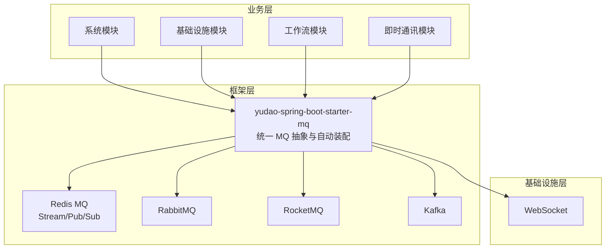
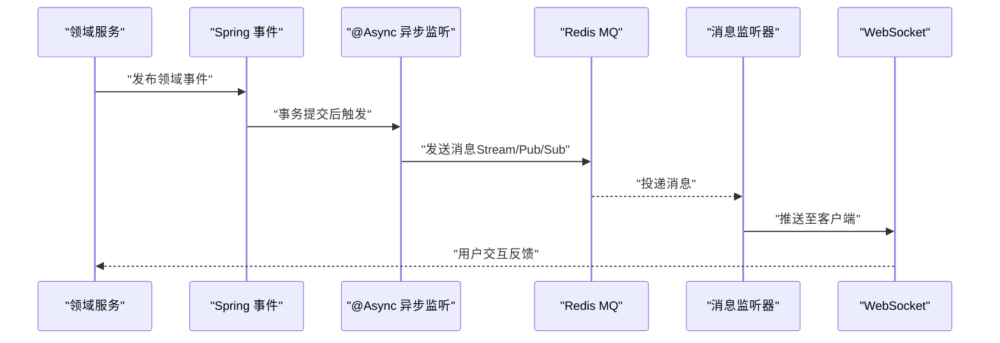
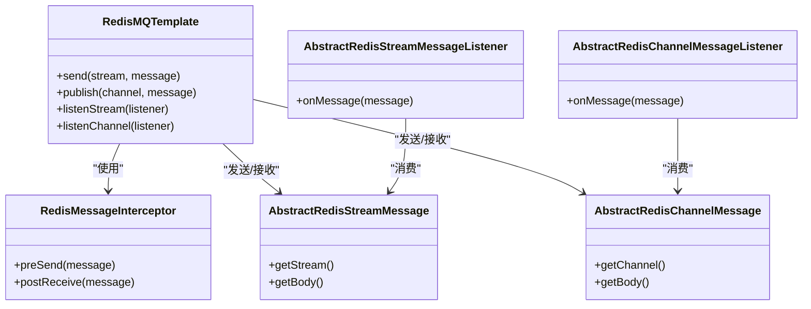
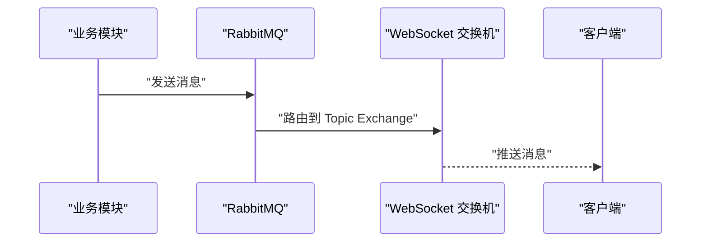
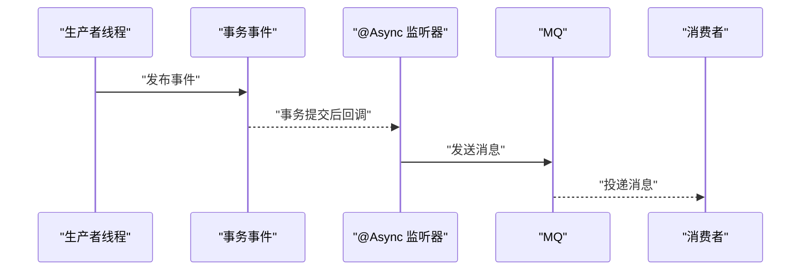
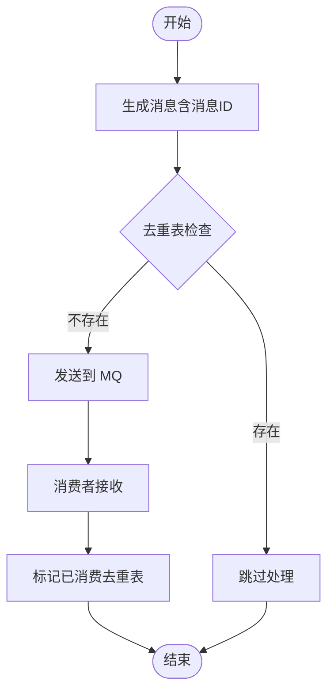
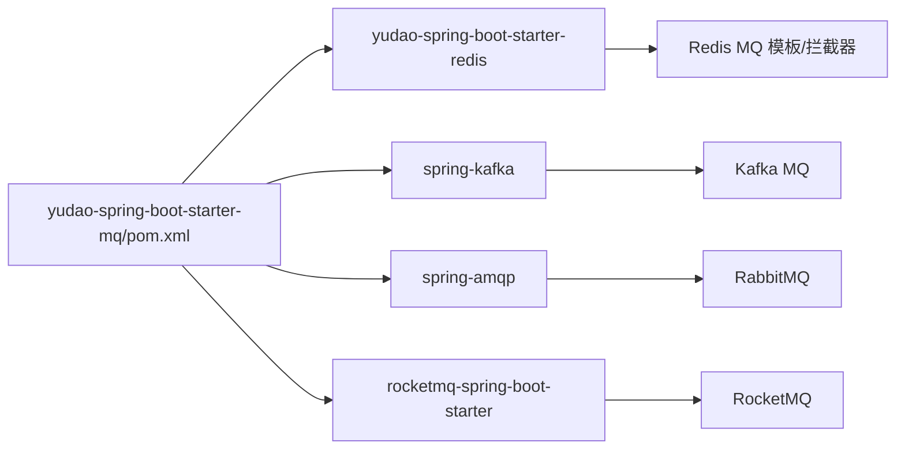

# 异步处理模式

<cite>
**本文引用的文件**
- [yudao-spring-boot-starter-mq/pom.xml](file://yudao-framework/yudao-spring-boot-starter-mq/pom.xml)
- [YudaoRabbitMQAutoConfiguration.java](file://yudao-framework/yudao-spring-boot-starter-mq/src/main/java/cn/iocoder/yudao/framework/mq/rabbitmq/config/YudaoRabbitMQAutoConfiguration.java)
- [YudaoRedisMQConsumerAutoConfiguration.java](file://yudao-framework/yudao-spring-boot-starter-mq/src/main/java/cn/iocoder/yudao/framework/mq/redis/config/YudaoRedisMQConsumerAutoConfiguration.java)
- [YudaoRedisMQProducerAutoConfiguration.java](file://yudao-framework/yudao-spring-boot-starter-mq/src/main/java/cn/iocoder/yudao/framework/mq/redis/config/YudaoRedisMQProducerAutoConfiguration.java)
- [RedisMQTemplate.java](file://yudao-framework/yudao-spring-boot-starter-mq/src/main/java/cn/iocoder/yudao/framework/mq/redis/core/RedisMQTemplate.java)
- [RedisMessageInterceptor.java](file://yudao-framework/yudao-spring-boot-starter-mq/src/main/java/cn/iocoder/yudao/framework/mq/redis/core/interceptor/RedisMessageInterceptor.java)
- [AbstractRedisStreamMessage.java](file://yudao-framework/yudao-spring-boot-starter-mq/src/main/java/cn/iocoder/yudao/framework/mq/redis/core/stream/AbstractRedisStreamMessage.java)
- [AbstractRedisStreamMessageListener.java](file://yudao-framework/yudao-spring-boot-starter-mq/src/main/java/cn/iocoder/yudao/framework/mq/redis/core/stream/AbstractRedisStreamMessageListener.java)
- [AbstractRedisChannelMessage.java](file://yudao-framework/yudao-spring-boot-starter-mq/src/main/java/cn/iocoder/yudao/framework/mq/redis/core/pubsub/AbstractRedisChannelMessage.java)
- [AbstractRedisChannelMessageListener.java](file://yudao-framework/yudao-spring-boot-starter-mq/src/main/java/cn/iocoder/yudao/framework/mq/redis/core/pubsub/AbstractRedisChannelMessageListener.java)
- [RedisPendingMessageResendJob.java](file://yudao-framework/yudao-spring-boot-starter-mq/src/main/java/cn/iocoder/yudao/framework/mq/redis/core/job/RedisPendingMessageResendJob.java)
- [RedisStreamMessageCleanupJob.java](file://yudao-framework/yudao-spring-boot-starter-mq/src/main/java/cn/iocoder/yudao/framework/mq/redis/core/job/RedisStreamMessageCleanupJob.java)
- [YudaoWebSocketAutoConfiguration.java](file://yudao-framework/yudao-spring-boot-starter-websocket/src/main/java/cn/iocoder/yudao/framework/websocket/config/YudaoWebSocketAutoConfiguration.java)
- [TracerUtils.java](file://yudao-framework/yudao-common/src/main/java/cn/iocoder/yudao/framework/common/util/monitor/TracerUtils.java)
- [README.md（项目总览）](file://README.md)
- [README.md（前端UI）](file://yudao-ui/yudao-ui-admin-vue3/README.md)
- [AdminUserProfileUpdateConsumer.java](file://yudao-module-im/src/main/java/cn/iocoder/yudao/module/im/mq/consumer/friend/AdminUserProfileUpdateConsumer.java)
</cite>

## 目录
1. [引言](#引言)
2. [项目结构](#项目结构)
3. [核心组件](#核心组件)
4. [架构总览](#架构总览)
5. [详细组件分析](#详细组件分析)
6. [依赖关系分析](#依赖关系分析)
7. [性能考量](#性能考量)
8. [故障排查指南](#故障排查指南)
9. [结论](#结论)
10. [附录](#附录)

## 引言
本文件系统性阐述本项目的异步处理模式与事件驱动架构，覆盖事件定义、发布与订阅机制，以及系统模块、基础设施模块与工作流模块的异步处理实践。同时，围绕消息幂等性设计（去重表与消费幂等）、分布式事务（Saga 与 TCC）给出可落地的方案建议，并提供消息监控与调试方法（消息追踪、延迟监控、异常处理）。文中所有技术细节均以仓库现有实现为依据，辅以图示帮助理解。

## 项目结构
本项目采用“分层+模块化”组织方式，异步处理能力主要由框架层的 MQ Starter 与各业务模块协同实现：
- 框架层：yudao-spring-boot-starter-mq 提供统一的 MQ 抽象与自动装配，支持 Redis Stream/Pub/Sub、RabbitMQ、RocketMQ、Kafka 等多种实现。
- 业务层：系统模块、基础设施模块、IM 模块等在各自领域内通过事件或消息完成跨模块解耦。
- 基础设施层：WebSocket 作为消息的最终投递通道之一，结合 MQ 实现在线推送。

**图表来源**
- [yudao-spring-boot-starter-mq/pom.xml:18-41](file://yudao-framework/yudao-spring-boot-starter-mq/pom.xml#L18-L41)
- [YudaoRabbitMQAutoConfiguration.java](file://yudao-framework/yudao-spring-boot-starter-mq/src/main/java/cn/iocoder/yudao/framework/mq/rabbitmq/config/YudaoRabbitMQAutoConfiguration.java)
- [YudaoWebSocketAutoConfiguration.java:127-162](file://yudao-framework/yudao-spring-boot-starter-websocket/src/main/java/cn/iocoder/yudao/framework/websocket/config/YudaoWebSocketAutoConfiguration.java#L127-L162)

**章节来源**
- [yudao-spring-boot-starter-mq/pom.xml:18-41](file://yudao-framework/yudao-spring-boot-starter-mq/pom.xml#L18-L41)
- [README.md（项目总览）:203-222](file://README.md#L203-L222)
- [README.md（前端UI）:171-190](file://yudao-ui/yudao-ui-admin-vue3/README.md#L171-L190)

## 核心组件
- Redis MQ 模板与拦截器：提供统一的生产者/消费者抽象、消息拦截与重试清理作业。
- Redis Stream 与 Pub/Sub 抽象：分别用于可靠消息与广播消息的收发。
- RabbitMQ 自动装配：基于注解与交换机的声明与绑定，支撑 WebSocket 消息的路由。
- 事件驱动与异步：通过 Spring 事务事件与 @Async 实现“事务提交后异步通知”，降低幽灵通知风险。
- 监控与追踪：基于 SkyWalking 的链路追踪工具，便于定位异步路径中的问题。

**章节来源**
- [RedisMQTemplate.java](file://yudao-framework/yudao-spring-boot-starter-mq/src/main/java/cn/iocoder/yudao/framework/mq/redis/core/RedisMQTemplate.java)
- [RedisMessageInterceptor.java](file://yudao-framework/yudao-spring-boot-starter-mq/src/main/java/cn/iocoder/yudao/framework/mq/redis/core/interceptor/RedisMessageInterceptor.java)
- [AbstractRedisStreamMessage.java](file://yudao-framework/yudao-spring-boot-starter-mq/src/main/java/cn/iocoder/yudao/framework/mq/redis/core/stream/AbstractRedisStreamMessage.java)
- [AbstractRedisChannelMessage.java](file://yudao-framework/yudao-spring-boot-starter-mq/src/main/java/cn/iocoder/yudao/framework/mq/redis/core/pubsub/AbstractRedisChannelMessage.java)
- [YudaoWebSocketAutoConfiguration.java:127-162](file://yudao-framework/yudao-spring-boot-starter-websocket/src/main/java/cn/iocoder/yudao/framework/websocket/config/YudaoWebSocketAutoConfiguration.java#L127-L162)
- [TracerUtils.java:1-30](file://yudao-framework/yudao-common/src/main/java/cn/iocoder/yudao/framework/common/util/monitor/TracerUtils.java#L1-L30)

## 架构总览
整体异步处理架构以“事件/消息 + MQ + WebSocket”为核心，形成“领域事件 -> MQ -> 消费者 -> 业务处理/通知”的闭环。Redis 作为默认 MQ 实现，提供 Stream 的可靠投递与 Pub/Sub 的广播能力；RabbitMQ 用于 WebSocket 消息路由；Spring 事务事件与 @Async 确保“事务提交后再触发异步通知”。

**图表来源**
- [AdminUserProfileUpdateConsumer.java:34-47](file://yudao-module-im/src/main/java/cn/iocoder/yudao/module/im/mq/consumer/friend/AdminUserProfileUpdateConsumer.java#L34-L47)
- [YudaoWebSocketAutoConfiguration.java:127-162](file://yudao-framework/yudao-spring-boot-starter-websocket/src/main/java/cn/iocoder/yudao/framework/websocket/config/YudaoWebSocketAutoConfiguration.java#L127-L162)

## 详细组件分析

### Redis MQ 组件
- RedisMQTemplate：封装生产者/消费者通用操作，支持 Stream 与 Pub/Sub。
- RedisMessageInterceptor：消息拦截器，可用于埋点、限流、幂等校验等横切逻辑。
- RedisStreamMessage/RedisChannelMessage：消息模型抽象，统一序列化/反序列化策略。
- RedisStreamMessageListener/RedisChannelMessageListener：监听器基类，定义回调契约。
- RedisPendingMessageResendJob/RedisStreamMessageCleanupJob：定时任务，负责待处理消息重发与过期清理，提升可靠性。

**图表来源**
- [RedisMQTemplate.java](file://yudao-framework/yudao-spring-boot-starter-mq/src/main/java/cn/iocoder/yudao/framework/mq/redis/core/RedisMQTemplate.java)
- [RedisMessageInterceptor.java](file://yudao-framework/yudao-spring-boot-starter-mq/src/main/java/cn/iocoder/yudao/framework/mq/redis/core/interceptor/RedisMessageInterceptor.java)
- [AbstractRedisStreamMessage.java](file://yudao-framework/yudao-spring-boot-starter-mq/src/main/java/cn/iocoder/yudao/framework/mq/redis/core/stream/AbstractRedisStreamMessage.java)
- [AbstractRedisChannelMessage.java](file://yudao-framework/yudao-spring-boot-starter-mq/src/main/java/cn/iocoder/yudao/framework/mq/redis/core/pubsub/AbstractRedisChannelMessage.java)
- [AbstractRedisStreamMessageListener.java](file://yudao-framework/yudao-spring-boot-starter-mq/src/main/java/cn/iocoder/yudao/framework/mq/redis/core/stream/AbstractRedisStreamMessageListener.java)
- [AbstractRedisChannelMessageListener.java](file://yudao-framework/yudao-spring-boot-starter-mq/src/main/java/cn/iocoder/yudao/framework/mq/redis/core/pubsub/AbstractRedisChannelMessageListener.java)

**章节来源**
- [YudaoRedisMQConsumerAutoConfiguration.java](file://yudao-framework/yudao-spring-boot-starter-mq/src/main/java/cn/iocoder/yudao/framework/mq/redis/config/YudaoRedisMQConsumerAutoConfiguration.java)
- [YudaoRedisMQProducerAutoConfiguration.java](file://yudao-framework/yudao-spring-boot-starter-mq/src/main/java/cn/iocoder/yudao/framework/mq/redis/config/YudaoRedisMQProducerAutoConfiguration.java)
- [RedisPendingMessageResendJob.java](file://yudao-framework/yudao-spring-boot-starter-mq/src/main/java/cn/iocoder/yudao/framework/mq/redis/core/job/RedisPendingMessageResendJob.java)
- [RedisStreamMessageCleanupJob.java](file://yudao-framework/yudao-spring-boot-starter-mq/src/main/java/cn/iocoder/yudao/framework/mq/redis/core/job/RedisStreamMessageCleanupJob.java)

### RabbitMQ 与 WebSocket 集成
- 自动装配：根据配置选择 RabbitMQ 或 RocketMQ 作为 WebSocket 消息的发送端，声明 Topic Exchange 并注入发送器/接收器 Bean。
- 通信流程：业务侧通过 MQ 发送消息，MQ 将消息路由到 WebSocket 交换机，最终由消费者推送到在线客户端。

**图表来源**
- [YudaoWebSocketAutoConfiguration.java:127-162](file://yudao-framework/yudao-spring-boot-starter-websocket/src/main/java/cn/iocoder/yudao/framework/websocket/config/YudaoWebSocketAutoConfiguration.java#L127-L162)

**章节来源**
- [YudaoWebSocketAutoConfiguration.java:127-162](file://yudao-framework/yudao-spring-boot-starter-websocket/src/main/java/cn/iocoder/yudao/framework/websocket/config/YudaoWebSocketAutoConfiguration.java#L127-L162)

### 事件驱动与异步通知
- 事务事件：使用 @TransactionalEventListener，在事务提交后触发，避免“先消费后提交”的幽灵读。
- 异步执行：@Async 将监听器从生产者线程中解耦，提高吞吐。
- 示例：IM 模块在用户资料更新后，过滤互为好友的用户并推送通知，确保在事务提交后再执行。

**图表来源**
- [AdminUserProfileUpdateConsumer.java:34-47](file://yudao-module-im/src/main/java/cn/iocoder/yudao/module/im/mq/consumer/friend/AdminUserProfileUpdateConsumer.java#L34-L47)

**章节来源**
- [AdminUserProfileUpdateConsumer.java:34-47](file://yudao-module-im/src/main/java/cn/iocoder/yudao/module/im/mq/consumer/friend/AdminUserProfileUpdateConsumer.java#L34-L47)

### 不同业务模块的异步处理模式
- 系统模块：适合通过事件/消息实现跨域解耦，如用户信息变更、角色权限变化等。
- 基础设施模块：文件上传、定时任务、配置变更等可采用 Redis Stream/Pub/Sub 实现可靠投递与广播。
- 工作流模块：流程启动、节点流转、审批通知等可借助 MQ 与事件驱动，保证状态一致性与可观测性。
- IM 模块：用户资料更新、好友关系变化等实时通知，结合 WebSocket 与 MQ 实现低延迟推送。

**章节来源**
- [README.md（项目总览）:203-222](file://README.md#L203-L222)
- [README.md（前端UI）:171-190](file://yudao-ui/yudao-ui-admin-vue3/README.md#L171-L190)

### 消息幂等性设计
- 去重表设计：在数据库中维护“消息 ID/去重键 -> 已消费时间戳”的索引，消费前查询，若存在则跳过。
- 消费幂等：在监听器中对同一去重键进行“已消费标记”，结合数据库唯一约束防止重复处理。
- 生产幂等：生产端对同一业务请求生成稳定的消息 ID，配合去重表实现端到端幂等。
- Redis 重试与清理：通过定时任务对 Pending 消息进行重发与清理，减少重复投递的概率。

**图表来源**
- [RedisMQTemplate.java](file://yudao-framework/yudao-spring-boot-starter-mq/src/main/java/cn/iocoder/yudao/framework/mq/redis/core/RedisMQTemplate.java)
- [RedisPendingMessageResendJob.java](file://yudao-framework/yudao-spring-boot-starter-mq/src/main/java/cn/iocoder/yudao/framework/mq/redis/core/job/RedisPendingMessageResendJob.java)
- [RedisStreamMessageCleanupJob.java](file://yudao-framework/yudao-spring-boot-starter-mq/src/main/java/cn/iocoder/yudao/framework/mq/redis/core/job/RedisStreamMessageCleanupJob.java)

**章节来源**
- [RedisMQTemplate.java](file://yudao-framework/yudao-spring-boot-starter-mq/src/main/java/cn/iocoder/yudao/framework/mq/redis/core/RedisMQTemplate.java)
- [RedisMessageInterceptor.java](file://yudao-framework/yudao-spring-boot-starter-mq/src/main/java/cn/iocoder/yudao/framework/mq/redis/core/interceptor/RedisMessageInterceptor.java)

### 分布式事务方案
- Saga 模式（长事务编排）
  - 思路：将分布式事务拆分为一系列本地事务，通过补偿动作回滚，保证最终一致性。
  - 实践：使用 MQ 传递事件，监听器执行本地事务并发布下一步事件；若失败则按序执行补偿动作。
  - 适用：订单下单 -> 支付 -> 库存扣减 -> 物流通知 等长流程。
- TCC 模式（两阶段提交）
  - 思路：Try-Confirm-Cancel 三阶段，Try 阶段预留资源，Confirm 阶段确认，Cancel 阶段释放。
  - 实践：在 Try 中冻结资金/锁定库存，Confirm/Cancell 由 MQ 事件驱动或定时任务触发。
  - 适用：强一致要求较高但允许短时间阻塞的场景。

说明：上述为通用设计建议，具体实现需结合业务与 MQ/事务中间件能力进行落地。

### 消息监控与调试
- 链路追踪：通过 TracerUtils 获取 SkyWalking 的 TraceId，串联请求链路，定位异步处理耗时与异常。
- 延迟监控：在消息体中携带发送时间戳，消费端计算延迟并上报指标。
- 异常处理：监听器中捕获异常并记录上下文信息，必要时将消息死信化或转人工处理。
- 可视化：结合前端 UI 的消息队列与链路追踪功能，快速定位问题。

**章节来源**
- [TracerUtils.java:1-30](file://yudao-framework/yudao-common/src/main/java/cn/iocoder/yudao/framework/common/util/monitor/TracerUtils.java#L1-L30)
- [README.md（前端UI）:171-190](file://yudao-ui/yudao-ui-admin-vue3/README.md#L171-L190)

## 依赖关系分析
- MQ Starter 依赖 Redis 与多种 MQ 客户端（Kafka/RabbitMQ/RocketMQ），通过条件装配选择具体实现。
- WebSocket 与 MQ 解耦：WebSocket 仅负责最终投递，MQ 负责可靠传输与路由。
- 事件与 MQ 的协作：领域事件通过事务事件触发，再由 MQ 完成跨进程/跨模块传播。

**图表来源**
- [yudao-spring-boot-starter-mq/pom.xml:18-41](file://yudao-framework/yudao-spring-boot-starter-mq/pom.xml#L18-L41)

**章节来源**
- [yudao-spring-boot-starter-mq/pom.xml:18-41](file://yudao-framework/yudao-spring-boot-starter-mq/pom.xml#L18-L41)

## 性能考量
- 合理分区/分片：Stream/Pub/Sub 的分区数应与消费者数量匹配，避免热点。
- 批量发送/批量确认：提升吞吐的同时注意延迟与内存占用平衡。
- 消费速率自适应：根据下游处理能力动态调整拉取速率。
- 去重与清理：定期清理过期消息，避免堆积影响性能。

## 故障排查指南
- 消息积压：检查消费者处理耗时、并发度与重试策略，必要时扩容消费者。
- 幂等冲突：核对去重表索引与标记位，确保唯一键设计合理。
- 链路中断：利用 TraceId 定位 MQ 到消费者的调用链，排查网络与配置问题。
- 死信与重试：观察死信队列与重试次数，避免无限循环重试导致雪崩。

**章节来源**
- [RedisPendingMessageResendJob.java](file://yudao-framework/yudao-spring-boot-starter-mq/src/main/java/cn/iocoder/yudao/framework/mq/redis/core/job/RedisPendingMessageResendJob.java)
- [RedisStreamMessageCleanupJob.java](file://yudao-framework/yudao-spring-boot-starter-mq/src/main/java/cn/iocoder/yudao/framework/mq/redis/core/job/RedisStreamMessageCleanupJob.java)
- [TracerUtils.java:1-30](file://yudao-framework/yudao-common/src/main/java/cn/iocoder/yudao/framework/common/util/monitor/TracerUtils.java#L1-L30)

## 结论
本项目通过“事件/消息 + MQ + WebSocket”的异步架构实现了跨模块解耦与高可用。Redis MQ 提供可靠的 Stream 与广播能力，RabbitMQ 用于 WebSocket 路由，事务事件与 @Async 确保通知的时序正确性。结合去重表与定时清理作业，可有效保障消息幂等与系统稳定性。建议在复杂业务中引入 Saga/TCC 编排与链路追踪，持续优化性能与可观测性。

## 附录
- 实际业务场景示例（IM 用户资料更新）：见 [AdminUserProfileUpdateConsumer.java:34-47](file://yudao-module-im/src/main/java/cn/iocoder/yudao/module/im/mq/consumer/friend/AdminUserProfileUpdateConsumer.java#L34-L47)。
- 项目总览与功能列表：见 [README.md（项目总览）:203-222](file://README.md#L203-L222)、[README.md（前端UI）:171-190](file://yudao-ui/yudao-ui-admin-vue3/README.md#L171-L190)。